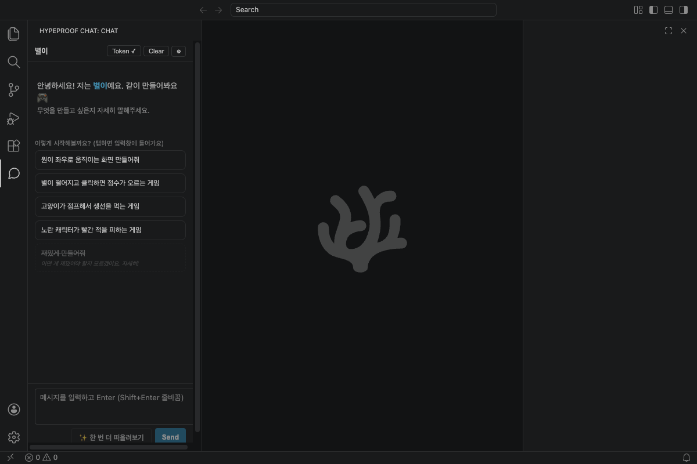
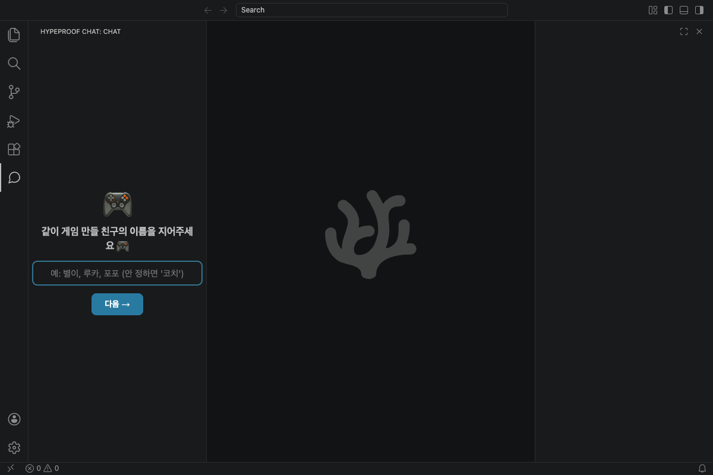
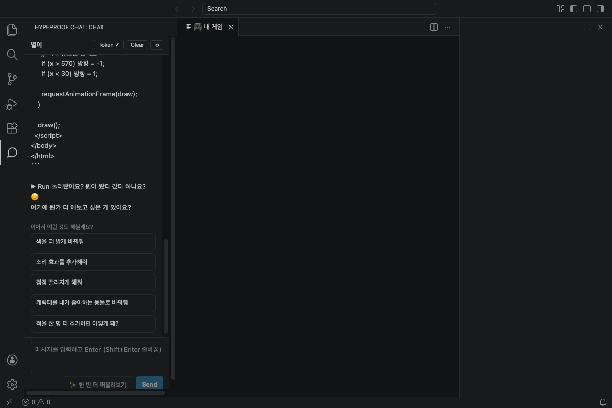
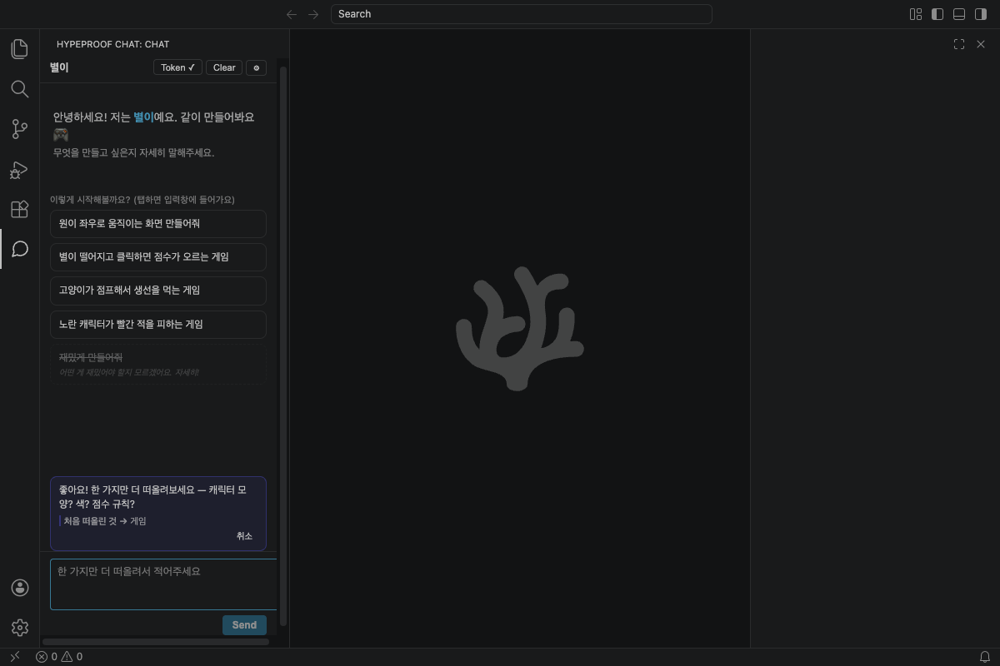

<p align="center">
  
</p>

<h1 align="center">HypeProof Studio</h1>

<p align="center">
  A VSCodium fork with a built-in AI coach — an IDE that teaches the human skills of working with AI models
</p>

<p align="center">
  
  
  
  
  
</p>

<p align="center">
  
</p>

<p align="center">
  <a href="./METAPLAN.md">Build plan</a> ·
  <a href="./docs/essence-v0.1.md">16 Essences</a> ·
  <a href="./docs/INSTALL.md">Install (workshop)</a> ·
  <a href="./docs/COHORT-AUTHORING.md">Authoring cohorts</a> ·
  <a href="./DEV-GUIDE.md">Dev guide</a>
</p>

---

## What it is

HypeProof Studio is a desktop IDE — a [VSCodium](https://vscodium.com) fork — built
to teach the **16 Essences**: the human capabilities a person needs when building
with AI models. The product is not the editor; it is the **coach** living in the
chat panel. Every UX decision (welcome flow, suggestion chips, the "think again"
button, manual-approve modals) serves one or more of those essences.

Product philosophy is fixed in [docs/essence-v0.1.md](./docs/essence-v0.1.md) —
the single source of truth. Do not fork or paraphrase it.

## Features

| | |
|---|---|
| **A coach, not an autocomplete** — the learner names their coach and builds with it conversationally. |  |
| **Guided suggestion chips** — good vs. weak prompts are shown side by side so the learner *feels* the difference, not just hears it. |  |
| **"Think again" expansion** — short inputs get rolled back into the learner so they practice articulating intent (Essence 8). |  |
| **Per-cohort profiles** — each workshop session is one profile file: system prompt, model policy, UX copy. Adding a cohort is one file, zero code. | See [docs/COHORT-AUTHORING.md](./docs/COHORT-AUTHORING.md) |

## Architecture

```
HypeProof Studio.app  ──►  hypeproof-chat extension  ──►  HypeProof Worker  ──►  Anthropic
   (VSCodium fork)          (React webview panel)        (Cloudflare, OpenAI-      (Claude)
                                                          compatible, per-cohort
                                                          profiles, token auth)
```

The webview never calls a model directly — all calls go through the Worker, which
injects the cohort's system prompt and enforces the session window.

## Platform support

| Platform | Status | Notes |
|---|---|---|
| macOS arm64 | ✅ Primary | Built and tested locally |
| Windows x64 | 🟡 Scaffolded | Build in GitHub Actions only (Phase 6) |
| Linux | ⬜ Not targeted | VSCodium base supports it; not a goal for v0.1 |

## Install

> For workshop participants — the one-line installer (published at release).
> Full guide: [docs/INSTALL.md](./docs/INSTALL.md).

<details>
<summary>macOS</summary>

```bash
curl -fsSL https://raw.githubusercontent.com/jayleekr/hypeproof-studio/main/scripts/install-mac.sh | bash
```
</details>

<details>
<summary>Windows</summary>

```powershell
iwr -useb https://raw.githubusercontent.com/jayleekr/hypeproof-studio/main/scripts/install-win.ps1 | iex
```
</details>

## Quickstart (contributors)

```bash
git clone --recursive git@github.com:jayleekr/hypeproof-studio.git
cd hypeproof-studio
cp hypeproof-studio.env.example hypeproof-studio.env   # fill in secrets
bash scripts/dev-stack.sh                              # wrangler dev + roster + token
cd e2e && npm install && npm test                      # 13 e2e tests against the built app
```

Worker dev runs at `http://localhost:8787` (admin UI at `/`). Cloned without
`--recursive`? Run `git submodule update --init`.

## Build from source (macOS arm64)

A full build is **1–2 hours** and writes **10–20 GB**. Do not run it casually.

```bash
cd vscodium-base
source ../hypeproof-studio.env        # APP_NAME, BINARY_NAME, … (overrides utils.sh)
bash get_repo.sh && bash prepare_src.sh && bash prepare_vscode.sh
bash ../scripts/run-build.sh ../logs/build-$(date +%Y%m%d-%H%M%S).log
```

Output: `vscodium-base/VSCode-darwin-arm64/HypeProof Studio.app`. Full procedure
and failure modes: [.claude/rules/build-pipeline.md](.claude/rules/build-pipeline.md).

## Repo layout

| Path | What |
|---|---|
| `vscodium-base/` | **Submodule** → [`jayleekr/vscodium`](https://github.com/jayleekr/vscodium) `@hps/main`. Pointer is pinned — bump deliberately only ([policy](.claude/rules/build-pipeline.md)). Never edit upstream files; add a patch under `vscodium-base/patches/`. |
| `extensions/hypeproof-chat/` | The chat-panel extension (React webview). Bundled as a built-in at Phase 5. |
| `worker/` | Cloudflare Worker — OpenAI-compatible proxy, per-cohort profiles, token auth. Production target. |
| `proxy-poc/` | Python proxy from early iteration (superseded by `worker/`). |
| `scripts/` | Build wrappers — `run-build.sh`, `dev-stack.sh`, `generate-platform-icons.sh`, `verify-branding.sh`. |
| `e2e/` | Playwright suite driving the built `.app`. |
| `docs/` | INSTALL, COHORT-AUTHORING, essence-v0.1, release guides. |
| `METAPLAN.md` | Phased build plan — the source of truth. Cross-reference by §N. |

## Upstream sync model

`VSCodium/vscodium` → `jayleekr/vscodium` (fork; `hps/main` carries brand patches)
→ submodule pointer bump in this repo (deliberate, reviewed) → tagged release.
Automation lands in Phase 6 (`.github/workflows/upstream-sync.yml`, `release.yml`).

## Contributing

Most contributions start as a noticing while using the Studio. The full
contributor guide is **[DEV-GUIDE.md](./DEV-GUIDE.md)** — bilingual (KR/EN),
built to be run by Claude Code (*"follow DEV-GUIDE.md"*) through pre-built
harness. [CONTRIBUTING.md](./CONTRIBUTING.md) is the quick map; the team is in
[CONTRIBUTORS.md](./CONTRIBUTORS.md).

## License

MIT, inherited from VSCodium ([`vscodium-base/LICENSE`](./vscodium-base/LICENSE)).
A root `LICENSE` will be added before public release. VSCodium and VS Code are
MIT-licensed; attribution to both **must remain** in the About dialog — do not
strip it. Brand assets under `assets/brand/` and `.github/assets/` are
project-specific and not covered by the upstream license.
