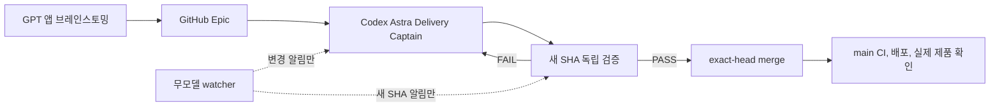

# HypeProof Delivery Captain 운영

> 상태: 활성
> 파일명은 consumer 호환성을 위해 유지한다. 5세션 운영은 2026-09-14 실험 실패로 폐기했다.
> 관련 작업: [Delivery Captain v2 #183](https://github.com/jayleekr/hypeproof-harness/issues/183)
> 폐기된 작업: [Control plane Epic #166](https://github.com/jayleekr/hypeproof-harness/issues/166)

## Exec Summary



기본 세션은 Delivery Captain과 Verifier 두 개다. Captain은 한 사용자 결과의
요구사항 확인, 구현, 테스트, PR 수정, 머지, 배포와 실제 제품 확인을 끝까지
소유한다. Verifier는 새 구현 SHA 또는 인수 revision에만 반응한다. watcher는
모델을 호출하지 않는 알림 도구이며 전달 상태 머신이 아니다.

## 실험 결과

PR #1047에서 한 구현 커밋보다 ACK, 동일 SHA 재검증, watcher token, 재배정 기록이
더 많이 생겼다. Claude A는 구현과 검증 사이의 필수 경유지가 됐고 컨텍스트가
가득 찼다. 반면 ACK와 라우팅 대기를 제거하고 기존 writer에게 네 결함 수정을
직접 지시하자 2분 39초 안에 새 SHA, 집중 테스트 21/21, worker 테스트와
typecheck 결과가 나왔다.

Unit 2는 코어 792줄과 테스트 416줄을 만들었지만 UI, adapter, 파일 저장과 실제
사용을 남겼다. 이 경험을 근거로 작업 단위도 수평 계층에서 사용자에게 보이는
수직 결과로 바꾼다.

## Intent

승인된 HypeProof 작업을 역할 전달 자체가 아니라 실제 제품 출시로 이어간다.
한 Captain이 사용자 결과를 끝까지 소유하고, 독립 검증은 새 revision에서만
실행하며, 감시 실패나 대화창 상태가 진행 중 구현을 멈추지 않게 한다.

## 요구사항

- **HAR-DEL-01 수직 출시:** Epic은 문서, 코어, adapter, UI가 아니라 사용자가 관찰할 수 있는 결과로 자른다.
- **HAR-DEL-02 단일 소유자:** Captain 한 명이 한 PR의 첫 수정부터 검증 결함 수정, 머지, 배포 확인까지 소유한다.
- **HAR-DEL-03 빠른 시작:** 시작 10분 안에 diff, 실패 테스트, 실제 재현 중 하나를 만든다. 외부 차단 없이 20분 동안 없으면 컨텍스트나 구현자를 교체한다.
- **HAR-DEL-04 직접 검증:** Verifier는 새 구현 SHA 또는 인수 revision만 검사하고 결과를 Captain에게 직접 보낸다.
- **HAR-DEL-05 최소 조정:** packet ID, session ACK, watcher token, 역할 상태 댓글은 구현이나 통합의 선행 조건이 아니다.
- **HAR-DEL-06 비용 경계:** 구현은 복잡한 수직 작업에 Astra를 우선 사용하고, 검증은 Sol을 기본으로 한다. polling에는 모델을 쓰지 않는다.
- **HAR-DEL-07 자동 통합:** 강제된 검사와 필요한 증거가 통과한 exact head는 reviewer를 요청하지 않고 Captain이 머지한다.
- **HAR-DEL-08 실제 완료:** merge, CI, preview, deployment와 실제 제품 관찰을 구분하고 기능 지도에는 관찰된 출시 상태만 적는다.
- **HAR-DEL-09 알림 watcher:** watcher는 revision별 알림을 한 번만 보내며 댓글, ACK, claim, token, 역할 판단을 만들지 않는다. watcher 실패는 진행 중 구현을 멈추지 않는다.

## 역할과 호출

| 역할 | 스킬 | 기본 모델 | 책임 |
|---|---|---|---|
| Delivery Captain | `hype-deliver` | GPT-6 Astra high | 사용자 결과를 구현부터 실제 출시까지 소유 |
| Verifier | `hype-verify` | GPT-5.6 Sol high | 새 revision의 독립 검증 |
| Intent specialist | `hype-intent` | Sol 또는 Astra | 실제 제품 모호성만 해결 |
| Studio specialist | `hype-studio` | Claude 또는 Codex | 비중첩 Studio 하위 작업 |
| Chalk specialist | `hype-chalk` | Claude 또는 Codex | 비중첩 Chalk 하위 작업 |
| Legacy recovery | `hype-coordinate` | 저비용 모델 | 기존 watcher/queue 정리만 수행 |

조정 전용 모델 세션은 기본 구성에 없다. 전문 구현자는 Captain이 파일이 겹치지
않는 범위를 줄 때만 잠깐 사용하고 commit SHA를 직접 반환한다.

## 전달 상태

```text
selected -> active -> reviewable_sha -> verified -> merged -> observed
                  \-> waiting_external
```

코드 diff, 실패 테스트, 재현 결과가 생기면 active다. 새 exact SHA가 검증 가능하면
reviewable_sha이고, PASS면 verified다. main merge 뒤 실제 제품까지 확인해야
observed다. session ACK, packet 전송, watcher token은 상태가 아니다.

## 출시 흐름

1. GPT 앱의 실행 결정은 결과, 가설, 미결정, 첫 실제 인수 방법을 담은 Epic으로 만든다.
2. Captain이 가장 작은 사용자 가시 수직 결과를 고르고 최신 main에서 시작한다.
3. 10분 안에 코드, 실패 테스트, 재현 중 하나를 만든다.
4. 코어, adapter, 저장, UI와 통합을 필요한 범위에서 함께 구현한다.
5. 새 SHA를 Verifier가 한 번 검사한다. FAIL은 Captain이 같은 브랜치에서 고친다.
6. 새 SHA에서 필요한 검사와 증거가 통과하면 Captain이 exact-head 머지한다.
7. main CI, 배포, 실제 URL 또는 설치 App을 확인하고 기능 지도와 Epic을 갱신한다.

인프라만 있는 PR은 부분 구현이다. 다음 수직 결과가 그 인프라를 실제로 사용하기
전까지 Epic이나 기능 지도를 완료로 바꾸지 않는다.

## Watcher 경계

기존 `delivery_delta.py`, `watch_delivery.py`, `wake_role.py`는 legacy 복구를
위해 당분간 보존한다. 이 도구의 ACK와 token은 제품 작업을 막지 않는다.

새 watcher는 다음만 수행한다.

- GitHub issue/PR revision, CI, merge, deploy 변화 감지
- 같은 revision의 중복 알림 제거
- 활성 PR은 Captain, 새 구현 SHA는 Verifier에 한 번 알림
- 상태가 같으면 모델 호출과 GitHub 쓰기 없음

열린 Claude/Codex 대화창 자체는 지속 감시자가 아니다. 실제 백그라운드 프로세스가
실행 중일 때만 감시가 지속된다.

## 검증 경계

exact-head CI와 의미 검증은 유지한다. 문서, local test, synthetic fixture, preview,
deployment, production URL, 설치 App과 사람 결과는 서로 다른 증거다. 검증자는
관찰하지 않은 항목을 NOT RUN으로 남긴다.

동일 구현 SHA와 동일 인수 revision 조합은 한 번만 검증한다. 리뷰 댓글이나 상태
표시만 바뀌었으면 테스트하지 않는다.
