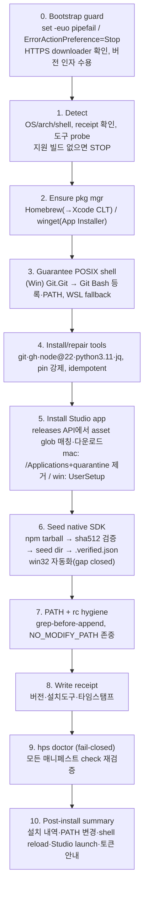

# HypeProof 설치 아키텍처 (Install Architecture)

> 이 문서는 HypeProof Studio 설치·부트스트랩 파이프라인의 **아키텍처와 실행
> 흐름**을 설명한다. 대상은 설치 경로를 유지·확장하는 메인테이너와, "왜 이렇게
> 설계했는가"를 알아야 하는 리뷰어다. 실제 워크숍 사용자용 5분 가이드는
> `docs/INSTALL.md`를 참고한다.

---

## 0. 한눈에 보기

두 개의 얇은 **OS 네이티브 부트스트래퍼**가 있다. macOS/Linux는
`curl -fsSL … | bash`, Windows는 `irm … | iex`로 실행되는 단일 자족(self-contained)
스크립트다. 둘 다 **하나의 버전 고정 의존성 매니페스트**(`hypeproof-deps.yaml`)를
유일한 진실의 원천(Single Source of Truth)으로 읽는다. 스크립트는 OS/arch/shell/기존
도구를 탐지하고, macOS는 Homebrew, Windows는 winget으로 **실제 런타임 의존성만**
설치한 뒤, Studio 앱을 내려받아 설치하고 네이티브 SDK 바이너리를 seed한다. 모든
PATH/rc 편집은 receipt 파일로 dedupe되어 재실행이 곧 idempotent 업그레이드가 되며,
마지막에 **fail-closed `hps doctor`**가 같은 매니페스트를 다시 검증하고 나서야
exit 0으로 끝난다.

핵심 설계 원칙:

| 원칙 | 구현 |
|---|---|
| **One SoT** | 매니페스트 하나. 설치 스텝을 다른 곳에 손으로 복제하지 않는다. |
| **Idempotent** | receipt(`receipt.json`) + grep-before-append. 재실행 = 업그레이드. |
| **Fail-closed** | doctor가 매니페스트 체크를 재검증. 하나라도 실패하면 non-zero exit + 조치 명령. |
| **OS-native pkg mgr** | mac=Homebrew, win=winget. 우리가 패키지 매트릭스를 재발명하지 않는다. |
| **POSIX shell 보장** | Windows에서 Git Bash를 강제 설치 → 번들 skill의 bash가 깨지지 않는다. |

---

## 1. 두 오디언스, 두 경로

설치 UX는 두 부류의 사용자를 동시에 만족시켜야 한다.

| 오디언스 | 니즈 | 경로 |
|---|---|---|
| **비개발자 워크숍 참가자** (예: SK바이오팜 가족) | 터미널 없이, 클릭만으로. | **자족형 앱** — 서명/설치된 Studio를 받아 실행, 토큰만 붙여넣기. 원라인은 이 과정을 자동으로 대신 수행한다. |
| **멤버 / 어드밴스드** (개발·기여자) | 런타임 의존성까지 완비된 재현 가능한 환경. | **원라인 부트스트랩** — mac `curl\|bash`, win `irm\|iex`. 의존성 provisioning + Studio + SDK seed + doctor 전부. |

핵심은 **두 경로가 하나의 명령으로 수렴**한다는 점이다. 원라인 부트스트랩은
비개발자용 클릭 흐름이 하던 일(OS 경고 walkthrough, quarantine 제거, setup 실행)을
전부 흡수한다. 그래서 기존 가이드에서 **살아남는 유일한 수동 단계는 워크숍 토큰
붙여넣기**(💬 아이콘 → Set token)뿐이고, 그 앞의 모든 단계는 복사-붙여넣기 한 줄로
접힌다.

---

## 2. 원라인 커맨드

### macOS / Linux

```bash
curl -fsSL https://raw.githubusercontent.com/jayleekr/hypeproof-studio-releases/main/install.sh | bash
```

버전 고정 실행(선택):

```bash
curl -fsSL …/install.sh | bash -s 0.1.33
```

### Windows

```powershell
irm https://raw.githubusercontent.com/jayleekr/hypeproof-studio-releases/main/install.ps1 | iex
```

플래그를 쓰려면 먼저 내려받아 실행:

```powershell
iwr -useb https://.../install.ps1 -OutFile install.ps1
powershell -ExecutionPolicy Bypass -File .\install.ps1 -y
```

### 공통 플래그 / 환경변수

| 플래그 / env | 효과 |
|---|---|
| `-y` / `HPS_NONINTERACTIVE=1` | 무인 모드 (프롬프트 없이 yes) |
| `INSTALLER_NO_MODIFY_PATH=1` | PATH / rc 파일을 절대 건드리지 않음 |
| `HPS_SKIP_STUDIO=1` (mac) | Studio 앱 + SDK seed 건너뛰고 의존성만 |
| `-DoctorOnly` (win) | 설치 없이 doctor 검증만 |
| `HPS_DEBUG=1` (mac) | xtrace |

---

## 3. 10-스텝 실행 흐름

두 스크립트는 같은 골격을 공유한다. 스텝별 책임:



스텝별 상세:

- **0. Bootstrap guard (fail-closed):** mac은 `set -euo pipefail`, win은
  `$ErrorActionPreference='Stop'`. 다운로더(curl/PowerShell)가 HTTPS로 동작하는지
  확인. `| bash -s 0.1.33` 같은 선택적 버전 인자 수용.
- **1. Detect:** `uname -sm` → darwin-arm64/darwin-x64 (mac);
  `$env:PROCESSOR_ARCHITECTURE` + Is64BitOperatingSystem → win32-x64 (win).
  receipt 파일로 기존 설치를 감지하고, 매니페스트 각 도구의 `check`를 probe한다.
  해당 플랫폼용 Studio 빌드가 없으면(예: Intel Mac / Linux) 깨진 앱을 설치하는
  대신 **명확한 메시지와 함께 중단**한다.
- **2. Ensure package manager:** mac은 `brew`가 없으면 Homebrew 설치(Xcode CLT
  트리거); win은 `winget`(App Installer) 존재 보장, 없으면 winget-cli release
  msixbundle을 side-load. 대화형 프롬프트가 살아 있도록 Homebrew의
  `bash -c "$(...)"` / winget UAC를 사용.
- **3. Guarantee a POSIX shell (Windows 핵심 수정):** winget으로 `Git.Git`을 설치
  → Git Bash가 함께 들어온다. `C:\Program Files\Git\bin\bash.exe`를 등록하고 PATH에
  추가해서 번들된 모든 `SKILL.md`와 `.sh`가 실행되게 한다. WSL은 fallback. mac은
  bash 기본 탑재.
- **4. Install/repair each tool (매니페스트 순서):** `check` 실행 → 없거나
  `min`/`pin` 미달이면 OS별 `via`+`pkg`로 설치, 이미 충족이면 skip(idempotent).
  node 22.22.1 / python 3.11 pin 강제. (curl은 preinstalled 가정)
- **5. Install the Studio app:** `hypeproof-studio-releases` API를 조회해 os-arch
  glob으로 asset을 골라 다운로드. mac은 `/Applications`로 unzip 후
  `xattr -dr com.apple.quarantine`; win은 UserSetup.exe를 per-user 실행
  (SmartScreen 우회 내장). 같은 버전이 이미 설치돼 있으면 skip.
- **6. Seed the native SDK binary (Scout gap 봉합):** 플랫폼 npm tarball을 받아
  pin된 매니페스트에 대해 sha512 검증, `claude`/`claude.exe`를 per-user seed
  디렉토리로 추출(mac `~/Library/Application Support/…`, win
  `%APPDATA%\HypeProof-Studio\sdk\<version>\`), `.verified.json` 기록. **win32이
  이제 자동화**됐다 — 더 이상 hard-error가 아니다.
- **7. PATH + shell-rc hygiene:** 모든 PATH/completion 라인을 append 전에 grep
  (mac은 brew shellenv, win은 Git Bash bin)해서 재실행이 프로파일을 중복·손상시키지
  않게 한다. `INSTALLER_NO_MODIFY_PATH` 존중.
- **8. Write the receipt:** 버전·설치 도구+버전·타임스탬프를 기록해 idempotency와
  향후 업그레이드 감지에 사용.
- **9. Fail-closed `hps doctor`:** 모든 매니페스트 `check` + node/python pin +
  Studio 앱 존재 + SDK `.verified.json` + POSIX bash 도달성 + git 존재 + gh auth
  도달성(warn, fail 아님)을 재검증. 하드 실패 하나라도 있으면 정확한 조치 명령과
  함께 non-zero exit.
- **10. Post-install summary:** 무엇을 설치했는지, PATH가 바뀌었는지, shell을
  재시작/reload하는 한 줄, Studio가 실행된다는 안내, 그리고 남은 단 하나의 수동
  단계(💬 아이콘으로 워크숍 토큰 붙여넣기)를 출력.

---

## 4. 의존성 SoT (`hypeproof-deps.yaml`)

부트스트래퍼와 doctor는 **하나의 매니페스트만** 읽는다. 설치 스텝을 다른 곳에서
손으로 유지하지 않는다 — 의존성을 추가하거나 bump하면 설치기와 doctor가 자동으로
반영한다.

> **두 매니페스트의 관계.** harness 전체가 참조하는 광의의 도구 목록은
> `dependencies.yaml`(schema_version 1, tier: required/recommended/dev/maintainer,
> pip_packages 포함)이다. 런타임 설치기(install.sh / install.ps1)가 실제로 embed해
> 읽는 것은 그 중 **REAL 런타임 부분집합**인 `hypeproof-deps.yaml`이다. 후자는
> Scout real-deps 감사(Scout 2/3 + check-env.sh)에 근거하며 **빌드타임 전용 도구는
> 의도적으로 제외**한다.

### 런타임 도구 (installer가 프로비저닝)

| id | 왜 필요한가 | mac (`via`/pkg) | win (`via`/pkg) | 버전 |
|---|---|---|---|---|
| `git` | 번들 skill의 commit/merge/sync + 모든 repo 스크립트 | brew/git | winget/`Git.Git` | min 2.30 |
| `bash` | 모든 SKILL.md·`*.sh`가 REAL bash(`[[ ]]`, `set -euo pipefail`) 사용 | preinstalled(3.2 OK) | bundled-with `Git.Git` | min 4.0 |
| `gh` | harness 전반 21+ gh subprocess 호출; PR/review/merge/create-pr | brew/gh | winget/`GitHub.cli` | min 2.40 |
| `node` | Studio 런타임 + `.mjs` + `npx wrangler deploy` | brew/`node@22` | winget/`OpenJS.NodeJS.LTS` | **pin 22.22.1** |
| `python` | 모든 `*.py` operator 스크립트 + skill-creator | brew/`python@3.11` | winget/`Python.Python.3.11` | **pin 3.11** |
| `jq` | check-env.sh + studio install 힌트 (독립 바이너리, `gh --jq` 아님) | brew/jq | winget/`jqlang.jq` | min 1.6 |
| `curl` | studio health-check/download + 이 설치기 자체의 bootstrap | preinstalled | preinstalled (Win10+ curl.exe) | — |

`bash`는 Windows에서 `Git.Git`이 함께 제공(`C:\Program Files\Git\bin\bash.exe`),
없으면 WSL(Ubuntu) fallback. `node`는 npm/npx를 제공하며 wrangler는 npx-only.

### Studio 앱 / SDK

- **Studio:** releases_repo `jayleekr/hypeproof-studio-releases`, version `0.1.33`.
  asset glob — darwin-arm64(1급 타깃), darwin-x64(없을 수 있음 → fail-closed),
  win32-x64(`*UserSetup-x64-*.exe`, fallback `*Setup-x64-*.exe`).
- **SDK:** npm 패키지 `@anthropic-ai/claude-code`, Studio 기대치
  (`sdkBinaryManifest.ts`)와 일치하는 version pin. sha512 검증 후 `.verified.json`
  기록. seed dir는 darwin `~/Library/Application Support/HypeProof-Studio/sdk/<version>/claude`,
  win32 `%APPDATA%\HypeProof-Studio\sdk\<version>\claude.exe`.

### 의도적 제외 (빌드타임 전용 — 재추가 금지)

`gsed`, `rsvg-convert`, `icns2png`, `icotool`, `composite(imagemagick)`,
`rustup/cargo/rustc`, `InnoSetup`, `7z`, `openssl`, macOS 전용 launcher(`open`,
`screencapture`). 이들은 런타임 경로에 필요 없으며, 매니페스트에 명시적으로
제외 기록을 남겨 누구도 다시 넣지 않게 한다.

### 동작 계약 (behavior)

- **idempotency:** receipt(`~/.hypeproof/receipt.json` mac /
  `%APPDATA%\HypeProof-Studio\receipt.json` win); 모든 PATH/rc 편집은
  grep-before-append; 재실행 == 업그레이드.
- **fail_closed:** doctor 시점에 실패하는 매니페스트 체크는 non-zero exit +
  실행 가능한 조치 명령.
- **unattended:** `HPS_NONINTERACTIVE=1` / `-y`; `INSTALLER_NO_MODIFY_PATH` 존중.

---

## 5. Fail-closed doctor

`hps doctor`는 설치기의 마지막 스텝이자 독립 실행 가능한 검증기다. **설치에 쓴 것과
정확히 같은 매니페스트**를 다시 검사하므로, "설치는 됐는데 실제로는 동작 안 함"
상태를 잡아낸다.

검사 항목:

1. 모든 매니페스트 도구의 `check` 재실행 + 버전 파싱.
2. node 22 / python 3.11 pin 재확인.
3. Studio 앱 존재 (mac: `/Applications/HypeProof Studio.app`, win: receipt marker).
4. SDK seed + `.verified.json` 존재.
5. 도달 가능한 POSIX bash (Git Bash 또는 WSL).
6. git 존재 + (win) `core.autocrlf=false`, `core.longpaths=true`.
7. `gh auth status` — **warn만, fail 아님** (인증은 사용자 몫).

하드 실패가 하나라도 있으면 doctor는 실패 목록과 조치 명령("새 터미널을 열어
PATH를 반영하고 재실행", "설치기 재실행(idempotent)", "`gh auth login`")을 출력하고
non-zero로 종료한다. 성공하면 `doctor: ALL CHECKS PASSED`.

> **경계선.** doctor는 gh **인증 상태**나 SDK 자가치유(Studio 첫 실행 시 self-heal)
> 같은 항목은 warn으로만 둔다. 하드 fail은 "이게 없으면 harness 스크립트가 못
> 돈다"는 항목에 한정한다.

---

## 6. win32 SDK-seeding gap (이제 봉합됨)

이전 흐름의 최대 결함은 **Windows에서 네이티브 SDK 바이너리 seed가 자동화되지
않았다**는 점이었다(Scout 2/3에서 드러난 gap). 그 결과 번들된 git/gh/bash 기반
skill이 Windows에서 깨졌다.

봉합 방식(`install.ps1` §11 `Seed-Sdk`):

1. `npm view <pkg>@<ver> dist.tarball` / `dist.integrity`로 tarball URL과 무결성
   해시를 조회 (버전 mismatch면 latest fallback).
2. tarball 다운로드 후 **sha512 검증** — 매니페스트 pin이 있으면 그것과, 없으면
   npm 레지스트리 integrity(`sha512-…`)와 대조. **불일치 시 seed 거부(fail-closed).**
3. tarball에서 win32-x64 `claude.exe`를 추출. tarball에 prebuilt 바이너리가 없으면
   `npm install`로 materialize한 뒤 복사.
4. `%APPDATA%\HypeProof-Studio\sdk\<version>\claude.exe`로 복사하고, seed 바이너리의
   sha512를 포함한 `.verified.json`을 기록.

이로써 win32은 **hard-error가 아니라 검증된 자동 seed** 경로를 갖게 됐고, doctor의
SDK 체크가 mac/win 양쪽에서 동일하게 green을 요구한다.

---

## 7. CI 매트릭스 게이트

현재 Windows는 manual dispatch / tag에서만 빌드되고 **PR CI에서 런타임 경로가
전혀 테스트되지 않는다**. 부트스트랩 파이프라인이 실제로 안전해지려면 이 공백을
닫아야 한다.

- **windows-2022**와 **macos-14** 러너에서 `hps doctor`를 실행하는 CI job을 추가.
- 이로써 Windows 런타임 경로(Git Bash 보장 + SDK seed)가 병합 전 처음으로
  검증된다.
- doctor가 fail-closed이므로, 매니페스트가 만족되지 않으면 CI가 red → 병합 차단.

즉, 매니페스트가 진실의 원천이고, 같은 매니페스트를 두 OS 러너에서 doctor로
검증하는 것이 divergence(예: install.sh와 install.ps1이 embed한 버전 drift)를 막는
안전망이다.

---

## 8. 주요 리스크

| 리스크 | 성격 | 완화 |
|---|---|---|
| **서명 없는 installer / OS 악성코드 경고** | 128/162MB unsigned 빌드; mac Gatekeeper, win SmartScreen | 설치기가 quarantine 제거(mac) / Unblock-File + SmartScreen 우회 setup(win)으로 walkthrough를 흡수. 장기적으로 코드서명 필요. |
| **private-repo raw-URL mismatch** | README/INSTALL이 서로 다른 raw URL을 가리킴 | 신뢰 도메인(`hypeproof.ai`)으로 호스팅 통일 + README/INSTALL 링크 수정. |
| **Windows에서 번들 skill 깨짐** | POSIX bash 부재 (Scout 2/3) | `Git.Git` 강제 설치로 Git Bash 보장 + doctor가 POSIX shell 도달성 강제. |
| **win32 SDK seed 미자동화** | 과거 hard-error | §6대로 자동 seed + sha512 검증으로 봉합. |
| **embed된 매니페스트 drift** | install.sh/install.ps1의 inline 값이 SoT와 어긋남 | win 스크립트는 원격 매니페스트에서 버전 필드를 refresh; CI 매트릭스 doctor가 divergence를 잡음. |
| **플랫폼 빌드 부재** | Intel Mac / Linux에 Studio 빌드 없음 | Detect 스텝에서 깨진 앱 설치 대신 명확히 STOP(fail-closed). |
| **PATH/프로파일 손상** | 재실행 시 중복·오염 | grep-before-append + receipt dedupe; `INSTALLER_NO_MODIFY_PATH` 지원. |

---

## 9. 단계적 롤아웃 (Phased Rollout)

현재 가이드(hypeproof-ai.xyz/adult-edu/boa #download)는 터미널 없는 수동 흐름이다 —
unsigned installer를 받아 OS 경고를 클릭으로 넘기고 토큰을 붙여넣는데, **의존성
프로비저닝이 전혀 없어서** 번들 skill이 Windows에서 깨진다. 이를 단계적으로 교체한다.

1. **호스팅 통일.** `install.sh`, `install.ps1`, `hypeproof-deps.yaml`을 짧은 신뢰
   도메인 `hypeproof.ai`(CDN + 통제된 redirect)에 올리고, README·`docs/INSTALL.md`가
   그곳을 가리키게 고쳐 private-repo raw-URL mismatch를 제거한다.
2. **원라인을 1급 경로로.** 두 원라인을 다운로드 페이지의 **PRIMARY "Install"**
   경로로 만든다. raw `.exe`/`.zip`은 터미널이 없는 사용자를 위한
   "Advanced / offline" fallback 링크로 강등한다.
3. **점진적 shipping.** `install.sh`를 먼저 출시(mac이 오늘 흐름과 저위험으로
   parity 달성) → 그다음 Git Bash 보장 POSIX shell을 갖춘 `install.ps1`(이것이
   Windows에서 skill이 깨지는 걸 멈추는 핵심) → 마지막으로 win32 자동 SDK seeder를
   배선한다.
4. **CI 게이트 추가.** windows-2022 + macos-14 러너에서 `hps doctor`를 돌리는 job을
   추가해 Windows 런타임 경로가 병합 전 처음으로 테스트되게 한다.
5. **walkthrough 흡수 + 아카이브.** 설치기가 OS 경고 walkthrough를 대체(mac
   quarantine 제거, win setup 실행)하고 Studio를 실행한 뒤 토큰 붙여넣기를
   안내하므로, 가이드의 **토큰 단계만 유일한 수동 액션으로 남는다.** 기존
   클릭-through 가이드는 doctor가 두 러너에서 green이 될 때까지 offline fallback으로
   아카이브 보존한다.

---

## 부록: 참고 파일

| 파일 | 역할 |
|---|---|
| `hypeproof-deps.yaml` | 런타임 설치기 SoT (installer/doctor가 embed) |
| `dependencies.yaml` | harness 전체 도구 매니페스트 (tier + pip_packages) |
| `install.sh` | macOS/Linux 부트스트래퍼 |
| `install.ps1` | Windows 부트스트래퍼 |
| `docs/INSTALL.md` | 워크숍 사용자용 5분 설치 가이드 |
| `docs/MEMBER-GUIDE.ko.md` | 멤버 온보딩(플랫폼 정책 §0) |
