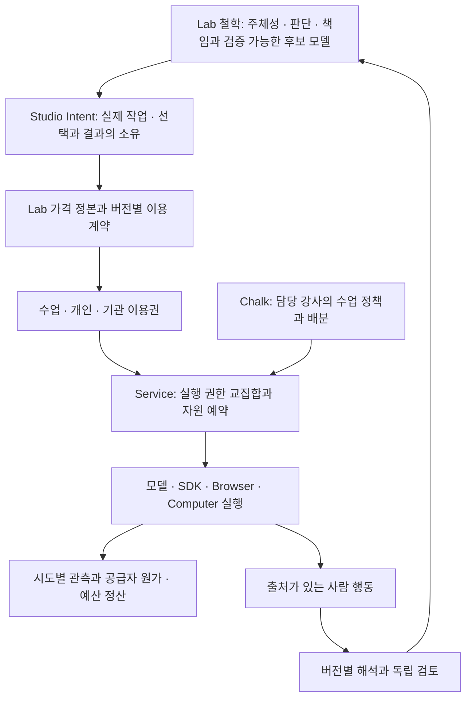

# Pricing에서 실행·정산까지의 설계

2026-09-08 · 상태: 단계별 구현 중 · #800. [요구사항 AB-01~18](../requirements/access-budget-settlement.md).
Lab #777의 개념 개정안에 맞춘 제품 설계이며, 운영 가격·새 결제 서비스의 채택을 뜻하지 않는다.

## 철학에서 제품으로

인간의 목적·판단·통제·책임을 보존한다는 철학에서, 제품은 **누가 무엇을 허용했고 누가 비용을
부담하는지 사용자가 이해하며 작업을 이어갈 수 있게 한다**는 Intent를 둔다. 구독형·수업형은
이 Intent를 제공하는 방식이다. 유료 기능으로 판단을 대신하거나 연구 참여를 강요하지 않는다.



가격은 Lab `web/src/lib/pricing.ts`에 위임한다. 기존 견적용 `SEAT_HOUR_COST`와
`STUDIO_PASS_PRICING`의 예시·열린 결정을 복사해서 게이트 기본값으로 만들지 않는다.
[상위 상품 Intent 개정안](https://github.com/jayleekr/hypeprooflab/blob/ca2e97d08ff1e737d5fab85ac47235a2391dd3e4/products/studio/access-and-pricing-intent.md)와 실제 source revision을
채택 기록에 연결한다. 공개 가격표와 Service의 계약이 달라지면 게시를 중단하고 차이를 표시한다.

## 네 가지 서로 다른 기록

| 기록 | 담을 내용 | 버전·정본 |
|---|---|---|
| 상품/계약 | SKU, 기능, 포함 meter/단위, 유효기간, 갱신/이월/초과 규칙, 비용 부담 방식 | Lab pricing source SHA + 불변 plan/contract revision. Service에는 검증된 게시본 |
| 이용권/배분 | 지급 근거, 사용자·기관·수업 범위, 기간, 비용 출처, 위임 권한, 가용 자원 | Service가 기존 계정/기관/수업 관계와 연결. 하나의 권한 집행 경로 |
| 실행/원가/예산 | 작업과 시도 ID, 공급자 관측, 예약·정산·조정, 가격표 revision, 청구 대조 ID | 기존 사용량 경로를 확장. 공급자 요금표와 판매 가격표는 별개 |
| 학습 관측/해석 | 사람/AI/정책 actor, 도움 조건, 원자료 참조, 후보 모델/rubric 버전, 불확실성 | 기존 observation/evidence 계약. 회계 화면에 원문 자동 수집 금지 |

결제 계정은 learner ID가 아니고, 수업 출석은 구독이 아니며, 강사 역할은 예산 소유권이 아니다.
현금 매출·급여·로열티는 Lab의 기존 사업 원장에 위임한다. 연결은 승인된 거래 ID와 정산 결과로 한다.

## 권한과 자원의 합성

| 주체 | 조회 | 변경 |
|---|---|---|
| 학생/개인 | 본인 이용권·선택 출처·작업·잔여 상태 | 허용된 모델/Effort/출처 선택, 추가 허용 요청 |
| 담당 강사 | 배정된 기수·학생의 수업 이용량과 미정산 | 배정 상한 안의 재배분·개별 추가 허용·신규 작업 정지 |
| 기관 예산 관리자 | 자기 기관 계약·공용/기수 배분 | 위임 한도 안의 기수/강사 할당 |
| 플랫폼 운영자 | 승인된 범위의 공급자 원가·미정산·청구 차이 | 증거와 사유가 있는 정산 조정. 가격/결제 권한은 별도 |

이는 새 인증 역할을 즉시 추가한다는 뜻이 아니다. 기존 issuer/강사/운영자 인증과 기관·수업
배정을 조사해 권한을 매핑한다. 개인 구독 주체 모델이 없으면 그 계약부터 확장한다.
Service가 모든 write를 확인하며 UI 숨김은 권한 검사가 아니다.

실행 전 순서:

1. 기존 인증으로 actor와 대상 작업·수업·기관 관계를 확인한다.
2. 서버의 유효한 계약 revision과 명시적으로 선택된 비용 출처 하나를 찾는다.
3. 플랫폼 ∩ 기관 ∩ 이용권 ∩ 수업/단계 ∩ 사용자 승인 ∩ 실제 런타임 지원을 평가한다.
4. 필요한 모델·도구·도메인·Effort가 허용되는지 확인한다. 이름 변경·BYO·고가 플랜은 이 교집합을 넓히지 않는다.
5. 비용/이용량의 상한을 구하고 공용 자원·개인 사용 상한·슬롯을 원자적으로 예약한다.
6. 예약이 확정된 뒤 공급자에 전송한다. 시도별 실제 요청을 작업에 연결한다.

교집합은 기능 허용 집합의 규칙이다. 여러 이용권의 금액을 자동 합산하는 공식이 아니다.
기수 배분이 상위 풀을 미리 차감했다면 실제 사용을 상위 풀에서 다시 차감하지 않는다.
학생별 값은 같은 풀의 **사용 상한**인지, 독립 **전용 할당분**인지 타입으로 구분한다.
다른 단위의 한도는 각각 검사한다. 기관 풀·기수 할당·학생 잔액을 더해 총자원으로 표시하지 않는다.

구독자가 수업에 참여하면 수업 정책을 계속 적용한다. 개인 출처 전환을 수업이 허용하고
본인이 선택한 경우에만 새 작업에 사용한다. 수업 중의 우회가 아니라 개인 작업으로 옮기는 경우에도
기존 수업 자료의 공유·내보내기 권한과 아동/기관 정책을 다시 확인한다.

## 예약과 정산

작업 ID는 사용자의 작업을, 시도 ID는 각 실제 공급자 호출을 가리킨다. 기존
`model_usage_requests.request_id`는 시도 증거로 재사용하고 `usage_log`는 역사적 호환 경로로
둔다. `usage_request_settings`는 설정 증거다. 셋의 행을 합쳐 비용을 세지 않는다.
SDK 보조 요청·도구 호출·모델 비교 fan-out에도 부모 작업을 연결한다.

개념적 상태는 다음과 같다. 구현 시 기존 schema에 대한 migration을 별도 검토한다.

```text
예약 → 전송 → 관측 완료 → 가격 계산 가능 → 정산
           ↘ 부분/미보고 → 미정산 유지 → 지연 증거/청구 대조 → 조정
예약 → 미전송 확인 → 취소·반환
```

실행 종료, usage 보고, 가격 계산, 예산 반영을 독립 상태로 둔다. 중지 응답이나 HTTP 오류가
발생해도 이미 사용한 비용은 남는다. 누락 usage를 취소로 바꾸지 않는다. 예약 만료는 조사
대상을 만든다. 비용 예약 반환과 실행 슬롯 해제를 같은 타이머에 묶지 않는다. 슬롯을 다시
열려면 이전 실행의 종료 또는 격리가 증명되어야 한다.

한 자원 계정에서 `보수적 가용 = 지급량 - 확정 차감 - 아직 차감에 포함되지 않은 예약`이다.
부분량을 확정 차감했다면 그 부분을 예약에서도 제외해 이중 차감하지 않는다. 상한을 넘는
실제 비용은 숨기거나 0으로 clamp하지 않고 초과 노출로 기록한다. 정산·예약·조정은 재시도에
멱등해야 하며, 어느 조건에서 총액이 완전한지 명시한다.

출력 한도만으로 SDK 전체 작업의 원가 상한이 되지는 않는다. 공급자 시도별 입력·출력·캐시,
자동 반복·보조 호출·검색·sandbox 시간·저장 같은 meter를 포함한다. 확실한 상한이 없으면
노출 한도를 별도 명시하거나 해당 유료 실행을 허용하지 않는다. 로컬 BYO 호출을 Service가
관측/차단하지 못한다면 플랫폼이 외부 계정의 정확한 잔여·강제 상한을 보장한다고 표시하지 않는다.

가격표는 공급자/실제 모델/protocol/service tier/캐시 TTL/지역·기간/도구와 출처 revision을 가진다.
정수 금액 단위와 유리수 요율, 반올림 위치를 고정한다. USD 공급자 원가와 KRW 계약 예산을
연결하려면 승인된 환산 정책·시각·revision이 필요하다. 세금·크레딧·청구 조정은 별도 항목이다.
확인되지 않은 차원은 미정산으로 남긴다. 과거 불완전 행을 현재 단가로 소급 확정하지 않는다.

## 구독 생명주기와 변경

기간은 시작/끝의 UTC 시각과 계약상 달력·시간대를 고정한다. 한 달을 30일로 가정하지 않는다.
갱신 지급은 계약+기간당 한 번이다. 중복 이벤트는 무시하고 역순 이벤트는 현재 권한 상태를
조회·검증한 뒤 적용한다. 로그인이나 결제 성공 화면은 지급 근거가 아니다.

취소 예약은 계약상 만료까지의 사용과 구분한다. 연체·환불·다운그레이드·중도 변경은 상품의
정책이 있어야 처리한다. 임의 유예나 자동 과금은 만들지 않는다. 진행 중인 시도는 시작 때
예약과 계약 revision으로 정산하고 새 요청부터 변경 정책을 적용한다. 강사의 예산 축소가
기존 예약 아래로 내려가면 신규 실행을 멈추거나 수정을 거부하며 기존 지출을 지우지 않는다.

결제 공급자는 아직 선택하지 않았다. 설계 근거로 확인한
[Stripe entitlements](https://docs.stripe.com/billing/entitlements?dashboard-or-api=api)는 상품 기능과
활성 이용권을 구분하며, [webhooks](https://docs.stripe.com/webhooks)는 이벤트 중복·순서에 대한
처리를 요구한다(2026-09-08 확인). 이 사례를 HypeProof의 구현 완료나 공급자 채택으로 읽지 않는다.
BYO 또한 공급자의 현재 지원 방식·제품 조건과 실제 Studio 경로를 검증해야 한다.
[Anthropic Agent SDK 구독 안내](https://support.claude.com/en/articles/15036540-use-the-claude-agent-sdk-with-your-claude-plan)
같은 공급자 문서만으로 HypeProof의 로그인 연동이 구현됐다고 주장하지 않는다.

## 배치와 현재 코드의 차이

| 위치 | 구현할 책임 | 현재 기준 `c2d3a055`에서 확인한 차이 |
|---|---|---|
| Module | 교수 전략·허용할 기능 요청·수업 단계 | 기존 frozen authoring/effort를 재사용. 상품 구매나 예산 증액 명령을 담지 않음 |
| Service | 계약 게시/이용권·가격 revision·권한·예약·정산·역할별 조회 | #843은 성인 비교 프로필의 회차 요청 횟수/좌석 슬롯과 보고 상태. 금액·구독·기관 공용 예산이 아님 |
| Chalk | 담당 수업 정책·배분·추가 허용·미정산 개입 | 기존 authoring/강사 인증 확장. UI 계산값을 집행 값으로 사용하지 않음 |
| App | 실제 모델/Effort/사용 출처·부족 사유·중지/결과 보존 | #839의 모델/Effort UI 재사용. 서버 revision과 지원 여부 표시 |
| 기존 운영자/사업 경로 | 원가 대조·확정된 집계와 거래 연결 | #840은 최근 사용 기록과 unknown cost. 매출/강사료는 Lab 사업 원장 |

`finishModelRequest`는 pending에서 terminal로 한 번만 바뀐다. 지연 보정을 수용하는 별도
조정 계약이 필요하다. 현재 슬롯 제어를 통화 예산의 증거로 쓰지 않는다. schema/인증을
새로 만들기 전에 `worker/src/lib/model-usage.ts`, 기존 `usage_log` 저장과 수업 binding을 대조한다.

초기 검증은 합성 계약과 별도 대상에서 한다. 기존 수업을 자동 이관하지 않는다. 적용 대상에서는
SDK/proxy/이전 앱 모두 서버 게이트를 지나야 한다. 배포 gate는 [검증 계획](../testing/capability-and-access.md)과
[Epic 순서](../plan/capability-and-pricing-epics.md)를 따른다.


## P1 게시와 운영 경계

1. Lab의 확정 상품을 `hps-access-plan/1` artifact로 작성하고 source commit·파일 SHA-256·PRICING_VERSION을 넣는다. 모델 공급자 단가와 견적용 시간 원가를 복사하지 않는다.
2. `cd worker && node --experimental-strip-types scripts/verify-access-publication.mjs PLAN.json LAB_CHECKOUT`로 해당 commit의 원본 hash/version을 대조한다. 이 명령은 내용을 출력하거나 운영 설정을 바꾸지 않는다.
3. 포함량·모델·갱신 등 상업 조건을 별도로 검토한 **정확한 artifact digest**만 `HPS_ACCESS_APPROVED_PLAN_DIGESTS`에 게시할 수 있다. source 검증 성공만으로 포함량이 승인되지는 않는다. 현재 승인 목록/판매 활성화는 추가하지 않았다.
4. migration `0007-access-contracts.sql`을 기존 순서대로 적용하고 명시적 opt-in 뒤, 기존 admin 인증으로 `/admin/access/plans` 및 `/admin/access/events`에 게시한다. 이벤트는 확인된 계약/공급자 snapshot 참조와 단조 증가 source_version을 요구한다. 클라이언트 결제 성공 redirect는 신뢰하지 않는다.
5. `/admin/access/accounts/:id`는 개인 계정을 기존 adult profile에 연결한다. `/token`은 기존 HMAC으로 짧은 계정 식별 토큰만 발급하며 이용량을 만들지 않는다. cohort-local 좌석 연결과 기관 소속은 admin-only다.

D1의 [batch transaction 의미](https://developers.cloudflare.com/d1/worker-api/d1-database/#batch)를 사용해 이벤트·현재 계약·불변 기간을 함께 쓴다. 같은 기간의 수정은 transaction 전체가 실패한다. 원본 이벤트는 남고, 낮은 source_version은 현재 권한을 되돌리지 않는다. 판매/결제·강사 지급 처리는 이 API에서 발생하지 않는다.

P1 되돌리기는 새 게시/계정 연결/계약 opt-in을 중지하는 것이다. 운영 금액 집행이 시작된 뒤 전역 플래그를 끄면 안 된다. 후속 P3에서는 새 유료 실행을 먼저 정지하고 이미 예약된 작업을 정산한 뒤 코드 변경을 되돌리는 별도 절차가 필요하다. additive 테이블이나 기존 기간/이벤트를 삭제하는 rollback은 없다.


## P2 원가 관측과 보정

`hps-usage-price/1`은 판매 상품과 독립적이다. `/admin/access/usage/prices`에서 exact digest 승인된 공급자 원가표만 운영 게시할 수 있다(`HPS_USAGE_APPROVED_PRICE_DIGESTS`). 새 승인 목록을 바꿔도 진행 중 시도는 원래 표를 읽는다. 합성 가격은 dev-only다. 정수 micro 단위의 meter별 ceil/최종 FX ceil은 계약에 표시되며, 실제 invoice 반올림 차이는 조정으로 보고한다.

`/admin/access/usage/attempts`는 기존 시도 ID의 확인된 과거 귀속/시험 및 P3 전송 전 등록을 위한 서버 경로다. 일반 학생/강사는 쓸 수 없다. SDK와 proxy는 실제 완료 marker, 원시 사용량 중 whitelist된 수치, 실제 모델·tier·geo만 읽으며 응답 본문을 새 원장에 저장하지 않는다. 중도 EOF는 완료 marker로 간주하지 않는다.

`/admin/access/usage/evidence`는 같은 실제 시도의 누적 snapshot version을 받는다. 동일 보고/ACK 소실 재시도는 한 번, 낮은 version은 현재값 변경 없이 이력만 남긴다. 기존 시도의 반환 모델·가격 정보가 보완되면 `provider-reconciliation`과 확인 참조/당시 가격 revision으로 새 증거를 추가한다. 현재 가격으로 과거 미확인 비용을 자동 확정하지 않는다. `/invoice-adjustments`는 청구 차이와 사유를 별도 저장한다. `/jobs/:id`는 최대 1000행과 잘림 여부, 기준 시각, 원가와 조정을 분리해 반환한다.

공식 schema 근거(2026-09-08 조회): [Anthropic Messages usage](https://platform.claude.com/docs/en/api/messages/create), [Anthropic 가격 차원](https://platform.claude.com/docs/en/about-claude/pricing), [OpenAI Chat Completions usage/service tier](https://developers.openai.com/api/reference/resources/chat/subresources/completions/methods/create), [OpenAI 가격 차원](https://developers.openai.com/api/docs/pricing). 테스트의 요율·환율·상한은 합성 수치이고 실제 판매 가격/원가표가 아니다.

신규 설치 schema에 빠져 있던 기존 migration 0006의 model_usage_requests 정의도 추가했다. 기존 migration은 수정하지 않았으며, 운영 반영은 기존 0006/0007 다음 0008을 적용한다. 가격 미상/지원하지 않는 meter를 무료로 해석하지 않는다.


## P3 원자적 실행과 복구

migration `0009-budget-admission.sql`은 budget accounts/limits/roots/runtime prices, reservation/lines/scopes와 수정 이력을 추가한다. 루트 생성은 immutable 계약의 included 자원만 사용하며 로그인을 새 지급으로 해석하지 않는다. 반 allocation은 상위 grant를 선배정하므로 하위 실제 사용을 상위 사용으로 다시 합산하지 않는다. 학생 cap은 배정 자원이 아닌 공유 사용 상한이며 전역 account cap을 여러 반에 적용할 수 있다.

Service는 변환된 공급자 body에서 model/output/도구를 확인한 뒤 `usageAttemptStatements`와 자원/슬롯 예약을 같은 D1 batch에 넣는다. 현재 계약·기간·D1 계정 관계·코스/예산 revision·각 meter·동시 시도를 SQL에서 재확인한다. 하나라도 맞지 않으면 CHECK 제약이 전체 batch를 rollback한다. 기존 KV의 서명 폐기·roster·수업/pause 게이트는 전송 요청의 선행 확인이며 D1과 분산 transaction이라고 주장하지 않는다. 실제 전송 직전 reserved → sent CAS는 한 번만 성공한다. 예약 후 ACK 소실은 자동 재전송/반환하지 않는다.

`budget_line_balances`는 최신 누적 원가 증거와 invoice adjustment에서 사용·예약·초과를 읽는다. 별도의 비용 delta 원장을 더하지 않으므로 중복 보고가 이중 차감되지 않는다. 실행 ended는 슬롯을 돌려주지만 누락된 원가는 예약을 유지한다. timeout/Stop/EOF는 종료 증명이 아니다. 운영자는 실제 공급자 확인 후 `/admin/access/usage/evidence`에 높은 revision의 종료·원가 증거를 보낸다. 미전송 취소는 reserved에 대한 execution-proof만 허용한다. 원가 초과는 음수 잔여로 보존하고 관련 기간의 새 실행을 막는다. 음수 invoice credit은 초과 부분을 unapplied_credit으로 표시하여 계약 포함량을 늘리지 않는다.

가격의 bounds는 운영자가 명시적으로 검토한 최대 노출이며 프롬프트 문자 수로 추측한 토큰 수가 아니다. 출력 상한은 실제 outgoing max_tokens/max_completion_tokens로 제한한다. 누락/지원하지 않는 meter는 거부한다. 입력·캐시가 검토한 노출을 넘으면 실제 원가와 초과를 보존하므로 이 설정을 공급자 과금의 절대 상한이라고 표현하지 않는다. 공급자 tier/region은 승인된 가격에 맞춰 pin/확인한다. 원가와 과금 확정에 필요한 실제 공급자 검증은 P5의 별도 출시 조건이다.

운영 API는 기존 admin 인증 아래 `/admin/access/budgets` 생성, `/children` 배정/상한, `/:id` 조회/수정이다. 실제 가격·전체/개인 슬롯·최대 노출 참조를 생략한 자동 활성화는 없다. HPS_ACCESS_CONTRACTS를 꺼도 기존 D1 예산 필수 수업은 닫힌다. 개인/명시된 이용권 요청도 거부한다. P1 이전 스키마의 미설정 수업만 legacy 동작을 유지하며, 네트워크/기타 DB 오류는 실행 거부다. 복구 때 먼저 해당 반을 중지한 뒤 활성 시도와 원가 증거를 확인한다.
