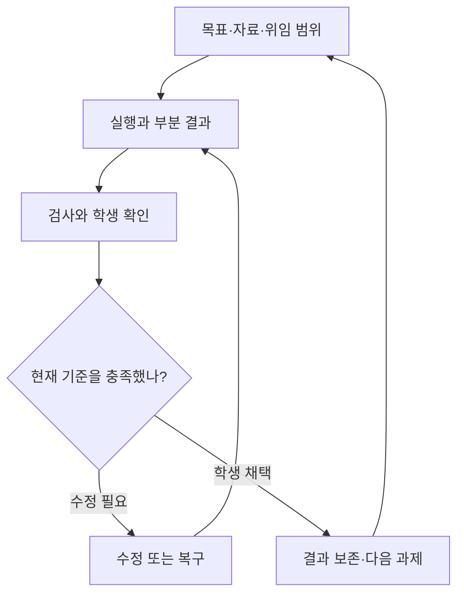

# 수업별 Agent 경험 — 학습 흐름·실행 계약·검증 전략

상태: 제안, 구현·운영 정책으로 아직 채택하지 않음. 날짜: 2026-09-08 · [#746](https://github.com/jayleekr/hypeproof-studio/issues/746).
근거: [경쟁 분석 및 직접 캡처](../research/agent-experience-2026-09-08/README.md).
철학의 원본은 [Lab PHILOSOPHY.md](https://github.com/jayleekr/hypeprooflab/blob/6845cdb4391273d16ed09419eee806b0c03c04f9/PHILOSOPHY.md)다.
[2026-09-08 개정 적용](philosophy-alignment-2026-09-08.md), [자산 참조/호환 인덱스](../seven-assets.md),
[Vessel 배치](../plan/vessel-and-modules.md)를 따른다.

## 이번 설계의 선택

상위 [Product Intent](../PRODUCT-INTENT.md)를 기존 `INT-AE-*` 기능 의도와 AE 요구사항으로
구체화한다. 개인 체험은 [NAT-03](../requirements/studio-native-trial.md)의 명확/모호/건너뛰기
분기를 재사용한다. 아래 L2 과제는 수업 인수 검증용 기준 경로이며, 자유 체험 사용자를
홈페이지 제작이나 고정된 교육 질문으로 되돌리는 기본 경로가 아니다.

첫 구현은 **성인 학습자가 Studio에서 자기 홈페이지의 작은 변경을 끝까지 수행하는 경험**에 집중한다.
L2의 진료시간·공지 변경을 기준 경로로 삼되 L1의 비교 판단과 수업 후 재사용까지 연결한다.
수업별 AI 이름과 기능 설정은 이 경로를 돕는 수단이다. 이름 변경이나 도구 연결만으로 완료하지 않는다.

| 설계 선택 | 이유 | 반증되면 바꿀 것 |
|---|---|---|
| 학생의 목표·판단·결과를 한 작업에 연결한다 | 긴 대화에서 무엇을 위해 바꾸었는지 잃기 쉽다 | 기록 입력이 작업을 방해하면 기존 발화에서 초안을 만들고 학생은 수정만 한다 |
| 필요한 순간에 한 가지 결정을 요청한다 | 초보자에게 시작 전 긴 요구사항 양식은 또 다른 과제다 | 질문 없이도 의도가 충분하면 즉시 작업으로 진행한다 |
| 결과 품질과 도움 사용을 함께 본다 | 완성된 홈페이지만으로 독립 수행을 판단할 수 없다 | 도움 수준을 설명하지 못하면 관측 설계를 고친다 |
| 실패 후 보존·검수·복구를 첫 경로에 넣는다 | 성공 시연만으로 실제 수업을 운영할 수 없다 | 자동 복구가 더 큰 손실을 만들면 복구 범위부터 축소한다 |
| 실제 App·모델·도구 경로에서 확인한다 | 웹 시안과 합성 화면만으로 학생 경험을 입증할 수 없다 | 환경이 없으면 BLOCKED로 남기고 실기 인계 조건을 적는다 |

이 문서의 제안은 [요구사항](../requirements/learning-agent-experience.md),
[인수 실험](../testing/learning-agent-experience.md), [구현 순서](../plan/learning-agent-experience-epics.md)로 연결한다.
공개 배포·Computer Use·학급 전체 예산은 별도 확장이다. L3의 공개·복구 실기를
로컬 미리보기만으로 충족했다고 표시하지 않는다.

## 제품 Mission에 연결할 문장

> Studio는 학습자가 AI와 실제 문제를 풀면서 목적을 세우고, 위임과 검증의 경계를 판단하고,
> 결과를 이해하며 책임지는 환경이다. 강사는 선택·제약·피드백을 수업에 맞게 설계하고,
> 학습자의 판단이 다음 행동에서 어떻게 달라지는지 관찰한다.

이 문장은 기존 철학의 제품 적용 제안이다. 자산 정의나 Lab의 전체 Mission을 새 문서로 복제하지 않는다.
범용 Agent의 모든 기능을 노출하는 것보다, 학생이 자기 선택과 결과를 설명할 수 있는지를
기능의 도입 기준으로 삼는다. Cursor 등과 경쟁할 기본 작업 품질도 필요하다. 불편함을 학습으로 정당화하지 않는다.

Lab의 prepared environment와 AI Discontinuity를 제품에 적용한다. 목표를 AI가 대신 확정하거나
반복·검증을 많이 실행했다는 이유로 학습을 통과시키지 않는다. 실제 문제의 압력 속에서
판단이 성장하는 조건과 약화되는 조건을 함께 검증한다. 7자산은 그 검증에 사용하는 현재 연구 모델이다.

## Product Intent

| ID | 사용자 의도 | 관측 가능한 결과 | 연결 자산 |
|---|---|---|---|
| INT-AE-01 | 학생이 무엇을 만들고 무엇이 좋은 결과인지 정한다 | 과제 안내와 별개로 자기 목표·완료 기준을 수정하고 참조한다 | Intent clarity, Taste |
| INT-AE-02 | AI에게 줄 자료와 맡길 일을 고른다 | 포함한 파일/페이지/이미지와 맡긴 역할·범위를 설명하고 취소한다 | Context design, Delegation judgment |
| INT-AE-03 | 결과를 확인하고 다시 고친다 | 변경과 검수 근거를 연결하고 미검증 범위를 말하며 되돌린다 | Verification reflex, Iteration reflex |
| INT-AE-04 | 결과물을 자기 것으로 이어간다 | 수업 종료 후 프로젝트·결정·검수 기록에 접근하며 독립 과제를 수행한다 | Ownership |
| INT-AE-05 | 강사가 수준·단계에 맞는 도움을 여러 기수에 제공한다 | 학생 권한으로 리허설하고 고정된 수업 설정으로 복제·운영·개입한다 | Context design, Delegation judgment |
| INT-AE-06 | 강사가 수업에서 AI가 어떤 이름과 역할로 참여하는지 정한다 | “코치” 고정 호칭 없이 이름·역할 소개·말투를 구성하고 학생은 AI임을 안다 | Context design, Ownership |
| INT-AE-07 | 학생이 과제에 맞는 AI를 선택하고 다른 결과를 근거로 비교한다 | 강사가 정한 선택 범위 안에서 실제 모델·위임 이유·검수 근거·비용을 확인하고 결과 채택을 설명한다 | Delegation judgment, Verification reflex, Taste |
| INT-AE-08 | 학생이 자기 목적에 맞는 좋은 결과를 선택한다 | 같은 조건의 대안을 비교하고 채택·보류 이유를 완료 기준에 연결한다 | Taste, Intent clarity |
| INT-AE-09 | 학생이 타인의 반론으로 자기 판단을 다시 살핀다 | 공유할 근거를 선택하고 인간의 피드백에 따라 수정·유지·보류한 이유를 설명한다 | Verification reflex, Taste, Ownership |

## 누구에게 어떤 도움이 필요한가

레벨 이름과 수행 범위는 기존 [치과 홈페이지 과정](../curriculum/dental-ownership/README.md)을 따른다.
아래는 Agent 행동의 적용 제안이다. 사람의 고정 등급이나 권한 역할을 새로 정의하지 않는다.
같은 사람이 문구 수정에서는 독립 수행하고 배포에서는 도움받을 수 있다.

| 기존 과정 | 학생이 직접 결정할 일 | Agent의 도움 | 남길 근거 |
|---|---|---|---|
| L1 Reviewer | 환자가 찾을 정보, 두 시안 중 채택할 구성 | 같은 내용·화면 폭의 비교, 선택 이유를 묻는 질문 | 채택안과 보류안, 목적에 연결된 수정 요청 |
| L2 Editor | 바꿀 내용·자료·범위, 수정 결과의 적합성 | 선택한 파일 편집, 모바일 검수, 복구 안내 | 변경 전후, 본인이 확인한 조건, 다음에 반복할 작업 |
| L3 Operator | 연습 배포 여부, 오류 시 복구 또는 도움 요청 | 배포 차이·실제 URL 확인·검증된 복구 작업 | 공개된 버전과 확인 시각, 복구 또는 인계 근거 |
| L4 Builder | 새 페이지의 목적·구조·기존 디자인과의 일관성 | 작은 초안 제작, 대안 비교, 반복 수정 | 요구사항과 채택 이유, 기존 페이지 회귀 검사 |
| L5 Owner | 직접 운영할 일과 전문가에게 맡길 일 | 운영 정보 정리, 장애 상황 비교, 인계 초안 | 계정·소유·복구 책임과 전문가에게 전달할 작업 범위 |

모두를 L5로 올리는 것이 한 수업의 성공 조건은 아니다. 학생이 자기 업무 하나를
더 잘 판단하거나 반복할 수 있고, 맡겨야 할 경계도 설명할 수 있으면 그 범위의 성과다.
수업 추천과 과제 수행 범위는 [기존 과정의 관찰 기준](../curriculum/dental-ownership/generated/README.md)을 따른다.
이 기준만으로 사람의 자산 성장을 입증했다고 주장하지 않는다.

## 기준 과제: 진료시간을 바꾸고 새 공지를 이어서 고친다

합성 병원 홈페이지와 시간표를 사용한다. 예시 변경은 “토요일 09:00–13:00 → 09:00–14:00”.
실제 수업에서는 학생이 자신의 자료와 목적을 선택한다. 예시 답을 반복하게 만드는 절차는 아니다.

| 순간 | 학생이 보는 것과 하는 일 | Agent·제품이 책임질 것 | 다음 단계로 갈 근거 |
|---|---|---|---|
| 참여 | 수업 이름·AI 역할·과제와 자기 프로젝트를 연다 | 참여 자격, 실제 모델 이용·미리보기 준비 상태 확인. 예제는 학생별 사본 | 학생 조건에서 열리는 프로젝트와 준비 점검 결과 |
| 목표 | “토요일 진료시간을 고치고 휴대폰에서도 읽히게”라고 말한다 | 발화에서 목표·완료 기준 초안 작성. 정보가 충분하면 추가 질문 생략 | 학생이 고칠 수 있는 목표, 원본 시간표, 확인할 조건 |
| 비교 | 시간표 두 배치를 같은 390px 화면에서 보고 하나를 고른다 | 원래 내용이 같은 대안과 각각의 차이 제시. AI 추천 이유도 제안으로 표시 | “예약 버튼보다 먼저 보여야 해서 A” 등 학생의 선택 이유 |
| 위임 | 사용할 시간표와 수정할 페이지를 확인하고 편집을 맡긴다 | 선택 자료·파일 범위·복구 지점 표시. 기존 승인 계약으로 실행 | 누구의 승인인지, 어떤 변경에 유효한지 확인 가능 |
| 실행 | 진행 중 추가 요청을 적거나 중지한다 | 실제 이벤트로 상태 갱신, 부분 변경·예약 입력 보존 | 완료한 작업과 미완료 작업이 구분됨 |
| 검수 | 390px/1280px 결과와 원본 시간표를 대조한다 | 파일·검사 버전, 깨진 링크·이미지 등 검사 범위와 결과 제공 | 조건별 통과·실패·미검사, 학생 확인 근거 |
| 수정·복구 | 잘못된 변경을 고치거나 이전 상태를 선택한다 | 수동 편집 충돌을 보여주고 복구 전 상태 보존, 관련 검사 재실행 | 되돌린 파일 집합·남은 외부 영향·새 검사 결과 |
| 채택·이어가기 | 결과를 채택하고 다른 휴진 공지를 수정한다 | 도움 방식을 표시하고 새 과제로 구분. 기존 파일과 판단 기록 재열기 | 결과·검수·도움 사용, 본인이 다음에 할 일과 맡길 일 |

완료 기준 예시: 원본 시간과 일치 / 두 화면 폭에서 정보가 가려지지 않음 /
기존 예약 링크가 동작함. “예쁘다”는 취향 의견으로 남길 수 있지만 기능 검사를 대신하지 않는다.
검사는 조건별로 자동·학생 직접·강사 확인의 출처를 표시한다.
학생의 개인 완료 기준은 수정 가능하며 수업 공통 기준은 별도로 유지한다.
개인 기준을 지워 수업 공통 검사를 통과하게 만들지 않는다.

### 도움을 조절하는 계약

교수 전략의 기본값은 확정 수업의 단계가 정하고, 학생은 그 안에서 도움을 요청하거나 줄인다.
**도움 전략·실행 권한·관측된 수행 수준은 서로 다른 값**이다. “독립 수행” 버튼을
선택했다고 독립 수행이 증명되는 것은 아니다.

| 도움 방식 | Agent가 할 수 있는 일 | 학생에게 남기는 판단 |
|---|---|---|
| 시연 보기 | 별도 예제에서 작업하고 선택·검수 이유를 설명 | 무엇을 자기 과제에 적용할지 선택 |
| 힌트 받기 | 다음 한 단계나 확인 위치를 제시 | 실제 수정안과 실행 여부 결정 |
| 함께 수정 | 허용된 범위의 초안을 만들고 수정·검사 | 범위·대안·채택 여부 결정 |
| 직접 해보기 | 자동 정답 제시 없이 기다리고 요청받은 검수 제공 | 목표부터 수정·검수·복구까지 직접 결정 |

목표·대상·외부 영향이 달라지는 질문은 실행 전에 해결한다. 기존 자료로 판단할 수 있는
사소한 값은 되묻지 않고 선택 근거를 보여준다. 한 번에 다음 행동을 바꾸는 질문 하나를 기본으로 한다.
모르는 이유로 무한 질문을 반복하지 않으며 학생은 예시 보기·함께 수정·강사 도움을 선택할 수 있다.

학생이 도움을 바꾸면 다음 실행부터 적용한다. 실행 중 전환은 입력을 보존하고 현재 작업의
중단 여부를 확인한다. 수업이 허용한 범위를 넘는 도움은 이유와 요청 경로를 표시하며 조용히 풀지 않는다.
도움받은 시도는 그대로 보존하고 새 독립 시도를 시작할 수 있다. 도움 기록 부재는 `unknown`이다.
환경 고장을 해결한 지원과 과제의 정답을 제공한 지원도 구분한다.

## 화면 구조

학생의 기본 화면은 **현재 과제 + 대화/실행 + 결과/검수**로 구성한다.
좁은 창에서는 현재 과제 요약을 고정하고 대화·결과를 탭으로 전환한다.
강의 본문 전체는 펼쳐 읽는다. 한 번에 모든 콘솔과 전문 설정을 보여주지 않는다.



| 결정 | 제안하는 동작 | 근거/양보하지 않을 점 |
|---|---|---|
| 의미가 먼저 보이는 작업 타임라인 | “진료시간 수정”, “모바일 화면 확인”을 기본 표시하고 도구명·인자·로그는 상세 보기 | 현재 도구 행을 재사용. 활동 요약을 숨은 추론 원문으로 만들지 않음 |
| 맥락을 보고 편집 | 입력 위에 선택한 파일·페이지·요소·이미지 칩, 출처/시각/전송 범위 표시 | 자동 맥락과 학생 선택 맥락을 구분. 제거한 자료가 요청에 다시 들어가지 않아야 함 |
| 실행 상태를 사실대로 | 준비/실행/학생 승인 대기/강사 정책 대기/오류/중지/완료를 구분 | 무응답을 생각 중으로 영구 표시하지 않음. 도구 성공을 학습 완료로 표시하지 않음 |
| 검증이 보이는 결과 카드 | 변경 파일, 전후 비교, 검사한 조건·결과·화면, 미검증 범위, 되돌리기 | “수정했어요”만으로 끝내지 않음. 학생 직접 검사와 자동 검사를 구분 |
| 승인은 판단 단위로 | 파일·대상 origin·작업 목적·기한이 같은 제한된 작업 묶음에 승인 제안 | 무제한 자동 승인은 아님. 공개 제출·파괴·권한 확대는 별도 확인. 기존 승인 계약 변경은 명시적 구현 PR로 처리 |
| 수업 언어의 기능 선택 | “자료 조사”, “홈페이지 수정”, “화면 검수”, “외부 서비스 실습”처럼 설명 | SDK 플래그·MCP 서버명은 강사 고급 설정/진단에서만 노출 |
| 수업별 AI 정체성 | “제작 파트너”, “검토 도우미” 등 강사 지정 이름·역할·말투와 학생 개인화 허용 | 기존 ux.coach 재사용. AI 배지 유지, 모든 표시 문구 일치, 다른 수업의 이름 누출 금지. 이름은 권한이 아님 |
| 일관된 기본 디자인 | 시작 화면의 색/형태/어조를 채팅에 연결. 한글 동작 라벨·본문 가독성·키보드 우선 | 기존 [DES-02/03/06/11](../requirements/classroom-design.md)를 채팅에 적용할 인수 기준으로 제안 |

### 정보의 우선순위와 화면 인수 기준

| 영역 | 기본 표시 | 필요할 때 펼칠 것 |
|---|---|---|
| 현재 과제 | 수업·현재 단계·내 목표 요약·도움 방식 | 긴 강의 본문, 완료 기준 편집, 이전 과제 |
| 대화·실행 | 입력, 선택 자료, 실제 상태, 다음 행동 | 전체 계획, 도구 인자·로그·기술 오류 |
| 결과·검수 | 실제 미리보기, 변경 전후, 미확인 조건 | 검사별 상세 증거, 이전 파일·결과 버전 |

좁은 화면에서 세 영역을 억지로 나란히 놓지 않는다. 대화/결과 전환 시 입력·스크롤·선택 대상을
보존하고 검수 결과에 “관련 변경 보기”, 변경에는 “검사 결과 보기”를 둔다. 승인 대기·오류·중지는
숨겨진 탭에 갇히지 않아야 한다. 작업당 현재 상태의 주된 행동 하나를 강조한다.

DES의 본문 16px·상시 라벨 14px·44px 조작 대상, 200% 확대와 키보드 기준을 실제 패널에 적용한다.
색만으로 상태를 구분하지 않고 새 상태는 보조기기에 알리되 학생의 포커스를 빼앗지 않는다.
Studio의 좁은 패널 검사와 스마트폰에서 쓰는 Chalk 검사는 별개다. 390px 캡처를
모바일 Studio 앱 지원 증거로 쓰지 않는다.

### 완료를 하나의 체크 표시로 합치지 않는다

| 구분 | 상태의 예 | 전이 근거 |
|---|---|---|
| 실행 | 준비·대기·실행 중·승인 대기·중지 요청·중지 확인·오류·실행 끝남 | App/Service/도구의 관측 이벤트. Stop 클릭만으로 중지 확인하지 않음 |
| 검수 | 미검사·검사 중·통과·실패·확인 불가·재확인 필요 | 조건별 검사 증거와 현재 산출물·완료 기준의 일치 |
| 학습자 결정 | 미검토·수정 요청·채택·보류 | 학생의 명시적 결정. 자동 검사 통과는 채택 이벤트가 아님 |
| 학습 관찰 | 미관찰·도움받아 수행·독립 수행의 근거·판단 유보 | 출처와 도움 범위를 가진 실제 수행 증거 |

파일을 편집하면 관련 검수 결과는 “재확인 필요”가 된다. 영향 범위를 계산할 수 없으면
해당 작업 전체를 재확인 대상으로 둔다. 완료 기준·viewport·검사기 버전이 바뀐 경우도 같다.
이전 통과 기록은 당시 버전의 이력으로 남으며 새 결과에 초록 표시를 물려주지 않는다.
학생이 채택한 뒤 다시 수정하면 현재 버전은 미검토로 돌아가고 이전 채택은 보존한다.

예시 문구: “파일 2개 수정됨 · 모바일 화면은 아직 확인하지 않았어요”,
“검사 뒤 파일이 바뀌었어요 · 다시 확인”, “중지를 요청했어요 · 진행 중 작업 확인 중”.
“완벽하게 해결”, 근거 없는 진행률, 모든 상태에서 같은 “생각 중” 문구는 사용하지 않는다.

학생에게 강사의 운영 권한을 주지 않으면서 도움 수준은 점진적으로 줄인다.
시연에서는 과정을 해설하고, 안내 실습에서는 학생이 범위를 선택하며, 독립 과제에서는
요청한 제한된 도움과 검수만 제공한다. 단순히 버튼을 더 누르게 만드는 방식은 채택하지 않는다.
힌트/함께 수행/독립 수행은 교수 전략이다. 실행 권한과는 별도로 버전 관리한다.

### 자료 제거와 새 요청

자료 칩 제거는 **다음 요청에서 그 자료를 제외하겠다는 결정**이다. 이미 공급자에게 전송된
자료를 회수하거나 과거 서버 기록을 삭제했다는 의미가 아니다. 전송 전에는 이 차이를 알 수 있어야 한다.
제외 여부는 첨부 목록만 아니라 대화 재전송·요약·도구 결과·자동 파일 탐색에도 적용한다.
선택된 자료와 필수 수업 안내/정책은 구분해 표시한다. 정책 지침은 학생 자료 칩으로 숨기지 않는다.

SDK resume 문맥에서 제외를 보장할 수 없으면 해당 세션을 그대로 이어 쓰지 않는다.
허용된 자료와 학생이 확인한 목표로 새 실행 문맥을 만들고 “선택한 자료로 새 대화 시작”을 표시한다.
제외 자료에서 파생된 요약의 출처를 추적할 수 없는 경우도 문맥을 재구성한다.
정상 자료는 유지되고 제외 자료는 새 요청 payload와 실제 도구 접근 모두에서 차단되는지 검사한다.
이 조치는 원격 공급자의 과거 데이터 삭제 정책을 새로 정의하지 않는다.

## RBAC만으로 부족한 이유와 권한 제안

RBAC는 **누가 수업을 편집하고 운영하는가**를 정한다.
같은 학생이 같은 날 “자료 탐색” 단계에서 브라우저를 쓰고 “독립 검수” 단계에서
읽기만 해야 하는 조건은 수업·단계·행위·대상 속성을 함께 봐야 한다.
학습 성취 등급을 권한 역할로 바꾸지 않는다.

| 주체 | 허용 범위 제안 | 다른 권한으로 자동 이어지지 않는 것 |
|---|---|---|
| 학생 | 자기 수업·프로젝트 실행, 공유 선택, 승인/거절, 자기 결과 내보내기 | 강사 권한, 다른 학생 데이터 |
| 강사 | 배정된 수업 설계·리허설·허용 상한 안 기능 설정·운영 | 플랫폼 상한 변경, 학생 비밀/전체 대화 원문 열람 |
| 조교 | 명시적으로 배정된 수업의 현황/도움 처리 | 강의 확정·기능 확대·학생 화면 제어; 기존 역할 구현 여부부터 확인 |
| 플랫폼 관리자 | 실행 환경/도구 카탈로그·정책 상한·운영 장애 | 수강생 원문 접근에 대한 포괄 동의 |

실행 가능 집합은 다음 교집합으로 계산한다. **명시적 deny가 우선**한다.

```text
플랫폼 정책 상한
∩ 역할과 수업 배정 범위
∩ 확정 수업의 기능 프로필
∩ 현재 단계의 허용 행위·대상
∩ 지원되는 실제 런타임 기능
```

교집합 안의 행위도 자격 유효성·학생 승인·리소스 잠금·예산 조건을 통과해야 실행한다.
학생의 승인은 교집합을 확장하지 않는다. 강사 설정이나 프롬프트도 플랫폼 상한을 확장하지 않는다.
기능 미지원과 정책 거절을 다른 이유로 표시한다. `read/write/browser=true`를 전부 `allowedTools`에
넣는 식으로 구현하지 않는다. [SDK 승인 평가 순서](https://code.claude.com/docs/en/agent-sdk/permissions)가 다르기 때문이다.

현재 단계도 클라이언트가 주장한 값만 믿지 않는다. Service가 수업의 허용 전이와 배정을 검사하고
단계 revision을 발급하며 실행은 그 revision에 묶인다. 이전 단계 다시 보기와 그 단계의 실행 권한
재활성화는 구분한다. 도구 성공이나 학생의 임의 step ID 변경으로 더 넓은 권한을 얻지 못한다.
단계 전환으로 범위가 줄어들면 새 도구 호출에 즉시 재평가하고, 진행 중인 외부 효과는 잔여 실행으로 표시한다.

이 계약은 Studio가 제공하는 실행 경로를 통제한다. 학생이 자기 OS에서 임의 프로그램을
실행하는 것까지 차단하는 단말 관리 체계는 아니다. 적대적 로컬 코드까지 격리해야 하는
수업은 filesystem/network를 집행하는 sandbox 또는 원격 실습 환경이 추가로 필요하다.
클라이언트에서 버튼을 감추거나 파일 도구만 제한해서 이 수준의 격리를 보장하지 않는다.

### 한 수업의 예

| 단계 | 학생이 판단할 것 | 허용 기능 제안 | 자동화 경계 |
|---|---|---|---|
| 참고 사이트 관찰 | 채택할 구성과 이유 | 승인된 origin 탐색, 화면/DOM 읽기 | 로그인·폼 제출은 포함하지 않음 |
| 홈페이지 제작 | 어떤 내용과 배치를 바꿀지 | workspace 읽기/쓰기, local preview | 자유 셸 대신 검증된 실행 작업을 우선. 파일 집합·복구 지점 표시 |
| 모바일 검수 | 통과 기준과 발견한 결함 | 지정 viewport 검사, 읽기 전용 리뷰어 | 모델의 평가만으로 완료시키지 않음 |
| 공개 연습 | 공개할 대상과 영향 | 시험 호스팅의 지정 배포 작업 | 대상·최종 결과를 사람이 확인. 공개 자격은 복제하지 않음 |
| 독립 과제 | 휴진 공지를 스스로 수정·검수 | 교사가 정한 힌트/검수 범위 | 역할은 그대로 학생. 도움 사용 기록은 성적 자동 판정이 아님 |

초기 대상은 성인 정적 홈페이지 과정이다. 아동의 현재 browser/shell/subagents 제한을
이 제안으로 완화하지 않는다. 아동의 기존 read/write opt-in은 별개다.

## 멀티모델을 수업의 선택권으로 설계

근거: [멀티모델 경쟁 분석·코드 감사](../research/agent-experience-2026-09-08/multi-model.md).
제품 Mission의 “위임과 검증의 경계를 판단한다”에는 어느 AI에 맡길지와 다른 답을 어떻게 검증할지도 포함한다.
모델 이름을 많이 외우게 하는 것이 학습 목표는 아니다.

| 수업 모드 | 강사 설정 | 학생 경험 | 도입 |
|---|---|---|---|
| 고정 | 단계별 검증한 모델·실행기, 대체 허용 여부 | 선택 부담 없이 시작. 실제 모델과 고정 이유 확인 | P0 기본 |
| 제한 선택 | 수업 목적에 맞는 소수 후보와 기본값 | 입력창에서 허용 모델 선택. 지원 작업·자료 범위·비용 정보 확인 | P0, 기존 검증 경로부터 |
| 자동 | 허용 후보·속도/비용/품질 우선순위·예산 | “수업 자동”으로 시작하고 턴별 실제 모델·선택 이유 확인 | P1 |
| 비교 | 두 후보/역할·공통 자료·평가 기준·횟수 상한 | 두 결과의 근거를 비교하고 선택 이유를 남김 | P1 읽기 검토; 병렬 편집 P2 |

강사 기본 화면은 이 네 모드와 수업 템플릿을 중심으로 한다. 공급자 키·API 호환성·임의
endpoint 입력을 매 수업 설정에 노출하지 않는다. 기관 관리자는 제공 가능한 카탈로그와
자격을, 담당 강사는 그 안의 수업/단계 정책을, 학생은 허용된 개인 선택을 관리한다.
다른 수업에서 받은 모델 권한이 현재 수업의 제한을 넓히지 않는다.

**AI identity, 역할, 모델, 실행기, 도구 권한은 각각 독립된 값이다.** 예를 들어
“제작 파트너 · AI”라는 이름은 유지한 채 “수업 기본 모델”을 사용할 수 있다.
“검토 도우미”라는 역할에 다른 모델을 배정할 수도 있지만 역할명 변경이 그 모델이나 권한을
자동으로 선택하지는 않는다. 내부 안정된 assistant ID와 턴별 실제 provider/model을 함께 남긴다.

학생 UI 제안: 입력창 가까이에 `수업 기본 ▾`를 두고 허용된 소수 후보·현재 선택·지원 능력을 표시한다.
일반 학생 화면에 SDK/API 용어를 노출할 필요는 없다. 사용할 수 없는 작업은 “이 선택에서는
화면을 직접 조작할 수 없어요”처럼 행동 기준으로 설명하고 해결 가능한 선택을 제시한다.
응답에는 실제 모델, 자동/대체 이유, 제공자와 전송 자료 범위, 사용량/미확인을 상세로 제공한다.
표시 이름/별칭만 바꾸고 실제 모델 변경처럼 표현하지 않는다.

### Service가 확정하는 모델 계약

| 계약 | 제안 |
|---|---|
| 허용 계산 | 기관 카탈로그 ∩ 수업/단계 정책 ∩ 학생 배정 ∩ 모델/실행기 능력 ∩ 자료 전송 허용 ∩ 예산. 클라이언트 model 문자열은 요청일 뿐 |
| 능력 카탈로그 | provider/model ID와 alias 매핑 revision, 실행기/SDK 버전, text/vision/tools/effort/context 한도, 검증한 browser/OS 조합, 검증 시각·상태. 기존 model-caps/프로필/번역기 확장 |
| 실행 기록 | 요청한 선택, 확정 provider/model/runtime, 역할, catalog/policy revision, 대체 사유, 문맥 snapshot, 사용량·미확인 비용. 내부 추론 원문을 기록하려는 계약이 아님 |
| 재현/교체 | 확정 수업은 후보·기본값·매핑·실행기 호환 범위를 snapshot으로 보존. 새 모델은 리허설→새 버전→제한 배포→복귀. 자동 모드는 정책과 실제 선택 이력을 재현 가능하게 함 |
| 모델 은퇴/긴급 제한 | 실제 서비스를 유지할 수 없는 핀은 사용 불가로 표시. 새 승인 버전이나 사전 승인 대체 경로로 이동하고 사건 기록. 과거 이력을 새 모델로 고쳐 쓰지 않음 |
| 자격/자료 | 기본은 기존 서버 소유 키. 수업이 허용한 전송 대상만 사용. BYOK/로컬 모델은 별도 고급 경로로 나중에 검증하며 키 입력만으로 수업 제한을 우회하지 않음 |

역할별 모델 배정은 “만드는 모델 + 읽기 검토 모델”부터 도입한다. 편집자는 한 명으로
유지하고 검토자는 지정된 산출물/근거만 읽는다. 모델 다수결을 합격 근거로 쓰지 않는다.
학생은 두 결과 모두 보류하거나 사람의 검토를 요청할 수 있다. 모델 검토와 사람의 반론은
출처를 구분하며, 여러 모델 실행을 social correction의 대체 증거로 기록하지 않는다.
병렬 편집은 파일뿐 아니라 브라우저 context·실행 자격·출력 경로가 분리된 실행 환경과
채택/폐기/충돌 검토가 준비된 뒤 허용한다. 공유 workspace에 두 편집기를 동시에 붙이지 않는다.

### 변경·자동 선택·실패의 경계

같은 실행기 안의 모델 변경도 턴 경계에서 처리하고 적용될 다음 작업을 표시한다.
공급자/실행기가 바뀌면 세션 ID를 그대로 재사용하지 않는다. 학생이 전송 범위를 확인한
목표·선택 자료·산출물·검수 기록으로 새 세션에 인계하고 원본은 보존한다. 문맥 창이 작으면
빠지는 내용과 요약을 확인하게 하며, 숨은 추론·자격·과거 도구 승인 상태를 옮기지 않는다.

Auto는 작업 전 선택 정책이고 fallback은 실패 후 복구 정책이다. 각각 승인 목록과
예산을 적용한다. 초기 Auto는 단계/역할/필요 능력 기반의 설명 가능한 규칙으로 시작한다.
학습된 라우터의 품질 이득은 관측 후 별도 판단한다. 품질이 나빠 보인다는 이유만으로
다른 공급자에 같은 자료를 자동 전송하지 않는다.

일부 출력/파일 변경/외부 효과 뒤 실패하면 진행 사실을 보존하고 재개 또는 새 시도를 명시한다.
다른 모델의 재시도로 외부 행위가 중복되지 않도록 작업 ID와 실행 기록을 연결한다.
결과가 불확실한 외부 효과는 중복 실행 방지를 증명할 수 없으면 자동 재실행하지 않는다.
모든 분기·보조 모델·재시도 비용을 E3의 같은 학급 예산에 예약하고, 한 학생의 비교 작업이
다른 학생의 첫 응답을 장시간 막지 않도록 E5 보드에서 대기 원인과 제한을 확인한다.

## 강사가 규모 있게 운영하는 방식

강사가 매 학생의 도구 호출을 승인하면 규모가 커질수록 수업이 멈춘다.
**강사는 수업의 허용 범위와 예외를 운영하고 학생은 자기 작업의 결정을 내린다.**

1. 기존 Chalk authoring에서 검증된 기능 템플릿과 도움 전략을 선택한다.
2. 학생 권한의 독립 프로젝트로 리허설한다. 강사의 로그인·로컬 도구가 성공을 대신하지 않는다.
3. 수업 콘텐츠 해시·정책 revision·SDK/앱 호환 범위·리허설 증거를 함께 확정한다.
4. 학생은 참여 후 실제 기기 준비 상태를 검사한다. 미지원은 원인과 해결을 보여준다.
5. 강사는 metadata 보드와 도움 요청 큐를 보고 같은 원인의 장애를 묶어 처리한다.
6. 공유가 허용된 결과·판단·검수 기록으로 회고하고 다음 기수의 초안을 고친다.

운영 보드에서 `정책 거절`, `기능 미지원`, `인증 문제`, `서비스 장애`, `학습 도움 요청`,
`신호 없음`은 다른 원인이다. 마지막 수신 시각과 근거를 보여주고, 추정 원인을 확정 사실로 표시하지 않는다.
정책 거절에는 요청 가능한 담당자를, 환경 문제에는 재점검을, 학습 요청에는 학생이 선택한
맥락과 다음 행동을 연결한다. 학생은 문제 요약을 고쳐 공유할 수 있고 원문 공유 없이도 도움을 요청할 수 있다.
강사의 답변 도착과 해결은 구분하며 실제 해결 확인은 기존 ADM-05대로 학생이 한다.

운영 단위는 학생 수뿐 아니라 동시에 실행되는 모델·브라우저·셸 작업이다.
학생별 공정 대기열, 학급/학생 예산 예약, 시간 제한과 재시도 예산, 브라우저/파일 편집의
단일 소유 실행을 둔다. 기존 기본 동시성 2를 학생 수와 곱해 서버 용량으로 간주하지 않는다.
30명 파일럿 → 100명 합성 부하를 **시험 목표**로 제안하며 검증된 수용량으로 광고하지 않는다.

정책 긴급 축소/수업 일시정지는 새 실행 차단과 진행 작업 중단을 구분한다.
앱이 오프라인이거나 SDK가 외부 도구를 이미 호출한 상태에서 즉시 전원 정지를 보장할 수 없다.
짧은 정책 유효기간, 실행 직전 재확인, 호스트 stop, 서버 요청 차단을 조합하고 잔여 실행을 표시한다.
예산도 이미 전송한 요청의 비용과 최종 집계 지연을 포함해야 한다.

## 사람의 반론과 다음 행동

원본 철학의 Social Correction 가설은 AI 답변을 하나 더 받는 것으로 검증되지 않는다.
학생이 기존 선택 공유 경로로 결과·기준·의문을 사람에게 보여주고, 반론 후 무엇을 수정하거나
유지·보류했는지 남기는 과정을 D5에 둔다. 강사/학습 동료의 역할과 열람 범위는 기존 공유 계약을 따른다.
동료 피드백을 위해 교차 수업 원문을 열거나 새 커뮤니티 플랫폼을 만들지 않는다.

피드백에 따랐다는 사실 자체를 좋은 판단으로 채점하지 않는다. 반론의 근거를 확인하고
동의하지 않는 이유를 설명하는 것도 관측 대상이다. AI 대필과 학생의 판단을 구분한다.
사람 검토가 없는 개인 실습도 가능하며 해당 학습 관찰만 미실행으로 남긴다.

도움을 받은 같은 과제를 빠르게 반복하는 것과 새로운 상황에서도 판단하는 것은 다르다.
도움 전후·다른 과제·후속 시점에서 기준 선택, 오류 발견, 확신 조절, 위임 경계를 관찰한다.
AI를 강제로 끄거나 필요한 접근성 지원을 제거하지 않는다. 도움 조건과 과제 차이를 함께 기록해
자동화의 이득과 인간 판단의 변화·퇴화 가능성을 분리한다. 관측 결과로 자산 정의를 수정할 때는 Lab 원본으로 환류한다.

## 수업이 끝난 뒤에도 남는 것

자기 파일·목표·채택 이유·변경/복구 기록·검수 근거를 프로젝트에 연결해 다시 연다.
학습자가 선택해 내보내는 묶음에는 시작 방법, 실제 포함 파일, 확인한 범위, 도움받은 작업,
남은 일과 전문가에게 맡길 일이 있어야 한다. 실행 토큰·공급자 키·다른 학생 자료는 포함하지 않는다.
SDK 숨은 세션 파일 전체를 내보내기 자료로 취급하지 않는다.

수업 종료·AI 이용 만료·공유 만료·호스팅 만료는 별개다. AI가 만료돼도 로컬 파일 열람·수정·내보내기는
가능해야 한다. 공유/호스팅 연장은 별도 조건을 보여주며 기존 공유 기한을 자동 연장하지 않는다.
파일 내보내기 자체를 독립 운영 능력으로 판정하지 않는다. 다른 폴더에서 다시 열어 수정·검수하는
수행을 관찰하고, 외부 환경이 없으면 그 범위를 미확인으로 남긴다.

## Browser Use와 Computer Use의 별도 경계

| 능력 | 실행 경계 | 도입 판단 |
|---|---|---|
| 브라우저 조회/검수 | 수업에 연결된 탭·origin·학생별 브라우저 context | 기존 App browserMcp/browserControl 확장으로 우선 진행 |
| 브라우저 외부 조작 | 폼 전송·계정·업로드·다운로드·리다이렉트 | 행위별 정책과 인계 필요. 페이지가 바뀌면 대상/승인 재평가 |
| Computer Use | OS 화면·키보드·마우스·앱·클립보드·파일 선택기 | 웹으로 못 하는 과제가 있을 때 격리 실습 데스크톱으로 검증 |

Computer Use를 “SDK 기능 켜기”로 처리하지 않는다. 제공자가 정의한 도구를
우리 환경에서 실행하는 구현이 필요하다. [Anthropic 공식 문서](https://platform.claude.com/docs/en/agents-and-tools/tool-use/computer-use-tool).
첫 실험은 합성 자료를 사용한 전용 VM의 문서 앱 작업이다. 개인 바탕화면 전체 제어와
강사의 학생 PC 원격 접속은 각각 별도 권한·동의 계약이 필요하며 이번 제안에 포함하지 않는다.
브라우저 읽기 실패를 이유로 더 넓은 Computer Use 권한으로 자동 전환하지 않는다.

## 구현 배치와 기존 자산 재사용

| 레이어 | 소유할 것 | 재사용 및 계약 경계 |
|---|---|---|
| App | 기존 채팅/모델 선택 표시, local filesystem/browser/SDK 실행, 승인·중지, 로컬 복구 | 기존 ChatPanel·sdkCoach·browserMcp. 수업 내용/임계값을 바이너리에 고정하지 않음 |
| Service | 인증·배정·정책·모델 카탈로그/해석·예산·실행 자격·버전 binding | 기존 profile/authoring/classroom API와 공급자 번역기 확장. 새로운 로그인·정책 저장소를 먼저 만들지 않음 |
| Surface | 기능/모델 템플릿 편집·학생 조건 리허설·운영 현황·예외 처리 | Chalk authoring/board/classroom 및 #732 재사용 |
| Module | 목적·과제·교수 전략·검수 기준·필요 기능/모델 사용 방식의 참조 | 기존 hps-module/1·session-design 진화. 콘텐츠 자체는 권한을 부여하지 않음 |

### 현재 구현을 출발점으로 삼는다

원 연구의 기준은 `52cb48a`이며 후속 `main`의 `7f41c10`도 이번 설계에서 대조했다.
아래는 코드·기존 실행 기록에서 확인한 재사용 지점이다. 이번 문서 작업에서 앱 실기를 다시 실행한 것은 아니다.

| 근거 | 확인된 기반 | 이번 제안의 추가 범위 |
|---|---|---|
| [session-design 검증](../../worker/src/lib/session-design.ts), [lesson delivery](../../worker/src/lib/lesson-delivery.ts) | 정확한 필드만 받는 콘텐츠 schema, 서명된 수업 버전·digest 전달 | 단계별 기능·도움·검수 revision을 연결할 실행 binding |
| [ChatPanel](../../extensions/hypeproof-chat/webview-ui/src/ChatPanel.tsx) | 수업 펼침·과제 입력, 이름, Stop·입력 대기열 | 과제/결과 연결, 도움 전환, 상태별 다음 행동 |
| [native observation 계약](https://github.com/jayleekr/hypeproof-studio/blob/7f41c104d9201765a14d8030cca787b612d04794/extensions/hypeproof-chat/src/nativeObservationContract.ts) | `hps-observation/1`, 역할별 event ID·파일 해시·도움 출처·불완전 기록 표시 | 수업 작업/기준/검수의 연결. 기존 event에 임의 필드 추가 금지 |
| [native trial 실행 기록](https://github.com/jayleekr/hypeproof-studio/blob/7f41c104d9201765a14d8030cca787b612d04794/docs/testing/studio-native-trial-results-2026-09-08.md) | 실제 Mac·모델·관찰 흐름과 개인 이용 한도에 대한 별도 증거 | 학급 예산·수업 전이·사람의 학습 효과. 체험 검증을 AE 테스트 PASS로 복사하지 않음 |
| [classroom sharing](../requirements/classroom-admin.md) | 명시적 공유·수신자·감사·철회·학생 해결 확인 | Studio 작업과 원래 실행 근거 연결. 메타데이터 권한으로 원문을 열지 않음 |

새 통합의 외부 계약은 기존 resolved profile의 **수업 실행 binding** 한 곳으로 모은다.
session-design/1은 현재 정확한 필드만 허용한다. 임의 capability 필드를 넣지 말고,
새 schema revision과 구버전 소비자 처리·drift lock을 먼저 정의한다. 내부 상태/DB 선택은
기존 D1 authoring 모델을 조사한 구현 ADR에서 결정한다. 교차 레이어 이벤트는 이 binding과
기존 이벤트 envelope의 연결로 설계하고 독립된 상태 원본을 여럿 만들지 않는다.

### 수업 실행 binding에 필요한 의미

아래는 **구현 ADR의 설계 입력**이며 기존 JSON에 그대로 넣을 새 필드 목록이 아니다.
공통 연결점은 resolved profile의 실행 binding이다. 파일 복구, 관찰, 공유는 기존 계약과 저장 위치를 유지한다.

| 묶음 | 연결할 정보 | 소유·갱신 기준 |
|---|---|---|
| 실행 신원 | 인증 주체, 수업/확정 버전/digest, 실행·workspace·현재 단계 | Service가 인증·배정을 검증. 클라이언트 ID만으로 타 수업 접근 불가 |
| 작업 의도 | 학생 목표, 완료 기준 revision, 선택 자료와 출처 | 학생이 수정. 모델 초안과 학생 확인을 구분 |
| 실행 조건 | 정책 revision/유효기간, 지원 런타임, 선택한 도움과 허용 범위 | 정책은 Service, 실행 준비는 App. 도움은 권한을 확대하지 않음 |
| 작업 증거 | 요청/시도/event ID, 파일 집합 해시, 검사 기준·검사기·viewport·결과 | 기존 이벤트와 로컬 결과를 참조. 호스트 사실과 모델 해석 구분 |
| 학생 결정 | 채택·보류·수정 요청과 대상 버전, 선택 공유의 참조 | 학생 결정만 기록. 공유는 기존 계약으로 별도 확인 |

Service는 수업·정책의 원본, App은 로컬 실행·파일의 관측 원본이다. 보드는 이들의 투영이며
자체 성공 상태를 만들어 쓰지 않는다. 순서 누락·중복·다른 workspace 이벤트·응답 유실은
요청 ID와 범위로 검사하고, 외부 작업의 성공 여부가 불명확하면 자동 재시도 대신 먼저 확인한다.
브라우저의 비동기 화면·증거를 현재 작업으로 잘못 합치는 경우도 거부한다.

검수 원본과 파일 해시는 기본 로컬 작업 기록에 연결한다. 원문을 서버에 추가 보관하거나
강사에게 자동 공개하는 설계로 바꾸지 않는다. 기존 관찰 전송도 선택한 정확한 이벤트 집합의
확인 절차를 유지한다. 새 schema는 App/Service 양쪽의 구버전·잘못된 필드·격리 대조군과 함께 도입한다.

제거 계획: 새 프로필 필드를 제거하면 새 기능만 사용 불가로 표시하고 기존 과제/파일 열기는 유지한다.
Chalk 편집기·브라우저 검수 카드·Computer Use 어댑터는 각각 끌 수 있어야 한다.
지원하지 않는 새 수업은 조용히 더 약한 수업으로 실행하지 않고 호환 불가를 알린다.

## 철학 자료를 유지하는 더 좋은 방법

경쟁사 스크린샷을 철학 문서 본문에 누적하면 제품 변경마다 철학이 흔들린다.
**철학 원본 → 가설 → 제품 경험/요구사항 → 인간 행동의 근거 → 성찰 → 수정할 가설**로 연결한다.
버전 있는 경쟁 제품 화면은 제품 경험 설계의 참고 자료이며 인간 행동이나 학습 효과의 증거를 대신하지 않는다.
이번 문서는 그 중 설계 결정 제안이며 [에픽](../plan/learning-agent-experience-epics.md)의 입력이다.

첫 파일럿에서 가설을 반증할 수 있게 한다. 승인 횟수가 줄어도 위임 범위 이해가
나빠지면 승인 묶음 설계를 되돌린다. 자동 검수 후 학생이 미검증 범위를 설명하지 못하면
검수 카드가 교육 목적을 충족한 것이 아니다. 강사 개입이 감소해도 조용한 학생이 목록에서
사라졌다면 개선이 아니다. 관측 지표는 [테스트 제안](../testing/learning-agent-experience.md)에 둔다.

회고 단위는 `가설 → 수업/도움 revision → 관측 근거 → 유지·수정·보류 결정 → 다음 리허설`이다.
검사 통과율과 학습자 판단을 분리하고 참여 중단·무신호·도움 요청을 분모에서 빼지 않는다.
한 번의 파일럿에서는 도움 방식이나 승인 묶음처럼 해석할 수 있는 변경을 하나씩 비교한다.
결과가 나쁘면 모델을 바꾸기 전에 과제·질문·검수 표현 중 어떤 원인인지 먼저 확인한다.
수업 콘텐츠 변경은 다음 초안에 적용하고 진행 중인 확정 수업을 자동 교체하지 않는다.

| 다음 결정 | 제안 기본값 | 확정에 필요한 증거·책임 |
|---|---|---|
| 첫 대상과 과제 | 기존 L2의 로컬 진료시간/공지 수정, L1 비교 포함 | 제품·강사: 실제 수강생 과제 적합성 및 리허설 |
| 도움 전환 | 수업 허용 범위 안에서 학생 선택, 새 시도와 도움 기록 분리 | 강사: 독립 과제 평가 조건; 제품: 질문 부담과 도움 이해 관찰 |
| 승인 묶음 | P1 실험. P0는 기존 승인 계약 사용 | 제품·실행 담당: 범위 이해 비교, 모든 실행 통로의 거절 회귀 |
| 지원 OS와 운영 규모 | 실기 증거가 있는 조합부터 파일럿 | App·Service 담당: OS별 실행, 대기·오류·비용 baseline |
| Computer Use | 별도 E6 실험 | 강사·플랫폼: 웹 대안의 한계와 격리 환경 결과 |

이번 문서 수정으로 정책·개인정보 계약을 채택하거나 운영 기능을 켜지 않는다.
구현 착수와 파일럿 확대의 구체 게이트는 [에픽의 전달 단계](../plan/learning-agent-experience-epics.md)를 따른다.
