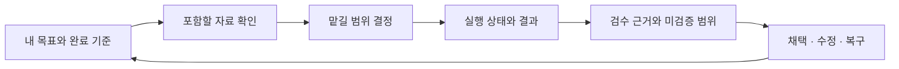

# 수업별 Agent 경험 — Mission·Intent·디자인 제안

상태: 제안, 구현·운영 정책으로 아직 채택하지 않음. 날짜: 2026-09-08 · [#746](https://github.com/jayleekr/hypeproof-studio/issues/746).
근거: [경쟁 분석 및 직접 캡처](../research/agent-experience-2026-09-08/README.md).
철학의 원본은 [7 AI Native Assets](../seven-assets.md), 배치는 [Vessel](../plan/vessel-and-modules.md)을 따른다.

## 제품 Mission에 연결할 문장

> Studio는 학습자가 AI와 함께 자기 목적을 구현하고, 위임 범위를 판단하며,
> 결과를 검증하고 책임지는 작업 공간이다. 강사는 그 경험을 수업에 맞게 구성하고 반복 운영한다.

이 문장은 기존 철학의 제품 적용 제안이다. 자산 정의나 Lab의 전체 Mission을 새 문서로 복제하지 않는다.
범용 Agent의 모든 기능을 노출하는 것보다, 학생이 자기 선택과 결과를 설명할 수 있는지를
기능의 도입 기준으로 삼는다. Cursor 등과 경쟁할 기본 작업 품질도 필요하다. 불편함을 학습으로 정당화하지 않는다.

## Product Intent

| ID | 사용자 의도 | 관측 가능한 결과 | 연결 자산 |
|---|---|---|---|
| INT-AE-01 | 학생이 무엇을 만들고 무엇이 좋은 결과인지 정한다 | 과제 안내와 별개로 자기 목표·완료 기준을 수정하고 참조한다 | Intent clarity, Taste |
| INT-AE-02 | AI에게 줄 자료와 맡길 일을 고른다 | 포함한 파일/페이지/이미지와 맡긴 역할·범위를 설명하고 취소한다 | Context design, Delegation judgment |
| INT-AE-03 | 결과를 확인하고 다시 고친다 | 변경과 검수 근거를 연결하고 미검증 범위를 말하며 되돌린다 | Verification reflex, Iteration reflex |
| INT-AE-04 | 결과물을 자기 것으로 이어간다 | 수업 종료 후 프로젝트·결정·검수 기록에 접근하며 독립 과제를 수행한다 | Ownership |
| INT-AE-05 | 강사가 수준·단계에 맞는 도움을 여러 기수에 제공한다 | 학생 권한으로 리허설하고 고정된 수업 설정으로 복제·운영·개입한다 | Context design, Delegation judgment |
| INT-AE-06 | 강사가 수업에서 AI가 어떤 이름과 역할로 참여하는지 정한다 | “코치” 고정 호칭 없이 이름·역할 소개·말투를 구성하고 학생은 AI임을 안다 | Context design, Ownership |
| INT-AE-07 | 학생이 과제에 맞는 AI를 선택하고 다른 결과를 근거로 비교한다 | 강사가 정한 선택 범위 안에서 실제 모델·위임 이유·검수 근거·비용을 확인하고 결과 채택을 설명한다 | Delegation judgment, Verification reflex, Taste |

## 화면 구조

학생의 기본 화면은 **현재 과제 + 대화/실행 + 결과/검수**로 구성한다.
좁은 창에서는 현재 과제 요약을 고정하고 대화·결과를 탭으로 전환한다.
강의 본문 전체는 펼쳐 읽는다. 한 번에 모든 콘솔과 전문 설정을 보여주지 않는다.



| 결정 | 제안하는 동작 | 근거/양보하지 않을 점 |
|---|---|---|
| 의미가 먼저 보이는 작업 타임라인 | “진료시간 수정”, “모바일 화면 확인”을 기본 표시하고 도구명·인자·로그는 상세 보기 | 현재 도구 행을 재사용. 활동 요약을 숨은 추론 원문으로 만들지 않음 |
| 맥락을 보고 편집 | 입력 위에 선택한 파일·페이지·요소·이미지 칩, 출처/시각/전송 범위 표시 | 자동 맥락과 학생 선택 맥락을 구분. 제거한 자료가 요청에 다시 들어가지 않아야 함 |
| 실행 상태를 사실대로 | 준비/실행/학생 승인 대기/강사 정책 대기/오류/중지/완료를 구분 | 무응답을 생각 중으로 영구 표시하지 않음. 도구 성공을 학습 완료로 표시하지 않음 |
| 검증이 보이는 결과 카드 | 변경 파일, 전후 비교, 검사한 조건·결과·화면, 미검증 범위, 되돌리기 | “수정했어요”만으로 끝내지 않음. 학생 직접 검사와 자동 검사를 구분 |
| 승인은 판단 단위로 | 파일·대상 origin·작업 목적·기한이 같은 제한된 작업 묶음에 승인 제안 | 무제한 자동 승인은 아님. 공개 제출·파괴·권한 확대는 별도 확인. 기존 승인 계약 변경은 명시적 구현 PR로 처리 |
| 수업 언어의 기능 선택 | “자료 조사”, “홈페이지 수정”, “화면 검수”, “외부 서비스 실습”처럼 설명 | SDK 플래그·MCP 서버명은 강사 고급 설정/진단에서만 노출 |
| 수업별 AI 정체성 | “제작 파트너”, “검토 도우미” 등 강사 지정 이름·역할·말투와 학생 개인화 허용 | 기존 ux.coach 재사용. AI 배지 유지, 모든 표시 문구 일치, 다른 수업의 이름 누출 금지. 이름은 권한이 아님 |
| 일관된 기본 디자인 | 시작 화면의 색/형태/어조를 채팅에 연결. 한글 동작 라벨·본문 가독성·키보드 우선 | 기존 [DES-02/03/06/11](../requirements/classroom-design.md)를 채팅에 적용할 인수 기준으로 제안 |

학생에게 강사의 운영 권한을 주지 않으면서 도움 수준은 점진적으로 줄인다.
시연에서는 과정을 해설하고, 안내 실습에서는 학생이 범위를 선택하며, 독립 과제에서는
요청한 제한된 도움과 검수만 제공한다. 단순히 버튼을 더 누르게 만드는 방식은 채택하지 않는다.
힌트/함께 수행/독립 수행은 교수 전략이다. 실행 권한과는 별도로 버전 관리한다.

## RBAC만으로 부족한 이유와 권한 제안

RBAC는 **누가 수업을 편집하고 운영하는가**를 정한다.
같은 학생이 같은 날 “자료 탐색” 단계에서 브라우저를 쓰고 “독립 검수” 단계에서
읽기만 해야 하는 조건은 수업·단계·행위·대상 속성을 함께 봐야 한다.
학습 성취 등급을 권한 역할로 바꾸지 않는다.

| 주체 | 허용 범위 제안 | 다른 권한으로 자동 이어지지 않는 것 |
|---|---|---|
| 학생 | 자기 수업·프로젝트 실행, 공유 선택, 승인/거절, 자기 결과 내보내기 | 강사 권한, 다른 학생 데이터 |
| 강사 | 배정된 수업 설계·리허설·허용 상한 안 기능 설정·운영 | 플랫폼 상한 변경, 학생 비밀/전체 대화 원문 열람 |
| 조교 | 명시적으로 배정된 수업의 현황/도움 처리 | 강의 확정·기능 확대·학생 화면 제어; 기존 역할 구현 여부부터 확인 |
| 플랫폼 관리자 | 실행 환경/도구 카탈로그·정책 상한·운영 장애 | 수강생 원문 접근에 대한 포괄 동의 |

실행 가능 집합은 다음 교집합으로 계산한다. **명시적 deny가 우선**한다.

```text
플랫폼 정책 상한
∩ 역할과 수업 배정 범위
∩ 확정 수업의 기능 프로필
∩ 현재 단계의 허용 행위·대상
∩ 지원되는 실제 런타임 기능
```

교집합 안의 행위도 자격 유효성·학생 승인·리소스 잠금·예산 조건을 통과해야 실행한다.
학생의 승인은 교집합을 확장하지 않는다. 강사 설정이나 프롬프트도 플랫폼 상한을 확장하지 않는다.
기능 미지원과 정책 거절을 다른 이유로 표시한다. `read/write/browser=true`를 전부 `allowedTools`에
넣는 식으로 구현하지 않는다. [SDK 승인 평가 순서](https://code.claude.com/docs/en/agent-sdk/permissions)가 다르기 때문이다.

이 계약은 Studio가 제공하는 실행 경로를 통제한다. 학생이 자기 OS에서 임의 프로그램을
실행하는 것까지 차단하는 단말 관리 체계는 아니다. 적대적 로컬 코드까지 격리해야 하는
수업은 filesystem/network를 집행하는 sandbox 또는 원격 실습 환경이 추가로 필요하다.
클라이언트에서 버튼을 감추거나 파일 도구만 제한해서 이 수준의 격리를 보장하지 않는다.

### 한 수업의 예

| 단계 | 학생이 판단할 것 | 허용 기능 제안 | 자동화 경계 |
|---|---|---|---|
| 참고 사이트 관찰 | 채택할 구성과 이유 | 승인된 origin 탐색, 화면/DOM 읽기 | 로그인·폼 제출은 포함하지 않음 |
| 홈페이지 제작 | 어떤 내용과 배치를 바꿀지 | workspace 읽기/쓰기, local preview | 자유 셸 대신 검증된 실행 작업을 우선. 파일 집합·복구 지점 표시 |
| 모바일 검수 | 통과 기준과 발견한 결함 | 지정 viewport 검사, 읽기 전용 리뷰어 | 모델의 평가만으로 완료시키지 않음 |
| 공개 연습 | 공개할 대상과 영향 | 시험 호스팅의 지정 배포 작업 | 대상·최종 결과를 사람이 확인. 공개 자격은 복제하지 않음 |
| 독립 과제 | 휴진 공지를 스스로 수정·검수 | 교사가 정한 힌트/검수 범위 | 역할은 그대로 학생. 도움 사용 기록은 성적 자동 판정이 아님 |

초기 대상은 성인 정적 홈페이지 과정이다. 아동의 현재 browser/shell/subagents 제한을
이 제안으로 완화하지 않는다. 아동의 기존 read/write opt-in은 별개다.

## 멀티모델을 수업의 선택권으로 설계

근거: [멀티모델 경쟁 분석·코드 감사](../research/agent-experience-2026-09-08/multi-model.md).
제품 Mission의 “위임 범위를 판단한다”에는 어느 AI에 맡길지와 다른 답을 어떻게 검증할지도 포함한다.
모델 이름을 많이 외우게 하는 것이 학습 목표는 아니다.

| 수업 모드 | 강사 설정 | 학생 경험 | 도입 |
|---|---|---|---|
| 고정 | 단계별 검증한 모델·실행기, 대체 허용 여부 | 선택 부담 없이 시작. 실제 모델과 고정 이유 확인 | P0 기본 |
| 제한 선택 | 수업 목적에 맞는 소수 후보와 기본값 | 입력창에서 허용 모델 선택. 지원 작업·자료 범위·비용 정보 확인 | P0, 기존 검증 경로부터 |
| 자동 | 허용 후보·속도/비용/품질 우선순위·예산 | “수업 자동”으로 시작하고 턴별 실제 모델·선택 이유 확인 | P1 |
| 비교 | 두 후보/역할·공통 자료·평가 기준·횟수 상한 | 두 결과의 근거를 비교하고 선택 이유를 남김 | P1 읽기 검토; 병렬 편집 P2 |

강사 기본 화면은 이 네 모드와 수업 템플릿을 중심으로 한다. 공급자 키·API 호환성·임의
endpoint 입력을 매 수업 설정에 노출하지 않는다. 기관 관리자는 제공 가능한 카탈로그와
자격을, 담당 강사는 그 안의 수업/단계 정책을, 학생은 허용된 개인 선택을 관리한다.
다른 수업에서 받은 모델 권한이 현재 수업의 제한을 넓히지 않는다.

**AI identity, 역할, 모델, 실행기, 도구 권한은 각각 독립된 값이다.** 예를 들어
“제작 파트너 · AI”라는 이름은 유지한 채 “수업 기본 모델”을 사용할 수 있다.
“검토 도우미”라는 역할에 다른 모델을 배정할 수도 있지만 역할명 변경이 그 모델이나 권한을
자동으로 선택하지는 않는다. 내부 안정된 assistant ID와 턴별 실제 provider/model을 함께 남긴다.

학생 UI 제안: 입력창 가까이에 `수업 기본 ▾`를 두고 허용된 소수 후보·현재 선택·지원 능력을 표시한다.
일반 학생 화면에 SDK/API 용어를 노출할 필요는 없다. 사용할 수 없는 작업은 “이 선택에서는
화면을 직접 조작할 수 없어요”처럼 행동 기준으로 설명하고 해결 가능한 선택을 제시한다.
응답에는 실제 모델, 자동/대체 이유, 제공자와 전송 자료 범위, 사용량/미확인을 상세로 제공한다.
표시 이름/별칭만 바꾸고 실제 모델 변경처럼 표현하지 않는다.

### Service가 확정하는 모델 계약

| 계약 | 제안 |
|---|---|
| 허용 계산 | 기관 카탈로그 ∩ 수업/단계 정책 ∩ 학생 배정 ∩ 모델/실행기 능력 ∩ 자료 전송 허용 ∩ 예산. 클라이언트 model 문자열은 요청일 뿐 |
| 능력 카탈로그 | provider/model ID와 alias 매핑 revision, 실행기/SDK 버전, text/vision/tools/effort/context 한도, 검증한 browser/OS 조합, 검증 시각·상태. 기존 model-caps/프로필/번역기 확장 |
| 실행 기록 | 요청한 선택, 확정 provider/model/runtime, 역할, catalog/policy revision, 대체 사유, 문맥 snapshot, 사용량·미확인 비용. 내부 추론 원문을 기록하려는 계약이 아님 |
| 재현/교체 | 확정 수업은 후보·기본값·매핑·실행기 호환 범위를 snapshot으로 보존. 새 모델은 리허설→새 버전→제한 배포→복귀. 자동 모드는 정책과 실제 선택 이력을 재현 가능하게 함 |
| 모델 은퇴/긴급 제한 | 실제 서비스를 유지할 수 없는 핀은 사용 불가로 표시. 새 승인 버전이나 사전 승인 대체 경로로 이동하고 사건 기록. 과거 이력을 새 모델로 고쳐 쓰지 않음 |
| 자격/자료 | 기본은 기존 서버 소유 키. 수업이 허용한 전송 대상만 사용. BYOK/로컬 모델은 별도 고급 경로로 나중에 검증하며 키 입력만으로 수업 제한을 우회하지 않음 |

역할별 모델 배정은 “만드는 모델 + 읽기 검토 모델”부터 도입한다. 편집자는 한 명으로
유지하고 검토자는 지정된 산출물/근거만 읽는다. 모델 다수결을 합격 근거로 쓰지 않는다.
병렬 편집은 파일뿐 아니라 브라우저 context·실행 자격·출력 경로가 분리된 실행 환경과
채택/폐기/충돌 검토가 준비된 뒤 허용한다. 공유 workspace에 두 편집기를 동시에 붙이지 않는다.

### 변경·자동 선택·실패의 경계

같은 실행기 안의 모델 변경도 턴 경계에서 처리하고 적용될 다음 작업을 표시한다.
공급자/실행기가 바뀌면 세션 ID를 그대로 재사용하지 않는다. 학생이 전송 범위를 확인한
목표·선택 자료·산출물·검수 기록으로 새 세션에 인계하고 원본은 보존한다. 문맥 창이 작으면
빠지는 내용과 요약을 확인하게 하며, 숨은 추론·자격·과거 도구 승인 상태를 옮기지 않는다.

Auto는 작업 전 선택 정책이고 fallback은 실패 후 복구 정책이다. 각각 승인 목록과
예산을 적용한다. 초기 Auto는 단계/역할/필요 능력 기반의 설명 가능한 규칙으로 시작한다.
학습된 라우터의 품질 이득은 관측 후 별도 판단한다. 품질이 나빠 보인다는 이유만으로
다른 공급자에 같은 자료를 자동 전송하지 않는다.

일부 출력/파일 변경/외부 효과 뒤 실패하면 진행 사실을 보존하고 재개 또는 새 시도를 명시한다.
다른 모델의 재시도로 외부 행위가 중복되지 않도록 작업 ID와 실행 기록을 연결한다.
결과가 불확실한 외부 효과는 중복 실행 방지를 증명할 수 없으면 자동 재실행하지 않는다.
모든 분기·보조 모델·재시도 비용을 E3의 같은 학급 예산에 예약하고, 한 학생의 비교 작업이
다른 학생의 첫 응답을 장시간 막지 않도록 E5 보드에서 대기 원인과 제한을 확인한다.

## 강사가 규모 있게 운영하는 방식

강사가 매 학생의 도구 호출을 승인하면 규모가 커질수록 수업이 멈춘다.
**강사는 수업의 허용 범위와 예외를 운영하고 학생은 자기 작업의 결정을 내린다.**

1. 기존 Chalk authoring에서 검증된 기능 템플릿과 도움 전략을 선택한다.
2. 학생 권한의 독립 프로젝트로 리허설한다. 강사의 로그인·로컬 도구가 성공을 대신하지 않는다.
3. 수업 콘텐츠 해시·정책 revision·SDK/앱 호환 범위·리허설 증거를 함께 확정한다.
4. 학생은 참여 후 실제 기기 준비 상태를 검사한다. 미지원은 원인과 해결을 보여준다.
5. 강사는 metadata 보드와 도움 요청 큐를 보고 같은 원인의 장애를 묶어 처리한다.
6. 공유가 허용된 결과·판단·검수 기록으로 회고하고 다음 기수의 초안을 고친다.

운영 단위는 학생 수뿐 아니라 동시에 실행되는 모델·브라우저·셸 작업이다.
학생별 공정 대기열, 학급/학생 예산 예약, 시간 제한과 재시도 예산, 브라우저/파일 편집의
단일 소유 실행을 둔다. 기존 기본 동시성 2를 학생 수와 곱해 서버 용량으로 간주하지 않는다.
30명 파일럿 → 100명 합성 부하를 **시험 목표**로 제안하며 검증된 수용량으로 광고하지 않는다.

정책 긴급 축소/수업 일시정지는 새 실행 차단과 진행 작업 중단을 구분한다.
앱이 오프라인이거나 SDK가 외부 도구를 이미 호출한 상태에서 즉시 전원 정지를 보장할 수 없다.
짧은 정책 유효기간, 실행 직전 재확인, 호스트 stop, 서버 요청 차단을 조합하고 잔여 실행을 표시한다.
예산도 이미 전송한 요청의 비용과 최종 집계 지연을 포함해야 한다.

## Browser Use와 Computer Use의 별도 경계

| 능력 | 실행 경계 | 도입 판단 |
|---|---|---|
| 브라우저 조회/검수 | 수업에 연결된 탭·origin·학생별 브라우저 context | 기존 App browserMcp/browserControl 확장으로 우선 진행 |
| 브라우저 외부 조작 | 폼 전송·계정·업로드·다운로드·리다이렉트 | 행위별 정책과 인계 필요. 페이지가 바뀌면 대상/승인 재평가 |
| Computer Use | OS 화면·키보드·마우스·앱·클립보드·파일 선택기 | 웹으로 못 하는 과제가 있을 때 격리 실습 데스크톱으로 검증 |

Computer Use를 “SDK 기능 켜기”로 처리하지 않는다. 제공자가 정의한 도구를
우리 환경에서 실행하는 구현이 필요하다. [Anthropic 공식 문서](https://platform.claude.com/docs/en/agents-and-tools/tool-use/computer-use-tool).
첫 실험은 합성 자료를 사용한 전용 VM의 문서 앱 작업이다. 개인 바탕화면 전체 제어와
강사의 학생 PC 원격 접속은 각각 별도 권한·동의 계약이 필요하며 이번 제안에 포함하지 않는다.
브라우저 읽기 실패를 이유로 더 넓은 Computer Use 권한으로 자동 전환하지 않는다.

## 구현 배치와 기존 자산 재사용

| 레이어 | 소유할 것 | 재사용 및 계약 경계 |
|---|---|---|
| App | 기존 채팅/모델 선택 표시, local filesystem/browser/SDK 실행, 승인·중지, 로컬 복구 | 기존 ChatPanel·sdkCoach·browserMcp. 수업 내용/임계값을 바이너리에 고정하지 않음 |
| Service | 인증·배정·정책·모델 카탈로그/해석·예산·실행 자격·버전 binding | 기존 profile/authoring/classroom API와 공급자 번역기 확장. 새로운 로그인·정책 저장소를 먼저 만들지 않음 |
| Surface | 기능/모델 템플릿 편집·학생 조건 리허설·운영 현황·예외 처리 | Chalk authoring/board/classroom 및 #732 재사용 |
| Module | 목적·과제·교수 전략·검수 기준·필요 기능/모델 사용 방식의 참조 | 기존 hps-module/1·session-design 진화. 콘텐츠 자체는 권한을 부여하지 않음 |

새 통합의 외부 계약은 기존 resolved profile의 **수업 실행 binding** 한 곳으로 모은다.
session-design/1은 현재 정확한 필드만 허용한다. 임의 capability 필드를 넣지 말고,
새 schema revision과 구버전 소비자 처리·drift lock을 먼저 정의한다. 내부 상태/DB 선택은
기존 D1 authoring 모델을 조사한 구현 ADR에서 결정한다. 교차 레이어 이벤트는 이 binding과
기존 이벤트 envelope의 연결로 설계하고 독립된 상태 원본을 여럿 만들지 않는다.

제거 계획: 새 프로필 필드를 제거하면 새 기능만 사용 불가로 표시하고 기존 과제/파일 열기는 유지한다.
Chalk 편집기·브라우저 검수 카드·Computer Use 어댑터는 각각 끌 수 있어야 한다.
지원하지 않는 새 수업은 조용히 더 약한 수업으로 실행하지 않고 호환 불가를 알린다.

## 철학 자료를 유지하는 더 좋은 방법

경쟁사 스크린샷을 철학 문서 본문에 누적하면 제품 변경마다 철학이 흔들린다.
**철학 원본 → 버전 있는 비교 증거 → 설계 결정 → 요구사항 → 실행 증거**로 연결한다.
이번 문서는 그 중 설계 결정 제안이며 [에픽](../plan/learning-agent-experience-epics.md)의 입력이다.

첫 파일럿에서 가설을 반증할 수 있게 한다. 승인 횟수가 줄어도 위임 범위 이해가
나빠지면 승인 묶음 설계를 되돌린다. 자동 검수 후 학생이 미검증 범위를 설명하지 못하면
검수 카드가 교육 목적을 충족한 것이 아니다. 강사 개입이 감소해도 조용한 학생이 목록에서
사라졌다면 개선이 아니다. 관측 지표는 [테스트 제안](../testing/learning-agent-experience.md)에 둔다.
