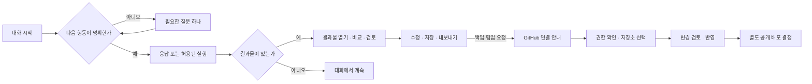

# 체험 대화와 GitHub 연결 경험

상태: 설계·요구사항 계획. [에픽 #844](https://github.com/jayleekr/hypeproof-studio/issues/844).
2026-09-08 · 제품 담당: Jay. 아래 CU/GHX 전체 구현 완료를 뜻하지 않는다.
상위 기준은 [Product Intent](../PRODUCT-INTENT.md), 자산 정의는 [참조 인덱스](../seven-assets.md),
기존 범위는 [Agent 경험 요구사항](../requirements/learning-agent-experience.md)이다.
이 문서는 #746의 대화·권한·운영 요구사항을 현재 체험 화면에 구체화한다.

## 사용자가 얻어야 하는 경험

자기 삶의 실제 일을 AI와 진행하고, 결과를 보고 고치며, 어디까지 맡길지 판단한다.
명확한 요청은 바로 실행한다. 모호한 요청에는 한 번에 필요한 질문 하나를 묻고,
답이 여전히 막연하면 그 답을 바탕으로 탐색을 이어간다. 전체 질문 횟수를 정하지 않는다.
첫 파일 형식, GitHub 계정, 목표 진술 설문을 입장 조건으로 삼지 않는다.

사용자가 제공한 HP 화면에서는 업데이트, 작업 돌아보기, 도구 행이 답변 위에서 큰 공간을
차지하고 대화가 창 전체 폭으로 펼쳐진다. `Read(index.html)`은 읽기 증거이며 수정 증거가 아니다.
시작용 HTML이 과제보다 먼저 주어지는 문제는 [#842](https://github.com/jayleekr/hypeproof-studio/issues/842)에서 수정한다.

## 경쟁 제품의 관측과 해석

원본 구분·캡처·한계는 [화면 조사](../research/trial-conversation-2026-09-08/README.md)에 있다.

| 근거 | 관측 또는 공식 설명 | HP 결정 |
|---|---|---|
| 사용자가 제공한 Cursor 채팅과 모델 잠금 팝업 | 대화, 하단 입력창, 모델 선택, 업그레이드 진입점이 구분됨 | 대화와 입력창을 하나의 읽기 축으로 정렬하고 모델 권한은 선택 순간에 설명 |
| Cursor 3.19.13 실제 설정 | 계정/요금제, Git & PRs, 연결 시작을 각각 배치 | 모델 결제·계정 연결·파일 반영의 권한을 분리 |
| [Cursor 사용량 문서](https://prod.cursor.com/help/models-and-usage/usage-limits) | 포함 이용량 소진 때 추가 이용 또는 플랜 변경 경로 안내 | 남은 범위, 초기화 시점, 추가 비용 여부와 계속할 대안을 표시 |
| [Claude Artifacts](https://support.claude.com/en/articles/9487310-what-are-artifacts-and-how-do-i-use-them) | 재사용할 콘텐츠를 대화와 별도 공간에서 다루고 버전을 선택 | 결과물이 실제 생겼을 때 검토 공간을 열고 문서·표·웹별로 표시 |

Cursor의 전환 의도에 대한 **해석**: 무료로 첫 응답을 경험하게 하고, 더 높은 성능을 원하는
모델 선택 순간에 결제 이유를 제시한다. 연결 체크리스트는 사용자의 저장소로 작업 범위를
넓히는 진입점이다. 내부 전환율·고객 유지 효과는 확인하지 않았다. 무료 모델 표시가 공급자 API의
무제한 무료 이용이나 구독 OAuth의 재판매 권한을 뜻하지도 않는다.

HP는 체험 제공분, 수업에 포함된 이용, 개인 추가 이용을 구분한다. 수업 참가자에게 개인 결제를
먼저 요구하지 않는다. 부족하면 사용할 수 있는 모델과 운영 담당자에게 허용 요청하는 방법을
보여준다. 실제 과금·가격·플랜 판매는 이번 에픽 문서로 활성화하지 않는다.

## 화면과 상태

대화 본문은 약 760~820px의 읽기 폭을 시작안으로 삼되 실기 검수에서 조정한다.
입력창은 같은 축에 두고 첨부·모델·전송·정지를 묶는다. 탐색 영역은 접을 수 있다.
업데이트는 입력을 막지 않는 알림으로, 긴 회고는 요청하거나 작업이 끝난 때에 연다.
현재 실행은 상태 한 줄로 보여주고 펼치면 실제 도구 결과를 본다. 내부 추론을 작업 기록으로
꾸미거나 도구 성공 표시를 과제 검증 완료 표시로 바꾸지 않는다.

## 대화 요구사항

| ID | 수용 기준 | 작업 |
|---|---|---|
| CU-01 | 390·768·1280·1920px에서 읽기 폭과 입력창 축 유지, 전체 가로 스크롤 없음 | #845 |
| CU-02 | 첫 입력에 빈 파일/미리보기/회고 공간을 강제로 펼치지 않음 | #845, #842 |
| CU-03 | 작성·전송·응답 중·예약·중지의 상태와 버튼 이름이 실제 실행 상태와 일치 | #845 |
| CU-04 | 새 대화/과거 대화/설정/결과물 탐색을 구분하고 초안·스크롤 위치 보존 | #845 |
| CU-05 | 업데이트·면책·회고의 보조 정보가 입력과 답변을 밀어내지 않음 | #845 |
| CU-06 | 실행 상태 요약 하나, 펼친 내역에 실제 요청·성공·실패·중단과 근거 | #846 |
| CU-07 | 파일 변경이 없으면 고쳤다는 문구 없음; 도구 성공과 검증 성공 구분 | #846 |
| CU-08 | 결과가 생성된 후 문서/표/웹에 맞는 검토 공간 제공; 대화로 복귀 가능 | #846 |
| CU-09 | 파일별 변경 전후·사용자 수정·보존·복구 범위 표시, 승인 없이 기존 파일 삭제 금지 | #846 |
| CU-10 | 사용자 확인·수정 근거를 결과 버전에 연결; AI 응답만으로 학습 효과 판정 금지 | #846 |
| CU-11 | 모델 선택 시 사용 가능/수업 제한/한도 소진/공급자 오류를 구분 | #847 |
| CU-12 | 체험·수업 포함·개인 이용의 주체와 제공 범위를 명시 | #847, #800 |
| CU-13 | 남은 한도와 초기화 시점은 Service가 확인한 값; 미확인은 0 또는 무제한으로 표시 금지 | #847, #841 |
| CU-14 | 한도에 도달해도 파일·대화·내보내기를 열람 가능; 추가 비용 자동 발생 금지 | #847 |
| CU-15 | 수업 참가자는 담당자 요청, 개인은 선택적 추가 이용; 현재 가능한 대안을 함께 표시 | #847 |
| CU-16 | 키보드·스크린리더·200% 확대에서 순서/포커스/상태 알림 검증 | #848 |
| CU-17 | 중단·네트워크 단절·인증 만료·한도·재시작의 복구 흐름에서 초안과 부분 결과 보존 | #848 |
| CU-18 | 첫 유용한 결과·사람의 검토·다음 방문을 구분해 관측; 토큰 소비를 학습 성과로 해석 금지 | #848 |

CU는 NAT/TUX/AE의 세부 수용 기준이다. 별도 세션·학습 점수·인증 저장소를 만들지 않는다.
구현 상태는 PR과 [실행 기록](../testing/trial-conversation-experience.md)이 소유한다.

## GitHub 연결 요구사항

작업: [#849](https://github.com/jayleekr/hypeproof-studio/issues/849).
현재 소스의 release 다운로드·지원 요청 초안은 학습자 GitHub 연결 기능이 아니다.
개발 전 기존 publishing/Device Flow 구현을 다시 조사하고, 선택한 인증 방식과 필요한 권한을
ADR로 고정한다. App은 안내/복귀/파일 차이를, Service는 해당 방식의 권한 검증을,
Chalk는 강사·수업 설정을 맡는다. 강사 자격 증명을 학생에게 넘기지 않는다.

| ID | 수용 기준 |
|---|---|
| GHX-01 | GitHub 없이 로컬 체험 가능. 백업/협업 요청 및 설정의 연결 메뉴에서 진입 |
| GHX-02 | 연결 목적·사용 계정·필요 동작·대상 저장소를 승인 전에 설명. PAT를 채팅이나 커맨드 팔레트에 붙여넣게 하지 않음 |
| GHX-03 | 일회성 state/만료/정상 callback 검증, 취소·시간 초과·다른 계정 복귀 구분. API 확인 뒤 연결됨 표시 |
| GHX-04 | 선택 저장소 권한을 기본으로 설계. 소유자·이름·공개 범위·브랜치·실제 권한 확인, 조직 승인/SSO 대기는 별도 상태 |
| GHX-05 | 연결·저장소 생성·업로드·공개 배포는 서로 다른 행동. 연결만으로 파일 업로드/공개 범위 변경/배포 없음 |
| GHX-06 | 반영 전 diff·대상·제외 파일 확인, 시크릿 전송 차단, 전용 브랜치/PR과 보호 규칙 준수 |
| GHX-07 | 마지막 확인 커밋, 미반영 변경, 충돌, 오프라인 상태 구분. 반영 성공은 API readback으로 확인 |
| GHX-08 | 연결 해제 뒤 원격 작업·자격 증명 사용 중지, 로컬 파일 보존. HP 연결 해제와 GitHub App 설치 철회 범위를 구분 |
| GHX-09 | 인증 만료/철회, 접근 금지/SSO, 빈 목록/미선택 저장소, rate limit, 충돌에 다른 원인·복구 경로 제공 |
| GHX-10 | 개인·강사·참가자의 접근 범위를 분리, 수업 코드가 GitHub 권한을 자동 부여하지 않음 |
| GHX-11 | 외부 브라우저로 이동함을 안내하고 돌아오기/취소/재시도 제공. 재시작 때 초안과 원래 작업으로 복귀 |
| GHX-12 | 증거는 안전한 요청 ID·상태·버전 중심. 인증 URL query, 토큰, 개인 정보, 비공개 파일을 공개 보고서에서 제외 |

설계 후보 문구: “GitHub에 백업하기”, “연결할 저장소 선택”, “변경 확인 후 반영”,
“이 컴퓨터에서 계속”, “조직의 접근 승인을 기다리는 중”. 연결 버튼에 배포 성공을 암시하지 않는다.

## 구현 순서와 완료 판단

1. #842 시작 파일/첫 대화 수정과 실제 Mac 회귀.
2. #845 레이아웃·입력 상태, #846 결과물 검토. 사용자의 작업 진행과 검수에 직접 영향.
3. #847 권한·한도 안내를 #800/#841 Service 근거에 연결. 결제 활성화는 별도 결정.
4. #849 연결 UX는 승인된 테스트 계정/저장소와 최소 권한 설계 후 구현.
5. #848가 각 단계의 전체 상태·접근성·설치본 회귀를 확인.

이 문서의 완료는 요구사항·테스트·이슈 연결의 완료다. 기능 완료에는 최신 head 테스트,
실제 설치 앱 재실행, 필요 배포 확인이 추가로 필요하다. 사람의 학습 효과는 별도 검증이다.
