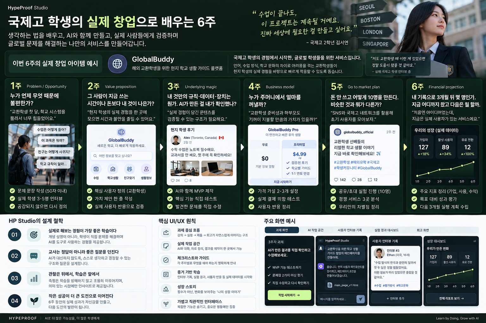
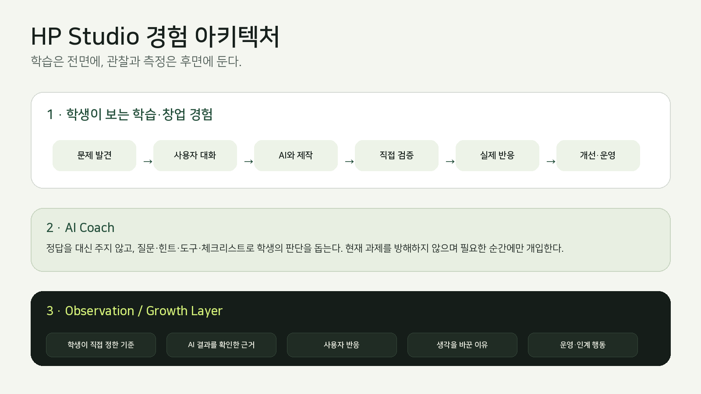
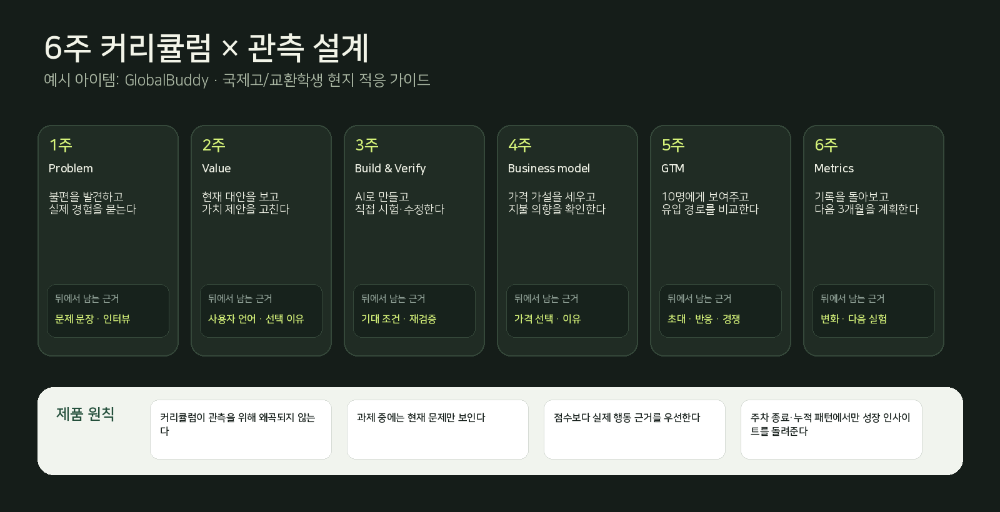
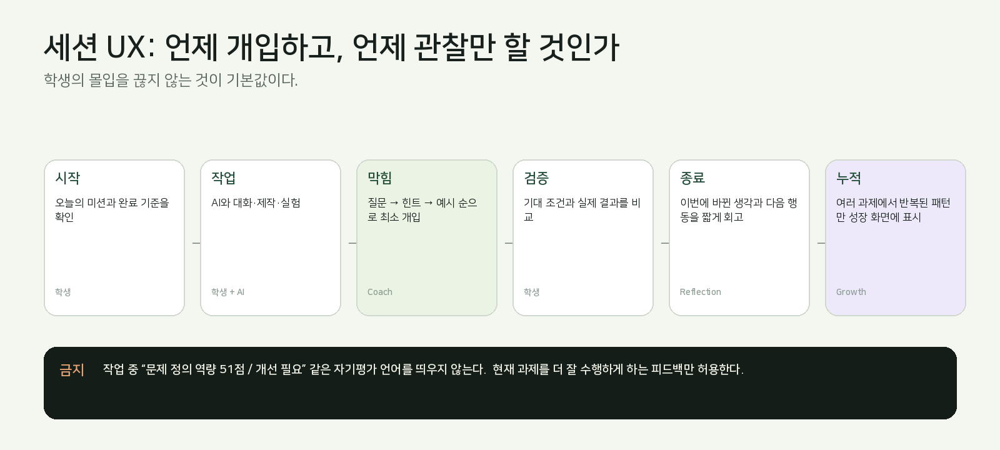

# HP Studio UI/UX 설계 철학 (원문 보존본)

> 작성일 2026-09-18 · 상태: 활성 · 작성자: Jay · 원본: `assets/ux-2026-09-18/HypeProof_Studio_UIUX_Design_Philosophy.docx` (UX concept v1)
> 이 파일은 원문을 마크다운으로 옮긴 보존본이다. 요구사항화한 결과는 [분류표](ux-principles-breakdown-2026-09-18.md), [Intent](../intents/studio-learning-experience.md), [요구사항 SX](../requirements/studio-learning-experience.md)에 있다. 이 문서의 문장을 고치지 말고 파생 문서를 고친다.

국제고 학생의 실제 창업으로 배우는  
HP Studio UI/UX 설계 철학

커리큘럼이 앞에 있고, AI는 코치이며, 관찰은 뒤에서 조용히 따라가는 학습·창업 경험의 상세 설계 문서

> **한 문장으로** · HP Studio는 학생의 능력을 평가하는 화면이 아니라, 학생이 실제 문제를 발견하고 AI와 만들고 사용자에게 검증하면서 스스로 판단하는 경험을 설계하는 작업실이다.

| **항목** | **정의** |
|----|----|
| 주 대상 | 중·고등학생. 이 문서의 대표 시나리오는 국제고 학생을 기준으로 한다. |
| 대표 창업 아이템 | GlobalBuddy — 교환학생/전학생의 학교 적응을 돕는 학생 주도 현지 생활 가이드 서비스 |
| 핵심 원칙 | Curriculum-first · Learning-before-measurement · Evidence-over-score · Coach-not-answerer |
| 제품 범위 | 강의/과제 → Studio 작업실 → 실제 사용자 검증 → 운영 기록 → 성장 인사이트 |
| 문서 버전 | 2026-09-18 · UX concept v1 |

# 0. 비주얼 컨셉 — 국제고 학생 버전

GlobalBuddy 예시로 재구성한 6주 창업교육 + 관측 UX 컨셉

이 이미지는 최종 화면 정의가 아니라, “학생에게는 창업 과정이 보이고, 관찰/성장 데이터는 뒤에서 쌓인다”는 제품 철학을 한 장에 압축한 컨셉 보드다. 실제 제품에서는 각 주차를 독립 화면으로 쪼개고, 한 화면에 많은 정보를 동시에 노출하지 않는다.

# 1. 설계의 출발점

Source baseline

기준 자료의 핵심 프레임은 명확하다. HypeProof는 “AI가 일하는 세상에서, 판단하는 사람”을 기르는 것을 미션으로 두고, 문제 구성·판단·역할/통제 설계·검증·전략 수정·책임의 여섯 힘을 AI 창업을 통해 경험하게 한다. 또한 제품 구조는 Chalk에서 강의를 설계하고, Studio에서 학생이 문제를 정하고 AI로 만들고 직접 검증한 뒤, 운영 게시판에서 실제 반응을 받아 개선하는 흐름으로 정의되어 있다.

> **따라서 UX의 질문** · “역량 점수를 어떻게 더 잘 보여줄까?”가 아니라 “학생이 문제를 풀고 만들고 검증하는 과정에서 스스로 판단하도록 어떻게 도울까?”가 먼저다.

## 설계 전제

- 커리큘럼은 측정을 위해 왜곡하지 않는다. 좋은 학습 경험에서 자연스럽게 드러나는 행동을 관찰한다.

- 학생이 보는 기본 화면의 주인공은 “현재 과제 / 현재 고객 / 현재 결과물”이다. Framing·Judgment 같은 축은 내부 모델의 언어다.

- AI가 정답을 먼저 주면 학생의 판단 증거가 사라진다. 질문과 점진적 힌트를 기본 인터랙션으로 한다.

- 평가·측정은 작업 중이 아니라 세션 경계, 주차 종료, 누적 패턴 시점에만 의미 있는 형태로 돌려준다.

- 성장은 점수 변화보다 “무엇을 근거로 생각을 바꿨는가”라는 작업 이력으로 설명한다.

# 2. 제품 thesis — 학습은 전면, 측정은 후면

HP Studio의 기본 화면에는 학생의 창업 흐름이 보인다. 관찰 시스템은 그 흐름 아래에서 사건을 기록하고, 충분한 근거가 누적되었을 때만 성장 인사이트를 만든다. 이 분리는 단순한 정보 구조가 아니라 학습 철학이다.

## 세 레이어

| **레이어** | **학생에게 보이는 것** | **시스템의 역할** | **금지** |
|----|----|----|----|
| Learning / Venture | 이번 주 미션, 고객, 결과물, 실제 반응 | 실행 공간과 도구 제공 | 역량 점수로 과제의 초점을 바꾸는 것 |
| AI Coach | 질문, 힌트, 체크리스트, 피드백 | 생각을 구조화하고 위험을 드러냄 | 답·대안·최종 선택을 대신함 |
| Observation / Growth | 기본적으로 숨김. 회고 시 근거와 패턴만 노출 | 행동·결정·검증·변화를 근거로 축적 | 클릭수/토큰수로 능력 추정 |

> **핵심 UX 문장** · 사용자는 “역량을 수행”하지 않는다. 사용자는 고객 문제를 풀고 사업을 만든다. 역량은 그 과정에서 뒤늦게 해석되는 관찰 프레임이다.

# 3. 대상 사용자 — 국제고 학생이라는 맥락

국제고 학생은 일반적인 “학생 창업”보다 더 다양한 맥락을 가진다. 다국어 자료, 해외 사례, 교환학생/국제교류, MUN·토론·리서치, 팀 프로젝트, 문화적 차이 등에서 문제를 발견할 가능성이 높다. UI는 이 다양성을 아이템으로 강제하지 않되, 국제적 맥락을 쉽게 담을 수 있어야 한다.

## 대표 persona

| **Persona** | **상황** | **Studio가 도와야 하는 것** |
|----|----|----|
| 민서 · 국제고 2학년 | 교환학생 친구가 학교 시스템 적응에 어려움을 겪는 것을 봄 | 실제 경험을 묻고, 문제를 과장하지 않게 구조화 |
| Alex · 교환학생 | 수업·교과서·행정·동아리 정보를 한 번에 이해하기 어려움 | 현지 학생의 지식을 검증 가능한 형태로 연결 |
| 팀원 3명 | 영어/한국어 역할 분담, 일정과 제작 방식이 다름 | AI에 맡길 일과 사람이 판단할 지점을 명확히 나눔 |
| 강사 | 학생이 막혔을 때 답을 주고 싶어짐 | 개입 레벨을 지키며 질문과 힌트로 코칭 |

## 국제고 맥락에서 추가되는 UX 요구

- Korean / English mixed input을 자연스럽게 허용하되, 결과의 의미와 근거는 한 화면에서 비교 가능해야 한다.

- “해외에서는 그렇다” 같은 일반화보다, 누가 언제 어떤 상황에서 말했는지 provenance를 남긴다.

- 문화 차이를 정답/오답으로 처리하지 않고, 맥락·대상·근거가 다른 것으로 다룬다.

- 외부 링크·기사·학교 규정·인터뷰 등 서로 다른 evidence type을 구분한다.

- 팀 프로젝트에서 AI 기여와 학생의 판단/수정 기여를 구분하여 기록할 수 있어야 한다.

# 4. UI/UX 디자인 철학 — 10가지 원칙

## 01 · Current problem before self-evaluation

항상 “지금 해결하는 문제”를 먼저 보여준다. 능력·점수·평가 라벨은 현재 과제보다 앞에 오지 않는다.

## 02 · Coach, not answerer

AI는 답을 완성하는 도구가 아니라 학생이 더 좋은 질문·기준·판단을 만들도록 돕는 코치다.

## 03 · Evidence before interpretation

“좋았다/부족했다”보다 실제 인터뷰 문장, 테스트 결과, 변경 전후를 먼저 보여준다.

## 04 · Student owns the decision

추천은 있어도 최종 선택은 학생이 해야 한다. 선택 이유를 짧게 남기는 UX를 기본으로 한다.

## 05 · Progressive help

막히면 질문 → 힌트 → 구조화 예시 → 강사 도움 순으로 단계적으로 개입한다.

## 06 · Boundary-based reflection

실행 중에는 방해하지 않는다. 제출·세션 종료·주차 종료 같은 자연스러운 경계에서만 회고한다.

## 07 · Growth story over score

성장 화면은 “51→58점”보다 “처음엔 가정으로 결정했지만, 최근에는 인터뷰 뒤 결정을 바꿈”을 보여준다.

## 08 · Separate simulation from reality

가상 사용자·샘플 데이터·시뮬레이션은 실제 고객 반응과 시각적으로 분리한다.

## 09 · Reversible and inspectable

AI가 만든 것, 학생이 바꾼 것, 기준이 무엇이었는지 언제든 되짚을 수 있어야 한다.

## 10 · Small success → next challenge

성공을 배지로 소비하지 않고, 다음에 더 어려운 실제 문제로 연결한다.

# 5. 6주 커리큘럼에 UX를 매핑하는 방법

예시 아이템은 GlobalBuddy다. 교환학생·전학생이 낯선 학교의 수업 방식, 행정 절차, 동아리·생활 정보를 이해하도록 현지 학생의 경험을 연결하는 서비스다. 중요한 것은 이 아이템 자체가 아니라, 6주 동안 “문제 → 가치 → 제작/검증 → 가격 → 시장 → 지표”가 하나의 실제 사업 이력으로 이어진다는 점이다.

> **관측 설계 원칙** · 각 주차는 학습목표와 산출물로 설계하고, Observation Layer는 그 산출물을 만드는 과정에서 자연스럽게 생긴 행동만 기록한다. “관측하기 좋은 행동”을 만들기 위해 별도 함정을 넣지 않는다.

# 6. 주차별 상세 UX — 1~3주

| **주차** | **학생 미션** | **대표 시나리오** | **핵심 UI** | **뒤에서 관찰** | **절대 하지 않을 것** |
|----|----|----|----|----|----|
| 1주 · Problem / Opportunity | 누가 언제 무엇 때문에 불편한가? | 교환학생 3~5명에게 “최근 학교에서 가장 당황했던 순간”을 묻고 50자 문제 문장을 만든다. | ① 인터뷰 준비 ② 현장 기록 ③ 문제 문장 ④ 유지/수정/폐기 결정 | 학생이 실제 경험을 묻는가 · 반증이 나오면 문제를 바꾸는가 | 인터뷰 답을 AI가 대신 만들어주거나 “좋은 문제”를 자동 선택하지 않는다. |
| 2주 · Value Proposition | 그 사람이 지금 쓰는 시간/돈보다 내 것이 나은가? | 현재 교환학생이 정보를 얻는 방법(친구에게 묻기, 학교 홈페이지, 단톡 등)을 파악하고 한 줄 가치 제안을 만든다. | ① 현재 대안 카드 ② pain/time 기록 ③ value statement ④ 사용자 문장 인용 | 사용자의 말로 가치가 바뀌는가 · 기능보다 상황/비용을 보는가 | “AI 기반 맞춤형 플랫폼” 같은 추상 문구를 먼저 생성하지 않는다. |
| 3주 · Underlying Magic | AI가 만든 결과를 내가 확인했는가? | GlobalBuddy V1을 만든 뒤 수업/행정 정보가 실제 학교 규정과 맞는지, 기능이 기대대로 작동하는지 직접 확인한다. | ① 기대 조건 ② Build pane ③ Preview/Test ④ 발견한 차이 ⑤ 수정 요청 ⑥ 재검증 | 기대 조건을 먼저 정하는가 · 오류를 근거로 설명하는가 · 같은 조건으로 다시 확인하는가 | 측정을 위해 고의 오류를 추가하지 않는다. 실제 제작 과정에서 생긴 결과를 확인하는 것이 기본이다. |

# 7. 주차별 상세 UX — 4~6주

| **주차** | **학생 미션** | **대표 시나리오** | **핵심 UI** | **뒤에서 관찰** | **절대 하지 않을 것** |
|----|----|----|----|----|----|
| 4주 · Business model | 누구 주머니에서 얼마? | Free / 월 \$4.99 / 학교 라이선스 등 가격 가설을 세우고 실제 사용자 또는 구매자 후보에게 지불 의향을 묻는다. | 가격 가설 카드 · 선택 이유 · 실제 응답 · 다음 실험 | 가격을 숫자로 고정하기 전 대안을 비교하는가 · 사용자의 이유를 기록하는가 | 가짜 결제를 실제 매출로 표시하지 않는다. |
| 5주 · GTM | 돈 안 쓰고 어떻게 10명을 만드나? | 국제고 네트워크·교환학생 커뮤니티·학생회 등을 통해 10명에게 실제 체험을 요청하고 경쟁 서비스 3개를 비교한다. | Invite link · 유입 경로 태그 · 체험 요청 · 경쟁 비교 · 차별점 | 유입 경로별 반응을 비교하는가 · 결과가 없으면 접근을 바꾸는가 | SNS 노출·클릭만으로 PMF나 수요를 주장하지 않는다. |
| 6주 · Financial projection & key metrics | 내 기록으로 3개월 뒤 몇 명인가? | 가입/활성/재방문/유료전환을 정리하고 다음 3개월의 실행 계획을 세운다. AI가 한 것과 내가 한 것을 분리한다. | Metric board · evidence timeline · 3-month plan · contribution split | 현재 수치를 목표와 구분하는가 · 불확실성을 표시하는가 · 다음 가설을 정하는가 | 예측 숫자를 확정된 미래처럼 표현하지 않는다. |

# 8. 화면 구조 — 학생이 실제로 쓰는 Studio

학생 작업실의 정보 구조는 “학습 정보”와 “작업 공간”과 “근거 기록”을 한 화면에 섞지 않는 것이 핵심이다.

| **영역** | **목적** | **대표 컴포넌트** | **기본 노출** |
|----|----|----|----|
| A. Mission header | 지금 무엇을 해야 하는지 잃지 않게 함 | 주차 / 미션 / 완료 조건 / 남은 단계 | 항상 |
| B. Coach rail | 수업 안내와 AI 대화 | 질문, 힌트, 학생 요청, 강사 메시지 | 작업 중 |
| C. Work canvas | 만들고 시험하는 실제 공간 | 에디터, 프리뷰, 테스트, 데이터/문서 | 작업 중 |
| D. Evidence drawer | 왜 이렇게 판단했는지 남김 | 기대 조건, 근거, 변경 전후, 출처 | 필요 시 |
| E. Reflection | 이번 과제의 변화 정리 | 무엇을 배웠나 / 바꾼 이유 / 다음 실험 | 경계에서만 |
| F. Growth story | 여러 과제의 누적 변화 | 패턴, 실제 인용, 관련 작업, 다음 challenge | 주차/프로그램 단위 |

## 학생 홈은 “대시보드”보다 “오늘의 작업”에 가깝게

- 상단: “3주차 · AI가 만든 걸 내가 확인했나?” 한 문장.

- 중앙: 지금 해야 하는 1~3개의 명확한 action. 예: 기대 조건 적기 → 직접 시험 → 수정 후 재확인.

- 우측/하단: 지난 점수 대신 “지난번 이어서”와 현재 프로젝트 상태.

- 성장 인사이트는 작은 링크로 존재하되, 미션보다 시각적 우선순위를 낮춘다.

# 9. 인터랙션 타이밍 — 개입하지 않는 것도 UX다

작업 중 피드백은 “학생이 현재 과제를 더 잘 수행하는 데 필요한가?”라는 조건을 통과해야 한다. 자기평가·성장평가·역량 라벨은 대부분 이 조건을 통과하지 못한다.

## Intervention ladder

1.  질문: “어떤 결과여야 맞다고 볼 수 있나요?”

2.  구조화: 기준을 적을 수 있는 1~2개의 빈칸/체크리스트 제공

3.  힌트: 현재 학생이 만든 것에서 확인할 지점만 가리킴

4.  예시: 학생의 아이디어와 다른 중립 예시로 원리를 보여줌

5.  강사 호출: 판단 자체가 아니라 막힌 맥락을 전달

6.  직접 정답 제공: 안전/법적 위험 등 예외 상황 외에는 최후 단계

# 10. AI Coach의 대화 설계

Coach는 “좋은 답”을 생산하는 챗봇이 아니라, 학생이 스스로 좋은 판단을 만들게 하는 인터페이스다. 따라서 응답 품질은 정답률만이 아니라 학생의 다음 행동을 얼마나 잘 유도했는지로 판단한다.

| **상황** | **나쁜 UX** | **좋은 UX** |
|----|----|----|
| 문제가 모호함 | “이 문제를 이렇게 정의하세요.” | “마지막으로 그 문제가 실제로 일어난 장면을 한 번만 설명해볼래요?” |
| AI 초안 완성 | “완벽합니다. 배포하세요.” | “직접 써보기 전에, 어떤 결과여야 맞다고 볼지 먼저 정해볼까요?” |
| 가격 결정 | “\$4.99가 적절합니다.” | “무료 / \$4.99 / 학교 구매 중 누가 지불하는지부터 비교해볼까요?” |
| 사용자 반응 없음 | “마케팅을 더 하세요.” | “어디에 보여줬고, 그 사람이 왜 안 썼는지 확인할 수 있나요?” |
| 회고 | “검증 역량이 향상되었습니다.” | “이번에는 AI 결과를 그대로 쓰지 않고 학교 규정과 대조한 뒤 문구를 바꿨습니다.” |

## 언어 규칙

- 평가형 형용사(우수, 부족, 낮음)보다 관찰 가능한 행동을 쓴다.

- “당신은 ~한 사람” 대신 “이번 작업에서는 ~가 관찰됐다”를 쓴다.

- 불확실한 추론은 “보인다/가능성이 있다”가 아니라 근거 범위를 함께 명시한다.

- 실제 사용자 반응과 AI 생성 예시는 라벨과 색을 분리한다.

- 모델이 한 일과 학생이 한 일을 한 문장에 섞지 않는다.

# 11. Observation & Growth Layer

측정은 제품의 목적이 아니라 학습을 더 의미 있게 만드는 후면 시스템이다. “무엇을 클릭했나”가 아니라 “어떤 상황에서 어떤 판단을 했나”를 남긴다.

| **Evidence type** | **예시** | **사용 가능성** | **주의** |
|----|----|----|----|
| Intent | “교환학생이 첫 주에 학교 시스템을 몰라 헤맨다” | 문제 구성 근거 | 문장 길이나 표현력으로 능력 평가 금지 |
| Criterion | “확인된 학교 규정만 공개한다” | 검증·책임 근거 | 기준이 너무 쉬운지 맥락 필요 |
| Action | 원자료 대조, 테스트, 인터뷰 실행 | 실제 수행 근거 | 클릭 자체보다 결과와 연결 |
| Decision | 무료 대신 월 \$4.99 실험 선택 + 이유 | 판단 근거 | 정답 여부가 아니라 비교·근거를 본다 |
| Change | 인터뷰 결과 뒤 문제/기능 변경 | 적응 근거 | 변경 자체가 항상 좋은 것은 아님 |
| Ownership | 담당·다음 확인일·인계 정함 | 책임 근거 | 팀 상황과 역할을 함께 봄 |

## 성장 인사이트 생성 조건

- 한 번의 사건으로 성향을 말하지 않는다. 동일/유사 행동이 여러 과제에서 반복될 때만 패턴으로 표현한다.

- 근거 세션을 항상 따라갈 수 있어야 한다. 클릭하면 실제 문장/결정/결과가 열린다.

- 근거가 없으면 0이 아니라 “아직 충분히 보지 못함”이다.

- 점수는 필요하다면 연구/방법론 레이어에서만 유지하고, 학생 기본 화면에서는 접힌 상세 데이터로 취급한다.

- 성장 인사이트는 “다음에 실험할 한 가지”로 끝난다.

> **예시** · “최근 3개 과제에서 사용자 반응이 나오면 아이디어를 수정했습니다. 반면 중요한 선택 전에 두 가지 대안을 비교한 장면은 아직 한 번뿐입니다. 다음 과제에서 결정 전 대안 2개를 적어보는 실험을 해볼까요?”

# 12. ‘나의 성장’ 화면 설계

기존 /measurement의 6개 점수 카드는 기본 화면이 아니라, 성장 스토리의 세부 데이터로 내려간다. 첫 화면은 “내가 어떻게 문제를 푸는 방식이 바뀌었는가”를 보여준다.

| **우선순위** | **콘텐츠** | **표현** |
|----|----|----|
| 1 | 최근 발견한 변화 | “확인한 뒤 생각을 바꾸는 행동이 늘고 있어요.” + 실제 근거 2~3개 |
| 2 | 아직 드물게 본 행동 | “중요한 결정 전에 대안을 비교한 장면은 최근 6개 과제 중 1개였습니다.” |
| 3 | 다음 실험 | “다음 결정에서 선택지 2개를 먼저 적기” + 다음 과제에 추가 |
| 4 | 근거 타임라인 | 인터뷰, 테스트, 수정, 사용자 반응, 운영 결정 |
| 5 | 방법/세부 데이터 | 관찰 기준, 데이터 범위, 필요 시 수치·방법론 접힘 |

## 사용하지 않을 라벨

- 개선 필요

- 낮음 / 높음

- 상위 N%

- 역량 부족

- AI 활용 고수

- 성장 점수

## 대신 사용할 라벨

- 이번 작업에서 관찰됨

- 최근 반복된 패턴

- 아직 충분히 보지 못함

- 근거가 서로 다름

- 다음에 실험해볼 것

# 13. 강사 UX — 학생을 대신 판단하지 않고, 개입할 순간을 찾는다

강사 화면은 학생의 점수 순위표가 아니라 “누가 어디에서 막혔고, 어떤 근거가 아직 비어 있는가”를 보는 운영 화면이어야 한다.

| **강사에게 보여줄 것** | **보여주지 않을 것** |
|----|----|
| 현재 주차/활동 진행 상태 | 개인별 역량 점수 순위 |
| 학생이 직접 적은 문제·기대 조건·선택 이유 | 채팅량·토큰량·체류시간을 능력 대리값으로 사용 |
| 도움 요청 및 막힌 지점 | “AI 의존도 78%” 같은 추정치 |
| 강사가 확인해야 할 증거 | 자동 생성된 성격/잠재력 평가 |
| 실제 외부 반응 여부 / 가상 데이터 여부 | 코호트 평균과 비교한 개인 랭킹 |

## 강사의 개입 CTA

- “답변하기” 대신 “질문 보내기”

- “수정해주기” 대신 “학생에게 다시 보게 할 지점 표시”

- “평가 완료” 대신 “근거 확인 / 추가 관찰 필요”

- 학생이 실제 사용자 인터뷰/결제/외부 링크를 다룰 때는 교사/기관 정책에 따른 안전 가드레일 별도 적용

# 14. UI 디자인 시스템

시각 언어는 기존 HypeProof deck의 어두운 forest green, lime accent, amber warning을 계승하되 학생 작업 화면에서는 대비를 낮추고 “작업물이 주인공”이 되게 한다.

| **Token**              | **역할**              | **권장 사용**                |
|------------------------|-----------------------|------------------------------|
| \#151D19 · Deep forest | 앱 배경 / 집중 모드   | 워크스페이스 외곽, 코치 rail |
| \#202C24 · Panel       | 보조 패널             | 미션 카드, 근거 drawer       |
| \#D5F279 · Lime accent | 진행/실행/긍정 action | Primary CTA 1개, 현재 단계   |
| \#E6A373 · Amber       | 주의/보류/확인 필요   | 실제/가상 혼동, 미확인 정보  |
| \#F2F4E8 · Ink light   | dark surface text     | 제목/주요 텍스트             |
| \#F4F6F0 · Paper       | 읽기/회고 화면        | 성장 스토리, 보고서          |

## 컴포넌트 원칙

- 한 화면의 Primary CTA는 원칙적으로 1개. “다음 행동”이 명확해야 한다.

- 상태는 색만으로 표현하지 않는다. 아이콘 + 문구를 함께 쓴다.

- 숫자 카드는 학습 화면에서 최소화한다. 숫자가 필요한 주차(가격·GTM·지표)에서만 전면 사용한다.

- 모달보다 inline progression을 선호한다. 학생의 작업 문맥을 유지한다.

- 우측 rail/하단 drawer는 설명·근거·도움을 담고, 중심 canvas는 학생이 만든 결과물에 할당한다.

- 학생이 직접 쓴 문장/결정은 AI 설명보다 시각적으로 우선한다.

# 15. 데이터와 상태 모델 — UX를 망치지 않는 관측

관측 데이터는 “성적표”가 아니라 작업 provenance다. 사건의 주체, 실제/가상 여부, 학생의 원문, AI가 한 것, 강사가 확인했는지를 분리해야 한다.

| **필드** | **예시** | **왜 필요한가** |
|----|----|----|
| actor | student / AI / teacher / external_user | 누가 한 행동인지 분리 |
| context | week=3, project=GlobalBuddy | 행동을 과제 맥락과 연결 |
| evidence_type | interview / criterion / test / decision / change | 행동 종류 구분 |
| source_state | real / simulated / self_reported / unverified | 현실 근거와 시뮬레이션 분리 |
| student_text | 학생이 직접 쓴 기대 조건/이유 | 해석 전 원문 보존 |
| artifact_before/after | AI 초안 / 학생 수정본 | 변화와 기여 추적 |
| teacher_state | unreviewed / confirmed / disputed | 자동 판단을 인간 검토와 분리 |

## 이벤트 예시

- problem_committed · 사용자/상황/질문을 학생이 저장

- criterion_set · 테스트 전 기대 조건을 학생이 작성

- test_observed · 실제 결과와 기대 조건 비교

- change_requested · 학생이 발견한 차이를 근거로 AI에 수정 요청

- retest_confirmed · 같은 조건으로 수정 결과 재확인

- external_feedback_received · 실제 외부 사용자 반응 수신 (source_state=real)

- decision_revised · 반응/근거에 따라 학생이 선택을 변경

- reflection_submitted · 주차 종료 시 학생의 짧은 회고

# 16. 제품 성공을 무엇으로 볼 것인가

HP Studio의 성공 지표도 “점수 상승”보다 학습 루프가 살아 있는지에 가까워야 한다.

| **레벨** | **좋은 지표** | **피해야 할 지표** |
|----|----|----|
| Learning | 학생이 실제 사용자/자료/결과를 근거로 결정을 수정한 비율 | 챗 메시지 수 |
| Agency | 학생이 선택 이유와 기준을 직접 남긴 세션 비율 | AI에 입력한 토큰 수 |
| Verification | 수정 후 동일 조건으로 재검증한 비율 | 테스트 버튼 클릭 횟수 |
| Reflection | 주차 종료 회고가 다음 실험으로 연결된 비율 | 회고 글자 수 |
| Venture | 실제 사용/피드백/지불 의향 등 외부 근거가 생긴 프로젝트 비율 | 가상 사용자 수 |
| Retention | 다음 주/캠프 이후에도 프로젝트를 계속 운영한 학생/팀 | 단순 로그인 빈도 |

> **5초 회상 테스트** · 학생에게 “지난 주에 무엇이 기억나나요?”라고 물었을 때 점수나 라벨보다 실제 문제, 사용자 반응, 자신이 바꾼 행동을 먼저 말하는가. 이것이 정보 우선순위가 제대로 설계됐는지 보는 좋은 UX 테스트다.

# 17. MVP 구현 순서

한 번에 측정 플랫폼 전체를 만들기보다, 학습 흐름에 직접 필요한 기능부터 구현하고 Observation Layer는 기존 작업 이벤트를 재사용해 확장한다.

| **Phase** | **구현** | **목적** |
|----|----|----|
| 0 · Curriculum-first | 주차별 Mission header + Work canvas + Coach rail | 학생이 무엇을 하는 제품인지 명확히 |
| 1 · Evidence capture | 기대 조건, 선택 이유, 인터뷰/반응, 변경 전후 저장 | 성장 데이터의 질 확보 |
| 2 · Boundary reflection | 세션/주차 종료 회고와 “다음 실험” | 학습을 의미화하고 다음 과제로 연결 |
| 3 · Growth story | 누적 패턴 + 실제 근거 타임라인 | /measurement를 성장 경험으로 전환 |
| 4 · Instructor evidence view | 막힘·근거·확인 필요 중심의 강사 화면 | 코칭 품질 향상 |
| 5 · Method layer | 관찰 기준·수치·신뢰도·방법론 상세 | 연구/운영 투명성 |

## Slice 1 acceptance criteria

- 학생은 첫 화면 5초 안에 “지금 해야 할 것”을 말할 수 있다.

- AI가 초안을 만든 뒤 학생이 기대 조건을 쓰기 전에는 “완료” CTA가 활성화되지 않는다.

- 수정 후 같은 조건으로 재확인하지 않으면 검증 완료로 기록되지 않는다.

- 실제 사용자 반응과 가상 예시는 UI와 데이터 양쪽에서 구분된다.

- 작업 중에는 역량 점수/등급/개선 필요 배지가 보이지 않는다.

- 주차 종료 시 학생은 “이번에 바뀐 생각 1개 + 다음 실험 1개”만 작성하면 된다.

# 18. Anti-patterns — 만들지 말아야 할 제품

| **Anti-pattern** | **왜 문제인가** | **대안** |
|----|----|----|
| 모든 화면에 6개 역량 점수 | 학생의 관심을 과제에서 자기평가로 이동 | 점수는 방법론 상세로 내리고 실제 작업 근거를 전면화 |
| AI가 다음 답을 추천 | 학생의 판단 기회를 제거 | 질문·기준·대안 비교 틀을 제공 |
| “개선 필요” 배지 남발 | 학습 경험이 평가 경험으로 변함 | 현재 작업 상태와 다음 실험으로 표현 |
| 가상 데이터를 실적처럼 표시 | 창업의 핵심인 현실 검증을 훼손 | real / simulated / self-reported 라벨 고정 |
| 모든 행동을 수치화 | 의미 없는 최적화와 게임화 유발 | 제품 목적과 직접 연결되는 evidence만 기록 |
| 회고를 매 세션 팝업으로 | 몰입 방해, 응답 피로 | 거친 경계와 주차 종료에서만 짧게 |

> **최종 원칙** · 좋은 커리큘럼이 좋은 데이터를 만든다. 좋은 데이터가 커리큘럼을 지배해서는 안 된다. HP Studio의 UX는 학생이 실제 문제를 해결하도록 돕고, 그 과정에서 드러난 판단을 조용히 기록한 뒤, 충분한 시간이 지났을 때 “나의 성장 이야기”로 돌려주는 구조여야 한다.

## Appendix · 설계 문구 원칙

| **피한다** | **쓴다** |
|----|----|
| 문제 정의 역량이 낮습니다 | 이번 작업에서는 완료 기준이 아직 적히지 않았어요. |
| 검증 점수 62점 | AI 결과를 원자료와 비교하고 수정 후 다시 확인했습니다. |
| 적응 능력이 향상됐습니다 | 최근 3개 과제에서 사용자 반응 뒤 아이디어를 수정했습니다. |
| 책임 역량 보류 | 운영 담당과 다음 확인일은 아직 정하지 않았습니다. |
| AI 활용 능숙 | AI에 맡긴 일과 직접 확인한 지점이 구분되어 있습니다. |

## 기준 자료

- 창업교육AI_v3.html — AI 창업교육 캠프 미션, 여섯 힘, Chalk → Studio → 학생 서비스 운영 게시판 구조, 학생 작업/검증/운영 흐름.

- 2026-09-17 measurement UX proposal — 점수보다 인용/행동을 우선하고, Studio 안에서 다음 행동과 세션 경계 회고를 연결하는 제안.

- 본 문서의 GlobalBuddy 사례와 상세 UI/UX 설계는 위 기준을 바탕으로 확장한 제품 설계안이며, 실제 학습효과 검증 결과가 아니다.
