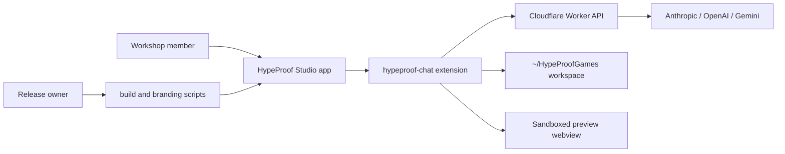

# Studio Architecture

## Context View

Studio sits between workshop members, the HypeProof Worker, and local project
files. Members interact with the branded IDE. The extension mediates token
storage, chat streaming, preview rendering, and file writes. The Worker owns
cohort profiles, token validation, report submission, and model proxying. The
release repo owns signed binaries, while `hypeprooflab` only hosts member docs.

## Container View

The desktop app is a VSCodium-derived shell with product overrides. The
extension container owns the chat panel, preview panel, VS Code command
registration, secret storage access, and postMessage protocol. The Worker
container owns HTTP routes for chat, traces, reports, token issuing, profile
lookup, and admin UI. Tests are split because each container fails differently:
pure helpers fail as unit tests, app-webview flows fail in Playwright Electron,
and Worker contracts fail in rehearsal smoke tests.

## Component View

Important extension components are `extension.ts` for activation,
`chatPanelProvider.ts` for the main panel, `previewProvider.ts` for generated
HTML preview, `proxyClient.ts` for API calls and SSE, `cspBuilder.ts` for webview
safety, `mintStudentToken.ts` for issuer workflow, and `reportProblem.ts` for
member support. Worker components are organized under `worker/src/routes`,
`worker/src/lib`, `worker/src/profiles`, and `worker/src/skeletons`. A component
may depend inward on helpers, but UI code must not bypass token validation,
preview CSP, or profile-derived cohort behavior.
