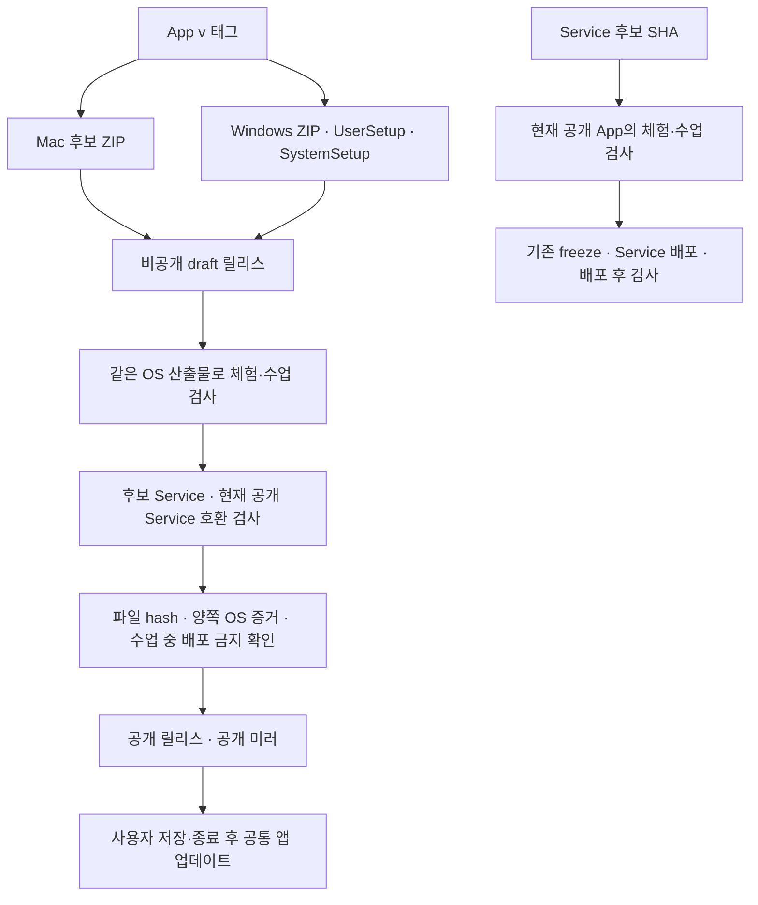

# 공통 Studio 릴리스와 기존 체험 실행기 이행

체험과 수업은 한 App 안의 활동이다. 코드·파일·대화·예산을 합치는 작업이 아니다.
INT-US-02/04, US-07~16의 실행 절차이며 [실행 기록](../testing/unified-completion-917-919-evidence.md)과 함께 읽는다.



## App 후보

`build-mac.yml`, `build-windows.yml`은 패키지를 draft에 올리고
`verify-unified-release.yml`을 명시적으로 dispatch한다. 패키지는 업로드 후 덮어쓰지
않는다. 잘못된 후보는 새 태그로 다시 만든다. 이미 공개된 태그를 draft로 되돌리거나
같은 이름의 설치 파일을 바꾸지 않는다.

검사는 아래를 구분한다.

- `e2e/unified-release/run.mjs`: 수정하지 않은 후보 App과 같은 SHA의 로컬 합성 Service.
  각 OS에서 체험·수업 각각 A/B 전환, 초안/첨부, 실제 모델 파일 생성, 요청 자료 분리,
  실제 암호화 저장과 프로세스 재시작을 검사한다. Service 바인딩은 합성이며 Cloudflare
  배포 인수는 아니다. 활동별 upstream 요청 최대 8회, 동시 테스트 1개, 실패 시 중단한다.
- `install-windows.mjs`: 폐기 가능한 Windows CI에서 User/System 설치기를 실제로
  별도 위치에 설치하고 모든 portable payload 파일을 대조한다. 로컬 Mac에서는 실행 불가다.
- `public.mjs`: 동일 후보 App으로 현재 공개 Service의 승인된 합성 체험·수업 자격을
  확인하고 각 활동에서 파일 2개를 만든다. 기존 정책/요청 한도를 사용하며 자동 재시도는
  하지 않는다. 모델 키는 App에 전달하지 않는다. 공개 cohort나 session을 생성/변경하지 않는다.
- `check-unified-release.mjs`: 양쪽 OS receipt와 현재 다운로드 bytes를 대조한다.
  실호출 없는 검사, 공개 연결 누락, 실패/skip/옛 SHA/다른 artifact는 승격하지 않는다.
  최종 freeze 후 공개하며, mirror의 수동 dispatch도 같은 판정기를 거친다.

CI 필요 설정은 `HPS_ACCEPTANCE_ANTHROPIC_API_KEY`와
`HPS_ACCEPTANCE_TRIAL_CODE`, `HPS_ACCEPTANCE_CLASSROOM_CODE`다. 뒤 두 코드는
**실제 참가자 대신 인수 검사 전용 합성 사용자**의 제한된 자격이어야 한다.
체험/수업 구분, native SDK 및 `hypeproof-fast`를 지원하는 준비된 연습 프로필을 사용한다.
미발급·만료·잔액 부족은 BLOCKED다. 가격/결제·한도 완화·운영 학생 대체를 하지 않는다.
두 OS 인수는 순서대로 실행해 공유 합성 코드의 동시 사용 제한을 유지한다. 누적 요청 한도와 만료는 기존 코드 정책을 따른다.

원문 입력/응답/도구·화면은 합성 자료로 한정한다. 토큰은 evidence 밖 임시 파일에 두고
마지막에 삭제한다. trace/video는 끄며 자격 입력 화면을 촬영하지 않는다.
필수 모델 설정을 App 번들 또는 공개 receipt에 넣지 않는다.

## Service와 Module

`deploy-worker.yml`은 ref를 SHA로 고정한 뒤 `verify-service-activities.yml`에서
현재 공개 App의 두 활동을 같은 Service 후보로 검사한다. 통과한 SHA만 기존 배포
절차에 전달한다. dry-run은 배포하지 않으며 호환성 실기를 완료했다고 보고하지 않는다.
Service 변경만으로 App 전체 빌드를 실행하지 않는다.

현재 Module pin은 변경하지 않는다. Module 발행/복귀는 기존 불변 버전과 대상 강의
검사를 따라야 하며 이 App 게이트가 Module 전체 인수를 대신하지 않는다.
새 App에는 `/v1/activity`가 필요하므로 Service 호환 버전 반영 후 App을 공개한다.
공개 Service 검사가 구버전 API를 만나면 App 후보는 draft에 남는다.

## 기존 실행기

검증된 공통 앱을 설치하고 기존 작업을 저장·종료한 뒤 실행한다. 현재 실행 중인 앱을
강제 종료하거나 운영 앱에 개발 확장을 주입하지 않는다. 설치는 기존
`scripts/install-mac.sh`의 백업·실행 중 앱 검사 절차를 따른다.

```bash
# 실제 .command 파일 경로를 사용한다. Desktop symlink 자체는 수정하지 않는다.
node scripts/unified-launcher.mjs '/절대/경로/시작.command'
node scripts/unified-launcher.mjs '/절대/경로/시작.command' --apply
# 출력된 백업 경로로 되돌리기
node scripts/unified-launcher.mjs --restore '/출력된/백업/경로'
```

처음 명령은 계획만 표시한다. 호환되지 않는 앱이면 실행기 교체를 거부한다.
적용은 공통 `/Applications/HypeProof Studio.app`을 여는 명령으로만 바꾸고 기존
실행기 bytes·권한을 비공개 백업한다. 앱 호환 마커 검사는 최종 artifact 검증을 대신하지
않는다. 기존 user-data/작업 파일/credential은 복사·삭제하지 않는다. 공개 코드는 새
앱에서 다시 확인한다. 기존 대화는 원래 데이터에 남으며 시작 화면의 별도 내보내기는
자동 공유나 새 활동의 모델 문맥 이행을 하지 않는다.

이행 실패 시 출력된 백업으로 실행기만 복원한다. 사용자 수정이 생겼다면 덮어쓰기를
거부한다. App 복귀는 이전 검증된 설치본, Service 복귀는 이전 Worker revision,
Module 복귀는 이전 pin을 사용한다. DB를 되감아 복구를 연습하지 않는다.
사용자가 새 앱을 실제 재시작하기 전에는 ‘업데이트 제공’으로만 기록한다.
