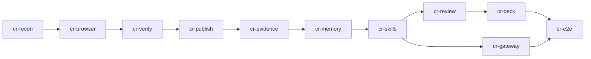

# Curriculum Runtime — delivery plan

Status: active plan; the `cr-recon` output is [curriculum-runtime-recon.md](curriculum-runtime-recon.md). 2026-09-29. Owner: jayleekr. Epic [#1388](https://github.com/jayleekr/hypeproof-studio/issues/1388).
Intent: [INT-CR-00–09](../intents/curriculum-runtime.md) · requirements: [CR-01–84](../requirements/curriculum-runtime.md) · verification: [CR-T01–T80](../testing/curriculum-runtime.md) · recon: [map, gap matrix, decisions](curriculum-runtime-recon.md) · source: [PRD v1.0, preserved](../design/curriculum-runtime-prd-v1.0-2026-09-28.md) · ledger: [`config/requirement-work.json`](../../config/requirement-work.json) (work items `cr-*`) · execution index: [requirements-activation](requirements-activation.md#curriculum-runtime).

This document owns the order of the Curriculum Runtime work and what "done" means for each step. The ledger's `depends_on` is the machine-readable copy of the DAG below; if they disagree, the ledger wins and this page is fixed. Work availability (ready / claimed / in review / dependency) comes from `python3 scripts/next-work.py`, never from this page.

## Phases → work items

PRD §13 phases, in PRD §16 priority order, one work item and one execution issue each. Each implementation item is one slice: issue → worktree off `origin/main` → PR → merge → evidence.

| PRD phase | Work item | Issue | Kind | Requirements | Depends on | Week key |
|---|---|---|---|---|---|---|
| Phase 0 — reconnaissance | `cr-recon` | [#1390](https://github.com/jayleekr/hypeproof-studio/issues/1390) | design | CR-01 | — | W1 |
| Phase 1 — Experiment Browser | `cr-browser` | [#1391](https://github.com/jayleekr/hypeproof-studio/issues/1391) | implementation | CR-02–11, CR-68 | `cr-recon` | W1 |
| Phase 1 — AI Verify | `cr-verify` | [#1392](https://github.com/jayleekr/hypeproof-studio/issues/1392) | implementation | CR-02, CR-03, CR-11, CR-12–16, CR-61, CR-68, CR-81 | `cr-browser` | W2 |
| Phase 2 — Publish | `cr-publish` | [#1393](https://github.com/jayleekr/hypeproof-studio/issues/1393) | implementation | CR-02, CR-11, CR-17–22, CR-39, CR-64–66, CR-73 | `cr-verify` | W1 |
| Phase 2 — Evidence | `cr-evidence` | [#1394](https://github.com/jayleekr/hypeproof-studio/issues/1394) | implementation | CR-02, CR-23–28, CR-65, CR-67, CR-69, CR-70, CR-72, CR-74 | `cr-publish` | W1 |
| Phase 3 — Venture Memory | `cr-memory` | [#1395](https://github.com/jayleekr/hypeproof-studio/issues/1395) | implementation | CR-02, CR-35–42, CR-75–79, CR-82 | `cr-evidence` | W1 |
| Phase 3 — Curriculum Skills | `cr-skills` | [#1396](https://github.com/jayleekr/hypeproof-studio/issues/1396) | implementation | CR-02, CR-43–47 | `cr-memory` | W1 |
| Phase 4 — AI Gateway | `cr-gateway` | [#1397](https://github.com/jayleekr/hypeproof-studio/issues/1397) | implementation | CR-02, CR-29–34, CR-70, CR-80, CR-83, CR-84 | `cr-skills` | W2 |
| Phase 5 — Weekly Review + Director | `cr-review` | [#1398](https://github.com/jayleekr/hypeproof-studio/issues/1398) | implementation | CR-02, CR-48–53, CR-62 | `cr-skills` | W2 |
| Phase 6 — Deck lifecycle | `cr-deck` | [#1399](https://github.com/jayleekr/hypeproof-studio/issues/1399) | implementation | CR-02, CR-54–58, CR-63 | `cr-review` | W2 |
| §14 — end-to-end loop | `cr-e2e` | [#1400](https://github.com/jayleekr/hypeproof-studio/issues/1400) | validation | CR-71, CR-02, CR-59, CR-60 | `cr-deck`, `cr-gateway` | W1 |

CR-02, the switch, is in every implementation item and in `cr-e2e`: `cr-browser` builds it, each later item puts its own commands, panels, tools and worker routes behind it and adds them to the CR-T02 switch-off inventory, and `cr-e2e` re-runs the whole inventory. §11 targets and §12 rows sit in the item whose code they constrain; there is no separate performance or safety slice. The week key is each item's `curriculum_week` in the ledger, set by the ranking rule below.

Rows shared by more than one item are established by the first and re-checked or extended by the later ones, which do not re-implement them:

- CR-03 (`cr-browser`, `cr-verify`), CR-65 (`cr-publish`, `cr-evidence`), CR-70 (`cr-evidence`, `cr-gateway`): re-checked by the second item.
- CR-11, origin scope: `cr-browser` builds it for agent browser actions on the local preview; `cr-verify` extends it to the verification runner and `cr-publish` to the project's published test origins.
- CR-68, automation indicator: `cr-browser` builds it for agent browser-tool steps; `cr-verify` extends it to verify runs.
- CR-39, the Experiment record: `cr-publish` creates it when a student starts a test, because attribution (CR-21), pinning (CR-22), channel links (CR-73) and every row in `cr-publish` and `cr-evidence` that reads what "the experiment declares" (CR-65, CR-66, CR-67, CR-72, CR-74) need it before Venture Memory exists. It carries every PRD §10.1 field, and its `hypothesis_id` names a Hypothesis record that the same action stores when the project has none. Both records sit in the storage `cr-recon` chooses for Venture Memory (CR-35). `cr-evidence` adds its declarations to that record, and `cr-memory` extends both records and re-runs CR-T80 instead of creating its own (SX-48).

For a shared row, an earlier item runs the cases of its CR-T row that its own code reaches (CR-T11 and CR-T63 name them per item) and states which cases it leaves to a later item; the last item that carries the row runs the whole CR-T row.

## Dependency DAG

- The spine follows PRD §16: Experiment Browser → Publish / User Test → Evidence → Venture Memory → Curriculum Skills → Weekly Review + Deck → AI Gateway optimisation.
- `cr-gateway` starts once `cr-skills` is complete and runs in parallel with `cr-review` and `cr-deck`. Its attribution dimensions need memory entities (project) and a real skill-issued call (skill, CR-T34), and CR-84 teaches the Product Builder skill (CR-46) to generate gateway calls, so it follows `cr-skills` rather than `cr-memory`. The approved delivery plan of 2026-09-29 started it after `cr-memory`; this is a deliberate change, and the epic #1388 child table and issue #1397's dependency must say `cr-skills` (#1396) too. Where they disagree, the ledger wins.
- Model path before `cr-gateway` lands: skills (`cr-skills`) and the Weekly Review (`cr-review`) call models through the existing coach route (worker `/v1/messages` and `/v1/chat/completions` under the lesson model policy). Each request names a capability and carries the skill ID and version (CR-45); the capability is recorded there but resolved by the existing policy. `cr-gateway` then routes capabilities through the policy table (CR-30) and writes the eight attribution dimensions onto the usage ledgers (CR-34). The zero-model-call check of an opened Weekly Review pack (CR-T47) spies on whichever of those paths exist when it runs.
- `cr-e2e` depends on `cr-deck` and `cr-gateway`. The §14 loop itself does not call the student-app gateway, and PRD §14 calls the loop the first milestone rather than "completion of every P0 feature"; the loop still runs last because this delivery's scope is every P0 item (epic #1388), and its switch-off regression check (CR-02) should see every CR surface.

## Ranking rule for the next slice

When more than one item is ready, order by: (1) dependency order: only an item whose dependencies are complete is ready; (2) priority (all CR rows are P0); (3) curriculum week: the earliest week (the Weeks column of the requirements) among the rows the item itself establishes. Two kinds of row are left out of the week key. CR-02, the switch, is tagged W1–W6 and sits in every item, so it would make every item W1. A shared row that an item only re-checks or extends from an earlier item (see above) says nothing about when that item's own work is needed. The result is recorded on each `cr-*` item as `curriculum_week`, which the Harness `hype-align` skill reads in place of the row tags; recompute it whenever an item's rows or their week tags change. `hype-align` applies this rule; this page only states it.

`cr-gateway` and `cr-review` both become ready after `cr-skills`, and both are W2. `hype-align` breaks that tie with a fourth key: the number of unfinished items an item unblocks, more first, then ledger order. The approved delivery plan of 2026-09-29 listed only the first three keys, so this is a recorded deviation, and `hype-align` implements it. By that key `cr-review` (unblocks `cr-deck` and `cr-e2e`) comes before `cr-gateway` (unblocks `cr-e2e`). The two run in parallel, so the rank only decides which starts first.

## Gap matrix — confirmed by `cr-recon`

The provisional matrix written from the 2026-09-29 reading of `origin/main` (b95093fc) is replaced by the reconnaissance: [architecture map, per-row gap matrix, decisions R1–R11, verification strategy, Publish + Evidence interface and per-slice notes](curriculum-runtime-recon.md) (CR-01; checked by CR-T01, `worker/test/cr-recon.test.mjs`). Later slices follow its notes and record any deviation here, not there. Until `cr-recon`'s record lands on `main`, CR-T01 checks the recon against the tree it runs on. In that window, any PR that renames or moves a path or symbol the recon maps fails worker `npm test`, and so does any PR that changes what the test's frozen inputs project: a CR row added or removed, a CR-T's Targets cell, a `cr-*` item's cited CR IDs, or the PRD Phase 0 list. So the shipping agent records `cr-recon` in a record-only PR right after it merges, before `cr-browser`'s branch is cut, instead of in `cr-browser`'s first commit. After the record neither edit fails worker `npm test`: CI never re-runs the recorded verdict, and a full clone re-reads it at the recorded commit (recon header). What the recon corrected or decided against the provisional lines:

- P0-1: confirmed, with evidence from a probe in the real app (`e2e/curriculum-runtime/cdp-probe.mjs`). `CdpSession` drops every CDP event, not only console ones. The Experiment Browser stays on the extension's CDP path; the upstream `browserView` agent tools are not driven and nothing is patched (R1). Element picking uses the CDP inspector and rides the existing page-context conduit (R2). It was shown to work on a visible tab with the stock 0.1.51 build. With the `origin/main` build, wheel scroll, the pick and the crop are unreliable (recon F8), and `cr-browser` resolves that first.
- "The artifact file-set digest that AE-37 (#557) uses", the wording in the `cr-browser` work item's `design_delta` (ledger and `requirements-activation.md`), does not exist: AE-37 binds single-file `artifact` events. R4 defines the artifact version id over the published file set. That set is reached from the entry HTML plus a confirmed manifest, never includes dot-files or symlinks, and is scanned before upload for secrets, a key of every `LLMProvider` format included; it is not the whole workspace. The `cr-browser` packet now points at R4.
- P0-3: test versions are hosted by the Service on a dedicated per-project origin, not by the Lab gallery, whose sandboxed opaque origin cannot keep a participant pseudonym or send events; `galleryPublish.ts` stays the one Studio publish module (recon §6). Every test version, experiment and link belongs to a Project; only its team members (set by the cohort's director) and directors scoped to its cohort may act on it, and anyone else gets 404 (recon R5). The domain is an open decision below.
- P0-4: the Service stores no observation batch today; participant evidence goes into the measurement-core record on the Service host over the existing R2 binding (R6). That record was built for one writer, so the Service needs one writer per experiment and a non-scanning usage count (R6).
- P0-5: neither resilient wrapper is reused (R8). `callGeminiResilient` substitutes `gemini-2.5-flash` after a failure (CR-32). `callAnthropicResilient` makes up to three upstream calls under one admission. Capability retries admit and meter every attempt, and whether a bounded retry fits MU-02 is open below. App tokens get their own role, and every student route moves to one role allow-list helper, including `/v1/trace/event`, which checks no role today (recon F9).
- P0-6: Venture Memory lives in D1 as versioned documents that reference evidence, never copy it (R5).
- P0-7: the loader is the Worker skill registry extended with contracts, not `.hypeproof/skills/` in the workspace (R7).
- CR switch: the profile field `curriculum_runtime.enabled`, mirrored to the context key `hypeproof-chat.curriculumRuntimeEnabled` (R3).

### Deviations recorded by `cr-browser`

Run records: [curriculum-runtime-2026-09-30-evidence.md](../testing/curriculum-runtime-2026-09-30-evidence.md).

- CR-10 persistence. The recon's gap-matrix note says "extend `ARTIFACT_REF_KEYS`". No `hps-observation/2` key was added: a new stored key is a stored-schema change listed above as Jay's decision, and an `artifact` event per version would change what `observableAssets` counts as a revision. A browser result is the `text` of the `tool_result` event of its call, tagged `hps-browser-result/1` (`extensions/hypeproof-chat/src/browserResult.ts`), on the same measurement-core record. The version id is recon R4's digest (`artifactVersion.ts`).
- CR-09 lives in `elementPick.ts`, not in `nativeBrowser.ts` `capturePageContext` (the matrix row's anchor); `nativeBrowser.ts` and `previewProvider.ts` are unchanged and left the item's `implementation_paths`.
- With the switch on, `browser_read` and `browser_screenshot` return the full observation, like `browser_observe`. While a native JS dialog is open the page outline is not drawn (drawing evaluates JS, which the dialog blocks); the dialog and the chat-panel tool line are the indicator for that step.
- The kiosk-practice fixture is `e2e/curriculum-runtime/fixtures/kiosk-practice/`; `cr-verify` and `cr-e2e` reuse it.
- F8 (recon §7 "first task") is not resolved. The screen was locked for every app run, so the composited checks cannot run (F7). CR-T09, CR-T56 and CR-T63 ran on real Chromium only (synthetic), not in the Studio app.
- Review round 1 (2026-09-30): CR-59 and CR-60 stay on this item's scope but are **not claimed** by it: CR-T55 did not run and the only CR-T56 figure is headless Chromium, against recon F8's 2.0–3.0 s in the app. The viewport wrapper `/__hp_viewport` is outside the agent's CR-11 scope (its student page is an iframe). Profiles with the switch on must name `observation.format` and must not be child cohorts (validator rules `cr_without_observation_format`, `child_curriculum_runtime`, `child_browser_control`).
- Review round 2 (2026-09-30): the CR-11 guard stays on the driven tab's session while the executor holds it, but it enforces (stops, takes the tab back, closes off-scope new windows) only during an agent step and for 5 s after it (`ESCAPE_TAIL_MS`). The tab is the student's preview too; outside that window their own navigations are left alone and the ordinary scope check refuses the agent's next call. An escape caught after the step returned is the agent's next result. One minor test covers every CR surface: the Worker serves the switch through `curriculumRuntimeAllowed` (switch on, not `isMinorCohort`, workshop tier) and the App's `isCurriculumRuntimeEnabled` repeats it on the served profile; the validator adds `minor_curriculum_runtime` (age_range max < 18 or `minor_cohort`). The artifact version refuses only on its entry: a referenced file over the size cap or a symlink is listed unread (`sha256: null`, `skipped`), and a set past the file cap is marked `partial`. CR-10 stays open against its persistence wording until the stored-schema decision.
- Review round 3 (2026-09-30): with the switch on, a proxy turn drives the provider's long-lived `BrowserControl` and leaves it open at the end of the turn (`proxyTurnBrowser` in `crHostWiring.ts`), so the CR-11 guard's after-step window, a pending escape and a picked element's ref table outlive the turn, as on the SDK path; with the switch off a turn keeps its own control, as before. A picked element with no snapshot ref is labelled `p<backendNodeId>`. The guard closes only windows opened after the step began. `curriculumRuntimeAllowed` and the validator's `minor_curriculum_runtime` also require the audience's lower age bound to be at least 18, so mixed-age cohorts are out. **Claim:** CR-10 is partial, blocked on the stored-schema decision above; CR-02, CR-07, CR-08, CR-09 and CR-68 are not met at their CR-T layer (app runs NOT RUN); CR-59 and CR-60 stay on this item, not met (CR-T55 now has a synthetic figure, the app runs are NOT RUN). Moving CR-59/CR-60 to another item needs Jay's consent. No `completion` record for `cr-browser` until those close.
- The switch-off baseline `09-preview.spec.ts` was re-baselined on the pre-change tree: REQ-D1/D3/D6 and REQ-D4 fail on both the `origin/main` build and this branch's build (3 of 3 runs each), REQ-D5 is flaky on the pre-change build and green on this branch. F1 is pre-existing, so the CR-T02 in-app positive control is red and that half is BLOCKED, not PASS.

### Deviations and decisions recorded by `cr-verify`

Code: `worker/src/lib/measurement-core/verification.ts` (the report view, verdict rule, fix request, CR-81 state), `extensions/hypeproof-chat/src/{verifyRunner,verifySession,verifyView}.ts`, `webview-ui/src/VerifyPanel.tsx`. Dev-host steps: [curriculum-runtime-dev.md](../testing/curriculum-runtime-dev.md#cr-verify--ai-verify-1392).

- Who executes a criterion. The coach turns each student criterion into a plan (steps by accessibility role and name, then expectations) and hands it to the runner through `verify_criterion`; the runner, not the model, runs the steps on the preview and decides the verdict from what it observed (CR-15). "다시 테스트" re-runs the stored plans with no model call, which is what makes CR-14 reproducible and CR-61 a Studio-side figure. A plan that does not test what the criterion says is possible; the report shows each plan's steps and expectations so the student can see it. Recorded as a known limitation, not hidden.
- Statuses. PRD §6 lists pass / fail / warning. The report adds `not_verified` (CR-15: a verdict with no cited observation, a step refused by scope, a criterion the run never reached) and `non_reproducible` (CR-14). `warning` means every expectation held but the page logged an error and no `no_errors` expectation was set.
- Where it is stored (SX-48). Per criterion: the R4 version as an `artifact` event tagged `hps-artifact-version/1` (recon note: `artifact_after` must name an artifact event of the batch), `tool_request` / `tool_result` (`hps-verify-result/1`, carrying `artifact_version` and, when its bytes were stored, `screenshot_digest`), and `test_observed` or `retest_confirmed` with actor `ai` and `result_ref`. The report `hps-verification/1` is computed from those events every time. `observableAssets` skips version-artifact events, so one file write plus one verification is not two revisions. No Worker route and no new store; `workerRoutes` in the CR-T02 inventory stays empty.
- Actors. Criteria are the student's `criterion_set` (SX-45); a coach proposal (`verify_propose_criteria`) is shown as a draft and becomes a criterion only when the student confirms or edits it, keeping `adopted_from` (SX-14, HC-04). Test events are actor `ai`: the runner tested, the student did not. A pass in the student's "다시 테스트" after a fix request (`change_requested`), on another version than the failing one, is `retest_confirmed` (SX-15), otherwise `test_observed`.
- "다시 테스트" always re-runs the whole criteria set of the latest run, never only the fixed criterion, so a version cannot reach "검증됨" by re-testing one row. A criterion the earlier run never tested has no stored plan; it stays in the new run's criteria and shows as `not_verified`, so a re-test never shrinks the set.
- Vision (CR-15). A plan carries only the question of a `visual` expectation; a `judgment` or `method` written into the plan is refused (`plan_judgment`), because it would be the coach deciding before the page was observed (CR-81). This slice has no vision step, so a visual expectation stays `not_verified`. **CR-15 is met for DOM and accessibility verdicts only**; a vision judgment made on the stored screenshot, bound to its digest, is follow-up work.
- Run lifecycle. A run is pinned to the version current when the student pressed "테스트 시작" and takes one verdict per criterion; it closes when every criterion has a verdict, when the turn it rode with ends, or when the files change (the coach's call is then refused and nothing is recorded). So the coach cannot test on its own in a later turn, and a coach check after a fix request is never `retest_confirmed`: that needs the student's "다시 테스트", on a version other than the one the criterion failed on. One run acts on the browser tab at a time: a re-test claims the tab before its first await, a second re-test or a coach call meanwhile is refused, the composer does not send while a test runs, and the host refuses a start or re-test while a turn is streaming.
- Version binding. Every verdict is bound to the entry page's version observed at step 0, also when the run ends on another HTML page of the product (the App versions each entry page separately). Files that change during the run (the entry page's version at the end differs) make the verdict `not_verified` with a reason. The runner always starts at the preview's entry URL; choosing another entry page is not in this slice.
- Reproducibility (CR-14) compares runs of the same plan on the same criterion, version and viewport. A report holds one row per criterion per run.
- A profile without a lesson has no step id or module version, which the `/2` validator requires; verify events carry the named placeholders `test-my-product` / `unversioned` instead of empty strings, and every verify write is taken back if the batch would no longer validate (`recordChecked`). The existing `learningEvent` handler writes empty strings in that case (pre-existing; reported, not changed here).
- CR-68: the runner reuses the CR executor's per-step page outline; the panel shows "테스트 중" for the run. CR-11: runner steps go through the same executor scope; a `navigate` step off the preview origin is refused before the executor is asked.
- Phase 1 close-out (PRD §15) for `cr-publish` / `cr-evidence`: the interface stays recon §6. Two additions from this slice: a published `ProductVersion.verification_report` is the `run_id` of an `hps-verification/1` report on the same version, and the publish panel reads `productVerification(events, versionId)` for CR-81 rather than storing a verified flag.

## Existing work that CR items build on

CR rows reference these requirements instead of restating them. Their work items keep ownership; a CR PR that also satisfies part of them says so in its body and leaves their completion to their own items. Owners below are read from the ledger, not assumed.

| Reused requirement | Owning work item | CR items that build on it |
|---|---|---|
| AE-05, AE-18, AE-37, WEB-06 | `review-validity` [#557](https://github.com/jayleekr/hypeproof-studio/issues/557) | `cr-browser`, `cr-verify` |
| AE-19 | `review-validity` [#557](https://github.com/jayleekr/hypeproof-studio/issues/557) | `cr-browser`, `cr-verify`, `cr-publish` |
| AE-02 | `context` [#555](https://github.com/jayleekr/hypeproof-studio/issues/555) | `cr-browser` |
| AE-23 | `computer-use` [#752](https://github.com/jayleekr/hypeproof-studio/issues/752) | `cr-browser`, `cr-verify`, `cr-publish` |
| WEB-04 | `acceptance-chalk-authoring` [#732](https://github.com/jayleekr/hypeproof-studio/issues/732) | `cr-browser`, `cr-publish` |
| WEB-07, WEB-08 | `publish-recovery` [#1018](https://github.com/jayleekr/hypeproof-studio/issues/1018) | `cr-publish` |
| SX-14, SX-15, SX-16, SX-17, SX-19–22, SX-24, SX-44–48 | `sx-p1-evidence-capture` [#1172](https://github.com/jayleekr/hypeproof-studio/issues/1172) | `cr-browser`, `cr-verify`, `cr-publish`, `cr-evidence`, `cr-memory`, `cr-skills`, `cr-review`, `cr-deck` |
| SX-32, SX-33 | `sx-p3-change-record` [#1174](https://github.com/jayleekr/hypeproof-studio/issues/1174) | `cr-evidence` |
| SX-38 | `sx-p4-instructor-evidence` [#1175](https://github.com/jayleekr/hypeproof-studio/issues/1175) | `cr-memory`, `cr-review` |
| SX-56, SX-58 | `sx-p0-curriculum-first` [#1171](https://github.com/jayleekr/hypeproof-studio/issues/1171) | `cr-publish`, `cr-skills`, `cr-deck` |
| HC-04 | `candidate-contract` [#852](https://github.com/jayleekr/hypeproof-studio/issues/852) | `cr-verify` |
| MC-09, MC-14, MC-15, MC-22, MC-31 | `measurement-core-dogfood` [#1020](https://github.com/jayleekr/hypeproof-studio/issues/1020) | `cr-browser`, `cr-verify`, `cr-evidence`, `cr-memory` |
| AE-25, AE-28, AE-30, AE-33 | `model-routing` [#1009](https://github.com/jayleekr/hypeproof-studio/issues/1009) | `cr-gateway` |
| MU-01, MU-02, MU-03, MU-05, MU-08 | `acceptance-model-access-usage` [#830](https://github.com/jayleekr/hypeproof-studio/issues/830) | `cr-gateway` |
| AB-03–08, AB-15 | `acceptance-access-budget-settlement` [#857](https://github.com/jayleekr/hypeproof-studio/issues/857) | `cr-gateway`, `cr-skills`, `cr-evidence` |
| VO-37 | `voice-898` [#898](https://github.com/jayleekr/hypeproof-studio/issues/898) | `cr-publish` |

## Member catalog feature IDs (planned)

`feature_ids` on the `cr-*` items name member-catalog features that the Lab resync will add: `experiment-browser`, `ai-verify`, `user-test-publish`, `evidence-capture`, `venture-memory`, `curriculum-skills`, `weekly-review`, `ir-deck`. The gateway maps to the existing `models-usage` and `budget-settlement`. Until the Lab PR adds the `cr-*` work IDs to `workIdsByFeature` in Lab `web/scripts/lib/studio_work.mjs`, the Lab `npm run sync:studio-work` and its `--check` stop with the error `Studio work ids without a feature: …` naming the `cr-*` items, because `resolveFeatureWork` throws on any Studio work ID that no feature claims. That failure is expected. The fix belongs in the Lab PR, not in removing items here.

## Decisions still open

These block a default value, not the design. Ask Jay when the slice reaches them; do not pick a value in code.

- The dedicated domain that serves published test versions, one origin per project (recon §6, CR-18, CR-29). Until decided, the host is configuration and tests use `*.test.invalid`.
- Whether participant event records may live on the Service (recon R6: R2 `hps-traces`, no lifecycle rule), which deviates from MC-31's initial local-only policy, and their retention and expiry default for minor cohorts (recon §9). Until decided, no cohort gets the switch for real participants.
- Whether a policy-bounded, per-attempt-admitted retry of an app capability call fits MU-02's one upstream call per user request (recon R8, CR-32). Until decided, the retry bound is 0.
- Default expiry of a published test link (CR-19). Until decided, publishing requires an explicit expiry.
- Default retention period for declared raw participant input (CR-67, and the gateway path of CR-83).
- Whether returning-session linkage (the participant pseudonym of CR-65, used by CR-72) may be on by default for minor cohorts, and how long a pseudonym lives. Until decided, linkage needs the experiment's declaration and a pseudonym ends with the experiment's link.
- Consent path for minor cohorts and external participants who are minors (Lab MISSION child-safety decision).
- Any breaking change to a stored schema (`hps-observation/1`, `hps-session-design/1`, usage ledgers).

## What "done" means

- A work item is complete only with a `completion` record in the ledger that pins the requirement, verification and implementation inputs (see [requirements-activation](requirements-activation.md) "완료와 재개"), reviewed by someone other than the implementer, with every targeted CR-T row run (for a shared row, the cases its own code reaches, as above) and its evidence class stated. A merged PR without test evidence is not completion.
- Synthetic or captured-replay passes are not the real-device run; CR-71 needs one live-host run on a real Mac with a real phone.
- The first milestone is CR-71. If that loop is not reliable, richer model options or templates are premature (PRD §14).
