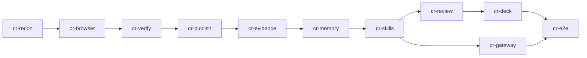

# Curriculum Runtime — delivery plan

Status: active plan, no work item started. 2026-09-29. Owner: jayleekr. Epic [#1388](https://github.com/jayleekr/hypeproof-studio/issues/1388).
Intent: [INT-CR-00–09](../intents/curriculum-runtime.md) · requirements: [CR-01–84](../requirements/curriculum-runtime.md) · verification: [CR-T01–T80](../testing/curriculum-runtime.md) · source: [PRD v1.0, preserved](../design/curriculum-runtime-prd-v1.0-2026-09-28.md) · ledger: [`config/requirement-work.json`](../../config/requirement-work.json) (work items `cr-*`) · execution index: [requirements-activation](requirements-activation.md#curriculum-runtime).

This document owns the order of the Curriculum Runtime work and what "done" means for each step. The ledger's `depends_on` is the machine-readable copy of the DAG below; if they disagree, the ledger wins and this page is fixed. Work availability (ready / claimed / in review / dependency) comes from `python3 scripts/next-work.py`, never from this page.

## Phases → work items

PRD §13 phases, in PRD §16 priority order, one work item and one execution issue each. Each implementation item is one slice: issue → worktree off `origin/main` → PR → merge → evidence.

| PRD phase | Work item | Issue | Kind | Requirements | Depends on | Week key |
|---|---|---|---|---|---|---|
| Phase 0 — reconnaissance | `cr-recon` | [#1390](https://github.com/jayleekr/hypeproof-studio/issues/1390) | design | CR-01 | — | W1 |
| Phase 1 — Experiment Browser | `cr-browser` | [#1391](https://github.com/jayleekr/hypeproof-studio/issues/1391) | implementation | CR-02–11, CR-59, CR-60, CR-68 | `cr-recon` | W1 |
| Phase 1 — AI Verify | `cr-verify` | [#1392](https://github.com/jayleekr/hypeproof-studio/issues/1392) | implementation | CR-02, CR-03, CR-11, CR-12–16, CR-61, CR-68, CR-81 | `cr-browser` | W2 |
| Phase 2 — Publish | `cr-publish` | [#1393](https://github.com/jayleekr/hypeproof-studio/issues/1393) | implementation | CR-02, CR-11, CR-17–22, CR-39, CR-64–66, CR-73 | `cr-verify` | W1 |
| Phase 2 — Evidence | `cr-evidence` | [#1394](https://github.com/jayleekr/hypeproof-studio/issues/1394) | implementation | CR-02, CR-23–28, CR-65, CR-67, CR-69, CR-70, CR-72, CR-74 | `cr-publish` | W1 |
| Phase 3 — Venture Memory | `cr-memory` | [#1395](https://github.com/jayleekr/hypeproof-studio/issues/1395) | implementation | CR-02, CR-35–42, CR-75–79, CR-82 | `cr-evidence` | W1 |
| Phase 3 — Curriculum Skills | `cr-skills` | [#1396](https://github.com/jayleekr/hypeproof-studio/issues/1396) | implementation | CR-02, CR-43–47 | `cr-memory` | W1 |
| Phase 4 — AI Gateway | `cr-gateway` | [#1397](https://github.com/jayleekr/hypeproof-studio/issues/1397) | implementation | CR-02, CR-29–34, CR-70, CR-80, CR-83, CR-84 | `cr-skills` | W2 |
| Phase 5 — Weekly Review + Director | `cr-review` | [#1398](https://github.com/jayleekr/hypeproof-studio/issues/1398) | implementation | CR-02, CR-48–53, CR-62 | `cr-skills` | W2 |
| Phase 6 — Deck lifecycle | `cr-deck` | [#1399](https://github.com/jayleekr/hypeproof-studio/issues/1399) | implementation | CR-02, CR-54–58, CR-63 | `cr-review` | W2 |
| §14 — end-to-end loop | `cr-e2e` | [#1400](https://github.com/jayleekr/hypeproof-studio/issues/1400) | validation | CR-71, CR-02 | `cr-deck`, `cr-gateway` | W1 |

CR-02, the switch, is in every implementation item and in `cr-e2e`: `cr-browser` builds it, each later item puts its own commands, panels, tools and worker routes behind it and adds them to the CR-T02 switch-off inventory, and `cr-e2e` re-runs the whole inventory. §11 targets and §12 rows sit in the item whose code they constrain; there is no separate performance or safety slice. The week key is each item's `curriculum_week` in the ledger, set by the ranking rule below.

Rows shared by more than one item are established by the first and re-checked or extended by the later ones, which do not re-implement them:

- CR-03 (`cr-browser`, `cr-verify`), CR-65 (`cr-publish`, `cr-evidence`), CR-70 (`cr-evidence`, `cr-gateway`): re-checked by the second item.
- CR-11, origin scope: `cr-browser` builds it for agent browser actions on the local preview; `cr-verify` extends it to the verification runner and `cr-publish` to the project's published test origins.
- CR-68, automation indicator: `cr-browser` builds it for agent browser-tool steps; `cr-verify` extends it to verify runs.
- CR-39, the Experiment record: `cr-publish` creates it when a student starts a test, because attribution (CR-21), pinning (CR-22), channel links (CR-73) and every row in `cr-publish` and `cr-evidence` that reads what "the experiment declares" (CR-65, CR-66, CR-67, CR-72, CR-74) need it before Venture Memory exists. It carries every PRD §10.1 field, and its `hypothesis_id` names a Hypothesis record that the same action stores when the project has none. Both records sit in the storage `cr-recon` chooses for Venture Memory (CR-35). `cr-evidence` adds its declarations to that record, and `cr-memory` extends both records and re-runs CR-T80 instead of creating its own (SX-48).

For a shared row, an earlier item runs the cases of its CR-T row that its own code reaches (CR-T11 and CR-T63 name them per item) and states which cases it leaves to a later item; the last item that carries the row runs the whole CR-T row.

## Dependency DAG

- The spine follows PRD §16: Experiment Browser → Publish / User Test → Evidence → Venture Memory → Curriculum Skills → Weekly Review + Deck → AI Gateway optimisation.
- `cr-gateway` starts once `cr-skills` is complete and runs in parallel with `cr-review` and `cr-deck`. Its attribution dimensions need memory entities (project) and a real skill-issued call (skill, CR-T34), and CR-84 teaches the Product Builder skill (CR-46) to generate gateway calls, so it follows `cr-skills` rather than `cr-memory`. The approved delivery plan of 2026-09-29 started it after `cr-memory`; this is a deliberate change, and the epic #1388 child table and issue #1397's dependency must say `cr-skills` (#1396) too. Where they disagree, the ledger wins.
- Model path before `cr-gateway` lands: skills (`cr-skills`) and the Weekly Review (`cr-review`) call models through the existing coach route (worker `/v1/messages` and `/v1/chat/completions` under the lesson model policy). Each request names a capability and carries the skill ID and version (CR-45); the capability is recorded there but resolved by the existing policy. `cr-gateway` then routes capabilities through the policy table (CR-30) and writes the eight attribution dimensions onto the usage ledgers (CR-34). The zero-model-call check of an opened Weekly Review pack (CR-T47) spies on whichever of those paths exist when it runs.
- `cr-e2e` depends on `cr-deck` and `cr-gateway`. The §14 loop itself does not call the student-app gateway, and PRD §14 calls the loop the first milestone rather than "completion of every P0 feature"; the loop still runs last because this delivery's scope is every P0 item (epic #1388), and its switch-off regression check (CR-02) should see every CR surface.

## Ranking rule for the next slice

When more than one item is ready, order by: (1) dependency order: only an item whose dependencies are complete is ready; (2) priority (all CR rows are P0); (3) curriculum week: the earliest week (the Weeks column of the requirements) among the rows the item itself establishes. Two kinds of row are left out of the week key. CR-02, the switch, is tagged W1–W6 and sits in every item, so it would make every item W1. A shared row that an item only re-checks or extends from an earlier item (see above) says nothing about when that item's own work is needed. The result is recorded on each `cr-*` item as `curriculum_week`, which the Harness `hype-align` skill reads in place of the row tags; recompute it whenever an item's rows or their week tags change. `hype-align` applies this rule; this page only states it.

`cr-gateway` and `cr-review` both become ready after `cr-skills`, and both are W2. `hype-align` breaks that tie with a fourth key: the number of unfinished items an item unblocks, more first, then ledger order. The approved delivery plan of 2026-09-29 listed only the first three keys, so this is a recorded deviation, and `hype-align` implements it. By that key `cr-review` (unblocks `cr-deck` and `cr-e2e`) comes before `cr-gateway` (unblocks `cr-e2e`). The two run in parallel, so the rank only decides which starts first.

## Gap matrix — provisional, to be confirmed by `cr-recon`

Built from the 2026-09-29 reading of Studio `origin/main` (b95093fc). It is a lead, not a verdict: `cr-recon` (CR-01) confirms or corrects each line with exact paths and symbols and replaces this table.

| PRD item | Maturity today | Reuse (verified to exist) | New work |
|---|---|---|---|
| P0-1 Experiment Browser | Partial, strong base | `extensions/hypeproof-chat/src/browserControl.ts` (`BrowserControl.execute`: navigate, read with `[ref=eN]` snapshot, screenshot, click, type, back, forward, dialog; `loadInPinnedTab`), `cdpSession.ts`, `browserControlHelpers.ts` (`buildAxSnapshot`), `browserMcp.ts` (`mcp__hypeproof__browser_{open,screenshot,read,click,type}`, `live_preview_start`), `nativeBrowser.ts` (`capturePageContext`), `liveServer.ts`, `previewProvider.ts`, ADR 0002; upstream `vscodium-base/vscode/src/vs/workbench/contrib/browserView/electron-browser/{features,tools}` via patches only | Console, runtime and network capture (no `Runtime.consoleAPICalled` / `exceptionThrown` / `Network.loadingFailed` handling exists); select, scroll, hover, reload; element → coach context; binding results to an artifact version; origin scope for the runner |
| P0-2 AI Verify | None | `criterion_set` / `test_observed` / `retest_confirmed` in `worker/src/lib/measurement-core/learning-events.ts`; AE-05/18/37 review validity (#557); `webview-ui/src/EvidenceDrawer.tsx` | "Test my product" action; criteria runner; `hps-verification/1` report |
| P0-3 Publish | Minimal | `galleryPublish.ts` → Lab `POST /api/gallery/publish` (Supabase storage); WEB-07/08; work item `publish-recovery` (#1018) | Immutable content-addressed test versions, QR, expiry and revocation, anonymous participant sessions, experiment attribution |
| P0-4 Evidence | Partial | `learning-events.ts` (eight kinds, `evidence_refs`, `source_state`), `measurement-core/{evidence,interpretation,legacy-observation}.ts` (`hps-observation/1`, `teacher_state`), `nativeObservationRecorder.ts`, `sessionSpool.ts`, `evidenceSnapshot.ts`; SX-17–24, SX-44–48, MC-* | Participant events from published pages, five manual record kinds, Observed / Interpreted / Assumed drafts with `source_refs`. SX-48: extend, never fork |
| P0-5 AI Gateway | Strong for the coach | `worker/src/routes/chat.ts` (`/v1/chat/completions`), `routes/messages.ts` (`/v1/messages`), `env.ts` (`LLMProvider`: gemini, anthropic, openai, glm), `lib/{budgets,budget-admission,usage-costs,model-usage,access-contracts,lesson-model-policy,model-caps}.ts`, `routes/access.ts` | CORS endpoint and app tokens for student apps, capability vocabulary and policy mapping, hard credit ceiling for app calls, curriculum attribution dimensions, mock adapter |
| P0-6 Venture Memory | Minimal | Learning-event log, `worker/src/lib/session-design.ts` (`hps-session-design/1`), `localReviewService.ts`, `localRecordFile.ts` | Project / Hypothesis / Experiment / ProductVersion / Decision / Metric / DeckSlide entities and traversal |
| P0-7 Curriculum Skills | None | Session-design steps, `worker/src/lib/lesson-help-mode.ts`, `worker/src/prompts/`; SDK coach runs with `settingSources: []` (`sdkCoachHelpers.ts`) | Skill contract, registry, loader decision, seven skills |
| P0-8 Weekly Review | Similar feature exists | `worker/src/lib/classroom-{evaluator,report,report-html}.ts` (`hps-classroom-report-draft/1`, `next_experiment`) | Per-team pack, staleness by source digest, "Prepare Weekly Review", section regeneration, director decision write-back, four-team overview |
| P0-9 HTML Deck | None | HTML preview runtime | Eight-slide state, patch proposals with accept / reject, evidence refs, unsupported-number flags, change view |

## Existing work that CR items build on

CR rows reference these requirements instead of restating them. Their work items keep ownership; a CR PR that also satisfies part of them says so in its body and leaves their completion to their own items. Owners below are read from the ledger, not assumed.

| Reused requirement | Owning work item | CR items that build on it |
|---|---|---|
| AE-05, AE-18, AE-37, WEB-06 | `review-validity` [#557](https://github.com/jayleekr/hypeproof-studio/issues/557) | `cr-browser`, `cr-verify` |
| AE-19 | `review-validity` [#557](https://github.com/jayleekr/hypeproof-studio/issues/557) | `cr-browser`, `cr-verify`, `cr-publish` |
| AE-02 | `context` [#555](https://github.com/jayleekr/hypeproof-studio/issues/555) | `cr-browser` |
| AE-23 | `computer-use` [#752](https://github.com/jayleekr/hypeproof-studio/issues/752) | `cr-browser`, `cr-verify`, `cr-publish` |
| WEB-04 | `acceptance-chalk-authoring` [#732](https://github.com/jayleekr/hypeproof-studio/issues/732) | `cr-browser`, `cr-publish` |
| WEB-07, WEB-08 | `publish-recovery` [#1018](https://github.com/jayleekr/hypeproof-studio/issues/1018) | `cr-publish` |
| SX-14, SX-15, SX-16, SX-17, SX-19–22, SX-24, SX-44–48 | `sx-p1-evidence-capture` [#1172](https://github.com/jayleekr/hypeproof-studio/issues/1172) | `cr-browser`, `cr-verify`, `cr-publish`, `cr-evidence`, `cr-memory`, `cr-skills`, `cr-review`, `cr-deck` |
| SX-32, SX-33 | `sx-p3-change-record` [#1174](https://github.com/jayleekr/hypeproof-studio/issues/1174) | `cr-evidence` |
| SX-38 | `sx-p4-instructor-evidence` [#1175](https://github.com/jayleekr/hypeproof-studio/issues/1175) | `cr-memory`, `cr-review` |
| SX-56, SX-58 | `sx-p0-curriculum-first` [#1171](https://github.com/jayleekr/hypeproof-studio/issues/1171) | `cr-publish`, `cr-skills`, `cr-deck` |
| HC-04 | `candidate-contract` [#852](https://github.com/jayleekr/hypeproof-studio/issues/852) | `cr-verify` |
| MC-09, MC-14, MC-15, MC-22, MC-31 | `measurement-core-dogfood` [#1020](https://github.com/jayleekr/hypeproof-studio/issues/1020) | `cr-browser`, `cr-verify`, `cr-evidence`, `cr-memory` |
| AE-25, AE-28, AE-30, AE-33 | `model-routing` [#1009](https://github.com/jayleekr/hypeproof-studio/issues/1009) | `cr-gateway` |
| MU-01, MU-02, MU-03, MU-05, MU-08 | `acceptance-model-access-usage` [#830](https://github.com/jayleekr/hypeproof-studio/issues/830) | `cr-gateway` |
| AB-03–08, AB-15 | `acceptance-access-budget-settlement` [#857](https://github.com/jayleekr/hypeproof-studio/issues/857) | `cr-gateway`, `cr-skills`, `cr-evidence` |
| VO-37 | `voice-898` [#898](https://github.com/jayleekr/hypeproof-studio/issues/898) | `cr-publish` |

## Member catalog feature IDs (planned)

`feature_ids` on the `cr-*` items name member-catalog features that the Lab resync will add: `experiment-browser`, `ai-verify`, `user-test-publish`, `evidence-capture`, `venture-memory`, `curriculum-skills`, `weekly-review`, `ir-deck`. The gateway maps to the existing `models-usage` and `budget-settlement`. Until the Lab PR adds the `cr-*` work IDs to `workIdsByFeature` in Lab `web/scripts/lib/studio_work.mjs`, the Lab `npm run sync:studio-work` and its `--check` stop with the error `Studio work ids without a feature: …` naming the `cr-*` items, because `resolveFeatureWork` throws on any Studio work ID that no feature claims. That failure is expected. The fix belongs in the Lab PR, not in removing items here.

## Decisions still open

These block a default value, not the design. Ask Jay when the slice reaches them; do not pick a value in code.

- Default expiry of a published test link (CR-19). Until decided, publishing requires an explicit expiry.
- Default retention period for declared raw participant input (CR-67, and the gateway path of CR-83).
- Whether returning-session linkage (the participant pseudonym of CR-65, used by CR-72) may be on by default for minor cohorts, and how long a pseudonym lives. Until decided, linkage needs the experiment's declaration and a pseudonym ends with the experiment's link.
- Consent path for minor cohorts and external participants who are minors (Lab MISSION child-safety decision).
- Any breaking change to a stored schema (`hps-observation/1`, `hps-session-design/1`, usage ledgers).

## What "done" means

- A work item is complete only with a `completion` record in the ledger that pins the requirement, verification and implementation inputs (see [requirements-activation](requirements-activation.md) "완료와 재개"), reviewed by someone other than the implementer, with every targeted CR-T row run (for a shared row, the cases its own code reaches, as above) and its evidence class stated. A merged PR without test evidence is not completion.
- Synthetic or captured-replay passes are not the real-device run; CR-71 needs one live-host run on a real Mac with a real phone.
- The first milestone is CR-71. If that loop is not reliable, richer model options or templates are premature (PRD §14).
