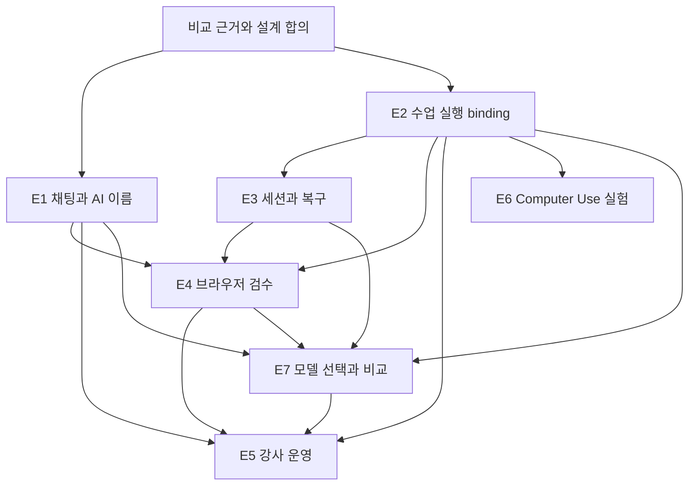

# 수업별 Agent 경험 에픽 제안

상태: 제안 · 2026-09-08 · 상위 에픽 [#746](https://github.com/jayleekr/hypeproof-studio/issues/746).
입력: [비교 증거](../research/agent-experience-2026-09-08/README.md),
[Mission/Intent](../design/learning-agent-experience.md), [요구사항](../requirements/learning-agent-experience.md),
[검증](../testing/learning-agent-experience.md).
이번 문서 PR은 연구/설계 산출물이다. 아래 구현 에픽을 완료시키거나 운영 권한을 변경하지 않는다.
철학 기준은 [Lab 2026-09-08 개정의 적용 기록](../design/philosophy-alignment-2026-09-08.md)을 따른다.
기능 완성·산출물 품질과 학습자의 판단 성장 증거를 구분한다.

## 로드맵

GitHub 하위 에픽: [E1 #747](https://github.com/jayleekr/hypeproof-studio/issues/747),
[E2 #748](https://github.com/jayleekr/hypeproof-studio/issues/748),
[E3 #749](https://github.com/jayleekr/hypeproof-studio/issues/749),
[E4 #750](https://github.com/jayleekr/hypeproof-studio/issues/750),
[E5 #751](https://github.com/jayleekr/hypeproof-studio/issues/751),
[E6 #752](https://github.com/jayleekr/hypeproof-studio/issues/752),
[E7 #755](https://github.com/jayleekr/hypeproof-studio/issues/755).

| 에픽 | 사용자에게 생기는 변화 | 요구사항 | 우선순위·의존성 |
|---|---|---|---|
| E1 — 수업에 맞는 AI 이름과 이해 가능한 채팅 | 강사가 이름·역할·말투를 구성하고 학생은 목표·대안·맥락·실행/대기/오류를 이해한다 | AE-01~04, AE-06~08, AE-35/38 | P0. 표시 정리는 독립 착수; 수업 설정 확정 전달은 E2와 연결 |
| E2 — 수업별 기능과 권한 계약 | 같은 학생에게 수업·단계별 적절한 실행·도움 범위를 제공하고 학생 권한으로 검증한다 | AE-09~13, AE-36 | P0 기반, 승인 묶음 P1. 다른 기능 확대의 선행 조건 |
| E3 — SDK 세션·복구·자원 관리 | 중단·자료 제거 후 문맥을 안전하게 이어가고 결과를 복구·내보낸다 | AE-14~17, AE-39/41 | 세션·복구·소유 P0, 예산 P1. E2 binding 사용 |
| E4 — 브라우저 결과를 검수 근거로 | 화면을 가리켜 요청하고 변경·검사·미검증/재확인 범위를 확인하며 필요시 직접 인계받는다 | AE-05, AE-18/19, AE-37 | 검수 P0, 외부 인계 P1. E2/E3 의존 |
| E5 — 강사 운영과 학습 관측 | 강사가 원인별 도움·인간 피드백을 연결하고 학습 근거로 다음 기수의 초안을 개선한다 | AE-20~22, AE-24, AE-40/42~44 | 기존 #732와 #745 확장. E1~4와 순차 통합 |
| E6 — 격리된 Computer Use 타당성 | 웹 밖 실제 수업 과제를 지원할지 근거로 결정한다 | AE-23 | P2. E2 실행 경계 선행, 주력 웹 수업 출시와 분리 |
| E7 — 수업별 멀티모델 선택·라우팅·비교 학습 | 강사가 허용 모델/사용 방식을 정하고 학생이 실제 모델과 다른 결과의 근거를 확인한다 | AE-25~34 | 고정/제한 선택 P0, 읽기 검토·Auto·인계 P1, 병렬 편집 P2. E1/E2 기반, E3/E4/E5 순차 연결 |

## E1 — 수업에 맞는 AI 이름과 이해 가능한 채팅

문제: 시작 화면의 목표·제작·검토 약속이 채팅에 충분히 이어지지 않는다. 도구명 중심 표시,
작은 글자, 고정된 “코치” 문구는 수업의 역할을 설명하기 어렵게 한다.

- 첫 PR: 고정 호칭 목록과 기존 ux.coach 동작 조사, 표시용 identity resolver, 중립 기본값/수업 이름 미리보기. 실제 App 변경은 관련 REQ도 갱신.
- 후속 PR: 강사 이름·역할·말투·개인화 설정을 기존 authoring에 연결. 설정 값은 Module/Service, 표시만 App 소유.
- 후속 PR: 선택 맥락 칩, 작업 상태, 실패 후 입력 보존, 한글 동작과 가독성. 기존 타임라인·Stop·대기열 재사용.
- 후속 PR: 동일 조건의 대안 비교와 학생 채택 이유, 실행/검수/채택/학습 관찰의 구분. 과거 이벤트가 현재 작업을 덮어쓰지 않게 함.
- 완료: AE-T01~05/27/30. 두 수업의 서로 다른 이름과 역할, AI 고지·수업 격리, 실제 모델 요청의 맥락 제외 검증. AE-T36에서 실제 작업 연결 확인.
- 제외: 이름으로 권한 확대, SDK 전체 UI, 원시 추론 노출. 내부 파일명 coach 일괄 개명은 필요 없음.

## E2 — 수업별 기능과 권한 계약

문제: profile의 기능 플래그와 수업 안내 사이에 강사가 관리할 실행 binding이 부족하다.
RBAC만으로 단계별 도움 수준·대상·행위를 표현할 수 없다.

- 첫 PR: 현재 REQ-M16/17/18 및 protocol 주석의 후속 결정 연결, existing auth/profile/session-design/D1 모델 조사, 하나의 binding ADR.
- 후속 PR: 정책 교집합·deny 우선·역할/수업 배정, 이름/교수 전략 등 수업 콘텐츠 schema 진화, 호환성/유효기간/취소 의미 정의.
- 후속 PR: Chalk 카탈로그 선택·변경 영향·학생 권한 리허설·증거 귀속. 기존 ENV/RUN/VER 계약 구현.
- 후속 PR: 시연/힌트/함께 수정/직접 수행의 전환과 도움 출처. 충분한 목적 입력에는 재질문 없이 진행하고, 불명확할 때 다음 결정 하나를 묻는 실제 모델 검증.
- 완료: AE-T06~08/28/35. 학생·타 수업 강사의 직접 API 우회 거부와 정상 작업 성공, SDK 도구 호출까지 양/음성 대조. 도움 방식으로 권한이나 학습 등급이 바뀌지 않음.
- P1: AE-T09 승인 묶음. 기존 “항상 승인” 규칙을 변경하는 행과 영향 범위를 PR에 명시한 뒤 도입.
- 제외: 새 인증 시스템, 프롬프트를 권한으로 해석, 아동 정책 완화, UI 숨김을 보안으로 간주.

## E3 — SDK 세션·복구·자원 관리

문제: SDK 기능의 존재만으로 문맥 재개·전체 작업 복구·학급 자원 관리가 제공되지는 않는다.

- 첫 PR: #647과 연결해 학생/수업/workspace별 지속 세션·압축·중복 실행 방지·취소를 설계하고 SDK 실제 런으로 검증.
- 후속 PR: #673/WEB-05와 통합한 파일 집합 복구. SDK checkpoint의 추적 제외 경로를 메우거나 분명히 제한. 복구 전 상태 보존.
- 후속 PR: SDK/CLI 핀·도구/옵션/event drift·자체 MCP 호환 매트릭스. 임의 플러그인/skills는 카탈로그 심사 경로.
- 후속 PR: 제외 자료가 이전 대화·요약·도구 결과에 남는 경로 조사. 배제할 수 없는 SDK resume는 사용하지 않고 확인된 자료로 재구성.
- 후속 PR: 수업/AI 만료 후 로컬 재열기·선택 내보내기. 파일·판단·검수·도움 기록 보존과 합성 비밀 제외.
- P1: 학생·학급 예산 예약/정산, fair queue, retry/time/concurrency 상한. #732 ADM-08에 연결.
- 완료: P0 AE-T07/10/11/31/33/35, P1 AE-T12. 장애 주입에서 권한/문맥 누출·중복 부작용·복구 손실 0. 결과가 불명확한 외부 작업은 확인 전 재실행하지 않음. 비용 상한의 잔여 노출 명시.
- 제외: 수업 참가자에게 CLI 설정 편집 요구, SDK 체크포인트를 외부 DB/배포 롤백으로 표현.

## E4 — 브라우저 결과를 검수 근거로

문제: 현재 browserMcp의 6개 도구는 실제 동작 기반이지만 학생이 검수한 범위를 쉽게
확인하는 결과 모델이 부족하다. 스크린샷 촬영과 과제 합격은 다르다.

- 첫 PR: 기존 browserControl의 탭 선택·페이지 이동·viewport와 AE-18 evidence 연결. 화면/요소를 질문 맥락으로 선택.
- 후속 PR: 변경 전후와 검수 카드, 콘솔/링크/이미지/반응형 검사의 명시적 범위. 오류가 심어진 합성 페이지로 검사.
- 후속 PR: 파일 집합·완료 기준·검사기·viewport의 버전과 검사 결과 연결. 수동 편집·복구 후 재확인 필요 표시와 과거 증거 보존.
- P1: 로그인/외부 폼의 사용자 인계와 재개, origin/문서 세대 변화 재검사. 외부 효과와 로컬 preview를 구분.
- 완료: AE-T13/29 및 AE-T14의 P0 탭/문서 세대 조건. 정상 대조군 통과, 심은 오류와 누락 기록, 잘못된 탭 조작 0, 오래된 검수의 현재 통과 표시 0. 외부 인계는 P1.
- 제외: 브라우저 도구를 처음부터 재작성, Computer Use 자동 fallback, 전체 인터넷 검사 보증.

## E5 — 강사 운영과 학습 관측

철학 개정 연결: P1에서 AE-43/44, AE-T37/38을 추가한다. 기존 선택 공유로 인간의 반론과
학생의 수정/유지/보류를 연결한다. AI 도움의 기술 성과와 판단의 성장·무변화·약화 가능성을
새 과제·후속 관찰에서 분리한다. 인간 검토나 후속 관찰이 없으면 해당 근거를 미확인으로 둔다.

문제: 학생마다 도구 승인을 받거나 질문 원문을 늘어놓는 보드는 강사의 수업 운영을
지원하지 못한다. 전체 학생의 준비 상태·대기 원인·도움 요청을 조합해야 한다.

- 첫 PR: #732의 authoring/board/classroom에 수업 버전·단계·기능 준비 상태 연결. 같은 원인 오류 묶음과 무신호 표시.
- 후속 PR: Studio에서 선택적 도움 요청과 검수 근거 공유. 기존 hps-classroom-share/1의 수신자·감사·철회 계약 유지.
- 후속 PR: 거절·환경·인증·서비스·학습 도움·무신호의 원인별 다음 행동. 원문 없이 도움 요청, 학생이 해결 확인.
- P1: 새 실행 일시정지/재개, 적용 안 된 기기 표시, 종료 리포트에 판단·도움·미측정 범위 연결.
- P1: 가설·수업/도움 revision·근거·설계 결정·다음 리허설을 연결. #745의 `hps-observation/1`·정정·불완전 기록 검증을 재사용하고 새로운 자동 점수 체계를 만들지 않음.
- 실험: 30명 파일럿과 100명 합성 부하의 운영 목표. 수용량·학습 효과는 실측 전까지 미확인.
- 완료: P0 AE-T15/32, P1 AE-T16/18/34 및 해당 #732/#745 회귀. 원문 자동 수집 0, 활동 없는 학생 누락 0, 독립 과제 관측 기록. 합성 수행과 사람의 학습 효과 구분.
- 제외: 이미 있는 보드·인증·공유 저장소 재생성, 모든 tool call 강사 승인, 프롬프트 수 기반 능력 점수.

## E6 — 격리된 Computer Use 타당성 실험

문제: OS 앱을 사용하는 수업이 실제로 필요한지와 브라우저/API로 충분한지 미확정이다.

- 실험 과제: 합성 자료를 지정 문서 앱에 입력·서식 수정·파일로 내보내기. 웹/API 대안과 같은 과제로 비교.
- 제공 범위: 전용 VM·앱 목록·학생별 자격 격리·화면 범위·인계·Stop·초기화·실행 증거.
- 측정: 완료/복구, 강사 개입 시간, 지연·비용, 화면/자격 노출, 지원 OS의 실제 동작.
- 완료: AE-T17과 비교 결과로 go/no-go를 남김. no-go 또는 보류도 유효한 종료 결과.
- 제외: 학생 개인 바탕화면 전면 제어, 강사의 무동의 원격 접속, 웹 도구 실패 시 자동 권한 확대.

## E7 — 수업별 멀티모델 선택·라우팅·비교 학습

철학 개정 연결: 모델 비교는 선택/보류 이유와 한계를 확인하는 환경이다. 두 결과 모두 보류할 수
있으며 다른 모델 검토를 인간의 social correction으로 표시하지 않는다(AE-34/43, AE-T26/37).

문제: /v1/chat의 네 공급자·profile.model이 이미 있지만 SDK 경로는 Anthropic 고정이고
학생용 모델 선택 UI가 없다. 실제 모델·지원 능력·자동 대체·비교 비용을 수업 경험으로 묶어야 한다.
근거는 [멀티모델 보충 연구와 화면](../research/agent-experience-2026-09-08/multi-model.md).

- 첫 PR: 기존 provider/alias/fast 보조 호출/Gemini fallback/model-caps 감사와 카탈로그·수업 정책 ADR. 구형 provider 문구 정합성 수정, 새 인증·저장소를 먼저 만들지 않음.
- P0: 검증한 기존 실행 경로에서 강사 고정/제한 선택→학생 picker→실제 모델 표시. identity/역할/모델/실행기/도구 권한을 구분. 아직 미지원인 조합의 차단 이유 제공.
- P0: 수업의 모델 매핑/허용 후보·정책 snapshot, 학생 권한 리허설, 모델 교체·은퇴·롤백 경로. 별칭이 같은 실제 ID면 서로 다른 성능 등급으로 광고하지 않음.
- P1 첫 확장: 현재 산출물과 검수 기준을 다른 모델의 읽기 전용 세션에 보내는 “다른 모델로 검토”. 결과별 근거·실패·채택 이유 보존, 편집자는 한 실행기.
- P1: 단계/역할/능력 기반 Auto와 별도 장애 대체 정책, 공급자/실행기 전환의 확인된 문맥 인계·원본 복귀. 모든 분기·보조 요청 비용은 E3 원장/대기열 재사용.
- P2: 다른 공급자의 도구 실행기 얇은 실험 후 격리된 병렬 편집. 파일/worktree만으로 격리됐다고 하지 않고 브라우저/자격·채택/폐기/충돌을 검증.
- 완료: AE-T19~26. 직접 요청의 정책 우회 0, 실제 모델/정규화 표시 일치, 문맥/grant 누출 0, 부분 실패 후 외부 효과 중복 0. 단일 모델 대비 비교 학습의 근거와 비용을 보고.
- 제외: 모델 dropdown만으로 모든 SDK 기능 지원 선언, 모델 다수결 기반 합격, 전체 모델 순위표, 무제한 BYOK/endpoint, 검증 전 학습형 라우터·범용 실행기 재작성.

E7 전체를 첫 채팅 파일럿의 선행 조건으로 묶지 않는다. 고정/제한 선택의 P0도 **지원하는
실행기/모델 조합에 한정**하며 네 공급자의 모든 도구 실행을 동시에 구현할 약속이 아니다.
E2는 권한 원본, E3는 세션/예산, E4는 검수 증거, E5는 학급 관측을 각각 소유한다.

## 순서와 추적

첫 검토 대상은 **“강사가 제작 파트너라는 이름으로 수업을 구성 → 학생이 수정 범위를
선택 → 모바일 결과를 확인 → 잘못된 변경 복구 → 검수 근거 공유”** 한 경로다.
이 경로의 기존 구현을 재사용하면서 빈 부분을 채운다. 모든 에픽의 완성을 기다리는 대규모 재작성은 필요 없다.
모델 선택은 이 첫 경로의 검증된 실행기에서 시작하며, “다른 모델로 검토”를 다음 독립 확장으로 둔다.

## 전달 단계와 구현 PR 경계

### Product Intent에서 다음 구현으로

#764의 [Product Intent](../PRODUCT-INTENT.md)를 기존 에픽에 연결한다. 새 에픽·REQ
번호 체계를 만들지 않는다. 다음 표는 구현 순서와 인수 단위이며 전체 기능의 완료 선언이 아니다.

| 순서 / 기존 Epic | 먼저 끝낼 단위 | 왜 필요한가 / 완료 근거 |
|---|---|---|
| 1 · E1 #747 | 검증한 수업별 이름과 레이아웃을 통합한 뒤 NAT-03의 충분/모호 분기를 검증한다. 질문 건너뛰기·목표 변경·선택 성찰도 같은 계약에 둔다. | Useful work first / 최소 개입. T04의 실제 대화와 이름·승인·실행의 역할 구별. 이름 표시만으로 E1 전체를 닫지 않음 |
| 2 · E2 #748, D0 | 기존 수업 버전에 교수법·허용 도구·허용 모델을 구분해 바인딩한다. 처음에는 고정/제한 선택과 학생 권한 리허설만. | Adapt, do not script. 강사는 질문 방식·AI 역할을 바꾸되 기관/수업/단계/학생 권한의 교집합을 넓히지 못함. AE-09~11/25/26/33 |
| 3 · E7 #755 + E3 #749, D1/D2 | 입력창 모델 선택·수업 고정/허용 집합(#792) → 모델별 effort(#799) → 사용량·예산·역할별 화면(#800) 순으로 묶는다. 답변별 상시 모델 배지는 필수가 아니다. | 판단에 필요한 정보. 이름, 모델, 실행기, 권한은 별개. 요청한 alias와 실제 provider/model의 차이·미지원 이유를 확인. AE-12~17/27~29 |
| 4 · E4 #750, D3 | 실제 브라우저 검사와 산출물 버전을 연결하고 수정 뒤 오래된 검증을 무효화한다. | Evidence over claims. 실제 실행·현재 화면·파일의 연결, 권한 거절·Stop·되돌리기. AE-18/19/39/40 |
| 5 · E5 #751, D4/D5 | 강사의 준비/막힘/실패 구별과 선택 공유. 이후 사람의 채택 이유·도움·전이를 관찰한다. | 운영 성공과 학습 효과를 분리. 사람 피드백·학습 파일럿은 자동 테스트로 대체하지 않음. AE-20~22/24/42~44 |
| 6 · E6 #752, D6 | 웹/API로 불가능한 수업 과제에서만 격리된 Computer Use 비교 실험. | 필요한 기능만 도입. 실제 VM, 화면·자격 격리, 인계·중지 근거를 보고 go/no-go. AE-23 |

RBAC만으로 수업을 표현하지 않는다. **RBAC은 누가 설정/실행할 수 있는지**, 수업의
버전별 정책은 **무엇을 어떤 범위에서 실행할 수 있는지**, 교수법은 **언제 어떤 질문과
도움을 줄지**를 소유한다. 마지막 항목은 허용 권한 안에서 적응하며 새 권한을 만들지 않는다.
기존 issuer/roster/profile/session-design/관찰 계약을 먼저 재사용한다.

모델 선택 목록의 수를 완료 기준으로 삼지 않는다. 검증된 조합 하나에서 실제 모델·능력·비용을
설명할 수 있어야 다음 조합을 연다. ‘다른 모델로 검토’는 읽기 전용 P1이며 여러 모델의
합의를 정답이나 사람의 성장으로 취급하지 않는다. SDK 기능도 도입 단위마다 같은 기준을 적용한다.

다음은 착수 가능한 분할 제안이며 구현 PR을 생성했거나 일정을 확정했다는 뜻은 아니다.
각 PR은 동작을 바꾸는 기존 REQ, 소유 테스트 경로, 실제 실행 결과, 제거 방법을 함께 갱신한다.
코드 확인만 한 항목과 이미 실행된 종단 결과를 구분한다.

| 단계 | 구현 범위와 의존성 | 검토할 산출물·종료 조건 |
|---|---|---|
| D0 — 구현 계약 | E2 주관, E1/E3/E4/E5/E7 연결. 기존 수업 전달·native observation·공유 조사 | 실행 binding ADR, 정확한 schema 진화, 구버전/누락/타 수업 대조군, 자료 제외·검수 버전·도움 출처의 저장 소유권 |
| D1 — 학생의 한 작업 | D0 이후 E1/E2/E7 P0. 목표·대안·AI 역할·수업 허용 모델·도움 선택·단계별 범위 | 실제 입력·강사 설정 전달·정책 검사, AE-T01~08/19~21/25/27/28/30/35의 해당 범위 |
| D2 — 중단과 소유 | D0 이후 E3, D1과 통합. 재개·자료 제외·복구·내보내기 | AE-T07/10/11/31/33/35, 파일 해시·미전송 자료·수업 종료 후 재열기 |
| D3 — 현재 결과 검수 | D1/D2 이후 E4. 브라우저 결과·조건별 검사·재확인·채택 | AE-T13/29, AE-T14의 탭/문서 세대 경계. 변경 후 오래된 초록 표시가 사라짐 |
| D4 — 첫 성인 파일럿 준비 | E5의 준비 상태·원인별 도움·선택 공유를 D1~3과 통합 | AE-T15/32/36 및 P0 30개 행의 개별 증거. 실제 App+모델+도구 경로, 강사/학생 조건 리허설 |
| D5 — 운영·학습 실험 | D4 이후 필요한 P1만 활성화. 승인 묶음·외부 인계·예산·인간 피드백·학습 회고 | AE-T09/12/14/16/18/22~24/26/34/37/38. 전이·후속 관찰, 무신호·중단·약화 가능성을 포함한 보고, 기존 조건 대비 개선 여부 |
| D6 — 웹 밖 과제 | E6 독립 실험. E2 권한 기반 필요 | AE-T17의 실제 VM 증거와 웹/API 대안 비교 후 go/no-go |

표시만 먼저 개선하는 작은 PR은 가능하지만 D4 완료를 의미하지 않는다.
각 단계에서 필요한 신규 P1 기능을 앞당겨 켜면 해당 인수 검증도 그 단계로 앞당긴다.
P0에서는 기존 승인·이용 한도 계약을 유지하고 새 승인 묶음이나 학급 예산을 검증 없이 켜지 않는다.

첫 파일럿은 기존 L2 진료시간·공지의 로컬 변경 경로다. 강사 시연용 결과 파일이나
웹 모의 실행으로 D4를 통과시키지 않는다. L3 공개/복구 실기는 해당 외부 경로를 실제 검증할 때만
완료하며, 실제 고객의 학습 효과는 D5의 관찰 전까지 미확인이다.

구현 중 발견한 새 문제는 기존 에픽에 원인·영향 요구사항·재현·다음 작업을 연결한다.
기능이 좋아 보인다는 이유로 첫 경로에 임의 플러그인·다중 Agent UI·Computer Use를 계속 추가하지 않는다.

추적 충돌 방지: #732 운영, #744 실제 체험, #647 문맥, #673 복구, #694 module attribution,
#638 실행 가시성, #627 대기 UX를 관련 작업으로 연결한다. 기존 wip 작업은 이 제안으로 가져오지 않는다.
상위 이슈에 하위 에픽 URL과 문서 PR을 연결하며 완료 표시는 실행 증거가 있는 범위에만 한다.

### 모델 선택 이후: effort와 강의료 포함 사용량

[설계 제안](../design/model-effort-and-course-usage.md)을 E7 #799와 E3/E5 #800으로 나눴다.
학생의 포함 이용량, 강사의 반 운영 예산, 운영자의 실제 원가를 구분한다. 기존 usage_log와
AE-17의 예약/정산을 먼저 대조한다. effort/크레딧/예산 UI는 아직 구현되지 않았으며
#792의 9개 모델 텍스트 대화 전환 인수와 별도로 진행한다. #690의 모든 수업 기본 모델
교체와 긴 출력 상한 재산정도 완료되지 않았다.

## Lab #777 이후 후보 모델·가격 계약

[후속 의존성 계획](capability-and-pricing-epics.md)은 기존 E1~E7을 유지하면서
Lab 철학 개정안을 HC 측정 계약과 #800의 수업/구독/기관 이용권·원가·예산으로 연결한다.
이름 변경이나 사용량 조회만으로 해당 Epic을 완료하지 않는다.

## E5 원격 수업 운영 구현 순서 · 2026-09-18

사용자가 요청한 다수 PC 수업 관제의 PRD는 [기존 classroom-admin 확장](../requirements/classroom-admin.md#원격-수업-운영-확장-설계--2026-09-18), UX는 [기존 classroom-design](../requirements/classroom-design.md), 인수는 [AT-15~34](../testing/classroom-admin.md#remote-classroom-tests)다. 본 절은 실행 분해이며 기존 #751/#732/#673/#647/#1020을 재사용한다. 2026-09-18 기준 R0~R7의 Service·Chalk·확장 구현과 합성 계정 검증이 stacked branch(`feat/751-ops-r1-service` … `feat/751-ops-r7-regression`)에 있다. 모든 기능은 기본 OFF이고 실기·운영 gate는 열지 않았다(테스트 문서 실행 기록 참고). 현재 `next-work`의 ready는 작업 가능성이지 요구 충족 판정이 아니다.

### 의존성과 PR 크기

| 순서 | 구현 단위 / 기존 추적 | 주 수정 위치 | 완료 gate |
|---|---|---|---|
| R0 | 현재 main/열린 PR·claim 재확인, 신호/스키마/auth/활동 재사용 감사, schema+feature flag·합성 fixture | root instructions, `config/requirement-work.json`, `config/traceability.json`, `worker/schema.sql`, `worker/migrations/` | 관찰/명령/원문/보고서 경계, 1개 회차·2명 수직 흐름 계약. applied migration 변경 없음 |
| R1 | 명단·pairing·토큰 활성화·step/오류 관측과 기존 보드 확장 (#751/#732) | `worker/src/routes/trace.ts`, 새 제한 ops route와 `lib/`, 기존 auth, `chalk/src/routes/board.ts`, `src/ui/manage.html`, `extensions/.../src/heartbeat.ts`, `activityConnections.ts`, `protocol.ts` | AT-15~18/23/25. 전체 명단·unknown·원문 비노출. 새 관제 OFF일 때 회귀 |
| R2 | 명령 원장/CAS/lease/epoch/receipt와 저위험 진단·재연결·preview (#751) | 같은 ops route/lib, Chalk 기존 forwarder, App `src/`의 순수 helper+host adapter | AT-19~21/23. 임의 command 실행 불가, expired/offline/duplicate 처리. 별도 OS daemon 없음 |
| R3 | 보존형 reset·Stop·class pause, SDK/실제 앱 인수 (#673/#647/#751) | 기존 `chatPanelProvider.ts`, SDK stop/활동/draft/spool 경로, Service `chat-gate`와 `messages/chat` admission | AT-22/24. 현재/미저장 파일·대화·근거 보존. OS별 중지·재연결 검증. reset 하나부터, bulk reset 후순위 |
| R4 | 동의 scope와 기록 batch, immutable snapshot/manifest receipt/outbox (#751/#732) | `sessionSpool.ts`, `spoolUploader.ts`, 기존 logs route/read path, 새 report-job route/lib | AT-26~28. 서버 complete 판정·수업 종료 후 scoped upload·원문 강사 자동 공개 0 |
| R5 | 공통 코어 기반 평가 초안, legacy adapter, Mac runner·검수 큐 (#1020/#751) | `packages/measurement/`, `worker/src/lib/measurement-core/`, `skills/hain7-report/` 재사용 adapter, 기존 scripts convention, Chalk batch 상세 | AT-29/30. 6/7 모델 분리, version/hash/근거·NA·검수. 새 채점기 복제 금지 |
| R6 | 수신자 승인·이메일 adapter·보호 링크·전달 원장 (#751) | Service report-delivery routes/lib, existing private storage/auth, Chalk approval UI | AT-31. provider sandbox, unknown send 재조정, 실제 발송은 운영 승인된 계정·수신자만 |
| R7 | 회귀/부하·Mac/Windows·성인 canary→30명 pilot·100명 synthetic | 기존 worker/chalk/extension/e2e 테스트, 운영/릴리스 문서 | AT-32~34·기존 suite·실기 기준. 아동 자동 수집은 동의 인수 뒤 별도 활성화 |

2026-09-18 보강 기준은 새 단계를 만들지 않고 기존 단계에 얹는다: 복구/코칭 분리와 코칭 조치 2종(`coach` capability)·학생 화면 비차단 알림은 R2/R3의 명령 계약 위(AT-35/39), 출처(`actor`·`source_state`·전후 digest·강사 확인 상태)는 R1의 관측 envelope 확장(AT-36), §14 토큰·CTA 우선순위·집계 표기는 R1~R3의 Chalk 패널(DT-07), 근거 부족 표기와 관찰·성장 보고서 구성은 R5(AT-37/38). 문서의 GlobalBuddy·6주·고정 도움 순서는 예시이며 구현에 넣지 않는다.

R1→R2→R3, R1→R4→R5→R6, 통합→R7. 보고서 경로를 별도 구현해도 공통 신원/명단/동의 계약은 R0/R1을 따른다. 단계별 vertical slice를 완료하고 실제 실행 증거를 남긴 후 다음 단계로 이동한다. 합성 dry-run은 운영 계정·발송 provider 미정과 무관하게 진행한다. 한 번에 전체 프로그램 재작성·일괄 production 배포하지 않는다.

### 예상 작업량과 비용 결정

초기 추정(숙련 개발자 1명 기준, 일정 약속 아님): R0 1~2일, R1 3~5일, R2/R3 5~8일, R4/R5 5~8일, R6 3~5일, R7 3~5일. 총 20~33 개발일이며 provider 승인·수업 일정·기기 확보 대기는 제외. 가장 큰 불확실성은 실제 SDK 중단/복구, 입력 evidence 품질, 공통 코어의 보고서 완성도, 아동 consent/recipient 계약이다. 첫 인수 가능한 산출은 토큰/전체 명단/단계/오류가 보이는 R1이며 전체 자동 발송 완료와 분리한다.

P0에는 신규 화면 서버·DO·Queue·상시 container를 필수 도입하지 않는다. D1 outbox+기존 scheduled 작업의 작은 reconcile, 관리자의 제한된 runner로 시작한다. queue나 container 도입 시 같은 job key/lease/receipt를 유지하고 중복 소비·순서 비보장을 테스트한다. 구체 운영 단가와 polling 선택 근거는 PRD가 소유한다.

### 배포와 롤백

독립 기능 flag `ops_observe`, `ops_commands`, `ops_collect`, `ops_reports`, `ops_delivery`는 회차별 기본 OFF. 저장소는 KV가 아니라 D1이다: 회차 행(`class_run_ops.flags_json`)에 두고 요청마다 D1 primary에서 읽으므로 flag를 끄면 다음 요청부터 신규 enqueue·수집·발송이 거부된다(전파 지연 상한 = 진행 중이던 요청 1회). 전역 스위치 `HPS_CLASSROOM_OPS`는 배포 설정이라 끄는 데 재배포가 필요하므로 rollback 1순위는 회차 flag다. 학급 일시정지는 같은 이유로 D1 control revision을 쓴다. 구버전 protocol/capability unknown은 기존 수업 경로만 제공한다. Service additive schema→호환 API→Chalk→새 App canary→단일 회차 관측→단일 학생 저위험 조치→reset→batch→delivery 순서로 켠다. live-session freeze와 기존 release 절차를 지키며 release 버전/BUILD_ID를 검증한다.

rollback은 먼저 delivery/collect/commands 신규 enqueue를 끄고 관측을 축소한다. pending 명령은 취소/TTL 만료, 수행 중 명령은 결과 확인, job은 retry 보류 후 receipt·미처리 목록 유지. 구버전 Service로 돌아가야 하면 신규 client는 unsupported로 강등하며 학습 경로를 유지한다. 앱 rollback은 기존 updater/설치 경로를 따르고 학생 workspace/spool/history를 삭제하지 않는다. schema drop·원본 삭제·보존 변경을 rollback과 섞지 않는다. 보고서·원격 기능 canary 실패가 기존 chat 운영을 중단시키지 않도록 별도 flag와 timeout을 검사한다.

출시 gate: 기존 입장/모델/SDK/preview/저장/업로드/공유/예산 회귀 + 새 AT 인수, 실제 Windows/macOS, 학교망 1곳, offline/crash/retry/D1 경합, 현재 승인된 수집·발송 정책. 미실행은 NOT RUN/BLOCKED와 해제 조건을 남긴다. 운영 활성화가 필요한 마지막 단계의 권한·계정·동의 결정만 사람에게 요청한다.

### 로컬 인수인계

- 설계 branch `docs/remote-classroom-operations-20260918`, 작성 당시 기준 main `75fe6e4`. 작업 머신의 checkout 경로는 저장소에 남기지 않는다.
- 기존 main은 355 commit fast-forward로 갱신. untracked `docs/ui-concepts/` 보존. 로컬 기존 tag `v0.1.40` 충돌은 강제 덮어쓰지 않았고 main 갱신과 분리했다.
- `vscodium-base`는 main이 지정한 `8b9b01df...`로 초기화했으며 임의 bump 없음. 공통 Harness도 clean main을 `a664e1b`로 fast-forward해 `next-work` 실행 가능.
- Node 22.22.1 설치, 기본 Node 24 설정은 변경하지 않음. 작업 터미널에서 `source ~/.nvm/nvm.sh && nvm use 22.22.1` 사용. worker/chalk/extension/webview/e2e lockfile 기반 의존성 설치 완료.
- `check-registry`용 격리 Python/PyYAML은 `.git/remote-classroom-evidence/check-env/`에 준비했다. 전역 Python 환경은 변경하지 않았다.
- 전체 VSCodium build·새 앱 설치·production deploy·실수업 토큰 발급·실제 발송은 하지 않았다. full build는 CLAUDE.md의 별도 승인/10~20GB 조건이며 당시 여유 공간 약16GB라 이번 소스·확장 개발 세팅과 구분한다.
- 검증 결과와 실제 제한은 [테스트 문서](../testing/classroom-admin.md#2026-09-18-설계-작업의-기반-검증)에 남긴다. 다음 구현자는 여기서 시작하고 원격 main 변동과 #751 등의 현재 claim을 다시 확인한다.

### R0~R7 구현 후 수정 인계 · 2026-09-19

독립 검토 기준 `1432b27`에는 [P1 5건·P2 2건과 수정 인수](../testing/classroom-admin.md#remote-classroom-review-20260919)가 남아 있다. R5/R6의 evaluator/renderer/provider 및 App 관측 연결은 코드 미완성이므로 운영 계정 대기나 실기 NOT RUN에 포함해 숨기지 않는다. 새 에픽/PRD를 만들지 않고 #751의 원격 운영 범위와 #1020의 측정 소유권을 유지한다.

진행 순서:

1. 현재 main·스택 PR·작업 중 변경을 확인한다. `next-work`에서 operations는 2026-09-19 확인 시 in_review이며 #1119~1127/#1129/#1165가 연결돼 있다. 기존 리뷰와 PR 경계를 먼저 읽고 최신 코드에도 아래 문제가 남는지 확인한다. 준비 브랜치 `test/751-ops-review-regressions`의 테스트/문서만 이어받으며 다른 사람의 작업을 reset/덮어쓰기 하지 않는다.
2. R0/R2/R4/R6의 F1/F2/F3/F5부터 수정한다. 수집 신원·명령 취소·발송 dedupe·만료 후 scoped upload를 코드 계약으로 확정하고 applied migration을 바꾸지 않는다. 새 스키마가 필요하면 additive migration과 old-client 처리를 함께 만든다.
3. R1의 F4와 R4/R5의 F6/F7을 실제 App 신호/근거 계약에 연결한다. 상태를 관측할 수 없는 구현에는 해당 capability/준비 완료 표시를 켜지 않는다. UI 표시 시험과 실제 신호 발행 시험을 구분한다.
4. R5/R6에서 수집→job→실제 평가 adapter→검수→승인→renderer/전달을 연결한다. API 계약이나 emptyDraft만으로 멈추지 않는다. 계정 없이 가능한 adapter·서명 검증·UI·합성 통합 시험을 끝낸다. 발송 공급자는 기존 설정/정책을 우선 재사용하고, 없다면 후보와 비용·보존·webhook/idempotency 근거를 기록한 뒤 한 adapter만 구현한다. 실제 계정/수신자는 임의로 만들거나 발송하지 않는다.
5. 기존 관리 화면에 UX 철학을 적용한다. 학습을 앞에, 관측은 뒤에 두고 질문/확인 지점 코칭과 기술 복구를 분리한다. 실제/가상 출처, 학생의 결정권, 미관찰≠저점수, forest/lime 토큰, 화면 기준 주요 CTA 하나를 유지한다. GlobalBuddy·6주·고정 도움 순서는 예시로만 취급한다. 30좌석 목록과 오른쪽 상세의 실제 탐색을 확인한다.
6. R7에서 새 실패 테스트를 모두 통과시켜 기본 CI에 편입하고 기존 입장·토큰·모델·SDK·preview·저장·업로드·공유·예산 회귀를 검사한다. 외부 계정이 필요한 검증과 실제 Mac/Windows/학교망은 상태·해제 조건을 정확히 기록한다. 최종 변경은 저장소 PR 규칙에 맞춰 나누되 운영 flag는 기본 OFF로 유지한다.

**2026-09-19 진행:** 위 1~6을 `fix/751-ops-review-f1-f7`에서 수행했다. 결함별 수정과 실행한 시험, NOT RUN, 아직 코드가 없는 항목은 [테스트 문서의 실행 기록](../testing/classroom-admin.md#검토-결함-수정과-미완-기능-보강의-실행-기록--2026-09-19)이 정본이다. 남은 것은 실기·운영 gate(실제 Studio/SDK/학교망, D1 0011~0018 적용, 평가기·메일 계정, 동의·보존 기간 결정)와 PR 리뷰다.

인계 브랜치는 제품 코드를 수정하지 않는다. 테스트 실행/추적에 쓰는 package scripts와 traceability만 보강했으며 실패 테스트를 포함한 준비 커밋을 그대로 완료 PR로 병합하는 것은 종료 조건이 아니다. 새 계약 때문에 fixture를 고칠 때는 해당 양성·음성 시나리오를 보존하고 정상 spool/기기 흐름까지 검증한다. 모의 검증만으로 실제 수업 인수를 완료 처리하지 않는다.

### E5 다음 작업: 추가 결함 수정 → 실기 인수 → 제한된 운영 · 2026-09-20

기준은 #1169 HEAD `c58dbc8`, 상태·새 결함·직접 실행한 근거는 [독립 재검토 기록](../testing/classroom-admin.md#remote-readiness-review-20260920)이 소유한다. 기존 F1~F7과 평가 큐 수정·CI 편입은 진전했지만, **남은 것이 환경/사람 결정뿐인 상태는 아니다.** 원격 관제+단일 회차 보고서라는 현재 인수 범위를 유지하고 삭제 경합과 복구를 먼저 닫는다. 누적 패턴·PDF 첨부·Kakao/SMS·QR·강한 본인 인증을 이번 수정에 섞어 범위를 늘리지 않는다. 후속 요구는 폐기하지 않는다.

| 순서 | Claude가 지금 진행할 일 | 종료 근거 / 다음 의존성 |
|---|---|---|
| 1. 철회·결과 저장 경합 | 늦은 평가 결과의 R2 재생성과 실패한 철회의 재시도 누락 수정. #1168의 보고서 저장, #1169의 정리 원장을 재사용하고 관련 PR 스택에 반영 | 위 재현 2건과 late PUT/CAS 실패/crash 대조군, 정상 학생/다른 학생 불변. 실제 인용 객체가 남지 않고 삭제 완료의 의미가 맞음. 추가 migration이 필요하면 다음 번호 사용 |
| 2. PR 검토 준비 정리 | #1120의 schema fixture/NAT 실패만 집계 수정, #1121의 PNG 제거를 각 현재 HEAD에서 대조해 기존 리뷰 답변과 근거를 정리. #1167~1169 최신 문서/CI 결과 갱신 | 변경 요청의 해소 근거와 아직 필요한 비작성자 리뷰를 분리. 기술 gate 해소와 사람 승인을 혼동하지 않음. source/base 변경 때 hype-pr 준비/CI 재생성 |
| 3. 현재 Mac의 실제 UI | 기존 mac-devhost를 현재 소스로 다시 준비. 공식 최신 사용 가능 shell을 먼저 조사하고 현재 확장/SDK의 호환성·bundle/vendor 해시 확인. 합성 2좌석, 격리 user-data·workspace·로컬 Service로 실제 GUI 관측 | pairing→토큰 검증→실제 단계→강사 reviewed→오류·해결→disconnect/재연결→작업 보존. source SHA/shell/SDK 버전·화면·파일 전후 해시. 기존 설치 앱과 production 자격은 사용하지 않음. SDK 없는 fallback 결과는 SDK 중지/복구 인수로 쓰지 않음 |
| 4. Windows·staging 실행 준비 | Windows는 기존 CI 산출물/원격 Windows 장치를 쓰는 실행 패키지, 학교망은 현장 큐시트를 준비. Cloudflare는 production과 분리된 명시적 staging binding/config 및 migration/검증/rollback 명령을 준비 | 장치·계정 없이도 fixture·설정 템플릿·명령·판정/해제 조건은 완성. 무조건 production 설정을 상속하거나 로컬에서 Windows 명령을 실행하지 않음. 실제 권한이 준비되면 staging D1/R2에서 동시성·삭제·네트워크 단절 확인 |
| 5. 평가/발송 제한 검증 | 합성 또는 승인된 비식별 사례의 모델 품질 비교표, 호출/토큰/시간/비용 상한과 중단 조건을 준비. 발신 도메인·검수 수신자·webhook 설정 절차와 서명/반송/unknown 확인 시나리오를 준비 | 실제 모델/메일 계정 사용 승인을 받은 제한된 시험 결과. 관찰 주장↔근거 정확도·미관찰·AI/학생 출처·원가, accepted/delivered/bounced 구분. 승인 없는 실학생/보호자 발송 없음 |
| 6. 성인 소규모 canary | 위 인수 뒤 운영자가 승인한 회차에서 기능을 순차 활성화하고 rollback 연습. 관측→저위험 조치→보존형 reset→수집→평가→검수/승인된 발송 | 먼저 성인 2~3석, 이후 30석. 실제 학교망/Windows와 100석 합성 부하 결과를 분리. 목표 상태 지연·명령 지연·기존 채팅 p95 영향(AT-25/34)을 측정. 아동 수집은 동의/고지 인수 뒤 별도 활성화 |

**Mac 준비를 단순 실행 안내로 끝내지 않는다.** 준비본에 실제 Agent SDK가 없고 최신 소스의 dist 교체가 기존 vendor를 제거할 수 있으므로 기존 SDK packaging/seed 경로와 manifest를 대조한다. 실기용 로컬 Service는 실제 성공/오류/지연을 재현하는 제한 provider fixture와 외부 통신 거부를 갖춘다. 준비 SHA와 실행 bundle 해시가 다르면 인수 결과를 쓰지 않는다. 최신 공식 shell+현재 확장 조합은 개발 host 시험이고, 공식 release 자체의 설치/업데이트/서명 시험을 대체하지 않는다. full VSCodium build가 정말 필요할 때만 CLAUDE.md의 별도 자원/승인 조건을 적용한다.

**migration·flag 순서는 개발자가 제안하고 리허설할 일이다.** 사람에게 순서 자체를 설계하도록 넘기지 않는다. 실행 전 target account/database/bucket·적용 이력·backup/restore 가능성·스택별 schema 의존성을 확인하는 검사를 만들고, additive migration 0011~0021(및 후속 수정 번호) → flag OFF의 호환 Service/Chalk/App → 단일 회차 단계별 flag 순서를 구체 명령으로 적는다. 기존 최초 Chalk 분리 배포 절차와 이번 기능 배포를 구분한다. 실패 시 신규 enqueue/수집/발송 차단, 진행 중 작업의 결과 확인, 원장 보존을 우선하고 schema drop을 rollback으로 쓰지 않는다. staging/운영의 실제 리소스 변경·활성화는 해당 권한/승인 후 실행한다.

| 사람에게 남길 결정 | Claude가 승인 전에 준비할 것 |
|---|---|
| 목적별 보존 일수, enforce 시점 | 원문/초안/보고서/감사/수신자 확인 값/로컬 사본별 범위, dry-run 예상 삭제량, 철회와 만기 삭제 구분. 임의 일수를 제품 기본값으로 박지 않음 |
| 평가 모델과 시험 비용 상한, 운영 활성화 | 재현 가능한 평가 사례, 품질 기준, 예상 최대 호출/토큰, 비용 계산 근거, kill switch. 실제 비용은 호출 후 실측 |
| 발신 도메인·계정·테스트 수신자 | 기존 설정 재사용 조사, DNS/secret 필드별 설정 절차, sandbox/실수신 판정, 비밀값 없는 설정 템플릿. secret의 내용은 사람이 프롬프트에 적게 하지 않음 |
| 열람 확인 방법, 수집 고지·동의 증빙 | 현재 사전 공유 확인 값과 강한 본인 인증의 차이, 수집/변경/오답 잠금/재발급 절차, 고지문·동의 기록 항목의 검토 가능한 초안. 생일/전화번호를 임의 수집하지 않음 |
| 운영 적용 및 PR 비작성자 승인 | 최신 HEAD별 검증/남은 제한·배포/rollback 명령·성인 canary 계획. 자기 승인이나 CLEAN으로 대체하지 않음 |

병합 검토 순서는 현재 의존성에 따라 #1165 → #1119 → #1120 → #1121 → #1122 → #1123 → #1124 → #1125 → #1126 → #1127 → #1129 → #1167 → #1168 → #1169다. 앞 PR 병합 후 다음 base/검증이 달라지므로 전체 스택을 오늘의 CLEAN만 보고 한 번에 완료 처리하지 않는다. 지금은 Draft/리뷰 준비를 개선하는 단계이며 이 계획이 병합·운영 실행 승인을 뜻하지 않는다.

**2026-09-20 진행(위 표 1번):** 철회·결과 저장 경합과 철회 삭제 재시도 누락을 #1168·#1169에서 수정했다. 시나리오별 결과와 한계는 [테스트 문서의 수정 기록](../testing/classroom-admin.md#위-두-결함의-수정과-실행-결과--2026-09-20)이 소유한다. 2~6번의 진행과 남은 실행은 같은 문서의 이후 기록을 따른다.

**2026-09-20 진행(표 2~5번)과 사람 결정의 권고안.** 실행 결과·NOT RUN은 [테스트 문서](../testing/classroom-admin.md#실제-mac-guisdk-실행--2026-09-20), 배포 순서는 [`worker/DEPLOY.md`](../../worker/DEPLOY.md)가 소유한다. 아래는 결정을 대신하지 않는다. 고를 수 있는 안과 권고, 그 근거다.

| 결정 | 선택지 | 권고와 근거 |
|---|---|---|
| 보존 일수 | 30일 / **90일** / 180일 | 90일. 기존 `studio-logs/` 보존과 같은 숫자라 설명할 기준이 하나가 된다. 30일은 보호자 문의·정정 요청이 오기 전에 근거가 사라질 수 있고, 180일은 그만큼 보유할 목적을 따로 밝혀야 한다. 값을 넣은 뒤 최소 1주 dry-run 보고를 보고 enforce |
| 평가기 | 끔 유지 / **회차 단위로 켬** / 전체 켬 | 제한 시험 통과 뒤 회차 단위. 모델은 `HPS_CLASSROOM_EVALUATOR_MODEL`로 명시 고정(프로필 모델을 따라가면 수업 모델을 바꿀 때 평가 기준도 같이 움직인다). 예산: 좌석당 최악 약 $0.34 → 30석 회차 $10 상한, API workspace 월 한도 $50부터 |
| 발신 계정 | **보유 도메인의 발신 전용 하위 도메인 + 전용 key** / 루트 도메인 / 개인 메일 | 하위 도메인. 반송·신고가 루트 도메인 평판과 섞이지 않고 key 권한을 그 도메인으로 좁힐 수 있다. 회신 주소는 운영자 사서함 |
| 열람 확인 | **운영자가 등록 때 정해 주는 확인 문구(passphrase)** / 전화번호 뒤 4자리 / 생일 4자리 | passphrase. 새 개인정보를 수집하지 않고 지인이 추측할 수 없다. 전화 뒤 4자리는 이미 연락처를 보유한 과정의 대안. 생일은 권하지 않는다(주변인이 안다). 어느 쪽도 본인 인증은 아니며 강한 인증은 후속 범위 |
| 고지·동의 증빙 | **버전이 붙은 고지문 + 성인은 앱 내 동의 기록, 아동은 보호자 서명본을 운영자가 보관하고 Service에는 참조만** / 구두 동의 | 앞의 안. Service는 이미 `notice_version`·`basis`·`evidence_ref`·기록자·만료·철회 시각을 남긴다. 서명본 자체(이름·서명)는 Service에 올리지 않는다. 고지문에는 수집 항목(질문·AI 응답·작업 이벤트), 목적(수업 보고서), 보는 사람, 보존 일수, 철회 방법과 ‘이미 받은 메일은 회수되지 않음’을 적는다 |

후속 범위(누적 패턴 본문·PDF 첨부·Kakao/SMS·QR·강한 본인 인증)는 그대로 후속이며 이번 작업에서 구현하지 않았다.

### E5 다음 순서 갱신 · 2026-09-21

[공식 shell 복사본의 직접 실행 기록](../testing/classroom-admin.md#remote-mac-readiness-20260921)을 기준으로 다음 순서를 적용한다. 기존 9/20 철회 P1 두 건은 수정 및 관련 31개 시험 통과를 확인했으므로 같은 수정을 다시 지시하지 않는다.

1. 로컬 `fix/751-mac-devhost-launch`의 실행기·초대 발급 hook·검수 중복 행 수정 및 회귀를 기존 PR 소유 범위에 반영한다. 기존 스택 위의 준비 커밋이며 별도 중복 PR/무단 base 변경은 하지 않았다.
2. 최신 main `19ff881`의 학생 경험 개편(#1170/#1178)을 관제 스택과 통합한다. 5개 충돌을 어느 한쪽으로 덮지 말고 현재 과제 중심 UI, 변경 전후 보기, real/simulated 표시, 단계 자기보고·강사 확인·원격 명령 보존 계약을 함께 유지한다. 최신 source/base에서 필수 체크와 실제 Mac 경로를 재실행한다.
3. 발급 토큰 확인이 후속 runtime_ready에 덮여 unknown이 되는 재현(`activation-regression.mjs`)을 먼저 닫는다. 현재 상태와 확인 근거의 저장을 분리하고 재발급/다른 token/new boot/좌석 변경을 대조한다. 이어서 실제 SessionSpool의 sequence 계약을 보강한다. 최신 기록을 ‘구형’으로 설명하는 문구, 의도적인 강사 중지를 연결 장애로 설명하는 문구도 고친다. 재시작·동시 append·부분 쓰기·회차 경계·legacy 대조 없이는 complete를 올리지 않는다.
4. 위 통합본으로 Mac 재실행 가능한 시연 패키지를 기존 devhost에 연결한다. Windows 실행 패키지/현장 큐시트, production과 분리된 staging 설정·대상 검사·rollback을 준비한다. 스크립트 존재와 실제 실행을 구분한다.
5. 계정·운영 결정이 갖춰지면 기존 제한 평가 시험 → Resend sandbox·실수신·webhook → staging D1/R2 삭제·복구 → 성인 2~3석 canary → 30석 순서로 진행한다. 상한/수신자/실행 대상은 구체적으로 확정하고 증거 없이 NOT RUN을 지우지 않는다.

#### 2026-09-21 오후 진행 결과

[통합본 실행 기록](../testing/classroom-admin.md#remote-mac-integrated-20260921) 기준. 위 1~4는 코드·로컬 실행까지 끝났고 5는 그대로다.

| # | 상태 | 남은 것 |
|---|---|---|
| 1 | 완료 — `6a7f33c`를 소유 PR별로 분할 반영(#1167 초대 발급 원장, #1168 보고서 중복 행, #1169 실행기·문서) | — |
| 2 | 완료 — main `19ff881`과 작업 중 들어온 `f44cce3`(#1218)을 스택 맨 아래에서 병합해 13개 브랜치로 전파. 학생 화면은 main 구조 + 단계 자기보고(Primary 1개 유지) | 학생 화면 요구(SX) owner의 확인: 자기보고 버튼의 위치·문구 |
| 3 | 완료 — 토큰 확인 근거 분리, 실제 spool seq·범위 계약, ‘구형 기록’·강사 중지 문구 | 재시작 전 세션을 **합쳐** 회수하는 기능은 없다(선언만). `coverage_reason`은 감사·seal 응답에만 있고 Chalk에 표시하지 않는다 |
| 4 | Mac 완료(실제 창 14/14, 실제 spool 회수 `complete`) · Windows 패키지·staging 설정·검사기·메일 시험 실행기 준비 | Windows 현장·staging·실제 메일은 **NOT RUN**(계정·현장 필요) |
| 5 | 미착수 | 아래 결정 뒤 순서대로 |

**5로 넘어가기 위해 사람이 정할 것(그 외에는 없음).** ① Cloudflare 계정에서 staging D1·KV·R2를 만들 사람과 시점(id 세 개를 `wrangler.staging.toml` 두 곳에 기입). ② 제한 모델 시험용 Anthropic workspace와 지출 한도(예상 $0.10 미만, 최악 $2.72). ③ Resend 발신 하위 도메인과 운영자 시험 사서함 1~2개. ④ 수집 고지·동의 문안과 보존 기간(기본값 없음). ⑤ #1165 Intent 승인과 #1119~#1169 비작성자 검토자. ⑥ 성인 canary 2~3석의 일시와 Windows PC 확보.

#### 원격관리 갭과 다음 구현 단위 · 2026-09-21 (제안 — 지시 전 착수하지 않음)

사용자 요구의 중심은 원격관리(선택 → 상태 → 회수·배포·복구 → 대상별 적용 결과)다. [인수 계약 RM-1~5](../requirements/classroom-admin.md#remote-management-acceptance-20260921) · [현재 구현 매핑](../testing/classroom-admin.md#remote-management-map-20260921). 있는 것: 상태 보드, 허용 목록 복구와 대상별 영수증, 명단 전체 기록 회수. 없는 것: 그룹·전체 선택과 공통 선택 모델, 대상 선택 회수, **배포 전부**, 세 흐름 공통 결과 화면.

| 단위 | 내용 (기존 원장·Chalk `/manage`·연결 자격을 재사용) | 크기 | 선행 결정 |
|---|---|---|---|
| U1 공통 선택 + 대상 회수 — **구현·실행 완료(2026-09-21)**, 독립 검토 인수(tip `4867ddf`, 인계 지시 기준: 선택 범위·명단 경합·늦은 확인·실패/만료·늦은 검증·시간 순서 4건 대조, 최종 CI 완료·실패 0). 인수 ID는 AT-42/43([정정 원장](../testing/classroom-admin.md#at-id-ledger-20260921)) | Chalk 공통 선택(개별·전체·도움 필요/연결됨/미연결) + `report-batches`의 명시적 `targets`(collect_only). 예상과 달리 **migration 0022가 필요했다**(불변 범위·요청 해시). 독립 재현 2건(범위 조회 fail-open, 커밋 경계 좌석 교체)을 같은 단계에서 닫음. [계약](../requirements/classroom-admin.md#remote-management-u1-20260921) · [실행 기록](../testing/classroom-admin.md#remote-management-u1-run-20260921) | 작음→중간 | 그룹은 상태 필터로 확정(저장 그룹 없음) |
| U2 대상 배포 — 공지/자료 — **구현·실행 완료(2026-09-21) · 운영 비활성 · 첫 인수 반려 → 수정(`9d85718`) → 조율 측 로컬 인수**(병합·운영 승인 아님 · 남은 NOT RUN은 [AT 원장](../testing/classroom-admin.md#at-id-ledger-20260921)) ([실행 기록](../testing/classroom-admin.md#remote-management-u2-run-20260921) · [재인수 수정](../testing/classroom-admin.md#remote-management-u2-reaccept-20260921)) | [계약](../requirements/classroom-admin.md#remote-management-u2-20260921) · [인수 계획 AT-44](../testing/classroom-admin.md#remote-management-u2-plan-20260921). 처음 적었던 ‘좌석별 원하는 revision 하나(`control_revision` 방식)’는 버렸다 — 여러 자료가 한 회차에 공존하므로 **object별 revision + 배포 실행 + 참가자에 묶인 대상 행**이다. sync 응답으로 자격이 확인된 그 좌석에만 전달, 완료 = 기기의 **보관함 반영** 보고. 아래 ‘U2 설계 계약과 구현 순서’ | 중간→큼 (migration 1, Service route 1, App 보관함 + 표시면 2, Chalk 작성·결과) | 아래 표의 미결(링크 host·열람 수집·보존·권한 부여·활성화). 배포 1순위와 오프라인 처리는 사용자 지시로 정해짐 |
| U3 대상 배포 — 수업 프롬프트·수업 설정 — **설계 · 독립 검토 중(인수 전) · 구현 아님** (2026-09-21: 첫 설계 `75f1f37` → 검토가 짚은 결함 4건 보완) | [계약](../requirements/classroom-admin.md#remote-management-u3-20260921) · [인수 계획 AT-45/46](../testing/classroom-admin.md#remote-management-u3-plan-20260921). 프롬프트는 U2의 객체 종류 확장(migration 없음)이고, 설정은 그것만으로 되지 않는다 — 실행 설정이 토큰에 서명으로 고정돼 있어 **참가자별 binding + gate·`/v1/profile` 공통 resolver + Service가 승인한 turn snapshot + 실행 경계의 증거 + 섞인 기준의 보고서 차단**이 필요하다. ADM-11은 학생에게 보이는 안내 카드와 강사의 영향 요약으로 지킨다. 아래 ‘U3 설계 계약과 구현 순서’ | 큼 (migration 1(테이블 3), resolver 1, 전환 endpoint 1, 실행 경계 2곳, 보고서 진입점 5곳, App preflight·거부 처리, Chalk 종류 2) | 적용 시점의 운영 정책(로컬 가정: 다음 질문부터 — 승인 아님) · class 개설 좌석 허용 여부 |
| U4 원인별 복구 대응표 + 실제 창 | 원인 5종 × 1순위 조치를 코드 상수·시험으로 고정하고 Chalk에서 눌러 실제 창으로 확인. AT-40 | 작음 | — |

**결정 필요.** ① 배포 1순위(수업 프롬프트 / 공지·자료 / 수업 설정) ② 오프라인 학생: 재접속 시 적용할지, 언제 만료할지 ③ 그룹의 정의 ④ 학생 프롬프트·결과물 회수를 학생 공유 기반으로 둘지, 강사 요청형을 추가할지(동의 모델이 달라짐) ⑤ 수업 중 설정 version 교체 허용 여부 ⑥ 앱 설치·업데이트·PC 전체 제어 포함 여부(사용자 확인 중 — 현재 범위 아님). (정정 2026-09-21: 이 문단의 원래 끝 문장 ‘Intent 문서에는 **배포 Intent가 없다** — U2 전에 Intent 개정이 먼저다’는 작성 시점의 #1165 원문(INT-CO-01~03) 기준이었다. 같은 날 #1165 브랜치 `docs/751-classroom-ops-intent`에 **INT-CO-04(대상 배포) 개정 제안**이 `ab7ee2f`로 추가됐다. **제안의 존재와 승인은 별개다** — 제안은 있고 owner 승인은 아직 없다. U2 설계는 그 제안에 연결하되 승인된 것으로 쓰지 않으며, 그 문서를 이 브랜치에 복제하지 않는다. ①②는 아래처럼 정해졌고 ③은 U1에서 상태 필터로 확정됐다. ④⑤⑥은 그대로 열려 있다.)

#### U2 설계 계약과 구현 순서 · 2026-09-21 (설계 → 보완 1회 → 8단위 구현)

**작업 범위 표시.** #751 전체를 새로 claim하지 않았고 다른 열린 작업을 가져오지 않았다. 이 단위는 #751의 하위 범위 **‘U2 설계’**이며 브랜치 `feat/751-u2-classroom-distribution`(기준 `4867ddf`, 예정 PR base `feat/751-review-c-ops-ui-retention-ci`)에서 **기존 문서 4개만** 고쳤다: 요구·시험·이 계획·`docs/studio-requirements.md`(+ 요구 문서 hash를 담는 `config/requirement-work.json` 한 줄). 제품 코드·시험 파일·migration·Mac 시연 프로세스는 건드리지 않았다. 구현 파일의 소유권과 Mac 실행권은 독립 검토 뒤 따로 인계된다.

**정해진 것(사용자 지시 + 기존 코드 조사).** ① 배포 1순위 = 공지·자료, 프롬프트·설정은 U3. ② 오프라인 = 같은 회차·같은 참가자에 묶인 의도를 재접속 때의 자격 재검사 뒤 전달, 기본 만료 = 회차 종료. ③ 이름 = 회차 flag `ops_distribute` · issuer capability `distribute` · App capability `distribution_inbox` — `ops_delivery`/`deliver`(보고서 발송)는 뜻도 이름도 그대로. ④ 명령 원장(`ops_commands`)을 쓰지 않는다: 그 원장은 접수 시점에 `not_connected`를 확정하고 TTL 120초·grant/epoch 결속이라 ‘다시 연결되면 전달’과 맞지 않는다(코칭 `send_question`은 그대로 그 원장). ⑤ ‘적용’ = **보관함 반영**(디스크 저장 + 카드 목록의 읽기 경로로 재검증). HTTP 200·제안·알림·webview 메시지는 완료가 아니고 열람은 수집하지 않는다. ⑥ 학생용 콘텐츠 조회 API 없음 — 내용은 자격이 확인된 sync 응답으로만 나간다. ⑦ 새 연결·daemon·WebSocket 없음.

**보완(같은 날, 독립 검토의 계약 공백 7건 — 재현된 제품 결함이 아니다).** ⑧ 배포 권한의 철회는 KV가 아니라 **D1 fence**(`ops_issuer_fences`) + 같은 batch의 sweep이 경계다: 기존 KV 폐기 호출 세 곳(`/admin/tokens/revoke` · `/admin/issuers`의 `revoke_jti` · `session/close`의 `jti`)과 un-revoke에 순서·부분 실패·재시도 계약을 붙였고, 배포 강사와 연결 발급 강사가 달라도 열린 배포가 멈춘다. 이미 나간 sync 응답은 회수할 수 없다고 적었다. ⑨ 기기 저장은 **불변 revision 파일 + 원자적 index commit**(+ 창 사이 잠금, `await` 뒤 세대 검사)이고 미반영 파일은 재시작 뒤 스스로 승격하지 않는다. ⑩ 카드(자료 단위)와 배포·회수(실행 단위)는 **coverage**(다른 유효 배포가 받치면 tombstone 없음)와 자료별 **사건 순번 `seq`**로 잇고, 전달 증거 `state`와 현재 보관함 `card_state`를 나눴다. ⑪ receipt·ack는 `offer_key`(grant·epoch·기기 세대·object·revision·hash)에 묶인다. ⑫ sync는 새 제안 / receipt 정산 / 회수 전달의 조건을 따로 갖는다(flag OFF·회차 종료 뒤에도 뒤의 둘은 동작, 연결이 끝난 기기는 `회수 확인 불가`). ⑬ 확정은 대상 수와 무관한 **5문장 batch**(`json_each`)·≤ 12쿼리이고, 비용은 기존 sync와 증가분을 나눠 `meta.rows_read/rows_written`으로 계측한다 — 계정 plan은 미확인. ⑭ 공통 확정 UI의 확정 뒤 안내 정리(U1 선택 회수에도 적용되는 문구 후속).

| 순서 | 구현 단위 (각 단위는 자기 시험과 함께 끝난다) | 주 위치 | 끝났다는 근거 |
|---|---|---|---|
| 1 | 순수 계약: 내용 검증·정규 hash·링크 규칙·요청 정규화·대상 상태 전이·`status` 계산. 양성·음성 대조군 먼저 | 신규 `worker/src/lib/classroom-distribution.ts` | 전이 표·거부 목록이 요구 문서의 행과 1:1 (D7·D8·D12의 순수 부분) |
| 2 | additive migration(착수 시 다음 번호, 현재 0023: 콘텐츠 2 + 배포 2 + `ops_issuer_fences`, 부분 인덱스 `pending=1`) + `schema.sql` + D1 리허설 편입 | `worker/migrations/`, `worker/schema.sql` | fresh = 누적, 재적용 멱등, 기존 테이블 불변 (D15) |
| 3 | 강사 API: contents·distributions·실행 회수/자료 회수(coverage·`event_seq`), **대상 수와 무관한 5문장 조건부 batch**, 멱등, fail-closed, `OPS_FLAGS`/`OPS_CAPABILITIES`·issuer 경로·`/status.distribution`. **배포 권한 fence + sweep을 기존 폐기·재범위화·un-revoke·session close에 연결** | 신규 `worker/src/routes/classroom-distribution.ts`, `classroom-ops.ts`(lib·route), `instructor-auth.ts`, **`admin.ts`** | D1·D2·D5·D7·D8·D11·D13·D14의 Service 부분. 경합 주입은 U1의 7종과 같은 구조. 확정 ≤ 12쿼리·문장당 bound ≤ 30을 시험이 센다 |
| 4 | sync 확장: 세 흐름(새 제안 / receipt 정산·ack / 회수 tombstone)의 조건 표 그대로, `offer_key` 결속, 기기 세대 되돌림, lazy 정산, 교환 실패 격리, 한도(`more`). 좌석 lease 확보를 공통 함수로 분리. `rows_read/rows_written`·문장 수 계측 harness | `worker/src/routes/classroom-ops.ts`, 시험 harness | D3·D4·D6·D13·D14. idle sync 증가분 쓰기 0·문장 +0. 기존 sync·명령 시험 불변 |
| 5 | App 보관함: 순수 reducer(`seq`·revision·tombstone·hash) + host adapter(불변 rev 파일 → 잠금 아래 index commit → 같은 읽기 경로로 재검증 → 저널, `await` 뒤 세대·기한 검사, 미반영 파일을 승격하지 않는 reconciler, `(offer_key, stage)` 단위 ack 처리) | 신규 `extensions/hypeproof-chat/src/classroomInbox.ts`, `classroomOps.ts`, `classroomOpsHost.ts` | D6·D8·D9의 기기 부분 — 경계별 fault 주입에서 기존 카드 보존·역전 0·거짓 reflected 0. Windows 파일 동작은 NOT RUN으로 남긴다 |
| 6 | 학생 표시면 2곳: 작업 화면 rail의 `
`와 ‘이어서 하기’ 진입 화면의 조용한 줄. 같은 host 메시지·같은 읽기 경로 | `protocol.ts`, `chatPanelProvider.ts`, `startPage.ts`, webview `ChatPanel.tsx`·`StartPage.tsx` | D12 렌더·D16, SX-04/05/06/13 불변 |
| 7 | Chalk: 작성 → 미리 확인 → 확정 → 대상별 결과(전달 증거와 현재 보관함 상태를 나란히) → 실패·미확인 재선택 → ‘보낸 자료’ → 실행 회수/자료 회수. U1의 선택 세대 함수를 조치 공통으로 옮기면서 **확정 뒤 안내를 바꾸고 최종 상태와 모순되는 과거 안내를 지운다 — 회수(U1)와 배포 양쪽**. 근거: 실제 Mac의 U1 선택 회수에서 ‘서버 검증됨’ 옆에 `확인만 했습니다. 아래에서 요청해야…`가 남아 있던 관측(공통 git-dir 증거 `codex-actual-mac-selected-collect-cb09c68.png`). U1 기능 인수는 그대로이며 이 단위 전에 따로 고치지 않는다 | `chalk/src/ui/manage.html`, forwarder | D1·D10·D13·D16 브라우저 e2e(응답 도착 시점은 U1처럼 네트워크 층에서 제어). D10이 두 흐름에서 남는 안내 0을 검사 |
| 8 | 회귀 + 실제 Mac M1 + 실행 기록·NOT RUN 정리. 시험 제목의 옛 AT 표기를 새 번호로 | 기존 suite, `e2e/classroom/mac-demo*.mjs`, 문서 | D15·M1. 로컬 SQLite / 로컬 workerd D1 / 실제 Mac 증거를 구분해 기록 |

1→2→3→4는 직렬, 5는 1 뒤에 3·4와 병렬 가능, 6은 5 뒤, 7은 3 뒤, 8은 전부 뒤. 한 PR로 묶되(예정 base 위 stacked) 단위마다 커밋을 나눈다. 운영 flag는 기본 OFF로 남기고 production·staging 자원은 건드리지 않는다.

**구현 결과(같은 날).** 8단위를 단위별 커밋으로 끝냈다: 순수 계약 → migration 0023(테이블 6개: 콘텐츠 2·배포 2·카드 1·fence 1) → 강사 API + D1 fence(기존 폐기·재범위화·session close·un-revoke 연결) → sync 교환 → App 보관함(불변 rev 파일 + `link()` CAS) → 학생 표시면 2곳 → Chalk → 브라우저 e2e·회귀·실제 Mac M1. 인계 때 받은 세 경계(현재 판 기준 coverage / 회수 전용 키와 ack / 요청 시각 기준 적용 기한과 잠금 없는 commit)와 구현 중 시험이 잡은 빈틈(재발급 뒤 옛 키 receipt가 통과하던 것)은 [요구 문서의 ‘구현에서 확정·변경한 계약’](../requirements/classroom-admin.md#remote-management-u2-20260921)에 있다. 공통 확정 UI의 남는 안내는 회수·배포 양쪽에서 고쳤고 두 브라우저 시험이 검사한다. 시험 제목의 옛 AT 표기(`AT-38 …`)는 이번 PR에서 바꾸지 않았다 — U1 시험 파일의 제목만 바꾸는 변경을 U2 PR에 섞지 않기 위해서이며 정정 원장이 대응표를 갖고 있다.

**재인수 수정(같은 날).** 첫 인수 요청(`51708c7`)은 반려됐다: 제안을 원장에 기록하는 UPDATE가 0행을 바꿨는데도 item이 sync 응답에 실려, 회수·flag OFF·좌석 교체와 경합하면 기기에 본문이 남았다. 기록하는 문장이 전제조건을 스스로 검사하고 응답·카드·감사 행을 ‘실제로 바뀐 행’에서만 만들도록 고쳤고(receipt·회수 확인 receipt의 신원 결속 포함), 같은 PR에서 강사 화면을 ‘현황 → 선택 → 조치 → 학생 목록 → 결과·이력’ 순서로 정리하고 상태와 모순되던 문구 5건을 고쳤다. 재현 전후·회귀·실제 Mac 재실행은 [재인수 수정 기록](../testing/classroom-admin.md#remote-management-u2-reaccept-20260921). U3는 U2 재인수 전에 시작하지 않는다.

**이 설계로 닫히지 않는 것.** 미결 결정과 권고는 [요구 문서의 표](../requirements/classroom-admin.md#remote-management-u2-20260921)가 소유한다(INT-CO-04 owner 승인, 허용 링크 host, 열람 수집 여부, 시간 기준 보존, `distribute` 부여 대상, Cloudflare plan과 D1 예산, 운영 활성화). 이어질 범위는 그대로 남는다: U3(프롬프트·수업 설정 — U2의 object/revision·`kind`·`payload_json`·receipt 단계를 확장, 수업 중 version 교체 허용 여부가 선행 결정), 학생 프롬프트·승인 결과물의 대상 회수(④), U4 원인별 복구(AT-40), 세 흐름 공통 결과 화면(AT-41), 재시작 전 세션 병합 회수와 `coverage_reason` 표시, 그리고 기존 보고서 생성·검수·허용된 전달의 실제 모델·메일 인수. 실제 기기 업로드 실패·재전송, Windows·학교망·staging/production D1은 계속 NOT RUN이다.

#### U3 설계 계약과 구현 순서 · 2026-09-21 (설계 · 검토 중 · 인수 전 — 구현 지시를 기다린다)

**작업 범위 표시.** #751 상위 claim을 새로 가져오지 않았고 #1011(2026-09-21 조회: ready · 담당·댓글 없음)도 claim하지 않았다. 브랜치 `feat/751-u3-prompt-settings`(기준 = U2 인수본 `bdebdd3`, 예정 PR base = #1223 브랜치)에서 **기존 문서만** 고쳤다: 요구·시험·이 계획·`docs/studio-requirements.md`(+ `config/requirement-work.json`의 요구 문서 hash 한 줄). 제품 코드·migration·시험 파일·실행기·GUI는 건드리지 않았고, U2 worktree·실행 중인 U2 runner와 데모 포트도 그대로다.

**코드를 읽어 정한 것.** ① 실행 설정은 학습 토큰의 `lesson{course_id,version,sha256}`에 고정돼 있고 gate(`chat-gate.ts`)와 `/v1/profile`(`routes/chat.ts`)이 **각자** `resolveTokenLesson`을 부른다 — 한쪽만 바꾸면 App의 도구 정책과 Service의 모델·프롬프트가 다른 버전으로 실행된다. 그래서 공통 지점은 신규 `resolveEffectiveLesson` 하나이고 두 호출부가 그것을 쓴다. cohort 전역 pin·회차 pin·토큰은 바꾸지 않는다. ② SDK runtime은 turn마다 새 `query()`를 만들고 헤더는 turn 동안 env에 고정되므로, 장수 세션의 캐시가 아니라 **turn 하나가 보내는 여러 요청**이 고정 대상이다. 식별자는 이미 있는 `x-hps-turn-id`이고, **고정의 근거는 헤더가 아니라 Service가 그 turn id에 기록한 실행 snapshot**(`classroom_lesson_turns`)이다 — 새 turn은 현재 binding으로만 승인되고, 승인된 turn은 그 뒤 몇 번 전환되든 같은 snapshot으로 끝난다(수명 30분 · 연장 불가). `x-hps-lesson-binding`은 App의 기대값일 뿐이다. ③ `activity_id`는 토큰에서 나오므로 설정 전환은 같은 activity 안의 일이고 대화·초안·파일·사용량 귀속이 옮겨 가지 않는다. ④ 입력 초안은 webview state라 ‘초안에 가져오기’는 host 왕복 없는 함수형 갱신 한 번이다(읽기–쓰기 틈 없음, 덧붙이기만). ⑤ 단계 판정·`mark_checkpoint`는 회차 pin 기준이라 참가자별 기준으로 바꿔야 하고, 회수 snapshot의 `activity`는 회차 pin에서 읽으므로 U3로 `foreign_activity`가 생기지 않는다. ⑥ ‘적용’의 증거는 기기 보고도 gate 통과도 아니라 **정규화된 wire가 upstream으로 나가는 자리**(`messages.ts` `callAnthropic` 앞 · `chat.ts` `admit()` 뒤)와 기존 `record()` funnel에서 만든다: 실행 시도 / 상류 실패 / 결과 미확인 / 응답 성공을 나누고 응답 성공만 `적용됨`이다. `/v1/profile`·preflight·`count_tokens`·거절된 요청은 증거를 만들지 않는다. ⑦ 회수는 설정을 되돌리지 않고, 복귀는 새 배포 + 새 적용 증거다. ⑧ **끄는 것·집행·복귀를 분리한다:** 회차 flag와 전역 ops OFF는 새 변경만 멈추고, 이미 전환된 설정의 집행은 독립 환경값 `HPS_LESSON_BINDINGS`가 맡는다. binding을 읽지 못하면 토큰 강의로 내려가지 않고 **보류**한다(실행 전이면 입력 복원 · 일부 실행됐으면 부분 실행 표시 · 자동 재전송 0). lesson 좌석은 이미 요청마다 같은 D1을 읽으므로 새 가용성 의존은 아니지만, turn마다 쓰기가 생긴다 — 비용 표를 다시 계산했다. ⑨ **섞인 기준의 회수 입력은 이번 단위에서 막는다:** 기준은 서버 `activated_at`이 아니라 실제 turn 행에서 판정하고, seal·`createJobs`·`saveResult`(직접 결과 제출 포함)·review·발송 범위·링크 열람 각각에 조건을 넣는다. 구간별 서술 보고서만 후속이다.

**구현 단위 10개와 의존**은 [요구 문서의 표](../requirements/classroom-admin.md#remote-management-u3-20260921)가 소유한다(여기에 복제하지 않는다): 순수 계약 → migration 0024 → (강사 API ∥ 실행 경로: resolver·turn 승인·실행 증거) → 전환 endpoint → 기준 판정과 보고서 차단(선택 사항이 아니다 — 같은 PR에 있어야 한다) → App 프롬프트(서버와 병렬 가능 · migration 불필요) → App 설정 preflight·거부 처리 → Chalk → 회귀·M2. 각 단위의 종료 근거는 [AT-45/46 시나리오](../testing/classroom-admin.md#remote-management-u3-plan-20260921) P1~P7·S1~S19·M2이며 전부 NOT RUN이다.

**이 설계로 닫히지 않는 것.** 적용 시점의 운영 정책, INT-CO-04 승인 범위, class 개설 좌석 허용, `lesson_settings` 부여 대상, 학생 안내 문구(SX owner), spool 출처 필드의 고지 포함, Cloudflare plan — [요구 문서의 미결 표](../requirements/classroom-admin.md#remote-management-u3-20260921). 보고서가 기준 변경 구간을 turn 단위로 나눠 서술하는 일(그때까지 섞인 입력은 평가 보류), 학생 프롬프트·결과물의 대상 회수, U4(AT-40)·공통 결과 화면(AT-41)은 이 단위의 범위가 아니다. Windows·학교망·staging/production D1·실제 모델·메일은 계속 NOT RUN이다.

(당시 #1119~#1169 스택의 범위 기준) 인수는 관제·보존형 복구·단일 회차 보고서다. 현재 사용자 목표인 원격관리 RM-1~5의 인수와 혼동하지 않는다 — 그쪽의 현황(2026-09-21 저녁): **U1은 구현·인수**, **U2(공지·자료 배포)는 구현되고 조율 측이 로컬 범위를 인수**(병합·운영 활성화·Windows·학교망·staging은 아님), **U3(프롬프트·설정)는 설계가 독립 검토 중이며 인수 전**(코드 없음), U4(AT-40)와 공통 결과 화면(AT-41)은 미착수다. 원래 요청의 누적 패턴/PDF 첨부/다른 전달 채널은 후속 범위를 유지하며 ‘제품 전체 개발 완료’로 표현하지 않는다. 현재 CI CLEAN은 비작성자 승인·최신 main 통합·실수업 가동을 대신하지 않는다.
