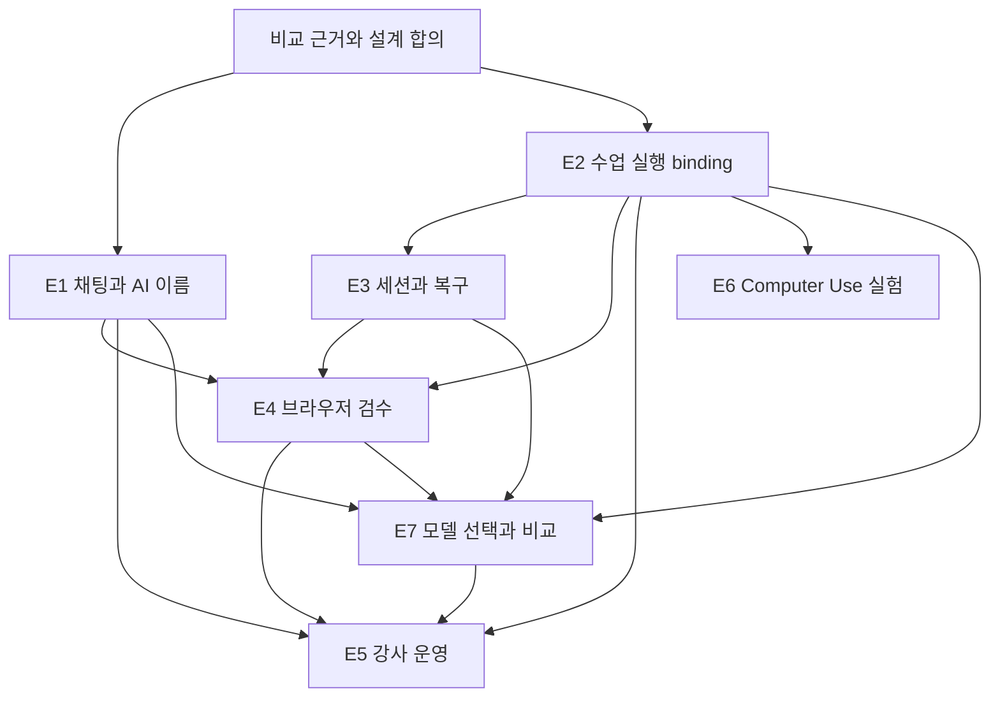

# 수업별 Agent 경험 에픽 제안

상태: 제안 · 2026-09-08 · 상위 에픽 [#746](https://github.com/jayleekr/hypeproof-studio/issues/746).
입력: [비교 증거](../research/agent-experience-2026-09-08/README.md),
[Mission/Intent](../design/learning-agent-experience.md), [요구사항](../requirements/learning-agent-experience.md),
[검증](../testing/learning-agent-experience.md).
이번 문서 PR은 연구/설계 산출물이다. 아래 구현 에픽을 완료시키거나 운영 권한을 변경하지 않는다.
철학 기준은 [Lab 2026-09-08 개정의 적용 기록](../design/philosophy-alignment-2026-09-08.md)을 따른다.
기능 완성·산출물 품질과 학습자의 판단 성장 증거를 구분한다.

## 로드맵

GitHub 하위 에픽: [E1 #747](https://github.com/jayleekr/hypeproof-studio/issues/747),
[E2 #748](https://github.com/jayleekr/hypeproof-studio/issues/748),
[E3 #749](https://github.com/jayleekr/hypeproof-studio/issues/749),
[E4 #750](https://github.com/jayleekr/hypeproof-studio/issues/750),
[E5 #751](https://github.com/jayleekr/hypeproof-studio/issues/751),
[E6 #752](https://github.com/jayleekr/hypeproof-studio/issues/752),
[E7 #755](https://github.com/jayleekr/hypeproof-studio/issues/755).

| 에픽 | 사용자에게 생기는 변화 | 요구사항 | 우선순위·의존성 |
|---|---|---|---|
| E1 — 수업에 맞는 AI 이름과 이해 가능한 채팅 | 강사가 이름·역할·말투를 구성하고 학생은 목표·대안·맥락·실행/대기/오류를 이해한다 | AE-01~04, AE-06~08, AE-35/38 | P0. 표시 정리는 독립 착수; 수업 설정 확정 전달은 E2와 연결 |
| E2 — 수업별 기능과 권한 계약 | 같은 학생에게 수업·단계별 적절한 실행·도움 범위를 제공하고 학생 권한으로 검증한다 | AE-09~13, AE-36 | P0 기반, 승인 묶음 P1. 다른 기능 확대의 선행 조건 |
| E3 — SDK 세션·복구·자원 관리 | 중단·자료 제거 후 문맥을 안전하게 이어가고 결과를 복구·내보낸다 | AE-14~17, AE-39/41 | 세션·복구·소유 P0, 예산 P1. E2 binding 사용 |
| E4 — 브라우저 결과를 검수 근거로 | 화면을 가리켜 요청하고 변경·검사·미검증/재확인 범위를 확인하며 필요시 직접 인계받는다 | AE-05, AE-18/19, AE-37 | 검수 P0, 외부 인계 P1. E2/E3 의존 |
| E5 — 강사 운영과 학습 관측 | 강사가 원인별 도움·인간 피드백을 연결하고 학습 근거로 다음 기수의 초안을 개선한다 | AE-20~22, AE-24, AE-40/42~44 | 기존 #732와 #745 확장. E1~4와 순차 통합 |
| E6 — 격리된 Computer Use 타당성 | 웹 밖 실제 수업 과제를 지원할지 근거로 결정한다 | AE-23 | P2. E2 실행 경계 선행, 주력 웹 수업 출시와 분리 |
| E7 — 수업별 멀티모델 선택·라우팅·비교 학습 | 강사가 허용 모델/사용 방식을 정하고 학생이 실제 모델과 다른 결과의 근거를 확인한다 | AE-25~34 | 고정/제한 선택 P0, 읽기 검토·Auto·인계 P1, 병렬 편집 P2. E1/E2 기반, E3/E4/E5 순차 연결 |

## E1 — 수업에 맞는 AI 이름과 이해 가능한 채팅

문제: 시작 화면의 목표·제작·검토 약속이 채팅에 충분히 이어지지 않는다. 도구명 중심 표시,
작은 글자, 고정된 “코치” 문구는 수업의 역할을 설명하기 어렵게 한다.

- 첫 PR: 고정 호칭 목록과 기존 ux.coach 동작 조사, 표시용 identity resolver, 중립 기본값/수업 이름 미리보기. 실제 App 변경은 관련 REQ도 갱신.
- 후속 PR: 강사 이름·역할·말투·개인화 설정을 기존 authoring에 연결. 설정 값은 Module/Service, 표시만 App 소유.
- 후속 PR: 선택 맥락 칩, 작업 상태, 실패 후 입력 보존, 한글 동작과 가독성. 기존 타임라인·Stop·대기열 재사용.
- 후속 PR: 동일 조건의 대안 비교와 학생 채택 이유, 실행/검수/채택/학습 관찰의 구분. 과거 이벤트가 현재 작업을 덮어쓰지 않게 함.
- 완료: AE-T01~05/27/30. 두 수업의 서로 다른 이름과 역할, AI 고지·수업 격리, 실제 모델 요청의 맥락 제외 검증. AE-T36에서 실제 작업 연결 확인.
- 제외: 이름으로 권한 확대, SDK 전체 UI, 원시 추론 노출. 내부 파일명 coach 일괄 개명은 필요 없음.

## E2 — 수업별 기능과 권한 계약

문제: profile의 기능 플래그와 수업 안내 사이에 강사가 관리할 실행 binding이 부족하다.
RBAC만으로 단계별 도움 수준·대상·행위를 표현할 수 없다.

- 첫 PR: 현재 REQ-M16/17/18 및 protocol 주석의 후속 결정 연결, existing auth/profile/session-design/D1 모델 조사, 하나의 binding ADR.
- 후속 PR: 정책 교집합·deny 우선·역할/수업 배정, 이름/교수 전략 등 수업 콘텐츠 schema 진화, 호환성/유효기간/취소 의미 정의.
- 후속 PR: Chalk 카탈로그 선택·변경 영향·학생 권한 리허설·증거 귀속. 기존 ENV/RUN/VER 계약 구현.
- 후속 PR: 시연/힌트/함께 수정/직접 수행의 전환과 도움 출처. 충분한 목적 입력에는 재질문 없이 진행하고, 불명확할 때 다음 결정 하나를 묻는 실제 모델 검증.
- 완료: AE-T06~08/28/35. 학생·타 수업 강사의 직접 API 우회 거부와 정상 작업 성공, SDK 도구 호출까지 양/음성 대조. 도움 방식으로 권한이나 학습 등급이 바뀌지 않음.
- P1: AE-T09 승인 묶음. 기존 “항상 승인” 규칙을 변경하는 행과 영향 범위를 PR에 명시한 뒤 도입.
- 제외: 새 인증 시스템, 프롬프트를 권한으로 해석, 아동 정책 완화, UI 숨김을 보안으로 간주.

## E3 — SDK 세션·복구·자원 관리

문제: SDK 기능의 존재만으로 문맥 재개·전체 작업 복구·학급 자원 관리가 제공되지는 않는다.

- 첫 PR: #647과 연결해 학생/수업/workspace별 지속 세션·압축·중복 실행 방지·취소를 설계하고 SDK 실제 런으로 검증.
- 후속 PR: #673/WEB-05와 통합한 파일 집합 복구. SDK checkpoint의 추적 제외 경로를 메우거나 분명히 제한. 복구 전 상태 보존.
- 후속 PR: SDK/CLI 핀·도구/옵션/event drift·자체 MCP 호환 매트릭스. 임의 플러그인/skills는 카탈로그 심사 경로.
- 후속 PR: 제외 자료가 이전 대화·요약·도구 결과에 남는 경로 조사. 배제할 수 없는 SDK resume는 사용하지 않고 확인된 자료로 재구성.
- 후속 PR: 수업/AI 만료 후 로컬 재열기·선택 내보내기. 파일·판단·검수·도움 기록 보존과 합성 비밀 제외.
- P1: 학생·학급 예산 예약/정산, fair queue, retry/time/concurrency 상한. #732 ADM-08에 연결.
- 완료: P0 AE-T07/10/11/31/33/35, P1 AE-T12. 장애 주입에서 권한/문맥 누출·중복 부작용·복구 손실 0. 결과가 불명확한 외부 작업은 확인 전 재실행하지 않음. 비용 상한의 잔여 노출 명시.
- 제외: 수업 참가자에게 CLI 설정 편집 요구, SDK 체크포인트를 외부 DB/배포 롤백으로 표현.

## E4 — 브라우저 결과를 검수 근거로

문제: 현재 browserMcp의 6개 도구는 실제 동작 기반이지만 학생이 검수한 범위를 쉽게
확인하는 결과 모델이 부족하다. 스크린샷 촬영과 과제 합격은 다르다.

- 첫 PR: 기존 browserControl의 탭 선택·페이지 이동·viewport와 AE-18 evidence 연결. 화면/요소를 질문 맥락으로 선택.
- 후속 PR: 변경 전후와 검수 카드, 콘솔/링크/이미지/반응형 검사의 명시적 범위. 오류가 심어진 합성 페이지로 검사.
- 후속 PR: 파일 집합·완료 기준·검사기·viewport의 버전과 검사 결과 연결. 수동 편집·복구 후 재확인 필요 표시와 과거 증거 보존.
- P1: 로그인/외부 폼의 사용자 인계와 재개, origin/문서 세대 변화 재검사. 외부 효과와 로컬 preview를 구분.
- 완료: AE-T13/29 및 AE-T14의 P0 탭/문서 세대 조건. 정상 대조군 통과, 심은 오류와 누락 기록, 잘못된 탭 조작 0, 오래된 검수의 현재 통과 표시 0. 외부 인계는 P1.
- 제외: 브라우저 도구를 처음부터 재작성, Computer Use 자동 fallback, 전체 인터넷 검사 보증.

## E5 — 강사 운영과 학습 관측

철학 개정 연결: P1에서 AE-43/44, AE-T37/38을 추가한다. 기존 선택 공유로 인간의 반론과
학생의 수정/유지/보류를 연결한다. AI 도움의 기술 성과와 판단의 성장·무변화·약화 가능성을
새 과제·후속 관찰에서 분리한다. 인간 검토나 후속 관찰이 없으면 해당 근거를 미확인으로 둔다.

문제: 학생마다 도구 승인을 받거나 질문 원문을 늘어놓는 보드는 강사의 수업 운영을
지원하지 못한다. 전체 학생의 준비 상태·대기 원인·도움 요청을 조합해야 한다.

- 첫 PR: #732의 authoring/board/classroom에 수업 버전·단계·기능 준비 상태 연결. 같은 원인 오류 묶음과 무신호 표시.
- 후속 PR: Studio에서 선택적 도움 요청과 검수 근거 공유. 기존 hps-classroom-share/1의 수신자·감사·철회 계약 유지.
- 후속 PR: 거절·환경·인증·서비스·학습 도움·무신호의 원인별 다음 행동. 원문 없이 도움 요청, 학생이 해결 확인.
- P1: 새 실행 일시정지/재개, 적용 안 된 기기 표시, 종료 리포트에 판단·도움·미측정 범위 연결.
- P1: 가설·수업/도움 revision·근거·설계 결정·다음 리허설을 연결. #745의 `hps-observation/1`·정정·불완전 기록 검증을 재사용하고 새로운 자동 점수 체계를 만들지 않음.
- 실험: 30명 파일럿과 100명 합성 부하의 운영 목표. 수용량·학습 효과는 실측 전까지 미확인.
- 완료: P0 AE-T15/32, P1 AE-T16/18/34 및 해당 #732/#745 회귀. 원문 자동 수집 0, 활동 없는 학생 누락 0, 독립 과제 관측 기록. 합성 수행과 사람의 학습 효과 구분.
- 제외: 이미 있는 보드·인증·공유 저장소 재생성, 모든 tool call 강사 승인, 프롬프트 수 기반 능력 점수.

## E6 — 격리된 Computer Use 타당성 실험

문제: OS 앱을 사용하는 수업이 실제로 필요한지와 브라우저/API로 충분한지 미확정이다.

- 실험 과제: 합성 자료를 지정 문서 앱에 입력·서식 수정·파일로 내보내기. 웹/API 대안과 같은 과제로 비교.
- 제공 범위: 전용 VM·앱 목록·학생별 자격 격리·화면 범위·인계·Stop·초기화·실행 증거.
- 측정: 완료/복구, 강사 개입 시간, 지연·비용, 화면/자격 노출, 지원 OS의 실제 동작.
- 완료: AE-T17과 비교 결과로 go/no-go를 남김. no-go 또는 보류도 유효한 종료 결과.
- 제외: 학생 개인 바탕화면 전면 제어, 강사의 무동의 원격 접속, 웹 도구 실패 시 자동 권한 확대.

## E7 — 수업별 멀티모델 선택·라우팅·비교 학습

철학 개정 연결: 모델 비교는 선택/보류 이유와 한계를 확인하는 환경이다. 두 결과 모두 보류할 수
있으며 다른 모델 검토를 인간의 social correction으로 표시하지 않는다(AE-34/43, AE-T26/37).

문제: /v1/chat의 네 공급자·profile.model이 이미 있지만 SDK 경로는 Anthropic 고정이고
학생용 모델 선택 UI가 없다. 실제 모델·지원 능력·자동 대체·비교 비용을 수업 경험으로 묶어야 한다.
근거는 [멀티모델 보충 연구와 화면](../research/agent-experience-2026-09-08/multi-model.md).

- 첫 PR: 기존 provider/alias/fast 보조 호출/Gemini fallback/model-caps 감사와 카탈로그·수업 정책 ADR. 구형 provider 문구 정합성 수정, 새 인증·저장소를 먼저 만들지 않음.
- P0: 검증한 기존 실행 경로에서 강사 고정/제한 선택→학생 picker→실제 모델 표시. identity/역할/모델/실행기/도구 권한을 구분. 아직 미지원인 조합의 차단 이유 제공.
- P0: 수업의 모델 매핑/허용 후보·정책 snapshot, 학생 권한 리허설, 모델 교체·은퇴·롤백 경로. 별칭이 같은 실제 ID면 서로 다른 성능 등급으로 광고하지 않음.
- P1 첫 확장: 현재 산출물과 검수 기준을 다른 모델의 읽기 전용 세션에 보내는 “다른 모델로 검토”. 결과별 근거·실패·채택 이유 보존, 편집자는 한 실행기.
- P1: 단계/역할/능력 기반 Auto와 별도 장애 대체 정책, 공급자/실행기 전환의 확인된 문맥 인계·원본 복귀. 모든 분기·보조 요청 비용은 E3 원장/대기열 재사용.
- P2: 다른 공급자의 도구 실행기 얇은 실험 후 격리된 병렬 편집. 파일/worktree만으로 격리됐다고 하지 않고 브라우저/자격·채택/폐기/충돌을 검증.
- 완료: AE-T19~26. 직접 요청의 정책 우회 0, 실제 모델/정규화 표시 일치, 문맥/grant 누출 0, 부분 실패 후 외부 효과 중복 0. 단일 모델 대비 비교 학습의 근거와 비용을 보고.
- 제외: 모델 dropdown만으로 모든 SDK 기능 지원 선언, 모델 다수결 기반 합격, 전체 모델 순위표, 무제한 BYOK/endpoint, 검증 전 학습형 라우터·범용 실행기 재작성.

E7 전체를 첫 채팅 파일럿의 선행 조건으로 묶지 않는다. 고정/제한 선택의 P0도 **지원하는
실행기/모델 조합에 한정**하며 네 공급자의 모든 도구 실행을 동시에 구현할 약속이 아니다.
E2는 권한 원본, E3는 세션/예산, E4는 검수 증거, E5는 학급 관측을 각각 소유한다.

## 순서와 추적

첫 검토 대상은 **“강사가 제작 파트너라는 이름으로 수업을 구성 → 학생이 수정 범위를
선택 → 모바일 결과를 확인 → 잘못된 변경 복구 → 검수 근거 공유”** 한 경로다.
이 경로의 기존 구현을 재사용하면서 빈 부분을 채운다. 모든 에픽의 완성을 기다리는 대규모 재작성은 필요 없다.
모델 선택은 이 첫 경로의 검증된 실행기에서 시작하며, “다른 모델로 검토”를 다음 독립 확장으로 둔다.

## 전달 단계와 구현 PR 경계

다음은 착수 가능한 분할 제안이며 구현 PR을 생성했거나 일정을 확정했다는 뜻은 아니다.
각 PR은 동작을 바꾸는 기존 REQ, 소유 테스트 경로, 실제 실행 결과, 제거 방법을 함께 갱신한다.
코드 확인만 한 항목과 이미 실행된 종단 결과를 구분한다.

| 단계 | 구현 범위와 의존성 | 검토할 산출물·종료 조건 |
|---|---|---|
| D0 — 구현 계약 | E2 주관, E1/E3/E4/E5/E7 연결. 기존 수업 전달·native observation·공유 조사 | 실행 binding ADR, 정확한 schema 진화, 구버전/누락/타 수업 대조군, 자료 제외·검수 버전·도움 출처의 저장 소유권 |
| D1 — 학생의 한 작업 | D0 이후 E1/E2/E7 P0. 목표·대안·AI 역할·수업 허용 모델·도움 선택·단계별 범위 | 실제 입력·강사 설정 전달·정책 검사, AE-T01~08/19~21/25/27/28/30/35의 해당 범위 |
| D2 — 중단과 소유 | D0 이후 E3, D1과 통합. 재개·자료 제외·복구·내보내기 | AE-T07/10/11/31/33/35, 파일 해시·미전송 자료·수업 종료 후 재열기 |
| D3 — 현재 결과 검수 | D1/D2 이후 E4. 브라우저 결과·조건별 검사·재확인·채택 | AE-T13/29, AE-T14의 탭/문서 세대 경계. 변경 후 오래된 초록 표시가 사라짐 |
| D4 — 첫 성인 파일럿 준비 | E5의 준비 상태·원인별 도움·선택 공유를 D1~3과 통합 | AE-T15/32/36 및 P0 30개 행의 개별 증거. 실제 App+모델+도구 경로, 강사/학생 조건 리허설 |
| D5 — 운영·학습 실험 | D4 이후 필요한 P1만 활성화. 승인 묶음·외부 인계·예산·인간 피드백·학습 회고 | AE-T09/12/14/16/18/22~24/26/34/37/38. 전이·후속 관찰, 무신호·중단·약화 가능성을 포함한 보고, 기존 조건 대비 개선 여부 |
| D6 — 웹 밖 과제 | E6 독립 실험. E2 권한 기반 필요 | AE-T17의 실제 VM 증거와 웹/API 대안 비교 후 go/no-go |

표시만 먼저 개선하는 작은 PR은 가능하지만 D4 완료를 의미하지 않는다.
각 단계에서 필요한 신규 P1 기능을 앞당겨 켜면 해당 인수 검증도 그 단계로 앞당긴다.
P0에서는 기존 승인·이용 한도 계약을 유지하고 새 승인 묶음이나 학급 예산을 검증 없이 켜지 않는다.

첫 파일럿은 기존 L2 진료시간·공지의 로컬 변경 경로다. 강사 시연용 결과 파일이나
웹 모의 실행으로 D4를 통과시키지 않는다. L3 공개/복구 실기는 해당 외부 경로를 실제 검증할 때만
완료하며, 실제 고객의 학습 효과는 D5의 관찰 전까지 미확인이다.

구현 중 발견한 새 문제는 기존 에픽에 원인·영향 요구사항·재현·다음 작업을 연결한다.
기능이 좋아 보인다는 이유로 첫 경로에 임의 플러그인·다중 Agent UI·Computer Use를 계속 추가하지 않는다.

추적 충돌 방지: #732 운영, #744 실제 체험, #647 문맥, #673 복구, #694 module attribution,
#638 실행 가시성, #627 대기 UX를 관련 작업으로 연결한다. 기존 wip 작업은 이 제안으로 가져오지 않는다.
상위 이슈에 하위 에픽 URL과 문서 PR을 연결하며 완료 표시는 실행 증거가 있는 범위에만 한다.
