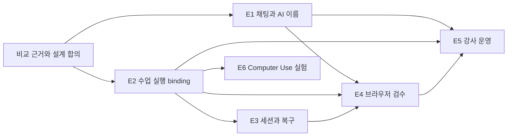

# 수업별 Agent 경험 에픽 제안

상태: 제안 · 2026-09-08 · 상위 에픽 [#746](https://github.com/jayleekr/hypeproof-studio/issues/746).
입력: [비교 증거](../research/agent-experience-2026-09-08/README.md),
[Mission/Intent](../design/learning-agent-experience.md), [요구사항](../requirements/learning-agent-experience.md),
[검증](../testing/learning-agent-experience.md).
이번 문서 PR은 연구/설계 산출물이다. 아래 구현 에픽을 완료시키거나 운영 권한을 변경하지 않는다.

## 로드맵

GitHub 하위 에픽: [E1 #747](https://github.com/jayleekr/hypeproof-studio/issues/747),
[E2 #748](https://github.com/jayleekr/hypeproof-studio/issues/748),
[E3 #749](https://github.com/jayleekr/hypeproof-studio/issues/749),
[E4 #750](https://github.com/jayleekr/hypeproof-studio/issues/750),
[E5 #751](https://github.com/jayleekr/hypeproof-studio/issues/751),
[E6 #752](https://github.com/jayleekr/hypeproof-studio/issues/752).

| 에픽 | 사용자에게 생기는 변화 | 요구사항 | 우선순위·의존성 |
|---|---|---|---|
| E1 — 수업에 맞는 AI 이름과 이해 가능한 채팅 | 강사가 이름·역할·말투를 구성하고 학생은 목표·맥락·실행/대기/오류를 이해한다 | AE-01~04, AE-06~08 | P0. 표시 정리는 독립 착수; 수업 설정 확정 전달은 E2와 연결 |
| E2 — 수업별 기능과 권한 계약 | 같은 학생에게 수업·단계별 적절한 실행 범위를 제공하고 학생 권한으로 검증한다 | AE-09~13 | P0 기반, 승인 묶음 P1. 다른 기능 확대의 선행 조건 |
| E3 — SDK 세션·복구·자원 관리 | 중단 후 작업을 이어가고 변경을 되돌리며 예산/동시 실행을 통제한다 | AE-14~17 | 세션·복구 P0, 예산 P1. E2 binding 사용 |
| E4 — 브라우저 결과를 검수 근거로 | 화면을 가리켜 요청하고 변경·검사·미검증 범위를 확인하며 필요시 직접 인계받는다 | AE-05, AE-18/19 | 검수 P0, 외부 인계 P1. E2/E3 의존 |
| E5 — 강사 운영과 학습 관측 | 강사가 전체 상태와 예외를 보고 도움을 처리하며 다음 기수에 재사용한다 | AE-20~22, AE-24 | 기존 #732 확장. E1~4와 순차 통합 |
| E6 — 격리된 Computer Use 타당성 | 웹 밖 실제 수업 과제를 지원할지 근거로 결정한다 | AE-23 | P2. E2 실행 경계 선행, 주력 웹 수업 출시와 분리 |

## E1 — 수업에 맞는 AI 이름과 이해 가능한 채팅

문제: 시작 화면의 목표·제작·검토 약속이 채팅에 충분히 이어지지 않는다. 도구명 중심 표시,
작은 글자, 고정된 “코치” 문구는 수업의 역할을 설명하기 어렵게 한다.

- 첫 PR: 고정 호칭 목록과 기존 ux.coach 동작 조사, 표시용 identity resolver, 중립 기본값/수업 이름 미리보기. 실제 App 변경은 관련 REQ도 갱신.
- 후속 PR: 강사 이름·역할·말투·개인화 설정을 기존 authoring에 연결. 설정 값은 Module/Service, 표시만 App 소유.
- 후속 PR: 선택 맥락 칩, 작업 상태, 실패 후 입력 보존, 한글 동작과 가독성. 기존 타임라인·Stop·대기열 재사용.
- 완료: AE-T01~05. 두 수업의 서로 다른 이름과 역할, AI 고지·수업 격리, 실제 모델 요청의 맥락 제외 검증.
- 제외: 이름으로 권한 확대, SDK 전체 UI, 원시 추론 노출. 내부 파일명 coach 일괄 개명은 필요 없음.

## E2 — 수업별 기능과 권한 계약

문제: profile의 기능 플래그와 수업 안내 사이에 강사가 관리할 실행 binding이 부족하다.
RBAC만으로 단계별 도움 수준·대상·행위를 표현할 수 없다.

- 첫 PR: 현재 REQ-M16/17/18 및 protocol 주석의 후속 결정 연결, existing auth/profile/session-design/D1 모델 조사, 하나의 binding ADR.
- 후속 PR: 정책 교집합·deny 우선·역할/수업 배정, 이름/교수 전략 등 수업 콘텐츠 schema 진화, 호환성/유효기간/취소 의미 정의.
- 후속 PR: Chalk 카탈로그 선택·변경 영향·학생 권한 리허설·증거 귀속. 기존 ENV/RUN/VER 계약 구현.
- 완료: AE-T06~08. 학생·타 수업 강사의 직접 API 우회 거부와 정상 작업 성공, SDK 도구 호출까지 양/음성 대조.
- P1: AE-T09 승인 묶음. 기존 “항상 승인” 규칙을 변경하는 행과 영향 범위를 PR에 명시한 뒤 도입.
- 제외: 새 인증 시스템, 프롬프트를 권한으로 해석, 아동 정책 완화, UI 숨김을 보안으로 간주.

## E3 — SDK 세션·복구·자원 관리

문제: SDK 기능의 존재만으로 문맥 재개·전체 작업 복구·학급 자원 관리가 제공되지는 않는다.

- 첫 PR: #647과 연결해 학생/수업/workspace별 지속 세션·압축·중복 실행 방지·취소를 설계하고 SDK 실제 런으로 검증.
- 후속 PR: #673/WEB-05와 통합한 파일 집합 복구. SDK checkpoint의 추적 제외 경로를 메우거나 분명히 제한. 복구 전 상태 보존.
- 후속 PR: SDK/CLI 핀·도구/옵션/event drift·자체 MCP 호환 매트릭스. 임의 플러그인/skills는 카탈로그 심사 경로.
- P1: 학생·학급 예산 예약/정산, fair queue, retry/time/concurrency 상한. #732 ADM-08에 연결.
- 완료: AE-T07/10~12. 장애 주입에서 권한/문맥 누출·중복 부작용·복구 손실 0. 비용 상한의 잔여 노출 명시.
- 제외: 수업 참가자에게 CLI 설정 편집 요구, SDK 체크포인트를 외부 DB/배포 롤백으로 표현.

## E4 — 브라우저 결과를 검수 근거로

문제: 현재 browserMcp의 6개 도구는 실제 동작 기반이지만 학생이 검수한 범위를 쉽게
확인하는 결과 모델이 부족하다. 스크린샷 촬영과 과제 합격은 다르다.

- 첫 PR: 기존 browserControl의 탭 선택·페이지 이동·viewport와 AE-18 evidence 연결. 화면/요소를 질문 맥락으로 선택.
- 후속 PR: 변경 전후와 검수 카드, 콘솔/링크/이미지/반응형 검사의 명시적 범위. 오류가 심어진 합성 페이지로 검사.
- P1: 로그인/외부 폼의 사용자 인계와 재개, origin/문서 세대 변화 재검사. 외부 효과와 로컬 preview를 구분.
- 완료: AE-T13/14. 정상 대조군 통과, 심은 오류와 누락 기록, 잘못된 탭 조작 0.
- 제외: 브라우저 도구를 처음부터 재작성, Computer Use 자동 fallback, 전체 인터넷 검사 보증.

## E5 — 강사 운영과 학습 관측

문제: 학생마다 도구 승인을 받거나 질문 원문을 늘어놓는 보드는 강사의 수업 운영을
지원하지 못한다. 전체 학생의 준비 상태·대기 원인·도움 요청을 조합해야 한다.

- 첫 PR: #732의 authoring/board/classroom에 수업 버전·단계·기능 준비 상태 연결. 같은 원인 오류 묶음과 무신호 표시.
- 후속 PR: Studio에서 선택적 도움 요청과 검수 근거 공유. 기존 hps-classroom-share/1의 수신자·감사·철회 계약 유지.
- P1: 새 실행 일시정지/재개, 적용 안 된 기기 표시, 종료 리포트에 판단·도움·미측정 범위 연결.
- 실험: 30명 파일럿과 100명 합성 부하의 운영 목표. 수용량·학습 효과는 실측 전까지 미확인.
- 완료: AE-T15/16/18 및 해당 #732 회귀. 원문 자동 수집 0, 활동 없는 학생 누락 0, 독립 과제 관측 기록.
- 제외: 이미 있는 보드·인증·공유 저장소 재생성, 모든 tool call 강사 승인, 프롬프트 수 기반 능력 점수.

## E6 — 격리된 Computer Use 타당성 실험

문제: OS 앱을 사용하는 수업이 실제로 필요한지와 브라우저/API로 충분한지 미확정이다.

- 실험 과제: 합성 자료를 지정 문서 앱에 입력·서식 수정·파일로 내보내기. 웹/API 대안과 같은 과제로 비교.
- 제공 범위: 전용 VM·앱 목록·학생별 자격 격리·화면 범위·인계·Stop·초기화·실행 증거.
- 측정: 완료/복구, 강사 개입 시간, 지연·비용, 화면/자격 노출, 지원 OS의 실제 동작.
- 완료: AE-T17과 비교 결과로 go/no-go를 남김. no-go 또는 보류도 유효한 종료 결과.
- 제외: 학생 개인 바탕화면 전면 제어, 강사의 무동의 원격 접속, 웹 도구 실패 시 자동 권한 확대.

## 순서와 추적

첫 검토 대상은 **“강사가 제작 파트너라는 이름으로 수업을 구성 → 학생이 수정 범위를
선택 → 모바일 결과를 확인 → 잘못된 변경 복구 → 검수 근거 공유”** 한 경로다.
이 경로의 기존 구현을 재사용하면서 빈 부분을 채운다. 모든 에픽의 완성을 기다리는 대규모 재작성은 필요 없다.

추적 충돌 방지: #732 운영, #744 실제 체험, #647 문맥, #673 복구, #694 module attribution,
#638 실행 가시성, #627 대기 UX를 관련 작업으로 연결한다. 기존 wip 작업은 이 제안으로 가져오지 않는다.
상위 이슈에 하위 에픽 URL과 문서 PR을 연결하며 완료 표시는 실행 증거가 있는 범위에만 한다.
