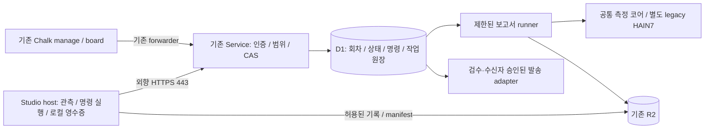

# 강사·플랫폼 관리자 콘솔 요구사항

상태: 채택한 구현 목표. 개별 완료 범위는 하단 구현표를 따른다.
검토일: 2026-09-07 · 추적: #732.
범위: Chalk 강사 콘솔, Service 운영자 콘솔, Studio 학생의 선택적 공유.
기존 [수업 작성 요구사항](chalk-authoring.md), [행동 계약](../studio-requirements.md)을 확장한다.
교육 에셋의 정의는 [seven-assets](../seven-assets.md)에 위임한다.

### 1인 강사 운영에서의 역할 · 2026-09-21

이 콘솔은 [커리큘럼과 연결된 1인 강사 운영](../plan/learning-agent-experience-epics.md#one-instructor-classroom)의
실시간 소통과 원격 조치를 담당한다. 요구 제안·현장 경험 출처는 **TJ**이며 기존 담당·승인
권한은 바꾸지 않는다. 커리큘럼 작성은 [Chalk 계약](chalk-authoring.md), 제품 의도는
[Product Intent](../PRODUCT-INTENT.md#one-instructor-classroom-intent)에 연결한다.

- **실시간 모니터링·소통(ADM-02/04/05/09):** 전체 명단의 입장·현재 단계·제출·도움 요청·마지막
  신호를 보고, 강사 피드백과 학생의 해결 확인을 잇는다. Padlet 사용에서 확인한 소통 필요를
  프로그램의 상태·행동으로 연결하는 것이 목적이며, 단순 게시판 복제나 읽음 감시는 아니다.
- **원격 조치(ADM-01/03/07/10/11/13/14):** 알려진 원인별 허용 해결책을 준비해 개별·일괄로
  실행한다. 토큰 발급/활성화 확인, 공지·자료·프롬프트·수업 설정 배포, 동의된 기록 회수,
  작업 보존형 복구를 구별한다. 데이터 회수와 보낸 자료 철회도 별도 행동이다. 각 대상의
  접수·적용·실패·미확인과 조치 이후 상태를 보여야 하며 진단 완료를 해결로 표시하지 않는다.

완료 판단은 [1인 강사 통합 인수](../testing/classroom-admin.md#one-instructor-acceptance)로
연결한다. 개별 기능의 로컬 통과를 다수 실제 기기·현장 운영 완료로 확대하지 않는다.

**보고서 갭 재설정 · 2026-09-22.** 같은 날 구현 현황 보고서를 기준으로 남은 일을 네 단계로 다시 줄 세웠다 —
G1 강사 운영 화면(정보 구조·표·상세·선택 도구·결과 카드·마무리 단계; [디자인 G1](classroom-design.md#g1-instructor-ia-20260922)),
G2 커리큘럼 작성→리허설·확정→학생 과제·도움·도구·실행의 적용 증거, G3 여러 세션(`/3`) 회수→보고서 입력·반복 패턴·PDF/공급자 공백·검수·발송 화면,
G4 실제 Mac 통합 여정. 순서·인수 기준·실제 상태는 [로드맵](../plan/learning-agent-experience-epics.md#report-gap-reset-20260922)이 정본이다.
G1은 화면 재배치이며 이 문서의 ADM 계약·권한·확인 단계를 바꾸지 않는다. 회수는 회수만 한다 — 회수가 성공했다는 이유로 평가·발송을 시작하지 않는다(G3에서도 유지).

## 역할과 열람 경계

강사는 자기 코호트·프로필의 수업을 운영한다. 플랫폼 관리자는 기존 운영자 인증으로
계정·사용량·장애를 관리한다. 운영 권한 자체가 모든 대화 원문 접근 권한은 아니다.
기존 board는 계속 metadata-only이며 기존 studio-logs의 operator-only 계약도 유지한다.

공유 모드는 (1) 기본 운영 메타데이터 (2) 학생이 선택한 기록 공유
(3) 별도 동의·계약이 필요한 수업 관찰 모드로 구분한다.
기존 구현은 (2)이며 전체 세션 자동 수집이나 과거 로그 재공개를 포함하지 않는다.
2026-09-18 원격 운영·수집 확장 설계는 아래 별도 절에 있으며 아직 활성화하지 않았다.
관찰 모드는 구현 목표이고 아직 활성화하지 않는다. 아동 공유는 검증된 보호자 동의
계약이 마련되기 전 서버에서 거부한다. 기존 profile의 단순 동의 주장으로 해제하지 않는다.

## Acceptance requirements

| ID | 요구사항 및 관측 가능한 인수 기준 | 우선순위 |
|---|---|---|
| ADM-01 | 강사·학생·기수·수업을 초대·배정·종료한다. 서버가 역할·코호트·프로필 범위를 강제하며 다른 수업 데이터는 불변이다. | P0 |
| ADM-02 | 수업 전체 학생의 단계·최근 활동·제출·도움 요청을 표시한다. 명단 범위와 갱신 시각을 명시하며 무신호는 확인 불가로 표시한다. | P0 |
| ADM-03 | 공유 허용된 학생 프롬프트·응답·시각·수업 단계를 담당 강사가 조회한다. 학생에게 공유 대상·내용·기한이 보이며 수업 밖 기록은 제외한다. | P0 |
| ADM-04 | 질문에 연결된 도구 실행·오류·파일 변경 근거를 표시한다. 학생이 선택한 요약과 자동 관측 사실을 구분하며 비밀은 가린다. | P0 |
| ADM-05 | 학생이 특정 대화·결과물을 선택해 도움을 요청하고 강사가 피드백·다음 조치를 남긴다. 저장 충돌 시 입력을 보존하고 해결은 학생이 확인한다. | P0 |
| ADM-06 | 결과물과 변경 이유·검수 기록·도움 사용 범위를 함께 검토한다. URL을 서버가 임의 실행하거나 결과물 제출만으로 합격시키지 않는다. | P0 |
| ADM-07 | 담당자·코호트·프로필·기록별 공유 권한을 서버에서 검증한다. 열람 이력 기록 실패 시 원문을 내보내지 않고 철회·만료·폐기된 자격은 거부한다. | P0 |
| ADM-08 | 학생·수업별 요청·토큰·비용·오류를 표시하고 예산을 설정한다. 가격/사용량 미확인은 0으로 표시하지 않으며 동시 요청에도 정한 예산 정책을 지킨다. | P1 |
| ADM-09 | 반복 오류·긴 대기·미진행 신호와 판정 근거를 표시한다. 임계값은 검증 가능한 근거를 가지며 프롬프트 수로 능력 점수를 만들지 않는다. | P1 |
| ADM-10 | 권한 있는 강사가 참여 열기·닫기·새 실행 일시정지·재개를 수행한다. 적용 범위·실행 중 작업 영향·복구 방법을 확인하고 학생 파일을 보존한다. | P0 |
| ADM-11 | 강의·모델·도구·설정의 적용 버전과 변경 영향을 표시한다. 진행 수업을 조용히 바꾸지 않으며 서버의 정책 권한을 강의 문구로 확대하지 않는다. | P0 |
| ADM-12 | 기능 요청·장애를 수업과 연결해 접수하고 담당자·상태·분류·다음 조치·일정 또는 미정 사유를 관리한다. 요청자의 실제 해결 확인을 기록한다. | P1 |
| ADM-13 | 수업 종료 리포트에 완료·미완료·도움 사용·주요 오류와 근거·미측정 범위를 표시한다. 메타데이터 보고서에 대화 원문을 자동 포함하지 않는다. | P1 |
| ADM-14 | 공유 기록의 보관·열람 기한을 표시하고 학생의 철회·만료·삭제를 적용한다. 원문과 연결된 감사 기록의 삭제를 검사하며 기존 로그 정책을 변경하지 않는다. | P0 |

## 공유 계약 — hps-classroom-share/1

Service 소유의 별도 D1 테이블 `classroom_shares`, `classroom_share_audit`를 사용한다.
Chalk는 HTTP 전달과 표시만 맡으며 KV/D1/R2에 직접 쓰지 않는다.

- 학생: `/v1/classroom/shares` GET/POST, `/:id` DELETE, `/:id/confirm` POST, `/:id/audit` GET.
- 강사: `/admin/cohorts/:cohort/classroom/shares` GET, `/:id` GET/PUT.
- 강사 목록 GET(2026-09-22 보완): 강사 범위(토큰 scope의 profile)는 **행 수 제한 전에** SQL에서 거른다 — 범위 밖 행이 한 페이지를 채워 허용된 요청을 밀어내지 않는다.
  선택 쿼리 `session_id`·`kind`(`help`|`submission`)·`limit`(1~100, 기본 100)·`before`(이전 응답의 `next_cursor`, `created_at:id`). 최신순(`created_at`, `id`)으로 준다.
  응답은 기존 `recipient_id`·`shares`·`limit`에 더해 `has_more`·`next_cursor`(더 오래된 일치 행이 있을 때만)·`filter`·`counts`(`matched`·`open`=접수+검토 중·`answered`)다.
  `counts`는 이 강사가 볼 수 있고 필터에 맞는 행만 센다(범위 밖·다른 수신자 행은 수에도 드러나지 않는다). 잘못된 필터는 넓히지 않고 400.
  완결성은 `has_more:false`로만 판단한다 — 소비자는 행 수로 완결성을 추론하지 않는다. 철회·만료·권한 없음은 기존대로 단건 읽기·저장에서 404로 막힌다.
  선택 쿼리 `status=open`(2026-09-22 후속, Codex F2b): 페이지를 강사 응답 대기(접수·검토 중) 행으로 좁힌다. `counts`는 이 필터와 무관하게 `session_id`·`kind`에 맞는 모든 행을 센다. 다른 값은 400. 응답 `filter.status`에 되돌려준다.
- 신원은 검증된 토큰에서 가져온다. 학생 입력의 수업·학생 ID로 덮어쓰지 않는다.
- 제출은 열린 동일 프로필 수업의 명단에 있는 성인 학생만 가능하다. 읽기·철회·확인은 수업 종료 후에도 토큰 유효 기간 안에서 가능하다.
- 수신 강사: 강사는 토큰의 subject와 정확히 일치하는 수신 기록만 읽는다. 같은 코호트의 다른 강사도 접근할 수 없다.
  2026-09-22(Studio 도움 요청, AT-47)부터 Service가 이 학생의 수업 배정을 아는 수업(원격 운영 ON + 이번 수업 회차 설정)에서는 **배정된 강사만** 수신자가 된다 — 웹 페이지의 직접 입력도 배정과 다르면 409 `recipient_not_assigned`. 배정 정보가 없는 수업(운영 OFF·회차 없음)은 이전처럼 형식만 검사하며, 이 경우 수신자의 수업 배정은 증명되지 않는다(열람은 여전히 수신자·강사 범위로만).
- 공유 필드: question, prompt, response, tool_summary, artifact_url, verification. `question`(2026-09-22)은 학생이 강사에게 직접 쓴 질문이며 대화를 공유하지 않고 도움을 요청할 수 있게 한다 — 보낸 경우에만 저장해 이전 형식의 요청은 저장 모양이 그대로다. 나머지는 학생이 선택한 기록이며 자동 검증된 실행 로그가 아니다.
- 열람 기한은 학생 선택 5분~24시간과 학생 토큰 만료 중 이른 시각이다. UI 기본값 1시간. 서버 읽기는 만료 즉시 차단하고 기존 15분 cron에서 새 공유 테이블의 만료 행만 삭제한다. cron 실패는 로그에 남기며 물리 삭제 시각을 만료 시각과 동일하다고 표현하지 않는다.
- 삭제는 자기 공유만 가능하며 연결된 감사 기록도 삭제한다. 이미 보거나 내려받은 사본은 회수할 수 없다고 안내한다.
- 요청 ID는 중복 제출을 식별한다. 동일 ID의 다른 내용은 409. feedback은 revision CAS. 강사는 answered까지, 학생만 resolved로 전이시킨다.
- 원문 목록 조회는 없다. 강사 목록은 메타데이터이며 개별 열람 시 감사 쓰기 성공 후 내용을 반환한다. API는 no-store, 클라이언트 토큰은 메모리 전용이다.
- 자동 관찰·학생 파일 원격 수정·아동 동의·전체 세션 보존은 이 계약으로 허용하지 않는다.

### Studio 도움 요청 · 2026-09-22 (ADM-03/05 · DES-04/09 · AT-47)

<a id="native-help-20260922"></a>
학생이 Studio 작업 화면(코치 레일, 기본 닫힘·Primary 없음·모달 없음)에서 **이번 수업의 강사**에게 도움을 요청하고, 강사는 기존 Chalk `/manage`의 도움 요청 목록에서 열어 피드백·다음 조치를 남기며, 학생은 같은 창에서 읽고 **직접** 해결을 확인하거나 공유를 철회한다. 기술 장애 감지·복구 명령(AT-40/41)과는 별개다. 새 원장·새 인증은 없다 — 위 공유 계약과 기존 운영 연결을 쓴다.

| 항목 | 계약 |
|---|---|
| 수신자 도출 | `GET /v1/classroom/help-recipient`(학생 토큰). 토큰의 코호트·프로필의 **활성 수업** → 그 회차에서 이 학생의 **살아 있는 좌석**(교체되지 않음) → 그 좌석의 **활성 운영 연결**(grant) → 그 연결의 페어링을 발급한 강사(`issuer_id`). 발급 강사 토큰이 KV 철회되었거나 D1 fence가 걸렸으면 `instructor_revoked`. 읽기 실패는 503 `unknown`(‘강사 없음’으로 말하지 않음). 응답은 강사 ID·회차·좌석·grant id뿐이며 강사 자격 증명은 없다. 이유 코드: `ops_disabled`·`no_active_class`·`not_connected`·`no_instructor`·`instructor_revoked`·`unknown`. |
| 위임의 의미 | ‘이 좌석을 이 수업에 연결한 강사’가 받는다. 같은 코호트의 공동 강사가 페어링했으면 그 강사다. 강사 토큰이 재발급되어 옛 jti가 철회되면 학생이 새 연결 코드로 다시 연결하기 전까지 수신자가 없다(닫힌 쪽으로 실패). |
| 제출 재검증 | 네이티브 요청은 `class_run_id`·`grant_id`를 함께 보낸다. 쓰기 전에 활성 회차와 다르면 409 `class_changed`, 배정 강사와 다르면 409 `recipient_not_assigned`, 연결이 바뀌었으면 409 `connection_changed`, 배정이 없으면 403(이유 코드). |
| 쓰기 시점의 배정 (2026-09-22 U4, Codex F3) | 배정이 있는 수업의 저장은 **조건부 INSERT 한 문장**이다: 같은 문장이 그 연결의 활성·만료 전, 좌석의 현재 소유(교체 안 됨), 발급 강사 = 수신자, 발급 강사 D1 fence 없음, 이 학생의 더 새 활성 연결 없음, D1 회차 창(`class_run_ops.ends_at`·`sessions.ended_at`)을 다시 평가한다. 앞선 읽기와 INSERT 사이에 이 중 하나가 바뀌면 **0행** 저장되고 이유를 다시 읽어 403(`not_connected`·`instructor_revoked`·`no_active_class`) 또는 409(`recipient_not_assigned`·`connection_changed`)로 답한다. **원자성 한계:** 어느 수업이 ‘지금’인지(KV 활성 세션)와 발급 강사 토큰의 KV 철회는 D1 문장에 들어갈 수 없어 INSERT 직전에 읽을 뿐이다 — KV에서만 끝난 수업·KV에서만 철회된 강사는 D1 fence·`ended_at`이 쓰이기 전까지 이 창을 닫지 못한다. 회차 기준은 KV 세션의 `session_id` = D1 `class_run_id` 하나다. 배정 정보가 없는 수업(운영 OFF)은 이전처럼 조건 없는 INSERT다. |
| 동의한 종료 시각 (2026-09-22 U4, Codex F2) | 학생이 동의하는 것은 **미리보기에 보인 종료 시각**이지 ‘POST가 도착한 때부터의 기간’이 아니다(미리보기 5분 뒤 보낸 요청이 300초 더 길게 저장되던 결함). `GET help-recipient?request_id=<id>&duration_minutes=<분>`이 종료 시각 = 지금 + 기간(학생 토큰 만료가 먼저면 그 시각)을 계산해 학습자·회차·연결·수신 강사·요청 id·기간과 함께 **Service 서명**(HMAC, 서명 비밀)으로 돌려준다. 미리보기는 그 시각을 보여 주고, 네이티브 POST는 `consent_envelope {expires_at, proof}`로 되돌려야 한다. 저장 만료 = 그 시각, 쓰기 시점 토큰이 더 일찍 끝나면 그 시각(더 짧게만). 서명이 맞지 않으면 400 `consent_invalid`(다른 id·기간·학습자·늦춘 시각), 없으면 400 `consent_required`, 이미 지났으면 409 `consent_expired` — 모두 저장 0. 클라이언트가 고른 시각은 서명이 없어 믿지 않는다. **웹 페이지 호환:** 회차를 밝히지 않는 웹 요청은 기간만 보여 주고 저장 후 실제 만료를 알리므로 ‘도착부터 기간(토큰 상한)’ 그대로다. |
| 재시도·동의 범위 | 같은 id는 **같은 동의 범위**일 때만 같은 요청이다: 학습자·회차·수신자·종류·정확한 내용·허가된 만료(네이티브: 서명된 종료 시각, 또는 그보다 이른 그때 토큰 만료 / 웹: 만들 때의 기간, 토큰 상한). 같은 id로 기간을 바꾼 서명을 새로 받아 와도, 다른 내용, 끝난 수업 A의 id를 수업 B에서 재사용하는 것도 409(`request_id_conflict`/`class_changed`) — 재시도는 저장된 행을 그대로 돌려줄 뿐 만료를 옮기지 않는다. 토큰 재발급 뒤의 재시도는 저장된 만료가 서명 시각과 같거나 그 토큰 만료와 같을 때만 같은 요청이다(옛 토큰이 더 일찍 끝나 잘린 요청을 새 토큰으로 재시도하면 409 — 요청은 목록에 그대로 보인다). |
| 현재 큐와 이력 | 학생 `GET /shares?session_id=<회차>`는 그 수업의 요청만, 필터 없는 목록은 만료 전 모든 수업의 이력이다. Studio는 둘을 따로 그리며 이전 수업의 공유는 ‘철회만 가능’으로 남긴다 — 철회 경로를 숨기지 않는다. |
| 동의 화면 | 받는 강사·이 글자 그대로 저장될 내용·볼 수 있는 **종료 시각(위 서명된 시각)**·철회 방법을 먼저 보여 준 뒤, 체크하지 않은 동의 확인란을 학생이 체크해야 보낸다. 대화는 학생이 고른 **한 턴**(학생 메시지+그 답)만, 그리고 **이 창의 수업 연결 이후의 메시지**만 선택지에 나온다 — 채팅 이력은 학생별이 아니라 수업별로 저장돼 그 이전 메시지를 지금 학생의 것으로 귀속할 수 없다. |
| 기기 보관 | 쓰던 질문은 (코호트·프로필·학생·회차)에, 미리 본 요청은 거기에 연결 grant까지 묶어 저장한다. 다른 학생·수업·연결에서는 보이지도 보내지지도 않는다. 보내기 직전과 응답 도착 뒤에 다시 대조한다. 동의 후 보내기 전에 ‘보내는 중’을 먼저 기록하고, 응답이 사라지면 `unknown` — 같은 id·같은 내용으로만 다시 확인한다(중복 저장 0). 24시간 손대지 않은 다른 학생의 초안·요청은 기기에서 지운다(다른 창이 그 사이 고친 기록은 남긴다 — 정리도 같은 compare-and-swap). 서명된 종료 시각이 없는(이전 형식) 요청이나 그 시각이 지난 요청은 보내지 않고 다시 미리 보게 한다. |
| 늦은 응답·학습자 교체 (2026-09-22 U4, Codex F1) | App의 도움 adapter는 **모든 await 뒤에** ‘이 그리기가 가장 새것이고, 같은 학습자·같은 연결인가’를 다시 묻고, 아니면 그리지 않는다(목록 읽기·응답 유실 정리 저장·미리보기·보내기·확인·철회·지우기 공통). 앞선 학습자의 응답은 그 학습자 키의 기기 기록에만 반영되고 화면에는 나오지 않는다. 알림 문구(‘보냈습니다’·‘해결됐다고 알렸습니다’·‘철회했습니다’ 등)는 그 학습자·연결에 묶여 다른 학습자나 연결 없는 화면에 나오지 않는다. webview도 이미 그린 것보다 번호가 앞선 그림을 버린다. ‘강사에게 보냈습니다’는 그 요청이 아직 열리지 않은 동안만 남고, 강사가 답했거나(검토 중·답변·해결) 목록에서 사라지면 지운다. |
| 여러 창의 기기 저장 (2026-09-22 U4 · 저장 보완) | **초안과 미리 본·보내는 중·응답 불명 요청은 `globalState`가 아니라 기록마다 따로 된 파일에 둔다.** VS Code는 확장의 globalState를 창마다 **한 객체**로 들고, 갱신하면 약 100ms 뒤 그 객체 **전체**를 쓰고, 다른 창의 사본을 통째로 바꾼다(배포 셸 `extensionHostProcess.js`·`workbench.desktop.main.js`에서 확인, 실제 `state.vscdb`의 확장 행 하나에 모든 키가 들어 있음). 그래서 키를 나눠도 두 창이 그 지연 안에 쓰면 다른 학생의 초안이 지워졌다(`bced496` W-residual, Codex 재현 10/11). **선택:** 앱의 모든 창이 공유하는 `globalStorageUri/classroom-help/` 아래에 기록(초안 키·요청 키)마다 디렉터리를 두고, 새 버전은 임시 파일을 끝까지 쓴 뒤 **`link()`로 다음 번호를 새로 만든다** — 그 번호가 이미 있으면(다른 창이 먼저 씀) 다시 읽고 다시 판단한다. U2 보관함 index와 같은 잠금 없는 compare-and-swap이다. 다른 기록끼리는 같은 파일을 만지지 않고, 요청 상태 변경은 그 기록 안에서 요청 id 비교 후에만 되어 보내는 중·응답 불명 요청이 새 미리보기로 바뀌지 않고 `sending`/`unknown`·POST는 학생이 동의한 id에만 생기며, 죽은 창은 이전 버전 또는 새 버전을 온전히 남긴다(찢어진 파일·훔칠 잠금 없음). 파일은 0600·디렉터리 0700, 파일 이름은 키의 해시(학생 id가 경로에 나오지 않음), 삭제는 표시(tombstone)로 남겨 늦은 쓰기가 되살리지 못한다. **검토한 대안:** 키 분할 globalState — 전체 객체 쓰기라 해결 아님. 창 간 단일 작성자(잠금 파일, `FileRecordStorage.exclusive`) — 두 번째 창이 `storage_busy`로 실패하거나 기다려야 하고, 죽은 소유자 잠금 회수가 필요. 새 DB(SQLite 등) — 새 의존성·스키마·이관 비용에 비해 기록 수가 적다. **이관:** 옛 `hypeproof.classroomHelp.v1` 값은 창이 처음 도움 칸을 쓸 때 기록마다 ‘한 번도 쓰인 적 없을 때만’ 옮긴다(이미 있거나 지운 기록은 건드리지 않음, 24시간 지난 것은 옮기지 않음). 모든 기록이 디스크에 들어간 뒤에만 옛 값을 지우고, 하나라도 실패하면 남겨 두었다가 다음에 다시 한다 — 여러 창·반복 실행에 안전. 로그에는 개수만 남긴다. **정책:** 같은 학습자의 같은 초안을 두 창에서 고치면 글자는 마지막 저장이 남는다(요청·동의 내용은 영향 없음). 서로 다른 학생·회차·연결의 초안과 요청은 잃지 않는다. **남는 한계:** 정전 시 내구성(fsync는 요청만), Windows의 link/rename·백신 간섭은 NOT RUN. |
| 도움 칸 배치 (2026-09-22 U4) | 이번 수업의 요청 카드(강사 답변·‘해결됐어요’ 포함)가 새 질문 양식 **위**에 온다. 도움 칸은 높이 45vh의 스크롤 상자라 양식 아래의 답변은 칸을 열어도 보이지 않았다(실제 Mac H5). 이전 수업의 공유는 그대로 아래에 둔다. |
| 상태 | 접수 → 검토 중 → 답변(학생 확인 전) → **학생이 확인한** 해결. 강사 답변이나 성공한 요청은 해결이 아니다. 목록 읽기 실패는 ‘확인 불가(마지막 확인 시각)’이지 0건·해결이 아니다. 강사 피드백은 도움 칸에만 글자로 표시되고 대화·입력·모델 문맥에 들어가지 않는다. |
| 아동 | 기존 `classroomStudent` 미들웨어가 미성년 코호트를 모든 도움 경로(수신자 조회 포함) 앞에서 403으로 막는다. 보호자 동의 계약(#1175 아동 안전 결정)이 생기기 전에는 앱이 ‘강사에게 직접 손을 들어’ 안내만 한다. 플래그로 우회하지 않는다. |

## 구현 범위와 후속 작업

| 요구사항 | 이 변경의 범위 | 남은 인수 기준 |
|---|---|---|
| ADM-01 | 기존 console/issuer 진입 재사용 | 통합 명단 편집·배정 및 전체 권한별 실기 검증 |
| ADM-02 | 기존 board 기반 관리 화면, 전체 명단 범위 경고, 공유 요청 목록 | 강의 단계·제출 상태를 수업 설계 버전과 연결 |
| ADM-03/04 | 성인 학생의 선택적 프롬프트·응답·실행 요약 공유 · Studio 안의 도움 요청(학생이 쓴 질문 + 고른 한 턴, [2026-09-22](#native-help-20260922)) | 도구 ID 연결·실행 요약 선택, 별도 관찰 모드 |
| ADM-05/07/14 | 공유·피드백·학생 해결 확인·권한·열람 이력·철회·만료 API · Studio에서 받고 확인·철회(실제 Mac, AT-47) | 운영 D1 검증, 계정 만료 후 삭제 지원 운영 절차, 아동 보호자 동의(#1175) |
| ADM-06 | 결과물 URL·검수 기록 제출 | 도움 사용 범위의 구조화된 평가와 위치별 피드백 |
| ADM-08 | 기존 운영자 사용량 페이지 유지 | 강사용 비용 집계·예산 정책과 동시성 검증 |
| ADM-09 | 기존 보드의 검증된 상태·임계값 재사용 | 새 신호의 근거 데이터 및 오탐 평가 |
| ADM-10 | 기존 수업 열기·종료로 연결 | 강사용 일시정지 범위/진행 작업 보존 계약 |
| ADM-11 | 기존 authoring 버전 화면 연결 | 진행 수업·모델·도구 고정 및 변경 영향 |
| ADM-12 | 기존 GitHub 요청 초안 유지 | 실제 내부 접수 큐·담당·상태·해결 확인 |
| ADM-13 | 메타데이터 JSON 내려받기 | 강의 단계·독립 과제 평가와 연결된 종료 리포트 |

표의 구현 범위는 전체 ADM 합격을 의미하지 않는다. [테스트 계획](../testing/classroom-admin.md)과
[디자인 요구사항](classroom-design.md)을 함께 검토한다. 전면 자동 모니터링은 이 기능과 별도다.

## 출시·제거

마이그레이션 0003은 기존 테이블을 수정하지 않는 추가 스키마다. 운영 적용은 기존
deploy-worker의 live-session freeze를 통과한 뒤 정확한 파일만 적용한다. Service 배포와
Chalk 배포는 별도이며 웹 PRD 배포를 제품 API 배포로 세지 않는다.
롤백 시 두 라우트 mount와 두 HTML 진입을 제거하고 신규 기록 제출을 닫는다.
이미 수집한 신규 공유 데이터는 정해진 만료 정리를 유지한 뒤 테이블 제거를 별도 결정한다.
기존 session logs, board, instructor authorization을 삭제·완화하지 않는다.

## 원격 수업 운영 확장 설계 · 2026-09-18

상태: **설계 채택 · R0~R7 구현 + 2026-09-19 독립 검토 결함(F1~F7) 수정·미완 기능 보강 · 운영 비활성**(2026-09-19, 아래 ‘검토 반영으로 확정한 계약’). 구현은 전역 스위치 `HPS_CLASSROOM_OPS`와 회차별 flag 5개가 모두 기본 OFF이며 production에는 설정·migration·발신 계정 어느 것도 적용하지 않았다. 실행된 검증과 NOT RUN 범위는 [테스트 문서의 실행 기록](../testing/classroom-admin.md#원격-운영-실행-기록)이 정본이다. 위의 기존 공유 구현과 구분한다. 원격 관제·일괄 수집·보고서 발송은 이 문서나 코드 병합만으로 켜지지 않는다. 기준 소스는 `75fe6e46f1a47c43ec3db6276b4b690abf5c0e2a`(2026-09-16 main), 조사일은 2026-09-18이다. 기존 E5 [#751](https://github.com/jayleekr/hypeproof-studio/issues/751), 콘솔 [#732](https://github.com/jayleekr/hypeproof-studio/issues/732), 복구 #673, 세션 #647, 공통 측정 #1020에 연결한다. 새로운 독립 제품·별도 인증 체계를 만들지 않는다.

### 목표와 범위

강사가 수업 중 자리를 돌아다니지 않고 **누가 들어오지 못했는지 → 어느 단계에서 무엇 때문에 막혔는지 → 어떤 조치가 실제로 끝났는지** 확인한다. 종료 시 하나의 배치에서 기록 회수·평가 초안·검수·발송까지 추적한다. 운영 성공은 학습 효과와 별도로 측정한다.

Product Intent의 최소 개입, 사람의 판단 보존, 근거 우선에 따른다. 원격 조치는 학습자의 판단이나 결과물을 대신 완성하지 않는다. 기존 ADM-01~14를 아래 세부 계약으로 확장하며 새 점수 체계를 만들지 않는다.

| 사용자 요구 | 기존 요구와 확장 | 인수 근거 |
|---|---|---|
| 토큰 발급부터 활성화 확인 | ADM-01/02/07/11: 등록·발급·검증·수업 진입·런타임 준비를 각각 표시 | AT-15/16/23 |
| 각 학생의 현재 단계와 빨간 오류 | ADM-02/04/09: 수업 버전에 연결된 단계, 오류 원인, 마지막 신호와 관측 범위 | AT-17/18/25 |
| 원격으로 초기화·문제 해결 | ADM-05/07/10: 허용 명령·대상 사전조건·보존·결과 영수증 | AT-19~24 |
| 한 번에 프롬프트 수집·평가지 생성·전달 | ADM-03/06/07/13/14: 권한 있는 수집 배치, 검증된 입력, 개별 평가/수신자/발송 상태 | AT-26~31 |
| 기존 프로그램 정상 작동 | ADM-08/11: 구버전 호환·관제 장애 격리·단계 배포·회귀 검증 | AT-24/25/32~34 |

P0는 Studio 앱의 상태와 제한된 조치를 다룬다. 전체 PC 화면 썸네일, 키보드·마우스 탈취, OS 재부팅, 임의 셸·파일 원격 수정은 P2 선택 기능이다. 앱이 설치되지 않았거나 extension host가 죽은 PC는 이 채널로 복구할 수 없다. 보드에 현장 조치 필요를 표시하고, 학교가 이미 운용하는 원격 지원 도구를 별도 절차로 이용한다.

### 기존 구현에서 출발할 지점

| 현재 소스 | 확인한 동작 | 확장 지점 / 지켜야 할 경계 |
|---|---|---|
| `chalk/src/routes/board.ts`, `src/lib/board-verdict.ts`, `src/ui/board.html`, `manage.html` | 10초 polling, 명단·호출·대기·무신호, metadata-only | 동일 화면의 학생 행/상세 패널 확장. 원문 미리보기를 보드에 넣지 않음 |
| `worker/src/lib/instructor-auth.ts`, `tokens.ts`, `routes/admin.ts` | issuer scope, 발급·명단·수업 열기/종료. pause는 현재 일반 issuer 허용 목록에 없음 | 기존 검증기를 재사용하고 명시적인 operations capability를 추가. 기존 issuer 전체에 새 권한 자동 부여 금지 |
| `extensions/hypeproof-chat/src/heartbeat.ts`, `chatPanelProvider.ts`; `worker/src/routes/trace.ts`, `lib/liveness.ts` | 45초 heartbeat, 서버 시각·idle 관측, KV 900초 TTL. 기존 trace는 활성 수업·명단 gate를 거침 | 수업 전 연결 진단과 정밀 명령에는 별도 operations 경로가 필요. 기존 trace 응답 성공은 저장·명령 완료 증거가 아님 |
| `activityConnections.ts`, `worker/src/lib/lesson-delivery.ts`, `modules.ts` | 활동 신원·작업 폴더·수업 설정/버전 전달 | 활동·수업 실행·앱 실행 ID를 분리하고 확정 수업 버전의 step ID에 단계 이벤트 연결 |
| `sessionSpool.ts`, `spoolUploader.ts`, `extension.ts`; `worker/src/routes/logs.ts` | 로컬 스풀, 본인 세션만 전송, manifest, 수동 업로드·재기동 안내·갤러리 시점 snapshot | 자동 수집은 새 고지/권한 계약으로 구현. 진행 snapshot과 완결 manifest를 혼동하지 않음 |
| `chalk/src/routes/logs-admin.ts` | 로그 도착 메타데이터, 원문 operator-only | 강사 원격 수집 요청이 원문 조회 권한을 부여하지 않음 |
| `chatPanelProvider.ts:clearHistory()` | 로컬 확인 후 대화를 지우는 동작. 활성 작업 중 거부 | 원격 초기화에서 직접 호출하지 않음. 작업 보존형 runtime reset을 별도로 구현 |
| `worker/src/lib/measurement-core/`, `packages/measurement/`, `skills/hain7-report/` | 공통 관찰/근거/해석 코어, host package, legacy HAIN7 보고서 | 신·구 평가 모델을 분리해 재사용. 자동 발송 어댑터는 미구현 |

소스 구현, 실제 설치 버전, 운영 활성화는 다른 상태다. GitHub 최신 release API는 `measurement-v0.3.1`을 반환하지만 데스크톱 앱 release는 별도로 `v0.1.56`이다(2026-09-18 확인). extension `package.json`의 `0.1.5`만으로 설치 앱 기능을 판단하지 말고 App release/build hash·extension hash·operations protocol/capability를 보고한다.

### 실수업·장애 근거와 해석

수업 기록의 분석 단위는 class run이다. 누적 cohort 명단·발급 좌석·실제 출석·로그 도착·보고서 수신자는 서로 다른 모수다. 도착 로그만 보면 시작조차 못한 학생을 놓친다. 과거 오류가 현재도 발생한다고 단정하지 않고, 코드 수정 여부와 실기 인수 여부를 나눈다.

| 근거 집합 | 재집계 결과 | 원격 운영에 필요한 개선 |
|---|---|---|
| 실제 오전 D1 고정본 `chalk/test/fixtures/session-2026-08-22.json` | 2,928 호출행 / 명단 15좌석 / 관측 13좌석. 2좌석은 0행. 정상9·quiet2·stuck1·미접속 라벨2·중도이탈1 | 호출한 학생만 보여주지 않음. 등록/검증/진입 단계와 생존 신호를 따로 수집. 0행의 원인을 토큰 오류로 단정하지 않음 |
| 같은 D1 고정본 | status 전부 200, latency 중앙값 4.996초·최대283.525초 | 과거 #684가 실패행 누락/200 상수였으므로 서버 오류율 산출 불가. 최신 소스는 실패 상태 기록을 보완했으며 이번 Worker 회귀 통과. 운영 배포/신호 적용 시점은 미확인 |
| 기존 `chalk/README.md`의 2026-09-03 R2 도착 조사 + fixture 라벨 교차 | 오전 9/15 도착, 6누락 중 정상1·quiet1·stuck1·미접속2·중도이탈1 | 수동 전송만으로는 장애/이탈 집단의 증거가 빠짐. 현재 R2를 새로 조회한 수치가 아니라 저장소의 당시 조사 기록. 회수 불가도 배치 명단에 남김 |
| 로컬 비공개 Supabase mirror 회수본(8/22 하루, 오전·오후 포함) | 22개 가명 사용자·34개 앱 세션·11,791 이벤트. prompt991/response971/turn_end985. 종료 ok932/aborted51/error2(stall) | 취소와 오류, 미완 턴을 구분. 응답/end 두 이벤트의 오류를 두 번 집계하지 않음. 수집된 사용자만의 집합이며 오전15명/공식21명과 모수가 다름 |
| 같은 회수본의 연속성 | prompt만 있는 턴6. 10/22 사용자가 2~3세션, 추가 세션12 | app_instance/previous_session/종료 사유/seq/receipt 필요. 다중 세션을 crash12회 또는 네트워크 재접속12회라고 부르지 않음 |
| manifest 대조 | meta34/manifest34/events33. 33세션 byte·SHA-256 일치, 1세션 선언 events 결손. 그 사용자는 공식21명 병합 대상 밖 | manifest 존재≠완결. 해당 R2 정본까지 없는지 미확인. 현재 mirror가 best-effort라 미러 누락 가능성은 가설. 입력 complete 검증과 source별 상태 분리 |
| 비공개 공식 보고서/검수표 | 공식21명 PDF·병합 대응, 비발송 참고1. 2부13명×28marker 검수 기록. 실제 메일 전달/반송 미확인 | 생성/검수/예약/전송/전달을 별도 상태로. 고객 원본 명단을 수신자 정본으로 유지 |
| 현재 `reportProblem.ts` | `REPORT_VERSION="0.1.2"` 상수, extension package `0.1.5`와 불일치 | R1에서 실제 package/build 버전과 신고 메타를 연결. 신고가 없다고 오류가 없었다고 읽지 않음 |

재현: 원본과 파생본은 운영자의 로컬 비공개 보관함에만 있으며 그 경로는 저장소에 남기지 않는다. repository에는 원문·학생별 식별자·연락처·평가값을 복제하지 않았다. 고정 파일명만 순회해 event type/turn_id/status/시각과 manifest byte/hash를 집계했고, 본문을 화면에 출력하거나 실행하지 않았다. 로컬 인수인계용 재현 스크립트·집계 JSON은 Git 비추적 metadata의 `remote-classroom-evidence/`에 보존한다. 다른 기기에서는 원본 접근 권한이 있어야 재집계 가능하다.

D1 fixture SHA-256: `4e20b7bc59d5d7356f5c5288b90e49cadd64f53266096b4a532b40fd838d5952`.

기존 보드의 idle/평균대기 임계값은 `chalk/src/lib/board-verdict.ts`의 실수업 라벨 replay에서 유도됐다. 같은 파일은 정상 라벨에서도 75분간 약5개의 quiet 경보가 발생했음을 기록한다. 고정 임계값을 새 수업/교육 방식에 무조건 적용하지 않으며 교사 휴식·읽는 시간·승인대기를 반영해 오탐을 측정한다. 과거의 실제 장애, 현재 소스 수정, 아직 실행하지 않은 실기 인수는 별개의 증거다.

### 비교 조사와 선택 근거

학교·PC방 관리 프로그램에서 가져올 것은 전체 좌석판, 여러 대상 선택, 준비 상태, 도움 요청, 조치 결과, 파일 회수라는 운영 흐름이다. 데스크톱 영상을 수집해도 Studio의 토큰·단계·보고서 완결 여부는 알 수 없으므로 앱 이벤트가 정본이어야 한다.

공식 자료에서 작동 구조까지 확인한 것은 A, 공식 소개·FAQ에서 기능 존재만 확인한 것은 B, 미공개는 확인 불가로 구분했다. 모두 2026-09-18 조회. 상용 견적을 추정하거나 도입·설치하지 않았다.

| 사례 | 확인한 구조·특징 | Studio에 연결할 원칙 / 선택 |
|---|---|---|
| [Veyon GitHub](https://github.com/veyon/veyon), [구조](https://docs.veyon.io/en/latest/admin/introduction.html), [접근 제어](https://docs.veyon.io/en/latest/admin/configuration.html) — A | 교사 Master→학생 Service/Server, VNC 화면, 인증 후 접근 규칙; Windows/Linux, GPL-2.0 | 전체 좌석·보기/제어 분리·기기별 사유. 같은 LAN 컴퓨터실의 별도 지원 도구 후보이며 Studio에 코드를 섞어 배포하지 않음 |
| NetSupport School [구성](https://help.netsupportschool.com/en-windows/Content/Windows/Installation/select_installation_type.html), [학생 승인](https://help.netsupportschool.com/en-windows/Content/Windows/Settings/student_security_settings.html), [Journal](https://help.netsupportschool.com/en-windows/Content/Windows/Using-tutor/student_journal.html) — A | Student/Tutor/Tech Console, 선택 Gateway, 수업용·IT용 권한 분리, 학생별 수업 PDF | 강사 허용 조치와 고권한 장비 관리 분리. 보고서에 출석/과정/부분 기록 포함. 장치 단위 견적제여서 기존 설치가 있을 때 활용 |
| LanSchool [Classic setup](https://helpdesk.lanschool.com/portal/en/kb/articles/lanschool-classic-setup-guide), [원격제어](https://helpdesk.lanschool.com/portal/en/kb/articles/remote-controlling-student-devices), [Air](https://lanschool.com/solutions/lanschool-air) — A/B | Classic의 Teacher/Student와 LCS, Air의 클라우드 교실. Classic 원격입력과 Air 모니터링은 같은 기능 범위가 아님 | 수업별 그룹·재연결·마지막 관측 시각. 인터넷/BYOD와 관리 LAN을 구분. Air 원격 키보드·마우스 지원은 확인 불가 |
| [게토](https://www.geto.co.kr/Product/program), [피카 FAQ](https://www.pcbang.com/_support/faq.jsp), [피카AI](https://www.pcbang.com/_picaAI/picaAI.jsp) — B | 카운터/손님 PC 구분, 좌석·다매장·이상징후·복구/운영 보고서 | 좌석 상태판·선택/전체 조치·장애 처리 이력 UX 참고. 화면 프로토콜/암호화/권한·정확한 가격은 공개 확인 불가이므로 기술 기반으로 채택하지 않음 |
| [MeshCentral GitHub](https://github.com/Ylianst/MeshCentral), [공식 문서](https://docs.meshcentral.com/meshcentral/) — A | outbound agent/web 관리, 데스크톱·터미널·파일, Apache-2.0 | 기관 소유 장치의 별도 비상 지원 후보. MFA/장비 그룹/시간 제한/동의 필요. 고권한 agent를 P0에 번들하지 않음 |
| [RustDesk server](https://github.com/rustdesk/rustdesk-server), [구조·OSS/Pro](https://rustdesk.com/docs/en/self-host/) — A | hbbs rendezvous/ID, hbbr relay, NAT 직접 연결 실패 시 릴레이; AGPL-3.0 | 일대일 화면 지원 후보. 중앙 장비 관리·SSO 등 Pro 차이, 릴레이 운영비와 재배포 조건 검토. 자체 앱 이벤트를 대체하지 못함 |
| [Apache Guacamole](https://guacamole.apache.org/doc/gug/guacamole-architecture.html), [GitHub](https://github.com/apache/guacamole-client) — A | 브라우저→웹 게이트웨이→guacd→RDP/VNC/SSH, Apache-2.0 | 이미 기관 VPN/RDP/VNC가 있는 경우. NAT 뒤 개인 PC 접근 경로까지 자동 해결하지 않아 신규 도입 우선순위 낮음 |

[NetSupport 견적](https://www.netsupportschool.com/pricing/), [LanSchool 구매](https://lanschool.com/purchasing)는 금액 비공개, Veyon core는 무료지만 [애드온](https://veyon.io/en/addons/)은 유료다. 오픈소스도 설치·업데이트·권한 관리·릴레이 대역폭 비용은 남는다. 라이선스 표시는 저장소 기준이며 복사/수정/번들 배포 전에 해당 버전 조건을 확인한다.

선택 결론: **P0는 기존 App extension·Chalk·Service, 외부 화면 도구 도입 없음.** 원격 상태만으로 해결하지 못한 장애 비율과 현장 지원 시간을 첫 3회 수업에서 기록하고, 기존 학교 도구가 있는지 먼저 확인한 뒤 P2를 선택한다.

### 화면과 상태 계약

기존 `/manage`를 운영 진입점으로 유지한다. 상단은 선택 수업/버전·연결 시각·전체 명단·도움 필요/연결 미확인/기록 미도착 수, 본문은 학생 행, 오른쪽은 선택 학생의 근거와 허용 조치다. 첫 운영 버튼은 `준비 확인`, 수업 중은 `도움 필요한 학생`, 종료는 `수업 마무리`다. 매번 모든 화면을 보여주는 대형 관제 화면을 새로 만들지 않는다.

학생 행: `좌석/가명 · 입장 상태 · 현재 단계 · 수행 상태 · 마지막 신호 · 오류 원인 · 조치 상태 · 기록 도착`. 기본 보드에는 프롬프트·파일명·파일 본문·토큰을 넣지 않는다. 공유 원문은 기존 개별 열람·감사 계약 안의 별도 화면에서만 연다.

- 입장: `미등록 → 기기 연결 → 토큰 발급 → 앱에서 검증 → 수업 진입 → 준비 완료`. 발급 성공을 활성화로 표시하지 않는다. 토큰 원문 없이 발급 ID/만료·검증 결과만 표시한다.
- 단계: 확정 `lesson_version/step_id`와 `not_started/in_progress/submitted/reviewed`를 보고한다. 강의형·자유 과제는 단계 없음/자유 활동도 유효하다. 채팅 횟수, 창을 연 것, AI의 “완료” 발언으로 단계 완료를 추론하지 않는다.
- 수행: `idle/running/waiting_approval/waiting_user/error`와 관측 시각·출처를 분리한다. `waiting_approval`은 AI 실패가 아니다.
- 빨간색: 확인된 blocking error/실패한 명령. 반드시 짧은 한글 사유와 조치 버튼을 함께 표시한다. 긴 대기·조용한 학생은 주의 색, 오래된/없는 신호는 회색 `확인 불가`다. idle만으로 빨간 실패 판정하지 않는다.
- 오류 분류: 인증 거부, 수업 미개설/프로필 불일치/명단 누락, 비용 한도, 공급자 rate limit/5xx, 네트워크, SDK/도구 준비, 승인 대기, 검수 오류, 기록 전송, 미확인. HTTP 401만으로 토큰 만료를 단정하지 않는다. 안전한 코드·request ID·다음 행동만 노출한다.
- 여러 학생 같은 공급자 오류는 공통 장애 1건과 영향 인원으로 묶고, 개별 PC 초기화를 기본 추천하지 않는다. 수업 일시정지와 학교 휴식은 시간 기반 경보에 반영한다.
- bulk 선택은 전 좌석/현재 필터/선택 좌석의 차이를 보여준다. 명령별 가능·미지원·오프라인을 미리 산출하고 `23 성공 / 2 실패 / 5 확인 불가`처럼 결과를 남긴다. 제출·접수·완료를 한 체크 표시로 합치지 않는다.
- 2026-09-22 강사 UI 1차 정리(시안·인수 아님): 위 계약의 배치를 바꾸지 않고 연결 폼 접기·공통 3단계 동선·운영 집계 한 줄·결과 기호 목록으로 정리했다. 상세와 근거는 [디자인 요구](classroom-design.md#instructor-ui-pass-20260922).
- 2026-09-22 2차 보완(조작 결함 4건, 인수 아님): 연결하면 명단을 바로 조회하고, ‘도움 요청’(이번 수업·접수/검토 중·만료 전 공유 metadata)과 ‘기술 문제’(attention)를 다른 선택·집계로 나누며, 좌석 상세의 주요 CTA는 Service의 `recommended.action`(재발급·연결 코드·공통 장애 시 없음)을 따른다. 상세는 [디자인 요구](classroom-design.md#instructor-ui-pass2-20260922).
- 2026-09-22 U4 원인별 복구와 UI 2차 보완의 통합(인수 아님): 공유 기록 조회 실패·미조회는 도움 요청 ‘확인 불가’(없음 아님), 한도 도달은 하한으로 표시하고, 보내지 않은 질문은 수업 회차·학생·좌석에 묶는다. 상세는 같은 디자인 요구 절.
- 2026-09-22 통합 후속(Codex F1·F2, 인수 아님): 강사 공유 목록은 범위 필터 후 제한·커서·완결성·권한 내 집계를 준다(위 공유 계약). 열린 좌석 상세의 조치는 연결·권한·플래그·원인 변화에 다시 열지 않아도 따라가고, 보내기 직전에 대상·연결·권한을 다시 대조한다. 상세는 같은 디자인 요구 절.
- 2026-09-22 통합 후속 2(Codex F2b·F1b, 인수 아님): 강사 목록은 커서 창(시작 커서 + 최대 3쪽)으로 읽어 깊이와 무관하게 모든 허용 기록에 닿고, 도움 요청은 `status=open`으로 읽는다(위 공유 계약). 보내지 않은 확인 지점 메모도 질문과 같이 연결 해제·재연결에서 비운다. 상세는 같은 디자인 요구 절.

### 신원과 수업 실행 계약

기존 cohort/profile/token/authoring를 정본으로 쓴다. `class_run_id`는 기존 `sessions.session_id`에 1:1 연결한 회차 ID다. 같은 cohort의 누적 roster를 재사용하되 새 `class_run_seats`는 **그 수업 명단의 불변 snapshot + 명시적 변경 revision**이다. 별도 학생 계정을 만들지 않는다. 좌석과 학생의 연결이 바뀌면 이력을 남기고 이전 학생 기록/명령을 새 사용자에게 넘기지 않는다.

토큰 입력 전 PC까지 확인하려면 먼저 연결이 필요하다. 강사가 기존 인증으로 회차·좌석에 묶인 일회용 pairing ticket을 발급하고 앱에서 입력/스캔한다(관리형 교실은 사전 등록). ticket은 제안 기본 10분·1회, 상태 보고/본인 명령 확인만 허용하며 AI·로그 원문 접근 권한이 없다. 미등록 PC는 보드에서 `등록 안 됨`이며 설치·방화벽 문제 원인은 아직 모른다. 익명 ping으로 학생 신원을 추정하지 않는다.

등록 후 operations connection은 기존 Service 서명/검증기로 발급한 별도 좁은 capability다. 학습 토큰이 거부돼도 안전한 진단은 가능하되 토큰 복구가 학생 자격·명단·동의를 우회하지 못한다. `cohort, profile, class_run, seat, device_registration, activity, connection_epoch`를 서버가 바인딩한다. machine GUID/MAC/사용자 OS 계정 같은 영구 지문을 수집할 필요가 없다. 공용 PC는 무작위 등록 ID와 활동별 연결을 사용한다.

- 동시에 열린 창은 `app_instance_id/boot_id`를 나눈다. 회차·좌석·activity별 실행 lease의 owner인 창만 변경 명령을 실행한다. 다른 창은 관측만 가능하다.
- 학생 토큰 재발급/회차 변경/기기 교체 때 epoch 증가, 옛 capability/명령·lease 무효화. 공유 PC 로그 회수는 원 소유자·회차·consent grant가 일치해야 한다.
- 권한: 강사는 배정 회차와 허용 action, 학생은 본인 상태/조치 고지/거절·중지, 운영자는 기존 운영 경로, 보고서 실행기는 특정 batch/job만. 운영자 자격을 학생 앱/Chalk에 전달하지 않는다.
- 새 grant와 명령 authority는 D1 primary에서 검사한다. 기존 token/issuer KV revocation만으로 즉시 폐기를 보장하지 않는다. operations credential은 중앙 `ops_grants` 상태·revision/만료·상위 issuer 폐기 연결을 매 poll/claim/ack/실행 직전 재검사한다. 폐기 endpoint는 새 operations grant 무효화와 원장 commit까지 성공해야 폐기 완료로 응답한다.
- 새 권한은 opt-in이다. metadata도 개인과 연결될 수 있으므로 metadata-only를 무조건 동의 불필요라는 법률 결론으로 사용하지 않는다.

### 전송·저장·비용을 줄이는 구조



**첫 구현은 기존 HTTPS polling.** 새 `/v1/classroom/ops/sync`가 상태 차이·receipt를 받고 본인에게 유효한 명령만 반환한다. 수업 중 5초(±20% jitter), 준비 30초, 종료 60초를 잠정값으로 두고 Service가 범위 안에서 설정한다. fetch timeout 4초, single-flight, backoff 5→10→20→60초. 401은 연결 재검증, 403은 reason별 처리, 429는 Retry-After. 학교망에서 외향 443만 필요하며 인바운드 포트·학생 PC 서버·VNC를 추가하지 않는다.

새 기능을 협상한 클라이언트는 45초의 기존 생존 신호를 sync에 합쳐 중복 heartbeat를 끈다. 변화가 없으면 큰 상태 본문·DB 상태 쓰기를 생략한다. 오류/단계/명령 결과는 다음 sync 또는 즉시 전송한다. 기존 `/trace/event`와 기존 앱 경로는 계속 지원한다. 관제 전송은 학습 요청을 기다리게 하지 않으며 제한된 큐와 로그만 가진다.

D1은 명령·최신 상태·회차 명단·receipt의 정본, R2는 허용된 원본·보고서, 기존 KV liveness는 구버전 호환 표시용이다. KV는 다른 위치에 쓰기 반영이 60초 이상 늦을 수 있고 원자 연산에 부적합하므로 즉시 중지/명령 성공의 근거로 쓰지 않는다([공식 일관성 설명](https://developers.cloudflare.com/kv/concepts/how-kv-works/)). 새 status/claim/authorization은 D1 primary 읽기, read replication 도입 시 Sessions API/bookmark로 적어도 읽기 후 쓰기 일관성을 확보한다([D1 설명](https://developers.cloudflare.com/d1/best-practices/read-replication/)).

추가 스키마 후보는 `class_run_seats`, `ops_grants`, `ops_device_connections`, `ops_latest_state`, `ops_commands`, `ops_command_receipts`, `ops_audit`, `classroom_report_jobs`, `classroom_report_deliveries`, `classroom_job_outbox`다. 기존 auth/session/access/usage 테이블과 동일 정보를 다시 소유하지 않는다. `usage_jobs`는 과금 원장이므로 보고서 작업 큐로 전용하지 않는다. 구현 전 기존 schema와 비교해 필요한 테이블만 추가한다. migration 번호는 착수 당시 다음 번호로 정하고 적용된 파일은 수정하지 않는다. `schema.sql` fresh 설치와 migration 누적 결과를 비교한다.

조회는 수업별 한 번의 명단+최신 상태 join, command는 `(class_run_id, seat_id, state, expires_at)` 인덱스, scope/고유키를 필수화한다. 기존 보드의 학생별 KV 조회와 누적 roster scan을 새 코드로 복제하지 않는다. 상태·명령 기록은 요금 `usage_log`에 넣지 않는다. 고빈도 정상 신호는 latest row에 합치고 단계/오류/조치 전이만 audit에 남긴다. 목적·보존 기간은 기존 정책과 별도로 운영자가 확정하기 전 production 수집을 켜지 않는다.

DO/WebSocket은 P0 선행 조건이 아니다. 100명 실측에서 polling 목표를 넘거나 동시 강사·반 수 증가로 DB가 병목이면 수업별 DO Hibernation+WS를 도입하고 HTTPS fallback을 유지한다. 전달 채널만 바뀌며 아래 idempotency/epoch/receipt 계약은 동일하다. 기존 KV 상태와 새 원장 사이에 양방향 정본을 만들지 않는다. [WS hibernation](https://developers.cloudflare.com/durable-objects/best-practices/websockets/)과 [Queues at-least-once](https://developers.cloudflare.com/queues/reference/delivery-guarantees/)를 참고하되 새 서비스는 필요가 측정될 때만 추가한다.

### API와 사건의 경계

아래 경로는 **제안 계약**이다. 기존 routes/forwarder/registry 안에 추가하고 새로운 인증 서버나 root API namespace를 만들지 않는다.

| 경로·역할 | 입력/출력 핵심 | 실패 계약 |
|---|---|---|
| `POST /admin/cohorts/:cohort/classroom/runs/:run/pairings` 강사 | 명단 좌석·revision → 1회 pairing ticket | 타 수업/권한 없음 거부, ticket/학생 token 로그 금지 |
| `POST /v1/classroom/ops/connect` 앱 | pairing ticket·무작위 instance → 좁은 grant·epoch·protocol capabilities | ticket 재사용/만료/서명/배정 불일치 거부 |
| `POST /v1/classroom/ops/sync` 앱 | sequence·bounded observations·receipts → ack cursor·본인 명령·poll_after_ms | body/배치 상한, 권한·revocation·schema 실패, 저장 실패면 ack 안 함 |
| `GET /admin/cohorts/:cohort/classroom/runs/:run/status` 강사 | run snapshot/last-seen/revision/source freshness | no-store, 타 scope 거부, 부분 데이터 explicit |
| `POST .../runs/:run/commands` 강사 | targets·action·expected_revision·idempotency key | 202 queued, 409 revision/payload 충돌, 제한량 초과 429 |
| `GET .../runs/:run/commands/:id` 강사 | 각 대상 상태·receipt·기한 | 모든 대상 완료 전 bulk 성공 금지 |
| `POST .../runs/:run/report-batches` 강사 | roster/input/policy revision·dry_run → batch ID | 정책 미비는 대상별 hold; 실행권한 없음은 전체 거부 |
| `POST .../report-batches/:id/approve` 검수 권한 | report/recipient/template/policy hash와 승인 범위 | 변경된 입력/수신자 409, 승인자/범위 audit |
| `POST .../report-batches/:id/deliver` 발송 권한 | 승인 revision·idempotency key | live account 미설정/승인 만료 차단, dry-run은 외부 send 0 |

`...`는 위와 같은 `/admin/cohorts/:cohort/classroom` prefix다. 별도 runner claim/result도 이 Service의 job별 capability 경계를 사용하고 Chalk는 forwarding만 한다. command receipt는 `/ops/sync`를 통해 반환하며 실제 action 성공과 observation fresh 상태를 각각 노출한다.

관측 envelope는 `schema_version, event_id, class_run_id, activity_id, app_instance_id, boot_id, seq, observed_at, kind, bounded_payload`다. 서버가 identity·received_at을 추가한다. 종류는 activation/step/runtime/error/upload/command_result로 allowlist, raw prompt/stack/filename을 허용하지 않는다. actor는 human/AI/tool/operator/system/unknown을 보존한다. `(grant_id, boot_id, seq)` unique와 payload hash로 재전송을 대조하며 같은 seq의 다른 payload는 격리한다. ack는 highest **contiguous** seq와 missing ranges, 최신 상태는 단조 revision으로 갱신한다. 역순 수신을 최신으로 덮지 않는다.

로컬 outbox는 수업·학생 단위 분리, 재기동에도 유지, bounded batch(초기 100 events/64KiB 제안), 중요한 전이/receipt는 ack 전 삭제하지 않는다. 정상 heartbeat는 durable event seq를 소비하지 않는 별도 latest-state 샘플이며, 합쳐 보낼 때 durable seq에 구멍을 만들지 않는다. 오래된 정상 heartbeat만 합칠 수 있고 축약 여부를 표시한다. seq gap이 있는 로그를 완전 평가 입력으로 승격하지 않는다. 큐 상한에 닿으면 원본을 조용히 버리지 않고 관측 중단/누락 범위와 현장 조치를 알린다.

### 명령·초기화의 정확성

허용 action의 서버·클라이언트 schema를 공유하고 버전으로 고정한다. 임의 shell, URL 다운로드 후 실행, 임의 VS Code command, 파일 경로는 받지 않는다. 새 명령을 모르는 앱은 `unsupported`로 답한다.

| 조치 | 전제·보존 | 성공 근거 |
|---|---|---|
| `refresh_connection` | 현재 activity/회차 유지. 재발급은 기존 발급 권한·범위·예산 한도 재검사. 토큰은 해당 기기에만 전달하고 원장에 기록하지 않음 | 새 profile 검증과 runtime probe 완료; 발급만으로 성공 아님 |
| `retry_diagnostics` | 허용된 메타데이터만. 원문·shell 없음 | bounded probe 결과 코드와 발생 시각 |
| `restart_preview` | 기존 해당 activity preview만 재연결. 파일 변경 없음 | 같은 artifact revision의 로컬 HTTP/preview 상태 확인 |
| `cancel_current_run` | 본인 runtime abort와 pending tool 종료 확인. 이미 일어난 외부 효과는 되돌리지 않음 | abort 요청/실제 종료를 분리. 종료 미확인이면 다음 실행 차단 |
| `reset_runtime` | 1명씩 기본. 입력 동결→현재 작업 중지 확인→대화·draft·활동 binding·스풀 durable 보존→새 execution generation 생성→동일 파일로 runtime 재연결 | 보존 manifest와 이전/새 generation·profile probe. 저장/중지 실패는 실행 거부 |
| `retry_evidence_upload` | 해당 학생·회차의 유효한 수집 grant, immutable snapshot만 | 서버의 검증된 manifest receipt |
| `pause_new_runs` / `resume_new_runs` | 회차 운영 권한. 서버 admission + 앱 tool admission에 적용; 진행 중 요청은 별도 취소 선택 | 서버 적용 revision과 기기별 적용/미지원/미확인 구분 |

`reset_runtime`은 `clearHistory`/워크스페이스 삭제/자격 초기화/PC 재부팅이 아니다. 현재 `clearHistory()`는 되돌릴 수 없는 대화 삭제이므로 호출 금지. reset은 원래 대화·관찰 원본을 보존하고 새 실행 문맥으로 연결한다. 선택한 snapshot으로 파일을 되돌리는 기능은 #673의 별도 검증을 통과하기 전 명령 목록에 넣지 않는다. `hasActiveStream()`만 확인하고 외부 프로세스가 끝났다고 간주하지 않는다.

command envelope: `schema_version, command_id, idempotency_key, payload_hash, cohort/profile/class_run/seat/activity, device_registration_id, app_instance_id, expected_state_revision, connection_epoch, action, bounded_args, issued_by, reason_code, created_at, expires_at`. 서버는 인증 토큰에서 identity/scope를 채우며 클라이언트의 지정값은 권한을 확대하지 못한다. pending 명령은 유효 capability를 가진 대상 기기만 수신한다.

- `queued → leased → accepted → running → succeeded|failed|rejected|expired|cancelled|outcome_unknown`. HTTP 202는 queued일 뿐이다. 중간 상태와 최종 receipt를 구분한다.
- enqueue와 감사는 같은 DB transaction/batch에, 고유 idempotency key의 같은 payload는 기존 명령 반환, 다른 payload는 409. 강사 동시 조치에는 expected revision CAS와 회차·activity당 변경 명령 1개 lease를 적용한다.
- claim에는 lease generation을, 결과에는 command/epoch/generation을 포함한다. TTL 기본 120초, 실행 시간 상한은 action별. 다음 수업·다음 로그인에서 옛 명령은 실행하지 않는다. 클라이언트 시계 대신 Service가 준 deadline과 monotonic 경과 시간을 사용하며 실행 직전 서버에 재검증한다.
- 클라이언트는 실행 전에 로컬 영속 receipt journal을 기록한다. crash가 `실행 후 ack 전`에 나면 먼저 postcondition을 조회한다. 결과가 불명확하면 `outcome_unknown`으로 보류하고 destructive action을 자동 재실행하지 않는다. 네트워크에서 정확히 한 번 실행을 보장한다고 쓰지 않는다.
- 전송 취소는 실행 중 효과를 철회하지 않는다. offline·미지원·거절·만료는 각각 terminal reason, 상태 표시만 삭제하여 성공으로 바꾸지 않는다. 앱 종료 중에는 처리 중 reset receipt를 다음 시작 시 복구한다.
- 회차 pause의 즉시성을 기존 KV kill switch만으로 약속하지 않는다. 신규 operations 활성 회차의 chat/messages admission은 새 D1 control revision을 확인하고 SDK 로컬 tool admission도 짧은 실행 grant를 재검사한다. 확인 불가면 **새 외부/변경 실행만 제한**, 로컬 파일 열기·저장·Stop·내보내기는 유지한다. 이미 실행 중/구버전 앱의 미적용 범위를 명시한다.

### 수업 마무리: 수집·평가·발송

`수업 마무리` 한 번으로 같은 batch_id의 전체 흐름을 시작한다. 기본값은 **수집→초안 생성→검수 대기**다. 수신자·동의·평가·템플릿의 revision이 미리 승인돼 있으면 승인된 범위에서 발송까지 자동 진행할 수 있게 설계한다. 원클릭은 검수·권한을 생략한다는 뜻이 아니다. 이번 작업은 설계뿐이며 실제 로그 수집 권한·수신자·발송 승인을 생성하지 않는다.

1. **명단 고정:** 배치 입력은 class_run 명단 snapshot. 갤러리 카드/최근 로그 목록을 수신자 명단으로 사용하지 않는다. 같은 보호자에게 형제 2명이어도 child/report 단위는 별도다. 테스트 계정 제외는 운영자가 명시한 명단 기준이다.
2. **수집 승인:** `collect` 권한, 해당 회차·학생·목적·고지 version·유효기간과 필요한 보호자 동의 증빙을 Service가 확인한다. `analytics.upload_session_logs=true` 하나를 동의로 간주하지 않는다. 수집 불가 학생도 배치에 남기되 `consent_missing`으로 제외 사유를 표시한다. 기존 수동 경로는 계속 작동한다.
3. **회수:** 학생 기기에 본인 회차만 `retry_evidence_upload` 요청. 수업 중이면 immutable snapshot revision, 종료면 spool flush·seal 후 manifest. 급히 manifest를 쓰고 이후 로그를 잘라내지 않는다. 활성 파일이 변하면 새 revision, 같은 경로 덮어쓰기 snapshot을 평가 입력으로 사용하지 않는다. 원본 파일을 열어 실행하거나 HTML을 직접 렌더하지 않는다.
4. **완결 검증:** 서버가 허용 파일·owner/class run·size·sha256·event seq/누락을 확인한 후 manifest receipt를 발행한다. 파일 PUT 200이나 manifest 존재만으로 complete가 아니다. 기존 API와 다른 versioned envelope를 써 old upload 호환을 유지한다. legacy 로그에 seq가 없으면 만들어내지 않고 sequence_unavailable로 표시한다. 파일 무결성 verified와 행동 관측 coverage는 별도다. 검증된 legacy adapter는 기존 hash/turn 단위 검수로 처리하되 완전 수집 주장을 하지 않는다. snapshot→manifest→receipt→job enqueue 간 DB outbox로 재조정하며 R2 고아/DB 고아를 탐지한다.
5. **오프라인 회복:** 로컬 outbox를 다음 실행에서 재개. 수업 종료 후에도 유효한 **upload-only collection grant**가 있는 동안만 본인 지정 snapshot 업로드를 허용한다(기본 제안 종료 후 24시간, 운영 정책 확정 전 비활성). 학습 token 만료를 우회해 새 AI 실행/타 학생 원문을 허용하지 않는다. late arrival은 새 입력 revision이며 이미 승인/발송한 보고서를 조용히 바꾸지 않는다.
6. **평가:** `student + class_run + input_manifest_digest + capability_model/rubric/evaluator/renderer_revision`로 job 고유키. 신규 작업은 MC-17/19의 공통 코어·6개 후보 모델·근거 중심 서술이 기본이다. 기존 HAIN7 7축 보고서는 legacy 선택 모드로 격리해 기존 rubric·28 marker review·fingerprint·지면 QA를 유지한다. 7→6 점수 합산/이름 교체는 금지. 프롬프트만 수집된 경우 관측 한계를 표시하며 수량·길이로 능력을 평가하지 않는다.
7. **실행기:** P0/P1 파일럿은 관리자의 Mac에서 실행하는 제한된 batch runner가 Service에서 lease를 받아 처리한다. 기존 `packages/measurement`와 보고서 엔진을 호출하며 새 채점기를 복제하지 않는다. Python/폰트/PDF 실행을 일반 Workers JS 안에 넣지 않는다. runner는 1~2 동시 job, 메모리/시간/크기 한도, 원문 임시파일 제한, job별 권한·receipt·heartbeat를 가진다. Mac이 꺼지면 `runner_offline`이며 작업은 D1에 남는다. 무인 반복 운영이 필요하면 같은 worker interface를 별도 container/queue consumer로 옮긴다.
8. **검수:** `missing/partial/quarantined/draft/review_required/approved`를 구분한다. 로그 누락은 0점이 아니다. checksum 오류·아동 동의 미비·다른 학생 혼입·근거 ID 불일치·필수 review 누락·PDF 지면 실패는 개별 격리하고 나머지 학생을 계속 처리한다. 공통 코어가 제공하지 않는 서술 평가 모델은 기본 OFF; 운영자가 evaluator version/호출 한도를 정한 후 검수 가능한 초안만 생성한다.
9. **수신자:** 운영 원본 명단을 별도 승인된 recipient store로 가져온다. prompt/모델/갤러리에서 이메일·전화·보호자를 추론하지 않는다. 분석 JSON/PDF와 연락처를 분리. 검수자는 학생-보호자 매핑·보고서 hash·수신자 revision·채널·템플릿·만료·예상 과금을 확인한 batch approval을 남긴다. 이후 하나가 바뀌면 승인을 무효화한다.
10. **발송:** 기존 [delivery design](../../skills/hain7-report/references/delivery-options.md)의 adapter 경계를 따른다. 첫 채널은 확인된 발신 계정의 이메일, QR은 같은 보호된 링크의 현장 전달 수단, Kakao/SMS는 계정·템플릿 등록 후 후속. 특정 업체 가입/유료 사용은 이 설계로 승인하지 않는다. 서버가 recipient authorization을 확인하는 opaque·짧은 만료 링크, private R2, no-store, 재발급/철회·접근 감사. bearer 링크만으로 보호자 신원을 증명하지 않는다.
11. **전달 원장:** `(report_digest, recipient_revision, channel, template_revision)` unique, outbox commit 후 send. provider idempotency가 없고 timeout이면 `send_unknown`으로 조회/운영 확인 후 재개하며 새 메시지를 무조건 재발송하지 않는다. `provider_accepted/delivered/bounced/opened_unknown`을 분리한다. 이메일 수락을 실제 열람으로 표시하지 않는다. 재시도/DLQ/수동 replay는 동일 logical delivery key를 유지한다.

권한 철회·삭제는 metadata, 보고서, source snapshot, mirror, 임시 runner cache, link/grant의 연결 관계를 따라 추적한다. 기존 `studio-logs/` 90일·로컬 업로드 후 3일·미업로드 cap 정책을 임의 변경하지 않는다. 신규 상태/audit/report의 보존 기간과 삭제 담당은 배포 전 운영 결정으로 남기고, 삭제/철회가 늦은 outbox로 재생성되지 않게 tombstone을 둔다. 기존 R2→Lab mirror는 별도 receipt 없이는 도착 보증이 없으므로 **보고서 입력 정본은 검증된 R2 snapshot 한 곳**으로 고정한다.

### 비용 모델과 잠정 성능 목표

가격은 2026-09-18 공식 문서 조회이며 USD·세금 별도다. 아래는 관제 증가분 모델이며 현 계정 요금·다른 서비스 사용량·실측 CPU/DB는 확인하지 않았다.

| 2시간 수업 | 30명 | 100명 | 산식/전제 |
|---|---:|---:|---|
| App sync 5초 | 43,200 요청 | 144,000 요청 | N × 7,200 / 5; legacy heartbeat 중복 전송 제외 |
| 45초 상태 저장 상한(변화 추가) | 4,800회 | 16,000회 | N × 160; 인덱스 쓰기/상태 전이는 별도 |
| 강사 1명 보드 10초 | 720회 | 720회 | Chalk+Service 전달 시 Worker invocation 2회 가능 |
| 보드 join row read 근사 | 21,600행 | 72,000행 | 매번 N행. 쿼리 plan·인덱스에 따라 달라짐 |
| 월 20회 sync | 864,000 요청 | 2,880,000 요청 | 학생 요청만; model/chat/retry 미포함 |
| 학생당 압축 로그 2MB, 90일 보존 정상상태 | 3.6GB | 12GB | 20회/월×3개월. PDF·기존 파일·미러 별도 |

[Workers](https://developers.cloudflare.com/workers/platform/pricing/) Paid 기본 월 $5에 1,000만 요청/3,000만 CPU-ms, 초과 요청 $0.30/백만·CPU $0.02/백만 ms. 100명 시나리오에서 sync handler 평균 5ms라면 월 1,440만 CPU-ms, 20ms라면 5,760만으로 CPU 포함량을 넘는다. 따라서 “무료”나 “월 $5 확정”으로 말하지 않는다. Free 일 10만 요청은 100명 5초 polling 한 수업만으로 넘는다.

[D1](https://developers.cloudflare.com/d1/platform/pricing/) Paid 포함량은 월 read 250억/write 5천만행·5GB, 초과 $0.001/백만 read·$1/백만 write·$0.75/GB-month. 5초마다 모든 heartbeat를 새 row에 append하지 않는다. [R2](https://developers.cloudflare.com/r2/pricing/) Standard 저장 $0.015/GB-month, 10GB-month 무료 기준 위 12GB는 저장 증가분 약 $0.03/월(다른 사용량/요청 별도)이다. 로그 10MB라면 60GB로 약 $0.75/월이며 보존기간을 줄여 계산하지 않는다.

평가비는 `학생수 × (입력토큰×입력단가 + 출력토큰×출력단가) + 제한된 재시도`, 발송비는 `성공/요청 건수에 대한 provider 요금 + 실패 대체 채널`로 별도 표시한다. 평가·발송 provider/model이 확정되지 않아 금액을 추정하지 않는다. 결정론적 전송·정규화·중복판정·기존 채점에는 LLM을 호출하지 않는다. 입력 digest 캐시, 학생별 증분 처리, retry 상한, 배치 예상비 상한 초과 보류를 둔다. 전체 화면 스트림은 이 비용표에 포함하지 않는다.

잠정 인수 목표(측정 전 SLA 아님): 30명 파일럿/100명 합성 부하, online 오류/단계 보드 반영 p95 15초, 명령 접수 p95 10초, heartbeat stale 판정 3×45초+15초=150초 이내. 런타임 복구 완료 시간은 실제 abort/재연결 소요와 함께 측정한다. 기존 채팅 p95 지연 증가 5% 이하와 명령 중복 부작용/타 학생 노출/파일 손실 0을 gate로 둔다. 무신호는 실패 원인으로 단정하지 않는다. idle 경보는 현재 수업 데이터로 재보정하고 alert 분/정상 학생·시간, 잘못된 현장 호출 수를 측정한다.

### 추가 설계 기준 · 복구와 코칭의 분리 (2026-09-18 보강)

사용자 지시로 추가한 기준이다. 근거 문서는 금고의 `HypeProof_Studio_UIUX_Design_Philosophy.docx` §11~15·18이며 저장소에 복제하지 않는다. 그 문서의 GlobalBuddy·6주 과정·고정된 도움 순서는 **예시**이고 제품 정책이 아니다. 완료 조건은 선택한 커리큘럼(확정 lesson version)의 계약을 따르며 이 절은 단계·주차·과제를 하드코딩하지 않는다. 기존 Product Intent의 최소 개입·적응형 도움과 함께 적용하고, R0~R7 순서와 범위(학생 작업실 전체 개편 아님)는 그대로다.

| 기준 | 계약 | 인수 |
|---|---|---|
| 기술 복구 ≠ 학습 코칭 | 토큰·연결·실행 오류는 위 명령 계약으로 원격 복구한다. 강사는 학생의 답·선택 이유·결과물을 대신 완성하지 않는다. 학습 지원 조치는 `질문 보내기`와 `확인할 지점 표시` 두 가지이며 학생 파일·대화·입력을 바꾸지 않는다. 복구 조치는 질문·힌트 단계를 전제로 하지 않고 즉시 실행할 수 있다. | AT-35 |
| 개입이 필요한 상황을 찾는 화면 | 좌석 행은 현재 과제·단계, 도움 요청, 기술 오류, 강사가 확인할 근거를 보여준다. 빨간색은 **확인된 기술 장애**(신선한 신호의 blocking error, 거부된 토큰, 실패한 명령)에만 쓴다. 근거 부족·느린 진행·조용함은 실패나 낮은 능력으로 표시하지 않는다. 학생 원문은 기존 `classroom_shares` 공유 권한이 있는 상세 화면에서만 연다. 인원 집계는 운영 수치이며 학생 평가 지표처럼 표현하지 않는다. | AT-18, AT-36, DT-07 |
| 관측 근거의 출처 보존 | 기존 관측 envelope의 `actor`를 `student/ai/teacher/external_user/tool/system/unknown`으로 읽고, 근거 성격 `source_state`(`real/simulated/self_reported/unverified`)와 변경 전후 digest(`artifact_before/after`), 강사 확인 상태(`unreviewed/confirmed/disputed`)를 **같은 이벤트 계약의 확장**으로 둔다. 새 저장소를 만들지 않는다. 로그 도착은 학습 완료가 아니고, 근거 검토(confirmed)는 발송 승인이 아니다. 미지정 출처는 `unverified`이지 `real`이 아니다. | AT-36 |
| 근거 부족 표시 | 근거가 없으면 0점·미달이 아니라 `아직 충분히 보지 못함`이다. 공통 측정 코어의 `unobserved`를 그대로 쓴다. | AT-29, AT-37 |
| 일괄 평가지 = 관찰·성장 보고서 | 기본 구성은 `관찰된 행동 → 실제 근거 → 판단이 바뀐 과정 → 다음 실험`이다. 단일 수업은 그 수업의 관찰만 서술하고, 누적 회차의 근거가 있을 때만 성장 패턴을 말한다. 점수·순위·AI 의존도 추정치를 전면에 두지 않는다(방법/세부 데이터로 접는다). 공통 측정 코어와 legacy HAIN7 보고서 호환, 수집→초안→검수→승인된 발송 흐름은 그대로다. | AT-29, AT-38 |
| 학생 화면 최소 개입 | 학생 작업 중 평가 팝업을 추가하지 않는다. 이미 남긴 판단 근거를 다시 입력하게 하지 않는다. 강사의 질문·확인 지점은 작업 문맥을 가리지 않는 알림으로 전달하고 학생이 닫거나 나중에 볼 수 있다. | AT-35 |

코칭 조치의 계약: `send_question`(질문 1개, 최대 300자)과 `mark_checkpoint`(확정 lesson의 step id 또는 자유 활동, 선택적 짧은 메모)는 명령 원장의 같은 멱등·lease·receipt 계약을 쓰되 capability는 복구와 분리한 `coach`다. 본문은 `scrubSecrets`를 거쳐 저장되고 학생 기기에만 전달된다. 영수증의 `succeeded`는 **학생 화면에 표시됨**을 뜻하며 읽음·이해·수행을 뜻하지 않는다. 정답·수정안·완성 코드를 보내는 조치는 계약에 없다.

### 검토 반영으로 확정한 계약 (2026-09-19)

[독립 검토의 결함 F1~F7과 미완 기능](../testing/classroom-admin.md#remote-classroom-review-20260919)을 코드로 고치며 아래를 확정했다. 새 요구사항 체계가 아니라 위 ADM/AT 계약의 구체화다.

| 영역 | 확정한 계약 | 인수 |
|---|---|---|
| 수집 귀속 (F1) | spool의 신원은 `session.meta.json.user={u,c,p}`에만 있다. App은 `freezeSnapshot`으로 복사본을 동결하며 u·c·p가 이 연결의 학생과 다르거나 없으면 아무것도 보내지 않고, 수업 창(시작 30분 전~동결 시각) 밖 이벤트를 제외한다. manifest `hps-classroom-snapshot/2`의 `binding`(회차·batch·좌석·spool session·학생·활동(course/version)·동의 범위·이벤트 extent)을 Service가 grant·batch·동의·보유 바이트와 대조한다. 불일치·신원 없음·회차 귀속 없는 레거시(`/1`에서 spool session id≠회차)는 `quarantined`이며 평가 입력이 되지 않는다. 검증된 binding은 `classroom_snapshot_bindings`(migration 0018, additive)에 snapshot과 함께 남는다. | AT-19/23/26/27 |
| 연결 해제 뒤 실행 (F2) | sync 응답은 연결이 끝났으면 pause·proceed·새 명령을 통째로 버린다. host는 연결 generation으로 재연결 이전 응답을 무효화하고, `CommandRunner.close()`는 실행 직전에도 다시 확인한다. 실행 중이던 작업에는 중지를 **요청**하며, 상태 변경 작업의 결과는 `outcome_unknown(connection_closed)`이다 — 중지됨·실패로 단정하지 않는다. | AT-21/23/24 |
| 발송 단위 (F3) | delivery key = 회차·batch·job·학생·초안 digest·수신자 ref·수신자 revision·채널·문안·live/dry. 보고서 내용은 신원이 아니다. 형제자매는 각 1건, 같은 메시지 재시도는 0건, 다른 회차의 같은 recipient_ref·정정된 주소는 별개. 확정 실패(`failed`)만 같은 key로 재시도하고 `send_unknown`은 재발송하지 않는다. | AT-31 |
| App 관측 (F4) | 단계는 수업 패널의 명시적 학생 행동(`채팅에 과제 넣기`=진행 중, `이 단계를 마쳤어요`=제출·자기보고)만 신호가 된다. runtime 준비·오류·SDK fallback·해소는 실제 턴 완료 경로에서, 산출물 변경은 before/after digest로 발행한다. 클릭 수·토큰 수·AI의 ‘완료’로 추정하지 않는다. 앱은 보고 가능한 신호를 capability(`observe_step/runtime/evidence`)로 선언하고 보드는 미선언을 `확인 불가`로 표시한다. | AT-15/17/18/36 |
| 만료 뒤 업로드 (F5) | 관측·명령 수명과 upload-only 수명을 분리한다. 정상 만료는 자격을 지우지 않고, **이 grant로 이미 동결된** 복사본만 수업 종료 뒤 24시간 안에 재개한다. sync·명령·pause·새 동의·새 batch 대상은 되살아나지 않는다. 다른 grant의 복사본, 철회, 좌석·사용자 변경(공유 PC), Service 거부는 재개하지 않는다. | AT-28 |
| 근거 대조 (F6) | 인용은 `event_id` 또는 레거시 `locator{line,turn_id}`가 가리키는 사건의 **디코딩된** 원문에 있어야 한다. actor/source_state는 사건에서 읽어 초안에 기록하며 초안이 바꿔 적을 수 없다. AI·강사·가상 사례만으로는 `observed`가 될 수 없다(맥락 인용은 가능). | AT-29/36/37 |
| 손상·경계 (F7) | 깨진 JSON/비객체 행은 `damaged`(개수 기록), 선언된 시작·끝 없는 연속 꼬리는 `range_unknown`, 선언된 마지막 사건과 Service가 가진 마지막 행이 다르면 격리. `complete`는 선언된 extent와 일치할 때만이다. 레거시 `sequence_unavailable`은 유지. | AT-27/29 |
| 평가기 | 새 채점기를 만들지 않는다. 공통 측정 코어의 역량 정의(observe/insufficient)가 rubric(`capability-definitions@<definition_revision>`)이고, 코어의 근거 카탈로그에서 모델이 quote_id를 **선택**만 한다. Service 안에서 평가하므로 학생 기록이 운영자 PC로 내려오지 않는다. `HPS_CLASSROOM_EVALUATOR` 미설정(기본)은 `evaluator_not_configured` 상태이며 빈 초안을 평가 결과로 저장하지 않는다. legacy 7축은 기존 HAIN7 엔진을 `--legacy-replay`로 그대로 실행하는 별도 adapter이고 7→6 변환·점수·band를 옮기지 않는다. | AT-29/30/38 |
| 자동 연결 | `POST …/report-batches/:id/advance` 한 번이 한 단위(검증된 receipt→중복 없는 job→1건 claim→평가→검수 대기)를 수행한다. Chalk의 `수업 마무리`가 끝날 때까지 호출한다. job_key·lease로 재클릭·재시작·두 창의 중복은 0이고, provider 일시 장애는 큐 복귀(최대 3회) 뒤 가시적 실패다. 승인·발송은 절대 자동이 아니다. | AT-29/30 |
| 읽기 화면·PDF | 보호 링크는 사람에게 HTML을 준다(`?format=json`은 도구용). `composeReport()` 출력만 렌더한다. 스크립트 없음·`default-src 'none'`·전 문자열 escape. 인용마다 화자·실제/가상·도움 여부, 근거 없음은 `아직 충분히 보지 못함` 한 번. PDF는 같은 페이지의 print stylesheet다(`scripts/classroom-report-pdf.mjs`, 운영자 PC). | AT-31/37 |
| 메일 공급자 | 아래 ‘발송 공급자 선택 근거’. | AT-31 |
| 평가 큐 (후속 검토) | job의 evaluator/rubric 고정은 덮어쓰지 않는다. 평가기가 (재)설정되면 **한 번도 평가되지 않은** 기본 모델 대기 작업만 `superseded`로 닫고 같은 검증 입력에 현재 버전의 새 job을 만든다(job_key가 버전을 포함 → 반복해도 중복 0, 감사 기록). 초안이 있는 job은 어떤 버전이 만들었든 재평가·덮어쓰기하지 않는다. claim은 호출자가 **지금 실행할 수 있는** 작업만 고르므로(Service: 현재 evaluator·rubric / runner: 선언한 service·legacy·local) 실행 불가 작업이 뒤 학생을 막지 않는다. 일시 장애는 그 작업만 30초→2분→10분 쉬고(`classroom_report_job_attempts`, migration 0019) 3회째에 가시적 실패. | AT-29/30 |
| 강사 reviewed | 기존 근거 확인 경로(`ops_event_reviews`)를 **학생이 submitted로 표시한 단계 사건**에도 허용한다. 기기가 보고한 status는 그대로 두고 `step.review`를 옆에 붙인다. `coach` capability, `expected_revision` CAS(두 강사 동시 확인은 한쪽만 성공), 다음 단계는 다시 ‘확인 전’. 확인은 점수·수업 완료·발송 승인이 아니다. | AT-17/35/36 |
| 링크 열람자 확인 | 링크는 ‘메일을 가진 사람’만 증명한다. 실제 주소로 나가는 보고서는 운영자가 수신자와 미리 정해 명단과 함께 가져온 확인 값(`phone_last4`·`birth_mmdd`·`passphrase`)을 추가로 요구한다. salt + Service secret 키의 HMAC만 저장(migration 0020), 값의 revision은 발송 승인 범위에 포함, 값 없는 수신자는 live 발송 제외(dry-run은 가능). GET은 질문만 하고 POST로 답하며 5회 실패 시 링크를 영구 잠근다. 낮은 엔트로피 값이므로 **본인 인증이 아니라 전달된 링크를 막는 2차 요소**다. | AT-31 |
| 보존 자동 실행 | 기존 일일 cron(`0 17 * * *`)에 연결. `HPS_CLASSROOM_RETENTION_DAYS` 미설정(기본)=무동작, 잘못된 값=끔(보정하지 않음), 기간만 설정=dry-run 보고, `HPS_CLASSROOM_RETENTION=enforce`까지 있어야 삭제. `classroom_erasure_log`(migration 0021)에 진행을 남긴다. 보존 실행은 **새 삭제만** 시작하고, 중단된 삭제를 이어서 끝내는 일은 아래 ‘요청된 삭제의 복구’가 맡는다. tick당 상한. | AT-28 |
| 철회·보존 | tombstone → 링크 폐기 → job `withdrawn` → 대기 outbox 취소 → R2 snapshot·초안 삭제 순. 내용 없는 기록(항목 상태·job 행·전달 원장·감사)은 남긴다. 이미 수신함에 도착한 사본은 회수했다고 말하지 않는다. 보존 기간은 기본값이 없고 운영자가 `POST /admin/classroom/erasures`에 명시한다(dry_run, 기한 전 거부). | AT-28 |
| 결과 저장과 삭제의 순서 (2026-09-20 재검토) | R2와 D1은 한 트랜잭션이 아니다. 평가 결과는 **D1 한 문장**이 확정한다: lease 세대가 살아 있고 그 학생의 tombstone이 없을 때만. 본문은 lease 세대별 키(`draft.g<n>.json`)에 쓰므로 거부된 쓰기를 되돌려도 다른 세대가 확정한 초안을 지우거나 덮어쓰지 못한다. 저장 전 확인은 비용 절감일 뿐 보증이 아니며, 확정이 거부되면 방금 쓴 본문을 같은 요청에서 삭제한다. 철회된 학생의 leased 작업은 `withdrawn`으로 닫혀 다시 평가·전달되지 않는다. 삭제 원장은 `started`(요청 기록, 열람 불가) → `done`(내용 삭제, 이후 결과는 D1이 거부) → `settled`(이미 진행 중이던 쓰기가 도착할 수 있는 창 `2×(lease+provider timeout)`이 지난 뒤 재확인, 남은 객체를 지우고 개수만 감사 기록)이다. 쓰기 직후 프로세스가 죽어 보상 삭제를 못 한 경우를 `settled` 재확인이 닫는다. | AT-28~30 |
| 요청된 삭제의 복구 ≠ 보존 만기 삭제 | **복구**(`runClassroomErasureRecovery`)는 이미 요청된 삭제(`started`·`done`)만 끝내며 보존 설정이 필요 없다. 15분 tick마다 실행되고 기록된 사유(철회는 철회로)를 유지한다. 재시도 간격 15분→1시간→6시간→이후 24시간, 12회 뒤에는 스스로 멈추고 `retry_limit`과 감사 1건을 남기며 운영자가 원인 해소 후 같은 요청을 반복한다(`GET /admin/classroom/erasures`로 상태·다음 시도 확인). **보존**(`runClassroomRetention`)만 새 삭제를 시작하고, 원장에 이미 있는 학생은 고르지 않는다. 보존 OFF·기한 전이어도 철회는 완결되고, 보존 OFF에서는 아무리 오래된 회차도 새로 지워지지 않는다. 학생의 철회 요청은 저장소 장애 때 `202 erasure=pending`으로 답한다(철회 자체는 기록됨, 삭제는 자동 재시도). | AT-28 |
| 평가 입력·산문 가드 (2026-09-20) | 평가 1회가 보내는 학생·AI 원문은 총 60,000자 이하다. 넘는 기록은 **앞에서부터** 예산만큼만 읽고 초안을 `partial · input_truncated`로 표시하며 감사 기록에 사용/전체 사건 수를 남긴다(조용한 절단·분할 호출 없음). 평가기가 쓴 문장(claim·변화·다음 실험)에 점수·순위·백분위·등급·레벨·AI 의존도 수치가 있으면 `quarantined · grade_language`로 저장하지 않는다. 학생이 한 일의 일부인 숫자(390px, 3단계)는 해당하지 않고, 인용문은 기록 원문이라 검사하지 않는다. | AT-29~30 |
| 실기에서 나온 App 계약 (2026-09-20) | 수업의 보통 순서는 ‘토큰 먼저, 좌석 연결은 나중’이다. 연결이 시작될 때 App이 토큰을 한 번 확인해 보고하므로 연결 전에 끝난 검증도 보드에 `token_verified`로 나타난다(폴링 아님, 토큰 없으면 보고 없음). 상태를 바꾸는 강사 조치는 학생에게 내부 식별자가 아니라 읽을 수 있는 이름으로 알린다(‘AI 세션 다시 시작 (대화와 파일은 그대로)’). | AT-19~24 |
| 강의에 귀속된 학생 초대 (2026-09-21) | authoring의 `versions/:version/participants`도 일반 토큰 발급과 같은 발급 원장·해당 학생 연결 세대 갱신을 거친다. 강의 binding은 유지하고 다른 학생의 세대는 바꾸지 않는다. ops OFF면 기존 응답/발급을 유지하며, 저장 장애로 세대 갱신에 실패하면 발급을 막지 않고 `ops.epoch_advanced=false`를 반환한다. | AT-15/23/32 |
| 늦게 도착한 보고서 입력 (2026-09-21) | 같은 배치·학생에게 검증된 입력이 생겼으면 기존 `missing` placeholder는 현재 검수 목록·집계에서 제외한다. 원장의 과거 행은 보존하고 다른 학생의 누락은 계속 표시한다. 이미 존재하는 입력 revision별 초안은 삭제하지 않는다. | AT-27/29 |
| 학생 화면 통합 (2026-09-21, main #1170/#1178) | 학생 화면은 main의 ‘현재 과제 중심’ 구조를 따른다(과제 머리말·근거 서랍·완료 게이트·real/simulated 표시는 그 요구가 소유). 관제 단계 신호는 그 위에 얹는다: 화면의 **유일한 Primary**(현재 단계 시작)가 `in_progress` 자기보고를 함께 보내고, `이 단계를 마쳤어요`는 현재 단계 안내 아래의 조용한 버튼이다(Primary 추가 금지, SX-01·SX-04). 자기보고는 `강사 확인 전` 상태이며 완료 게이트(학습 사건 기반)와 별개다 — 한쪽이 다른 쪽을 대신 충족시키지 않는다. F4 행의 옛 버튼 이름 `채팅에 과제 넣기`는 이 구조로 대체됐다. | AT-17, AT-24 |
| 토큰 확인 근거 (2026-09-21) | ‘앱이 발급분을 확인함’은 입장 단계가 아니라 **근거**다. `activation` 슬롯(최신 단계 1개)과 분리된 `token_check` 슬롯에 확인된 jti·연결(grant)·앱 프로세스(boot)를 함께 저장한다. 이후 단계(`class_entered`·`runtime_ready`)는 근거를 지우지 않는다. 재발급 후에는 앱이 새 토큰을 보고할 때까지 `other_token`, 앱의 `token_rejected`·더 새로운 boot·새 연결·좌석 변경은 근거 없이(`unknown`) 시작한다. 늦게 온 재전송과 더 오래된 boot의 sync는 최신 근거를 바꾸거나 지우지 못한다. 슬롯 도입 전 행은 단계가 `token_verified`인 동안만 기존 값을 읽는다. schema 변경 없음(`state_json`). | AT-15, AT-23 |
| 기록 순번·범위 계약 (2026-09-21) | **App:** `events.jsonl` 한 파일(세션)마다 1부터 시작하는 `seq`를 쓰기 큐 안에서 할당하고 재사용하지 않는다. 실패한 append의 번호는 버린다(구멍이 보인다). 찢어진 줄은 다음 사건과 붙지 않게 격리한다. 앱 재시작·신원 교체·수동 봉인은 새 세션(새 1번)이며 이전 파일을 이어 쓰는 척하지 않는다. snapshot은 같은 큐 안에서 파일과 카운터를 함께 읽고, 개행 없는 꼬리(쓰는 중)는 복사하지 않는다. freezer는 **시작을 증명할 수 있을 때만** `first_seq/last_seq`를 선언한다(1번에서 시작하거나, 수업 창이 제외한 바로 앞 줄이 `first-1`). 추가로 spool 카운터 `session_last_seq`와, 수업 창 안에 있지만 이 복사본에 없는 같은 학생의 다른 세션 수 `other_sessions_in_window`를 선언한다. 확인 못 한 값은 생략한다. **Service:** `complete` = 연속 + 선언된 시작·끝 일치 + `session_last_seq`=마지막 seq + `other_sessions_in_window`=0. 카운터가 더 크면 `gaps`(`tail_missing`), 다른 세션이 있으면 `range_unknown`(`other_session_not_included`), 선언이 없으면 `range_unknown`(`extent_not_declared`). 사유는 seal 응답·감사 기록의 `coverage_reason`. seq 없는 기록은 빌드와 무관하게 `sequence_unavailable`이며 화면은 이를 ‘구형 기록’이라 부르지 않는다. 기존 기록·기존 App은 계속 수용한다(`complete`가 되지 않을 뿐). **한계:** 재시작 전 세션을 합쳐 올리지 않는다 — 선언만 한다. | AT-27, AT-29 |
| 강사 중지의 학생 표시 (2026-09-21) | 중지는 그 턴의 abort 신호로 판정한다(런타임이 죽으며 던진 오류의 모양이 아니라). 강사 명령에 의한 중지는 `streamStopped{by:instructor}`로 알리고 화면은 누가 멈췄는지와 대화·파일이 그대로임을 말한다. 연결 오류 배너·오류 신고 버튼을 띄우지 않으며 보드에도 장애로 보고하지 않는다. | AT-21 |

<a id="remote-management-acceptance-20260921"></a>

#### 원격관리 인수 계약 · 2026-09-21 (제안 · 구현 아님)

사용자가 요구한 핵심은 보고서 서비스가 아니라 **원격관리**다: 강사가 한 화면에서 수강생(개별·그룹·전체)을 고르고, 상태를 파악하고, 회수·배포·복구를 실행하고, **대상별로 실제 적용됐는지**까지 확인한다. 아래는 기존 ADM-01~14·명령 원장·Chalk `/manage` 위에서의 인수 기준이며 별도 관제 제품·인증·문서 체계를 만들지 않는다. 현재 구현과의 대조는 [테스트 문서의 매핑 표](../testing/classroom-admin.md#remote-management-map-20260921)가 소유한다. 범위 밖(현재 미확정): OS 화면 공유, 임의 셸, 프로세스 강제 종료. 앱 설치·업데이트와 PC 전체 제어는 사용자 확인 중이다.

| 흐름 | 인수 기준 (모두 대상별로 증명) | 근거 요구 |
|---|---|---|
| RM-1 선택·상태 | 개별·그룹·전체를 같은 선택 모델로 고른다. 선택 요약은 대상 수·전달 가능 수·전달 불가 사유를 실행 전에 보여 준다. 좌석마다 연결·토큰(발급/앱 확인)·단계(자기보고/강사 확인)·오류 원인·마지막 신호 시각. 무신호는 `확인 불가`이지 정상·실패가 아니다 | ADM-02/09, AT-15~18, AT-42 |
| RM-2 대상 회수 | 회수 종류(수업 기록 / 학생 프롬프트 / 승인된 결과물)와 대상을 고른다. 동의·철회·수업 경계는 대상 선택보다 우선한다. 비선택 학생에게는 요청·명령·저장이 0 | ADM-03/06/13/14, AT-26~28, AT-43, AT-48 · [U1b 계약](#remote-management-u1b-20260922) |
| RM-3 대상 배포 | 배포물은 **버전이 있는 서버 보관 객체**(수업 프롬프트 / 공지·자료 / 수업 설정)이고 원장에는 id·revision만 남는다. 완료 = 그 기기가 **그 revision을 적용했다고 보고**한 것(수업 설정은 기기 보고가 아니라 **그 binding에 고정된 turn의 요청이 upstream 응답을 받았다는 Service의 기록** — U3). `send_question` 표시나 토큰 발급은 배포 완료가 아니다. 비선택 학생의 적용 revision은 변하지 않는다 | ADM-10/11, AT-44~46 · [U2 계약](#remote-management-u2-20260921) · [U3 계약(설계)](#remote-management-u3-20260921) |
| RM-4 원인별 복구 | 보드가 보여 준 원인(토큰·연결·runtime·preview·업로드)마다 허용 목록의 조치 하나가 1순위로 제시된다. 복구는 대화·입력·파일을 보존한다. 재설치·PC 제어는 포함하지 않는다. **기기의 `succeeded`는 해결이 아니다** — 해결 확인·문제 남음·실행만 됨·미확인·실행 안 됨을 그 명령에 연결된 근거로만 판정한다 | ADM-10, AT-19~23, AT-40 · [U4 계약](#remote-management-u4-20260922) |
| RM-5 대상별 결과 | 모든 실행은 대상별로 `접수 → 기기 수신 → 적용` 또는 `실패`/`미확인`으로 끝난다. 기존 원장 상태에 대응: queued=접수, **leased=서버가 그 기기에 배정(기기 수신 확인 전)**, accepted·running=기기 수신(기기가 보낸 receipt가 있을 때만), succeeded(+result code)=적용, failed·rejected·unsupported=실패, not_connected·expired·cancelled=전달 안 됨, outcome_unknown=미확인. `모두 성공`은 전 대상 적용일 때만 | ADM-10, AT-20/21, AT-41 · [AT-41 계약](#remote-management-at41-20260922) |

**경계 조건(세 실행 흐름 공통).** 오프라인: 전달되지 않았음을 즉시 표시하고, 재접속 시 적용할지(배포)·버릴지(복구 명령)는 종류별로 정한다 — 조용히 성공 처리하지 않는다. 만료: 실행 전 만료는 `실행되지 않음`, 실행 후 영수증 없음은 `미확인`. 재접속·재발급·기기 교체: 이전 연결 세대 앞으로 나간 요청은 새 연결에 전달되지 않는다. 중복 요청: 같은 idempotency key는 같은 결과, 같은 배포 revision의 재요청은 새 적용을 만들지 않는다. 부분 실패: 대상별로 남고 실패 대상만 다시 고를 수 있다. 수업 경계: 다른 회차·좌석이 바뀐 학생에게는 아무것도 전달·회수되지 않는다. 종료된 회차는 둘로 나눈다 — **종료 전에 이미 요청·승인된 업로드**는 유예 시간(`upload_until`, 종료 뒤 24시간) 안에 계속 받고, **종료된 회차에 대한 새 요청**(새 회수·새 배포·새 명령)은 거부한다(`run_ended`).

<a id="remote-management-u1-20260921"></a>

#### U1 — 공통 대상 선택과 선택한 학생의 수업 기록 회수 · 2026-09-21 (구현)

RM-1의 선택 모델과 RM-2 중 ‘수업 기록’만 다룬다. (인수 ID 정정 2026-09-21: 이 절의 선택 모델 = **AT-42**, 선택 회수 = **AT-43**. 작성 당시 AT-37/38로 적었으나 그 번호는 2026-09-18의 다른 인수 조건이 먼저 쓰고 있었다 — [정정 원장](../testing/classroom-admin.md#at-id-ledger-20260921).) 배포·PC 제어·평가 확장은 포함하지 않는다. 기존 인증(`collect` capability)·명령 원장·snapshot 경로·동의 모델을 그대로 쓴다.

| 항목 | 계약 | 검증 |
|---|---|---|
| 선택 모델 | `/manage`에서 개별(좌석 ‘선택’)·전체·상태 묶음(도움 필요/연결됨/미연결)·해제. 저장 그룹 없음. 선택은 만든 시점의 명단 revision에 묶이며 revision이 바뀌면 비운다. 요약은 실행 전에 대상 수·명단 차수·연결됨/연결 없음·좌석 목록을 보여 준다. 선택이 비면 어떤 조치도 나가지 않으며 새 조치의 기본값은 전체가 아니다. `collect`만 있고 `command`가 없는 강사도 선택과 회수를 쓴다(`/status.collection{enabled,held}`) | AT-42 |
| 요청의 두 종류 | `targets` 생략 = 기존 ‘수업 마무리’(명단 전체 · mode `finish` · 평가로 이어질 수 있음). `targets` 명시 = 그 좌석만 · mode `collect_only`. 빈 배열·중복·형식 오류·이번 회차에 없는 좌석·알 수 없는 필드(`target`, `seats` 등)·`targets`+`finish`·`targets` 없는 `collect_only`는 **거부**하며 어떤 경우에도 전체로 넓히지 않는다 | AT-43 |
| 비선택 학생 | 배치 명단에 `not_selected` 메타데이터 행만 남는다. 동의 조회 결과에 따른 동작·명령·업로드 문(`not_requested`)·R2 객체·평가 입력 모두 0 | AT-43 |
| 선택은 동의를 덮지 않는다 | 선택한 좌석도 동의 없음·보호자 동의 전·철회·기기 연결 없음이면 그 사유로 배치에 남고 요청되지 않는다. 고지 버전·목적·업로드 유예는 기존과 같다 | AT-26, AT-43 |
| 회수만 한다 | `collect_only` 배치는 seal에서 평가 입력(outbox)을 만들지 않고, 보고서·발송 라우트는 `409 collect_only_batch`. Chalk의 선택 회수는 `/advance`를 부르지 않으며 평가·발송 UI를 열지 않는다 | AT-43 |
| 불변 범위와 멱등 | migration 0022 `classroom_collect_scopes`(additive): scope·mode·좌석·정규화 요청 해시(scope, mode, 정렬된 좌석, 목적, 고지, dry-run, 명단 revision)를 한 번 기록. 같은 key + 같은 요청 = 같은 결과(응답 유실·경합 더블클릭 포함, 명단이 이후 바뀌었어도). 같은 key + 다른 대상/목적/고지/모드/dry-run = `409 idempotency_conflict` | AT-43 |
| 범위 조회는 fail-closed | scope 행이 **정상 조회에서 없을 때만** 0022 이전 배치(명단 전체·finish)로 읽는다. 조회 예외·파싱 불가·모르는 scope/mode·해시 없음은 이전 배치로 승격하지 않고 `503 scope_unavailable/scope_invalid` — seal·reports·delivery·배치 조회·멱등 재생이 같은 계약. 아무것도 봉인·큐잉되지 않는다 | AT-43 |
| 커밋 경계의 원자성 | 읽기(명단·동의)와 쓰기 사이의 좌석 교체·회차 종료·flag 끔·동의 철회·tombstone을 **조건부 batch 한 트랜잭션**으로 막는다: 배치 INSERT가 전제 조건 전체(명단 revision, 모든 좌석의 revision·학생, `ops_collect`, 선택 회수는 회차 미종료, 요청 대상 동의 유효, tombstone 없음)를 갖고 나머지 쓰기는 그 행이 있을 때만 존재한다. 어긋나면 배치·scope·item·명령·target 0건, `409 revision_conflict/run_ended/changed_during_request` 또는 `403 ops_collect_disabled`. 재조회 한 번으로 대체하지 않는다 | AT-43 |
| 확인은 본 것에만 유효 (2026-09-21 보완) | 미리 확인 요청이 **나가기 전에** 회차·명단 revision·좌석·좌석별 학생·연결 여부·회수 권한을 고정하고 요청마다 선택 세대(ticket)를 붙인다. 선택·명단·연결·권한 변경, 취소, 더 새로운 요청, 연결 해제는 세대를 올리며 **늦게 도착한 응답은 확인 화면을 열지 못한다**(화면만 지우는 것으로는 진행 중인 응답을 막지 못한다). 응답 자체의 revision·좌석·학생도 요청과 대조한다. 확정 시 현재 화면의 선택·명단과 다시 대조하고, 명단이 바뀌면 행을 그리기 전에 선택을 비워 체크박스와 실제 선택이 어긋나지 않는다. 이전 요청의 종료가 새 요청의 버튼 상태를 정하지 않으며, 진행 중인 요청이 다음 미리 확인을 잠그지 않는다. 확정 응답이 역순으로 오면 최신 확정이 결과 영역을 갖고, 접수된 이전 확정은 이름을 밝혀 알린다(중복 생성 0) | AT-42 |
| 대상별 결과와 재선택 (2026-09-21 보완 2) | 아래 ‘회수 생명주기’ 표가 정본이다. 선택 좌석의 상태는 **Service가** 회수 item × 기기 요청 × 업로드 유예에서 정하고(`collectStatus`) 화면은 그것을 말로 옮길 뿐이다. 화면은 **현재 수집 결과와 과거 기기 요청 결과를 나란히** 보여 주고, 관측 시각과 ‘더 바뀔 수 있는가’를 밝힌다. `결과 확정`은 바뀔 수 있는 대상이 하나도 없을 때만 쓴다. 재선택은 새 요청을 보내지 않으며, 누르는 순간 최신 배치와 현재 보드를 다시 읽어 그사이 검증됨·전송 중·철회·좌석 교체된 대상을 뺀다. 수업이 끝났으면 재선택은 비활성이고 이유를 말한다 | AT-42, AT-43 |
| 유지되는 제한 | `reset_runtime` 1명 제한, 위험 조치 확인, 기존 ‘수업 마무리’(명시적 별도 동작, 기본 미리 확인) | 기존 AT |

##### 회수 생명주기 — 선택 좌석 하나의 상태 (위에서 아래로 첫 일치)

세 가지 사실 중 어느 하나만으로는 상태를 말할 수 없다: **회수 item**(Service가 가진 것), **기기 요청**(명령이 어떻게 끝났는가), **업로드 유예**(이 배치가 아직 받을 수 있는가). 저장된 파일이 있다는 사실(`일부 파일만 도착`)은 **지금 전송 중이라는 증거가 아니다** — 실행 중인 명령, 또는 **요청이 끝난 뒤에** 도착한 바이트만이 그 증거다.

**시간 순서 (2026-09-21 보완 3).** ‘meta 도착 → 기기가 실패 보고’와 ‘실패 보고 → 새 파일 도착’은 둘 다 ‘최근 바이트 + failed 요청’으로 보이지만 뜻이 반대다. 앞은 그 시도가 그렇게 끝난 것이고, 뒤만 재개된 전송이다. 비교하는 두 시각은 같은 시계(Service가 받은 시각)다: item `updated_at` = 이 좌석의 업로드 PUT을 Service가 마지막으로 받은 시각(새 파일이든 같은 파일의 재전송이든 — 재개하는 기기는 가진 파일을 다시 보내는 것으로 시작하므로 재전송도 활동으로 기록한다), 요청 `updated_at` = 종료 보고를 받은 시각. 바이트가 종료 보고보다 **엄격히 뒤**이고 90초 안일 때만 재개된 전송이다. **같은 시각, 어느 한쪽 시각이 없거나 읽을 수 없는 경우는 순서를 증명하지 못하므로 ‘진행 중’으로 만들지 않고** 요청이 끝난 결과(재전송 대기·최종 거부·전달 안 됨·결과 미확인)를 그대로 말한다.

| # | 회수 item | 기기 요청 | 유예 | 상태 | 진행 중 | 재선택 | 더 바뀔 수 있음 | 뜻 |
|---|---|---|---|---|---|---|---|---|
| 1 | verified | 무엇이든 | 무관 | 서버 검증됨 | – | – | – | 그 전에 실패한 명령은 이력이지 상태가 아니다(나란히 표시) |
| 2 | 동의 없음·보호자 동의 전·철회 | – | 무관 | 제외 | – | – | – | 다시 요청해도 달라지지 않는다. 검증 뒤 철회하면 여기로 온다 |
| 3 | quarantined | – | 무관 | 격리 | – | – | – | 사람이 먼저 본다 |
| 4 | 그 밖의 미검증 | 무엇이든 | **종료** | 업로드 유예 종료 | – | 가능(새 요청이 허용될 때만) | – | 이 배치로는 더 받을 수 없다. Service도 바이트를 거부한다 |
| 5 | not_connected | 없음 | 열림 | 전달 안 됨 | – | 가능 | – | 명령 자체가 만들어지지 않았다 |
| 6 | incomplete | 무엇이든 | 열림 | 최종 거부 | – | 가능 | 예 | Service가 불완전으로 판정. 유예 안의 새 revision은 받는다 |
| 7 | requested/uploading | 없음·queued·leased | 열림 | 기기 수신 확인 전 | 예 | – | 예 | 서버 접수·배정일 뿐 기기 receipt가 없다 |
| 8 | requested/uploading | accepted·running | 열림 | 전송·검증 진행 중 | 예 | – | 예 | 기기가 실행 중 |
| 9 | uploading — 바이트가 **요청 종료 보고보다 뒤**에, 90초 안에 도착 | 종료된 상태(failed·rejected·expired·cancelled·unsupported·not_connected·outcome_unknown) | 열림 | 전송·검증 진행 중 | 예 | – | 예 | 실패 → 새 파일: 재개된 전송. 조용해지면 아래 11~14행으로 돌아간다 |
| 9′ | uploading — 바이트가 종료 보고보다 **앞**이거나 같은 시각이거나 시각을 알 수 없음 | 위와 같음 | 열림 | (9행 아님 → 11~14행) | – | 가능 | 예 | 파일 → 실패: 첫 1초부터 실패다. 90초를 기다려 실패가 되는 것이 아니다 |
| 10 | requested/uploading | succeeded | 열림 | 5분 안: 전송·검증 진행 중 / 넘으면 결과 미확인 | 예/– | –/가능 | 예 | ‘보냈다’는 보고는 검증이 아니다 |
| 11 | requested/uploading | outcome_unknown | 열림 | 결과 미확인 | – | 가능 | 예 | 성공으로도 실패로도 세지 않는다 |
| 12 | requested/uploading | failed · `offline_pending` | 열림 | 재전송 대기 | – | 가능 | 예 | 기기가 동결 사본을 보관하고 앱 재시작·재연결 때 이어 보낸다. 전송 중도 최종 거부도 아니다 |
| 13 | requested/uploading | failed · 그 밖의 코드(`upload_refused`·`verify_failed`·`nothing_recorded` 등) | 열림 | 최종 거부 | – | 가능 | 예 | 기기가 이 요청을 포기했다. 일부 파일이 도착했어도 ‘전송 중’이 아니다 |
| 14 | requested/uploading | rejected·unsupported·expired·cancelled·not_connected | 열림 | 전달 안 됨 | – | 가능 | 예 | 명령이 실행되기 전에 끝났다 |
| 15 | 이 빌드가 모르는 상태 | – | 열림 | 결과 미확인 | – | – | 예 | 추측하지 않고 재선택에도 넣지 않는다 |

‘더 바뀔 수 있음’이 있는 대상이 남아 있으면 화면은 확정이라 하지 않고 다시 관측한다: 진행 중 대상이 있으면 3초(명령 TTL로 한정), 진행 중은 없지만 바뀔 수 있으면 5→10→20→40→60초로 늦추다가 10분 동안 변화가 없으면 멈추고 그렇게 말한다. ‘회수 결과 새로 확인’과 보드의 ‘현황 새로 확인’은 언제나 배치를 다시 읽고, 숨겨진 탭은 관측하지 않는다. **유예**(이미 요청된 전송을 받는 시간, 배치별)와 **새 요청 가능 여부**(회차가 열려 있고 회수가 켜져 있는가)는 별개의 사실로 표시한다. 호환: `status`를 보내지 않는 이전 Service에서는 ‘구분 불가’로 표시하고 재선택을 제공하지 않는다. schema 변경 없음(배치 조회에 `observed_at`·`upload_open`·`new_request_allowed`·`new_request_blocked_by`·item `seat_revision`·`status`·요청 `updated_at` 추가).


<a id="remote-management-u2-20260921"></a>

#### U2 — 공지·자료의 대상 배포 · 2026-09-21 (설계 → 보완 1회 → 구현 · 운영 비활성)

상태: **구현됨(2026-09-21) · 운영 비활성.** 회차 flag `ops_distribute` 기본 OFF, migration 0023은 어느 원격 DB에도 적용하지 않았다. 실행한 검증과 NOT RUN은 [테스트 문서의 실행 기록](../testing/classroom-admin.md#remote-management-u2-run-20260921)이 정본이다. 아래 본문은 설계 계약이고, 구현하며 바꾼 곳은 바로 아래 ‘구현에서 확정·변경한 계약’이 우선한다. RM-3·RM-5와 ADM-10/11의 구체화이고 인수는 [AT-44](../testing/classroom-admin.md#remote-management-u2-plan-20260921)다. Intent 연결은 #1165(`docs/intents/remote-classroom-operations.md`, 브랜치 `docs/751-classroom-ops-intent`)의 **INT-CO-04 — 2026-09-21 개정 제안, owner 승인 전**이다. 이 절은 그 제안이 승인됐다고 전제하지 않으며, 승인 전에는 구현·합성 검증까지만 가능하고 운영 활성화는 하지 않는다. 그 문서를 이 브랜치에 복제하지 않는다. 범위: **평문 공지(`notice`)와 자료(`material` = 본문 + 허용된 HTTPS 링크)**. 수업 프롬프트·수업 설정은 U3이고 아래 ‘U3와의 연결’만 정한다. 새 제품·인증 체계·상주 프로세스·WebSocket·화면 스트리밍을 만들지 않는다. 사용자 참고 DOCX는 UI 원칙의 참고일 뿐 그 예시를 정책으로 옮기지 않았다.

**보완 이력.** 첫 계약(`17aef2b`)을 독립 검토가 읽고 **미구현 계약의 공백** 일곱 가지를 짚었다(재현된 제품 결함이 아니다 — 코드가 없다): 배포 강사의 권한 철회 경계, 기존 자료를 잃지 않는 기기 쪽 커밋, 배포 실행과 카드의 단위 불일치, 미반영 파일의 복구와 receipt·ack 결속, sync 조건의 충돌, D1 한도 안의 원자성과 비용, 공통 확정 UI의 남는 안내. 이 절은 그 보완본이며 바뀐 결정은 각 소절에 ‘(보완)’으로 표시했다.

##### 구현에서 확정·변경한 계약 · 2026-09-21 (아래 설계 문장과 다르면 이 표가 우선)

인계 때 받은 세 경계(현재 판 기준 coverage, 회수의 receipt, 적용 기한과 잠금)를 포함해, 코드와 시험으로 확정한 것이다. 더 단순해진 곳은 이유를 적었다.

| 설계 문장 | 구현된 계약 | 이유 · 시험 |
|---|---|---|
| coverage = ‘다른 유효 배포가 있으면 카드 유지’ (자료 단위) | **카드가 지금 보여 주는 판(revision)과 hash를 허용하는 배포**가 남아 있을 때만 유지한다. v1 실행이 남아 있어도 v2 카드를 받치지 못하고, v2의 마지막 허용 배포를 회수하면 카드가 내려가며 **v1으로 조용히 되돌아가지 않는다.** 대기 중인 배포는 살아 있는 동안만 받치고, 실패·만료·대상 변경·회수로 빠지면 그 자리에서 coverage를 다시 정산한다(`coverageStatements`). 배포 강사 폐기(sweep)로 닫힌 실행은 **이미 반영한 것**에 한해 계속 받친다 | D8 Service · 기기 왕복 시험 · 브라우저 e2e · M1 (v1→v2→같은 v2→두 v2 실행 순서대로 회수) |
| `card_state`는 targets 행의 열 | 별도 테이블 **`classroom_distribution_cards`**(참가자 × 자료 1행: 현재 기기·판·hash·`seq`·상태·회수 전달 정보). 화면의 `card`는 Service가 (대상 행, 카드 행, 그 좌석의 현재 기기)에서 계산한다: `none·present·replaced(더 새 판이 있음)·covered·withdraw_pending·withdrawn·withdraw_unconfirmed·detached`. 과거 실행의 반영 증거(`state`)는 회수로 바뀌지 않는다 | `no_change`로 본문을 받은 적 없는 실행도 같은 카드를 가리켜야 해서, 실행별 열로는 표현이 안 됐다 |
| 회수 tombstone = `{object_id, seq, reason}`, receipt는 공통 stage `withdrawn` | 회수는 **자기 전달 키와 자기 receipt**를 갖는다: `withdraw[] = {withdraw_key, object_id, seq, revision, reason}`, 기기는 `withdraw_receipts[] = {withdraw_key, object_id, seq, result: withdrawn｜not_held｜stale}`, Service는 `withdraw_acks[] = {withdraw_key, recorded, reason, final}`. `withdraw_key` = SHA-256(`'withdraw'·회차·좌석·학생·자료·회수 seq·grant·epoch·기기`) 앞 32자 — 제안의 `offer_key`(`'offer'·…`)와 **이름 공간이 다르다.** 기기 저널은 `(종류, 키, 단계)`로만 지워지므로 옛 회수 ack가 새 제안·새 회수의 저널을 지우지 못한다. `stale`(기기가 더 새 사건을 갖고 있음)만으로는 회수 완료로 기록하지 않는다. 제안 receipt의 단계는 `received·reflected·failed·superseded` 넷 | `no_change`였던 실행을 마지막으로 회수하거나 retire로 여러 실행이 한꺼번에 닫혀도 기기가 보고할 키가 하나로 정해진다. D6·D8·D13 |
| receipt는 대상 행의 `offer_key`와 비교 | 그에 더해 **그 sync가 들어온 연결(grant·epoch)로 키를 다시 계산해** 비교한다. 재발급으로 epoch가 오른 뒤에는 새 제안이 나가기 전이라도 옛 키의 receipt가 `stale_offer`다 | 시험이 잡은 실제 빈틈(행에 남은 옛 키와 일치해 통과하던 것). D6 |
| `index.lock`(O_EXCL, 10초 stale) + `index.json` rename | **잠금 파일이 없다.** index는 `index.<n>.json`이고 commit은 다음 번호를 **`link()`로 만드는 것**(이미 있으면 실패)이다. 진 쪽은 다시 읽고 다시 판정한다(무작위 간격, 최대 40회). 살아 있는 느린 writer·SIGSTOP된 writer·다른 창이 늦게 깨어나도 **더 새 index를 덮을 방법이 없고**, 훔칠 잠금도 없다. 현재 index = 파싱되는 가장 큰 번호. 저널은 별도 파일이 아니라 index 문서 안에 있어 ‘포인터 이동’과 ‘`reflected` 기록’이 한 commit이다. 그 뒤 같은 읽기 경로로 다시 읽어 확인하고, 읽히지 않으면 `reflected`를 빼고 `failed: store_corrupt`로 바꾼다 | ‘10초 지난 잠금을 훔친다’는 살아 있는 writer와 동시 commit을 허용했다. 기기 시험: 경계별 중단 · 정지된 writer · 8개 동시 writer · 실제 프로세스 SIGKILL · SIGSTOP/SIGCONT |
| 적용 기한 = 수신 뒤 30초, `failed: apply_deadline` | 기한은 **요청을 보낸 시각**부터 센다(늦게 온 응답은 시간을 벌지 못한다). Service는 `apply_within_ms = min(30초, 의도의 남은 시간 − 요청 제한 4초 − 여유 1초)`를 주고 0 이하면 아예 싣지 않는다. 기기는 monotonic과 wall **두 시계의 경과를 모두** 보고 엄격한 쪽을 따른다(잠자기 동안 monotonic이 멈추는 경우, 시계를 돌린 경우). 거꾸로 간 시계는 실패다. 기한은 메모리에만 있어 재시작을 넘지 못한다. 기한을 넘긴 시도는 **receipt 없이 버린다** — ‘적용 안 됨’의 정직한 표현은 무보고이고, 의도가 유효하면 Service가 다시 싣는다(`apply_deadline` 실패 코드는 쓰지 않는다). `expires_at`과 기기의 절대 시각은 어디서도 비교하지 않는다. 이미 commit된 자료를 다시 여는 것은 기한과 무관한 로컬 읽기다 | 기기 시험(늦은 응답 · 잠자기 · 시계 앞/뒤 · 재시작 · 종료 직전의 500ms 예산) |
| idle sync 증가분 ‘문장 +0’, 확정 ‘≤ 12쿼리’ | 실측(로컬 workerd D1): **flag OFF면 +0, ON이면 +1문장**(부분 인덱스 probe, 읽기 +1행, 쓰기 0). probe를 grant 조회에 넣지 않고 **별도 문장 + try/catch**로 뺐다 — migration 0023이 없는 DB에 새 Service가 먼저 배포돼도 기존 sync가 죽지 않게 하려는 것이다. flag OFF 회차에서는 45초 상태 주기에만 probe가 돌아 rollback 중 발급된 회수도 전달된다. 확정은 인증 읽기·정산·결과 view를 포함해 **20문장(batch 2개)**, 30·100·200석 동일, 문장당 bound ≤ 25 | 호환·장애 격리가 문장 1개보다 중요하다고 판단. `classroom-ops-distribution-d1.test.mjs` |
| 공지에도 링크 가능(암묵) | **공지(`notice`)는 링크를 받지 않는다**(`material`만). 허용 host 목록이 비어 있으면 어떤 링크도 거부 | 종류의 뜻을 분명히 |
| 최종 거부 뒤 ‘과거 기록으로 읽기’ | 최종 거부(연결 폐기·좌석 교체·기기 교체)를 받은 기기는 그 보관함을 **숨긴다**. 표시되는 보관함은 ‘지금 유효하거나 정상 만료된 마지막 연결’ 하나이며, 토큰으로 확인된 학생이 그 보관함의 학생과 같을 때만 보인다. 앱을 완전히 끄고 켠 뒤 연결이 복원되지 않은 상태에서는 ‘끝난 수업의 자료’로 읽힌다 | 회수를 통보받을 길이 없는 기기 |
| 기기 교체 시 Service가 sync에서 되돌림 | **`/connect`에서** 그 참가자의 유효한 대상(`offered·received·reflected·no_change·unsupported`)을 `device_generation`+1·`accepted`로 되돌리고 옛 기기 카드를 `detached`로 둔다. 실패해도 연결은 성립하고(격리), 결과 view는 ‘카드의 기기 ≠ 지금 연결된 기기’를 직접 계산해 `detached`로 보여 준다 | 매 sync에 기기 비교 조회를 넣지 않기 위해 |
| sync 응답의 제안 = ‘후보를 읽고 → 원장에 기록하고 → 싣는다’ (기록 조건은 대상 행의 상태·`offer_key`뿐) | **기록하는 그 UPDATE가 전체 전제조건을 스스로 검사**하고, 응답에는 **그 문장이 실제로 1행을 바꾼 항목만** 싣는다(batch 성공이 아니라 문장별 변경 수). 전제조건: 배포 미회수·자료 미회수·미만료, 회차 flag ON·수업 미종료, 그 좌석이 같은 명단 revision에서 같은 학생 소유·미교체, 이 sync의 grant·epoch가 활성, 이 창이 좌석 lease 보유, 로그인 세대(`device_generation`) 불변. ‘이미 같은 판 보유(`no_change`)’와 ‘더 새 판으로 대체(`superseded`)’ 판정도 같은 조건 + **그 순간의 카드**를 본다. 회수 tombstone도 그 UPDATE가 1행을 바꿨을 때만 싣는다. receipt는 **이긴 전이에 결속된 조건부 쓰기**로만 카드·감사 행을 만들고, CAS에서 진 receipt는 `changed · final=false`로 답해 기기가 **지금의 행** 기준으로 다시 보내게 한다(그 결과 회수된 실행이면 `revoked · final` + tombstone). ‘한 번 더 읽어 확인’ 방식은 쓰지 않는다 — 읽기와 쓰기 사이의 창은 다시 읽어도 남는다. | **독립 검토가 `51708c7`에서 재현한 결함.** 후보 SELECT와 원장 UPDATE 사이에 정상 회수 API·flag OFF·좌석 교체가 끼면 원장은 `revoked/accepted · offers=0`인데 항목이 응답에 실렸다. 기기는 저장했고 receipt는 `stale_offer(final)`로 거부돼 저널이 비워졌으며 회수 tombstone은 영영 오지 않아 **본문이 계속 보였다.** 수정 뒤: 끼어든 6종(회수·자료 회수·flag OFF·수업 종료·재로그인·lease 이전)+좌석 교체 모두 응답 0건·원장 그대로, 조건이 돌아오면 같은 의도가 다시 제안된다. **양성 대조군**(제안이 기록된 뒤 회수): 기기가 저장한 자료는 tombstone으로 내려간다. D5(Service)·실제 기기 루프+디스크 |
| 회수된 실행의 대상 `revoked`는 `card: none` | 제안이 **기록된**(`offers>0`) 뒤 회수된 대상은 전달을 증명하지 못했어도 기기가 저장했을 수 있고 Service는 그 카드를 추적해 내린다. 결과 view는 그 카드의 `withdraw_pending·withdrawn·withdraw_unconfirmed`를 보여 준다(제안이 기록된 적 없으면 `none`, 다른 실행이 받치는 `present`는 이 실행의 것이 아니므로 `none`). | 위 양성 대조군에서 기기는 회수했는데 강사 화면은 ‘없음’이었다. 대조군 표 5행 |
| 강사 화면: `대상 선택` → 회수 결과 → 공지 작성기(항상 펼침) → 이력 → 학생 목록 | **기존 구성요소의 순서·접힘만 바꿨다.** 원격 수업 운영 절이 공유 패널보다 먼저 오고, 그 안은 현황 → 대상 선택 → 조치 버튼(진단·기록 회수·공지·자료 보내기)과 조치별 ‘먼저 확인’ → **학생 목록** → 조치 결과 → 보낸 자료 이력. 공지 작성기는 닫힌 `<details>`이고 요약줄이 저장 상태를 말하며, 보내기가 접수되면 다시 접힌다. 설명문은 ‘이 화면이 보여 주는 것’으로 접었다. 선택 요약과 조치별 대상 확인은 그대로다. | 독립 검토 실측: 연결 직후 첫 학생 행이 문서 top 1742px(뷰포트 720px). 수정 뒤 1280×720에서 선택·조치·첫 학생 행이 첫 화면 안(e2e 단언, 실제 Mac 676px). 새 화면·새 PRD 없음 |
| 공통 선택 요약 ‘연결 없는 좌석에는 전달되지 않습니다’ | 요약은 수만 말하고, **가능한 조치별 정책을 따로 한 줄**로 말한다: 진단·기록 회수는 전달되지 않음 / 공지·자료는 접수해 두었다가 수업 종료 전 재연결 시 전달. 정확한 대상별 예정은 각 조치의 ‘먼저 확인’이 기준 | U2의 `accepted_offline` 계약과 충돌하던 문장 |
| 작성기 ‘저장했습니다 … 아직 아무에게도 보내지 않았습니다’ | 작성기는 **‘보낸 적 없음’을 주장하지 않는다.** 저장줄과 접힌 요약줄은 한 함수에서, ‘화면에 있는 실행이 바로 이 판을 보냈는가(보냄/회수함/모름)’로 만든다. 저장 버튼은 ‘저장만으로는 보내지지 않음’ | 전송·회수 성공 옆에 ‘아무에게도 보내지 않았습니다’가 남았다. U1 선택 회수는 확정 시 확인 안내가 이미 교체되고(9/21 보완) 저장 상태라는 뿌리가 없어 같은 잔류가 없다 |
| 회수된 배포의 요약도 ‘… · 이 배포는 회수됨 · 모두 반영’ | 회수된 실행은 머리말이 `회수한 배포`이고 ‘모두 반영’으로 끝나지 않는다. **전달 기록(역사)** 줄과 **지금 기기** 줄을 나눈다: 회수 요청·기기 확인 전 / 기기 보관함에서 회수 확인 / 회수 확인 불가 / 다른 배포로 남아 있음 — 끝나지 않았으면 그렇게 말한다 | 과거 실적과 현재 상태를 한눈에 구분 |
| 학생 보관함: 연결이 없으면 ‘끝난 수업의 자료’ | **연결 없음 ≠ 수업 종료.** 기기가 ‘끝났다’고 말하는 근거는 정상 만료(`ops_grant_expired`) 또는 회차의 종료 시각 경과뿐이다. 그 밖의 미연결(앱 재시작 등)은 ‘수업 연결 확인 전’ + ‘이미 받은 자료는 그대로, 그 뒤의 수정·회수는 다시 연결되면 반영’ | M1 재시작 뒤 열린 회차에서 ‘끝난 수업’이라고 말했다 |
| 자료 ID·내용 확인값을 저장줄·편집줄·확인문에 표기 | 주 흐름에는 제목과 판 번호만. ID·sha256 전체는 작성기의 ‘검증용 상세’에 둔다 | 강사 주 흐름을 차지하지 않게 |

##### 이름과 권한 — `ops_delivery`와 섞지 않는다

| 말 | 뜻 (고정) | 식별자 |
|---|---|---|
| **발송**(delivery) | 검수·승인된 **보고서**를 수업 뒤 **수신자(보호자 등)**에게 보낸다. 기존 의미 그대로 | run flag `ops_delivery` · issuer capability `deliver` · `classroom_report_deliveries` — **변경 없음** |
| **배포**(distribution) | 수업 중 강사가 **고른 학생의 Studio 보관함**에 공지·자료를 넣는다 | run flag **`ops_distribute`**(신규, 기본 OFF) · issuer capability **`distribute`**(신규) · App 선언 capability **`distribution_inbox`** · 테이블 접두 `classroom_content_*` / `classroom_distribution*` |

- `distribute`는 `OPS_CAPABILITIES`에 추가되는 **독립** 권한이다. 기존 issuer 토큰은 어떤 조합(`observe`·`coach`·`collect`·`command`·`deliver`·`manage` 포함)을 갖고 있어도 배포할 수 없다 — 새로 발급한 토큰의 `scope.ops`에 `distribute`가 명시돼야 한다(`admin.ts`의 기존 `scope.ops` 검증이 목록 밖 값을 이미 거부하므로 발급 경로는 그대로 쓴다). 인증은 기존 `authorizeIssuerForOps(c, cohort, 'distribute')` 하나이고, 그 위에 아래 ‘배포 권한의 철회 경계’의 D1 fence가 얹힌다.
- `ops_distribute`는 `OPS_FLAGS`에 추가되는 회차 flag이고 `class_run_ops.flags_json`에서 요청마다 D1 primary로 읽는다(끄면 다음 요청부터 새 콘텐츠·새 배포·새 제안이 멈춘다 — receipt 정산과 회수 전달은 아래 sync 조건 표대로 계속된다). 전역 `HPS_CLASSROOM_OPS`가 꺼져 있으면 경로 자체가 404다. 구버전 Service는 이 flag 이름을 400으로 거부하고(`PUT …/runs/:run`의 기존 검증), 구버전 Chalk는 이 flag를 보내지 않으므로 OFF로 남는다.
- `/status`는 `collection{enabled,held}`와 같은 모양으로 `distribution{enabled,held,link_hosts_configured}`를 주고, 좌석마다 `distribution_inbox: declared | not_declared | unknown(연결 없음)`을 준다. Chalk는 `held && enabled`일 때만 배포 조치를 보인다.
- `send_question`·`mark_checkpoint`(`coach`)는 그대로 둔다. 질문 표시는 배포가 아니고, 배포는 질문을 대신하지 않는다.

##### 배포 권한의 철회 경계 — D1 fence (보완 1)

**첫 계약의 문장 ‘요청 시작 1회 검사, 창은 요청 1회’는 틀렸다.** 현재 코드에서 issuer 폐기는 KV 기록이고(`revokeToken`, `/admin/tokens/revoke`의 주석대로 다른 위치에 1분가량 늦을 수 있다) D1에서 닫히는 것은 `revokeOpsGrantsForIssuer`가 닫는 **그 issuer가 발급한 학생 연결뿐**이다. 배포한 강사 A와 학생 연결을 발급한 강사 B가 다르면 A의 폐기는 B의 연결을 닫지 않으므로, A가 이미 걸어 둔 배포는 계속 전달된다. KV 호출 지점은 세 곳이고 D1에 닿는 것은 하나뿐이다: `POST /admin/tokens/revoke`(D1 연동 있음) · `POST /admin/issuers`의 `revoke_jti` 재범위화(KV만) · `POST …/session/close`의 `jti`(KV만). 기존 인증 체계는 그대로 두고 **배포에 한해** D1에서 확정되는 경계를 하나 추가한다.

- **fence 테이블** `ops_issuer_fences(issuer_jti PK, state 'revoked'|'lifted', reason, recorded_by, revision, created_at, updated_at)` — 폐기된 issuer jti의 D1 기록(같은 migration). 새 인증 저장소가 아니라 폐기 사실의 primary 사본이며 토큰·scope를 담지 않는다. 지금은 배포만 이것을 읽는다(회수·명령의 기존 경계를 조용히 바꾸지 않는다).
- **enqueue에 연결.** `POST …/contents`·`POST …/distributions`·revoke/retire의 첫 조건부 INSERT/UPDATE guard에 `NOT EXISTS (SELECT 1 FROM ops_issuer_fences f WHERE f.issuer_jti=?요청 jti AND f.state='revoked')`가 들어간다. 권한을 읽은(KV 검증 통과) 뒤 폐기가 커밋되면 그 요청은 0건 기록으로 `403 issuer_revoked`다. D1은 쓰기를 직렬 처리하므로 ‘fence 커밋’과 ‘배포 커밋’ 사이에 틈이 없다: fence가 먼저면 guard가 막고, 배포가 먼저면 아래 sweep이 잡는다.
- **offer에 연결.** fence를 기록하는 **같은 batch**가 그 jti의 열린 배포를 닫는다(sweep): `classroom_distributions.revoked_at/revoked_by='system'/revoke_reason='issuer_revoked'`, 아직 반영되지 않은 대상(`accepted`·`offered`·`received`)은 `revoked`. sync의 제안 조건은 `d.revoked_at IS NULL`이므로 **학생 연결을 누가 발급했든** 그 배포는 다음 sync부터 실리지 않는다. 문장 수는 대상 수와 무관하다(UPDATE 2개 + fence 1개 + 감사 1개).
- **기존 경로와의 순서·부분 실패·재시도.**

| 경로 | 순서 | 부분 실패 | 재시도 |
|---|---|---|---|
| `POST /admin/tokens/revoke` | KV 폐기 → **D1 batch 1개**(기존 `revokeOpsGrantsForIssuer` UPDATE + fence upsert + sweep) → 그 뒤에만 `ok:true` | D1 실패 = 기존처럼 `500 {ok:false, kv_revoked:true}` — 폐기 **미완료**로 응답한다. 그동안 KV가 아직 닿지 않은 위치에서는 그 토큰의 새 배포가 접수될 수 있고, 대기 중 배포도 계속 실린다(이것을 막았다고 쓰지 않는다) | 같은 요청 반복 — fence upsert·sweep·grant UPDATE 모두 멱등 |
| `POST /admin/issuers` + `revoke_jti`(재범위화) | 새 토큰 서명(메모리) → **D1 fence**(+ 새 scope에 그 cohort의 `distribute`가 **없을 때만** sweep) → KV 폐기 → 감사 → 토큰 반환 | D1 실패 = `500`, KV 폐기 안 함, 새 토큰 **반환 안 함**(아무것도 바뀌지 않음). KV 실패 = fence는 선 상태 — 옛 토큰은 배포만 못 하고, `500 kv_revoke_failed`로 알린다 | 같은 `revoke_jti`로 다시 호출(fence 멱등, 새 토큰은 새로 서명) |
| `POST …/session/close` + `jti` | 기존 종료 처리 → D1 fence + sweep → KV 폐기 | D1 실패 = 종료는 성립(기존 동작 불변), 응답에 `distribute_fenced:false`. 회차가 끝났으므로 새 배포·제안은 어차피 `run_ended`로 막힌다 | close 재호출 또는 `/tokens/revoke` |
| `DELETE /admin/tokens/revoke/:jti`(un-revoke) | KV 삭제 → D1 fence `lifted`(revision+1) | fence 해제 실패 = 토큰은 되살아났으나 배포는 계속 막힘(닫힌 쪽으로 실패) · `500`으로 알림 | 반복. **sweep으로 닫힌 배포는 되살아나지 않는다** — 다시 보내려면 강사가 새로 배포한다(같은 revision은 기기에서 중복 카드를 만들지 않는다) |
| issuer 토큰 발급 | 변화 없음 — 새 jti는 fence에 없으므로 허용. 자연 만료(`exp`)는 폐기가 아니며 만료 전 접수된 배포는 회차 종료까지 유효 | — | — |
| 학습 토큰 재발급 | 변화 없음 — 학생 쪽 `connection_epoch`만 오른다(아래 재연결 표) | — | — |

- **주장하지 않는 것.** ① KV 재조회나 성공 응답만으로 철회가 원자적이라고 쓰지 않는다 — 원자적인 것은 **D1 batch가 커밋된 뒤**의 enqueue 거부와 제안 중단이다. ② **이미 기기에 보낸 sync 응답은 회수할 수 없다.** sweep 전에 나간 항목을 기기가 저장했다면 그 기기의 다음 receipt에 Service는 `recorded:false, reason:'revoked'`와 회수 tombstone으로 답하고 기기는 카드를 내린다. 그 기기가 다시 sync하지 않으면 카드는 남아 있고 Service는 그것을 `회수 확인 불가`로 표시한다(삭제 완료로 세지 않는다). ③ 폐기 **전에** 이미 반영된 자료는 그대로 둔다 — 그때의 권한으로 정당하게 간 것이다. 내리려면 `distribute`를 가진 다른 강사가 그 자료를 회수(retire)한다(자료는 작성자가 아니라 회차에 속한다).

##### 강사의 실제 흐름 (Chalk `/manage`, U1의 선택을 그대로 쓴다)

1. **선택** — U1의 공통 선택(개별·전체·상태 묶음). 새 배포의 대상 기본값은 **빈 선택**이며 선택이 비면 ‘보내기’는 비활성이다. 직전 배포의 대상을 기본값으로 되살리지 않는다.
2. **작성** — 종류(공지/자료)·제목·본문·링크. ‘저장’은 **불변 revision**을 만든다(아래 `POST …/contents`). 기존 자료를 고치면 같은 object의 다음 revision이다. 저장만으로는 어떤 학생에게도 아무것도 가지 않는다.
3. **미리 확인** (`dry_run`) — 한 화면에 ① 내용(제목·본문·링크 그대로)과 `object · revision · hash 앞 8자` ② 대상 좌석과 좌석별 예정: `지금 전달 가능` / `미연결 — 회차가 끝나기 전에 다시 연결되면 전달` / `이 앱은 보관함을 지원하지 않음` / `이미 같은 revision이 이 기기 보관함에 있음(예상)` / `더 새 revision이 이미 있음(보내지 않음)` ③ 만료(기본 = 회차 종료 시각) ④ 영향: `학생의 과제·입력·대화·파일은 바뀌지 않습니다. 비선택 N명에게는 아무것도 가지 않습니다.` 확인 화면의 Primary는 ‘N명에게 보내기’ 하나(DT-07).
4. **확정** — U1의 **선택 세대(ticket) 검증을 그대로 재사용**한다: 요청 전에 회차·명단 revision·좌석·좌석별 학생·연결·권한(`distribution.held/enabled`)을 고정하고, 선택·명단·연결·권한 변경/취소/더 새로운 요청/연결 해제는 세대를 올리며, 늦게 도착한 미리 확인 응답은 확인 화면을 열지 못한다. 확정 시 현재 화면의 선택·명단·`content_hash`와 다시 대조한다. 새 검증 장치를 만들지 않고 `pickTicket`·`selectionKeyNow()` 계열을 조치 종류에 무관한 공통 함수로 쓴다. **(보완 7)** 공통 함수로 옮길 때 확인 단계의 안내(`확인만 했습니다. 아래에서 요청해야 기기에 전달됩니다.`)는 **확정이 접수되는 순간 확정 뒤의 말로 바뀌고**, 결과 영역이 최종 상태를 말하는 동안 그와 모순되는 과거 안내는 화면에 남지 않는다. 회수(U1)와 배포가 같은 규칙을 쓴다 — 실제 Mac의 U1 선택 회수에서 ‘서버 검증됨 · 결과 확정’ 옆에 이 안내가 남아 있던 것이 관측됐다(U1 기능 인수와는 별개의 문구 후속).
5. **대상별 결과** — 아래 ‘대상 상태’ 표의 말로 좌석마다 **전달 증거**와 **현재 보관함 상태**를 나란히 표시하고 관측 시각과 ‘더 바뀔 수 있는가’를 밝힌다. 재관측: 확정 뒤 2분 동안 또는 최근 30초 안에 변화가 있었으면 3초, 그 밖에는 5→10→20→40→60초, 10분 무변화 시 정지(수동 새로 확인, 숨겨진 탭은 관측 안 함). 오프라인 대상이 회차 끝까지 열려 있어도 3초 관측이 이어지지 않는다. **‘실패·미확인만 다시 선택’**은 새 요청을 보내지 않고, 누르는 순간 최신 결과와 보드를 다시 읽어 그사이 반영됨·좌석 교체·철회된 대상을 뺀 뒤 선택만 채운다. 반영된 학생은 다시 실행하지 않는다.
6. **이전 배포물 다시 찾기** — 같은 화면의 ‘보낸 자료’ 목록(`GET …/contents`, 최신순 50개씩): 제목·종류·최신 revision·회수 여부·배포 횟수·마지막 배포 시각(**결과 집계는 목록에 싣지 않는다** — 대상 원장을 훑게 되기 때문이다). 항목을 열면 revision별 내용과 그 revision의 배포 실행들, 실행을 열면 대상별 결과(그때 한 번 집계)가 나온다. 결과를 다시 열어도 아무것도 재전송되지 않는다.

##### 서버 저장 — 불변 콘텐츠와 배포 실행을 나눈다 (additive migration 1개)

착수 시점의 다음 번호(현재 기준 `0023-classroom-distribution.sql`). 기존 테이블은 건드리지 않는다. `worker/schema.sql`에 같은 정의를 넣고 기존 D1 리허설(0011→…)에 포함한다. `*_at`은 unix ms.

| 테이블 | 열 (핵심) | 불변성·키 |
|---|---|---|
| `classroom_content_objects` — 자료 머리 | `object_id` PK · `class_run_id` · `cohort_id` · `kind` · `latest_revision` · **`event_seq`** · `retired_at` · `retired_by` · `retire_seq` · `created_by` · `created_at` | `kind`는 생성 뒤 불변. `latest_revision`은 **object마다** 따로 오른다(전역 revision 없음), revision 생성은 CAS. `event_seq`는 **이 자료에 일어난 배포·회수 사건의 순번**(보완 3) — 배포 확정·배포 회수·자료 회수가 같은 batch 안에서 1씩 올린다 |
| `classroom_content_revisions` — 불변 내용 | `object_id` · `revision`(1부터) · `class_run_id` · `kind` · `title` · `payload_json`(kind별 검증된 본문: notice/material = `{body, links:[{label,url}]}`) · `content_hash` · `schema`=`hps-classroom-content/1` · `created_by` · `issuer_jti` · `created_at` · `idempotency_key` | PK(`object_id`,`revision`) · UNIQUE(`class_run_id`,`idempotency_key`). 제품 경로에 UPDATE·DELETE 없음. `content_hash` = SHA-256(`[schema, kind, title, body, [[label,url]…]]`의 정규 JSON) |
| `classroom_distributions` — 배포 실행 1건 | `id` · `class_run_id` · `cohort_id` · `object_id` · `revision` · `content_hash` · **`seq`**(확정 때의 `event_seq`) · `roster_revision` · `targets_json` · `request_hash` · `idempotency_key` · `expires_at` · `created_by` · `issuer_jti` · `created_at` · `revoked_at` · `revoked_by` · `revoke_reason` · **`revoke_seq`** · `row_revision` | UNIQUE(`class_run_id`,`idempotency_key`). 대상·내용·만료는 생성 뒤 불변. 바뀌는 것은 회수(`revoked_*`, `row_revision` CAS)뿐 |
| `classroom_distribution_cards` — 참가자×자료의 현재 카드 | `class_run_id` · `seat_id` · `student_id` · `object_id` · `seat_revision` · `device_registration_id` · `revision` · `content_hash` · `seq` · `state` · `withdraw_seq` · `withdraw_reason` · `withdraw_key` · `withdraw_offers` · `next_withdraw_at` · `pending` | PK(`class_run_id`,`seat_id`,`student_id`,`object_id`) · 부분 인덱스 `(class_run_id, seat_id) WHERE pending=1` · INDEX(`class_run_id`,`object_id`,`state`) |
| `classroom_distribution_targets` — 대상 결속과 결과 | `distribution_id` · `class_run_id` · `seat_id` · `seat_revision` · `student_id` · `object_id` · `revision` · **`state`**(전달 증거) · `result_code` · `device_generation` · `device_registration_id` · `grant_id` · `connection_epoch` · `offer_key` · `offers` · `next_offer_at` · `first_offered_at` · `received_at` · `reflected_at` · **`pending`**(0/1: Service가 이 대상에게 실을 것이 있음) · `updated_at` | PK(`distribution_id`,`seat_id`) · **부분 인덱스** `(class_run_id, seat_id) WHERE pending=1`(idle sync가 훑는 행 0) · INDEX(`class_run_id`,`student_id`,`object_id`)(대체·같은 revision·회수 coverage 조회). 최종 전이는 기존 `ops_audit`. 본문 없음 |
| `ops_issuer_fences` — 폐기된 issuer의 D1 기록 | 위 ‘철회 경계’ | PK(`issuer_jti`) |

여러 자료가 한 회차에 공존한다(object가 다르면 서로의 revision·`event_seq`·결과에 영향이 없다). 같은 자료의 수정은 새 revision이고, 이전 revision 행과 그 배포 결과는 그대로 남는다. 보존 기간·만기 삭제는 새로 정하지 않는다(아래 ‘미결’). 철회·보존 정리(`classroom_erasure`)가 이 테이블을 다루는 방식은 구현 단계에서 기존 원장에 **추가**로 연결한다 — 학생 식별자(`student_id`)를 가진 것은 targets뿐이고 학생이 쓴 내용은 어디에도 없다.

##### API — 기존 강사 prefix와 기존 App sync를 확장한다

강사(`/admin/cohorts/:cohort/classroom/runs/:run` 아래, `distribute` + `ops_distribute`, 모두 `no-store`, 모르는 필드는 **거부**). `instructor-auth.ts`의 issuer 허용 경로 정규식과 Chalk forwarder에 `contents`·`distributions` 하위 경로를 추가한다.

| 경로 | 요청 | 응답·실패 |
|---|---|---|
| `POST …/contents` | `{idempotency_key, kind, title, body, links?, object_id?, expected_latest_revision?}` — `object_id` 없음 = 새 자료(rev 1), 있음 = 다음 revision(`expected_latest_revision` 필수) | `201 {object_id, revision, content_hash, kind, title, created_at}` · 같은 key+같은 내용 `200` 같은 결과 · 같은 key+다른 내용 `409 idempotency_conflict` · `409 revision_conflict`(다른 강사가 먼저 고침, 입력은 화면에 유지) · `409 object_retired` · `409 run_ended` · `403 issuer_revoked` · `400 content_invalid{field}` · `400 link_host_not_allowed` · `429 content_limit` · 저장 실패 `503 storage`(아무것도 만들어지지 않음) |
| `GET …/contents?cursor=` | — | 자료 머리 + 최신 revision 메타 + 배포 횟수·마지막 배포 시각, 50개씩. 본문·결과 집계 없음 |
| `GET …/contents/:object/revisions/:rev` | — | 그 revision의 내용(작성 강사 화면용) |
| `POST …/distributions` | `{idempotency_key, object_id, revision, content_hash, targets[], expected_roster_revision, expires?:{at}, dry_run}` | `dry_run:true` → `200` 대상별 예정만, **쓰기 0**, key 소모 없음 · 확정 `201` 배포 view · 같은 key+같은 요청 `200` 같은 결과(응답 유실·더블클릭·이후 명단이 바뀌었어도) · 같은 key+다른 내용/대상/만료/revision `409 idempotency_conflict` · 아래 ‘원자성’의 `409`/`403` · 빈 대상·중복·형식 오류·회차 밖 좌석·모르는 필드(`target`,`seats`,`all` 등) `400/404` — **어떤 경우에도 전체로 넓히지 않는다** |
| `GET …/distributions?object_id=&cursor=` · `GET …/distributions/:id` | — | 실행 목록(50개씩, 집계 없음) · 실행 1건의 대상별 `state·card_state·status·result_code·시각·can_change·reselectable` + `observed_at`·`new_request_allowed`·`new_request_blocked_by`. 조회는 먼저 **그 실행의** 기한 지난 대상을 정산한다(타이머 없음 — 기존 `settleOverdue` 방식, PK 접두로 한정) |
| `POST …/distributions/:id/revoke` | `{expected_row_revision}` | **배포 1건의 회수**(아래 ‘배포와 카드의 단위’). 이미 회수됐으면 같은 결과. 회차가 끝난 뒤에도 가능 |
| `POST …/contents/:object/retire` | `{expected_latest_revision}` | **자료 전체의 회수**: 머리에 `retired_at`·`retire_seq`, 그 object의 열린 배포 전부 회수, 이후 그 object의 새 revision·새 배포 `409 object_retired`. 조건부 batch 한 번 |

App(`POST /v1/classroom/ops/sync`, 기존 자격·4초 제한·single-flight·backoff 그대로). **학생용 콘텐츠 조회 API는 만들지 않는다** — 내용은 자격이 확인된 그 sync 응답으로만 나간다. 블록이 오가는 조건은 아래 ‘sync 조건과 한도’ 표 하나가 정본이다.

```jsonc
// 요청에 추가 (보낼 receipt가 없으면 생략)
"distribution": { "receipts": [ { "offer_key": "…32hex", "distribution_id": "…", "object_id": "…", "revision": 2,
    "content_hash": "…64hex", "seq": 7,
    "stage": "received | reflected | failed | superseded", "result_code": "", "observed_at": 0 } ],               // ≤ 6
  "withdraw_receipts": [ { "withdraw_key": "…32hex", "object_id": "…", "seq": 9, "result": "withdrawn | not_held | stale", "observed_at": 0 } ] }   // ≤ 10
// 응답에 추가 (말할 것이 없거나 · 미선언이거나 · 교환이 실패하면 블록 자체가 없다 — 없음은 ‘소식 없음’이지 성공이 아니다)
"distribution": {
  "items": [ { "offer_key": "…", "distribution_id": "…", "seq": 7, "object_id": "…", "revision": 2, "kind": "notice",
      "schema": "hps-classroom-content/1", "title": "…", "body": "…", "links": [ { "label": "…", "url": "https://…" } ],
      "content_hash": "…", "from": "instructor", "issued_at": 0,
      "expires_at": 0, "apply_within_ms": 30000 } ],                           // ≤ 2개 그리고 ≤ 24 KiB · apply_within_ms는 요청을 보낸 시각부터
  "withdraw": [ { "withdraw_key": "…32hex", "object_id": "…", "seq": 9, "revision": 2, "reason": "revoked | retired" } ],   // ≤ 10
  "receipt_acks": [ { "offer_key": "…", "stage": "reflected", "recorded": true, "reason": "", "final": true } ], // 받은 receipt 수만큼
  "withdraw_acks": [ { "withdraw_key": "…", "recorded": true, "reason": "", "final": true } ],
  "more": false }                                                               // true면 1초 뒤 다시
```

##### 대상의 정체성, 커밋 경계의 원자성, 멱등 — D1 한도 안에서 (보완 6)

- **대상 = `(class_run_id, seat_id, seat_revision, student_id)`** 의 명시적 집합이다. 연결(grant)·epoch·기기는 대상의 일부가 **아니다** — 그것은 전달 시점마다 다시 검사하는 자격이다. 선택은 요청의 `targets`에 적힌 좌석뿐이며 ‘현재 필터’ 같은 서버 쪽 해석은 없다.
- **문장 수가 대상 수에 비례하지 않는 조건부 batch 한 트랜잭션.** [D1 한도](https://developers.cloudflare.com/d1/platform/limits/)(2026-09-21 확인분: Worker 호출당 쿼리 Free 50 / Paid 1,000, 문장당 bound parameter 100, SQL 100 KB, batch 포함 30초)에서 200석도 **한 batch**로 끝나야 한다. 대상을 좌석마다 한 문장으로 펼치거나 큰 `VALUES`에 바인딩하지 않는다. 읽은 좌석을 `[[seat_id, seat_revision, student_id], …]`의 **JSON 문자열 하나**(`?targets`, 식별자 상한 128자 × 200석 ≈ 최악 60 KB, 보통 수 KB — bound 값 1개)로 묶어 `json_each`로 푼다:

| # | 문장 (모두 같은 `db.batch`) | bound 수(대략) |
|---|---|---|
| 1 | `INSERT INTO classroom_distributions(…, seq) SELECT …, (SELECT event_seq+1 FROM classroom_content_objects WHERE object_id=?) WHERE <guard>` | ≤ 25 |
| 2 | `INSERT INTO classroom_distribution_targets(…) SELECT ?id, ?run, json_extract(j.value,'$[0]'), json_extract(j.value,'$[1]'), json_extract(j.value,'$[2]'), …, CASE WHEN <같은 학생·같은 object의 더 높은 revision이 유효> THEN 'superseded' ELSE 'accepted' END, … FROM json_each(?targets) j WHERE EXISTS(<1의 행>)` | ≤ 12 |
| 3 | `UPDATE classroom_distribution_targets SET state='superseded', pending=0 … WHERE class_run_id=? AND object_id=? AND revision<? AND state IN ('accepted','offered','received') AND student_id IN (SELECT json_extract(value,'$[2]') FROM json_each(?targets)) AND EXISTS(<1의 행>)` | ≤ 8 |
| 4 | `UPDATE classroom_content_objects SET event_seq=event_seq+1 WHERE object_id=? AND EXISTS(<1의 행>)` | ≤ 3 |
| 5 | `INSERT INTO ops_audit … SELECT … WHERE EXISTS(<1의 행>)` | ≤ 8 |

  확정 1회의 전체 쿼리 = 사전 읽기(회차 1 · 멱등 조회 1 · 활성 좌석 1 · revision 1 · 분당 횟수 1) + 위 5 + 결과 view 2 = **≤ 12**, 30석이든 200석이든 같다. 여러 transaction으로 나누지 않으며, 나눠야만 한다면 전 대상 원자성을 주장하지 않는다. sweep·revoke·retire도 같은 모양(UPDATE … WHERE 집합)이라 문장 수가 고정이다. (관찰: 기존 U1 `report-batches`는 item·target을 좌석마다 한 문장으로 넣는다 — 큰 회차에서 Free 한도와 부딪칠 수 있는지는 이 설계의 범위 밖이며 U2는 그 모양을 따라 하지 않는다.)
- guard: ① 회차 존재 + `roster_revision` 일치 ② `json_extract(flags_json,'$.ops_distribute')=1` ③ 회차 미종료(`ends_at>now` 그리고 `sessions.ended_at IS NULL`) ④ **요청한 모든 좌석**이 `replaced_at IS NULL`이고 `seat_revision`·`student_id`가 읽은 값과 같음(`NOT EXISTS (… json_each(?targets) … NOT EXISTS (class_run_seats …))` — 고유 인덱스 probe N회) ⑤ 그 `(object_id, revision)` 행이 있고 `content_hash`가 같으며 object가 `retired_at IS NULL` ⑥ `expires_at`이 `now`보다 뒤이고 회차 종료 시각 이하 ⑦ **요청 jti에 `revoked` fence 없음**. 어긋나면 배포·대상·감사 **0건**이고 새로 읽어 `409 revision_conflict / run_ended / changed_during_request / object_retired / content_mismatch` 또는 `403 ops_distribute_disabled / issuer_revoked`. 재조회 한 번으로 대체하지 않는다. `POST …/contents`도 같은 방식이다(머리 CAS + revision INSERT + 회차·flag·fence guard).
- `request_hash` = SHA-256(정규화한 `[object_id, revision, content_hash, 정렬된 targets, expires_at, roster_revision]`). 같은 key + 같은 hash = 기존 결과 재생, 같은 key + 다른 hash = `409`. 배포 행을 **정상 조회에서** 읽지 못하면(조회 예외·손상) 재생·결과 조회·전달 모두 `503`으로 닫는다 — 서버 오류를 ‘전체 대상’이나 ‘이전 revision 성공’으로 읽지 않는다.
- **같은 revision의 재배포는 새 적용을 만들지 않는다 — 단, 아래 조건이 모두 참일 때만**(보완 3). 그 참가자가 **지금 연결된 그 기기**(`device_registration_id`)에서 같은 `(object, revision, hash)`를 `reflected`했고, 그 뒤 그 참가자·그 자료에 회수 tombstone이 나간 적이 없으며(`withdraw_seq` 없음), 자료가 회수(retire)되지 않았다. 이 판정은 **확정 때가 아니라 제안하려는 순간**에 한다(확정 때는 오프라인이라 기기를 모를 수 있다) — 참이면 본문을 싣지 않고 그 대상을 `no_change`·`card_state='present'`로 닫는다. 더 새 revision이 이미 유효하면 확정 때 `superseded`다(되돌리려면 옛 내용으로 새 revision을 만든다).

##### 대상 상태 — 전달 증거(`state`)와 현재 보관함 상태(`card_state`)를 나눈다 (보완 3)

과거 실행이 남긴 **수신·반영 증거**와 그 자료가 **지금 그 기기 보관함에 있는가**는 다른 사실이다. 회수는 앞의 것을 지우지 않는다. Service가 둘에서 화면 말(`status`)·`can_change`·`reselectable`을 계산해 주고 Chalk는 옮길 뿐이다(U1 `collectStatus`와 같은 자리). 기기가 보고할 수 있는 단계는 `received·reflected·failed·superseded·withdrawn`뿐이다. `state`는 같은 `device_generation` 안에서 앞으로만 간다.

| `state` (전달 증거) | 화면의 말 (RM-5 공통 어휘) | 누가 아는 사실인가 | 더 바뀔 수 있음 | 재선택 |
|---|---|---|---|---|
| `accepted` | 접수 — 아직 어떤 기기에도 보내지 않음(미연결이면 `다시 연결되면 전달`) | Service: 의도가 기록됨 | 예 | – |
| `offered` | 수신 확인 전 — 서버가 응답에 실었음 | Service만. 기기가 받았다는 증거가 아니다(HTTP 200 포함) | 예 | – |
| `received` | 기기 수신 — 보관함 반영 확인 전 | 기기 receipt: 받은 내용의 hash를 다시 계산해 일치 | 예 | – |
| `reflected` | **보관함 반영**(= 이 흐름의 ‘적용’) | 기기 receipt: 아래 ‘적용의 정의’ | – | – |
| `no_change` | 이미 같은 revision이 이 기기에 반영돼 있음 | Service(위 조건) | – | – |
| `failed` | 실패 · 사유(`hash_mismatch`·`store_failed`·`inbox_full`·`schema`·`unsupported_kind`·`hash_conflict`·`apply_deadline`) | 기기 receipt | – | 가능 |
| `unsupported` | 이 앱은 보관함을 지원하지 않음 | Service: 자격 있는 기기가 `distribution_inbox`를 선언하지 않음 | 새 기기 세대면 예 | 가능(앱 교체 뒤) |
| `superseded` | 더 새 revision으로 대체됨 | Service 또는 기기 receipt | – | – |
| `revoked` | 회수됨 — 반영 전에 멈춤(`revoked`·`retired`·`issuer_revoked`) | Service | – | – |
| `expired` | 전달 안 됨 · 만료 | Service: 만료까지 **한 번도** 싣지 못함 | – | 회차가 열려 있을 때만 |
| `unconfirmed` | **미확인** — `기기에 도착했을 수 있으나 반영 보고가 없습니다. 성공으로 세지 않습니다. 다시 보내도 같은 revision은 중복 카드를 만들지 않습니다.` | Service: 한 번 이상 실었으나 만료까지 최종 receipt 없음 | 예(늦은 `reflected`만) | 가능 |
| `target_changed` | 대상 변경 — 좌석 주인이 바뀜/좌석에서 빠짐 | Service | – | 새 명단에서 다시 선택 |
| (모르는 값) | 결과 미확인 — 추측하지 않음 | – | 예 | – |

| `card_state` (현재 보관함) | 화면의 말 | 뜻 |
|---|---|---|
| `none` | – | 이 실행으로 이 기기에 카드가 생긴 적 없음 |
| `present` | 보관함에 있음 | `reflected`/`no_change`이고 회수되지 않음 |
| `covered` | 회수됨 — 같은 자료가 다른 배포로 유지됨(그 실행 표시) | 이 실행은 회수됐으나 같은 참가자·같은 자료의 **다른 유효 배포**가 카드를 받치고 있어 기기에 tombstone을 보내지 않음 |
| `withdraw_pending` | 회수 요청 — 기기 확인 전 | tombstone을 실을 차례이거나 실었으나 `withdrawn` receipt 없음 |
| `withdrawn` | 기기 보관함에서 회수됨 | 기기 receipt `withdrawn` |
| `detached` | 좌석이 바뀌어 학생 화면에 더 나타나지 않음(기기에 파일은 남아 있을 수 있음) | 대상이 `target_changed`가 됐고 그 전에 카드가 있었음. 회수 완료로 세지 않는다 |
| `withdraw_unconfirmed` | **회수 확인 불가** — `이 기기가 다시 연결되지 않아 카드가 남아 있을 수 있습니다. 이미 본 내용은 되돌릴 수 없습니다.` | 그 기기의 연결이 폐기·만료돼 tombstone을 전할 길이 없음. **원격 삭제 완료로 세지 않는다** |

`모두 반영`은 전 대상이 `reflected`·`no_change`일 때만 쓴다. **회수의 ‘서버 검증됨’, 배포의 ‘보관함 반영’, 복구의 결과 코드는 같은 단계 어휘(접수 → 수신 확인 전 → 기기 수신 → 적용 / 실패 / 미확인 / 만료·대상 변경) 위의 서로 다른 사실**이며 한 ‘성공’ 숫자로 합치지 않는다(AT-41). 비선택 학생은 targets 행 자체가 없다: 제안 0 · 콘텐츠 읽기 0 · 보관함 파일 변화 0.

##### 배포와 카드의 단위 — 실행별 회수, 자료 전체 회수, 사건 순번 (보완 3)

기기의 카드는 **자료(object) 하나에 한 장**이고 배포·회수는 **실행(distribution) 단위**다. 둘을 잇는 것은 두 가지다.

- **coverage — 카드를 내릴지는 Service가 정한다.** 한 참가자의 한 자료에 대해 *유효한 배포* = 회수되지 않았고(`revoked_at IS NULL`), 자료가 retire되지 않았고, 그 참가자의 대상이 `reflected`·`no_change`이거나 아직 열려 있는(`accepted`·`offered`·`received`) 실행. `…/distributions/:id/revoke`는 같은 batch에서 그 실행의 미반영 대상을 `revoked`로 닫고, 반영된 대상은 **다른 유효한 배포가 없을 때만** `card_state='withdraw_pending'`(+`withdraw_seq`, `pending=1`), 있으면 `covered`로 둔다(한 UPDATE의 `CASE WHEN EXISTS(…)`). 그래서 **D1(v1) 반영 → D2(같은 v1 `no_change` 또는 v2 `reflected`) → D1 회수**에서 D2가 받치는 카드는 내려가지 않는다. `…/contents/:object/retire`는 coverage를 보지 않고 그 자료의 모든 유효 카드를 `withdraw_pending`으로 만든다.
- **사건 순번 `seq` — 늦게 온 것이 이기지 못하게 한다.** 자료마다 `event_seq`가 배포 확정·실행 회수·자료 회수 때 1씩 오르고(같은 batch), 제안 항목은 그 실행의 `seq`를, tombstone은 회수 사건의 `seq`를 싣는다. 기기의 index는 자료마다 **마지막으로 적용한 `seq`**를 갖고 규칙은 하나다: **들어온 사건의 `seq`가 가진 `seq`보다 클 때만** 적용한다(제안은 추가로 `revision ≥ 가진 revision`). 서버가 더 낮은 revision의 확정을 `superseded`로 닫으므로 `seq` 순서와 revision 순서는 어긋나지 않는다.

| 경우 | 결과 |
|---|---|
| D1(v1, seq 1) 반영 → D2(v1) 확정 → D1 회수(seq 3) | D2는 제안 순간 `no_change`·`present`. D1은 `covered` — tombstone 없음. 뒤에 D2도 회수(seq 4)되면 그때 tombstone(seq 4 > 1) |
| D1(v1, seq 1) 반영 → D2(v2, seq 2) 반영 → D1의 늦은 회수(seq 3) | D2가 유효 → D1 `covered`, tombstone 없음, 카드는 v2 그대로 |
| D1 회수가 먼저 커밋돼 tombstone(seq 3)이 대기 중일 때 D2(seq 4) 확정 | 두 사건 모두 기기로 간다. 어느 순서로 도착해도 끝은 같다: tombstone 먼저면 내렸다가 seq 4 제안으로 다시 생기고, 제안이 먼저면 seq 3 tombstone은 `seq` 비교로 버려진다(ack `stale`) |
| 회수 뒤 늦은 제안(이미 나간 응답, seq 1) | 기기가 tombstone(seq 3)을 갖고 있으면 저장하지 않음. 아직 못 받았으면 저장될 수 있고, 그 receipt에 Service가 `recorded:false, reason:'revoked'` + tombstone으로 답해 다음 sync에 내려간다 — 그 사이 보이는 시간이 이 경계다 |
| retire 뒤 늦은 제안 | 위와 같다. 이후 그 자료의 새 배포·새 revision은 `409 object_retired` |
| 같은 자료의 동시 배포·회수(강사 둘) | D1의 직렬 쓰기가 `event_seq`로 순서를 정한다. 회수는 `row_revision` CAS — 진 쪽은 `409`로 다시 읽는다 |

##### 오프라인·재연결 — 의도는 참가자에 묶이고, 연결은 매번 다시 검사한다

배포 의도는 **같은 회차의 같은 참가자**(`seat_revision`·`student_id`)에 결속되고 기본 만료는 **회차 종료**(`class_run_ops.ends_at`, 강사가 더 이르게만 줄일 수 있다)다. 옛 연결의 명령을 새 grant/epoch에 복사하지 않는다 — 대상 행은 참가자에 묶여 있고, sync마다 아래 ‘sync 조건과 한도’의 제안 조건을 **모두** 새로 확인한 뒤에만 싣는다. 싣는 순간 `grant_id`·`connection_epoch`·`device_registration_id`·`offer_key`를 그 제안의 증거로 대상 행에 적는다. 좌석 lease는 지금 `ops_commands`가 켜져 있거나 receipt가 있을 때만 `commandExchange` 안에서 잡히므로, 구현은 lease 확보를 공통 함수로 빼 `ops_distribute`만 켜진 회차에서도 owner 창이 정해지게 한다(명령 전달 조건은 바꾸지 않는다).

| 사건 | 연결에 일어나는 일 (기존 동작) | 아직 반영되지 않은 의도 | 이미 반영된 보관함 |
|---|---|---|---|
| 일시 단절 → 같은 앱 재접속 | 같은 grant·epoch·기기 세대 → **같은 `offer_key`** | **허용** — 다음 sync에서 다시 싣는다(backoff). 기기는 `object·revision·hash·seq`로 중복 제거 | 그대로 |
| 앱 재시작(같은 기기, 새 `boot_id`) | 같은 grant(`resume()`) → 같은 `offer_key` | **허용** — 위와 같다. 미전송 receipt는 디스크 저널에서 재전송. **재시작 전에 받아 두기만 한 미반영 파일은 스스로 승격하지 않는다**(아래 보관함) | 디스크에서 복구돼 카드가 다시 보인다 |
| 같은 기기의 다른 창이 lease owner가 됨 | 같은 grant·epoch, lease 세대만 +1 | **허용** — 보관함·저널은 같은 디스크라 새 owner 창이 이어서 보고한다. `offer_key` 불변, 두 창의 동시 쓰기는 보관함 잠금이 막는다 | 그대로 |
| 학습 토큰 재발급(같은 학생·좌석) | 같은 grant, `connection_epoch`+1 → **새 `offer_key`** | **허용** — 같은 참가자다. 옛 key의 receipt는 `stale_offer`로 거부되고 현재 epoch로 다시 싣는다. 이미 가진 항목이면 기기는 다시 쓰지 않고 새 key로 `reflected`를 보고한다 | 그대로(같은 학생) |
| 기기 교체(같은 학생이 새 1회용 코드로 연결) | 옛 grant `revoked: device_replaced`, 새 grant·새 `device_registration_id` | **허용** — 새 기기에 싣는다. 옛 기기의 늦은 receipt는 거부(grant 불일치) | 새 기기 보관함은 비어 있다. 의도가 아직 유효(미회수·미만료·회차 열림)하면 Service가 그 대상을 `device_generation`+1·`accepted`·`card_state='none'`으로 **되돌려 새 기기에 다시 싣고** 감사에 `target_rebound_device`를 남긴다(이전 세대의 반영 시각은 감사에 남는다). 옛 기기는 최종 거부를 받으면 그 회차 보관함을 **숨긴다** |
| 좌석의 학생 교체(a→b) | `seat_revision`+1, a의 grant는 `seat_replaced`로 거부 | **거부** — a의 대상은 `target_changed`. b에게는 **아무것도 가지 않는다**(b는 대상이 아니다) | a의 기기는 최종 거부를 받고 그 회차 보관함을 숨긴다 |
| 같은 학생이 다른 좌석으로 이동 | 옛 좌석 행 교체, 새 좌석·새 연결 | **거부** — 옛 좌석 대상은 `target_changed`. 자동 이관하지 않는다(명시적 선택 집합). 강사가 새 좌석을 다시 선택 | 보관함은 좌석·학생 단위라 새 좌석은 빈 보관함으로 시작한다. 옛 좌석의 카드는 더 나타나지 않고 그 대상의 `card_state`는 `detached` |
| 강사가 연결 해제 / 학생 연결을 발급한 issuer 폐기 | grant `revoked` | **거부** — 새 연결이 생기기 전에는 실을 곳이 없다. 같은 참가자가 다시 연결되면 ‘기기 교체’와 같다 | 최종 거부 → 숨김. 대기 중이던 회수는 `withdraw_unconfirmed` |
| **배포한** 강사의 issuer 폐기·재범위화 | 학생 연결은 그대로(다른 강사가 발급했을 수 있다) | **거부** — D1 sweep으로 그 강사의 열린 배포가 `revoked`(위 ‘철회 경계’) | 그대로. 이미 나간 응답의 경계는 위에 적었다 |
| 회차 종료(강사 종료·시각 경과) | sync는 grant 만료(`ends_at`+1h 상한)까지 계속되나 poll 60초 | **거부** — 새 콘텐츠·새 배포·새 제안 없음(`run_ended`). 한 번도 못 실은 대상은 `expired`, 실었던 대상은 늦은 receipt만 받고 그 밖에는 `unconfirmed` | 읽기는 계속 가능(로컬, ‘끝난 수업의 자료’ 표시). 회수 tombstone은 grant가 살아 있는 동안 전달된다 |
| 새 회차 | 새 `class_run_id`·새 연결 | **거부** — 의도는 회차에 묶여 있다 | 작업 화면·진입 화면은 **현재 회차 보관함만** 보인다. 지난 회차 자료는 나타나지 않는다 |

##### sync 조건과 한도 — 세 가지 흐름을 따로 정한다 (보완 5)

첫 계약의 ‘flag가 켜져 있을 때만 블록’과 ‘꺼져 있어도 receipt 기록’, ‘종료 뒤 늦은 reflected만’과 ‘회수의 withdrawn 확인’은 서로 부딪쳤다. 블록 하나 안에 **조건이 다른 세 흐름**이 있다. 공통 전제: 기존 sync 검사(자격 서명 · grant `active`·미만료 · `seat_live` · `ops_observe`)를 통과했고, 이 `(grant, app_instance, boot)`가 `distribution_inbox`를 선언했으며, 좌석 lease의 **owner 창**이다. 전제가 깨지면 셋 다 없다.

| 조건 | ① 새 내용 제안(`items`) | ② 과거 receipt 정산·ack | ③ 회수 tombstone 전달(`withdraw`) |
|---|---|---|---|
| `ops_distribute` ON · 회차 진행 중 | **예** — `target.seat_revision·student_id = grant의 값` · 배포 미회수 · 자료 미retire · `now < expires_at` · `state ∈ {accepted, offered, received}` · `next_offer_at ≤ now` | 예 | 예 |
| `ops_distribute` OFF | 아니오 | **예** — 이미 나간 제안의 증거다. 끄는 것은 rollback이지 증거 폐기가 아니다 | **예** — 회수는 안전 조치라 rollback 중에도 나간다 |
| 회차 종료 뒤(grant는 유효) | 아니오 | 예 — `first_offered_at < 종료 시각`인 제안의 `received`·`reflected`·`failed`·`superseded`와 모든 `withdrawn` | 예(grant 만료까지) |
| 배포가 자체 `expires_at`을 넘김 | 아니오 | 예 — 만료 전에 실었던 것의 늦은 receipt만 | 예 |
| 배포 회수·자료 retire·배포 강사 fence | 아니오 | receipt는 **기록하지 않고** `recorded:false, reason:'revoked'` + tombstone으로 답한다. `withdrawn` receipt는 기록 | 예 |
| 좌석 교체·참가자 불일치 | 아니오(`target_changed`) | 도달 불가 — 그 자격의 sync는 `403 seat_replaced` | 도달 불가 |
| grant 폐기·만료 | **sync 자체가 401/403** — 셋 다 없다. 대기 중이던 회수는 `withdraw_unconfirmed`, 미반영 대상은 만료 때 `expired`/`unconfirmed` | | |
| lease owner가 아닌 창 | 아니오 | 아니오 — 그 창은 보내지 않는다(저널은 공유 디스크, owner 창이 보낸다) | 아니오 |
| 배포 교환 중 예외 | 블록 없음 · 관측/명령/채팅은 계속 | 기기는 저널을 지우지 않는다 | — |

블록은 위 전제 아래 **말할 것(①②③ 중 하나)이 있을 때만** 응답에 있다. flag가 꺼져 있고 말할 것이 없으면 기존 응답과 바이트까지 같다.

| 유한해야 하는 것 | 한도 | 넘으면 |
|---|---|---|
| 회차당 자료(object) / 자료당 revision | 50 / 20 | `429 content_limit` — 기존 자료·수업 불변 |
| 회차당 배포 실행 / 분당 | 200 / 20 | `429 rate_limited` |
| 배포 1건의 대상 | `MAX_SEATS`(200) | `400` |
| sync 응답 `items` | 2개 그리고 24 KiB | 나머지는 `more:true` → 1초 뒤 |
| sync 응답 `withdraw` | 10 | `more:true` |
| sync 요청 `receipts` (= 응답 `receipt_acks`) | 6 — receipt마다 조회 1 + 갱신 1이라 호출당 쿼리 예산을 지키기 위한 값 | 나머지는 다음 sync. 7개 이상이면 `400`이 아니라 앞의 6개만 처리하고 `more:true` |
| 같은 기기 세대에 대한 제안 재시도 | 5→10→20→60초로 10회, 이후 5분에 1회, 만료까지(2시간 수업 기준 ≤ 34회) | 멈춤 · `수신 확인 전` 유지 → 만료 시 `unconfirmed` |
| tombstone 재시도 | 같은 간격 | grant 만료 시 `withdraw_unconfirmed` |
| 기기 receipt 저널 | 200건 | 가득 차면 **새 항목을 받지 않는다**(`failed: journal_full`은 다음 기회에 보고) — 기존 카드·채팅 불변 |
| 목록 page | 자료·배포 50, 대상 200(한 page) | cursor |
| 기기 보관함 | 회차당 50 object · 1 MiB, 전체 5 MiB | `failed: inbox_full` — **조용히 밀어내지 않는다** |
| sync 1회의 U2 문장 수 | 대기 없음 0(기존 grant 조회의 subquery 1개) · 최악 ≤ 18(제안 조회 1 + 제안 기록 1 + receipt 6×2 + tombstone 조회 1·기록 1 + 정산 2) | 기존 경로와 합쳐 호출당 ≤ 45를 시험에서 센다 |

부분 결과(`more:true`), 미확인, `offered`는 어느 집계에서도 성공이 아니다.

##### 기기 보관함 — 저장·표시·‘적용’의 정의

- **위치와 결속.** `globalStorageUri/classroom-inbox/<cohort>/<class_run>/<seat>.<student>/`(식별자는 기존 `safe()` 방식으로 정규화) — 대상과 같은 단위(회차·좌석·학생)다. 화면에 보이는 보관함은 **지금 유효하거나 정상 만료된 마지막 연결**이 증명한 그 단위 하나뿐이며, 연결이 없으면(최종 거부 뒤 포함) 아무것도 보이지 않는다. 학생 workspace·대화·초안·spool 밖이며 보관함 코드는 이 디렉터리 밖에 **쓰지 않는다**.
- **파일 계약 (보완 2) — 가진 자료를 잃지 않는 커밋.** 첫 계약의 `item-<object>.json` 덮어쓰기는 ‘v2로 덮은 뒤 index rename 실패 → index는 v1인데 파일은 v2 → reconciler가 v1 카드까지 제거’가 가능했다. 바꾼다:

```
rev/<object>.<revision>.<hash 앞 16자>.json   불변. 한 번 쓰면 덮어쓰지 않는다(tmp → rename, 이미 있으면 hash 검증 뒤 재사용)
index.json      유일한 가변 파일. {schema:'hps-classroom-inbox/2', index_revision, objects:{<object>:{revision, content_hash, seq,
                file, kind, title, reflected_at, tombstone?:{seq, reason}, sources:[{offer_key, reflected_acked}]}}}
journal.json    보낼 receipt (offer_key, stage, …) — 보내기 전에 기록, ack 뒤에만 삭제
(index.lock 없음 — 구현에서 `index.<n>.json` + link() compare-and-swap으로 대체. 위 ‘구현에서 확정·변경한 계약’)
quarantine/     hash가 맞지 않는 수신물
```

  한 항목의 적용 순서 — **모든 `await` 뒤에 연결 세대·학생 신원·`apply_within_ms`를 다시 검사**하고 어긋나면 그 자리에서 멈춘다(그때까지 쓴 것은 참조되지 않는 rev 파일뿐이라 무해하다): ① 검증·hash 재계산 → 저널 `received` ② rev 파일 쓰기(불변) ③ 잠금 획득 → index를 **다시 읽어** 순수 reducer로 판정(`seq`·revision·tombstone) → 새 index를 tmp에 쓰고 rename(`index_revision`+1) → 잠금 해제 ④ `readInbox()`로 디스크에서 다시 읽어 pointer → rev 파일 → hash 재검증 ⑤ 저널 `reflected` ⑥ index가 더는 가리키지 않는 옛 rev 파일 정리(**index commit이 성공한 뒤에만**, 가리키는 파일은 절대 지우지 않는다). 같은 object의 쓰기는 host 안에서 object별 큐로 직렬화하고, 창 사이는 잠금과 `index_revision` 재확인(CAS)으로 막는다.

| 중단 지점 (v1이 이미 있고 v2를 적용하는 중) | 디스크 | 재시작 뒤 | 거짓 `reflected` |
|---|---|---|---|
| rev 파일 tmp 쓰는 중 | index=v1, v1 파일 온전, tmp 조각 | tmp 삭제. **v1 카드 그대로.** v2는 다시 제안될 때 적용 | 0 — 저널에 `received`뿐 |
| rev 파일 rename 뒤, index 전 | index=v1, v1·v2 파일 | 참조되지 않는 v2 파일은 **승격하지 않고 지운다**(아래). v1 카드 그대로 | 0 |
| index tmp 쓰는 중 / rename 실패 | index=v1(rename은 전부 아니면 전무) | 위와 같다. rename이 거부되면(Windows에서 다른 프로세스가 파일을 열고 있을 때의 `EPERM`/`EBUSY` 등) 50→100→200ms 3회 뒤 `failed: store_failed`, **index 불변·v1 카드 유지** | 0 |
| index rename 뒤, 저널 `reflected` 전 | index=v2 | reconciler가 index의 `sources[].reflected_acked=false`를 보고 v2를 재검증한 뒤 저널에 `reflected`를 만든다 | 0 — 반영은 사실이다 |
| 저널 `reflected` 뒤, 전송·ack 전 | index=v2, 저널 보유 | 저널 재전송. ack가 오면 `reflected_acked=true` | 0 |
| v2 반영 뒤 **늦은 v1 writer**(지연된 응답·다른 창) | — | ③에서 다시 읽은 index의 `seq`/revision이 더 크다 → 쓰지 않고 `superseded` | 0 |
| 회수 뒤 늦은 writer | — | index의 tombstone `seq`가 더 크다 → 쓰지 않음 · 저널 `superseded`(`result_code: withdrawn_newer`) | 0 |
| index가 가리키는 rev 파일이 없거나 hash가 다름(디스크 손상) | — | 그 항목만 ‘읽을 수 없는 자료 — 강사에게 다시 요청하세요’로 표시하고 저널 `failed: store_corrupt`. **다른 카드는 건드리지 않는다** | 0 |

  Windows의 rename-over-existing 동작, 보안 프로그램의 파일 점유, 한글 사용자 폴더 경로는 **실기 NOT RUN**이며 위 재시도·실패 규칙은 그 환경에서 확인하기 전까지 설계일 뿐이다.
- **미반영 파일은 스스로 승격하지 않는다 (보완 4).** 첫 계약의 ‘index에 없는 항목 파일은 검증해 index에 올린다’를 버린다 — 상대 시간(`expires_in_ms`)만 가진 파일은 재시작하면 monotonic 원점을 잃고, 그사이 회차가 끝났거나 회수됐을 수 있다. **이미 `reflected`된 자료를 다시 여는 것**은 로컬 읽기이고 새 검증이 필요 없다. **미반영 항목을 새로 적용하는 것**은 언제나 *방금 받은 sync 응답*(= Service가 그 순간의 자격·만료·회수 여부를 확인했다는 증거)에서만 시작하고, 받은 시점부터 monotonic으로 `apply_within_ms`(30초) 안에 index commit까지 끝나야 한다. 넘기거나(`failed: apply_deadline`), 연결 세대가 바뀌거나, 재시작하면 그 시도는 버려지고 reconciler는 **참조되지 않는 rev 파일을 전부 지운다** — 다시 필요하면 Service가 다시 싣는다(≤ 12 KiB). 기기 시계(`Date.now()`)는 어떤 판정에도 쓰지 않고, 표시용 시각은 응답의 `server_time`을 쓴다.
- **오프라인 기기에 대한 경계.** 제안이 나간 뒤 회수·폐기가 있었고 그 기기가 그 사실을 모른 채 오프라인이면 즉시 막을 방법은 없다. 보장하는 것은 상한이다: 그 기기가 적용을 끝낼 수 있는 시간은 응답을 받은 뒤 **30초**이고, 그 뒤에는 새 sync 응답 없이는 아무것도 새로 나타나지 않는다. 이미 나타난 카드는 다음 sync에서 tombstone을 받아 내려가며, 다시 sync하지 않는 기기는 Service에서 `withdraw_unconfirmed`로 남는다.
- **receipt와 ack의 결속 (보완 4).** `offer_key` = SHA-256(`distribution_id · seat_id · device_generation · grant_id · connection_epoch · object_id · revision · content_hash`)의 앞 32자 — Service가 제안 때 계산해 대상 행에 적는다. 같은 grant·epoch·기기 세대의 재전달은 같은 key(멱등)이고 그 셋 중 하나라도 바뀌면 다른 key다. receipt는 `offer_key`와 풀어 쓴 필드를 함께 보내고 Service는 **현재 대상 행의 `offer_key`와 같고** 풀어 쓴 필드가 일치할 때만 기록한다(아니면 `recorded:false, reason:'stale_offer'`). ack는 `(offer_key, stage)`를 되돌려 주며 기기는 **정확히 그 쌍**의 저널 항목만 지운다 — 옛 연결의 늦은 ack가 새 저널을 지우지 못한다. `recorded:false`의 사유가 최종(`stale_offer`·`revoked`·`target_changed`·`expired`)이면 그 저널 항목을 내리고, 그 밖(`storage` 등)이면 보관한다. 구분: **같은 기기의 새 boot·lease owner 변경**은 key가 그대로라 이어서 보고하고, **토큰 재발급**은 epoch가 바뀌어 새 key로 다시 실리며, **기기 교체**는 `device_generation`이 올라 옛 기기의 receipt가 전부 `stale_offer`다.
- **서로 다른 증거.** ① 접수(Service) ② 제안/수신 확인 전(Service) ③ 기기 수신 = 받은 항목의 schema가 유효하고 다시 계산한 hash가 `content_hash`와 같으며 이 순간에도 같은 연결 세대·같은 학생임 → `received` ④ 저장 = 위 ②③ 단계(기기 내부, 단독 보고 없음) ⑤ **보관함 반영 = 적용**: index commit 뒤 host가 **카드 목록이 쓰는 바로 그 읽기 경로**(`readInbox()`)로 디스크에서 다시 읽어 hash를 재검증했고, 그 항목이 현재 `(학생, 회차)`의 표시 목록에 들어 있음 → `reflected` ⑥ 실제 열람(학생이 카드를 펼침)은 **수집하지 않는다** — 기기 안에서만 ‘새 자료’ 표시를 끄는 데 쓴다.
- **완료로 세지 않는 것.** sync HTTP 200, `offered`, 알림(toast) 호출, webview로의 `postMessage` 호출. 알림은 ‘강사가 자료를 보냈습니다 · 보관함에서 열기’ 한 줄의 편의일 뿐이고 실패해도 결과에 영향이 없다. 반대로 **webview가 닫혀 있어도** 반영은 성립한다(사이드바를 접은 학생을 영원히 ‘실패’로 두지 않기 위해). 그래서 화면의 말은 ‘읽음’이 아니라 ‘보관함 반영’이고, 열람·이해·학습 완료를 뜻하지 않는다고 결과 영역에 적는다.
- **카드가 실제로 보이는 경로(인수에서 증명할 것).** host → webview `inboxState{run, student, inbox_generation, items[]}`. webview는 mount·다시 보일 때 `inboxRequest`를 보내고 host는 **항상 디스크에서** 답한다(메모리 목록을 정본으로 두지 않는다 — 지금의 `coachingNotes` 배열·`showInformationMessage` 방식은 재시작에 사라지므로 쓰지 않는다). 반영 직후에도 같은 메시지를 민다.
  - **작업 중 화면**(`ChatPanel.tsx` 코치 rail, ‘이번 단계 안내’ 아래): `<details>` ‘강사가 보낸 공지·자료 (N)’ — 기본 닫힘, 새 항목은 **글자**로 `새 자료 1개`(색만으로 표시하지 않음), 항목마다 `강사가 보냄 · 공지|자료 · 받은 시각 · 수정됨(rev N)`과 본문. SX-06이 rail에 허용한 ‘강사 메시지’ 유형이며 메시지 스트림·canvas·evidence drawer에 넣지 않는다(SX-05·SX-13). Primary를 추가하지 않는다(SX-04). 모달·자동 펼침·자동 스크롤 없음.
  - **‘이어서 하기’ 진입 화면**(`StartPage.tsx` 연결된 활동 카드): Primary ‘이어서 하기’ 아래의 조용한 텍스트 줄 `강사가 보낸 공지·자료 N개`를 펼치면 같은 목록. 두 번째 Primary·숫자 배지 강조 없음(SX-02/04).
  - 두 화면은 같은 host 읽기 경로·같은 메시지를 쓴다. 키보드만으로 펼치기·링크 조치가 되고 포커스가 보이며, 200% 확대·390px에서 본문이 가로로 넘치지 않는다(DES-02/03/06, DT-02/04).
- **재시작 reconciler의 순서.** ① 잠금 ② index 읽기 — 읽을 수 없으면 보관함을 비어 있는 것으로 표시하고 파일은 `quarantine/`으로 옮긴다(지우지 않는다) ③ tmp·참조되지 않는 rev 파일 삭제 ④ index의 각 pointer 재검증(위 ‘디스크 손상’ 행) ⑤ 저널 읽기: `received`만 있고 index에 없는 항목은 저널에서 내린다(보고할 반영이 없다 — 다시 실리면 새로 시작), index에 있고 `reflected_acked=false`인 source는 저널에 `reflected`가 없으면 만든다 ⑥ 잠금 해제 ⑦ 그 뒤에야 sync가 저널을 보낸다.
- **끝난 renderer의 callback.** webview에서 오는 `inboxRequest`·`inboxOpen`·`inboxLink`는 `{run, student, inbox_generation}`을 싣고, host는 답하기 직전에 현재 연결 세대·현재 검증된 학생 신원·현재 회차와 다시 대조한다. 어긋나면 빈 상태로 답하고 아무것도 열지 않는다. sync 응답도 기존 연결 generation 검사를 그대로 거친다: 연결이 끝났거나 바뀐 뒤 도착한 `items`·`withdraw`·`receipt_acks`는 **적용하지 않고 버린다**(U1·F2와 같은 규칙).
- **권한 철회 뒤의 캐시 (보완 4·5).** 최종 거부(`ops_grant_revoked`·`seat_replaced`·`device_replaced`)를 받은 기기는 그 연결의 회차 보관함을 **숨긴다**(삭제하지 않는다): 그 기기는 이제 회수를 통보받을 길이 없으므로 강사 소유 내용을 계속 보여 주는 쪽이 더 위험하다. 미반영 항목은 위 규칙대로 어차피 새로 나타나지 않는다. **정상 만료**(수업이 끝남)는 최종 거부가 아니며 카드는 ‘끝난 수업의 자료’로 계속 열린다. 다른 학생의 토큰이 확인된 공용 PC에서는 목록 자체가 비어 있다(디렉터리가 좌석·학생별이고 host가 연결의 학생과 현재 검증된 토큰의 학생을 대조한다).

##### 순서·회수·종료 (요약 — 단위와 순번의 규칙은 위 두 소절이 정본)

| 경우 | 기기 | Service / 강사 화면 |
|---|---|---|
| v2 반영 뒤 **늦은 v1** | index의 `seq`·revision이 더 크다 → 저장하지 않고 `superseded`. 카드는 v2 한 장 | v1 대상 `superseded`. 확정 시점에 이미 아는 경우는 제안조차 하지 않는다 |
| 같은 revision 재전달(응답 유실·재시작) | hash가 같으면 다시 쓰지 않고 `reflected`를 다시 보고 | 같은 `(offer_key, stage)`의 재보고는 `recorded`(멱등). 상태·시각 불변 |
| 같은 revision인데 hash가 다름 | 저장하지 않음. 가진 것을 유지하고 받은 것은 격리 · `failed: hash_conflict` | 불변 revision 위반 — 감사에 남기고 자동 재시도하지 않는다 |
| 저장 뒤 receipt 유실 | 저널이 보관, 다음 sync(재시작 포함)에 재전송 | 만료까지 못 받으면 `unconfirmed`(성공으로 세지 않음). 늦은 `reflected`는 반영 |
| 저장 실패(디스크·권한·용량·rename 거부) | index 불변·**기존 카드 유지** · `failed: store_failed`/`inbox_full` | 실패 — 재선택 대상 |
| 적용 도중 중단(어느 경계든) | 위 중단 지점 표 | 그동안 `offered`/`received`로 보이고, 다시 실려 끝난 뒤에야 `reflected` |
| 실행 회수 — 반영 전 | 받지 않는다 | 대상 `revoked` |
| 실행 회수 — 반영 뒤 | 다른 유효 배포가 없을 때만 tombstone → 본문을 지우고 `강사가 회수한 자료입니다` → `withdrawn` receipt. **학생의 초안·대화·파일은 건드리지 않는다**(학생이 옮겨 적은 글은 학생의 것이다) | `card_state`: `covered` 또는 `withdraw_pending` → `withdrawn` / 기기가 돌아오지 않으면 `withdraw_unconfirmed`. `state`의 반영 증거는 그대로 남는다. 화면은 `이미 본 내용은 되돌릴 수 없습니다`를 함께 말한다 |
| 자료 전체 회수(retire) | 그 자료의 카드가 내려간다 | 그 자료의 모든 실행 회수 + 새 revision·배포 거부 |
| 회차 종료 뒤 | 새 항목 없음. 반영돼 있던 카드는 로컬에서 계속 열린다 | 새 콘텐츠·배포 `409 run_ended`, 결과 조회·‘보낸 자료’·회수는 계속 가능 |

##### 내용과 학생 통제

- **평문만.** 제목 ≤ 80자, 본문 ≤ 2,000자(UTF-8 ≤ 8 KiB), 제어문자 거부, 저장 전 기존 `scrubSecrets`. 기기와 Chalk 모두 `textContent` + `white-space: pre-wrap`으로 그린다 — `MarkdownText`·`innerHTML`을 쓰지 않으므로 HTML·script·마크다운은 **글자로 보일 뿐 실행·해석되지 않는다.** 셸 명령·파일 경로도 데이터다: 보관함은 어떤 문자열도 명령·경로·URL로 **자동 해석하지 않는다**.
- **링크.** ≤ 5개, `label` ≤ 60자, `https:`만, userinfo·IP 리터럴·`localhost`·`.local`·443 외 포트 거부, URL ≤ 500자, host는 Service 설정 `HPS_CLASSROOM_LINK_HOSTS`(쉼표 목록, **기본 빈 값 = 모든 링크 거부**)에 있어야 한다. 기기는 링크를 `이름 + 주소 글자`로 보여 주고 학생이 누른 **‘브라우저에서 열기’/‘주소 복사’**에서만 기존 `openExternal` 경로(https 재검사)를 쓴다. 자동 열기·미리 가져오기·다운로드·AI 호출·프롬프트 자동 삽입은 없다. 화면과 결과 어디에도 링크 배포를 ‘파일 전달/다운로드 완료’로 쓰지 않는다 — 말은 `링크가 보관함에 반영됨`이다.
- **덮어쓰지 않는다.** 기존 미션·단계·입력창·대화·workspace 파일·spool에 쓰지 않는다. 강사 출처(`강사가 보냄`)를 항상 표시하고 학생 작업물·현재 미션이 화면의 중심에 남는다(Mission header·canvas 불변). 학생은 카드를 접어 둘 수 있고 읽기를 강요받지 않는다(모달·차단 0).
- 본문은 Service의 `classroom_content_revisions`와 대상 기기의 보관함에만 있다. 보드·감사·대상 원장에는 id·revision·hash뿐이다.

##### U3와의 연결 — 지금 막아 두지 않을 것

(2026-09-21 추가: 이 소절은 U2 설계 시점의 예고다. 구체 계약은 [U3 절](#remote-management-u3-20260921)이 소유하며, 서로 다른 곳은 그 절이 우선한다 — 특히 참가자별 effective 값의 저장 위치와 receipt 단계.)

- **프롬프트**는 같은 object/revision 모델의 `kind:'prompt'`다. 학생은 카드에서 **보고**, ‘초안에 가져오기’를 직접 눌렀을 때만 입력 초안에 들어간다(자동 전송·자동 삽입 없음). ‘보관함 반영’은 ‘사용함’이 아니다. 그래서 `kind`는 열거형 TEXT, 내용은 kind별 검증기를 가진 `payload_json`이다.
- **수업 설정**은 `kind:'setting'`, payload = 승인된 `{module, version, settings{허용 목록 키}}` 참조다. 실행 중인 turn은 고정하고 **다음 경계**에서 App과 Service가 **같은 effective revision**을 적용한다. 참가자별 effective 값은 회차·참가자에 묶인 `classroom_distribution_targets`(유효한 배포의 coverage 규칙 그대로)에서 읽으며, `modules.ts`의 profile/cohort 전역 pin을 바꾸는 것으로 학생별 배포를 대신하지 않는다. receipt `stage`와 `state`가 TEXT이고 앞으로만 가는 규칙이라 `reflected` 뒤에 `applied_at_boundary` 같은 단계를 **추가**할 수 있다.
- 수업 텍스트는 권한이 아니다. 어떤 kind의 payload도 새 도구 접근·더 비싼 모델·권한 상승을 만들 수 없고, 설정 검증기는 profile이 이미 허용한 범위 안의 값만 받는다(ADM-11).
- U2 구현은 `notice`·`material` 외의 kind를 `400 content_invalid{kind}`로 거부하고, 모르는 kind를 받은 기기는 저장하지 않고 `failed: unsupported_kind`로 답한다.

##### 비용 — 기존 sync와 U2 증가분, 그리고 실측 계획 (보완 6)

기존 HTTPS sync(4초 제한·single-flight·5→10→20→60초 backoff)와 기존 outbox/저널 방식을 그대로 쓴다. 새 연결·daemon·스트리밍 없음. 아래는 **소스를 읽어 센 문장 수와 산술 모델**이며 실측이 아니다. D1의 과금·한도 단위는 반환 행이 아니라 **훑은 행(`rows_read`)과 쓴 행(`rows_written`, 인덱스 갱신 포함)**이다([가격](https://developers.cloudflare.com/d1/platform/pricing/) · [한도](https://developers.cloudflare.com/d1/platform/limits/), 2026-09-21 확인분). **이 계정이 Free인지 Paid인지는 확인하지 않았다** — ‘포함량 대비 무시할 크기’라고 쓰지 않는다. Free라면 일 읽기 500만·쓰기 10만·호출당 50쿼리를 넘는 순간 쿼리가 거부된다.

| 구간 | 기존 (U2와 무관, 현재 소스) | U2 증가분 |
|---|---|---|
| idle sync 1회 | 읽기 4문장(grant·기기·최신 상태·control) + 45초마다 쓰기 batch 1(2문장). `ops_commands` ON이면 lease 조회, 정산 UPDATE 3, lease 갱신/배정, 대기 명령 조회로 +6 안팎 | **문장 +0, 쓰기 0.** grant 조회에 subquery 1개(부분 인덱스 `pending=1` probe — 대기가 없으면 훑는 행 0~1) |
| 수업 2시간의 sync 수 | 30석 43,200 · 100석 144,000 · 200석 288,000 (기존 비용표의 5초 polling 전제) | 위 probe만큼: ≤ 43,200 · 144,000 · 288,000행 읽기(대기 없을 때의 상한 가정 1행/회) |
| 배포 확정 1회 | — | ≤ 12쿼리. 쓰기 ≈ 1 + 대상 N×4(행 1 + PK·부분·학생 인덱스 3) + 머리 1 + 감사 2 → 30석 ≈ 125행, 100석 ≈ 405행, 200석 ≈ 805행. guard의 좌석 probe N행 읽기 |
| 대상 1명의 정상 전달 | — | 제안 기록 1회·`received` 1회·`reflected` 1회, 각 ≈ 3행(행 + 바뀌는 인덱스) + 감사 2 ≈ **11행 쓰기** → 확정분 포함 대상당 ≈ 15행 |
| 대상 1명의 최악(만료까지 무응답) | — | 제안 ≤ 34회 × ≈ 2행 ≈ 68행 + 정산 3행. 본문 재전송 ≤ 34 × 12 KiB |
| 재접속 폭주(전 좌석이 동시에 돌아옴) | 좌석당 sync 1회 | 좌석당 대기 항목 ≤ 2개/응답, 1초 간격으로 소진. 좌석당 추가 문장 ≤ 18/회 |
| 강사 결과 관측 | — | 실행 1건 조회 = 대상 N행 읽기(PK 접두) + 정산 UPDATE 2. 실행당 관측 상한 ≈ 52회(2분×3초 + backoff→10분 정지) → 30석 ≈ 1,560행 · 100석 ≈ 5,200행 · 200석 ≈ 10,400행 읽기/실행/강사 |
| ‘보낸 자료’ 목록 | — | page당 ≤ 50행(자료 머리) + 배포 횟수 집계(실행 테이블, 자료당 ≤ 200행). 대상 원장은 훑지 않는다 |

전 좌석 대상 배포 10건, 2시간, 강사 1명의 **증가분 합(모델)**:

| | 30석 | 100석 | 200석 |
|---|---:|---:|---:|
| 쓰기 — 전원 정상 | ≈ 4,500행 | ≈ 15,000행 | ≈ 30,000행 |
| 쓰기 — 전원 최악(무응답) | ≈ 22,500행 | ≈ 75,000행 | ≈ 150,000행 |
| 읽기 — probe + 확정 + 관측 | ≈ 60,000행 | ≈ 200,000행 | ≈ 395,000행 |
| 본문 전송 — 정상 / 최악 | ≤ 3.5 / 120 MiB | ≤ 11.7 / 400 MiB | ≤ 23.4 / 800 MiB |

최악 쓰기는 Free의 일 10만 행을 100석 한 수업으로 위협하고 200석에서는 넘는다 — 그래서 재시도 상한을 위 표처럼 두었고, **실측 전에는 어느 plan에서도 ‘된다’고 쓰지 않는다.**

**측정 계획과 허용 한도(구현 단위 3·4의 종료 조건).** 시험 harness가 D1 응답의 `meta.rows_read`·`meta.rows_written`과 호출당 문장 수를 경로별로 합산해 기록한다. 허용 한도: ① idle sync의 U2 증가분 `rows_written = 0`, `rows_read ≤ 1`, 문장 +0 ② 확정 1회 ≤ 12쿼리·문장당 bound ≤ 30·200석에서도 batch 1개 ③ 대상 1명의 정상 전달 `rows_written ≤ 20` ④ sync 1회 전체 문장 ≤ 45 ⑤ 30/100/200석 합성에서 위 모델 대비 +25% 이내, 넘으면 인덱스·문장을 고치고 모델을 고친다. 실행 층은 **로컬 workerd의 D1**이다(Node SQLite의 값은 인덱스 계수가 달라 참고만). **운영 D1의 latency·쿼터·직렬 처리 대기·30초 batch 한도는 staging에서 실행하기 전까지 NOT RUN**이고, 로컬 결과를 운영 실측이라고 부르지 않는다.

**장애 격리.** sync 안의 배포 교환은 기존 `commandExchange`처럼 try/catch로 감싸 실패 시 블록만 빠지고 관측·명령·채팅은 계속된다. 기기의 보관함 I/O 오류는 채팅·수업 패널을 막지 않는다. Service가 죽어 있어도 이미 반영된 카드는 로컬에서 열린다. 오래된 데이터의 **시간 기준 삭제는 정하지 않았다**(아래).

##### 재사용 지점과 구현 때의 소유 파일 (지금은 어느 것도 수정하지 않았다)

| 층 | 재사용 | 새로 만들/고칠 파일 |
|---|---|---|
| Service | `authorizeIssuerForOps` · `parseFlags`/`OPS_FLAGS`/`OPS_CAPABILITIES` · U1 조건부 batch guard · `settleOverdue`식 lazy 정산 · `ops_audit` · `scrubSecrets` · sync의 grant·seat_live·lease 검사 · `sha256Hex`·`canonicalPayload` · `budget-views.ts`의 revision guard 모양(참고) | 신규 `worker/src/lib/classroom-distribution.ts`(순수: 검증·정규화·hash·상태 전이·status·`offer_key`) · 신규 `worker/src/routes/classroom-distribution.ts` · `worker/migrations/0023-classroom-distribution.sql` + `worker/schema.sql` · 수정 `worker/src/lib/classroom-ops.ts`(flag·capability 목록) · `worker/src/routes/classroom-ops.ts`(sync 블록, `/status`, lease 공통화, fence·sweep 함수) · **`worker/src/routes/admin.ts`(폐기·재범위화·un-revoke·session close의 세 호출 지점)** · `worker/src/lib/instructor-auth.ts`(경로) · route mount |
| App | `ClassroomOpsHost`의 연결 generation·`globalStorageUri`·저널 패턴 · `startOpsSync` deps · 기존 `openExternal` 가드 · `protocol.ts` 메시지 계약 | 신규 `extensions/hypeproof-chat/src/classroomInbox.ts`(순수 reducer: `seq`·revision·tombstone·저널) · 수정 `classroomOps.ts`(sync 본문/응답 타입, capability) · `classroomOpsHost.ts`(보관함 adapter·잠금·저널·reconciler) · `chatPanelProvider.ts`·`startPage.ts`·`protocol.ts` · webview `ChatPanel.tsx`·`StartPage.tsx`(+ 작은 `InstructorInbox.tsx`) |
| Chalk | `/manage`의 공통 선택·`pickTicket`/`selectionKeyNow`·재관측 cadence·`element()`/`text()` 안전 렌더 · 기존 forwarder | 수정 `chalk/src/ui/manage.html`(작성·미리 확인·결과·보낸 자료, 확정 뒤 안내 정리) · forwarder 경로 |
| 시험 | 기존 fixture(합성 강사 A/B·학생·30석), `mac-demo*.mjs`, D1 리허설 | 신규 `worker/test/classroom-ops-distribution.test.mjs` · `extensions/hypeproof-chat/test/classroom-inbox.test.mjs` · `e2e/classroom/ops-distribution.mjs` · `mac-demo*.mjs` 확장 |

##### 미결 결정과 권고 (조사로 정할 수 없는 것만)

| 결정 | 선택지 | 권고와 근거 | 미정이어도 가능한 일 |
|---|---|---|---|
| INT-CO-04 승인과 ‘적용’의 뜻 | 승인 / 수정 / 보류 (owner) | 승인 시 ‘적용 = 보관함 반영(열람 아님)’을 함께 확인. 이 절은 제안 문구와 충돌하지 않아 Intent 추가 수정은 준비하지 않았다 | 구현·합성·로컬 실기 |
| 허용 링크 host 목록 | 빈 값 유지 / 운영 도메인만 / 교육 자료 도메인 추가 | **빈 값으로 시작**하고 첫 수업 전 운영자가 목록을 정한다 — 임의 도메인을 기본값으로 박지 않는다 | 공지·본문만 있는 자료 |
| 열람(펼침) 사실의 수집 | 수집 안 함 / 고지 뒤 수집 | **수집 안 함.** 읽음 표시는 감시로 읽히고 열람은 이해의 증거가 아니다. 바꾸려면 수집 고지 문안에 포함해야 한다 | 전부 |
| 보관함·서버 콘텐츠의 시간 기준 보존 | 기존 보존 결정(목적별 일수)에 포함 / 별도 | 기존 ‘보존 일수’ 결정에 **항목으로 추가**해 함께 정한다. 그때까지 기기는 용량 한도만 있고, 가득 차면 실패로 알린다. 권고: 끝난 회차 보관함부터 오래된 순으로 비우기 | 단일·소수 회차 시험 |
| 배포 권한을 누구에게 줄지 | 강사 전원 / 지정 강사 | 회차를 맡은 강사에게만 명시 발급(`distribute`). 운영 승인 사항 | 합성 issuer |
| Cloudflare plan과 D1 예산 | Free / Paid (계정 사실 — 미확인) | 운영 전 운영자가 확인. Free라면 위 최악 쓰기 모델이 일 한도를 넘으므로 100석 이상 회차에서 `ops_distribute`를 켜지 않거나 Paid 전환이 선행 | 로컬 workerd 실측 |
| 운영 활성화(`ops_distribute` ON, production migration) | — | U1과 같은 순서: additive migration → flag OFF 호환 배포 → 성인 canary 회차 | — |

<a id="remote-management-u3-20260921"></a>

#### U3 — 수업 프롬프트·수업 설정의 대상 배포 · 2026-09-21 (구현 · 로컬 합성·workerd D1·브라우저·실제 Mac 실행 · 인수 전 · 운영 미승인)

상태: **구현됐고 아직 인수되지 않았다(기본 OFF · 운영 미승인).** 첫 설계(`75f1f37`)를 독립 검토가 읽고 코드 착수 전에 닫아야 할 결함 네 가지(진행 중 turn의 증명 · 장애·전역 OFF 때의 폴백 · 실행 증거의 위치 · 섞인 기준의 보고서 경로)를 짚어 보완했고(바뀐 곳은 ‘보완’으로 표시), 그 뒤 구현(Draft PR #1227)과 `d32a191`에 대한 독립 검토의 결함 9건 보완이 이어졌다 — 설계 문장과 구현이 다른 곳은 아래 ‘구현에서 확정·변경한 계약’과 ‘독립 검토 보완’ 표가 우선한다. 무엇을 어느 층에서 실행했는지는 [실행 기록](../testing/classroom-admin.md#remote-management-u3-run-20260921)에만 있다. 기준 소스는 U2 인수본 `bdebdd3`(실행 제품 source `9d85718`)이며 아래 ‘확인한 현재 코드’의 위치는 그 커밋 기준이다. RM-3·RM-5와 ADM-10/11의 구체화이고 인수는 [AT-45(프롬프트)·AT-46(설정)](../testing/classroom-admin.md#remote-management-u3-plan-20260921)이다. 강의 설정의 정본은 기존 그대로다: 확정 `authoring_versions`(`hps-session-design/1`), [ADR 0005](../adr/0005-lesson-assistant-identity.md)·[0006](../adr/0006-lesson-model-policy.md)·[0007](../adr/0007-lesson-feature-binding.md), AE-07~09·12·26·33, VER-01. 0006·0007에는 이 설계가 기대는 문장과 call site 변경을 **제안 주석**으로만 달았다(결정 본문은 그대로다). **새 강의 스키마·새 인증·새 PRD를 만들지 않는다.** #751의 하위 범위이며 #1011(강사 설정·확정 버전·학생 실행 바인딩, 2026-09-21 조회 시 ready·담당/댓글 없음)의 실행 바인딩과 맞닿지만 그 이슈를 claim하지 않았다. Intent는 U2와 같이 #1165의 **INT-CO-04(제안 · owner 승인 전)**에 연결한다. 위 ‘U3와의 연결’ 소절은 이 절이 구체화하며, 서로 다른 곳은 이 절이 우선한다(참가자별 effective 값을 `classroom_distribution_targets`에서 읽는다는 문장 → 아래 `classroom_lesson_bindings`).

**적용 시점의 가정.** 로컬 개발의 기본 제안은 **‘진행 중 응답은 기존 설정으로 마치고 다음 질문부터 적용’**이다. 조율 측이 사용자에게 이 가정을 알렸으나 **운영 정책 승인으로 기록하지 않는다.** 다른 선택지(학생 확인 뒤 / 다음 수업부터)는 아래 경계(전환을 App이 turn 경계에서 요청)의 호출 시점만 바꾸면 되고 서버 계약은 같다. **어느 선택지에서도 진행 중 turn은 Service가 승인한 snapshot으로 끝난다.**

**U1·U2를 U3의 구현으로 세지 않는다.** U1 = 현재 기록 회수, U2 = 공지·자료의 보관함 반영. 프롬프트의 ‘보관함 반영’은 ‘사용’이 아니고, 설정의 ‘보관함 반영’은 ‘실행 적용’이 아니다.

##### 확인한 현재 코드 — 설정이 실제 실행에 닿는 경로

| 지점 | 지금의 동작 | U3에 주는 뜻 |
|---|---|---|
| `worker/src/lib/tokens.ts` `TokenPayload.lesson{course_id,version,sha256}` · `lesson-delivery.ts` `resolveTokenLesson` → `readLesson` | 학습 토큰에 강의 버전이 **서명으로 고정**돼 있다. `readLesson`은 확정 행을 읽어 schema·profile·hash·model binding(`lessonModelIsCurrent`)·features(`lessonFeaturesAreCurrent`)를 매번 다시 검사하고, 어긋나면 `null`(다른 강의·초안으로 대체하지 않음) | 토큰을 재발급하지 않고 버전을 바꾸려면 **토큰 밖의 서버 기록**이 필요하다. 검증기는 `readLesson` 그대로 쓴다 |
| `chat-gate.ts:266~` (`/v1/chat/completions`·`/v1/messages` 공통) | `payload.lesson`으로 강의를 풀어 `applyLessonModel`·`applyLessonFeatures`·이름·도움 방식·학습 지시를 **요청마다** system prompt와 profile에 합친다. runtime이 binding과 다르면 `lesson_runtime_unavailable` | 서버 쪽 실제 실행 설정은 여기 한 곳에서 정해진다 |
| `routes/chat.ts:220~` `GET /v1/profile` | gate를 거치지 않고 **따로** `resolveTokenLesson`을 부른다. 회차(session)를 읽지 않는다. App의 도구 정책(`sdk_tools`)·모델 목록·단계·환영문이 이 응답에서 나온다 | 두 호출부가 **같은 해석 함수**를 쓰지 않으면 App(도구)과 Service(모델·프롬프트)가 서로 다른 버전으로 실행된다 — ADR 0007이 기록한 ‘설정은 맞는데 inert’와 같은 모양 |
| `extensions/hypeproof-chat/src/chatPanelProvider.ts` `cachedProfile` · `ensureProfile()` (2476행 turn 시작) | profile은 토큰 변경·명시적 refresh 때만 다시 받는다. turn 시작 시 캐시된 profile로 모델·effort·도구를 정한다 | App의 ‘다음 경계’ = turn 시작 preflight. 실패하면 기존 `inputRejected`가 입력·첨부를 되돌린다(3142행) |
| `sdkCoach.ts`·`sdkCoachHelpers.ts` `buildSdkQueryOptions`/`buildSdkGatewayEnv`(987행) · `chatPanelProvider.ts:2653·2881`(`turnId: streamId`) | SDK runtime은 **turn마다 새 `query()`**를 만든다(`resume` 없음, 대화는 transcript 문자열). 도구는 그 turn의 profile에서, 헤더는 프로세스 env `ANTHROPIC_CUSTOM_HEADERS`로 **turn 동안 고정**. `x-hps-turn-id`는 App이 turn마다 만든 UUID이고 spool의 turn id와 같은 값이다. client `system`은 Service가 버리고 gate의 system prompt로 바꾼다 | 장수 SDK 세션에 캐시된 system prompt·tools는 없다. 고정 대상은 **turn 하나가 보내는 여러 `/v1/messages` 요청**이고, 식별자는 이미 있는 turn id다. 다만 헤더는 client의 말이므로 **고정의 근거는 Service가 그 turn id에 기록한 snapshot**이어야 한다 |
| `routes/messages.ts` 250~533행 · `routes/chat.ts` 500~778행 | gate 뒤에 이용권 해석 · JSON/`messages` 검증 · 모델 clamp · effort 정책(403) · 오디오 거절 · 예산 예약이 있고 그 다음에 upstream 호출이 있다. 모든 종료는 `record()`(`messages.ts:293`, `chat.ts:557`)를 지난다. `count_tokens`도 gate를 지난다(744행) | **gate 통과 ≠ 실행.** 실행 증거는 정규화된 wire가 나가는 자리에서, 결과는 `record()`에서 만든다 |
| `lesson-delivery.ts:11` | lesson 좌석의 **모든** 모델 요청이 이미 D1(`authoring_versions`)을 읽는다 | binding 읽기는 새 가용성 의존이 아니다. 같은 DB다 |
| `sdkCoachHelpers.ts:1140~1148` | CLI는 5xx·429를 backoff로 재시도하고 403은 재시도 없이 종료 오류로 올린다(주석). 400·401만 host가 즉시 끊는다 | U3의 거부는 403으로 낸다 |
| `routes/classroom-reports.ts` `createJobs`(62) · `claimNext`(175) · `evaluateLeased`(134) · `saveResult`(106) · `/jobs/:job/result`(313) · review(259) · `classroom-delivery.ts` `currentScope`(94)·링크 열람(188) · `classroom-collect.ts` seal(221) | seal이 `report_input` outbox를 만들고 → 작업 → lease → 평가 또는 runner의 직접 결과 → 검수 → 승인된 작업만 발송 범위. **어느 단계도 강의 기준을 보지 않는다** | 표시를 남기는 것만으로는 아무것도 막지 못한다. 각 진입점에 조건이 있어야 한다 |
| `proxyClient.ts:217~` | proxy runtime도 요청마다 `x-hps-*` 헤더를 붙인다 | 같은 헤더를 두 runtime에 |
| `activity-identity.ts` | `activity_id` = 토큰의 cohort·학생·profile·`lesson{course,version,sha256}`의 해시. App의 작업 폴더·대화·초안(`activityConnections`·`ActivityDraft`)이 이것에 묶인다 | U3는 토큰을 바꾸지 않으므로 **activity는 그대로**다 — 설정 전환은 같은 activity 안의 revision이고 대화·초안·파일·사용량 귀속(`cohort,user,request_id`)이 옮겨 가지 않는다 |
| `routes/classroom-ops.ts` `class_run_ops.lesson_json`(회차 pin: course·version·sha·steps) · `stepDisposition` · `mark_checkpoint` 검증 · connect 응답 `lesson` · 회수 snapshot `binding.activity`(App·Service 둘 다 회차 pin에서 읽음) | 단계 사건은 **회차 pin의 version·step id**와 맞을 때만 보드를 움직인다(`lesson_mismatch`·`unknown_step`은 격리) | 참가자별 버전을 도입하면 단계 판정도 참가자별이어야 한다. 회차 pin과 snapshot의 `activity`는 **바꾸지 않는다**(회수 귀속 불변) |
| `request-settings.ts` `lesson_scope` · `budget-admission.ts` policy digest | 토큰의 lesson을 activity 범위 키로 쓴다 | activity 범위 그대로 둔다(U3 binding의 증거는 아래 새 테이블) |
| `cohort-binding.ts` `decideCohort` | class 개설 좌석은 토큰의 course·version이 개설 행과 같아야 한다. 확정 버전은 template cohort에 있다(`lessonCohort`) | 토큰 검사는 불변. U3 버전도 같은 `lessonCohort`·같은 course에서만 읽는다 |
| `webview-ui/src/ChatPanel.tsx:188~` | 입력 초안(`draft`)·첨부(`pendingImages`)·예약(`queued`)은 **webview의 state**이고 host는 `saveActivityDraft`로 받아 저장할 뿐이다 | ‘초안에 가져오기’를 host 왕복 없이 webview 안에서 하면 읽기–쓰기 사이의 틈이 없다 |
| `classroomInbox.ts:38` · `classroom-distribution.ts:12` | 모르는 kind는 기기가 `unsupported_kind`로, Service가 `400 content_invalid{kind}`로 거부한다 | U2가 남겨 둔 확장 지점 |

##### 이름과 권한

| 대상 | 회차 flag | issuer capability | App 선언 capability | 비고 |
|---|---|---|---|---|
| `kind:'prompt'` | 기존 `ops_distribute` | 기존 `distribute` | **`inbox_prompt`** | 보관함 내용물이며 실행을 바꾸지 않는다 → U2와 같은 위험 등급 |
| `kind:'setting'` | **`ops_lesson_settings`**(신규 · 기본 OFF) + `ops_distribute` | **`lesson_settings`**(신규 · 독립) + `distribute` | **`lesson_binding`** | 실행 설정을 바꾼다. 기존 issuer는 어떤 조합으로도 자동 승격되지 않는다(`scope.ops`에 명시 발급). run profile이 issuer `scope.profiles` 안이어야 한다(기존 `loadRun` 검사) |

capability를 선언하지 않은 App의 좌석은 Service가 **제안하는 순간** `unsupported`로 닫는다(kind별 — 공지는 받지만 설정은 못 받는 App은 설정만 `unsupported`). 본문을 보내 놓고 기기의 `unsupported_kind`를 기다리지 않는다(기기 쪽 거부는 방어선으로 남는다). `/status`는 `lesson_settings{enabled,held}`와 좌석별 `inbox_prompt`·`lesson_binding: declared|not_declared|unknown`을 준다. flag OFF의 뜻은 아래 전이 표. **집행 스위치는 따로 있다:** Service 환경값 `HPS_LESSON_BINDINGS=enforce` — `HPS_CLASSROOM_OPS`·회차 flag와 독립이며, 이것이 없으면 설정을 저장·전환할 수 없고(`503 lesson_bindings_not_enforced`) 있으면 ops를 꺼도 이미 전환된 설정이 계속 집행된다(아래 ‘세 가지를 분리한다’).

##### 프롬프트 (`kind:'prompt'`) — 보관함 반영 ≠ 초안에 가져옴 ≠ 보냄

- **서버·전달은 U2 그대로.** 같은 `hps-classroom-content/1`, `{kind:'prompt', title ≤ 80자, body ≤ 2,000자 평문, links: []}`(링크 없음), 같은 정규 hash, 같은 contents/distributions API·대상 원장·카드·`offer_key`·receipt·회수·fence. **migration 없음.** 강사 화면의 완료는 여전히 `보관함 반영`이고 결과 영역은 `가져오기·전송 여부는 수집하지 않습니다`를 말한다. 읽음·가져옴·보냄은 sync·보드·receipt 어디에도 싣지 않는다(U2의 열람 미수집 결정과 같다).
- **학생 화면.** 작업 화면 rail의 같은 `<details>` 안에 카드 `강사가 보냄 · 프롬프트 · 받은 시각 · (N번째 판)`, 본문은 글자 그대로. 카드 안의 조용한 버튼 **`초안에 가져오기`** 하나(Primary 아님, SX-04). ‘이어서 하기’ 진입 화면의 카드에는 버튼이 없다(입력창이 없는 화면이다). 자동 삽입·자동 전송·모델 호출·자동 펼침 0.
- **가져오기는 webview 안의 함수형 state 갱신 한 번이다.** `setDraft(d => importIntoDraft(d, card.body))` — 클릭 시점의 **최신** 초안을 인자로 받으므로 카드가 그려진 뒤·클릭 전에 학생이 친 글이 사라질 수 없고, host 왕복이 없어 읽기–쓰기 사이의 틈이 없다. `pendingImages`(첨부)·`queued`(예약 전송)는 **건드리지 않는다.**
  - 초안이 비어 있으면 본문을 넣고, 아니면 **끝에 빈 줄 하나를 두고 덧붙인다. 대체하지 않는다**(대체 선택지를 두지 않는다 — 모달·확인창 없이 손실이 0인 유일한 동작).
  - 합이 기존 초안 한도(200,000자)를 넘으면 아무것도 바꾸지 않고 한 줄로 알린다. 입력이 동결된 동안(`activityFreeze` — 보존형 reset 중)은 버튼이 비활성이다. 실행 중(`busy`)에는 가져올 수 있다(초안만 바뀌고 진행 중 turn·예약은 그대로).
  - 가져온 직후 카드 아래 상태줄 `입력창 끝에 덧붙였습니다 · 되돌리기`. **되돌리기는 현재 초안이 가져온 직후의 글과 글자 단위로 같을 때만** 직전 초안을 복원한다. 그 뒤 한 글자라도 고쳤으면 비활성(`그 뒤에 고친 글이 있어 자동으로 되돌리지 않습니다`) — 학생의 편집을 지우는 경로가 없다.
  - 가져오는 것은 **학생이 보고 있던 그 판**(렌더된 카드의 본문·revision)이다. 클릭 전에 회수·교체가 화면에 반영됐으면 버튼이 이미 없거나 새 판을 가리킨다.
- **출처와 revision.** `ActivityDraft`에 선택 필드 `imports: [{object_id, revision, hash16}]`(≤ 8, 본문 없음)를 더해 초안과 함께 기기에 저장한다. 그 초안을 **학생이 직접 보낼 때** host는 이 참조를 그 turn의 spool `prompt` 사건에 선택 필드 `instructor_prompt_refs`로 옮기고 초안의 `imports`를 비운다. 뜻은 ‘이 프롬프트의 초안에 강사 프롬프트 X의 N번째 판을 가져온 적이 있다’ **하나뿐**이며 남은 분량·수정 정도를 주장하지 않는다. 목적은 기록의 귀속(강사가 준 문장을 학생의 문제 설정으로 읽지 않기 위함, F6·AT-36의 actor/source 원칙)이고 **새 전송 경로는 없다** — spool은 기존 동의·회수 계약으로만 기기를 떠난다. 고지 문안에 이 필드를 포함할지는 아래 미결.
- **회수.** tombstone은 카드 본문을 지우고 버튼을 없앤다. **초안·`imports` 참조·이미 보낸 대화·파일은 건드리지 않는다**(보관함 코드는 보관함 디렉터리 밖에 쓰지 않는다는 U2 규칙 그대로). 학생이 가져와 고친 글은 학생의 것이며, 화면은 U2와 같이 `이미 본 내용은 되돌릴 수 없습니다`를 말한다. 회수된 판의 `imports` 참조는 id·revision·hash 앞 16자뿐이라 본문을 되살리지 못한다.

##### 수업 설정 (`kind:'setting'`) — 허용 필드와 출처

설정 객체는 **값을 담지 않는다.** 내용은 `{title, body(학생에게 보이는 변경 안내 · 필수), lesson:{course_id, version, sha256}}` 또는 `{title, body, base:true}`(참여 코드에 고정된 강의로 **복귀**)이고, 정규 hash는 setting에 한해 여섯째 원소 `[course_id, version, sha256]`/`['base']`를 더한다(notice·material의 hash는 바이트까지 불변). 바뀔 수 있는 것은 **두 확정 버전 사이에서 달라질 수 있는 필드 전부이자 그것뿐**이다:

| 허용 필드 (모두 `hps-session-design/1` 안) | 출처·검증 | 실행에 닿는 곳 |
|---|---|---|
| `title`·`objective`·`prerequisites`·`starter`·`steps[].{title,instructions,hint,acceptance}` | 확정 시 `validateSessionDesign(complete)` | gate의 system prompt(수업 자료이지 권한 아님) · `/v1/profile`의 `lesson`·환영문 |
| `steps[].id` 집합 | 같음 | 보드 단계 판정 · `mark_checkpoint` · 완료 기준 |
| `steps[].help` | `lesson-help-mode` | gate `resolveHelpMode` |
| `learning`(미션·완료 조건·관찰 항목·금지 목록)과 step의 `ui/evidence/gate` | `learning-design` | `learningInstruction` · App 완료 게이트(코치에게는 `observe` 제외) |
| `assistant.display_name` | ADR 0005 | 이름 지시문 + `ux.coach` 투영 |
| `model.{default, allowed, effort}` (+ Service가 확정 때 만든 `binding`) | ADR 0006: **profile 허용 집합의 부분집합**, 읽을 때마다 현재 pin과 대조 | gate `applyLessonModel` · `/v1/profile.model_selection` |
| `features.allowed` | ADR 0007: **profile이 준 것에서 빼기만** | gate `applyLessonFeatures` · `/v1/profile`의 `sdk_tools`·`tools` |

**바꿀 수 없는 것**(요청에 필드가 없고 검증이 거부한다): profile·cohort·course, **runtime**(새 버전의 `model.binding.runtime`이 회차 pin 버전의 runtime과 다르면 `409 setting_runtime_change` — 수업 중 실행기 교체는 범위 밖), 예산·이용권, 관찰 format/assess, 업로드·동의 flag, 토큰 만료, 회차 flag. 설정 본문(`body`)은 글자로만 보이며 어떤 문자열도 권한이 아니다(ADM-11).

`POST …/contents`의 setting 검증(하나라도 어긋나면 쓰기 0): ① 회차에 강의 pin이 있고(`class_run_ops.lesson_json`, 없으면 `409 run_lesson_not_pinned`) `course_id`가 그 course와 같다 ② `readLesson(lessonCohort, course, version, run.profile_id)`가 **지금** 풀리고 `sha256`이 요청과 같다(초안·타 cohort·정책이 줄어든 버전은 `409 lesson_unavailable`) ③ runtime 불변 ④ `lesson_settings`+`distribute` 보유, 두 flag ON, fence 없음 ⑤ `HPS_LESSON_BINDINGS=enforce`. **설정 객체는 회차당 하나**다(`classroom_content_objects(class_run_id) WHERE kind='setting'` 부분 고유 인덱스): 버전을 바꿀 때마다 그 객체의 **다음 revision**이 된다. 그래서 U2의 자료별 `event_seq`·‘더 낮은 revision은 `superseded`’ 규칙이 참가자마다 **전순서**를 주고, 서로 다른 두 설정이 한 학생에게 동시에 유효한 상태가 없다. 설정 객체는 retire할 수 없다(`409 setting_not_retirable` — retire는 새 revision을 영구히 막는다). 멈추려면 배포를 회수하고, 되돌리려면 복귀를 보낸다.

##### 공통 해석·검증 지점 — `resolveEffectiveLesson`과 Service가 승인한 turn (2026-09-21 보완 1)

**보완 이력.** 첫 설계(`75f1f37`)는 ‘현재·직전 key 2개 + 10분 유예’로 진행 중 turn을 보존하려 했다. 독립 검토가 네 가지를 짚었고 모두 맞다: ① 직전 key는 **이미 실행 중이던 turn의 증거가 아니다** — 옛 key를 낸 새 turn도 통과하고, 다른 창의 v1 turn 도중 v2→v3가 이어지면 v1이 ‘직전’에서 밀려나 끊긴다. 헤더와 경과 시간으로는 증명할 수 없다 ② 전역 OFF·읽기 장애 때 토큰 강의로 내려가면 **좁혀 둔 설정이 넓어지고** turn 중간에 App과 Service의 버전이 갈린다 ③ gate 통과는 실행이 아니다 — 그 뒤에 body 검증·모델/effort 정규화·예산·오디오 거절·upstream 호출이 남는다(`messages.ts` 313~533행, `chat.ts` 686~778행) ④ seal의 표시는 소비자가 검사하지 않으면 아무것도 막지 못한다. 아래는 그 보완이며, 네 항목은 사람 결정으로 넘기지 않고 계약으로 닫는다.

신규 `worker/src/lib/lesson-binding.ts` 하나를 **gate와 `/v1/profile`이 똑같이** 부른다(`resolveTokenLesson` 직접 호출 두 곳을 대체). 보드·단계 판정·강사 확인·회수 seal도 같은 파일의 같은 순수 함수 `applicableBinding()`으로 ‘지금 이 참가자에게 유효한 binding’을 정한다 — 어느 화면도 raw 최신 행을 읽지 않는다. cohort 전역 pin(`modules.ts`)·회차 pin·토큰은 어느 것도 바꾸지 않는다.

**세 가지를 분리한다.**

| 무엇 | 스위치·행위 | 영향 |
|---|---|---|
| **새 변경을 끈다** | 회차 flag `ops_lesson_settings` OFF, 또는 전역 `HPS_CLASSROOM_OPS` OFF(ops 경로 404) | 새 설정 저장·배포·제안·전환이 멈춘다. **그뿐이다** |
| **이미 적용된 정책의 집행** | Service 환경값 **`HPS_LESSON_BINDINGS=enforce`**(신규). `HPS_CLASSROOM_OPS`와 **독립**이다 | resolver가 gate·`/v1/profile`에서 동작한다. ops를 꺼도 전환된 학생은 계속 그 버전으로 실행되고 진행 중 turn도 그대로 고정된다. 이 값이 없으면 설정 저장과 전환 요청 자체가 `503 lesson_bindings_not_enforced` — **binding 행이 있다 = 집행이 켜져 있었다**가 불변식이다 |
| **명시적 복귀** | 강사의 복귀 배포(`base:true`) → 준비 → 전환 → 실제 실행. 또는 운영자가 `HPS_LESSON_BINDINGS`를 제거하는 **배포**(기존 deploy-worker의 live-session freeze 뒤, runbook에 ‘전원 참여 코드의 강의로 복귀’라고 적는 의도적 행위) | 어느 쪽도 flag를 끈 부작용으로 일어나지 않는다 |

**알고 있는 상태와 모르는 상태를 구분한다.** 장애 중에 더 넓은 강의로 자동 실행하지 않는다.

| resolver가 본 것 | 판정 | 실행 |
|---|---|---|
| `HPS_LESSON_BINDINGS` 없음(0024 이전 호환 배포) · 토큰에 lesson 없음 · 열린 회차 없음 | **검증된 미적용** — binding이 존재할 수 없다 | 기존과 같은 토큰 강의 · D1 읽기 0 |
| 읽기 성공 · 그 참가자의 binding 행 0 | **검증된 미전환** | 토큰 강의(turn 행만 남긴다 — 아래) |
| 읽기가 `no such table`로 실패(집행은 켜졌는데 0024 미적용 = 설정 오류) | 검증된 미적용(테이블이 없으면 행도 없다) + 오류 로그 | 토큰 강의 |
| **그 밖의 읽기 실패** | **적용 여부를 알 수 없음** | **보류** — `403 lesson_binding_unknown`, upstream 호출 0. 토큰 강의로 내려가지 않는다 |
| 읽기 성공 · 유효한 binding 있음 | 전환됨 | 아래 turn 계약 |

비용과 호환의 정직한 tradeoff: 집행이 켜진 배포에서는 **lesson 좌석의 모든 모델 요청이 D1 읽기 1문장에 의존한다.** 새 가용성 의존은 아니다 — 같은 요청이 이미 `readLesson`으로 같은 D1의 `authoring_versions`를 읽고, 그 읽기가 실패하면 오늘도 실행되지 않는다(`lesson-delivery.ts:11`). 달라지는 것은 ‘binding 테이블만 읽히지 않는’ 부분 장애에서도 실행을 보류한다는 점이고, 그것이 의도다. AT-25(관제 장애가 채팅을 막지 않는다)는 **설정을 쓰지 않는 배포**(집행 값 없음)에서 그대로 성립하고, 집행을 켠 배포에서는 ‘binding을 읽지 못하면 lesson 좌석의 새 실행을 보류한다’로 좁혀 적는다.

**Service가 승인한 turn — `classroom_lesson_turns`.** 식별자는 App이 turn마다 만드는 기존 `x-hps-turn-id`(UUID · 두 runtime이 이미 turn의 모든 요청에 싣는다: `sdkCoachHelpers.ts:987`, `proxyClient.ts:218`)이고, **고정하는 주체는 Service**다.

1. 집행이 켜져 있고 토큰에 lesson이 있고 열린 회차가 있으면 resolver는 **문장 1개**(UNION)로 ① 이 `(class_run_id, student_id, turn_id)`의 turn 행 ② 그 참가자의 가장 큰 `binding_seq` 행과 그 행의 좌석이 아직 교체되지 않았는지 를 읽는다.
2. **turn 행이 없으면 = 새 turn.** `applicableBinding()`으로 지금 유효한 binding C를 정하고(없으면 토큰 강의, `key='token:'+sha256 앞 16자`), App이 보낸 기대값 `x-hps-lesson-binding`과 대조한 뒤, **그 turn의 실행 snapshot을 조건부로 INSERT한다 (보완 2 · A).** 읽기와 INSERT 사이에 v2 전환·좌석 교체가 끼면 v1의 새 turn이 승인될 수 있으므로, INSERT 문장 자체가 **읽은 전제가 그대로인지** 검사한다: `… SELECT … WHERE COALESCE((SELECT MAX(binding_seq) FROM classroom_lesson_bindings WHERE class_run_id=? AND student_id=?),0)=?읽은 seq AND <그 행의 좌석이 교체되지 않았는가>=?읽은 값 ON CONFLICT DO NOTHING`, 그리고 **같은 batch의 다음 문장이 저장된 행을 읽어 온다.** 판정은 언제나 **실제로 저장된 행**으로 한다 — 같은 turn의 첫 요청 둘이 경합하면 둘 다 이긴 행의 snapshot을 쓰고(자기가 계산한 값이 아니다), 전제가 바뀌어 행이 없으면 한 번 다시 해석해 그 결과로 승인하거나 `lesson_binding_changed`로 끝낸다. 토큰의 유효성(서명·폐기·명단·회차 창)은 이 요청이 gate를 이미 지나며 확인됐고, 학습 토큰의 재발급은 **다른 `jti`의 다른 요청**이므로 이 INSERT와 경합하지 않는다(행에는 이 요청의 `jti`가 묶인다). snapshot = `binding_seq`·`binding_key`·`course_id`·`version`·`lesson_sha256`·`token_jti`·`admitted_at`.
   - 헤더 ≠ C.key → `403 lesson_binding_changed{current_key}` · 행 0 · 실행 0. **옛 key를 든 새 turn은 여기서 끝난다** — 직전 key 유예는 없다.
   - 헤더가 없고 C가 토큰과 같은 강의(binding 없음 · 복귀 · 같은 버전을 가리키는 설정) → 승인(binding을 모르는 구버전 App의 **미전환 호환**). `x-hps-turn-id`도 없으면 고정할 수 없으므로 행 없이 실행한다 — 오늘과 같다.
   - 헤더가 없고 C가 토큰과 **다른** 강의 → `403 lesson_binding_app_unsupported`. 그 App의 캐시된 도구 정책(`sdk_tools`)이 Service의 버전과 다를 수 있으므로 **전환된 좌석에서 binding을 모르는 App의 새 실행은 허용하지 않는다**(ADR 0007: SDK 도구는 기기에서 집행된다). 강사가 복귀를 보내 C가 다시 토큰과 같아지면 그 App도 다시 실행된다. 화면의 말: `이 앱은 바뀐 수업 설정으로 실행할 수 없습니다 — 앱을 업데이트하거나 강사에게 알려 주세요`.
   - 헤더는 있는데 `x-hps-turn-id`가 없는 단일 요청(App의 보조 호출): 헤더 = C.key일 때만 실행한다. 고정할 turn이 없으므로 행도 증거도 만들지 않는다.
   - snapshot INSERT가 저장 장애로 실패 → 보류(`lesson_binding_unknown`). turn 행은 고정의 근거이자 아래 ‘기준 판정’의 원장이므로, 행 없이 실행되는 turn id 있는 요청을 만들지 않는다.
3. **turn 행이 있으면 = 진행 중 turn.** 이후 binding이 **몇 번 바뀌었든**(v2→v3→…) 그 행의 snapshot으로 실행한다 — append-only 이력이라 어느 `binding_seq`든 PK로 읽힌다. 그 turn의 SDK 하위 요청·proxy 요청·`count_tokens`·CLI의 HTTP 재시도(같은 turn id)가 모두 같은 행을 본다. 헤더가 있으면 행의 key와 같아야 한다(다르면 `403 lesson_turn_mismatch`).
4. **종료와 수명 (보완 2 · A) — TTL은 종료의 증거가 아니다.** 실제 SDK(저장소에 고정된 버전 · 기록 서버로 관측 2026-09-21)의 한 turn은 같은 turn id로 ① 도구가 없는 **보조 요청**(`tools=[]`, `stop_reason=end_turn`으로 끝남)을 **본 루프보다 먼저** 보내고 ② 본 루프의 `/v1/messages`를 도구 결과마다 반복한다(`tool_use` → … → `end_turn`). 그래서 **어느 한 응답의 `end_turn`은 turn의 끝이 아니며** Service는 wire만으로 turn의 끝을 알 수 없다. 끝을 아는 것은 host다: SDK의 `result`·중단·오류로 turn이 끝나면 host가 `POST /v1/lesson-turns/:turn_id/close`(학습 토큰 · 행의 `token_jti`와 같은 토큰만 · 조건부 UPDATE 1)를 보낸다. **닫힌 turn id의 요청은 binding과 시간에 관계없이 `403 lesson_turn_closed`** — 끝난 turn id를 새 질문에 다시 쓰는 길은 여기서 닫힌다. close가 닿지 못한 경우(host 중단·네트워크)에만 아래 상한이 남는다. **이 경계가 기대는 것:** close는 client의 협조다. 수정된 client는 close를 보내지 않고 같은 turn id로 상한까지 옛 설정을 쓸 수 있다 — 그 client는 어차피 기기에서 집행되는 도구 정책도 무시할 수 있으며(ADR 0007), Service가 보장하는 것은 ‘close 뒤에는 0, close가 없으면 승인 시각부터 30분’이라는 두 상한이다. 행은 `admitted_at`부터 `TURN_PIN_MAX_MS`(30분) 동안만 **현재와 다른** binding을 고정할 수 있고, 요청이 와도 **연장되지 않는다**(갱신 쓰기 없음). 만료된 행은 그 snapshot이 지금의 C와 같을 때만 계속 실행되고(피할 변경이 없다), 다르면 `403 lesson_turn_expired`다. 그래서 옛 turn id를 재사용해 변경을 피할 수 있는 시간은 **그 turn이 처음 승인된 때부터 30분**이 상한이며 늘릴 방법이 없다. 요청의 `jti`가 행의 `token_jti`와 다르면(재발급된 참여 코드) 같은 turn이 아니다 → `lesson_turn_mismatch`. 학생의 ‘다시 보내기’는 새 turn id이므로 언제나 현재 binding으로 승인된다. 30분을 넘겨 이어진 turn(긴 승인 대기 등)은 **그 사이 설정이 바뀐 경우에만** 끊기고, 부분 실행으로 표시된다. 값은 SDK turn 길이를 계측해 조정하는 구현 상수이지 운영 결정이 아니다.
5. **상위 deny는 그대로 먼저 온다.** resolver는 gate의 기존 검사(토큰 서명·폐기 · 회차 창 · 명단 · cohort kill switch · 회차 일시정지) **뒤에** 있다. 고정된 turn도 회차가 끝나거나 토큰이 폐기되면 그 요청에서 거부된다.
6. **`applicableBinding()`** — 행이 있어도 적용하지 않는 경우: course가 토큰과 다름 · 행의 `base_lesson_sha256`이 지금 토큰의 `lesson.sha256`과 다름(**다른 버전으로** 재발급된 참여 코드가 더 새로운 명시적 결정이다. 같은 버전의 재발급은 유지) · 그 행의 좌석이 교체됨. → 토큰 강의. `base_lesson_sha256`은 client가 말한 값이지만 적용 범위를 **좁히기만** 한다. `source='setting'`은 그 `(course, version)`을 `readLesson`으로 **다시 검증**하고 sha256을 대조한다 — 풀리지 않으면(전환 뒤 profile 권한·모델 pin이 줄어든 정책 축소) `409 lesson_unavailable`이며 토큰 버전이나 더 넓은 집합으로 내려가지 않는다(오늘 토큰 경로와 같은 fail-closed).
7. 응답: 두 모델 경로는 `x-hps-lesson-binding: <실행에 쓴 key>`를(스트리밍 응답에는 help receipt처럼 직접), `/v1/profile`은 `lesson_binding{key, seq, source, object_id?, revision?}`과 **그 binding의 `lesson`**을 준다. `/v1/profile`은 lesson 좌석에 한해 `getActiveSession`으로 gate와 같은 `session_id`를 얻고, 모르는 상태에서는 `503 lesson_binding_unknown`이다(App은 직전 profile을 버리지 않는다 — 어차피 gate가 새 실행을 보류한다).

**거부 응답의 모양.** 모델 경로의 U3 거부는 전부 **`403 {type:'lesson_binding', code}`** 다. `503`을 쓰지 않는 이유: SDK CLI는 5xx·429를 backoff로 여러 번 재시도하고(#320이 기록한 ‘수 분의 침묵’), 403은 재시도 없이 turn의 종료 오류로 올라온다 — 둘 다 `sdkCoachHelpers.ts:1140~1148`의 주석이 적은 기존 관측이다. `409`도 피한다: Anthropic SDK의 기본 재시도 대상으로 알려져 있으나 **이 CLI에서의 동작은 이 저장소에서 확인된 적이 없다** — 기존 `lesson_unavailable`(409)은 바꾸지 않고, CLI가 403·409를 실제로 어떻게 다루는지는 구현 단위 8에서 실측한다(`.claude/rules/verification.md` 규칙 1).

**거부된 turn을 App이 어떻게 끝내는가.** SDK runtime의 host는 거부 본문을 직접 읽지 못한다. turn이 403으로 끝나면 host는 `GET /v1/lesson-turns/:turn_id`(학습 토큰 · 읽기 1)로 **Service가 가진 사실**을 묻는다.

| Service의 답 | 뜻 | App |
|---|---|---|
| (조회는 turn이 **승인된 곳** — 그 cohort의 회차들 · 학습 토큰의 학생 · 이 turn id — 에서 행을 찾고 **행의 `token_jti`가 이 토큰과 같을 때만** 답한다. 지금 열린 회차에 행이 없다는 것은 증거가 아니다(‘독립 검토 보완’ 4) — 남의 turn·다른 활동의 turn은 ‘모름’이다) 행 없음 · 또는 `admitted`(dispatch 없음) — 집행이 켜진 Service가 읽기에 성공했을 때만 | **아무것도 실행되지 않았다**(승인 행과 첫 dispatch 기록은 실행보다 먼저 durable하므로 이 부재는 근거가 있다) | 기존 `inputRejected`로 글·첨부를 입력창에 되돌리고(3142행) profile을 후보로 다시 받아 이유를 말한다(`수업 설정이 바뀌었습니다 · 다시 보내 주세요` / `수업 설정을 확인할 수 없어 보내지 않았습니다`). 자동 재전송 0 |
| `dispatched`가 있음(완료·실패·미확인 어느 쪽이든) | **일부 실행됐다** | 받은 출력·도구 결과는 그대로 두고 그 turn에 `부분 실행 — 끝까지 실행되지 않았습니다`를 표시한다. 입력을 되돌리지 않고 **자동으로 다시 보내지 않는다** — 다시 보낼지는 학생이 정한다 |
| 조회 실패 · 회차를 찾을 수 없음 · 집행 상태를 모름 | 실행 여부 미확인 | `실행 여부 미확인`으로 표시 · 자동 재전송 0 · 조용한 버튼 `입력창에 다시 넣기` |

**실제 적용의 증거 — 실행 경계에서 만든다 (보완 3).** gate 통과·`/v1/profile` 200·전환 기록·`count_tokens`·preflight는 증거가 아니다. 증거를 만드는 위치는 정규화가 끝난 wire가 upstream으로 나가는 자리다: `messages.ts`의 `callAnthropic` 직전(오디오 거절 526행·예산 예약 뒤, 533행), `chat.ts`의 네 provider 분기에서 `admit()` 뒤·`call*()` 앞(723·738·755·778행). 그 wire는 gate가 **그 turn의 snapshot binding으로** 만든 profile에서 나온 것이다(`system` = `buildAnthropicSystemBlocks(profile)`/`translate(body, profile)`, `model` = clamp된 값, proxy의 `tools`).

| 사실 | 기록 (turn 행의 write-once 열. binding 행의 같은 이름 열은 **같은 batch(한 트랜잭션)의 둘째 조건부 문장**이 ‘방금 그 turn 행이 바뀌었을 때만’ 채운다 — 한 문장으로 두 테이블을 고치지 않는다 · 보완 2 · D) | 강사 화면 |
|---|---|---|
| **실행 시도** | upstream 호출을 내기 **전에** `first_dispatched_at`·`first_dispatch_request`(usage request id)·`runtime`·`model`을 **기다려서 기록한다**(turn의 첫 dispatch에 한해 · 보완 2 · B). 이 쓰기가 실패하면 **upstream을 호출하지 않고** 보류한다(`lesson_binding_unknown`) — ‘dispatch 기록이 없다 = 실행되지 않았다’가 성립하려면 기록이 실행보다 먼저 durable해야 한다 | `실행 시도됨 — 응답 확인 전` |
| **정상 완료** | **프로토콜이 정상 종료를 말한 때만** `first_completed_at`: 스트림은 `message_stop`(Anthropic)·종료 chunk(`finish_reason` + `[DONE]`)까지 오류 사건 없이 도달, 비스트림은 `stop_reason`/`finish_reason`이 있는 유효한 본문. HTTP 2xx와 본문의 존재만으로는 아니다 | **`적용됨 — 실제 실행 확인`** (이 흐름의 유일한 ‘적용’) |
| **잘림 · 빈 응답 · 스트림 오류** | 2xx였으나 종료 사건 전에 끊김(`truncated`) · 내용 없는 종료(`empty`) · SSE `error` 사건(`stream_error`) → `last_failure_kind`·`last_failure_at` | `실행 시도 · 응답이 끝까지 오지 않음` — 성공 아님 |
| **상류 실패** | dispatch 뒤 upstream 비정상·fetch 예외 → `last_failure_status`·`last_failure_at` | `실행 시도 · 상류 실패(status) — 성공한 실행 없음` |
| **결과 미확인** | dispatch는 있고 완료·실패 어느 기록도 없는 채 turn이 닫혔거나 `TURN_PIN_MAX_MS` 경과(프로세스 중단 · 결과 기록 실패 · 응답 유실) | `결과 미확인 — 성공으로 세지 않음` |

malformed JSON·`messages` 아님·`effort_not_allowed`·예산/이용권 거절·오디오 거절·upstream 키 미설정(502 config)은 **dispatch 전에** 끝나므로 어떤 증거도 만들지 않는다. 증거는 **그 요청이 고정된 turn의 binding**에 귀속된다 — v3가 현재여도 v1에 고정된 진행 중 turn의 요청은 v1(또는 토큰)의 사실이고 v3를 ‘적용됨’으로 만들지 않는다. 응답이 학생에게 닿지 못한 경우(응답 유실)에도 실행은 일어났으므로 dispatch 기록은 남고, App 쪽 turn은 위 표대로 부분 실행이다. **기록의 실패는 두 방향으로만 틀린다:** 첫 dispatch 기록 실패 → 실행하지 않음(보류) · 결과 기록 실패 → `결과 미확인`. 어느 쪽도 ‘실행된 것을 미실행으로’ 바꾸지 않는다. `request-settings.ts`의 effort receipt는 effort 정책이 없는 좌석에는 없고 실패에도 기록되므로 이 증거로 쓰지 않는다 — `lesson_scope`는 activity 범위(토큰 lesson) 그대로 둔다.

##### 저장 — additive migration 1개 (착수 시 다음 번호, 현재 기준 `0024-classroom-lesson-bindings.sql`)

| 대상 | 정의 | 키·제약 |
|---|---|---|
| `classroom_lesson_bindings` (append-only · 참가자의 가장 큰 `binding_seq`가 최신 행) | `class_run_id` · `seat_id` · `seat_revision` · `student_id` · `binding_seq`(참가자마다 1부터) · `binding_key`(SHA-256(`'binding'·회차·좌석·seat_revision·학생·source·object·revision·course·version·sha256·binding_seq`) 앞 32자) · `source`(`setting`/`base`) · `distribution_id` · `object_id` · `revision` · `content_hash` · `course_id` · `version` · `lesson_sha256` · `base_lesson_sha256` · `steps_json`(그 버전의 step id — 회차 pin과 같은 모양) · `runtime` · 전환한 연결의 `grant_id`·`connection_epoch`·`device_registration_id`·`app_instance_id`(**증거이지 자격이 아니다**) · `activated_at` · `first_dispatched_at` · `first_completed_at` · `last_failure_kind` · `last_failure_at` | PK(`class_run_id`,`student_id`,`binding_seq`) — 최신 행 조회와 CAS가 이 키 하나로 된다(다음 seq의 INSERT가 PK 충돌이면 진 것) · UNIQUE(`distribution_id`,`seat_id`). INSERT 뒤에는 증거 열만 write-once로 채워지고 DELETE가 없다 |
| **`classroom_lesson_turns`** (Service가 승인한 turn과 그 실행 snapshot) | `class_run_id` · `student_id` · `turn_id` · `token_jti` · `binding_seq`(0 = 토큰 강의) · `binding_key` · `course_id` · `version` · `lesson_sha256` · `admitted_at` · `closed_at` · `close_outcome` · `first_dispatched_at` · `first_dispatch_request` · `runtime` · `model` · `first_completed_at` · `last_failure_kind` · `last_failure_status` · `last_failure_at` | PK(`class_run_id`,`student_id`,`turn_id`) — 같은 turn의 모든 요청이 이 키로 같은 snapshot을 읽고, 참가자의 turn 전부(기준 판정)도 이 키의 접두로 읽는다. 조건부 INSERT 1회 + 증거 열 write-once ≤ 2회 + close 1회(+ 실패한 요청마다 1회). `admitted_at`은 갱신되지 않는다. 본문·프롬프트 없음 |
| **`classroom_input_basis`** (봉인된 회수 입력이 몇 개의 강의 기준 아래에서 만들어졌는가) | `batch_id` · `student_id` · `revision`(snapshot) · `class_run_id` · `basis`(`single`/`mixed`/`unknown`) · `lessons`(실제 실행된 서로 다른 `lesson_sha256`의 수) · `turns` · `created_at` | PK(`batch_id`,`student_id`,`revision`). seal의 batch 안에서 **SQL로** 계산해 넣는다(아래 ‘기준이 바뀔 때’). 생성 뒤 불변 |
| `classroom_content_objects` | 부분 고유 인덱스 `(class_run_id) WHERE kind='setting'` 추가 | 기존 행에 setting이 없어 안전. 0023 파일은 고치지 않는다 |

기존 테이블의 열은 하나도 바꾸지 않는다(보고서 작업의 새 상태 `held`는 기존 TEXT 열 `classroom_report_jobs.state`의 값이며 CHECK 제약이 없다 — `schema.sql:803`). 새 테이블을 참조하는 기존 문장의 조건(보고서 저장·승인·발송 범위)은 **그 요청의 공통 판정 읽기가 테이블의 존재를 확인했을 때만** SQL에 붙으므로 0024 이전 DB에서 기존 회수·보고서 경로가 깨지지 않는다. 이 조건은 `HPS_LESSON_BINDINGS`나 회차 flag에 달려 있지 않다.

대상의 정체성은 U2와 같다: `(class_run_id, seat_id, seat_revision, student_id)`. grant·epoch·기기·창은 **전달·전환 시점마다 다시 검사하는 자격**이고 binding의 주인이 아니다 — 같은 참가자의 재발급·기기 교체 뒤에도 binding은 그대로이며 새 기기는 `/v1/profile`에서 같은 key를 받는다. 철회·보존 정리(`classroom_erasure`)는 구현 때 세 테이블을 기존 원장에 **추가**로 연결한다(학생 식별자가 있고 학생이 쓴 내용은 없다).

##### 전달·준비·전환·실행 — 서로 다른 사실

| 단계 | 누가 아는 사실 | 화면의 말 | ‘적용’으로 세는가 |
|---|---|---|---|
| 접수 → 수신 확인 전 → 기기 수신 | U2와 같음(`accepted`·`offered`·`received`) | U2와 같음 | 아니오 |
| **준비** = 대상 `state='reflected'` | 기기: 안내 카드(`강사가 수업 설정을 바꿨습니다 · 다음 질문부터 적용됩니다` + 강사의 `body`)가 보관함에 반영됐고 index에 `pending_binding{offer_key, object_id, revision, content_hash, lesson}`이 기록됨. sync 항목은 **강의 내용을 싣지 않는다**(참조·안내뿐) — 내용은 기존 `/v1/profile` 경로로만 온다 | `준비됨 — 다음 질문 때 적용 예정` | 아니오 |
| **전환** = binding 행 생성 | Service: 아래 전환 요청의 조건부 INSERT가 **실제로 1행을 만들었음** | `전환 기록됨 — 실행 전` | 아니오 |
| **실행 시도 / 상류 실패 / 결과 미확인** | Service: 위 ‘실행 경계’ 표 | 위 표의 말 | 아니오 |
| **정상 완료** = `first_completed_at` | Service: 그 binding에 고정된 turn의 요청이 프로토콜상 정상 종료까지 응답을 받음 | `적용됨 — 실제 실행 확인` (+ 시각·runtime·model) | **예 — 유일한 ‘적용’** |
| 이후 다른 revision으로 바뀜 | Service: 더 큰 `binding_seq`의 행 | `적용됐었음 — 지금은 N번째 판` | 과거 사실로만 |

`모두 적용`은 전 대상이 `적용됨`일 때만 쓴다. 질문을 보내지 않는 학생은 `준비됨`에 머무는 것이 정직한 상태다(실패 아님 · `더 바뀔 수 있음`).

**전환 요청 — `POST /v1/classroom/ops/lesson-binding`** (기존 ops 연결 자격 · 4초 제한 · 모르는 필드 거부 · `no-store`). App host가 **turn 시작 preflight에서**(이 창이 좌석 lease owner이고 · index에 `pending_binding`이 있을 때) 부른다: `{app_instance_id, boot_id, offer_key, distribution_id, object_id, revision, content_hash, learner_token, base_lesson_sha256?}` — 순번은 DB가 정하고(아래 ‘구현에서 확정·변경한 계약’), **전환의 출발 기준은 `learner_token`을 Service가 검증해 얻는다**(아래 ‘독립 검토 보완’ 1). `base_lesson_sha256`은 선택이며 대조만 한다. **다른 창이나 이 창의 turn이 진행 중이어도 전환할 수 있다** — 진행 중 turn은 자기 snapshot에 고정돼 있으므로 전환이 그것을 건드리지 않는다. Service는 먼저 `readLesson`으로 그 버전이 **지금도** 유효한지 확인한 뒤(불변 행·컴파일된 정책이라 요청 안에서 경합하지 않는다) **조건부 batch 하나**를 실행한다:

1. `INSERT INTO classroom_lesson_bindings(…, binding_seq) SELECT …, ?expected+1 WHERE <guard> ON CONFLICT DO NOTHING` — guard가 **전제조건 전체를 스스로** 검사한다: 대상 행이 `reflected`/`no_change`이고 그 `offer_key`가 **이 연결(grant·epoch)로 다시 계산한 값**과 같음 · 배포 미회수·미만료 · 객체 `kind='setting'` · `ops_lesson_settings`·`ops_distribute` ON · 회차 미종료 · 좌석이 같은 `seat_revision`에서 같은 학생 소유·미교체 · grant `active`·epoch 일치 · 이 창이 lease owner · 그 참가자에게 **더 높은 `seq`의 유효한 설정 배포가 없음** · 그 참가자의 `MAX(binding_seq)` = `expected_binding_seq`(없으면 0) · 최신 행이 이미 같은 `(object_id, revision)`이 아님.
2. `INSERT INTO ops_audit … WHERE EXISTS(<1의 행>)`.

응답은 **1번 문장이 실제로 바꾼 행 수**에서만 만든다(batch 성공이 아니라 문장별 `meta.changes` — U2 재인수 결함의 교훈 그대로): 1행 → `{recorded:true, binding{key,seq,…}}`, 0행 → 새로 읽어 `{recorded:false, reason, final}`(`changed` · `revoked` · `superseded` · `expired` · `run_ended` · `disabled` · `not_owner` · `stale_offer` · `target_changed` · `lesson_unavailable` · `not_enforced`). 같은 `(distribution_id, seat)`의 재요청과, 최신 행이 이미 같은 `(object_id, revision)`인 재배포(`no_change`)의 요청은 **새 행 없이** 있는 행을 돌려준다(응답 유실·재시작·기기 교체 뒤의 재전환 멱등). 읽기 3(grant·대상·최신 binding) + batch 1(2문장).

**App의 turn 경계 (preflight, 입력을 소비하기 전).** ① 전환 요청 → ② 성공하면 profile을 **후보로** 다시 받아 `lesson_binding.key` = 전환 응답의 key, `lesson.sha256` = 안내 항목의 sha256인지 확인 → ③ 맞을 때만 `cachedProfile`을 교체하고 spool에 `lesson_binding{from, to, object_id, revision}` 사건을 쓴 뒤 index의 `pending_binding`을 `binding{key}`로 바꾼다 → ④ 그 turn은 새 turn id + 새 key 헤더로 나가고 Service가 그 snapshot을 승인한다. spool의 `prompt`·`turn_end` 사건은 이미 그 turn id를 갖고 있으므로(`streamId` = spool의 turn id) **기록의 turn과 Service의 `classroom_lesson_turns` 행이 같은 id로 이어진다.**

- ①이 실패·4초 초과 → 전환되지 않았다. 그 turn은 기존 profile·기존 key로 나가고 Service가 그대로 승인한다(학생을 막지 않는다 · 설정은 `준비됨`으로 남아 다음 turn에 다시 시도).
- ①은 성공했는데 ②③이 실패 → App은 새 버전의 도구 정책을 갖지 못했다. **옛 key로 새 turn을 보내지 않는다**(Service가 `lesson_binding_changed`로 거부할 것이고, 거부를 기다릴 이유가 없다): 입력을 소비하지 않고 `수업 설정을 확인하지 못했습니다 · 잠시 뒤 다시 보내 주세요`를 말한다. 글·첨부는 입력창에 그대로다.
- owner가 아닌 창은 전환하지 않는다. 공유 디스크 index의 `binding.key`가 자기 profile의 key와 다르면 **자기** 다음 turn 경계에서 profile을 후보로 다시 받는다. 그보다 먼저 보낸 turn이 거부되면 위 ‘거부된 turn’ 표대로 끝난다(아무것도 실행되지 않았으므로 입력 복원).

**보존되는 것.** 진행 중 turn(Service가 가진 snapshot — 이후 전환 횟수와 무관) · 초안·첨부·예약 전송 · 대화·workspace 파일(U3 코드는 보관함 디렉터리와 profile 캐시 밖에 쓰지 않는다) · 사용량 귀속(`usage_log`·`model_usage_requests`의 cohort·user·request id, `lesson_scope`·이용권 digest는 activity 범위 그대로) · 학생이 고른 모델(`modelSelectionScope`가 lesson sha256을 포함하므로 **새 버전의 기본값으로 돌아간다** — ADR 0006의 기존 규칙이며 안내 카드가 이를 말한다).

##### 전이 표 — 읽기 뒤·쓰기 전에 상태가 바뀌는 모든 경우는 위 guard에 묶인다

| 사건 | 아직 전환되지 않은 의도 | 이미 전환된 binding | 진행 중 turn | 강사 화면 |
|---|---|---|---|---|
| **비선택 학생 · 다른 학생** | 대상 행 0 · 제안 0 | binding 행 0 → 토큰 강의, key `token:…` 불변 | 불변 | 표시 없음(‘없음을 센다’) |
| **다른 학생의 key·turn id를 헤더로** | — | turn 행은 `(회차, 학생, turn id)`로만 읽히고 학생은 토큰에서 온다 → 남의 snapshot에 닿지 못한다. key가 자기 C와 다르면 `lesson_binding_changed` | — | — |
| **다른 수업·새 회차** | 의도는 회차에 묶임 → 제안 0 | binding·turn 행은 `class_run_id`로만 조회 → 새 회차는 토큰 강의로 시작. **이전 회차의 설정이 따라오지 않는다** | — | 새 회차에 이전 결과 없음 |
| **다른 창(owner 아님)의 진행 중 turn** | 전환 요청 `not_owner` | 그 창의 **새** turn은 profile을 갱신한 뒤에만 승인된다 | **자기 snapshot으로 끝까지** — 그 사이 v2→v3가 이어져도 같다(수명 30분 안) | 변화 없음 |
| **두 번 연속 변경(v2→v3)** | v3 확정 시 v2의 미전환 대상 `superseded` | 행이 하나씩 쌓인다(seq n, n+1) | v1에 고정된 turn은 v1, v2에 고정된 turn은 v2로 끝난다 | 각 판의 단계가 따로 남는다 |
| **옛 key를 든 새 turn · 옛 turn id 재사용** | — | 새 turn id + 옛 key → `lesson_binding_changed` · 실행 0. 옛 turn id → 그 행의 `admitted_at`부터 30분 안에서만 · 연장 불가 · 토큰 `jti`가 다르면 `lesson_turn_mismatch` | — | — |
| **binding을 모르는 App(헤더 없음)** | 제안 순간 `unsupported` | 다른 기기·창이 전환해 C가 토큰과 다른 강의가 된 좌석 → 새 실행 `lesson_binding_app_unsupported`. C가 토큰과 같으면(미전환·복귀) 오늘처럼 실행 | turn id가 있으면 첫 요청 때 승인된 snapshot으로 끝까지 · turn id도 없으면 고정 불가 → 전환 뒤의 요청은 거부(부분 실행) | `이 앱은 바뀐 설정으로 실행할 수 없음` |
| **명단 교체(a→b) · 좌석 이동** | `target_changed` · b에게 0 | `applicableBinding()`이 교체된 좌석의 행을 적용하지 않음 → a의 **새 turn**은 토큰 강의. b는 binding 없음. **자동 이관 없음**. 강사의 명단 변경은 명시적 행위이고 결과가 화면에 남는다 | a의 진행 중 turn은 자기 snapshot으로 끝난다(명단에서 빠졌으면 gate의 `not_in_roster`가 먼저 거부한다) | `대상 변경 — 이 설정은 더 적용되지 않습니다(참여 코드의 강의로 실행)` |
| **학습 토큰 재발급(epoch+1)** | 옛 `offer_key`의 전환 `stale_offer` → 새 key로 다시 제안·준비 | 같은 버전으로 재발급 → 유지. **다른 버전으로 재발급되면 토큰이 이긴다**(activity도 새것이다) | 옛 토큰의 turn은 옛 `jti`로만 이어진다. 옛 토큰이 폐기됐으면 gate가 401 | 뒤의 경우 `참여 코드가 다른 버전으로 재발급됨 — 다시 보내야 적용됩니다` |
| **기기 교체** | U2대로 새 기기에 다시 제안 | 유지 — 새 기기는 `/v1/profile`에서 같은 key | — | `적용됨` 유지, 기기 줄만 갱신 |
| **늦은 receipt · 늦은 전환 응답 · 응답 유실** | 옛 연결의 receipt `stale_offer`. 연결 generation이 바뀐 뒤 도착한 전환 응답은 **버린다**(F2) → 다음 경계의 재요청이 같은 행을 받는다 | 중복 행 0(UNIQUE) | 불변 | 상태가 뒤로 가지 않음 |
| **v3 확정 뒤 늦은 v2 전환 요청** | guard ‘더 높은 seq 없음’ → `superseded` | — | — | v2 `대체됨` · v3 진행 |
| **`ops_lesson_settings` OFF — 전환 전** | 저장·배포·제안·전환 거부(`disabled`). receipt 정산·회수 전달은 U2대로 계속 | binding 0 → 토큰 강의 | 불변 | `설정 변경 꺼짐 · 준비됨 N명은 전환되지 않습니다` |
| **`ops_lesson_settings` OFF — 전환 뒤** | 위와 같음 | **집행은 계속된다** — 전환된 학생은 그 버전으로 실행. 되돌리려면 flag를 켜고 복귀를 보낸다 | 불변 | `설정 변경 꺼짐 — 이미 적용된 N명은 그대로` |
| **전역 `HPS_CLASSROOM_OPS` OFF** | ops 경로 404 — sync가 없으므로 제안·전환 0 | **집행은 계속된다**(`HPS_LESSON_BINDINGS`는 독립). 토큰 강의로 내려가지 않는다 | **불변 — 다중 요청 도중에 꺼도 그 turn은 같은 snapshot** | 접근 불가(다시 켜면 그대로 보인다) |
| **binding·turn 읽기 장애** | 전환 요청 `503`(행 0) | **보류** — `lesson_binding_unknown` · upstream 0 · 토큰 폴백 없음 | 다음 하위 요청이 보류된다 → 그 turn은 **부분 실행**으로 표시, 자동 재전송 0. 첫 요청에서 보류됐으면 입력 복원 | `설정 상태 확인 불가`(회색) — 적용·실패 어느 쪽으로도 세지 않음 |
| **회차 종료** | `run_ended` · 한 번도 못 실은 대상 `expired` | gate가 `session_window`로 모든 실행을 거부 — 고정된 turn도 그 요청에서 끝난다. 이력은 남는다 | 이미 스트리밍 중인 응답은 끊지 않음(기존) | 결과 조회 가능 · 새 요청 불가 |
| **배포 강사 권한 폐기(fence)** | U2 sweep → `revoked` · 전환 guard가 거부 | 유지(그때의 권한으로 정당하게 전환됨). 되돌리려면 `lesson_settings` 가진 다른 강사가 복귀를 보냄 | 불변 | `회수됨(권한 폐기)` / `적용됨` 구분 |
| **학습 토큰 폐기 · 명단 제외 · 일시정지** | — | — | gate의 기존 deny가 resolver보다 먼저다 — 고정된 turn도 거부 | 기존 표시 |
| **정책 축소(전환 뒤 profile 권한·모델 pin 감소)** | 전환 시 `lesson_unavailable` | `409 lesson_unavailable`(더 넓은 쪽으로 가지 않음) | 다음 요청부터 거부 → 부분 실행 | 빨간색 `강의 버전을 열 수 없음` + 조치 `다른 확정 버전 보내기 / 복귀` |
| **App 재시작** | index의 `pending_binding`은 디스크에 남음 → 재연결 뒤 다음 turn 경계에 전환 | `/v1/profile`이 같은 key | 재시작은 turn의 끝이다(새 turn id) | `준비됨` 유지 |

##### 기준이 바뀔 때 — 이전 기록을 새 기준의 완료로 읽지 않는다 (보완 4)

- **모든 판정이 같은 함수를 쓴다.** sync의 단계 판정(`stepDisposition`) · `mark_checkpoint`의 step 검증 · `/status`의 좌석 기준 · 강사 확인(`ops_event_reviews`)의 표시 · seal의 기준 판정은 `applicableBinding()`의 결과(`version`·`steps_json`)를 쓴다 — 좌석 교체·다른 버전 재발급으로 적용되지 않는 행을 최신이라는 이유로 읽지 않는다. 그 읽기가 실패하면 단계 사건은 `basis_unknown`으로 **격리 저장**되고(보드를 움직이지 않는다 · 회차 pin으로 대신 판정하지 않는다) 보드는 `설정 상태 확인 불가`다.
- **단계 판정은 참가자의 유효 버전으로.** sync는 그 batch에 `step` 사건이 있을 때만 binding을 읽는다(없으면 회차 pin — 오늘과 같다). 전환 뒤에 도착한 **이전 버전의 단계 사건은 `lesson_mismatch`로 격리**되어 새 기준의 보드를 움직이지 못한다.
- **보드.** 좌석의 `step` 슬롯 값에는 이미 `lesson_version`이 있다. `/status`는 좌석마다 `lesson{version, source, binding_seq}`를 더하고, 슬롯의 version이 그것과 다르면 `step.basis='previous'` → Chalk는 `이전 기준(v…)의 기록 · 새 기준에서는 아직 시작 전`이라 말한다. **자기보고(`submitted`)와 강사 확인은 그 사건 행에 붙어 있고 사건은 자기 version을 갖는다** — 같은 step id가 새 버전에도 있어도 새 기준의 제출·확인으로 옮기지 않는다. 삭제·이관하는 데이터는 없다.
- **App.** 전환 뒤 `lessonStepSignal`은 새 `cachedProfile.lesson`의 version·step만 보낸다. 학습 사건은 이미 `context.module_version`을 갖는다 — 완료 게이트가 **현재 버전의 사건만** 세는지는 구현 단위 8에서 확인하고, 아니면 그 필터를 넣는다.
- **기록의 구간은 실제 turn으로 나눈다 — 서버의 `activated_at`으로 추정하지 않는다.** v2 전환 뒤에도 다른 창의 v1 turn이 계속 실행되므로 시각 하나로 기록을 자르면 그 turn의 사건을 v2로 잘못 읽는다. 정본은 `classroom_lesson_turns`(turn id → 실제로 실행된 `lesson_sha256`)이고 spool의 `prompt`·`turn_end`·도구 사건은 같은 turn id를 갖는다. spool의 `lesson_binding` 사건은 학생 기기에서의 표지일 뿐 판정의 근거가 아니다. 회수 snapshot의 `binding.activity`는 App·Service 모두 회차 pin에서 읽으므로 U3로 `foreign_activity`가 생기지 않는다(불변).
- **섞인 기준의 입력은 평가·승인·전달되지 않는다 — 이번 단위의 회귀 조건이다.** 구간별 서술(turn id로 나눠 기준별로 쓰는 보고서)은 후속이지만, 그때까지 **기존 경로가 섞인 입력을 한 기준의 완료로 서술하는 일은 코드로 막는다.** 표시만 남기는 것으로 끝내지 않는다 — 현재 `createJobs`·`claimNext`·`evaluateLeased`·`/jobs/:job/result`·review·delivery 어느 것도 그런 표시를 읽지 않는다.

| 지점 (현재 코드) | U3가 넣는 것 (보완 2 · C) | 막는 경로 |
|---|---|---|
| **공통 판정 `inputBasisVerdict`** — 신규 `worker/src/lib/lesson-basis.ts`. 모든 소비자가 이 하나를 쓴다 | **허용은 둘뿐이다:** ① 그 입력 revision의 basis 행이 `single` ② basis 행이 없고 **그 회차·학생에게 변경 이력이 없음이 읽기로 확인됨**(binding 행 0) — 검증된 미전환 legacy. 그 밖은 전부 **보류**: `mixed` · `unknown` · 변경 이력은 있는데 basis 행이 없음(`lesson_basis_unknown`) · 읽기 실패(`lesson_basis_unreadable`). `no such table`(0024 이전 DB)만 ‘이력이 있을 수 없다’로 읽는다. 첫 보완의 `NOT EXISTS(basis<>'single')`는 **basis 행이 없는 옛 작업을 통과시키므로 버렸다.** 판정은 **회차 flag·`HPS_CLASSROOM_OPS`·`HPS_LESSON_BINDINGS` 어느 것도 보지 않는다** — 실행 정책을 끄거나 복귀시키는 것은 과거에 섞여 만들어진 기록을 평가해도 된다는 결정이 아니다 | 아래 전부 |
| seal — `routes/classroom-collect.ts:221`의 batch | 같은 batch에 `INSERT INTO classroom_input_basis …`(**SQL 안에서** 계산 → 봉인과 원자적). `mixed` = 그 회차·학생의 **허가된 요청 행**(`classroom_lesson_requests`)의 서로 다른 `lesson_sha256`이 2개 이상. `unknown` = 한 번이라도 전환된 참가자에게 **어느 허가된 요청도 가리키지 않는** 응답된 `usage_log` 행이 있음(역시 보류 — 아래 ‘요청 단위의 식별 연결’). **개수도 시각도 비교하지 않는다** — 첫 구현은 초 단위 `usage_log.created_at`을 ms의 `activated_at`과 비교해 같은 초의 단일 기준을 `mixed`로, 집행을 끈 뒤의 v1 실행을 `single`로 오판했다(위 ‘독립 검토 보완’ 2·6). 계산을 읽을 수 없으면 batch가 실패하고 seal은 `503`. **outbox 행은 오늘처럼 언제나 만든다** — 보류는 아래 `createJobs`가 `held` 작업으로 만들어 **검수 목록에 사유와 함께 보이게** 한다(outbox를 만들지 않으면 그 학생은 목록에서 사라진다) | 표시 없는 봉인 |
| `createJobs` — `classroom-reports.ts:62` | outbox 항목마다 공통 판정 → 허용이면 `queued`, 보류면 **`held`**(reason = 판정 사유) | 새 입력 · 배포 전에 쌓인 outbox · 늦게 도착한 입력 revision |
| `claimNext` — `:175` · `/advance` `:209` · runner `/claim` `:285` | `claimNext`는 `queued`만 고르므로 `held`는 배정되지 않는다. **배포 전에 이미 `queued`/`leased`였던 옛 작업**은 lease 직후 공통 판정을 받아 보류면 `held`로 닫히고 다음 작업으로 넘어간다 | 옛 queued·leased 작업 |
| `evaluateLeased` — `:134` · runner 입력 전달 `GET …/jobs/:job/input/:file` `:303` | **평가기를 부르기 전 · 입력 바이트를 runner에 내주기 전**에 공통 판정. 보류면 입력을 읽지도 provider를 호출하지도 않는다 | 학생 기록이 기준을 모른 채 평가기·runner로 나가는 것 |
| `saveResult` — `:106~124` (`evaluateLeased`와 runner의 **직접 결과 제출** `/jobs/:job/result`가 모두 이 함수로 저장한다) | 결과를 확정하는 **그 UPDATE의 조건**에 판정과 같은 허용식(`EXISTS(single) OR (NOT EXISTS(basis 행) AND NOT EXISTS(binding 행))`). 거부되면 방금 쓴 초안 본문을 지우고(`discardBody`) 작업을 `held`로 닫는다 | 판정 뒤·저장 전에 도착한 늦은 basis · 밖에서 만든 초안 |
| 검수 — `PUT …/reports/:job/review` `:259` | `approve`를 확정하는 UPDATE에 같은 허용식. 보류면 `409` + 사유, 상태 불변 | 배포 전에 만들어진 초안의 승인 |
| 전달 — `classroom-delivery.ts:94` `currentScope` · 링크 열람 `:188` | 승인된 작업을 고르는 두 SELECT에 같은 허용식 → 발송 승인 범위 hash·발송·열람 모두에서 빠진다 | **이미 `approved`인 옛 작업**의 발송·열람 |
| 검수 목록 `queueView` · Chalk | `held`를 사유와 함께 `기준이 바뀐 기록 — 기준별 서술이 준비될 때까지 평가 보류` / `기준을 확인할 수 없는 기록 — 평가 보류`로 표시. 0점·미달·누락으로 세지 않는다 | 사람이 ‘왜 없는지’ 모르는 것 |

  허용식이 새 테이블을 참조하므로 SQL에 붙이기 전에 **테이블의 존재를 그 요청의 공통 판정 읽기로 확인한다**(`no such table`이면 붙이지 않는다 — 0024 이전 DB에서 기존 회수·보고서 경로가 깨지지 않는다). **양성 대조군:** binding이 없는 학생과, 한 버전으로만 실행한 전환 학생의 입력은 오늘과 같이 `queued → 평가 → 검수 → 승인 → 발송 범위`로 간다. **음성 대조군:** v1·v2 두 기준으로 실행한 학생, basis 행이 없는 전환 학생, 판정을 읽을 수 없는 경우의 입력은 위 어느 경로로도 평가·승인·전달되지 않으며 — 이미 `leased`였던 작업 · 이미 `approved`였던 작업 · 늦게 기록된 basis · 재시도 · **회차 flag OFF · 복귀 배포 · `HPS_LESSON_BINDINGS` 제거 뒤**에도 같다. 회수 자체(U1)는 막지 않는다 — 봉인·검증·`collect_only`는 그대로다.
- **자료 회수 ≠ 설정 복귀.** 설정 배포의 회수는 ① 전환 전이면 대상 `revoked`·안내 카드 내림·실행 불변 ② 전환 뒤면 **binding을 바꾸지 않는다**(이미 실행된 turn은 되돌릴 수 없고, 회수가 다음 실행을 조용히 다른 버전으로 옮기지 않는다) — 안내 카드만 내려가고 화면은 `회수됨 — 이미 적용된 설정은 그대로입니다. 되돌리려면 ‘참여 코드의 강의로 복귀’ 또는 다른 확정 버전을 새로 보내세요`. **복귀는 명시적 새 요청**이다: `base:true` revision(또는 예전 버전을 가리키는 새 revision)의 배포 → 준비 → 전환(`source='base'`) → **그 binding에 고정된 turn의 첫 응답 성공에서 `적용됨`**. v2를 회수해도 예전 v1 의도는 되살아나지 않는다(U2 coverage의 ‘v1으로 조용히 되돌아가지 않는다’와 같은 원칙이며, 설정에서는 coverage가 binding을 **전혀** 움직이지 않는다).

##### U2에서 재사용하는 것과 분리하는 것

| | 재사용 (코드·계약 그대로) | 분리 (U3가 새로 갖는 것) |
|---|---|---|
| 선택·확정 | 공통 선택 · 선택 세대(ticket) · `dry_run` 미리 확인 · 5문장 조건부 batch · 멱등 · fail-closed | 미리 확인에 kind별 예정(`지원하지 않음` 분리)과 설정의 **영향 요약**(두 버전의 단계·모델·기능 차이 — Service가 두 확정 행에서 계산, 강사 입력 아님) |
| revision·wire | object/revision/`content_hash` · `event_seq` · `offer_key` · receipt/ack · withdraw key · `apply_within_ms` · fence/sweep · `more` | setting의 hash 여섯째 원소 · 회차당 설정 객체 1개 · retire 금지 · sync 항목에 `lesson` 참조 |
| bounded inbox | 불변 rev 파일 + `link()` CAS index · 저널 · reconciler · 두 표시면 · 한도 | index의 `pending_binding`/`binding` · 프롬프트 카드의 가져오기(webview) · `ActivityDraft.imports` |
| 결과 | `state`·`card`·재선택 · 재관측 cadence | 설정의 `준비/전환/적용` 열(binding JOIN) · ‘복귀 보내기’ 조치 |
| 완전히 새로 | — | `resolveEffectiveLesson`·`applicableBinding` · binding·turn·input_basis 테이블 · 전환 endpoint · turn 승인과 `x-hps-lesson-binding` · 실행 경계의 증거 · `HPS_LESSON_BINDINGS` · 단계 판정의 참가자별 기준 · 보고서 경로의 `held` |

##### 비용 — 기존 대비 증가분과 계측 지점 (모델 · 실측 아님 · 2026-09-21 보완으로 다시 계산)

문장 수는 Cloudflare quota가 아니다. 과금·한도의 단위는 **훑은 행·쓴 행(인덱스 포함)과 Worker 호출당 쿼리 수**이고 계정 plan은 여전히 미확인이다 — 아래는 소스에서 센 문장과 산술이며 ‘된다’는 주장이 아니다. 방향값: 수업당 모델 요청은 8/22 실수업 고정본(2,928 호출행 / 관측 13좌석 ≈ 225/좌석), turn 수는 같은 날 회수본(prompt 991 / 22명 ≈ 45/학생). **첫 설계의 ‘gate는 읽기만, 첫 적용 때만 쓰기 1행’은 버렸다** — 진행 중 turn을 Service가 증명하려면 turn마다 기록이 필요하다. 그 비용은 `HPS_LESSON_BINDINGS=enforce`인 배포에서만 생기고, 값이 없으면 아래 전부가 0이다.

| 구간 | 증가분 (집행 ON · lesson 좌석) | 30석 / 100석 / 200석 (2시간) |
|---|---|---|
| 모델 요청 1건(gate · `count_tokens` 포함) | **+1문장**(UNION: turn 행 PK read + 최신 binding 행 + 좌석 probe · 읽기 ≤ 3행 · 쓰기 0) | ≈ 6.8천 / 2.3만 / 4.5만 문장 · 읽기 ≤ 2만 / 6.8만 / 13.5만 행 |
| turn 1개 | 승인 INSERT 1(행 + PK 인덱스 ≈ 2행) + `first_dispatched` 1 + `first_completed` 1 + close 1 (+ 실패한 요청마다 1) — binding의 같은 이름 열은 비어 있을 때 같은 문장에서 | turn ≈ 1,350 / 4,500 / 9,000 → 쓰기 문장 ≈ 4천 / 1.35만 / 2.7만 · 쓴 행 ≈ 5.4천 / 1.8만 / 3.6만 |
| 거부된 turn의 상태 조회 | `GET /v1/lesson-turns/:id` 읽기 1 — 실패한 turn에서만 | 무시할 크기 |
| idle sync(5초) | **문장 +0 · 쓰기 0** — 대기는 U2의 `pending=1` probe가 본다. binding은 `step` 사건이 있는 sync에서만 +1문장 | 단계 사건 수만큼 |
| `/v1/profile` | lesson 좌석에 KV 읽기 1(`getActiveSession`) + 1문장 | 전환당 창마다 1~2회 |
| 설정 저장(`contents`) | `readLesson` 1~2 + `readOpening` 0~1 읽기 | 회차당 수 회 |
| 배포 확정 | U2와 같음(≤ 20문장 · batch 2 · 대상 수 무관) | U2 표 |
| 전환 1건 | 읽기 3 + batch 1(2문장) · 쓰기 ≈ 5행 | 전원 1회: ≈ 150 / 500 / 1,000행 |
| seal 1건 | batch에 +1문장(그 학생의 turn 행 ≈ 45행 + `usage_log` probe 읽기) · 쓰기 ≈ 2행 | 학생당 1~수 회 |
| 보고서 경로 | `createJobs` +1 읽기/outbox 항목 · 저장·승인·전달은 **기존 문장 안의 `NOT EXISTS`**(문장 +0 · 읽기 ≤ 1행) | 학생 수 |
| 결과 관측 · 보드 | 결과 조회에 binding JOIN(대상 N행). 보드 `/status`는 binding 행이 있는 회차에서 +1문장(좌석 수 × 전환 횟수) | 결과: U2 표 × 2 이내 · 보드(10초): 720회 × binding 행 수 |
| heartbeat·본문 | cadence 불변. 설정 항목은 본문 ≤ 2,000자 + 참조(강의 내용은 sync로 가지 않는다) | U2의 정상 전달 이하 |

200석 수업 하나의 turn 기록은 쓴 행 ≈ 3.6만으로, U2의 최악 재시도 모델(≈ 15만)과 더하면 Free plan의 일 10만 행을 넘는다 — **plan을 확인하기 전에는 100석 이상 회차에서 `HPS_LESSON_BINDINGS`를 켜지 않는다**는 것이 이 모델의 결론이다(U2의 같은 결론에 더해진다). turn 행은 본문이 없고 회차당 최대 (좌석 × turn) 개이며 시간 기준 삭제는 기존 ‘보존 일수’ 결정에 항목으로 추가한다.

**예산(구현 단위 4·5·6의 종료 조건 — 로컬 workerd D1의 `meta.rows_read/rows_written`·호출당 문장 수로 계측, 30/100/200석 합성):** ① 집행 값 없음: gate·`/v1/profile`·seal·보고서 경로의 증가분 **0**(문장·행·응답 바이트) ② 집행 ON · binding 없는 좌석의 모델 요청 = 문장 1 · 읽기 ≤ 2 · 쓰기 0(turn의 첫 요청만 +INSERT 1) ③ 고정된 turn의 후속 요청 = 문장 1 · 읽기 ≤ 3 · 쓰기 0 ④ turn 1개의 쓰기 문장 ≤ 3(+ 실패 요청 수) · 쓴 행 ≤ 5 ⑤ idle sync 증가분 0 ⑥ 전환 ≤ 5문장 · 쓰기 ≤ 8행 ⑦ 전 좌석 동시 전환·동시 첫 요청(200석)에서도 요청당 위 한도 · 모델 대비 +25% 이내 ⑧ 기존 채팅 p95 증가 ≤ 5%(AT-25 기준 — 집행 ON에서 따로 잰다). 운영 D1의 latency·쿼터·직렬 대기는 staging 전까지 NOT RUN.

##### 비용 — 실측 (로컬 workerd D1 · `worker/test/classroom-ops-lesson-settings-d1.test.mjs` · 2026-09-21)

D1이 돌려준 `meta.rows_read`·`meta.rows_written`(인덱스 유지 포함)과 문장 수다. **batch 안의 문장도 하나씩 센다** — D1의 호출당 쿼리 한도가 그렇게 세므로 위 모델이 batch를 1로 센 것은 틀렸다. meta가 없는 문장은 0이 아니라 ‘계측 불가’로 세어 시험을 실패시킨다. 운영 D1이 아니다: 지연·쿼터·다른 테넌트와의 직렬 대기·계정 plan은 여전히 미확인이고, 아래 숫자는 회귀 게이트이자 모델 검증이지 청구서가 아니다. 네 가지 양을 서로 대신 쓰지 않는다.

| 양 | 뜻 | 집행 OFF의 같은 요청 대비 증가분 |
|---|---|---|
| **T** | Service가 **승인한 학생 질문** 1개(= turn 행 1개) — 그 turn의 첫 모델 요청 | 문장 +9(읽기 batch 2 · 승인 INSERT + 같은 batch의 되읽기 2 · 허가 batch: 요청 행 INSERT + turn의 첫 dispatch 2 · 결과 batch 2 · usage 연결 1) · 읽은 행 +6 · **쓴 행 +6** |
| **R** | 같은 turn의 **이후 모델 요청**(SDK의 보조 요청·도구 루프) | 문장 +4(읽기 batch 2 + **요청 행 INSERT 1**(= 마지막 집행 허가) + **usage 연결 1**) · 읽은 행 +3 · **쓴 행 +2**. 변천: 첫 구현 쓰기 0(닫힌 turn에서도 provider에 닿았고 실행을 셀 수 없었다) → 요청 수 counter 쓰기 1(실패 요청이 OFF 성공을 가림) → 지금 |
| **E** | 실행 증거 | T에 포함: 첫 dispatch 1행 + 첫 정상 종료 1행(binding이 있으면 같은 batch에서 그 행도). 이후 요청은 **실패했을 때만** batch 1 |
| close | host의 turn 종료 선언 | 문장 2 · 쓴 행 1 · 읽은 행 14(시험 DB) — turn을 **승인된 회차**에서 찾기 위해 그 cohort의 회차 목록을 훑는다(읽은 행은 cohort의 회차 수에 비례) |
| seal의 기준 판정 | seal batch 안의 1문장 | 문장 1 · 쓴 행 2 · 읽은 행: 전환된 적 없는 참가자 3 · 전환된 참가자는 **요청 수에 선형**(요청 50개 201행 → 100개 401행 — 요청 행을 PK 접두로 한 번 읽는 `NOT IN`이며 usage 행마다 요청 테이블을 뒤지지 않는다 · `usage_row_id` 인덱스를 두지 않아 요청마다의 인덱스 쓰기가 없다) |
| 승인 전 거부(옛 key) | provider 호출 0 | 문장 3 · 쓴 행 0 |
| `/v1/profile` · turn 상태 조회 | 읽기 전용 | 문장 +1 / 문장 1(읽은 행 7 — close와 같은 이유) · 쓴 행 0 |
| 전환 | `POST …/lesson-binding` | 문장 11 · 읽은 행 23 · 쓴 행 6 (같은 요청의 재전송: 문장 5 · 쓴 행 0). 학습 토큰 검증은 서명 확인 + 폐기 KV 읽기 1회이고 D1 문장은 늘지 않았다 |
| **B** | 강사 보드 1회(`GET …/status`) | 문장 **+1** · 쓴 행 0 · 읽은 행 = +좌석 수(binding 없음) ~ +2×좌석 수(전 좌석 전환): 30석 +30~60 · 100석 +100~200 · 200석 +200~400. **binding 이력을 3배로 늘려도 +0행** — 모델의 ‘좌석 수 × 전환 횟수’는 틀렸다(좌석당 인덱스 탐색 1회) |

**R은 T가 아니다.** 기록 서버로 본 SDK turn은 요청 1~3개였다(보조 요청 1 + 도구 루프 · 실제 Mac M2의 일반 질문은 요청 1개). 시나리오 입력(8/22 고정본: 좌석당 turn ≈ 45 · 모델 요청 ≈ 225 — **현재 사용량이 아니다**)으로 다시 계산하면 좌석당 문장 45×9 + 180×4 + close 45×2 = 1,215 · 쓴 행 45×(6+1) + 180×2 = 675 · 읽은 행 45×6 + 180×3 + close 45×14 ≈ 1,440이다(식별 연결 뒤의 값 — 그 전 계산은 855 / 225 / 450 → 945 / 405 / 1,125였다).

| 2시간 수업 1회 | 30석 | 100석 | 200석 |
|---|---|---|---|
| 학습 경로 문장 | ≈ 3.6만 | ≈ 12.2만 | ≈ 24.3만 |
| 학습 경로 쓴 행 | ≈ 2.0만 | ≈ 6.8만 | ≈ 13.5만 |
| 학습 경로 읽은 행 | ≈ 4.3만 | ≈ 14.4만 | ≈ 28.8만 |
| 회수 seal의 기준 판정 읽은 행(전원 전환 · 좌석당 요청 225) | ≈ 2.7만 | ≈ 9만 | ≈ 18만 |
| 보드 읽은 행(강사 화면 1개 · 10초 주기 720회 · 전 좌석 전환) | ≈ 4.3만 | ≈ 14.4만 | ≈ 28.8만 |
| 전원 1회 전환 쓴 행 | 180 | 600 | 1,200 |

모델과의 차이: 쓴 행은 turn당 5(승인 2 · dispatch 1 · 종료 1 · close 1)에 요청 행과 usage 연결이 더해져(turn당 7 · 이후 요청마다 2) 200석에서 13.5만(모델 3.6만 → 4.5만 → 8.1만 → 지금)이다 — **Free plan의 일 10만 행을 수업 하나가 넘고, 100석(6.8만)도 U2의 쓰기와 합치면 넘는다.** 식별 없이 개수로 맞추는 쪽이 싸지만 틀린다는 것이 검토로 확인됐으므로 보호를 빼서 예산을 맞추지 않는다. 호출당 문장은 모델 요청 최대 13 · 전환 11로 Free plan의 호출당 50 아래다. 결론은 같고 더 보수적이다 — **plan을 확인하기 전에는 `HPS_LESSON_BINDINGS`를 소규모(수십 석) 성인 canary 밖에서 켜지 않는다.** turn 행과 요청 행은 캐시가 아니라 seal의 기준 판정이 읽는 증거여서 시간으로 지우지 않는다(본문 없음 · 회차당 T개 · 삭제는 기존 ‘보존 일수’ 결정의 항목).

동시성(같은 로컬 D1): 30명이 동시에 전환 → 30행 · 참가자당 1행(문장 330 · 쓴 행 180), 같은 전환의 3중 요청 → 1행(201 하나 · 200 replay 둘), 옛 제안과 새 제안(복귀)을 동시에 응답 → 순번 1·2로 유실·중복·재사용 0. 한 batch가 두 테이블을 함께 바꾸는지는 `meta.changes`로 확인했다: guard가 맞으면 `[1,1]`(turn 행 + binding 행 · 같은 시각), 닫힌 turn이면 `[0,0]`이고 binding은 ‘시도됨’이 되지 않는다.

예산 대비: ①⑤ 증가분 0 — 집행 값 없음은 단위·Service 시험(profile 바이트 동일 · 쓰기 0)으로 확인, idle sync는 U3가 sync 경로에 문장을 추가하지 않았다(U2 계측 그대로) ②③의 ‘문장 1’은 batch를 1로 센 값이었고 실측은 2(+ dispatch 허가 1)다 — ③ ‘고정된 turn의 후속 요청 쓰기 0’은 **지키지 않기로 했다**(허가와 요청 수 기록이 쓰기 1이다) ④ 쓴 행 4 + close 1 ⑥ ‘전환 ≤ 5문장’은 실측 11로 **초과** — 권한·lease·대상·최신 binding 확인을 빼서 숫자를 맞추지 않았다 ⑦ 위 동시성 ⑧ p95는 재지 않았다(**NOT RUN**).

##### 구현에서 확정·변경한 계약 (설계 `1190e5f` 대비 · 2026-09-21)

| 항목 | 구현된 계약 | 근거 |
|---|---|---|
| binding 순번 | 요청에 순번 필드가 없다. `INSERT … COALESCE(MAX(binding_seq),0)+1` 안에서 DB가 정하고, 진 쪽은 PK 충돌로 0행이 된다 | 기기가 순번을 알 필요가 없고 경합의 순서를 DB가 정한다 |
| turn 승인 (A) | 조건부 INSERT: 읽은 최신 binding 순번과 좌석 live 상태가 **INSERT 시점에도 같을 때만** 1행. 같은 batch에서 저장된 행을 되읽고 **그 행이** 판정한다(동시 첫 요청 둘은 이긴 행을 공유) · 1회 재시도 · 읽기와 INSERT 사이에 전환·좌석 교체·재발급을 끼워 넣는 시험 | batch 성공 ≠ 행 변경(U2의 교훈) |
| turn 종료 (A) | host가 `POST /v1/lesson-turns/:turn/close`로 선언하고 닫힌 turn id는 나이와 무관하게 거부. 30분은 **닫지 않는 클라이언트의 상한**일 뿐 종료의 증거가 아니다 | 실제 SDK는 같은 turn id로 보조 요청을 본 루프보다 먼저 끝내므로 `stop_reason`으로 끝을 알 수 없다. **한계:** close는 클라이언트의 선언이다 — 닫지 않는(변조된) 클라이언트는 30분까지 같은 turn id로 옛 snapshot을 쓸 수 있고 Service는 그것을 ‘끝난 turn의 재사용’과 구별하지 못한다 |
| 첫 dispatch (B) | provider를 부르기 **전에** 기록을 기다린다. 기록하지 못하면 부르지 않는다(`403 lesson_binding_unknown`). 그래서 ‘dispatch 행 없음 = 실행된 것 없음’이 성립한다. 결과 기록 실패는 ‘dispatch됨 · 결과 미확인’으로 남고 완료로도 미실행으로도 바꾸지 않으며 자동 재전송 0 | ‘기록 실패가 학습을 막지 않는다’와 동시에 성립할 수 없어 이쪽을 택했다 |
| 결과 분류 (B) | HTTP 2xx+본문이 아니라 프로토콜의 종료 표시(`message_stop`/최종 chunk)로: `completed` / `empty` / `truncated` / `stream_error` / `upstream_error` / `refused_after_dispatch` | — |
| ‘적용’의 단위 | **모델 요청 1건**의 정상 종료다. 한 질문은 요청 여러 개(보조 요청 포함)이고 Service는 본문을 보고 어느 것이 본 요청인지 **추측하지 않는다**. 화면 문구도 ‘요청 단위 · 질문 전체의 성공 아님’이며 이후 실패가 있으면 나란히 보인다 | 기록 서버 관측 |
| 거부의 전달 | `403` + 메시지 끝의 `[hps:<code>]`. SDK host는 본문을 못 읽고 메시지 글자만 받는다. 실제 SDK에서 gateway 403은 재시도 없이 즉시 turn을 끝내고, **409는 62초 동안 14회 재시도**됐다 → 전환된 버전이 더 열리지 않는 경우도 모델 경로에서는 `403 lesson_unavailable`(profile 경로는 기존 409 유지) | 실측(`sdk-wire-probe`) |
| 상태 조회의 신원 | `GET /v1/lesson-turns/:turn`은 같은 학생·회차·**같은 토큰**의 turn만 답한다. 남의 turn·다른 토큰의 turn은 ‘모름’ | — |
| 보고서 공통 판정 (C) | `inputBasisVerdict` 하나: 검증된 단일 기준 또는 검증된 미전환 legacy만 허용, 변경 이력은 있는데 증거가 없거나 읽기 실패면 `held`. lease 직후 · evaluator/runner 입력 전달 전 · 결과 저장·승인·전달 범위·링크 열람의 커밋 경계에서 본다. outbox는 항상 쓰므로 섞인 학생도 검수 목록에 `보류`와 사유로 보인다. flag OFF·복귀·집행 해제 뒤에도 유지 | `NOT EXISTS(단일 아님)`은 기준 행이 없는 옛 작업을 통과시켰다 |
| 복귀 행 | `source='base'` 행은 버전을 비워 둔다 — 복귀는 자기 버전이 없고 그 참가자 토큰이 고정한 강의다 | 토큰마다 다를 수 있다 |
| 버전 고르기 | `GET …/runs/:run/setting-options`(읽기 전용 · 같은 권한·같은 admission 규칙 · 최근 20개 · 영향 요약 포함). 새 작성 도구가 아니다 | 강사 토큰에 authoring 권한이 없을 수 있다 |
| 캐시된 profile | 집행 전에 받아 둔 profile에는 `lesson_binding`이 없다. App은 **자기 보관함에 수업 설정이 있을 때만** profile을 한 번 다시 읽는다 | **실제 Mac에서 발견**: 수업 중에 집행을 켜자 App이 key도 전환도 close도 보내지 않아 강사 화면이 ‘준비’에 머물렀다 |
| 재연결 직후의 전환 | 새 연결이 자료를 자기 전달 key로 다시 받기 전(수 초)의 전환은 `stale_offer`로 거절되고 **다음 질문에서 다시 시도**된다. 그 질문은 지금 유효한 binding으로 실행된다 | 실제 Mac에서 관측 |
| 음성 대조군 | 제품 코드에 시험용 스위치를 두지 않는다. 첫 설계의 동작은 시험 파일 안의 틀린 함수나 설정(집행 값 없음 = 토큰 fallback)으로 재현해 시험이 그것을 잡는지 본다 | 제품에 우회로를 남기지 않는다 |

##### 독립 검토 보완 (`d32a191` 검토 → 같은 PR) · 2026-09-21

독립 검토가 실제 강사 화면 → 실제 Mac 학생 앱 조작과 격리 재현으로 결함 9건을 짚었다. 아래가 고친 뒤의 계약이다 — 재현 파일은 공통 git-dir의 `u3-*-review.mjs`, 회귀는 `worker/test/classroom-ops-lesson-review.test.mjs`(양성 대조군과 함께)·브라우저 e2e·실제 Mac.

| # | 드러난 것 | 고친 뒤의 계약 |
|---|---|---|
| 0 | 보드는 ‘보관함 반영’인데 실제 두 창 어디에도 보관함이 그려지지 않았다. 같은 앱의 창들은 globalState와 보관함 폴더를 **공유**하는데, 두 번째 창의 새 연결로 교체된 첫 창이 ‘최종 거부’를 받고 공유 포인터를 `hidden`으로 바꿨다 | 포인터는 자기 **연결(grant)** 을 기록하고, 그 연결만 숨길 수 있다. 살아 있는 연결이 있는 창은 자기 연결이 기준이며 낡은 포인터를 고친다. 창이 포커스를 되찾으면 공유 보관함을 디스크에서 다시 읽는다(읽기일 뿐 — 읽음·열람을 새로 기록하지 않는다). 다른 **기기**로 교체·좌석 교체·폐기 때 숨기는 U2 계약은 그대로다. `forget()`은 더 새 연결이 저장한 것을 지우지 않는다 |
| 1 | 전환 요청의 `base_lesson_sha256`만 틀리게 보내면 Service가 그 값을 기준으로 기록해, 설정이 영영 적용되지 않으면서 강사 화면은 ‘전환’이 됐다 | 기기가 **말한** 값은 아무것도 정하지 않는다. App은 학습 토큰을 함께 보내고 Service가 검증한다: 서명·만료·폐기 · 이 grant의 학생·cohort · 회차 과정의 강의. 출발 기준 = 검증된 토큰의 `lesson.sha256`. 거부(`learner_token_required`·`_invalid`·`_mismatch`·`_lesson` · `base_mismatch`)는 **기록 전**이며 감사·로그에 토큰을 남기지 않는다. 같은 학생의 정상 재발급 토큰은 전환한다 |
| 2 · 6 | v2로 실행한 뒤 집행만 끄고 같은 토큰으로 v1을 실행해도 `single`이었다. 반대로 전환과 **같은 초**의 v2 요청 하나는 `mixed`로 보류됐다(초 단위 `usage_log.created_at`을 ms의 `activated_at`과 비교) | 시각을 비교하지 않는다. 첫 보완은 ‘turn에 허가된 요청 수’와 ‘응답된 usage 행 수’를 **세어서** 대조했는데, 그것도 틀렸다(아래 ‘실패 요청 마스킹’) — 지금은 **요청 단위의 식별 연결**이다 |
| 3 | 좌석이 a→c로 바뀐 뒤 c의 자격으로 a의 제안을 보내면 a의 binding key를 `replayed`로 돌려줬다 | replay는 **같은 회차·학생·`seat_revision`·내용(object·revision·content_hash)** 에만 답한다. `(distribution_id, seat_id)`만으로 찾지 않는다. 새 학생은 아무것도 받지 못하고 그 학생의 binding 행은 0이다 |
| 4 | 회차만 바뀌면 같은 토큰·turn 조회가 `dispatched` → `not_started`가 돼, App이 ‘보내지 않았습니다’라며 입력을 돌려줬다. close도 현재 회차에서만 찾았다 | 조회·종료는 turn이 **승인된 곳**(그 cohort의 회차들 · 이 학생 · 이 turn id · 이 토큰)에서 한다. ‘현재 회차에 행이 없음’은 증거가 아니다. 어느 회차에도 행이 없을 때만 `not_started`, 다른 토큰의 turn이거나 읽기 실패면 `unknown`. 자동 재전송 0 |
| 5 | resolver가 열린 turn을 읽은 직후 host의 close가 들어오면, 이미 dispatch된 turn이라는 이유로 검사를 건너뛰어 provider가 호출됐다 | provider 직전의 마지막 DB 검사는 **모든 요청**에 있고, 읽어 둔 snapshot이 아니라 `closed_at IS NULL`을 조건으로 가진 UPDATE의 `meta.changes`가 정한다. 경계는 셋이다: ① 요청 접수(gate) ② 집행 허가(이 문장) ③ upstream 호출. ②와 ③ 사이·③ 도중에 도착한 close는 **이미 나간 호출을 취소하지 못한다** — 원자적이라고 말하지 않는다. (합성 upstream의 Service HTTP 경로 재현이며 실제 SDK에서 중복 유료 호출이 있었다는 뜻이 아니다) |
| 7 | 진입·버튼·요약이 공지·자료만 말했고, 설정 확인에도 ‘과제·입력·대화·파일은 바뀌지 않습니다’가 붙었다. 복귀 확인은 회차 기본 버전과 비교해 ‘단계: 그대로 3개’라고 했다 | 진입·확인·회수 문구는 종류별이다: 설정은 ‘이미 쓴 초안·첨부·대화·작업 파일은 그대로 · 바뀌는 것은 다음 질문부터의 수업 기준’. 미리 확인은 `setting.by_current` — **선택한 학생이 지금 실행하는 버전별**로 묶은 영향 — 을 보여 주고, 버전 고르기의 한 줄은 비교 기준(회차 기본 버전)을 밝힌다. 현재 기준을 읽지 못하면 ‘확인 불가’다 |
| 8 | 실기의 파일 보존 검사가 현재 해시를 현재 해시와 비교했다. 실행 기록은 ‘turn 7개가 모두 닫혔다’고 했지만 6개였다 | 실행기는 앱을 띄우기 **전에 쓴 바이트**와 비교하고 음성 대조군을 가진다. 앱이 추가한 파일은 목록으로 남긴다. 닫히지 않은 turn은 [실행 기록](../testing/classroom-admin.md#remote-management-u3-review-20260921)에 원인과 함께 적었다 |
| — | (검토 중 브라우저에서 관측) turn이 끝나 **예약 전송**이 나갈 때 그 메시지가 초안의 가져오기 출처를 달고 나가며 입력창을 비웠다 | 예약 전송은 자기 자신의 메시지다: 출처 참조 없음, 기다리는 동안 쓴 초안은 그대로. 붙여넣은 이미지가 다음에 나가는 turn에 실리는 #416의 동작은 바꾸지 않았다 |

##### 회수 입력의 수업 기준 — 요청 단위의 식별 연결 (`e7d719a` 검토 보완) · 2026-09-21

**드러난 것.** v2 성공 → 같은 v2의 provider 500 실패 → 집행 OFF → v1 성공. 허가된 요청(결과를 알기 **전에** 셈) 2 = 응답된 usage 행 2 이므로 개수 대조는 `single`이라고 했다. **총개수가 맞는 것은 같은 요청을 대조했다는 증거가 아니다** — 실패한 집행 요청 하나가 집행 밖의 성공 요청 하나를 가렸다.

**지금의 계약.**

| 무엇을 | 언제 · 어떻게 | 보장 |
|---|---|---|
| 허가된 요청의 행 `classroom_lesson_requests(class_run_id, student_id, request_id, turn_id, binding_seq, lesson_sha256, permitted_at, usage_row_id)` | 집행 ON의 **모든** 모델 요청(turn id가 없는 요청 포함)에 대해 provider 호출 **전에**. 이 INSERT가 곧 마지막 집행 허가다(turn이 열려 있을 때만 1행 — ‘독립 검토 보완’ 5). 쓰지 못하면 provider를 부르지 않는다 | **실행 전에 보장되는 유일한 저장.** 행이 없으면 실행되지 않았다. 실패·중단·재시도한 요청도 자기 행을 가진다(그 강의로 실행된 만큼 실행된 것이다) |
| usage 행 ↔ 요청 행의 연결 `usage_row_id` | 그 요청의 `usage_log` 행을 쓰는 **같은 batch**에서 `last_insert_rowid()`로(로컬 workerd D1에서 join을 되읽어 확인). batch를 쓸 수 없으면 usage 행은 기존 방식으로 저장되고 **연결 없이** 남는다 | 응답이 끝난 **뒤의** 저장이다 — 보장이 아니다. 연결 없는 usage 행은 ‘문제없음’이 아니라 ‘귀속 불가’로 읽힌다 |
| 강의 실행이 아닌 모델 호출(선택 기능인 관찰 평가) | 집행 ON이면 빈 강의(`lesson_sha256=''`)의 행으로 식별해 같은 batch에 남긴다 | 기준도 아니고 ‘귀속 불가’도 아니다 |
| 집행 OFF · 0024 없는 DB | 아무것도 추가되지 않는다(문장·행 0 — 기존 경로 그대로) | OFF 기간의 실행은 `usage_log`에만 있고 어떤 요청 행도 가리키지 않는다 |

**판정(seal batch 안의 한 문장 · 같은 규칙을 이후 모든 경계에서 다시 읽는다).** `mixed` = 허가된 요청들의 강의가 둘 이상. `unknown` = 한 번이라도 전환된 참가자에게, 이 입력의 범위 안에 **어느 허가된 요청도 가리키지 않는 응답된 usage 행**이 있음(집행이 꺼져 토큰 강의로 실행됐거나 연결이 유실됨 — 어느 쪽인지 추측하지 않는다). 그 밖은 `single` — 전환된 적 없는 참가자는 집행이 기록했든 아니든 모든 요청이 토큰 강의다. 개수도 시각 비교도 쓰지 않는다.

**입력의 범위와 시점.** 참가자 × 회차의, seal 시각 + 2분까지 저장된 usage 행(usage 행은 응답이 끝난 뒤에 쓰이므로 seal 직전 요청의 행이 seal 뒤에 올 수 있다 · 세션 귀속이 빠진 행은 cohort + 회차 시작 시각으로 찾는다). seal 때 `single`이던 입력도 **모델 입력 전**(lease 직후 · evaluator/runner 입력 전달 전)과 **결과 저장·승인·전달 범위·링크 열람의 커밋 문장**에서 같은 귀속 규칙을 다시 읽으므로, 늦게 도착한 귀속 불가 행은 다음 경계에서 그 입력을 보류시킨다. 기준 행은 입력(batch·학생·revision)마다 따로이고 불변이다 — 이미 승인된 과거 입력의 결과는 새 입력의 판정과 섞이지 않는다.

**알아낼 수 없는 것(완료라고 부르지 않는다).** 집행이 **꺼져 있던** 동안의 요청인데 usage 행마저 쓰이지 못한 경우(기존의 기록된 손실 `usage row LOST`)는 어디에도 흔적이 없어 볼 수 없다. 집행 ON에서는 어떤 판정도 usage 행이 쓰였는지에 의존하지 않는다. 보류는 보고서 기능의 완료가 아니다 — 기준별 분할 보고서는 후속이다.

##### 구현 단위와 순서 (구현됨 — 브랜치 `feat/751-u3-prompt-settings` · 실행 기록은 [시험 문서](../testing/classroom-admin.md#remote-management-u3-run-20260921))

| # | 단위 (각자 자기 시험과 함께 끝난다) | 주 위치 | 의존 |
|---|---|---|---|
| 1 | 순수 계약: `prompt`·`setting` 검증과 setting hash, binding key, **`applicableBinding(rows, token, seatLive)`**, **`decideTurn(turnRow, binding, headers, jti, now)`**(승인·고정·만료·거부 코드의 판정부), 증거 상태 → 화면 status, 기준 판정식, 영향 요약 diff. App 쪽: `importIntoDraft`·되돌리기 규칙, inbox reducer의 kind·`pending_binding`, 거부된 turn의 종료 판정(행 없음/시도됨/미확인) | `worker/src/lib/classroom-distribution.ts` · 신규 `worker/src/lib/lesson-binding.ts` · `extensions/hypeproof-chat/src/classroomInbox.ts` · 신규 `webview-ui/src/draftImport.ts` | — |
| 2 | migration 0024(bindings · **turns · input_basis** · setting 부분 고유 인덱스) + `schema.sql` + D1 리허설(fresh = 누적 · 재적용 멱등 · 0023 불변) | `worker/migrations/` | 1 |
| 3 | 강사 API: kind별 권한·flag, setting 저장 검증(`readLesson`·`readOpening`·runtime·회차당 1객체·retire 거부·집행 값 없으면 `503`), 미리 확인의 kind별 예정·영향 요약, `/status.lesson_settings`·좌석 capability | `worker/src/routes/classroom-distribution.ts` · `classroom-distribution-store.ts` · `lib/classroom-ops.ts` · `routes/classroom-ops.ts` | 2 |
| 4 | **실행 경로:** resolver를 gate와 `/v1/profile`에 연결(`resolveTokenLesson` 호출 2곳 대체) · turn 승인 INSERT와 고정 · `403 lesson_binding` 거부 · 모르는 상태의 보류 · 응답 헤더·`lesson_binding` · `GET /v1/lesson-turns/:id` · **실행 경계의 증거**(`messages.ts` 533행 앞, `chat.ts` 네 분기의 `admit()` 뒤, 두 `record()` funnel) · `count_tokens`는 고정만 · 계측 harness | `lib/lesson-binding.ts` · `lib/chat-gate.ts` · `routes/chat.ts` · `routes/messages.ts` · `env.ts`(`HPS_LESSON_BINDINGS`) | 2 |
| 5 | 전환 endpoint(조건부 batch · `meta.changes` 기반 응답 · 멱등) + sync의 kind별 capability 판정·setting 항목 | `routes/classroom-ops.ts` · `classroom-distribution-store.ts` | 3·4 |
| 6 | **기준과 보고서 차단:** 단계 판정·`mark_checkpoint`·`/status`·강사 확인 표시를 `applicableBinding()`으로 · seal의 기준 판정과 outbox 조건 · `createJobs`의 `held` · `saveResult`·review·`currentScope`·링크 열람의 `NOT EXISTS` · `queueView` 표시 | `routes/classroom-ops.ts` · `routes/classroom-collect.ts` · `routes/classroom-reports.ts` · `routes/classroom-delivery.ts` | 4 |
| 7 | App 프롬프트: 카드·가져오기(webview 전용)·`ActivityDraft.imports` 검증·spool `instructor_prompt_refs`(측정 코어·회수 검증이 모르는 선택 필드를 허용하는지 먼저 확인) | `classroomInbox.ts` · `activityDraft.ts` · `protocol.ts` · `chatPanelProvider.ts` · `sessionSpool.ts` · webview `InstructorInbox.tsx`·`ChatPanel.tsx` | 1 |
| 8 | App 설정: capability 선언, 안내 카드·`pending_binding`, turn preflight의 전환→profile 후보 검증→교체, 두 runtime의 `x-hps-lesson-binding`(turn id는 기존), spool `lesson_binding`, owner 아닌 창의 갱신, **403으로 끝난 turn의 상태 조회와 세 가지 종료**(입력 복원 / 부분 실행 / 미확인 · 자동 재전송 0), CLI가 403·409를 재시도하는지 실측, 완료 게이트의 version 필터 확인 | `classroomOps.ts` · `classroomOpsHost.ts` · `chatPanelProvider.ts` · `sdkCoachHelpers.ts` · `proxyClient.ts` · `learningStateHelpers.ts` | 4·5 |
| 9 | Chalk: 작성기의 종류(공지/자료/**프롬프트/수업 설정**), 설정은 기존 authoring 확정 버전 목록에서 고르기(새 작성기 아님), 미리 확인의 영향 요약, 결과의 준비/전환/실행 시도/적용/상류 실패/미확인, `복귀 보내기`, 단계 열의 `이전 기준` 표기, 검수 목록의 `held` | `chalk/src/ui/manage.html` · forwarder | 3·5·6 |
| 10 | 회귀 + 브라우저 e2e + 실제 Mac M2 + 실행 기록·NOT RUN 정리 | 기존 suite · `e2e/classroom/` · `mac-distribution.mjs` 확장 | 전부 |

1→2→(3 ∥ 4)→5, 6은 4 뒤(3·5와 병렬), 7은 1 뒤에 서버와 병렬, 8은 4·5 뒤, 9는 3·5·6 뒤. U2처럼 한 stacked PR(base = #1223 브랜치)에 단위별 커밋. 프롬프트(3의 일부·7·9의 일부)는 migration 없이 먼저 끝낼 수 있다. **단위 6은 선택 사항이 아니다** — 4·5가 들어가는 같은 PR에 없으면 섞인 기준의 입력이 기존 보고서 경로로 평가될 수 있다.

##### 남은 실제 사용자·owner 결정 (조사와 구현으로 정할 수 없는 것만)

| 결정 | 선택지 | 권고 · 미정이어도 가능한 일 |
|---|---|---|
| 설정 적용 시점의 **운영 정책** | 다음 질문부터 / 학생 확인 뒤 / 다음 수업부터 | 로컬 개발은 ‘다음 질문부터’로 진행(승인 아님). 선택지는 App preflight의 호출 시점만 바꾼다 |
| INT-CO-04 승인 범위에 프롬프트·설정 포함, ‘적용 = 그 binding으로 나간 **모델 요청 1건**이 프로토콜상 정상 종료(Service 기록 · 요청 단위 — 질문 전체의 성공이 아님)’의 뜻 | 승인 / 수정 / 보류 | 승인 전에는 구현·합성·로컬 실기까지 |
| 수업 중 버전 교체를 **class 개설 좌석**에도 허용할지(VER-01은 확정 버전 참조만 요구) | 허용(같은 course·template cohort의 확정 버전만) / legacy cohort만 | 허용 권고 — 개설 행·토큰 검사는 불변이고 감사에 남는다. 미정이면 개설 좌석을 미리 확인에서 `지원하지 않음`으로 닫는 스위치 하나 |
| `lesson_settings` 권한을 누구에게 | 회차 담당 강사 / 운영자만 | 회차 담당 강사에게 명시 발급 |
| 학생에게 보이는 변경 안내·모델 선택이 기본값으로 돌아간다는 문구 | SX owner 확인 | 초안 문구로 구현, 확인 뒤 교체 |
| spool `instructor_prompt_refs`를 회수 고지 문안에 포함 | 포함 / 필드 자체를 두지 않음 | 포함 권고(귀속 정확성). 두지 않으면 출처는 기기의 초안 메타에서 끝난다 |
| Cloudflare plan·D1 예산, 운영 활성화 순서 | U2와 같음 | additive migration → flag OFF 호환 배포 → 성인 canary |

이 표에 **없는 것**: 진행 중 turn의 증명 방식, 장애·OFF 때의 보류, 실행 증거의 위치, 섞인 기준의 차단, `TURN_PIN_MAX_MS` 값 — 모두 위 계약과 구현으로 닫는 항목이며 사람 승인을 기다리지 않는다.

<a id="remote-management-u4-20260922"></a>

#### U4 — 원인별 원격 복구: 원인 → 조치 → 조치 뒤 검증 · 2026-09-22 (구현 · 로컬 합성·workerd D1·브라우저·실제 Mac · 인수 전 · 운영 비활성)

상태: **구현됐고 아직 인수되지 않았다.** 기존 회차 flag `ops_commands`(기본 OFF)와 기존 권한(`command`/`reset`/`pause`/`collect`)을 그대로 쓰며 **migration이 없다**. RM-4·RM-5와 ADM-10의 구체화이고 인수는 [AT-40](../testing/classroom-admin.md#remote-management-u4-run-20260922)이다. 범위는 **기존 명령의 결과 판정**이다: 새 명령·새 채널·PC 제어·설치·임의 프로세스 종료·보고서 확장은 없다. 1인 강사 운영의 ‘원격 조치’ 범주([역할](#1인-강사-운영에서의-역할--2026-09-21))에 속하며, 요구 제안·현장 경험 출처는 TJ이고 owner·승인 권한은 바뀌지 않는다. 사용자 참고 DOCX에서는 ‘강사가 먼저 볼 것을 먼저’와 ‘학생 작업 보존’만 적용했다.

##### 왜 필요했나 (코드에서 확인한 것)

- 명령 원장의 `succeeded`는 **기기가 그 조치를 실행했다**는 뜻이다. `retry_diagnostics`는 서버에 닿지 못했어도(`service_unreachable`) `succeeded`였고, 강사 화면은 `all_succeeded`를 ‘모두 완료’로 읽었다.
- 앱은 토큰을 다시 확인하면 오류 표시를 지웠다. 실행 환경 오류(`runtime_failed`) 뒤에 진단·재확인을 돌리면 보드가 정상으로 돌아갔다 — **진단한 것이 고친 것으로 보였다**.
- 미리보기 복구는 ‘서버가 500 미만으로 답함’을 건강으로 셌다. 학생 페이지의 **404가 복구 성공**이었다.
- 강사가 실행을 멈추면, 학생이 실행 중에 예약해 둔 문장이 그 순간 **자동 전송**됐다(학생의 Stop은 초안으로 돌려놓는데 강사의 중지는 그러지 않았다).

##### 공통 결과 판정

Service의 순수 함수 하나(`worker/src/lib/classroom-recovery.ts` `recoveryOutcome`)가 대상마다 판정하고, Chalk는 말로 옮기기만 한다. 기존 `state`·`result_code`·`summary.all_succeeded`는 그대로 두고 `targets[].outcome`·`summary.outcomes`·`seats[].last_command.outcome`을 더했다.

| 판정 | 화면의 말 | 뜻 | 만들 수 있는 근거 |
|---|---|---|---|
| `resolved` | 문제 해결 확인 | 그 조치가 다루는 원인이 사라진 것을 관측함 | 아래 세 근거 중 **그 명령에 연결된 것**만 |
| `remains` | 문제 남음 | 조치는 실행됐으나(또는 아무것도 바꾸지 않고 거절했으나) 원인이 남은 것을 관측함 | 결과 코드 또는 연결된 후속 관측 |
| `executed` | 명령 실행 완료 · 해결 여부는 아직 확인 전 | 실행은 됐고, 원인이 사라졌는지는 아직 아무것도 말해 주지 않음 | — |
| `unverified` | 결과 미확인 | 실행됐을 수 있으나 결과를 관측하지 못함(`outcome_unknown`, 중단, 시간 초과, 후속 관측 읽기 실패) | — |
| `not_executed` | 실행되지 않음 · 문제 상태는 그대로 | 기기에서 실행된 적이 없음: 미연결(`앱에 도달하지 못함`)·구버전·만료·취소·거절·좌석 사용 중 | — |
| `pending` | 진행 중 | 아직 확정 전 | — |

**근거는 세 가지뿐이다.** ① 그 명령의 최종 receipt(결과 코드 = 기기가 그 명령 아래에서 확인한 사후 조건 — command·lease·로그인 세대·연결에 묶여 있다) ② 기기가 **그 command_id를 적어** 같은 연결로 보낸 후속 관측(`recovery` 사건) ③ Service가 직접 가진 사실(학생의 최신 토큰 발급분, 회수의 서버 검증). ‘지금 보드가 정상으로 보인다’·명령보다 오래된 신호·다른 연결의 신호는 `resolved`를 만들지 못한다. **HTTP 2xx·`succeeded`·`all_succeeded`만으로는 어떤 경우에도 `resolved`가 되지 않는다.** 배치의 미연결·부분 실패는 해결 수에 들어가지 않는다(`summary.outcomes`는 판정별 개수이고, ‘선택한 전원 해결 확인’은 `resolved === total`일 때만 쓴다).

**후속 관측의 연결 규칙.** `recovery` 사건은 `{command_id, check, token_jti?, error_class?, runtime?}`의 닫힌 스키마다(글·경로·토큰 원문이 들어갈 칸이 없다). `/sync`는 그 command_id가 **이 연결(grant)·이 로그인 세대(epoch)·이 좌석**에 실제로 전달된 명령(`accepted` 이후)일 때만 `applied`로 저장하고, 아니면 `unlinked`로 저장해 어떤 판정도 읽지 않는다. 읽을 때도 사건의 grant가 대상 행의 grant와 같아야 한다. 재발급·재로그인 뒤에 도착한 옛 세대의 후속 관측은 연결되지 않는다. 같은 사건의 재전송은 같은 행이다. 후속 관측을 읽지 못하면 `followups: 'unknown'`을 함께 돌려주고 해결로 세지 않는다.

##### 명령별 계약

| 조치 | 해결 확인이 되는 조건 | 문제 남음 · 실행만 됨 | 하지 않는 것 |
|---|---|---|---|
| `retry_diagnostics` | `token_ok` — 학생 PC에서 서버 연결과 토큰이 정상. **실행 환경·미리보기는 이 진단이 확인하지 않는다**고 화면이 말한다 | `service_unreachable`·`profile_network` → 원인 네트워크, 다음 = ‘PC 초기화로 해결되지 않음 · 교실/학교망 확인’. `no_token` → 발급·전달. `profile_401` → 재발급. `profile_403` → 수업 개설·명단. 그 밖의 `profile_5xx` → 잠시 뒤 다시 | 진단 완료를 해결로 표시 |
| `refresh_connection` | 앱이 확인한 토큰의 **공개 발급 ID**(`token_jti`)가 Service가 기록한 최신 발급분과 같다. 발급 기록이 2건 이상이면 `재발급한 새 토큰 활성화`, 1건이면 `기존 발급분 재확인`으로 **구별해** 말한다 | 앱이 확인한 것이 이전 발급분 → `문제 남음 · 새 토큰이 학생 앱에 없음 · 다음 = 전달`. 발급 ID 보고가 없거나 구버전 앱 → `실행만 됨`(profile은 유효, 어느 발급분인지는 모름). AI 실행 중이면 `실행되지 않음` | 새 토큰 생성·전송. 토큰 원문을 보드·원장·증거에 기록. ‘profile 유효’를 ‘AI 실행 가능’으로 표시 |
| `cancel_current_run` · `reset_runtime` | 조치 뒤 **학생이 직접 보낸 다음 질문**이 Agent SDK/프록시 실행으로 끝까지 완료됨(`turn_completed`, 그 command_id로 1회만 보고) | 멈춤·보존 대조·재시작·profile 확인까지는 `실행만 됨 · 비용 없는 준비 확인 · 실제 실행은 다음 질문에서`. 다음 실행 실패 → `문제 남음`(원인 = 그 실패의 분류; 공통 원인이면 다음 = ‘이 PC를 다시 초기화하지 마세요’). **SDK가 스트림을 정상으로 닫았어도 `result`가 오류(`is_error` 또는 `error_*` subtype)면 실패한 실행이다** — 학생 안내는 한 번만 그대로 두고, 같은 실패 사실을 spool `turn_end`·관찰 기록·turn 닫기(`closeTurn`)·ops 관측이 모두 갖는다. 원인은 **그 turn의 스트림이 준 HTTP status만**으로 분류한다: 결과의 `api_error_status`, 없으면 끝날 때 남아 있던 재시도 status(뒤에 정상 응답이 오면 지움), 멈춤 감시로 끝난 turn도 같다. 5xx → `provider_5xx`, 429 → `provider_rate_limit`, 근거 없음 → `unknown`(추측 없음), 앞 turn의 status는 쓰지 않는다. SDK를 포기하고 프록시로 끝난 실행은 SDK 복구가 아니다(`sdk_not_ready`). `stop_unconfirmed`·`draft_not_saved`·`preserve_failed`·`evidence_not_flushed`·`preservation_mismatch` → 아무것도 바꾸지 않고 `문제 남음`, `stop_unconfirmed`는 새 실행을 계속 막는다 | 자동 모델 호출, 학생 질문 자동 재전송, 임의 프로세스 종료, SDK 설치, PC 제어. `ensureProfile(true)`·generation 증가를 실행 복구로 표시 |
| `restart_preview` | 대상은 **조치 직전 그 학생 미리보기 서버 주소(scheme·port)에 있던 탭만**이다. 그 탭들이 각자의 경로로 (재시작했으면 새 주소에서) **새 문서를 끝까지 불러왔다고 그 탭 자신이 보고**하고(그 탭 객체에 붙인 CDP 세션 하나로만 작업하고, 도중에 탭이 사라지거나 바뀌거나 세션이 닫히면 그 자리에서 중단 — 다른 탭·활성 탭으로 넘어가지 않는다: 주소 = 그 페이지 · `readyState` complete · 이전 문서와 다른 time origin), **그 탭들이 보일 페이지 각각이** 2xx 문서로 답할 때만 해결 확인. 판정할 경로(질의 포함)도 그 탭들에서만 읽는다. 학생 페이지 중 하나라도 404·5xx·응답 없음이면 그것이 이 조치의 결과이고 어떤 탭도 옮기지 않는다 | 404 → `문제 남음 · 결과물 페이지가 없음`(탭은 옮기지 않음). 재시작했는데 학생 탭이 없거나 새 주소에서 불러오지 못함 → `문제 남음 · 학생이 다시 열어야 함`(‘다시 연결함’으로 쓰지 않음). 서버는 살아 있으나 학생 탭이 없거나 새로 불러오지 못함, 또는 구버전 앱 → `preview_reloaded` = `실행만 됨 · 서버 응답만 확인`. HTTP 응답만으로는 학생 화면을 주장하지 않는다 | 학생 서버 주소가 아닌 탭(다른 localhost 도구·외부 사이트)을 읽거나·옮기거나·닫는 일, 활성 탭이나 새 탭으로의 대체 이동, 파일 변경 |
| `retry_evidence_upload` (U1이 발급) | 명령 쪽에서는 **없음**. 기기의 ‘보냄’은 `실행만 됨`이고, 해결 확인은 U1 회수 결과의 `verified`(Service의 receipt 검증)만이다 — 회수 항목에 같은 어휘의 `outcome`을 붙였다: `verified`→해결 확인, 전송 중→진행 중, 재전송 대기·알 수 없음→미확인, 최종 거부·격리·유예 종료→문제 남음, 미전달·미동의·철회→실행되지 않음 | — | 동의 없는 새 수집, 열람권 확대, 평가 입력 생성(U1 계약 그대로) |
| 새 실행 일시정지/해제 (`control`) | 명령이 아니다. 좌석마다 `control_outcome` = **서버 차단**(저장 즉시) · **이 기기의 반영**(`applied`/`pending`/`unknown`) · **해제 뒤 실행 관측**(현재 연결이 보낸 마지막 `running` 보고가 해제 시각보다 **엄격히 뒤**일 때만 — 그 보고는 뒤따르는 `idle`에 덮이지 않게 자기 슬롯 `last_run`에 두고 보고한 연결에 묶는다)을 따로 말한다 | 미연결·신호 없음·구버전은 `unknown`이며 적용으로 세지 않는다. 같은 시각·누락은 관측 아님. **앱은 실행 상태를 sync 때(약 5초)만 표본으로 읽으므로 그보다 짧은 실행은 `running`으로 보고되지 않아 ‘관측 전’에 머문다** — 거짓 ‘관측됨’은 만들지 않는 쪽의 한계다(실기에서 확인) | 학생별 일시정지(아래 ‘남긴 것’) |

**보존.** 중지는 조치 **전에** 보존 기준값(대화 수·해시, 미전송 초안 해시, 기록 세션)을 읽고 조치 뒤와 비교한다(같은 시점의 두 값을 비교하지 않는다). 초안 비교는 ‘어느 칸에 있나’가 아니라 학생의 말 전체(예약 문장 + 입력 중인 글 + 첨부 + 가져오기 출처)를 본다 — 중지는 예약 문장을 초안으로 **되돌려** 주기 때문이다(`preservedDraftContent` = 패널의 `draftAfterStop`과 같은 규칙, 시험으로 고정). 강사가 끊은 turn의 끝에서는 예약 문장을 보내지 않는다. 파일은 어떤 복구도 건드리지 않는다.

**일시정지와 진행 중 turn.** 서버는 **새 모델 요청**만 거절한다(`class_paused`, lesson 해석보다 앞 — U3의 요청 원장·usage 행을 만들지 않으므로 기준 판정에 흔적을 남기지 않는다). 이미 응답을 받고 있는 요청은 끊지 않는다. 같은 turn이 도구 실행 뒤 이어 보내는 **다음 요청은 새 요청이므로 거절된다**. 기기는 새 전송을 막고 입력을 입력창에 되돌린다. 해제는 아무것도 다시 보내지 않으며, 학생이 다시 질문하면 같은 수업·활동(같은 회차·lesson 기준)에서 이어진다. 이미 승인된 turn의 후속 요청을 유예하는 것은 U3 turn 원장을 읽는 별도 구조라 하지 않았다.

**보드가 원인을 잃지 않게 한 두 곳.** ① Service: 같은 앱 프로세스 안에서 `runtime_failed` 뒤에 온 `token_verified`는 토큰 증거(자기 슬롯)만 갱신하고 실패 단계를 덮지 않는다 — 실행이 실제로 완료(`runtime_ready`)되거나 앱이 새로 시작돼야 바뀐다(`keepsRuntimeFault`). ② 앱: 토큰 재확인 성공은 토큰·수업 개설·명단·네트워크 계열 오류만 지운다(`profileCheckClears`).

##### 원인 → 먼저 할 조치 (AT-40)

`recommendAction`(같은 파일)이 좌석의 현재 관측에서 하나를 고른다. 답은 허용 목록의 명령 ID이거나 원장 밖의 기존 강사 절차(`pairing`·`issuer`·`collection`)이거나 ‘이 PC가 아님’이다.

| 보드가 보여 주는 원인 | 먼저 할 조치 | 이유 |
|---|---|---|
| 기기 연결 없음 | 연결 코드 발급 | 어떤 조치도 전달되지 않는다 |
| 토큰 거부(`auth_*`·`profile_mismatch`·`roster_missing`) | 기존 발급 화면에서 재발급 — 보드의 좌석 링크는 **강의가 고정된 수업이면 `/authoring`의 참여 코드 발급**(그 강의 버전을 담은 토큰), 아니면 `/issuer`로 보낸다. `/issuer`는 강의 없는 토큰을 만들므로 강의 수업에서 쓰면 학생이 커리큘럼 연결을 잃는다. 새 코드는 학생이 앱의 시작 화면(‘활동 변경’ → ‘수업에 참여하기’)에 입력한다 — 새 전송 채널은 없다 | 거부된 토큰은 다시 확인해도 그대로다 |
| 앱이 다른 발급분을 사용 중 | 연결 다시 확인 | 어느 발급분인지 확인 |
| 신호 없음·오래됨, 그 밖의 오류 | 진단 다시 실행 | 원인부터 |
| 실행 환경 오류(`sdk_not_ready`·`tool_not_ready`·분류 안 된 차단 오류) | 실행 중이면 중지, 아니면 초기화(학생별 확인 유지) | 대화·입력·파일은 그대로 |
| 기록 전송 실패 | 기록 회수에서 다시 요청 | 이미 기록된 동의·요청 범위 안에서만 |
| **공통 원인**(`provider_*`·`network`·`class_not_open`·`budget_limit`) — 공통 장애로 묶였을 때 | **개별 PC 조치 없음** | PC 한 대를 초기화해서 해결되지 않는다 |
| 미리보기 | (앱이 보고하지 않음) 학생 요청이 있을 때 ‘미리보기 복구’ | 보드에 신호가 없다는 사실을 화면이 말한다 |

화면의 주요 CTA는 하나다(DT-07 유지): 권고가 명령이면 그 버튼, 명령이 아니면 기존 규칙(차단 오류 → 진단).

##### 버전 차이

| 조합 | 결과 |
|---|---|
| 새 Service + 구 앱 | 후속 관측이 없다 → 중지·초기화·재확인은 `실행만 됨`에 머물고 화면이 ‘이 앱 버전은 알려주지 못함’이라고 말한다. `preview_reloaded`는 ‘서버 응답만 확인’ |
| 구 Service + 새 앱 | `recovery` 사건은 스키마 거절로 seq만 소비하고 내용은 버려진다(기존 규칙). 다른 관측·명령은 영향 없음 |
| 구 Service + 새 Chalk | `outcome`이 없으면 ‘해결 여부 구분 불가(이 서버 버전)’로 표시하고 ‘모두 완료’라고 쓰지 않는다 |

##### 비용 (측정한 범위)

- 현황(`/status`): 제어 행 읽기는 그대로 1문장(열 1개 추가). 후속 관측 읽기는 **마지막 조치가 기기에서 실행된 복구인 좌석이 있을 때만 +1문장**이고, `(class_run_id, seat_id, received_at)` 인덱스로 **그 좌석의 그 명령 이후 사건만** 읽는다 — 로컬 workerd D1 실측: 좌석 사건 6건에 `rows_read` 7(회차 전체 원장을 훑지 않음). 토큰 발급 수는 기존 발급분 subselect에 상관 count 1개.
- 명령 조회(`/commands/:id`, 감시 중 2초 간격): 실행된 대상이 있으면 +2문장(후속 관측·기기 capability), `refresh_connection`이면 +1문장(발급분).
- `/sync`: 배치에 `recovery` 사건이 있을 때만 +1문장. 사건 1건 = 기존 `ops_events` 1행(+인덱스). 발생 빈도는 조치 1회당 0~1건이다.
- **NOT RUN:** 운영 D1의 p95·쿼터·plan 확인, 200석 부하.

##### 남긴 것 (이번 범위 밖 · roadmap에 미완으로 둠)

학생별 일시정지(새 table·gate 변경) · 이미 승인된 turn의 후속 요청 유예 · 표본 간격보다 짧은 재개 실행의 관측(해제에 묶인 1회 turn 보고) · 미리보기 상태를 앱이 보드에 보고하는 신호 · Service가 게이트웨이 자체 5xx와 공급자 5xx를 구분해 기록하는 일(지금은 둘 다 공통 원인 `provider_5xx`, 다음 조치는 같다) · 세 흐름 공통 결과 화면(AT-41 — [별도 절](#remote-management-at41-20260922)로 구현, 인수 전) · U1b 종류별 회수. 사람 결정: 위 판정 어휘의 운영 승인(INT-CO 범위), `resolved`를 운영 지표로 쓸지.

<a id="remote-management-at41-20260922"></a>

#### AT-41 — 회수·배포·복구의 대상별 결과를 한 화면에서 · 2026-09-22 (구현 · 로컬 실행 · 인수 전 · 운영 비활성 · 보정 U4c)

상태: **구현됐고 아직 인수되지 않았다.** RM-5의 화면 쪽 구체화다. 새 원장·인증·명령·채널·migration은 없다 — 기존 `ops_commands`·`classroom_collect_*`·`classroom_distribution_*`와 그 조회 경로(`GET …/commands/:id`, `…/report-batches/:id`, `…/distributions/:id`)를 그대로 읽는다. 판정의 권위는 계속 Service의 `targets[].outcome`(U4), `items[].status`(U1 `collectStatus`), `targets[].status`(U2 `distStatus`)이며 Chalk는 그것을 **흐름별로 타입을 나눠** 공통 단계로 옮길 뿐이다. 실행 기록은 [시험 문서](../testing/classroom-admin.md#remote-management-at41-run-20260922)가 정본이다.

##### 왜 필요했나 (`dfea36e`에서 재현)

- 명령 결과는 화면에 **하나의 가변 `watching`** 으로만 있었다. 두 번째 조치를 보내면 첫 조치의 관측이 끊기고 그 결과 줄이 덮였다 — 진행 중이던 첫 조치의 대상별 결말이 화면 어디에도 남지 않았다.
- 좌석 상세에서 보낸 명령의 진행은 상세의 상태 줄에 계속 써졌고, 강사가 **다른 학생의 상세를 열어도** 그 줄이 비워지지 않아 A1의 결과가 A2의 이름 아래에 갱신됐다.
- 회수·배포는 ‘가장 최근 1건’만 패널에 남았다. 앞선 요청은 ‘접수되었습니다’ 한 줄뿐이었다.
- 서버 검증된 기록의 `coverage_reason`은 seal 응답과 감사 기록에만 있었고 항목 갱신이 사유를 지웠다. 강사 화면은 `range_unknown`을 ‘확인 불가’로만 말해 **현재 세션만 담긴 검증된 기록**과 구별하지 못했다.

##### 결과의 정체와 보존

- **정체 = 조치 종류 + 불변 서버 id** (명령 id · 회수 batch id · 배포 id)와 그것을 만든 수업(`class_run_id`)·정확한 대상 좌석. 화면은 조치마다 카드 하나를 이 키로 가진다. 같은 키가 다시 오면(이중 클릭·재생) 같은 카드다.
- 대상 줄의 학생은 **그 조치의 서버 기록**이 말하는 학생이다(회수 item·배포 target의 `student_id`, 명령은 보낼 때 화면의 좌석 주인을 붙잡아 두고 결과 행의 `seat_revision`과 대조 — 다르면 그 학생의 결과로 표시하지 않는다). 지금 좌석 주인이 바뀌었으면 ‘지금 이 좌석은 명단이 바뀌었습니다’를 덧붙일 뿐 결과를 새 학생에게 옮기지 않는다. 비선택 학생은 줄 자체가 없다.
- 새 조치를 시작해도 앞 카드는 지워지지 않는다. 카드마다 **자기 관측**을 가진다: 진행 중이면 2~3초(시작 뒤 5분까지), 바뀔 수 있으면 5→60초로 늘리며 10분 동안 변화가 없으면 멈추고 그렇다고 말한다. **관측을 멈추는 것은 실행을 멈추는 것이 아니다** — 카드마다 ‘이 결과 새로 확인’이 있다. **숨은 탭에서는 읽지 않고, 그동안 자동 확인 멈춤 예산도 쓰지 않는다** — 카드는 마지막 관측 시각과 함께 ‘이 화면이 가려진 동안 자동 확인을 멈췄습니다’라고 말하고, 탭으로 돌아오면 멈춘 카드를 바로 다시 읽는다. 수동 다시 읽기와 앞서 시작된 자동 읽기가 겹치면 나중에 시작한 읽기의 답만 쓴다(늦게 도착한 옛 답으로 되돌리지 않는다). 가장 최근 회수·배포는 기존 상세 패널이 읽고 그 답이 카드에도 들어간다(같은 것을 두 번 읽지 않는다).
- 화면에는 카드 12건까지 둔다. 넘치면 **확정된** 카드 중 **가장 먼저 보낸 것**(보낸 순서 = 카드가 생긴 순서)부터 내린다. 아직 바뀔 수 있는 카드는 몇 건이든 내리지 않는다(그래서 12건을 넘을 수 있다). 내린 카드는 버리지 않고 ‘화면에서 내린 결과 N건 — 다시 열기’ 목록에 조치 이름·서버 id·시작 시각·마지막 관측(시각과 요약)으로 남으며, ‘다시 열기’는 그 id로 서버 기록을 새로 읽어 카드로 되돌린다(그 대신 다음으로 먼저 보낸 확정 카드가 내려간다). 다시 읽기에 실패하면 목록에 그대로 두고 사유를 말한다. 이 목록은 **이 연결의 메모리**다: 명령·기록 회수 결과를 다시 찾는 서버 목록 화면은 없으므로(조회 경로는 id별 `GET`뿐) 화면도 그렇게 말하고, 연결을 끊으면 사라진다고 적는다. 배포만 ‘보낸 자료’에서 다시 찾을 수 있다. 연결을 다시 하거나 수업이 바뀌면 카드와 목록을 비운다 — 이전 결과를 새 명단 위에 그리지 않는다. (2026-09-22 보정: 처음 구현은 역순 탐색으로 **가장 최근의** 확정 카드를 내렸고, 문구는 명령 결과에 없는 ‘기록 회수에서 다시 찾기’를 약속했다 — Codex 재현.)
- 조치를 보낸 자리의 짧은 상태 줄(일괄 진단 줄·좌석 상세 줄)은 **그 자리에서 가장 최근에 보낸 명령만** 쓴다. 좌석 상세 줄은 그 좌석의 상세가 열려 있을 때만 쓰고, 다른 좌석을 열면 비운다.

##### 공통 단계 — 흐름별로 따로 옮긴다

상태 **이름**만 보고 옮기는 공용 함수는 두지 않는다. 같은 이름이 다른 사실이다: 배포의 `accepted`는 Service가 의도를 기록한 것이고, 명령의 `accepted`는 기기가 보낸 receipt다. `leased`·`offered`는 어느 경우에도 수신이 아니다.

| 단계 | 명령 (`state`) | 기록 회수 (`status.phase` + 기기 요청) | 배포 (`status.phase`) |
|---|---|---|---|
| 접수 | `queued` | `awaiting_device`이고 요청이 아직 배정 전 | `accepted`·`accepted_offline` (Service 기록) |
| 기기 수신 확인 전 | `leased` | `awaiting_device`이고 요청이 `leased` | `offered` |
| 기기 수신 | `accepted`·`running` (기기 receipt) | `transferring` (기기가 받았거나 보내는 중 · 기기의 ‘보냄’ 보고 포함 — 검증 전) | `received` |
| 적용 | `succeeded` = **기기가 실행함** | `verified` = **서버 검증** | `reflected`·`no_change` = **보관함 반영** |
| 실패 | `failed`·`rejected`·`unsupported` | `refused`·`held` | `failed`·`unsupported` |
| 미확인 | `outcome_unknown`, 모르는 값 | `unknown`·`resend_wait`·구분 없음 | `unconfirmed`, 모르는 값 |
| 미전달·만료·대상 변경 | `not_connected`·`expired`·`cancelled` | `not_delivered`·`grace_over`·`excluded`(동의 없음·철회) | `expired`·`target_changed`·`superseded`·`revoked` |

‘적용’은 화면에서 언제나 **무엇이 증명했는지와 함께** 쓴다(`적용 (기기가 실행함)` / `적용 (서버 검증)` / `적용 (보관함 반영)`). 세 흐름의 적용을 한 성공 수로 더하지 않고, 각 줄에는 그 흐름의 원래 사실 문장(결과 코드·회수 단계와 기기 요청 결과·전달과 지금 보관함·수업 설정 단계)을 그대로 붙인다. ‘모두’는 그 카드의 전 대상이 적용일 때만 쓰며 그때도 흐름의 말로 쓴다(‘모두 기기가 실행함 — 해결 여부는 아래’ · ‘선택한 전원 서버 검증’ · ‘모두 보관함 반영’).

##### 흐름별로 덧붙는 사실

- **복구**: 기기 실행과 **해결 여부**를 따로 센다(U4 판정). 판정이 `pending`·`executed`·`unverified`인 대상이 있으면 카드는 ‘확정 아님 — 해결 여부는 다음 실행·관측 뒤 바뀔 수 있음’이고 계속 다시 읽는다. 뒤에 온 연결된 관측(예: 학생의 다음 실행 완료)은 클릭 없이 그 카드에 반영된다. 코칭 명령의 적용은 ‘학생 화면에 표시됨’이며 읽음·수행이 아니다.
- **기록 회수**: 기기의 ‘보냈다’는 적용이 아니다(`기기 수신`). 서버 검증은 **받은 파일이 온전하다는 뜻이지 수업 전체를 담았다는 뜻이 아니다** — 검증된 줄은 범위 판정(`coverage`), 사유(`coverage_reason`), 그 기록이 봉인된 바인딩의 실제 범위(시작–끝 시각·줄 수·같은 수업 시간의 빠진 다른 세션 수)를 함께 말하고, `complete`가 아니면 ‘수업 전체의 기록이 아님’을 붙인다. 지금의 회수 단계와 기기 요청의 과거 결과·유예·동의·철회는 나란히 둔다. 여러 세션을 모으는 일 자체는 U1b다.
- **배포**: 보관함 반영은 읽음·이해가 아니다. 전달 기록(단계)과 **지금 보관함 상태**(`card_state`)는 다른 줄 성분이고, 배포를 거두면 ‘이 배포는 거뒀습니다(보관함에서 내리기 — 기록 회수와 다름)’라고 기록 회수와 다른 말로 쓴다. 수업 설정의 준비·전환·실행 시도·적용은 전달과 별개로 세며, 적용은 그 설정으로 보낸 모델 요청 하나의 정상 종료이지 한 질문 전체의 성공이 아니다.

##### 모르는 것은 모른다고

- 다시 읽기에 실패하면(HTTP 오류·연결 실패·권한 없음) 카드는 마지막 관측과 그 시각을 그대로 두고 ‘새로 읽지 못함 (사유) — 그 뒤의 변화는 모릅니다. 실패 0·전원 성공으로 읽지 마세요’를 붙인다. 0으로 비우거나 이전 값을 확정으로 올리지 않는다.
- 서버가 판정 필드를 주지 않으면(구버전) 복구는 ‘해결 여부: 이 서버 버전은 구분하지 않음’, 회수는 ‘구분 불가’(미확인), 범위 사유가 없으면 ‘사유 미제공(이 서버 버전)’이다.
- 관측 시각과 ‘결과 확정 / 확정 아님(왜 바뀔 수 있는지) / 자동 확인 멈춤’을 카드마다 보인다.

##### 실패만 다시 선택

카드의 ‘실패·미확인·미전달 대상만 다시 선택’은 **보내지 않는다.** 누르는 순간 그 조치의 최신 기록과 현재 보드를 함께 다시 읽고, ① 같은 수업이고 ② 그 조치를 지금 다시 할 권한·기능이 있고(명령: 이 토큰이 그 조치를 가짐 · 회수/배포: 새 요청 허용) ③ 좌석 주인이 기록의 학생·`seat_revision`과 같은 대상만 선택 칸에 넣는다. 재선택 가능 여부는 각 흐름의 권위(`status.retryable`·`status.reselectable`, 명령은 실패·미확인·미전달 단계)를 따른다. 보내기는 언제나 기존 버튼의 ‘먼저 확인’을 거친다.

##### Service 쪽 변경 (최소 · migration 없음)

- seal: 검증된 항목의 기존 `reason` 열에 범위 사유를 남긴다(이전에는 지웠다). 범위를 선언하지 않은 기록의 `range_unknown`은 사유 `range_not_declared`. 재생 응답도 사유를 싣는다. 앱의 seal 응답 타입도 `coverage_reason`을 버리지 않는다(기기 상태 기록만 · 학생 화면 변화 없음).
- 회수 조회: 검증된 항목에 `coverage_reason`과, 봉인된 바인딩(`classroom_snapshot_bindings.range_json`)에서 읽은 `extent`(숫자·시각만 — 세션 id·내용 없음)를 싣는다. 읽기 실패 시 `extent`는 없고 화면은 ‘기록 범위 확인 불가’라고 말한다. 조회 1회당 +1문장.
- 명령 조회: 대상 행에 기존 열 `seat_revision`을 싣는다.

##### 알고 둔 경계

- **구버전 앱의 배포 `unsupported`는 느린 동기화 주기에만 정해진다.** 보관함을 선언하지 않은 앱은 매 동기화마다 배포를 조회하지 않고 상태 기록 주기(마지막 기록 뒤 45초 이상, `due`)에만 조회한다(비용 설계). 그 전까지 그 대상은 `accepted` = ‘접수 — 아직 보내지 않음’이며 이는 사실이다. 화면 기대를 바꾸지 않았고, 시험은 그 주기를 앞당겨(`last_received_at`) 이 순서를 그대로 확인한다. 동기화하지 않는 합성 좌석은 계속 ‘접수’다.
- 카드와 ‘화면에서 내린 결과’는 이 창의 메모리에만 있다. 새로 연결하면 비고, 이전 조치의 결과는 배포면 ‘보낸 자료’, 그 밖에는 학생 목록의 ‘조치’·‘기록’ 줄과 서버 기록에만 남는다. 명령·회수의 이전 결과 목록 화면을 서버 쪽에 새로 두는 것은 이번 범위가 아니다.
- 수업 마무리(명단 전체 회수): ‘먼저 미리 확인’은 카드도 요청도 만들지 않는다(Service의 dry-run 행만). 실제 시작은 ‘기록 회수 (수업 마무리 · 명단 전체)’ 카드 하나를 만들고 명단 전원을 사유와 함께 적으며, 늦게 도착해 검증된 기록은 그 카드에만 반영된다.

<a id="remote-management-u1b-20260922"></a>

#### U1b — 종류별 회수와 같은 수업의 재시작 전 세션 · 2026-09-22 (구현 · 로컬 합성·workerd D1·브라우저·실제 Mac 1대 · 인수 전 · 운영 비활성)

상태: **구현됐고 아직 인수되지 않았다.** RM-2의 남은 절반(회수 **종류**)과 U1이 선언만 하던 ‘같은 수업 시간의 다른 세션’을 채운다. 인수 ID **AT-48**([시험 문서](../testing/classroom-admin.md#remote-management-u1b-run-20260922)). 새 인증·새 동의·새 채널은 없다 — U1의 선택·`collect` 권한·명령 원장·동결 사본·Service 재해시, AT-41의 결과 카드를 그대로 쓴다. migration은 `0025-classroom-collect-kinds.sql` 하나(가산, 재실행 안전). 원문 열람 UI는 만들지 않았다(아래 ‘원문 열람’).

**인수 보완 (2026-09-22, Codex 검토 뒤 · 브랜치 `fix/751-u1b-collection-integrity`).** Codex가 실제 App freezer + Service verifier로 만든 합성 반례 셋(F1 `session_close` 뒤 잘린 꼬리, F2 저장 한도로 잘린 승인 결과물, F3 원문과 다른 색인 승인 값)이 모두 `complete`였다. 셋 다 고쳤고, 코드상 우려였던 두 경계(승인 질문 중 기록 주인 변경, 봉인 도중 철회)는 좁은 회귀로 **재현한 뒤** 고쳤다. 아래 표에서 ‘인수 보완’이 붙은 행이 바뀐 계약이다. 실행 기록: [시험 문서](../testing/classroom-admin.md#remote-management-u1b-integrity-20260922).

| 항목 | 계약 |
|---|---|
| 종류 | `record`(이 학생의 이번 수업 시간 기록 전체) · `prompts`(학생의 `prompt` 사건만 — 기록된 글·잘림 표시·강사 프롬프트 가져옴 참조) · `artifacts`(학생이 **승인한 판**의 `artifact_snapshot`과 그 `artifact_approval`만). 허용 조합은 `["record"]`, `["prompts"]`, `["artifacts"]`, `["artifacts","prompts"]` — 기록 전체는 나머지를 이미 담으므로 단독이다. 그 밖은 400 `kinds_invalid`. U3 기준 표식(`lesson_binding`, 학생 글 없음)은 모든 종류에 출처로 따라간다 |
| 동의 | 세 종류 모두 기존 `class_report`·`notice-v1` 동의(“내 질문·AI 응답·작업 이벤트”)의 **부분집합**이다. 새 동의를 요구하지 않고, 동의를 넓히지도 않는다. 동의 없음·보호자 동의 전·철회는 U1과 같이 선택보다 우선한다 |
| 요청 | 선택 회수(`targets`)에만 `kinds`를 붙인다. 수업 마무리(`targets` 생략)에 `kinds`는 400 `kinds_not_allowed` — 마무리는 지금처럼 현재 세션 전체(schema /2)이고 평가로 이어진다. `kinds`는 요청 해시에 들어간다(같은 key·다른 종류 = 409). 종류가 없는 요청은 **예전 해시 그대로**(U1 재생이 깨지지 않음). 배치의 종류는 `classroom_collect_kinds`에 한 번 기록되고, 읽을 수 없으면 U1과 같은 fail-closed 503 |
| 기기 전달 | 명령 인자 `{batch_id, purpose, notice_version, kinds, sessions:"window"}`. 종류를 모르는 이전 앱은 인자 검사에서 거절(`args_not_allowed`)하고 아무것도 읽지 않는다 — 화면은 ‘이 앱 버전은 종류별 회수를 모름 — 앱 업데이트 필요’. 조용히 전체 기록을 보내지 않는다 |
| 세션 범위 | 한 **학생**(토큰 u·c·p가 정확히 같은 spool 메타)·한 **회차 창**만. 현재 세션은 U1처럼 수업 시작 30분 전부터, **이전 세션은 수업 시작 이후 사건만**(같은 PC에서 앞 수업을 한 같은 학생의 기록은 다른 활동). 다른 학생의 세션은 메타 너머로 열지 않는다. 최근에 바뀌었는데 메타를 못 읽는 세션은 **포함하지 않고 센다**(`unreadable`) — 이 학생 것으로 추정하지 않는다. 한 사본에 세션 8개까지, 넘치면 가장 최근 것을 남기고 센다(`over_limit`) |
| 사본 형식 (schema /3) | 세션마다 파트 하나: `p<i>.meta.json`(그 세션의 메타 그대로) · `p<i>.index.jsonl`(창 안의 모든 사건의 seq·ts·type·**원래 줄의 sha256** — 내용 없음; 결과물·승인은 판의 해시, 프롬프트는 잘림 표시만 추가) · `p<i>.events.jsonl`(요청 종류의 **원래 줄 그대로**, 없으면 파일 없음). 파트마다 자기 `session_id`와 seq를 유지한다 — 세션을 이어 붙여 하나의 완전한 seq처럼 보이지 않는다. 잘린 마지막 줄(마지막 줄바꿈 뒤 바이트 — 쓰는 도중 멈춤, 다른 창이 쓰는 중)은 보내지 않고 `torn_tail`로 알린다. 그 앞 줄이 `session_close`여도 **그 세션의 끝은 증명되지 않는다**(인수 보완 F1) |
| 세션의 끝 증명 | spool이 세션을 의도적으로 끝낼 때(학생 교체·봉인·앱 정상 종료 = `deactivate`) 마지막 줄로 `session_close`를 쓴다. 이전 세션은 마지막 줄이 `session_close`일 때만 끝이 증명된다. 강제 종료·정전 뒤의 세션, 닫힌 뒤 늦게 도착한 턴이 붙은 세션은 **끝 미증명** |
| Service 판정 | 받은 파트를 다시 읽는다: 메타의 신원(학생·코호트·프로필)과 파트의 세션 id, 세션 중복, 색인 줄 수·마지막 줄 해시·시각 범위, 창(현재: 시작 1시간 전부터 / 이전: 시작 이후), 보낸 줄마다 색인의 같은 위치·같은 type/seq/ts·**요청된 종류인지**. 요청 밖 종류의 줄이 하나라도 있으면 `kind_violation`으로 **격리하고 그 판의 저장 바이트를 즉시 지운다**. 색인이 요청 종류라고 하는데 오지 않은 줄은 `selected_line_missing`(누락, 요청 밖 아님). **색인은 줄의 대리가 아니다(인수 보완 F2·F3):** 보낸 `artifact_approval`의 승인 값은 색인의 승인 값과 같아야 하고, 요청 종류가 부른 승인 줄은 반드시 와야 한다 — 아니면 `index_mismatch`로 격리하고 영수증을 주지 않는다(색인만으로 ‘승인된 판’이 바뀌지 않게). 보낸 `artifact_snapshot`은 자기 계약을 지켜야 한다: 온전한 페이지는 내용이 판 해시(`sha256` = 원본 전체 바이트)와 같고 `content_bytes`가 저장된 바이트 수와 같다. spool 상한(`SPOOL_MAX_ARTIFACT_CHARS` 200,000자 — 그대로 둔다)으로 잘린 사본은 `content_truncated:true`와 저장본보다 큰 `content_bytes`·`content_original_chars`를 함께 가진다. 어긋나면 `artifact_content_mismatch`로 격리 |
| 범위 판정 | 파트마다 색인(창 전체) 기준: 손상 줄 → `damaged`, 순번 없음 → `sequence_unavailable`, 순번 빈 칸 → `gaps`(`seq_gap`), 시작 미증명 → `range_unknown`(`start_not_proven`), 현재 세션의 카운터가 더 크면 `gaps`(`tail_missing`), 이전 세션의 끝 미증명 → `range_unknown`(`earlier_session_end_unproven`), 잘린 프롬프트를 보냈으면 `gaps`(`prompt_truncated`), 잘린 결과물 사본을 보냈으면 `gaps`(`artifact_truncated` — 온전한 승인 결과물과 구분해 `truncated_artifacts`로 셈), 잘린 마지막 줄 → 그 파트의 끝 미증명 `range_unknown`(`torn_tail_dropped`), 못 읽거나 한도로 뺀 세션 → `range_unknown`(`session_not_included`). 전체 = 가장 나쁜 파트. **`complete`는 모든 파트의 시작·끝이 증명되고 요청 줄이 빠짐없고 잘림·제외 세션이 없을 때만**이다. 사유는 전부 목록으로 남고 가장 무거운 하나가 기존 `reason`에 들어간다 |
| 결과 표시 | 카드 제목에 요청 종류. 학생 줄: 세션 수(앱 재시작 등으로 나뉨 — 세션마다 따로 검증)와 세션별 시각·현재/이전·시작/끝 확인, **받음**(프롬프트·승인 결과물·AI 응답·승인 안 된 결과물·작업 기록 개수, 강사 프롬프트를 가져온 질문 수, 잘린 프롬프트 수, 그중 잘린 결과물 수 — 저장 한도로 앞부분만), **요청 밖이라 보내지 않음**(같은 분류의 개수, 색인에서), U3 기준(`classroom_input_basis`: 단일 / N개가 섞임 — 한 기준의 보고서로 쓰지 않음 / 확인 불가 / 기록 없음), 완전하지 않으면 ‘수업 전체의 기록이 아님’과 사유별 다음 행동(다시 요청해도 끝난 세션의 끝·잘린 글은 돌아오지 않음 / 새 회수로 다시 요청 가능). 격리된 사본은 그 이유(색인·줄 불일치 / 결과물 내용·지문 불일치 / 요청 밖 종류)를 적는다. 세션 id와 내용은 강사 화면으로 가지 않는다 |
| 학생 승인 | Studio 명령 **‘HypeProof: 지금 결과물을 수업 결과물로 승인·취소’** — 수업에 연결된 동안 학생 작업 화면(‘AI와 작업’)의 **코치 레일 ‘수업 결과물 승인’**(도움 요청 옆, 기본 닫힘, Primary 아님)으로 연다(명령 팔레트를 몰라도 찾음, 자동 승인 없음). 처음엔 패널·`index.html` 편집기 제목줄 버튼으로 두었으나 실기에서 이 셸의 학생 화면은 편집기 웹뷰이고 제목줄 동작이 그려지지 않음을 확인해 빼고 레일 항목으로 옮겼다. 명령 팔레트 명령은 그대로 남는다: 작업 폴더의 `index.html` 현재 판(크기·지문 앞 8자리, 저장 한도를 넘으면 ‘앞부분만 보관됩니다’)을 보여 주고 학생이 승인 또는 승인 취소를 고른다. **질문은 그 순간의 기록 주인에게 묶인다(인수 보완):** 묻기 전에 spool의 세션·학생과 수업 연결을 잡아 두고, 고르는 사이 다른 학생이 들어오거나 세션이 다른 세션으로 바뀌거나 수업 연결이 바뀌면 아무것도 쓰지 않고 그렇게 알린다. 기록되는 판은 **보여 준 판**이고, 고르는 사이 파일이 바뀌었으면 ‘지금 파일은 따로 다시 승인’을 알린다. 페이지 줄과 승인 줄은 spool 큐의 한 단계에서 같은 세션에 쓴다. spool에 그 판의 `artifact_snapshot`(세션당 해시 1회)과 `artifact_approval{artifact_sha256, path(파일 이름), approved}`만 쓴다 — 이 명령 자체는 아무것도 보내지 않는다. 판마다 **마지막 선택**이 이기고(승인 → 취소 → 다시 승인), 고친 판은 다시 승인해야 한다. 작업 폴더 밖 파일·임의 경로·디스크 전체는 읽지 않는다 |
| 원문 열람 | **구현하지 않았다.** `class_report` 동의 고지는 “강사 화면에는 원문이 보이지 않”는다고 약속하므로 이 회수를 강사의 원문 열람 권한으로 승격하지 않는다. 원문 열람이 필요해지면 목적·수신 강사·조회 범위·만료·철회를 가진 별도 동의·권한 경로를 먼저 이 문서에 계약하고 합성 시험한 뒤에만 만든다(아동은 #1175 결정 전 불가). 지금 화면은 범위·검증 상태·출처 메타만 보인다 |
| 봉인과 철회 (인수 보완) | Service는 R2를 읽은 뒤 D1에 커밋한다(둘은 한 트랜잭션이 아니다). 그 사이 들어온 철회·삭제가 이긴다: 봉인의 모든 문장은 커밋 안에서 철회 표식(tombstone)과 항목 상태를 다시 읽고, 나머지 문장(항목 verified·binding·기준·outbox·감사)은 그 봉인이 이번 영수증으로 커밋됐을 때만 적용된다. 철회된 항목은 `verified`나 `incomplete`로 돌아가지 않고, binding·영수증이 새로 생기지 않으며, 같은 요청을 다시 보내도 403 `withdrawn`이다(/2·/3 공통) |
| 평가·발송과의 관계 | 종류 회수는 언제나 `collect_only`다: 평가 입력(outbox)·보고서·발송 0. 한 학생의 여러 기준(U3)이나 여러 세션을 **기준별로 나눈 보고서는 구현하지 않았다**(마무리 경로는 현재 세션만) |
| 도움 요청 요약 (인수 보완) | 운영 보드의 도움 요청은 **한 줄 요약**(응답할 건수·학생 수·답변 대기 제외 수·가장 오래 기다린 시간·열람 만료 15분 이내 건수)과 ‘요청 목록 펼치기 (N건)’ 버튼으로 접는다 — 명단과 선택 작업이 첫 화면에 온다(1280×720, 요청 3건: 첫 학생 행 y722 → 527). 확인 불가·부분 읽기·실패는 요약 줄에 그대로 남는다. 상단 ‘도움 요청 응대’ 링크와 학생 행의 ‘요청 보기’가 목록을 연다. 새 연결은 접힌 상태로 시작 |
| 선택 영역 화면 | 확인 단계 안에서 종류를 고른다(기본 선택 없음 — 고르기 전에는 ‘이 대상에게 회수 요청’이 비활성). 보내는 것·보내지 않는 것을 버튼 옆에 쓴다. 마지막으로 실행한 조치(회수·일괄 진단·배포)는 **‘현재 선택’ 옆의 별도 ‘직전 실행’ 줄**에 그 대상·시각과 ‘지금 선택과 같은/다른 대상’을 붙여 두고, 현재 선택의 안내 줄에는 남기지 않는다 |

**비용 (측정 범위: 합성 spool, 한 학생 세 세션, in-process — R2/D1 요금 아님).** 파트 하나 = R2 객체 2~3개(메타·색인·요청 줄). 같은 기록에서 `record` 25,144 B / `prompts` 23,521 B(잘린 20,000자 프롬프트 포함) / `artifacts` 3,533 B, 객체 9/9/7개. /3 seal 한 번 = D1 문장 13개(파트 수와 무관), 배치 생성 +1문장(종류 행), 배치 조회 +1문장(U3 기준). 색인은 사건당 약 100~150 B라, 요청 종류가 작아도 창 전체 사건 수에 비례하는 바이트가 든다.

**출시·롤백.** 0025를 먼저 적용하고 Service를 배포한다(적용 전 새 코드는 종류 행을 읽지 못해 배치 조회가 503 — 조용히 넓히지 않음). 롤백: 이전 Worker로 되돌리면 종류 행은 무시되고, 새 앱이 보내는 /3은 이전 Service가 `manifest_invalid`로 거절한다(저장 0). 테이블은 남겨 둔다.

**남긴 것.** 원문 열람 권한 경로 · 기준별·세션별 보고서 분할 · 마무리(평가) 경로의 여러 세션 포함 · 같은 연결이 바뀐 뒤(재발급·기기 교체) 이전 연결에서 동결된 사본의 전송(설계상 하지 않음 — 새 회수로 다시 요청) · Windows의 spool 읽기·파일 잠금 · 여러 실제 PC. 사람 결정: 승인 진입점(코치 레일 — 인수 보완에서 둠)의 위치·문구에 대한 사용자 시각 검토, 아동 수업의 보호자 동의(#1175).

#### 발송 공급자 선택 근거

저장소에 재사용할 메일 공급자 설정이 없었다(`scripts/notify`의 SMTP는 운영자 알림용). Worker는 HTTP만 쓸 수 있고, 전달 원장은 메시지별 idempotency key를 이미 갖고 있으며, 전달/반송은 **서명된** 사건으로 받아야 한다.

| 후보 | HTTP API | 발송 idempotency key | 서명된 webhook | 판단 |
|---|---|---|---|---|
| Resend | 예 | `Idempotency-Key` 헤더, 24시간 | Svix HMAC-SHA256(`svix-id/timestamp/signature`) | **채택** — 원장의 key·unknown 조정과 그대로 맞는다 |
| Amazon SES | 예(SigV4) | 없음 | SNS 인증서 서명 | Worker에서 검증·서명 구현 부담이 크고 중복 방지를 직접 져야 함 |
| SendGrid | 예 | 없음 | ECDSA 서명 | 발송 중복 방지가 공급자 쪽에 없음 |
| Postmark | 예 | 없음 | 서명 없음(Basic auth/IP) | 서명 검증 요건 미충족 |
| Gmail API(기존 [delivery-options](../../skills/hain7-report/references/delivery-options.md)의 파일럿 1순위) | 예(OAuth) | 없음 | 없음 | 전달/반송 사건을 받을 수 없어 `provider_accepted` 이후를 확인할 수 없음 |

Resend 항목은 2026-09-19 공식 문서(idempotency keys, verify webhooks, event types)에서 확인했고 Svix 공개 테스트 벡터로 서명 검증을 시험했다. 다른 후보의 칸은 작성자의 기존 지식이며 같은 날 재확인하지 않았다 — 채택을 바꿀 때는 다시 확인한다. 비용·보존(공급자의 본문/주소 보관 기간, 국외 처리)·발신 도메인 SPF/DKIM/DMARC는 계정 개설 시 운영자가 확인할 항목이다. 열람·클릭 추적은 읽지 않으며 켜지 않는 것을 전제로 한다.

### 이번 인수 범위와 후속 범위 (2026-09-20)

**이번 인수 = 관제 + 단일 회차 보고서.** 회차 명단·입장·단계·오류 관측, 원격 복구와 질문형 코칭, 강사 확인, 동의 기반 회수, 그 **한 회차**의 관찰 보고서 초안·검수·승인, 링크(열람자 확인 포함) 메일 발송과 전달 원장, 철회·보존 정리.

**후속 범위 — 이번 인수의 합격 조건이 아니다.** 아래는 코드가 없고, 이번 PR 묶음의 완료 여부와 분리해 순서를 정한다.

| 항목 | 지금 상태 | 선행 조건 |
|---|---|---|
| 누적 회차 ‘최근 반복된 패턴’ 본문 | 누적 근거가 2회 이상이면 절 제목과 “검수자가 작성” 안내만 나온다. 자동 서술 없음 | 회차 간 근거 연결 규칙, 누적 서술의 검수 절차 |
| PDF 메일 첨부 | 링크만 보낸다. PDF는 같은 페이지의 print 렌더(`scripts/classroom-report-pdf.mjs`)로 운영자가 만들 수 있다 | 첨부의 보존·회수 불가 문제에 대한 운영 결정, Worker에서의 렌더 방식 |
| Kakao 알림톡·SMS | 없음. 채널은 `email`만 허용 | 사업자 채널·발신번호 승인, 공급자 계약([delivery-options](../../skills/hain7-report/references/delivery-options.md)) |
| 교실 QR 전달 | 없음 | 대면 전달 시 열람자 확인 방식 |
| 링크 열람자의 본인 **인증** | 없음(위 열람자 확인은 2차 요소) | 보호자 계정/인증 수단 결정 |
| 여러 세션(`/3`) 회수를 보고서 입력으로 | U1b 종류별 회수는 재시작 전후 세션을 `/3`으로 저장하지만 보고서 경로는 기존 단일 `events.jsonl` 입력을 읽는다. 선택 회수는 보고서로 이어지지 않는다 | G3 — 입력 호환·세션별 인용·누락 표시 계약 |

### 구현·운영 결정 경계

지금 확정 가능한 설계는 기존 Chalk 확장, App 안의 제한 실행기, Service 권한·D1 명령 원장, 증거 보존형 reset, 배치별 검수·전달 상태다. 구현 순서·소유 파일·출시/롤백은 [기존 E5 실행 계획](../plan/learning-agent-experience-epics.md#remote-classroom-delivery)을 따른다. 테스트는 [AT-15~34](../testing/classroom-admin.md#remote-classroom-tests)로 연결한다.

파일럿 전 운영자가 정할 값: 실제 수업 인원/동시 반 수·학교망, 허용 복구 action, 수집 목적/고지·동의·보존, 수신자 정본/발신 계정, 신규 6모델 평가 출력의 검수자, 자동 발송 승인 정책, 원격 화면 도구 필요 여부. 이 값이 미정이어도 합성 계정의 관제·명령·dry-run 구현은 진행할 수 있다. 실수업 수집·발송·권한 변경·production migration 활성화만 해당 gate에서 멈춘다.


## G3/G4 single-class completion — 2026-09-24 (#1301)

The accepted single-class boundary connects explicit whole-roster `mode: finish`,
`kinds: [record]` collection to reviewed reports across restarts. An omitted `kinds`
keeps the legacy /1-/2 path. Selected collect-only batches never feed evaluation.
A report pins the verified snapshot digest and rechecks input file hashes. Each /3
quote carries its session and original line; unqualified or cross-session evidence
is refused. The report lists included sessions and missing-session counts. Mixed or
unreadable lesson bases remain held; this does not implement cross-version scoring.
Approval, recipient approval, provider acceptance and confirmed delivery remain separate.

Regression: `worker/test/classroom-ops-report-sessions.test.mjs` exercises the real
spool/freezer/upload/routes/evaluator adapter/review/delivery ledger with synthetic
people, SQLite, in-memory R2 and transport substitutes. Existing collect, basis,
withdrawal, evaluator, provider and erasure suites remain required.
Mac integration: `HPS_G4_JOURNEY=1` runs `e2e/classroom/mac-curriculum.mjs` through
authored and rehearsed lessons into `g4-journey.mjs` on the same local Service.
Execution evidence is recorded separately after the run; a test file is not a PASS.

Explicit follow-ups: cross-week pattern prose, PDF mail attachments, Kakao/SMS/QR,
additional work surfaces and a general visual composer are outside this single-class
completion. Existing PDF export and approved report-link email remain. Local/legacy
external evaluators retain their single-spool contract and explicitly refuse /3;
the Service evaluator supports /3. Real learners, real model quality, installed
Keychain, Windows, multiple physical PCs, school network, hosted D1/R2 and actual
recipients are separate field/release gates, not synthetic successes.
