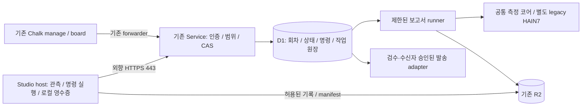

# 강사·플랫폼 관리자 콘솔 요구사항

상태: 채택한 구현 목표. 개별 완료 범위는 하단 구현표를 따른다.
검토일: 2026-09-07 · 추적: #732.
범위: Chalk 강사 콘솔, Service 운영자 콘솔, Studio 학생의 선택적 공유.
기존 [수업 작성 요구사항](chalk-authoring.md), [행동 계약](../studio-requirements.md)을 확장한다.
교육 에셋의 정의는 [seven-assets](../seven-assets.md)에 위임한다.

## 역할과 열람 경계

강사는 자기 코호트·프로필의 수업을 운영한다. 플랫폼 관리자는 기존 운영자 인증으로
계정·사용량·장애를 관리한다. 운영 권한 자체가 모든 대화 원문 접근 권한은 아니다.
기존 board는 계속 metadata-only이며 기존 studio-logs의 operator-only 계약도 유지한다.

공유 모드는 (1) 기본 운영 메타데이터 (2) 학생이 선택한 기록 공유
(3) 별도 동의·계약이 필요한 수업 관찰 모드로 구분한다.
기존 구현은 (2)이며 전체 세션 자동 수집이나 과거 로그 재공개를 포함하지 않는다.
2026-09-18 원격 운영·수집 확장 설계는 아래 별도 절에 있으며 아직 활성화하지 않았다.
관찰 모드는 구현 목표이고 아직 활성화하지 않는다. 아동 공유는 검증된 보호자 동의
계약이 마련되기 전 서버에서 거부한다. 기존 profile의 단순 동의 주장으로 해제하지 않는다.

## Acceptance requirements

| ID | 요구사항 및 관측 가능한 인수 기준 | 우선순위 |
|---|---|---|
| ADM-01 | 강사·학생·기수·수업을 초대·배정·종료한다. 서버가 역할·코호트·프로필 범위를 강제하며 다른 수업 데이터는 불변이다. | P0 |
| ADM-02 | 수업 전체 학생의 단계·최근 활동·제출·도움 요청을 표시한다. 명단 범위와 갱신 시각을 명시하며 무신호는 확인 불가로 표시한다. | P0 |
| ADM-03 | 공유 허용된 학생 프롬프트·응답·시각·수업 단계를 담당 강사가 조회한다. 학생에게 공유 대상·내용·기한이 보이며 수업 밖 기록은 제외한다. | P0 |
| ADM-04 | 질문에 연결된 도구 실행·오류·파일 변경 근거를 표시한다. 학생이 선택한 요약과 자동 관측 사실을 구분하며 비밀은 가린다. | P0 |
| ADM-05 | 학생이 특정 대화·결과물을 선택해 도움을 요청하고 강사가 피드백·다음 조치를 남긴다. 저장 충돌 시 입력을 보존하고 해결은 학생이 확인한다. | P0 |
| ADM-06 | 결과물과 변경 이유·검수 기록·도움 사용 범위를 함께 검토한다. URL을 서버가 임의 실행하거나 결과물 제출만으로 합격시키지 않는다. | P0 |
| ADM-07 | 담당자·코호트·프로필·기록별 공유 권한을 서버에서 검증한다. 열람 이력 기록 실패 시 원문을 내보내지 않고 철회·만료·폐기된 자격은 거부한다. | P0 |
| ADM-08 | 학생·수업별 요청·토큰·비용·오류를 표시하고 예산을 설정한다. 가격/사용량 미확인은 0으로 표시하지 않으며 동시 요청에도 정한 예산 정책을 지킨다. | P1 |
| ADM-09 | 반복 오류·긴 대기·미진행 신호와 판정 근거를 표시한다. 임계값은 검증 가능한 근거를 가지며 프롬프트 수로 능력 점수를 만들지 않는다. | P1 |
| ADM-10 | 권한 있는 강사가 참여 열기·닫기·새 실행 일시정지·재개를 수행한다. 적용 범위·실행 중 작업 영향·복구 방법을 확인하고 학생 파일을 보존한다. | P0 |
| ADM-11 | 강의·모델·도구·설정의 적용 버전과 변경 영향을 표시한다. 진행 수업을 조용히 바꾸지 않으며 서버의 정책 권한을 강의 문구로 확대하지 않는다. | P0 |
| ADM-12 | 기능 요청·장애를 수업과 연결해 접수하고 담당자·상태·분류·다음 조치·일정 또는 미정 사유를 관리한다. 요청자의 실제 해결 확인을 기록한다. | P1 |
| ADM-13 | 수업 종료 리포트에 완료·미완료·도움 사용·주요 오류와 근거·미측정 범위를 표시한다. 메타데이터 보고서에 대화 원문을 자동 포함하지 않는다. | P1 |
| ADM-14 | 공유 기록의 보관·열람 기한을 표시하고 학생의 철회·만료·삭제를 적용한다. 원문과 연결된 감사 기록의 삭제를 검사하며 기존 로그 정책을 변경하지 않는다. | P0 |

## 공유 계약 — hps-classroom-share/1

Service 소유의 별도 D1 테이블 `classroom_shares`, `classroom_share_audit`를 사용한다.
Chalk는 HTTP 전달과 표시만 맡으며 KV/D1/R2에 직접 쓰지 않는다.

- 학생: `/v1/classroom/shares` GET/POST, `/:id` DELETE, `/:id/confirm` POST, `/:id/audit` GET.
- 강사: `/admin/cohorts/:cohort/classroom/shares` GET, `/:id` GET/PUT.
- 신원은 검증된 토큰에서 가져온다. 학생 입력의 수업·학생 ID로 덮어쓰지 않는다.
- 제출은 열린 동일 프로필 수업의 명단에 있는 성인 학생만 가능하다. 읽기·철회·확인은 수업 종료 후에도 토큰 유효 기간 안에서 가능하다.
- 수신 강사 ID를 학생이 명시한다. 강사는 토큰의 subject와 정확히 일치하는 수신 기록만 읽는다. 같은 코호트의 다른 강사도 접근할 수 없다.
- 공유 필드: prompt, response, tool_summary, artifact_url, verification. 학생이 선택해 붙여넣은 기록이며 자동 검증된 실행 로그가 아니다.
- 열람 기한은 학생 선택 5분~24시간과 학생 토큰 만료 중 이른 시각이다. UI 기본값 1시간. 서버 읽기는 만료 즉시 차단하고 기존 15분 cron에서 새 공유 테이블의 만료 행만 삭제한다. cron 실패는 로그에 남기며 물리 삭제 시각을 만료 시각과 동일하다고 표현하지 않는다.
- 삭제는 자기 공유만 가능하며 연결된 감사 기록도 삭제한다. 이미 보거나 내려받은 사본은 회수할 수 없다고 안내한다.
- 요청 ID는 중복 제출을 식별한다. 동일 ID의 다른 내용은 409. feedback은 revision CAS. 강사는 answered까지, 학생만 resolved로 전이시킨다.
- 원문 목록 조회는 없다. 강사 목록은 메타데이터이며 개별 열람 시 감사 쓰기 성공 후 내용을 반환한다. API는 no-store, 클라이언트 토큰은 메모리 전용이다.
- 자동 관찰·학생 파일 원격 수정·아동 동의·전체 세션 보존은 이 계약으로 허용하지 않는다.

## 구현 범위와 후속 작업

| 요구사항 | 이 변경의 범위 | 남은 인수 기준 |
|---|---|---|
| ADM-01 | 기존 console/issuer 진입 재사용 | 통합 명단 편집·배정 및 전체 권한별 실기 검증 |
| ADM-02 | 기존 board 기반 관리 화면, 전체 명단 범위 경고, 공유 요청 목록 | 강의 단계·제출 상태를 수업 설계 버전과 연결 |
| ADM-03/04 | 성인 학생의 선택적 프롬프트·응답·실행 요약 공유 | Studio 안의 선택 UI, 원래 턴/도구 ID 연결, 별도 관찰 모드 |
| ADM-05/07/14 | 공유·피드백·학생 해결 확인·권한·열람 이력·철회·만료 API | 실제 기기/운영 D1 검증, 계정 만료 후 삭제 지원 운영 절차 |
| ADM-06 | 결과물 URL·검수 기록 제출 | 도움 사용 범위의 구조화된 평가와 위치별 피드백 |
| ADM-08 | 기존 운영자 사용량 페이지 유지 | 강사용 비용 집계·예산 정책과 동시성 검증 |
| ADM-09 | 기존 보드의 검증된 상태·임계값 재사용 | 새 신호의 근거 데이터 및 오탐 평가 |
| ADM-10 | 기존 수업 열기·종료로 연결 | 강사용 일시정지 범위/진행 작업 보존 계약 |
| ADM-11 | 기존 authoring 버전 화면 연결 | 진행 수업·모델·도구 고정 및 변경 영향 |
| ADM-12 | 기존 GitHub 요청 초안 유지 | 실제 내부 접수 큐·담당·상태·해결 확인 |
| ADM-13 | 메타데이터 JSON 내려받기 | 강의 단계·독립 과제 평가와 연결된 종료 리포트 |

표의 구현 범위는 전체 ADM 합격을 의미하지 않는다. [테스트 계획](../testing/classroom-admin.md)과
[디자인 요구사항](classroom-design.md)을 함께 검토한다. 전면 자동 모니터링은 이 기능과 별도다.

## 출시·제거

마이그레이션 0003은 기존 테이블을 수정하지 않는 추가 스키마다. 운영 적용은 기존
deploy-worker의 live-session freeze를 통과한 뒤 정확한 파일만 적용한다. Service 배포와
Chalk 배포는 별도이며 웹 PRD 배포를 제품 API 배포로 세지 않는다.
롤백 시 두 라우트 mount와 두 HTML 진입을 제거하고 신규 기록 제출을 닫는다.
이미 수집한 신규 공유 데이터는 정해진 만료 정리를 유지한 뒤 테이블 제거를 별도 결정한다.
기존 session logs, board, instructor authorization을 삭제·완화하지 않는다.

## 원격 수업 운영 확장 설계 · 2026-09-18

상태: **설계 채택 · R0~R7 구현 + 2026-09-19 독립 검토 결함(F1~F7) 수정·미완 기능 보강 · 운영 비활성**(2026-09-19, 아래 ‘검토 반영으로 확정한 계약’). 구현은 전역 스위치 `HPS_CLASSROOM_OPS`와 회차별 flag 5개가 모두 기본 OFF이며 production에는 설정·migration·발신 계정 어느 것도 적용하지 않았다. 실행된 검증과 NOT RUN 범위는 [테스트 문서의 실행 기록](../testing/classroom-admin.md#원격-운영-실행-기록)이 정본이다. 위의 기존 공유 구현과 구분한다. 원격 관제·일괄 수집·보고서 발송은 이 문서나 코드 병합만으로 켜지지 않는다. 기준 소스는 `75fe6e46f1a47c43ec3db6276b4b690abf5c0e2a`(2026-09-16 main), 조사일은 2026-09-18이다. 기존 E5 [#751](https://github.com/jayleekr/hypeproof-studio/issues/751), 콘솔 [#732](https://github.com/jayleekr/hypeproof-studio/issues/732), 복구 #673, 세션 #647, 공통 측정 #1020에 연결한다. 새로운 독립 제품·별도 인증 체계를 만들지 않는다.

### 목표와 범위

강사가 수업 중 자리를 돌아다니지 않고 **누가 들어오지 못했는지 → 어느 단계에서 무엇 때문에 막혔는지 → 어떤 조치가 실제로 끝났는지** 확인한다. 종료 시 하나의 배치에서 기록 회수·평가 초안·검수·발송까지 추적한다. 운영 성공은 학습 효과와 별도로 측정한다.

Product Intent의 최소 개입, 사람의 판단 보존, 근거 우선에 따른다. 원격 조치는 학습자의 판단이나 결과물을 대신 완성하지 않는다. 기존 ADM-01~14를 아래 세부 계약으로 확장하며 새 점수 체계를 만들지 않는다.

| 사용자 요구 | 기존 요구와 확장 | 인수 근거 |
|---|---|---|
| 토큰 발급부터 활성화 확인 | ADM-01/02/07/11: 등록·발급·검증·수업 진입·런타임 준비를 각각 표시 | AT-15/16/23 |
| 각 학생의 현재 단계와 빨간 오류 | ADM-02/04/09: 수업 버전에 연결된 단계, 오류 원인, 마지막 신호와 관측 범위 | AT-17/18/25 |
| 원격으로 초기화·문제 해결 | ADM-05/07/10: 허용 명령·대상 사전조건·보존·결과 영수증 | AT-19~24 |
| 한 번에 프롬프트 수집·평가지 생성·전달 | ADM-03/06/07/13/14: 권한 있는 수집 배치, 검증된 입력, 개별 평가/수신자/발송 상태 | AT-26~31 |
| 기존 프로그램 정상 작동 | ADM-08/11: 구버전 호환·관제 장애 격리·단계 배포·회귀 검증 | AT-24/25/32~34 |

P0는 Studio 앱의 상태와 제한된 조치를 다룬다. 전체 PC 화면 썸네일, 키보드·마우스 탈취, OS 재부팅, 임의 셸·파일 원격 수정은 P2 선택 기능이다. 앱이 설치되지 않았거나 extension host가 죽은 PC는 이 채널로 복구할 수 없다. 보드에 현장 조치 필요를 표시하고, 학교가 이미 운용하는 원격 지원 도구를 별도 절차로 이용한다.

### 기존 구현에서 출발할 지점

| 현재 소스 | 확인한 동작 | 확장 지점 / 지켜야 할 경계 |
|---|---|---|
| `chalk/src/routes/board.ts`, `src/lib/board-verdict.ts`, `src/ui/board.html`, `manage.html` | 10초 polling, 명단·호출·대기·무신호, metadata-only | 동일 화면의 학생 행/상세 패널 확장. 원문 미리보기를 보드에 넣지 않음 |
| `worker/src/lib/instructor-auth.ts`, `tokens.ts`, `routes/admin.ts` | issuer scope, 발급·명단·수업 열기/종료. pause는 현재 일반 issuer 허용 목록에 없음 | 기존 검증기를 재사용하고 명시적인 operations capability를 추가. 기존 issuer 전체에 새 권한 자동 부여 금지 |
| `extensions/hypeproof-chat/src/heartbeat.ts`, `chatPanelProvider.ts`; `worker/src/routes/trace.ts`, `lib/liveness.ts` | 45초 heartbeat, 서버 시각·idle 관측, KV 900초 TTL. 기존 trace는 활성 수업·명단 gate를 거침 | 수업 전 연결 진단과 정밀 명령에는 별도 operations 경로가 필요. 기존 trace 응답 성공은 저장·명령 완료 증거가 아님 |
| `activityConnections.ts`, `worker/src/lib/lesson-delivery.ts`, `modules.ts` | 활동 신원·작업 폴더·수업 설정/버전 전달 | 활동·수업 실행·앱 실행 ID를 분리하고 확정 수업 버전의 step ID에 단계 이벤트 연결 |
| `sessionSpool.ts`, `spoolUploader.ts`, `extension.ts`; `worker/src/routes/logs.ts` | 로컬 스풀, 본인 세션만 전송, manifest, 수동 업로드·재기동 안내·갤러리 시점 snapshot | 자동 수집은 새 고지/권한 계약으로 구현. 진행 snapshot과 완결 manifest를 혼동하지 않음 |
| `chalk/src/routes/logs-admin.ts` | 로그 도착 메타데이터, 원문 operator-only | 강사 원격 수집 요청이 원문 조회 권한을 부여하지 않음 |
| `chatPanelProvider.ts:clearHistory()` | 로컬 확인 후 대화를 지우는 동작. 활성 작업 중 거부 | 원격 초기화에서 직접 호출하지 않음. 작업 보존형 runtime reset을 별도로 구현 |
| `worker/src/lib/measurement-core/`, `packages/measurement/`, `skills/hain7-report/` | 공통 관찰/근거/해석 코어, host package, legacy HAIN7 보고서 | 신·구 평가 모델을 분리해 재사용. 자동 발송 어댑터는 미구현 |

소스 구현, 실제 설치 버전, 운영 활성화는 다른 상태다. GitHub 최신 release API는 `measurement-v0.3.1`을 반환하지만 데스크톱 앱 release는 별도로 `v0.1.56`이다(2026-09-18 확인). extension `package.json`의 `0.1.5`만으로 설치 앱 기능을 판단하지 말고 App release/build hash·extension hash·operations protocol/capability를 보고한다.

### 실수업·장애 근거와 해석

수업 기록의 분석 단위는 class run이다. 누적 cohort 명단·발급 좌석·실제 출석·로그 도착·보고서 수신자는 서로 다른 모수다. 도착 로그만 보면 시작조차 못한 학생을 놓친다. 과거 오류가 현재도 발생한다고 단정하지 않고, 코드 수정 여부와 실기 인수 여부를 나눈다.

| 근거 집합 | 재집계 결과 | 원격 운영에 필요한 개선 |
|---|---|---|
| 실제 오전 D1 고정본 `chalk/test/fixtures/session-2026-08-22.json` | 2,928 호출행 / 명단 15좌석 / 관측 13좌석. 2좌석은 0행. 정상9·quiet2·stuck1·미접속 라벨2·중도이탈1 | 호출한 학생만 보여주지 않음. 등록/검증/진입 단계와 생존 신호를 따로 수집. 0행의 원인을 토큰 오류로 단정하지 않음 |
| 같은 D1 고정본 | status 전부 200, latency 중앙값 4.996초·최대283.525초 | 과거 #684가 실패행 누락/200 상수였으므로 서버 오류율 산출 불가. 최신 소스는 실패 상태 기록을 보완했으며 이번 Worker 회귀 통과. 운영 배포/신호 적용 시점은 미확인 |
| 기존 `chalk/README.md`의 2026-09-03 R2 도착 조사 + fixture 라벨 교차 | 오전 9/15 도착, 6누락 중 정상1·quiet1·stuck1·미접속2·중도이탈1 | 수동 전송만으로는 장애/이탈 집단의 증거가 빠짐. 현재 R2를 새로 조회한 수치가 아니라 저장소의 당시 조사 기록. 회수 불가도 배치 명단에 남김 |
| 로컬 비공개 Supabase mirror 회수본(8/22 하루, 오전·오후 포함) | 22개 가명 사용자·34개 앱 세션·11,791 이벤트. prompt991/response971/turn_end985. 종료 ok932/aborted51/error2(stall) | 취소와 오류, 미완 턴을 구분. 응답/end 두 이벤트의 오류를 두 번 집계하지 않음. 수집된 사용자만의 집합이며 오전15명/공식21명과 모수가 다름 |
| 같은 회수본의 연속성 | prompt만 있는 턴6. 10/22 사용자가 2~3세션, 추가 세션12 | app_instance/previous_session/종료 사유/seq/receipt 필요. 다중 세션을 crash12회 또는 네트워크 재접속12회라고 부르지 않음 |
| manifest 대조 | meta34/manifest34/events33. 33세션 byte·SHA-256 일치, 1세션 선언 events 결손. 그 사용자는 공식21명 병합 대상 밖 | manifest 존재≠완결. 해당 R2 정본까지 없는지 미확인. 현재 mirror가 best-effort라 미러 누락 가능성은 가설. 입력 complete 검증과 source별 상태 분리 |
| 비공개 공식 보고서/검수표 | 공식21명 PDF·병합 대응, 비발송 참고1. 2부13명×28marker 검수 기록. 실제 메일 전달/반송 미확인 | 생성/검수/예약/전송/전달을 별도 상태로. 고객 원본 명단을 수신자 정본으로 유지 |
| 현재 `reportProblem.ts` | `REPORT_VERSION="0.1.2"` 상수, extension package `0.1.5`와 불일치 | R1에서 실제 package/build 버전과 신고 메타를 연결. 신고가 없다고 오류가 없었다고 읽지 않음 |

재현: 원본과 파생본은 운영자의 로컬 비공개 보관함에만 있으며 그 경로는 저장소에 남기지 않는다. repository에는 원문·학생별 식별자·연락처·평가값을 복제하지 않았다. 고정 파일명만 순회해 event type/turn_id/status/시각과 manifest byte/hash를 집계했고, 본문을 화면에 출력하거나 실행하지 않았다. 로컬 인수인계용 재현 스크립트·집계 JSON은 Git 비추적 metadata의 `remote-classroom-evidence/`에 보존한다. 다른 기기에서는 원본 접근 권한이 있어야 재집계 가능하다.

D1 fixture SHA-256: `4e20b7bc59d5d7356f5c5288b90e49cadd64f53266096b4a532b40fd838d5952`.

기존 보드의 idle/평균대기 임계값은 `chalk/src/lib/board-verdict.ts`의 실수업 라벨 replay에서 유도됐다. 같은 파일은 정상 라벨에서도 75분간 약5개의 quiet 경보가 발생했음을 기록한다. 고정 임계값을 새 수업/교육 방식에 무조건 적용하지 않으며 교사 휴식·읽는 시간·승인대기를 반영해 오탐을 측정한다. 과거의 실제 장애, 현재 소스 수정, 아직 실행하지 않은 실기 인수는 별개의 증거다.

### 비교 조사와 선택 근거

학교·PC방 관리 프로그램에서 가져올 것은 전체 좌석판, 여러 대상 선택, 준비 상태, 도움 요청, 조치 결과, 파일 회수라는 운영 흐름이다. 데스크톱 영상을 수집해도 Studio의 토큰·단계·보고서 완결 여부는 알 수 없으므로 앱 이벤트가 정본이어야 한다.

공식 자료에서 작동 구조까지 확인한 것은 A, 공식 소개·FAQ에서 기능 존재만 확인한 것은 B, 미공개는 확인 불가로 구분했다. 모두 2026-09-18 조회. 상용 견적을 추정하거나 도입·설치하지 않았다.

| 사례 | 확인한 구조·특징 | Studio에 연결할 원칙 / 선택 |
|---|---|---|
| [Veyon GitHub](https://github.com/veyon/veyon), [구조](https://docs.veyon.io/en/latest/admin/introduction.html), [접근 제어](https://docs.veyon.io/en/latest/admin/configuration.html) — A | 교사 Master→학생 Service/Server, VNC 화면, 인증 후 접근 규칙; Windows/Linux, GPL-2.0 | 전체 좌석·보기/제어 분리·기기별 사유. 같은 LAN 컴퓨터실의 별도 지원 도구 후보이며 Studio에 코드를 섞어 배포하지 않음 |
| NetSupport School [구성](https://help.netsupportschool.com/en-windows/Content/Windows/Installation/select_installation_type.html), [학생 승인](https://help.netsupportschool.com/en-windows/Content/Windows/Settings/student_security_settings.html), [Journal](https://help.netsupportschool.com/en-windows/Content/Windows/Using-tutor/student_journal.html) — A | Student/Tutor/Tech Console, 선택 Gateway, 수업용·IT용 권한 분리, 학생별 수업 PDF | 강사 허용 조치와 고권한 장비 관리 분리. 보고서에 출석/과정/부분 기록 포함. 장치 단위 견적제여서 기존 설치가 있을 때 활용 |
| LanSchool [Classic setup](https://helpdesk.lanschool.com/portal/en/kb/articles/lanschool-classic-setup-guide), [원격제어](https://helpdesk.lanschool.com/portal/en/kb/articles/remote-controlling-student-devices), [Air](https://lanschool.com/solutions/lanschool-air) — A/B | Classic의 Teacher/Student와 LCS, Air의 클라우드 교실. Classic 원격입력과 Air 모니터링은 같은 기능 범위가 아님 | 수업별 그룹·재연결·마지막 관측 시각. 인터넷/BYOD와 관리 LAN을 구분. Air 원격 키보드·마우스 지원은 확인 불가 |
| [게토](https://www.geto.co.kr/Product/program), [피카 FAQ](https://www.pcbang.com/_support/faq.jsp), [피카AI](https://www.pcbang.com/_picaAI/picaAI.jsp) — B | 카운터/손님 PC 구분, 좌석·다매장·이상징후·복구/운영 보고서 | 좌석 상태판·선택/전체 조치·장애 처리 이력 UX 참고. 화면 프로토콜/암호화/권한·정확한 가격은 공개 확인 불가이므로 기술 기반으로 채택하지 않음 |
| [MeshCentral GitHub](https://github.com/Ylianst/MeshCentral), [공식 문서](https://docs.meshcentral.com/meshcentral/) — A | outbound agent/web 관리, 데스크톱·터미널·파일, Apache-2.0 | 기관 소유 장치의 별도 비상 지원 후보. MFA/장비 그룹/시간 제한/동의 필요. 고권한 agent를 P0에 번들하지 않음 |
| [RustDesk server](https://github.com/rustdesk/rustdesk-server), [구조·OSS/Pro](https://rustdesk.com/docs/en/self-host/) — A | hbbs rendezvous/ID, hbbr relay, NAT 직접 연결 실패 시 릴레이; AGPL-3.0 | 일대일 화면 지원 후보. 중앙 장비 관리·SSO 등 Pro 차이, 릴레이 운영비와 재배포 조건 검토. 자체 앱 이벤트를 대체하지 못함 |
| [Apache Guacamole](https://guacamole.apache.org/doc/gug/guacamole-architecture.html), [GitHub](https://github.com/apache/guacamole-client) — A | 브라우저→웹 게이트웨이→guacd→RDP/VNC/SSH, Apache-2.0 | 이미 기관 VPN/RDP/VNC가 있는 경우. NAT 뒤 개인 PC 접근 경로까지 자동 해결하지 않아 신규 도입 우선순위 낮음 |

[NetSupport 견적](https://www.netsupportschool.com/pricing/), [LanSchool 구매](https://lanschool.com/purchasing)는 금액 비공개, Veyon core는 무료지만 [애드온](https://veyon.io/en/addons/)은 유료다. 오픈소스도 설치·업데이트·권한 관리·릴레이 대역폭 비용은 남는다. 라이선스 표시는 저장소 기준이며 복사/수정/번들 배포 전에 해당 버전 조건을 확인한다.

선택 결론: **P0는 기존 App extension·Chalk·Service, 외부 화면 도구 도입 없음.** 원격 상태만으로 해결하지 못한 장애 비율과 현장 지원 시간을 첫 3회 수업에서 기록하고, 기존 학교 도구가 있는지 먼저 확인한 뒤 P2를 선택한다.

### 화면과 상태 계약

기존 `/manage`를 운영 진입점으로 유지한다. 상단은 선택 수업/버전·연결 시각·전체 명단·도움 필요/연결 미확인/기록 미도착 수, 본문은 학생 행, 오른쪽은 선택 학생의 근거와 허용 조치다. 첫 운영 버튼은 `준비 확인`, 수업 중은 `도움 필요한 학생`, 종료는 `수업 마무리`다. 매번 모든 화면을 보여주는 대형 관제 화면을 새로 만들지 않는다.

학생 행: `좌석/가명 · 입장 상태 · 현재 단계 · 수행 상태 · 마지막 신호 · 오류 원인 · 조치 상태 · 기록 도착`. 기본 보드에는 프롬프트·파일명·파일 본문·토큰을 넣지 않는다. 공유 원문은 기존 개별 열람·감사 계약 안의 별도 화면에서만 연다.

- 입장: `미등록 → 기기 연결 → 토큰 발급 → 앱에서 검증 → 수업 진입 → 준비 완료`. 발급 성공을 활성화로 표시하지 않는다. 토큰 원문 없이 발급 ID/만료·검증 결과만 표시한다.
- 단계: 확정 `lesson_version/step_id`와 `not_started/in_progress/submitted/reviewed`를 보고한다. 강의형·자유 과제는 단계 없음/자유 활동도 유효하다. 채팅 횟수, 창을 연 것, AI의 “완료” 발언으로 단계 완료를 추론하지 않는다.
- 수행: `idle/running/waiting_approval/waiting_user/error`와 관측 시각·출처를 분리한다. `waiting_approval`은 AI 실패가 아니다.
- 빨간색: 확인된 blocking error/실패한 명령. 반드시 짧은 한글 사유와 조치 버튼을 함께 표시한다. 긴 대기·조용한 학생은 주의 색, 오래된/없는 신호는 회색 `확인 불가`다. idle만으로 빨간 실패 판정하지 않는다.
- 오류 분류: 인증 거부, 수업 미개설/프로필 불일치/명단 누락, 비용 한도, 공급자 rate limit/5xx, 네트워크, SDK/도구 준비, 승인 대기, 검수 오류, 기록 전송, 미확인. HTTP 401만으로 토큰 만료를 단정하지 않는다. 안전한 코드·request ID·다음 행동만 노출한다.
- 여러 학생 같은 공급자 오류는 공통 장애 1건과 영향 인원으로 묶고, 개별 PC 초기화를 기본 추천하지 않는다. 수업 일시정지와 학교 휴식은 시간 기반 경보에 반영한다.
- bulk 선택은 전 좌석/현재 필터/선택 좌석의 차이를 보여준다. 명령별 가능·미지원·오프라인을 미리 산출하고 `23 성공 / 2 실패 / 5 확인 불가`처럼 결과를 남긴다. 제출·접수·완료를 한 체크 표시로 합치지 않는다.

### 신원과 수업 실행 계약

기존 cohort/profile/token/authoring를 정본으로 쓴다. `class_run_id`는 기존 `sessions.session_id`에 1:1 연결한 회차 ID다. 같은 cohort의 누적 roster를 재사용하되 새 `class_run_seats`는 **그 수업 명단의 불변 snapshot + 명시적 변경 revision**이다. 별도 학생 계정을 만들지 않는다. 좌석과 학생의 연결이 바뀌면 이력을 남기고 이전 학생 기록/명령을 새 사용자에게 넘기지 않는다.

토큰 입력 전 PC까지 확인하려면 먼저 연결이 필요하다. 강사가 기존 인증으로 회차·좌석에 묶인 일회용 pairing ticket을 발급하고 앱에서 입력/스캔한다(관리형 교실은 사전 등록). ticket은 제안 기본 10분·1회, 상태 보고/본인 명령 확인만 허용하며 AI·로그 원문 접근 권한이 없다. 미등록 PC는 보드에서 `등록 안 됨`이며 설치·방화벽 문제 원인은 아직 모른다. 익명 ping으로 학생 신원을 추정하지 않는다.

등록 후 operations connection은 기존 Service 서명/검증기로 발급한 별도 좁은 capability다. 학습 토큰이 거부돼도 안전한 진단은 가능하되 토큰 복구가 학생 자격·명단·동의를 우회하지 못한다. `cohort, profile, class_run, seat, device_registration, activity, connection_epoch`를 서버가 바인딩한다. machine GUID/MAC/사용자 OS 계정 같은 영구 지문을 수집할 필요가 없다. 공용 PC는 무작위 등록 ID와 활동별 연결을 사용한다.

- 동시에 열린 창은 `app_instance_id/boot_id`를 나눈다. 회차·좌석·activity별 실행 lease의 owner인 창만 변경 명령을 실행한다. 다른 창은 관측만 가능하다.
- 학생 토큰 재발급/회차 변경/기기 교체 때 epoch 증가, 옛 capability/명령·lease 무효화. 공유 PC 로그 회수는 원 소유자·회차·consent grant가 일치해야 한다.
- 권한: 강사는 배정 회차와 허용 action, 학생은 본인 상태/조치 고지/거절·중지, 운영자는 기존 운영 경로, 보고서 실행기는 특정 batch/job만. 운영자 자격을 학생 앱/Chalk에 전달하지 않는다.
- 새 grant와 명령 authority는 D1 primary에서 검사한다. 기존 token/issuer KV revocation만으로 즉시 폐기를 보장하지 않는다. operations credential은 중앙 `ops_grants` 상태·revision/만료·상위 issuer 폐기 연결을 매 poll/claim/ack/실행 직전 재검사한다. 폐기 endpoint는 새 operations grant 무효화와 원장 commit까지 성공해야 폐기 완료로 응답한다.
- 새 권한은 opt-in이다. metadata도 개인과 연결될 수 있으므로 metadata-only를 무조건 동의 불필요라는 법률 결론으로 사용하지 않는다.

### 전송·저장·비용을 줄이는 구조

**첫 구현은 기존 HTTPS polling.** 새 `/v1/classroom/ops/sync`가 상태 차이·receipt를 받고 본인에게 유효한 명령만 반환한다. 수업 중 5초(±20% jitter), 준비 30초, 종료 60초를 잠정값으로 두고 Service가 범위 안에서 설정한다. fetch timeout 4초, single-flight, backoff 5→10→20→60초. 401은 연결 재검증, 403은 reason별 처리, 429는 Retry-After. 학교망에서 외향 443만 필요하며 인바운드 포트·학생 PC 서버·VNC를 추가하지 않는다.

새 기능을 협상한 클라이언트는 45초의 기존 생존 신호를 sync에 합쳐 중복 heartbeat를 끈다. 변화가 없으면 큰 상태 본문·DB 상태 쓰기를 생략한다. 오류/단계/명령 결과는 다음 sync 또는 즉시 전송한다. 기존 `/trace/event`와 기존 앱 경로는 계속 지원한다. 관제 전송은 학습 요청을 기다리게 하지 않으며 제한된 큐와 로그만 가진다.

D1은 명령·최신 상태·회차 명단·receipt의 정본, R2는 허용된 원본·보고서, 기존 KV liveness는 구버전 호환 표시용이다. KV는 다른 위치에 쓰기 반영이 60초 이상 늦을 수 있고 원자 연산에 부적합하므로 즉시 중지/명령 성공의 근거로 쓰지 않는다([공식 일관성 설명](https://developers.cloudflare.com/kv/concepts/how-kv-works/)). 새 status/claim/authorization은 D1 primary 읽기, read replication 도입 시 Sessions API/bookmark로 적어도 읽기 후 쓰기 일관성을 확보한다([D1 설명](https://developers.cloudflare.com/d1/best-practices/read-replication/)).

추가 스키마 후보는 `class_run_seats`, `ops_grants`, `ops_device_connections`, `ops_latest_state`, `ops_commands`, `ops_command_receipts`, `ops_audit`, `classroom_report_jobs`, `classroom_report_deliveries`, `classroom_job_outbox`다. 기존 auth/session/access/usage 테이블과 동일 정보를 다시 소유하지 않는다. `usage_jobs`는 과금 원장이므로 보고서 작업 큐로 전용하지 않는다. 구현 전 기존 schema와 비교해 필요한 테이블만 추가한다. migration 번호는 착수 당시 다음 번호로 정하고 적용된 파일은 수정하지 않는다. `schema.sql` fresh 설치와 migration 누적 결과를 비교한다.

조회는 수업별 한 번의 명단+최신 상태 join, command는 `(class_run_id, seat_id, state, expires_at)` 인덱스, scope/고유키를 필수화한다. 기존 보드의 학생별 KV 조회와 누적 roster scan을 새 코드로 복제하지 않는다. 상태·명령 기록은 요금 `usage_log`에 넣지 않는다. 고빈도 정상 신호는 latest row에 합치고 단계/오류/조치 전이만 audit에 남긴다. 목적·보존 기간은 기존 정책과 별도로 운영자가 확정하기 전 production 수집을 켜지 않는다.

DO/WebSocket은 P0 선행 조건이 아니다. 100명 실측에서 polling 목표를 넘거나 동시 강사·반 수 증가로 DB가 병목이면 수업별 DO Hibernation+WS를 도입하고 HTTPS fallback을 유지한다. 전달 채널만 바뀌며 아래 idempotency/epoch/receipt 계약은 동일하다. 기존 KV 상태와 새 원장 사이에 양방향 정본을 만들지 않는다. [WS hibernation](https://developers.cloudflare.com/durable-objects/best-practices/websockets/)과 [Queues at-least-once](https://developers.cloudflare.com/queues/reference/delivery-guarantees/)를 참고하되 새 서비스는 필요가 측정될 때만 추가한다.

### API와 사건의 경계

아래 경로는 **제안 계약**이다. 기존 routes/forwarder/registry 안에 추가하고 새로운 인증 서버나 root API namespace를 만들지 않는다.

| 경로·역할 | 입력/출력 핵심 | 실패 계약 |
|---|---|---|
| `POST /admin/cohorts/:cohort/classroom/runs/:run/pairings` 강사 | 명단 좌석·revision → 1회 pairing ticket | 타 수업/권한 없음 거부, ticket/학생 token 로그 금지 |
| `POST /v1/classroom/ops/connect` 앱 | pairing ticket·무작위 instance → 좁은 grant·epoch·protocol capabilities | ticket 재사용/만료/서명/배정 불일치 거부 |
| `POST /v1/classroom/ops/sync` 앱 | sequence·bounded observations·receipts → ack cursor·본인 명령·poll_after_ms | body/배치 상한, 권한·revocation·schema 실패, 저장 실패면 ack 안 함 |
| `GET /admin/cohorts/:cohort/classroom/runs/:run/status` 강사 | run snapshot/last-seen/revision/source freshness | no-store, 타 scope 거부, 부분 데이터 explicit |
| `POST .../runs/:run/commands` 강사 | targets·action·expected_revision·idempotency key | 202 queued, 409 revision/payload 충돌, 제한량 초과 429 |
| `GET .../runs/:run/commands/:id` 강사 | 각 대상 상태·receipt·기한 | 모든 대상 완료 전 bulk 성공 금지 |
| `POST .../runs/:run/report-batches` 강사 | roster/input/policy revision·dry_run → batch ID | 정책 미비는 대상별 hold; 실행권한 없음은 전체 거부 |
| `POST .../report-batches/:id/approve` 검수 권한 | report/recipient/template/policy hash와 승인 범위 | 변경된 입력/수신자 409, 승인자/범위 audit |
| `POST .../report-batches/:id/deliver` 발송 권한 | 승인 revision·idempotency key | live account 미설정/승인 만료 차단, dry-run은 외부 send 0 |

`...`는 위와 같은 `/admin/cohorts/:cohort/classroom` prefix다. 별도 runner claim/result도 이 Service의 job별 capability 경계를 사용하고 Chalk는 forwarding만 한다. command receipt는 `/ops/sync`를 통해 반환하며 실제 action 성공과 observation fresh 상태를 각각 노출한다.

관측 envelope는 `schema_version, event_id, class_run_id, activity_id, app_instance_id, boot_id, seq, observed_at, kind, bounded_payload`다. 서버가 identity·received_at을 추가한다. 종류는 activation/step/runtime/error/upload/command_result로 allowlist, raw prompt/stack/filename을 허용하지 않는다. actor는 human/AI/tool/operator/system/unknown을 보존한다. `(grant_id, boot_id, seq)` unique와 payload hash로 재전송을 대조하며 같은 seq의 다른 payload는 격리한다. ack는 highest **contiguous** seq와 missing ranges, 최신 상태는 단조 revision으로 갱신한다. 역순 수신을 최신으로 덮지 않는다.

로컬 outbox는 수업·학생 단위 분리, 재기동에도 유지, bounded batch(초기 100 events/64KiB 제안), 중요한 전이/receipt는 ack 전 삭제하지 않는다. 정상 heartbeat는 durable event seq를 소비하지 않는 별도 latest-state 샘플이며, 합쳐 보낼 때 durable seq에 구멍을 만들지 않는다. 오래된 정상 heartbeat만 합칠 수 있고 축약 여부를 표시한다. seq gap이 있는 로그를 완전 평가 입력으로 승격하지 않는다. 큐 상한에 닿으면 원본을 조용히 버리지 않고 관측 중단/누락 범위와 현장 조치를 알린다.

### 명령·초기화의 정확성

허용 action의 서버·클라이언트 schema를 공유하고 버전으로 고정한다. 임의 shell, URL 다운로드 후 실행, 임의 VS Code command, 파일 경로는 받지 않는다. 새 명령을 모르는 앱은 `unsupported`로 답한다.

| 조치 | 전제·보존 | 성공 근거 |
|---|---|---|
| `refresh_connection` | 현재 activity/회차 유지. 재발급은 기존 발급 권한·범위·예산 한도 재검사. 토큰은 해당 기기에만 전달하고 원장에 기록하지 않음 | 새 profile 검증과 runtime probe 완료; 발급만으로 성공 아님 |
| `retry_diagnostics` | 허용된 메타데이터만. 원문·shell 없음 | bounded probe 결과 코드와 발생 시각 |
| `restart_preview` | 기존 해당 activity preview만 재연결. 파일 변경 없음 | 같은 artifact revision의 로컬 HTTP/preview 상태 확인 |
| `cancel_current_run` | 본인 runtime abort와 pending tool 종료 확인. 이미 일어난 외부 효과는 되돌리지 않음 | abort 요청/실제 종료를 분리. 종료 미확인이면 다음 실행 차단 |
| `reset_runtime` | 1명씩 기본. 입력 동결→현재 작업 중지 확인→대화·draft·활동 binding·스풀 durable 보존→새 execution generation 생성→동일 파일로 runtime 재연결 | 보존 manifest와 이전/새 generation·profile probe. 저장/중지 실패는 실행 거부 |
| `retry_evidence_upload` | 해당 학생·회차의 유효한 수집 grant, immutable snapshot만 | 서버의 검증된 manifest receipt |
| `pause_new_runs` / `resume_new_runs` | 회차 운영 권한. 서버 admission + 앱 tool admission에 적용; 진행 중 요청은 별도 취소 선택 | 서버 적용 revision과 기기별 적용/미지원/미확인 구분 |

`reset_runtime`은 `clearHistory`/워크스페이스 삭제/자격 초기화/PC 재부팅이 아니다. 현재 `clearHistory()`는 되돌릴 수 없는 대화 삭제이므로 호출 금지. reset은 원래 대화·관찰 원본을 보존하고 새 실행 문맥으로 연결한다. 선택한 snapshot으로 파일을 되돌리는 기능은 #673의 별도 검증을 통과하기 전 명령 목록에 넣지 않는다. `hasActiveStream()`만 확인하고 외부 프로세스가 끝났다고 간주하지 않는다.

command envelope: `schema_version, command_id, idempotency_key, payload_hash, cohort/profile/class_run/seat/activity, device_registration_id, app_instance_id, expected_state_revision, connection_epoch, action, bounded_args, issued_by, reason_code, created_at, expires_at`. 서버는 인증 토큰에서 identity/scope를 채우며 클라이언트의 지정값은 권한을 확대하지 못한다. pending 명령은 유효 capability를 가진 대상 기기만 수신한다.

- `queued → leased → accepted → running → succeeded|failed|rejected|expired|cancelled|outcome_unknown`. HTTP 202는 queued일 뿐이다. 중간 상태와 최종 receipt를 구분한다.
- enqueue와 감사는 같은 DB transaction/batch에, 고유 idempotency key의 같은 payload는 기존 명령 반환, 다른 payload는 409. 강사 동시 조치에는 expected revision CAS와 회차·activity당 변경 명령 1개 lease를 적용한다.
- claim에는 lease generation을, 결과에는 command/epoch/generation을 포함한다. TTL 기본 120초, 실행 시간 상한은 action별. 다음 수업·다음 로그인에서 옛 명령은 실행하지 않는다. 클라이언트 시계 대신 Service가 준 deadline과 monotonic 경과 시간을 사용하며 실행 직전 서버에 재검증한다.
- 클라이언트는 실행 전에 로컬 영속 receipt journal을 기록한다. crash가 `실행 후 ack 전`에 나면 먼저 postcondition을 조회한다. 결과가 불명확하면 `outcome_unknown`으로 보류하고 destructive action을 자동 재실행하지 않는다. 네트워크에서 정확히 한 번 실행을 보장한다고 쓰지 않는다.
- 전송 취소는 실행 중 효과를 철회하지 않는다. offline·미지원·거절·만료는 각각 terminal reason, 상태 표시만 삭제하여 성공으로 바꾸지 않는다. 앱 종료 중에는 처리 중 reset receipt를 다음 시작 시 복구한다.
- 회차 pause의 즉시성을 기존 KV kill switch만으로 약속하지 않는다. 신규 operations 활성 회차의 chat/messages admission은 새 D1 control revision을 확인하고 SDK 로컬 tool admission도 짧은 실행 grant를 재검사한다. 확인 불가면 **새 외부/변경 실행만 제한**, 로컬 파일 열기·저장·Stop·내보내기는 유지한다. 이미 실행 중/구버전 앱의 미적용 범위를 명시한다.

### 수업 마무리: 수집·평가·발송

`수업 마무리` 한 번으로 같은 batch_id의 전체 흐름을 시작한다. 기본값은 **수집→초안 생성→검수 대기**다. 수신자·동의·평가·템플릿의 revision이 미리 승인돼 있으면 승인된 범위에서 발송까지 자동 진행할 수 있게 설계한다. 원클릭은 검수·권한을 생략한다는 뜻이 아니다. 이번 작업은 설계뿐이며 실제 로그 수집 권한·수신자·발송 승인을 생성하지 않는다.

1. **명단 고정:** 배치 입력은 class_run 명단 snapshot. 갤러리 카드/최근 로그 목록을 수신자 명단으로 사용하지 않는다. 같은 보호자에게 형제 2명이어도 child/report 단위는 별도다. 테스트 계정 제외는 운영자가 명시한 명단 기준이다.
2. **수집 승인:** `collect` 권한, 해당 회차·학생·목적·고지 version·유효기간과 필요한 보호자 동의 증빙을 Service가 확인한다. `analytics.upload_session_logs=true` 하나를 동의로 간주하지 않는다. 수집 불가 학생도 배치에 남기되 `consent_missing`으로 제외 사유를 표시한다. 기존 수동 경로는 계속 작동한다.
3. **회수:** 학생 기기에 본인 회차만 `retry_evidence_upload` 요청. 수업 중이면 immutable snapshot revision, 종료면 spool flush·seal 후 manifest. 급히 manifest를 쓰고 이후 로그를 잘라내지 않는다. 활성 파일이 변하면 새 revision, 같은 경로 덮어쓰기 snapshot을 평가 입력으로 사용하지 않는다. 원본 파일을 열어 실행하거나 HTML을 직접 렌더하지 않는다.
4. **완결 검증:** 서버가 허용 파일·owner/class run·size·sha256·event seq/누락을 확인한 후 manifest receipt를 발행한다. 파일 PUT 200이나 manifest 존재만으로 complete가 아니다. 기존 API와 다른 versioned envelope를 써 old upload 호환을 유지한다. legacy 로그에 seq가 없으면 만들어내지 않고 sequence_unavailable로 표시한다. 파일 무결성 verified와 행동 관측 coverage는 별도다. 검증된 legacy adapter는 기존 hash/turn 단위 검수로 처리하되 완전 수집 주장을 하지 않는다. snapshot→manifest→receipt→job enqueue 간 DB outbox로 재조정하며 R2 고아/DB 고아를 탐지한다.
5. **오프라인 회복:** 로컬 outbox를 다음 실행에서 재개. 수업 종료 후에도 유효한 **upload-only collection grant**가 있는 동안만 본인 지정 snapshot 업로드를 허용한다(기본 제안 종료 후 24시간, 운영 정책 확정 전 비활성). 학습 token 만료를 우회해 새 AI 실행/타 학생 원문을 허용하지 않는다. late arrival은 새 입력 revision이며 이미 승인/발송한 보고서를 조용히 바꾸지 않는다.
6. **평가:** `student + class_run + input_manifest_digest + capability_model/rubric/evaluator/renderer_revision`로 job 고유키. 신규 작업은 MC-17/19의 공통 코어·6개 후보 모델·근거 중심 서술이 기본이다. 기존 HAIN7 7축 보고서는 legacy 선택 모드로 격리해 기존 rubric·28 marker review·fingerprint·지면 QA를 유지한다. 7→6 점수 합산/이름 교체는 금지. 프롬프트만 수집된 경우 관측 한계를 표시하며 수량·길이로 능력을 평가하지 않는다.
7. **실행기:** P0/P1 파일럿은 관리자의 Mac에서 실행하는 제한된 batch runner가 Service에서 lease를 받아 처리한다. 기존 `packages/measurement`와 보고서 엔진을 호출하며 새 채점기를 복제하지 않는다. Python/폰트/PDF 실행을 일반 Workers JS 안에 넣지 않는다. runner는 1~2 동시 job, 메모리/시간/크기 한도, 원문 임시파일 제한, job별 권한·receipt·heartbeat를 가진다. Mac이 꺼지면 `runner_offline`이며 작업은 D1에 남는다. 무인 반복 운영이 필요하면 같은 worker interface를 별도 container/queue consumer로 옮긴다.
8. **검수:** `missing/partial/quarantined/draft/review_required/approved`를 구분한다. 로그 누락은 0점이 아니다. checksum 오류·아동 동의 미비·다른 학생 혼입·근거 ID 불일치·필수 review 누락·PDF 지면 실패는 개별 격리하고 나머지 학생을 계속 처리한다. 공통 코어가 제공하지 않는 서술 평가 모델은 기본 OFF; 운영자가 evaluator version/호출 한도를 정한 후 검수 가능한 초안만 생성한다.
9. **수신자:** 운영 원본 명단을 별도 승인된 recipient store로 가져온다. prompt/모델/갤러리에서 이메일·전화·보호자를 추론하지 않는다. 분석 JSON/PDF와 연락처를 분리. 검수자는 학생-보호자 매핑·보고서 hash·수신자 revision·채널·템플릿·만료·예상 과금을 확인한 batch approval을 남긴다. 이후 하나가 바뀌면 승인을 무효화한다.
10. **발송:** 기존 [delivery design](../../skills/hain7-report/references/delivery-options.md)의 adapter 경계를 따른다. 첫 채널은 확인된 발신 계정의 이메일, QR은 같은 보호된 링크의 현장 전달 수단, Kakao/SMS는 계정·템플릿 등록 후 후속. 특정 업체 가입/유료 사용은 이 설계로 승인하지 않는다. 서버가 recipient authorization을 확인하는 opaque·짧은 만료 링크, private R2, no-store, 재발급/철회·접근 감사. bearer 링크만으로 보호자 신원을 증명하지 않는다.
11. **전달 원장:** `(report_digest, recipient_revision, channel, template_revision)` unique, outbox commit 후 send. provider idempotency가 없고 timeout이면 `send_unknown`으로 조회/운영 확인 후 재개하며 새 메시지를 무조건 재발송하지 않는다. `provider_accepted/delivered/bounced/opened_unknown`을 분리한다. 이메일 수락을 실제 열람으로 표시하지 않는다. 재시도/DLQ/수동 replay는 동일 logical delivery key를 유지한다.

권한 철회·삭제는 metadata, 보고서, source snapshot, mirror, 임시 runner cache, link/grant의 연결 관계를 따라 추적한다. 기존 `studio-logs/` 90일·로컬 업로드 후 3일·미업로드 cap 정책을 임의 변경하지 않는다. 신규 상태/audit/report의 보존 기간과 삭제 담당은 배포 전 운영 결정으로 남기고, 삭제/철회가 늦은 outbox로 재생성되지 않게 tombstone을 둔다. 기존 R2→Lab mirror는 별도 receipt 없이는 도착 보증이 없으므로 **보고서 입력 정본은 검증된 R2 snapshot 한 곳**으로 고정한다.

### 비용 모델과 잠정 성능 목표

가격은 2026-09-18 공식 문서 조회이며 USD·세금 별도다. 아래는 관제 증가분 모델이며 현 계정 요금·다른 서비스 사용량·실측 CPU/DB는 확인하지 않았다.

| 2시간 수업 | 30명 | 100명 | 산식/전제 |
|---|---:|---:|---|
| App sync 5초 | 43,200 요청 | 144,000 요청 | N × 7,200 / 5; legacy heartbeat 중복 전송 제외 |
| 45초 상태 저장 상한(변화 추가) | 4,800회 | 16,000회 | N × 160; 인덱스 쓰기/상태 전이는 별도 |
| 강사 1명 보드 10초 | 720회 | 720회 | Chalk+Service 전달 시 Worker invocation 2회 가능 |
| 보드 join row read 근사 | 21,600행 | 72,000행 | 매번 N행. 쿼리 plan·인덱스에 따라 달라짐 |
| 월 20회 sync | 864,000 요청 | 2,880,000 요청 | 학생 요청만; model/chat/retry 미포함 |
| 학생당 압축 로그 2MB, 90일 보존 정상상태 | 3.6GB | 12GB | 20회/월×3개월. PDF·기존 파일·미러 별도 |

[Workers](https://developers.cloudflare.com/workers/platform/pricing/) Paid 기본 월 $5에 1,000만 요청/3,000만 CPU-ms, 초과 요청 $0.30/백만·CPU $0.02/백만 ms. 100명 시나리오에서 sync handler 평균 5ms라면 월 1,440만 CPU-ms, 20ms라면 5,760만으로 CPU 포함량을 넘는다. 따라서 “무료”나 “월 $5 확정”으로 말하지 않는다. Free 일 10만 요청은 100명 5초 polling 한 수업만으로 넘는다.

[D1](https://developers.cloudflare.com/d1/platform/pricing/) Paid 포함량은 월 read 250억/write 5천만행·5GB, 초과 $0.001/백만 read·$1/백만 write·$0.75/GB-month. 5초마다 모든 heartbeat를 새 row에 append하지 않는다. [R2](https://developers.cloudflare.com/r2/pricing/) Standard 저장 $0.015/GB-month, 10GB-month 무료 기준 위 12GB는 저장 증가분 약 $0.03/월(다른 사용량/요청 별도)이다. 로그 10MB라면 60GB로 약 $0.75/월이며 보존기간을 줄여 계산하지 않는다.

평가비는 `학생수 × (입력토큰×입력단가 + 출력토큰×출력단가) + 제한된 재시도`, 발송비는 `성공/요청 건수에 대한 provider 요금 + 실패 대체 채널`로 별도 표시한다. 평가·발송 provider/model이 확정되지 않아 금액을 추정하지 않는다. 결정론적 전송·정규화·중복판정·기존 채점에는 LLM을 호출하지 않는다. 입력 digest 캐시, 학생별 증분 처리, retry 상한, 배치 예상비 상한 초과 보류를 둔다. 전체 화면 스트림은 이 비용표에 포함하지 않는다.

잠정 인수 목표(측정 전 SLA 아님): 30명 파일럿/100명 합성 부하, online 오류/단계 보드 반영 p95 15초, 명령 접수 p95 10초, heartbeat stale 판정 3×45초+15초=150초 이내. 런타임 복구 완료 시간은 실제 abort/재연결 소요와 함께 측정한다. 기존 채팅 p95 지연 증가 5% 이하와 명령 중복 부작용/타 학생 노출/파일 손실 0을 gate로 둔다. 무신호는 실패 원인으로 단정하지 않는다. idle 경보는 현재 수업 데이터로 재보정하고 alert 분/정상 학생·시간, 잘못된 현장 호출 수를 측정한다.

### 추가 설계 기준 · 복구와 코칭의 분리 (2026-09-18 보강)

사용자 지시로 추가한 기준이다. 근거 문서는 금고의 `HypeProof_Studio_UIUX_Design_Philosophy.docx` §11~15·18이며 저장소에 복제하지 않는다. 그 문서의 GlobalBuddy·6주 과정·고정된 도움 순서는 **예시**이고 제품 정책이 아니다. 완료 조건은 선택한 커리큘럼(확정 lesson version)의 계약을 따르며 이 절은 단계·주차·과제를 하드코딩하지 않는다. 기존 Product Intent의 최소 개입·적응형 도움과 함께 적용하고, R0~R7 순서와 범위(학생 작업실 전체 개편 아님)는 그대로다.

| 기준 | 계약 | 인수 |
|---|---|---|
| 기술 복구 ≠ 학습 코칭 | 토큰·연결·실행 오류는 위 명령 계약으로 원격 복구한다. 강사는 학생의 답·선택 이유·결과물을 대신 완성하지 않는다. 학습 지원 조치는 `질문 보내기`와 `확인할 지점 표시` 두 가지이며 학생 파일·대화·입력을 바꾸지 않는다. 복구 조치는 질문·힌트 단계를 전제로 하지 않고 즉시 실행할 수 있다. | AT-35 |
| 개입이 필요한 상황을 찾는 화면 | 좌석 행은 현재 과제·단계, 도움 요청, 기술 오류, 강사가 확인할 근거를 보여준다. 빨간색은 **확인된 기술 장애**(신선한 신호의 blocking error, 거부된 토큰, 실패한 명령)에만 쓴다. 근거 부족·느린 진행·조용함은 실패나 낮은 능력으로 표시하지 않는다. 학생 원문은 기존 `classroom_shares` 공유 권한이 있는 상세 화면에서만 연다. 인원 집계는 운영 수치이며 학생 평가 지표처럼 표현하지 않는다. | AT-18, AT-36, DT-07 |
| 관측 근거의 출처 보존 | 기존 관측 envelope의 `actor`를 `student/ai/teacher/external_user/tool/system/unknown`으로 읽고, 근거 성격 `source_state`(`real/simulated/self_reported/unverified`)와 변경 전후 digest(`artifact_before/after`), 강사 확인 상태(`unreviewed/confirmed/disputed`)를 **같은 이벤트 계약의 확장**으로 둔다. 새 저장소를 만들지 않는다. 로그 도착은 학습 완료가 아니고, 근거 검토(confirmed)는 발송 승인이 아니다. 미지정 출처는 `unverified`이지 `real`이 아니다. | AT-36 |
| 근거 부족 표시 | 근거가 없으면 0점·미달이 아니라 `아직 충분히 보지 못함`이다. 공통 측정 코어의 `unobserved`를 그대로 쓴다. | AT-29, AT-37 |
| 일괄 평가지 = 관찰·성장 보고서 | 기본 구성은 `관찰된 행동 → 실제 근거 → 판단이 바뀐 과정 → 다음 실험`이다. 단일 수업은 그 수업의 관찰만 서술하고, 누적 회차의 근거가 있을 때만 성장 패턴을 말한다. 점수·순위·AI 의존도 추정치를 전면에 두지 않는다(방법/세부 데이터로 접는다). 공통 측정 코어와 legacy HAIN7 보고서 호환, 수집→초안→검수→승인된 발송 흐름은 그대로다. | AT-29, AT-38 |
| 학생 화면 최소 개입 | 학생 작업 중 평가 팝업을 추가하지 않는다. 이미 남긴 판단 근거를 다시 입력하게 하지 않는다. 강사의 질문·확인 지점은 작업 문맥을 가리지 않는 알림으로 전달하고 학생이 닫거나 나중에 볼 수 있다. | AT-35 |

코칭 조치의 계약: `send_question`(질문 1개, 최대 300자)과 `mark_checkpoint`(확정 lesson의 step id 또는 자유 활동, 선택적 짧은 메모)는 명령 원장의 같은 멱등·lease·receipt 계약을 쓰되 capability는 복구와 분리한 `coach`다. 본문은 `scrubSecrets`를 거쳐 저장되고 학생 기기에만 전달된다. 영수증의 `succeeded`는 **학생 화면에 표시됨**을 뜻하며 읽음·이해·수행을 뜻하지 않는다. 정답·수정안·완성 코드를 보내는 조치는 계약에 없다.

### 검토 반영으로 확정한 계약 (2026-09-19)

[독립 검토의 결함 F1~F7과 미완 기능](../testing/classroom-admin.md#remote-classroom-review-20260919)을 코드로 고치며 아래를 확정했다. 새 요구사항 체계가 아니라 위 ADM/AT 계약의 구체화다.

| 영역 | 확정한 계약 | 인수 |
|---|---|---|
| 수집 귀속 (F1) | spool의 신원은 `session.meta.json.user={u,c,p}`에만 있다. App은 `freezeSnapshot`으로 복사본을 동결하며 u·c·p가 이 연결의 학생과 다르거나 없으면 아무것도 보내지 않고, 수업 창(시작 30분 전~동결 시각) 밖 이벤트를 제외한다. manifest `hps-classroom-snapshot/2`의 `binding`(회차·batch·좌석·spool session·학생·활동(course/version)·동의 범위·이벤트 extent)을 Service가 grant·batch·동의·보유 바이트와 대조한다. 불일치·신원 없음·회차 귀속 없는 레거시(`/1`에서 spool session id≠회차)는 `quarantined`이며 평가 입력이 되지 않는다. 검증된 binding은 `classroom_snapshot_bindings`(migration 0018, additive)에 snapshot과 함께 남는다. | AT-19/23/26/27 |
| 연결 해제 뒤 실행 (F2) | sync 응답은 연결이 끝났으면 pause·proceed·새 명령을 통째로 버린다. host는 연결 generation으로 재연결 이전 응답을 무효화하고, `CommandRunner.close()`는 실행 직전에도 다시 확인한다. 실행 중이던 작업에는 중지를 **요청**하며, 상태 변경 작업의 결과는 `outcome_unknown(connection_closed)`이다 — 중지됨·실패로 단정하지 않는다. | AT-21/23/24 |
| 발송 단위 (F3) | delivery key = 회차·batch·job·학생·초안 digest·수신자 ref·수신자 revision·채널·문안·live/dry. 보고서 내용은 신원이 아니다. 형제자매는 각 1건, 같은 메시지 재시도는 0건, 다른 회차의 같은 recipient_ref·정정된 주소는 별개. 확정 실패(`failed`)만 같은 key로 재시도하고 `send_unknown`은 재발송하지 않는다. | AT-31 |
| App 관측 (F4) | 단계는 수업 패널의 명시적 학생 행동(`채팅에 과제 넣기`=진행 중, `이 단계를 마쳤어요`=제출·자기보고)만 신호가 된다. runtime 준비·오류·SDK fallback·해소는 실제 턴 완료 경로에서, 산출물 변경은 before/after digest로 발행한다. 클릭 수·토큰 수·AI의 ‘완료’로 추정하지 않는다. 앱은 보고 가능한 신호를 capability(`observe_step/runtime/evidence`)로 선언하고 보드는 미선언을 `확인 불가`로 표시한다. | AT-15/17/18/36 |
| 만료 뒤 업로드 (F5) | 관측·명령 수명과 upload-only 수명을 분리한다. 정상 만료는 자격을 지우지 않고, **이 grant로 이미 동결된** 복사본만 수업 종료 뒤 24시간 안에 재개한다. sync·명령·pause·새 동의·새 batch 대상은 되살아나지 않는다. 다른 grant의 복사본, 철회, 좌석·사용자 변경(공유 PC), Service 거부는 재개하지 않는다. | AT-28 |
| 근거 대조 (F6) | 인용은 `event_id` 또는 레거시 `locator{line,turn_id}`가 가리키는 사건의 **디코딩된** 원문에 있어야 한다. actor/source_state는 사건에서 읽어 초안에 기록하며 초안이 바꿔 적을 수 없다. AI·강사·가상 사례만으로는 `observed`가 될 수 없다(맥락 인용은 가능). | AT-29/36/37 |
| 손상·경계 (F7) | 깨진 JSON/비객체 행은 `damaged`(개수 기록), 선언된 시작·끝 없는 연속 꼬리는 `range_unknown`, 선언된 마지막 사건과 Service가 가진 마지막 행이 다르면 격리. `complete`는 선언된 extent와 일치할 때만이다. 레거시 `sequence_unavailable`은 유지. | AT-27/29 |
| 평가기 | 새 채점기를 만들지 않는다. 공통 측정 코어의 역량 정의(observe/insufficient)가 rubric(`capability-definitions@<definition_revision>`)이고, 코어의 근거 카탈로그에서 모델이 quote_id를 **선택**만 한다. Service 안에서 평가하므로 학생 기록이 운영자 PC로 내려오지 않는다. `HPS_CLASSROOM_EVALUATOR` 미설정(기본)은 `evaluator_not_configured` 상태이며 빈 초안을 평가 결과로 저장하지 않는다. legacy 7축은 기존 HAIN7 엔진을 `--legacy-replay`로 그대로 실행하는 별도 adapter이고 7→6 변환·점수·band를 옮기지 않는다. | AT-29/30/38 |
| 자동 연결 | `POST …/report-batches/:id/advance` 한 번이 한 단위(검증된 receipt→중복 없는 job→1건 claim→평가→검수 대기)를 수행한다. Chalk의 `수업 마무리`가 끝날 때까지 호출한다. job_key·lease로 재클릭·재시작·두 창의 중복은 0이고, provider 일시 장애는 큐 복귀(최대 3회) 뒤 가시적 실패다. 승인·발송은 절대 자동이 아니다. | AT-29/30 |
| 읽기 화면·PDF | 보호 링크는 사람에게 HTML을 준다(`?format=json`은 도구용). `composeReport()` 출력만 렌더한다. 스크립트 없음·`default-src 'none'`·전 문자열 escape. 인용마다 화자·실제/가상·도움 여부, 근거 없음은 `아직 충분히 보지 못함` 한 번. PDF는 같은 페이지의 print stylesheet다(`scripts/classroom-report-pdf.mjs`, 운영자 PC). | AT-31/37 |
| 메일 공급자 | 아래 ‘발송 공급자 선택 근거’. | AT-31 |
| 평가 큐 (후속 검토) | job의 evaluator/rubric 고정은 덮어쓰지 않는다. 평가기가 (재)설정되면 **한 번도 평가되지 않은** 기본 모델 대기 작업만 `superseded`로 닫고 같은 검증 입력에 현재 버전의 새 job을 만든다(job_key가 버전을 포함 → 반복해도 중복 0, 감사 기록). 초안이 있는 job은 어떤 버전이 만들었든 재평가·덮어쓰기하지 않는다. claim은 호출자가 **지금 실행할 수 있는** 작업만 고르므로(Service: 현재 evaluator·rubric / runner: 선언한 service·legacy·local) 실행 불가 작업이 뒤 학생을 막지 않는다. 일시 장애는 그 작업만 30초→2분→10분 쉬고(`classroom_report_job_attempts`, migration 0019) 3회째에 가시적 실패. | AT-29/30 |
| 강사 reviewed | 기존 근거 확인 경로(`ops_event_reviews`)를 **학생이 submitted로 표시한 단계 사건**에도 허용한다. 기기가 보고한 status는 그대로 두고 `step.review`를 옆에 붙인다. `coach` capability, `expected_revision` CAS(두 강사 동시 확인은 한쪽만 성공), 다음 단계는 다시 ‘확인 전’. 확인은 점수·수업 완료·발송 승인이 아니다. | AT-17/35/36 |
| 링크 열람자 확인 | 링크는 ‘메일을 가진 사람’만 증명한다. 실제 주소로 나가는 보고서는 운영자가 수신자와 미리 정해 명단과 함께 가져온 확인 값(`phone_last4`·`birth_mmdd`·`passphrase`)을 추가로 요구한다. salt + Service secret 키의 HMAC만 저장(migration 0020), 값의 revision은 발송 승인 범위에 포함, 값 없는 수신자는 live 발송 제외(dry-run은 가능). GET은 질문만 하고 POST로 답하며 5회 실패 시 링크를 영구 잠근다. 낮은 엔트로피 값이므로 **본인 인증이 아니라 전달된 링크를 막는 2차 요소**다. | AT-31 |
| 보존 자동 실행 | 기존 일일 cron(`0 17 * * *`)에 연결. `HPS_CLASSROOM_RETENTION_DAYS` 미설정(기본)=무동작, 잘못된 값=끔(보정하지 않음), 기간만 설정=dry-run 보고, `HPS_CLASSROOM_RETENTION=enforce`까지 있어야 삭제. `classroom_erasure_log`(migration 0021)에 진행을 남긴다. 보존 실행은 **새 삭제만** 시작하고, 중단된 삭제를 이어서 끝내는 일은 아래 ‘요청된 삭제의 복구’가 맡는다. tick당 상한. | AT-28 |
| 철회·보존 | tombstone → 링크 폐기 → job `withdrawn` → 대기 outbox 취소 → R2 snapshot·초안 삭제 순. 내용 없는 기록(항목 상태·job 행·전달 원장·감사)은 남긴다. 이미 수신함에 도착한 사본은 회수했다고 말하지 않는다. 보존 기간은 기본값이 없고 운영자가 `POST /admin/classroom/erasures`에 명시한다(dry_run, 기한 전 거부). | AT-28 |
| 결과 저장과 삭제의 순서 (2026-09-20 재검토) | R2와 D1은 한 트랜잭션이 아니다. 평가 결과는 **D1 한 문장**이 확정한다: lease 세대가 살아 있고 그 학생의 tombstone이 없을 때만. 본문은 lease 세대별 키(`draft.g<n>.json`)에 쓰므로 거부된 쓰기를 되돌려도 다른 세대가 확정한 초안을 지우거나 덮어쓰지 못한다. 저장 전 확인은 비용 절감일 뿐 보증이 아니며, 확정이 거부되면 방금 쓴 본문을 같은 요청에서 삭제한다. 철회된 학생의 leased 작업은 `withdrawn`으로 닫혀 다시 평가·전달되지 않는다. 삭제 원장은 `started`(요청 기록, 열람 불가) → `done`(내용 삭제, 이후 결과는 D1이 거부) → `settled`(이미 진행 중이던 쓰기가 도착할 수 있는 창 `2×(lease+provider timeout)`이 지난 뒤 재확인, 남은 객체를 지우고 개수만 감사 기록)이다. 쓰기 직후 프로세스가 죽어 보상 삭제를 못 한 경우를 `settled` 재확인이 닫는다. | AT-28~30 |
| 요청된 삭제의 복구 ≠ 보존 만기 삭제 | **복구**(`runClassroomErasureRecovery`)는 이미 요청된 삭제(`started`·`done`)만 끝내며 보존 설정이 필요 없다. 15분 tick마다 실행되고 기록된 사유(철회는 철회로)를 유지한다. 재시도 간격 15분→1시간→6시간→이후 24시간, 12회 뒤에는 스스로 멈추고 `retry_limit`과 감사 1건을 남기며 운영자가 원인 해소 후 같은 요청을 반복한다(`GET /admin/classroom/erasures`로 상태·다음 시도 확인). **보존**(`runClassroomRetention`)만 새 삭제를 시작하고, 원장에 이미 있는 학생은 고르지 않는다. 보존 OFF·기한 전이어도 철회는 완결되고, 보존 OFF에서는 아무리 오래된 회차도 새로 지워지지 않는다. 학생의 철회 요청은 저장소 장애 때 `202 erasure=pending`으로 답한다(철회 자체는 기록됨, 삭제는 자동 재시도). | AT-28 |

#### 발송 공급자 선택 근거

저장소에 재사용할 메일 공급자 설정이 없었다(`scripts/notify`의 SMTP는 운영자 알림용). Worker는 HTTP만 쓸 수 있고, 전달 원장은 메시지별 idempotency key를 이미 갖고 있으며, 전달/반송은 **서명된** 사건으로 받아야 한다.

| 후보 | HTTP API | 발송 idempotency key | 서명된 webhook | 판단 |
|---|---|---|---|---|
| Resend | 예 | `Idempotency-Key` 헤더, 24시간 | Svix HMAC-SHA256(`svix-id/timestamp/signature`) | **채택** — 원장의 key·unknown 조정과 그대로 맞는다 |
| Amazon SES | 예(SigV4) | 없음 | SNS 인증서 서명 | Worker에서 검증·서명 구현 부담이 크고 중복 방지를 직접 져야 함 |
| SendGrid | 예 | 없음 | ECDSA 서명 | 발송 중복 방지가 공급자 쪽에 없음 |
| Postmark | 예 | 없음 | 서명 없음(Basic auth/IP) | 서명 검증 요건 미충족 |
| Gmail API(기존 [delivery-options](../../skills/hain7-report/references/delivery-options.md)의 파일럿 1순위) | 예(OAuth) | 없음 | 없음 | 전달/반송 사건을 받을 수 없어 `provider_accepted` 이후를 확인할 수 없음 |

Resend 항목은 2026-09-19 공식 문서(idempotency keys, verify webhooks, event types)에서 확인했고 Svix 공개 테스트 벡터로 서명 검증을 시험했다. 다른 후보의 칸은 작성자의 기존 지식이며 같은 날 재확인하지 않았다 — 채택을 바꿀 때는 다시 확인한다. 비용·보존(공급자의 본문/주소 보관 기간, 국외 처리)·발신 도메인 SPF/DKIM/DMARC는 계정 개설 시 운영자가 확인할 항목이다. 열람·클릭 추적은 읽지 않으며 켜지 않는 것을 전제로 한다.

### 이번 인수 범위와 후속 범위 (2026-09-20)

**이번 인수 = 관제 + 단일 회차 보고서.** 회차 명단·입장·단계·오류 관측, 원격 복구와 질문형 코칭, 강사 확인, 동의 기반 회수, 그 **한 회차**의 관찰 보고서 초안·검수·승인, 링크(열람자 확인 포함) 메일 발송과 전달 원장, 철회·보존 정리.

**후속 범위 — 이번 인수의 합격 조건이 아니다.** 아래는 코드가 없고, 이번 PR 묶음의 완료 여부와 분리해 순서를 정한다.

| 항목 | 지금 상태 | 선행 조건 |
|---|---|---|
| 누적 회차 ‘최근 반복된 패턴’ 본문 | 누적 근거가 2회 이상이면 절 제목과 “검수자가 작성” 안내만 나온다. 자동 서술 없음 | 회차 간 근거 연결 규칙, 누적 서술의 검수 절차 |
| PDF 메일 첨부 | 링크만 보낸다. PDF는 같은 페이지의 print 렌더(`scripts/classroom-report-pdf.mjs`)로 운영자가 만들 수 있다 | 첨부의 보존·회수 불가 문제에 대한 운영 결정, Worker에서의 렌더 방식 |
| Kakao 알림톡·SMS | 없음. 채널은 `email`만 허용 | 사업자 채널·발신번호 승인, 공급자 계약([delivery-options](../../skills/hain7-report/references/delivery-options.md)) |
| 교실 QR 전달 | 없음 | 대면 전달 시 열람자 확인 방식 |
| 링크 열람자의 본인 **인증** | 없음(위 열람자 확인은 2차 요소) | 보호자 계정/인증 수단 결정 |

### 구현·운영 결정 경계

지금 확정 가능한 설계는 기존 Chalk 확장, App 안의 제한 실행기, Service 권한·D1 명령 원장, 증거 보존형 reset, 배치별 검수·전달 상태다. 구현 순서·소유 파일·출시/롤백은 [기존 E5 실행 계획](../plan/learning-agent-experience-epics.md#remote-classroom-delivery)을 따른다. 테스트는 [AT-15~34](../testing/classroom-admin.md#remote-classroom-tests)로 연결한다.

파일럿 전 운영자가 정할 값: 실제 수업 인원/동시 반 수·학교망, 허용 복구 action, 수집 목적/고지·동의·보존, 수신자 정본/발신 계정, 신규 6모델 평가 출력의 검수자, 자동 발송 승인 정책, 원격 화면 도구 필요 여부. 이 값이 미정이어도 합성 계정의 관제·명령·dry-run 구현은 진행할 수 있다. 실수업 수집·발송·권한 변경·production migration 활성화만 해당 gate에서 멈춘다.
