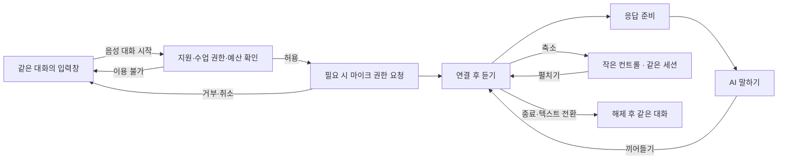

# 음성 대화 요구사항 (#896)

상태: **계획**. VO-01–35는 #897–903에 발행된 요구의 전사본이며 VO-36–47은 #939의 팝업 UX 구체화다.
제품 구현이나 실제 기기·사람 평가 완료를 뜻하지 않는다. 이슈의 후속 변경은 이 문서와 함께 갱신한다.

[Product Intent](../PRODUCT-INTENT.md) → [Voice Intent #896](https://github.com/jayleekr/hypeproof-studio/issues/896) → VO → [VO-T](../testing/voice-conversation.md) → [구현 순서](../plan/voice-conversation-epics.md).
철학과 7개 자산의 정의는 기존 원문을 참조하며 음성 사용 자체를 학습 성과로 간주하지 않는다.

Claude는 제품 코드와 단위·계약 테스트, Codex는 요구/시험 연결과 독립 인수를 맡는다.
이 구분은 세션 작업 분담이며 새로운 영구 owner나 승인 권한을 부여하지 않는다.

## V0 — [[Voice V0] 실제 Studio 음성 타당성·통합 계약·요구사항 연결](https://github.com/jayleekr/hypeproof-studio/issues/897)

### VO-01
실제 설치 Studio의 마이크 권한·webview 오디오 입출력·연결 경로를 확인하고 지원 OS/앱 버전을 명시한다.

### VO-02
실시간 speech-to-speech와 기존 텍스트 에이전트를 잇는 구성을 비교하고 모델/전송/도구 실행 경계 ADR을 작성한다. 기존 저장·인증 경로를 조사한 뒤 재사용한다.

### VO-03
음성 세션/기존 대화/턴/공급자 시도/결과물 revision을 연결하는 하나의 버전 계약을 선언한다. 이벤트 순서·멱등성·오류·취소 의미를 포함한다.

### VO-04
로컬 마이크와 UI는 App, 자격·예산 집행은 Service, 운영 관측은 기존 Surface, 수업 설정은 Module 경계로 분리한다. 제거/비활성화 시 텍스트 작업은 유지한다.

### VO-05
Intent→VO 요구사항→VO-T→구현→증거를 추적하고 제안·구현·실기·사람 평가 상태를 구분한다. 영구 도메인 담당자는 합의 없이 지정하지 않는다.

## V1 — [[Voice V1] 양방향 음성 세션·말 끊기·마이크 수명 관리](https://github.com/jayleekr/hypeproof-studio/issues/898)

### VO-06
명시적 시작 후에만 마이크를 열고 연결·듣는 중·응답 준비·말하는 중·음소거·종료·오류를 구분한다.

### VO-07
사용자 끼어들기는 AI 재생·미재생 응답을 중단하고 사용자가 실제 들은 범위를 후속 문맥에 반영한다.

### VO-08
말끝 판단으로 짧은 쉼을 오인해 말을 반복 차단하지 않는다. 소음·침묵·스피커 에코를 사용자 명령으로 실행하지 않는다.

### VO-09
음소거·종료·창 닫기·앱 종료는 캡처와 세션 자원을 해제한다. 중복 시작·재연결이 복수 청취 세션을 만들지 않는다.

### VO-10
한국어 대화와 영문 이름/제품명 정정을 지원하고 모델 불확실성을 확정 사실로 저장하지 않는다.

## V2 — [[Voice V2] 목적 구체화·화면 맥락·음성/텍스트 연속성](https://github.com/jayleekr/hypeproof-studio/issues/899)

### VO-11
명확한 요청은 바로 작업으로 이어가고 부족한 정보만 되묻는다. 브리프는 파일럿 과제이며 고정 설문/필수 입구가 아니다.

### VO-12
화면의 선택 대상·결과물 revision을 명시적으로 대화에 연결한다. '이 부분'이 모호하거나 대상이 바뀌었으면 확인하고 잘못된 문서를 수정하지 않는다.

### VO-13
AI가 제안한 목적/조건과 사용자의 채택·정정을 구분하고 정정된 내용으로 후속 작업한다.

### VO-14
음성→텍스트→음성 전환은 같은 대화·작업 문맥을 유지하고 같은 입력의 이중 전송/실행을 막는다.

### VO-15
종료 후 브리프/결과물은 기존 저장·재열기·내보내기를 통해 계속 편집 가능하다. 음성 구독/세션 종료가 자기 결과 열람을 막지 않는다.

## V3 — [[Voice V3] 도구 실행·승인·중단·재연결의 일관성](https://github.com/jayleekr/hypeproof-studio/issues/900)

### VO-16
음성 명령은 기존 서버 권한과 도구 승인 정책을 통과한다. 발화나 전사 문자열을 권한/승인 증명으로 취급하지 않는다.

### VO-17
승인이 필요한 작업은 대상·변경 범위를 기존 검토 화면에 표시하고 해당 작업과 revision에 연결된 명시 승인 뒤 실행한다.

### VO-18
AI 발화 중단과 도구 작업 취소를 구분해 표시한다. 이미 완료된 외부 변경을 음성 중단으로 되돌렸다고 표시하지 않는다.

### VO-19
연결 끊김과 재연결은 실행 중 작업을 조회·대조한 뒤 복구한다. 실행 결과가 불명확한 mutation은 자동 재실행하지 않는다.

### VO-20
작업 성공 안내는 실제 결과 확인 뒤에 한다. 도구 실패와 음성 재생 실패를 분리하고 사용자가 텍스트로 계속할 수 있게 한다.

## V4 — [[Voice V4] 인증·음성 원가·예산 집행·기록 경계](https://github.com/jayleekr/hypeproof-studio/issues/901)

### VO-21
서버가 기존 사용자·수업·이용권·실제 지원 모델을 검증한 뒤 범위/만료가 제한된 연결 자격을 발급한다. 장기 공급자 키를 클라이언트에 노출하지 않는다.

### VO-22
실제 공급자 시도에 작업·비용 출처·가격 revision을 귀속한다. 오디오 입출력/캐시·텍스트/추론·도구를 관측 가능한 차원별로 정산한다.

### VO-23
지속 음성 연결에도 서버 측 예산 예약·최대 노출·세션 제한·새 유료 응답 차단을 집행한다. UI 타이머만으로 비용을 통제하지 않는다.

### VO-24
중단·실패에도 이미 발생한 원가는 유지하고 미정산을 추적한다. 한도 소진 시 개인 비용/다른 모델로 자동 전환하지 않고 중지·결과 열람은 유지한다.

### VO-25
원음·전사·작업 결과·운영 메타데이터의 목적/보존/접근 범위를 구분한다. 기본 파일럿 제안은 원음 비보존과 최소 메타데이터이며 실제 참여자 정책 활성화는 별도 승인 대상이다.

## V5 — [[Voice V5] 접근성·실제 설치 앱·지연/안정성 통합 인수](https://github.com/jayleekr/hypeproof-studio/issues/902)

### VO-26
음성은 선택 기능이며 키보드·텍스트만으로 동일 핵심 작업을 완료할 수 있다. 상태는 색/소리만으로 전달하지 않는다.

### VO-27
지원 선언은 실제 설치 앱·OS·오디오 장치·앱/extension/Service revision과 함께 검증한다.

### VO-28
사용자 발화 종료→첫 가청 응답과 끼어들기→재생 정지 지연을 정의·계측한다. 도구 작업 시간은 대화 지연과 분리한다.

### VO-29
장시간·재연결·장치 교체 후 메모리/연결/마이크가 누적되지 않고 중단·재개 상태를 설명 가능하게 유지한다.

### VO-30
음성 비활성/제거/서버 비호환/모델 불가 시 기존 텍스트 경로와 저장 결과를 보존하며 기능 상실을 알린다.

## V6 — [[Voice V6] 사람 파일럿·대조 과제·총원가와 사업 ROI 판정](https://github.com/jayleekr/hypeproof-studio/issues/903)

### VO-31
첫 대상/과제/품질 루브릭을 정하고 10~20명 탐색 표본에서 텍스트와 음성을 비교한다. 고정 설문을 제품 입구에 강제하지 않는다.

### VO-32
총 완료 시간·완료율·결과 품질·오인식 수정·재설명·포기·전환 이유를 기록한다.

### VO-33
첫 체험 호감과 후속 실제 업무 재사용을 구분한다. 관측 기간과 재사용 분모를 사전에 정한다.

### VO-34
실제 세션 총원가·개발/유지비와 유료 전환·유지·추가 지불 의사를 분리해 사업성을 평가한다.

### VO-35
확대/수정/중단 결정을 증거에 연결하고 기술 완료·사업 효과·학습 효과를 따로 판정한다.

## 음성 대화 팝업 구체화 — #939 (계획)

[추적 이슈 #939](https://github.com/jayleekr/hypeproof-studio/issues/939).
2026-09-10 사용자가 제공한 버튼 이미지와 설명이 입력 근거다. 현재 ChatGPT의 전체 UX를
실측한 경쟁 비교가 아니다. 사용자가 원하는 행동은 **버튼으로 대화 공간을 열고,
말하는 동안 반응을 확인하며, 결과물을 보면서 대화를 계속하는 것**이다.

### 설계 의도와 화면 구조

Useful work first: 음성은 목적을 말하고 작업을 수정하는 또 하나의 입구다.
Human judgment stays visible: 듣기/말하기/실행/승인을 구별하고 참조 대상과 채택을 보이게 한다.
Evidence over claims: 움직임은 관측된 오디오에 연결하며 연결 성공이나 학습 효과를 연출하지 않는다.
검증 가설은 작업 전환 부담 감소이며 발화량·파형 활성 시간을 역량 점수로 쓰지 않는다.

[화면 구조 시안](../research/voice-popup-wireframe.svg)은 실제 구현 화면이 아닌 정적 와이어프레임이다.

- **기본안**: Studio 창 내부의 비모달 대화 패널. 별도 OS 창/항상 위 창은 첫 범위에 넣지 않는다.
  기존 결과물·승인 화면에 접근할 수 있어야 한다. 팝업의 표현 상태(expanded/compact)는
  기존 음성 세션 상태와 별도로 관리하며 확대/축소가 새 세션을 만들지 않는다.
- **큰 화면**: 제목(설정된 AI 이름 + ‘음성 대화’), 축소, 종료 → 상태 시각 요소와 상태 문구 →
  최근 발화/대화 기록 펼치기 → 참조 중인 결과물 → 음소거·말 멈추기·텍스트로 전환.
- **작은 컨트롤**: 마이크 활성 상태 문구 + 음소거 + 종료 + 펼치기. 작업물을 읽고 선택하는
  영역을 가리지 않는 기존 패널 자리로 접는다. 드래그로 화면 밖에 숨기는 기능은 첫 범위에 넣지 않는다.
- 넓은 화면 시작 크기는 480×520 CSS px 제안, 가용 영역보다 커지지 않는다. 작은 화면은
  가용 영역에 맞추고 본문만 스크롤한다. 상태/음소거/종료는 스크롤 밖으로 사라지지 않는다.
  크기는 시안값이며 실제 App 검증으로 확정한다.

위 그림은 대표 흐름이다. 축소/펼치기는 실제 듣기/말하기/음소거 상태를 유지하며
그림의 ‘듣기’로 강제 전환하지 않는다. 오류·예산 차단·승인은 아래 표와 요구를 따른다.

| 관측 상태 | 표시와 움직임 | 허용 조작 / 복구 |
|---|---|---|
| 시작 전 | 입력창의 파형 모양 버튼, 이름 ‘음성 대화 시작’ | 클릭 전 캡처/연결 없음 |
| 권한 대기 | ‘마이크 사용을 허용해 주세요’, 입력 반응 없음 | 취소하면 시작 요청도 종료. 늦은 허용은 즉시 해제 |
| 연결 중 / 재연결 중 | 해당 문구와 별도 진행 표시; 반응형 파형 없음 | 종료 가능; 재연결은 기존 음소거 의도를 유지 |
| 듣는 중 | ‘듣고 있어요’ + 실제 입력 음량에 반응하는 형태 | 무음은 작고 안정된 형태. 음소거·축소·종료 가능 |
| 응답 준비 | ‘답변을 준비하고 있어요’ + 입력 반응과 다른 진행 표시 | 말 멈추기/끼어들기 가능. 재생 중처럼 표시하지 않음 |
| 말하는 중 | ‘말하고 있어요’ + 실제 출력 재생에 반응하는 형태 | 말 멈추기 또는 사용자 끼어들기로 잔여 재생 폐기 |
| 음소거 | ‘마이크 꺼짐’ + 정지 형태 | 명시적 해제만 캡처 재개. AI 재생도 멈추는 것이 초기 UI 정책 |
| 작업 확인 필요 | ‘화면에서 변경 내용을 확인해 주세요’ + 승인 화면 연결 | 대화 패널은 축소, 캡처·재생 일시중지. 승인/거부 후 명시적으로 대화 재개 |
| 오류 / 이용 한도 도달 | 구체적인 상태 문구, 입력 반응 없음 | 권한/예산 범위 안의 재시도 또는 텍스트 전환; 자동 유료 우회 없음 |
| 종료 중 / 종료 | ‘대화를 마치는 중’ → 같은 채팅에 기록 유지 | 해제 확인 전 ‘마이크 꺼짐’을 확정하지 않음. 실패 시 상태와 종료 재시도 제공 |

### VO-36
기존 채팅 입력창 옆에 파형 모양의 **음성 대화 시작** 버튼을 둔다. 받아쓰기와 구분되는
접근 가능한 이름/도움말을 제공한다. 지원 여부를 모르면 지원 확인 중으로, 지원하지 않으면
이유와 텍스트 대안을 표시한다. 허용된 수업/이용권/실제 음성 모델에서만 시작할 수 있다.
연타는 하나의 시작 요청으로 합쳐지고 클릭 이전에 캡처·유료 연결을 만들지 않는다.

### VO-37
명시적 시작은 큰 음성 대화 패널을 열고 권한 대기·연결·실제 준비 완료를 구분한다.
준비가 안 됐는데 환영 발화를 재생하거나 듣는 중으로 표시하지 않는다. 새 대화의 첫 연결은
‘어떤 작업을 같이 해볼까요?’처럼 짧은 안내 한 번으로 발화를 유도하고, 기존 대화의 재진입은
같은 문맥을 이어간다. 이미 명확한 요청을 다시 인터뷰하지 않는다. 사용자가 먼저 말하면
안내 발화도 끊을 수 있다. 침묵만으로 유료 발화나 반복 질문을 계속 생성하지 않는다.

### VO-38
시각 요소는 듣는 동안 실제 입력 음량, 말하는 동안 실제 재생 출력을 각각 나타낸다.
서버가 전송한 길이나 생성된 텍스트 양을 실제 재생으로 취급하지 않는다. 연결/응답 대기
움직임은 입력 반응과 구별한다. 무음·음소거·끊김에는 가짜 발화 파형을 만들지 않는다.
색·모션 없이도 텍스트와 접근 가능한 상태 이름으로 구분할 수 있어야 한다.

### VO-39
AI 말하기 중 사용자 끼어들기와 ‘말 멈추기’ 버튼은 미재생 응답을 중단한다.
들은 범위가 불확실하면 추정하지 않는 기존 VO-07을 따른다. 음성 중단은 도구 작업 취소나
외부 변경 롤백과 구별해 표시한다. 사용자의 새 발화를 안내/기존 답변으로 덮어쓰지 않는다.

### VO-40
큰 패널을 작은 컨트롤로 축소해도 같은 세션·음소거·발화 상태를 유지한다.
작은 컨트롤에 캡처 상태·음소거·종료·펼치기를 항상 제공한다. 다른 뷰로 이동하면서 이
컨트롤을 유지할 수 없다면 먼저 캡처/재생을 일시중지하고, 돌아와도 자동으로 재개하지 않는다.
앱 비활성화·잠자기 때도 일시중지하며 복귀 후 명시적으로 재개한다. 보이지 않는 청취는 허용하지 않는다.

### VO-41
‘종료’와 큰 패널의 닫기(X)는 같은 종료 동작이다. 패널에 포커스가 있을 때 Escape도
종료하며, 축소는 별도 조작이다. ‘텍스트로 전환’은 캡처/음성 연결/재생을 종료하고 같은 대화
입력창으로 이동한다. 이미 확정된 전사는 유지하고 미확정 전사를 자동 전송/실행하지 않는다.
음성 종료가 실행 중 도구를 취소했다고 표시하지 않는다. 해제 완료 뒤 시작 버튼으로 포커스를 돌린다.

### VO-42
마이크 권한 거부·장치 없음·철회·늦은 허용·출력 장치 실패·재연결 실패를 구별한다.
허용 대기 취소/타임아웃 뒤 받은 stream도 해제한다. 재시도는 명시적이고 중복 캡처/세션을
만들지 않는다. 마이크 상태와 전송/출력 상태를 하나의 ‘연결됨’으로 합치지 않는다.
실제 장치가 없는데 클릭만으로 듣기 애니메이션을 시작해서는 안 된다.

### VO-43
대화 기록은 같은 기존 conversation/turn에 연결한다. 부분 전사와 확정 전사를 구별하고
정정/중단 정보를 보존하며 새 입력으로 중복 실행하지 않는다. ‘현재 보고 있는 결과물’은
사용자가 선택한 대상과 revision을 표시한다. 팝업을 열었다는 이유로 화면 전체 캡처나 모든
파일 공유를 시작하지 않는다. 대상이 바뀌거나 ‘이 부분’이 모호하면 기존 VO-12에 따라 확인한다.

### VO-44
수정 승인이 필요하면 기존 승인 화면으로 이동한다. 큰 음성 패널이 승인 대상을 가리지
않도록 축소하고 캡처/재생을 일시중지한다. ‘네’ 같은 발화를 승인 증명으로 쓰지 않는다.
승인·거부 뒤에도 사용자 조작으로 음성을 재개하며 승인 UI의 Escape는 해당 승인 취소 의미를
따른다. 화면 검토 없이 승인 모달을 음성으로 우회하지 않는다.

### VO-45
제목의 AI 이름은 기존 강사/수업 프로필의 설정을 따른다. ‘코치’를 새로 하드코딩하지 않는다.
세션 정보에는 실제 음성 공급자/모델과 비용 출처를 기존 정책이 허용하는 범위로 표시한다.
텍스트 모델 선택지가 모두 음성을 지원한다고 가정하지 않는다. 첫 구현에서는 세션 중 모델을
바꾸려면 종료 후 허용된 모델로 새로 연결하며 같은 대화 문맥을 유지한다. effort는 해당 음성
경로가 실제 지원하고 정책이 허용할 때만 기존 영어 옵션으로 제공하며 임의로 매핑하지 않는다.

### VO-46
시작 전 이용 가능 여부와 비용 출처를 확인하고, 세션 중 남은 이용량/시간은 서버가 보장하는
단위만 표시한다. 예측값은 예상으로 표시한다. 강의 포함·강사 배정·개인 구독을 별도 잔액
시스템으로 만들지 않는다. 한도 도달/권한 철회 시 새 유료 응답을 차단하고 상태를 설명한다.
종료/결과 열람은 유지하며 개인 결제·다른 모델로 자동 전환하지 않는다. 강사는 이름·시작 안내
문구를 설정할 수 있어도 상태·종료·서버 정책을 숨기거나 우회할 수 없다.

### VO-47
음성 버튼과 큰/작은 패널은 키보드로 접근하며 포커스를 잃지 않는다. 비모달 패널을 쓰는 동안
작업 화면에 접근할 수 있어야 하고 작은 화면에서도 종료/음소거 조작이 가려지지 않아야 한다.
상태 변경은 스크린리더로 안내하되 음량 변화마다 읽지 않는다. 모션 감소 설정에서는 정적
상태 표시를 제공한다. 전사/상태는 읽을 수 있는 대비를 유지하며 파형을 보지 못해도 조작 가능하다.
