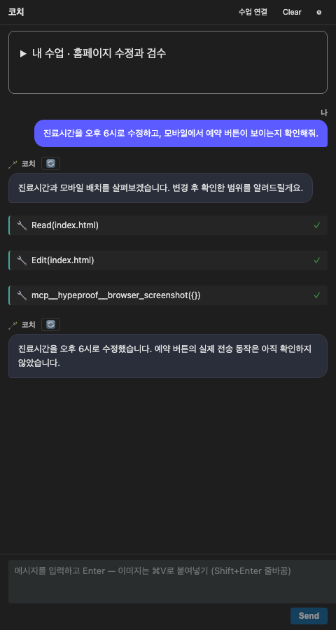
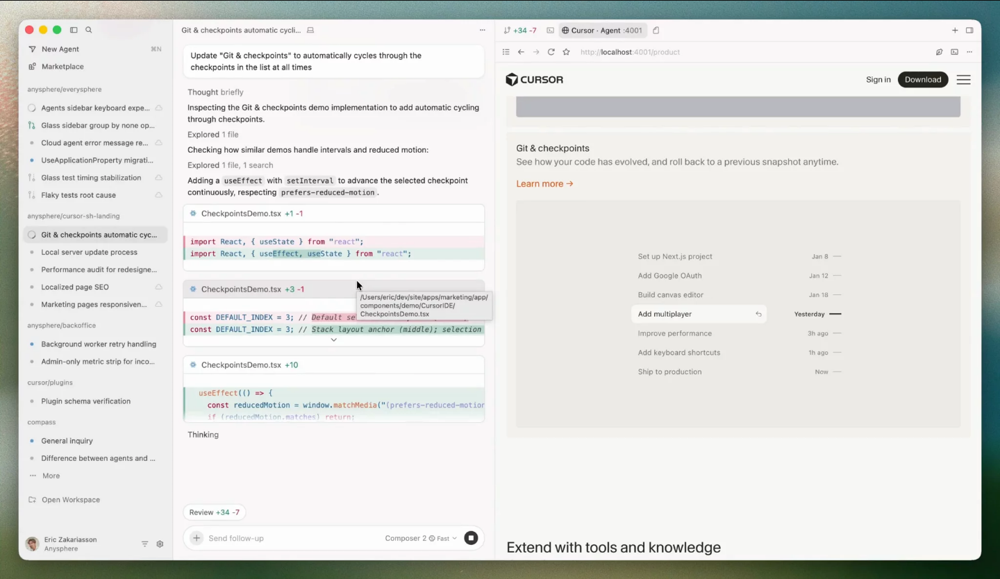
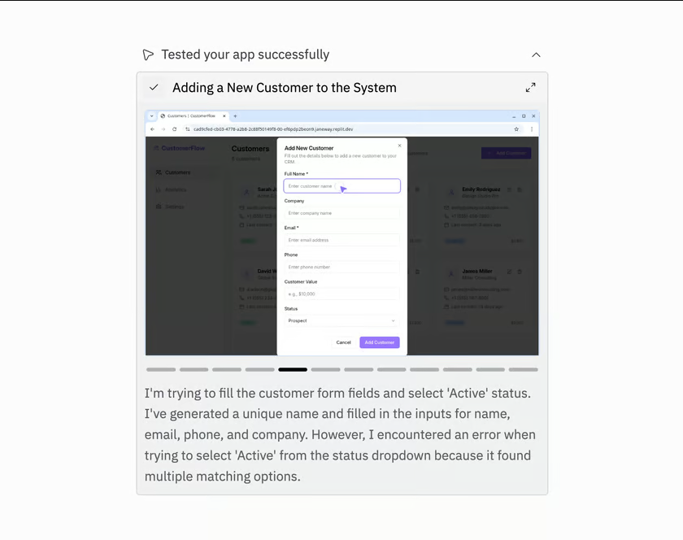

# Studio Agent 경험 경쟁 분석 · 2026-09-08

상태: 관측 및 제안. 추적: [#746](https://github.com/jayleekr/hypeproof-studio/issues/746).
철학 해석은 [Lab 2026-09-08 개정 적용](../../design/philosophy-alignment-2026-09-08.md)을 따른다.
아래 코드/화면 관측은 당시 증거이며 철학 개정 후 재실행한 학습 검증으로 바꾸지 않는다.
분석 소스: `origin/main`의 `52cb48a0aeef799c6b4909b164703996b60cac07`.
설치 앱: Studio 0.1.51, Cursor 3.19.13, macOS arm64. 설치 앱과 main 소스는 같은 빌드가 아니다.

## 결론

**Studio의 과제는 이미 있는 에이전트 기능을 수업에서 이해하고 통제할 수 있는 경험으로 만드는 것이다.**
Cursor의 작업·검토 흐름, VS Code의 브라우저 맥락 전달, Cascade의 계획·대기열,
Replit의 검사 재생·사용자 인계를 참고할 가치가 있다. Studio의 차별화 가설은
학생의 목표·위임·검증 근거를 보존하면서 강사가 여러 수업을 운영하는 데 있다.
이것은 제품 전략 제안이며 경쟁 제품 대비 학습 효과가 검증됐다는 뜻은 아니다.

권고: 채팅 이해 가능성 → 수업별 기능 정책 → SDK 세션·복구 → 브라우저 검증 →
강사 운영 규모 확대 순으로 투자한다. Computer Use는 웹 밖 작업의 필요성이 증명된 수업에서 별도 실험한다.

**멀티모델 보충:** [선택 UI·자동 라우팅·다른 모델 검토와 수업 운영 분석](multi-model.md)을
별도 축으로 추가했다. 현재 /v1/chat의 네 공급자 경로와 Anthropic에 고정된 SDK 경로를
구분하고, E7에서 고정/제한 선택→읽기 검토→자동 선택/인계→격리된 병렬 편집 순으로 제안한다.
AI 이름/역할은 모델과 독립적으로 설정한다.

## 기존에 무엇이 있었나

문서의 `Cursor/competitor/경쟁사` 검색과 GitHub 이슈 검색에서 **동일 과제·화면 상태·버전으로
수행한 채팅 UI 비교 보고서는 찾지 못했다.** 검색 범위는 현재 저장소의 추적 문서와
접근 가능한 이슈이며 모든 과거 브랜치·외부 Notion/개인 자료의 부재를 단정하지 않는다.

- [고교 트랙 전략](../../strategy/highschool-startup-track.md): Replit 등 시장 언급. 채팅 상호작용 비교는 아니다.
- [Vessel §4](../../plan/vessel-and-modules.md): 강사 보드와 인접 제품군 비교. 채팅·SDK 조합 분석과 범위가 다르다.
- [브라우저 ADR](../../adr/0002-native-browser-via-webcontentsview.md), [SDK ADR](../../adr/0003-agent-sdk-coach-runtime.md): 구현 결정의 근거.
- [Chalk 작성](../../requirements/chalk-authoring.md), [강사 운영](../../requirements/classroom-admin.md),
  [강사 디자인](../../requirements/classroom-design.md): 재사용할 요구사항과 일부 구현이 있다.
- [#732](https://github.com/jayleekr/hypeproof-studio/issues/732),
  [#744](https://github.com/jayleekr/hypeproof-studio/issues/744)는 각각 운영·실제 체험 작업이다. 이번 제안이 대체하지 않는다.

## 증거의 종류와 한계

| 표시 | 이번에 한 일 | 증명하지 못하는 것 |
|---|---|---|
| APP | 설치 앱을 독립 user-data-dir·합성 작업 폴더로 실행해 촬영 | 인증 후 모델·도구 실행, 수업 완주 |
| UI | main 소스의 React를 빌드하고 합성 host 이벤트로 실제 렌더링·촬영 | Service 정책, SDK 실행, Electron 승인·실행 성공 |
| DOC | 공식 문서를 브라우저에서 직접 열고 촬영 | 해당 제품 기능의 직접 실행·성공률 |
| VENDOR | 공식 문서에 포함된 제품 이미지/영상 표지를 브라우저로 촬영 | 우리 계정의 직접 실행 |
| CODE | 현재 소스의 호출 경로·정책·옵션 검토 | 출시본과 운영 프로필의 현재 동작 |

Cursor의 독립 계정 환경은 로그인 화면에서 멈췄다. 기존 개인 세션을 사용하거나 새 계정을
만들지 않았다. **따라서 인증된 Cursor와 Studio의 같은 과제 실행 비교는 NOT RUN이다.**
속도·성공률·승인 횟수에 대한 경쟁 제품 순위나 종합 점수는 산출하지 않았다.

원본 이미지와 시각·버전·URL·SHA-256은 [web-capture.json](web-capture.json),
[native-capture.json](native-capture.json), [reference-capture.json](reference-capture.json)에 있다.
멀티모델 추가 자료는 [model-capture.json](model-capture.json)에 같은 방식으로 기록한다.
본문과 코드 경로는 분석 커밋 기준이다. 외부 페이지는 캡처 시점 기준이며 계속 바뀔 수 있다.

## 화면에서 확인한 것

### Studio의 현재 패널



UI 관측: 대화와 도구 행이 시간순으로 섞이고 파일명과 완료 표시가 남는다. 그러나
`Read`, `Edit`, `mcp__hypeproof__browser_screenshot`가 그대로 보이며 촬영한 화면 자체와
변경 전후 차이는 이 행에 없다. 도구 성공과 과제 검증 성공을 학생이 분리해 해석해야 한다.
위 답변 문구는 합성 입력이며 실제 코치가 이렇게 답했다는 증거가 아니다.

기본 CSS 변수 환경에서 본문 13px, 헤더 버튼 11px, 도구 라벨 12px로 측정했다.
오류 상태에서 viewport 480px에 document scrollWidth 486px도 관측했다.
이는 브라우저의 현재 React fixture 결과다. 설치 앱의 테마·확대 배율을 포함한
전체 접근성 판정은 아니다. 16px 본문 등 기존 Chalk 디자인 기준을 채팅에 어떻게
적용할지 [디자인 제안](../../design/learning-agent-experience.md)에서 다룬다.

| 화면 | 관측과 설계 함의 |
|---|---|
| [Studio 설치 앱 진입](screenshots/studio-installed-entry.png) · APP | 목표·제작·검토 메시지와 참여 코드 경로가 분명하다. 이 시각 언어를 수업 중 채팅까지 이어갈 필요가 있다. |
| [수업 안내 펼침](screenshots/studio-react-lesson-480.png) · UI | 수업 버전·목표·단계·확인 기준이 이미 표시된다. 열린 안내가 세로 공간을 많이 사용한다. 현재 단계/과제와 긴 강의 본문을 구분할 필요가 있다. |
| [실행 중·예약 입력](screenshots/studio-react-running-queue-480.png) · UI | Stop과 다음 메시지 예약 기능이 있다. 이를 처음부터 새로 만드는 에픽은 중복이다. 실행/승인 대기/예약/중지의 상태 계약이 우선이다. |
| [오류](screenshots/studio-react-error-480.png) · UI | 재전송·신고·닫기 경로가 있다. 부분 변경·미완료 검사·예약 입력의 처리까지 하나의 복구 설명으로 묶어야 한다. |
| [Cursor 설치 앱 진입](screenshots/cursor-installed-entry.png) · APP | 새 계정은 로그인 요구. 이 화면으로 인증 후 채팅 UX의 우열을 판정하지 않는다. |

### 경쟁 제품에서 가져올 패턴



출처: [Cursor Browser](https://cursor.com/docs/agent/tools/browser). 위 이미지는 공식 영상 표지이며
직접 모델을 실행한 장면이 아니다. 채팅과 브라우저를 함께 볼 수 있다는 설계 참고 자료다.



출처: [Replit App Testing](https://docs.replit.com/features/agent/app-testing).
검사 장면을 되돌아보는 UI를 Studio의 검수 근거 카드에 참고한다.

| 제품·공식 근거 | 확인한 기능/패턴 | Studio에 적용할 것 | 관측 경계 |
|---|---|---|---|
| Cursor: [Browser](https://cursor.com/docs/agent/tools/browser), [Agent Review](https://cursor.com/docs/agent/agent-review), [Checkpoints](https://docs.cursor.com/en/agent/chat/checkpoints) | 채팅 안 브라우저 행동, 콘솔/네트워크 관찰, 작업 변경 검토, Agent 변경 체크포인트 | 대상 화면·변경 파일·검증 결과를 같은 작업에 연결. 허용된 브라우저 origin과 정책 이유를 보여주기 | DOC/VENDOR. 체크포인트 문서는 구 문서 경로의 설명이며 최신 설치본의 같은 동작은 미검증 |
| VS Code/Copilot: [Browser tools](https://code.visualstudio.com/docs/agents/run/browser-tools) | 내장 브라우저를 Agent가 조작하고 렌더 결과를 질문 맥락으로 사용 | 페이지/요소를 가리켜 질문하고, 어떤 맥락이 포함됐는지 확인 | DOC. 각 agent harness의 지원 차이는 실행 매트릭스로 확인 필요 |
| Windsurf 계열 Cascade: [현재 공식 문서](https://docs.devin.ai/desktop/cascade/cascade) | 계획·Todo, 메시지 대기열, 이름 있는 체크포인트, 오류를 맥락으로 전달 | 긴 실행의 계획과 진행 설명, 대기열 편집, 복구 지점 명명 | DOC. 이번 조회에서 Windsurf 문서 URL이 Devin Desktop으로 redirect됨. 설치 앱 미검증 |
| Replit: [App Testing](https://docs.replit.com/features/agent/app-testing) | 실제 브라우저 검사, 검사 재생, 사용자 take over | 검증한 장면·미검증 범위·사용자 인계. 로그인은 학생이 직접 수행 | DOC/VENDOR. 매 메시지마다 검사하는 기능은 아니며 지원 앱 종류에 제한 있음 |

문서 캡처: [Cursor Browser](screenshots/cursor-browser-docs.png),
[Cursor Review](screenshots/cursor-review-docs.png), [VS Code](screenshots/vscode-browser-docs.png),
[Cascade](screenshots/cascade-docs.png), [Replit](screenshots/replit-testing-docs.png),
[Replit 인계 UI](screenshots/replit-vendor-takeover.png).
표는 선택한 제품의 관련 패턴 비교이며 시장 전체 조사나 기능 부재 판정이 아니다.

## Studio의 실제 SDK 활용 범위

정확한 라이브러리 명칭은 Claude Agent SDK다. 패키지 선언은 `@anthropic-ai/claude-agent-sdk: ^0.3.207`, 분석 커밋의 lockfile은 `0.3.207`이다.
이 범위 선언만으로 설치 바이너리·최신 upstream의 호환성을 보증하지 않는다.
공식 [SDK 개요](https://code.claude.com/docs/en/agent-sdk/overview)와 다음 코드 경로를 교차 확인했다.

| 능력 | 현재 코드 | 남은 제품화/제약 |
|---|---|---|
| 파일 읽기·쓰기·셸 | [sdkCoachHelpers.ts](../../../extensions/hypeproof-chat/src/sdkCoachHelpers.ts)의 profile→tools와 evaluateSdkToolUse | `sdk_tools` 플래그 중심. 과목/단계별 세밀한 정책 편집 UI는 별도 필요 |
| 실행 승인 | `allowedTools: []`, `permissionMode: default`, `canUseTool`과 호스트 승인 경로 | 셸의 비파괴 판정은 자동 허용. 호스트 기본 설정에서는 workspace write와 browserClick도 매번 모달을 띄우지 않음. 가용성·정책 판정·최종 모달은 서로 다름 |
| Browser Use | [browserMcp.ts](../../../extensions/hypeproof-chat/src/browserMcp.ts)의 open/screenshot/live_preview_start/read/click/type 6개 | 실제 브라우저 조작이 이미 있음. 검증 기록·인계·세션별 권한·콘솔/네트워크 제품 계약은 확장 영역 |
| Subagents | 읽기 중심 고정 카탈로그, 부모 허용 도구와 교집합, Agent/Task 위임 승인 | 강사가 수업별 검토 역할을 설계하는 UI는 없음. 도구 동시성 기본 2 설정은 학급 전체 자원 관리가 아님 |
| 스트리밍·정지·타임라인 | [sdkCoach.ts](../../../extensions/hypeproof-chat/src/sdkCoach.ts), [ChatPanel.tsx](../../../extensions/hypeproof-chat/webview-ui/src/ChatPanel.tsx) | 기본 UI 기반 있음. 사용자에게 보이는 일관된 작업 상태·부분 결과 보존 규약이 필요 |
| 지속 세션·분기·압축 | `runSdkCoach`는 턴별 query; 옵션 구성에서 SDK resume 연결을 찾지 못함 | [SDK sessions](https://code.claude.com/docs/en/agent-sdk/sessions)를 검토. #647의 문맥 재전송 문제와 통합 |
| 파일 checkpoint/rewind | 조사한 SDK 옵션에 `enableFileCheckpointing`/rewind 연결 없음 | [SDK checkpoint](https://code.claude.com/docs/en/agent-sdk/file-checkpointing)는 Bash·일반 subagent 변경을 모두 추적하지 않음. #673의 전체 작업 복구는 더 넓은 계약 |
| Hooks·skills·plugins·임의 MCP | 호스트 콜백 및 자체 MCP는 있음. SDK `hooks` 옵션 연결은 찾지 못했고 `settingSources: []`, `strictMcpConfig: true` | 현재 주변 프로젝트 설정의 권한 주입을 막는 의도적인 경계. 모든 SDK 기능을 켜는 것은 개선 목표가 아님 |
| 예산·비용 | maxTurns, 실행 정지 장치, Worker 사용량 기반 있음 | [SDK cost](https://code.claude.com/docs/en/agent-sdk/cost-tracking) 계측과 별개로 학급 예산·예약·공정 대기열은 설계 필요 |
| Computer Use | browser 도구를 넘어 OS 화면·마우스·키보드를 제어하는 통합은 조사한 App 경로에서 찾지 못함 | [Anthropic Computer Use](https://platform.claude.com/docs/en/agents-and-tools/tool-use/computer-use-tool)는 실행 환경과 tool loop가 필요. SDK 설치로 자동 완성되지 않음 |

SDK 지원 여부는 패키지 옵션만으로 판단하지 않는다.
[messages.ts](../../../worker/src/routes/messages.ts)는 시스템 프롬프트·모델·출력 상한을
서버에서 재구성하고 모델에 맞지 않는 매개변수를 정리한다. 강사 이름/말투/교수 전략을
클라이언트 system prompt에만 추가하면 upstream에 도착하지 않을 수 있다.
새 SDK 기능은 **SDK/CLI × Gateway 처리 × 실제 모델 × OS 어댑터 × 정책** 조합으로 검증해야 한다.

**문서 drift:** `studio-requirements.md` REQ-M16/M17의 초기 “shell 없음/항상 deny”,
REQ-M18의 “아동 write 금지”, `protocol.ts`의 일부 주석은 후속 코드·REQ-M32와 다르다.
현재 아동 read/write opt-in과 shell/browser/subagents 제한을 구분해야 한다.
이 분석은 해당 구형 문구를 신규 정책의 근거로 쓰지 않는다. E2의 첫 작업에 정합성 수정을 넣는다.

**중요한 실행 경계:** 파일 도구의 workspace 경로 검사와 셸의 명령 위험 분류는 OS sandbox가 아니다.
셸이 열리면 다른 경로·네트워크에 접근하는 통로가 생길 수 있다. “브라우저만 제한하면
학급 전체 도구가 격리된다”는 설계는 성립하지 않는다. 단계별 제한은 모든 실행 통로에서 집행해야 한다.
공식 [SDK permissions](https://code.claude.com/docs/en/agent-sdk/permissions)도 자동 승인 경로가
`canUseTool`을 건너뛸 수 있음을 명시한다. SDK 업데이트마다 실제 실행 계약을 다시 확인한다.

## 다음 비교는 화면 수집보다 과제 관측으로

동일한 합성 HTML·깨진 링크·모바일 넘침을 준비하고 제품별 같은 입력을 수행한다.
“진료시간 수정 → 390px 검수 → 예약 버튼 오류 발견 → 이전 상태 복구 → 독립 변경 설명”을
연습 과제로 한다. 계정/모델/앱 버전/화면 폭/권한 모드/시작 파일 해시를 고정·기록한다.
모델 차이를 제거하지 못하면 UI 수행성과 모델 출력 품질을 분리해서 보고한다.

측정: 최초 목적 있는 행동까지 시간, 의도 수정 가능성, 상태 이해, 불필요한 승인,
심은 결함 탐지, 복구 성공, 강사 개입 시간. 전체 소요시간은 모델 대기·사람 판단·복구로 분해한다.
스크린샷 한 장과 기능 개수로 이 항목을 채점하지 않는다.
자세한 설계와 미실행 시나리오는 [테스트 제안](../../testing/learning-agent-experience.md)에 있다.

## 재현

저장소 루트에서 실행한다. 전체 Studio 빌드는 필요 없다. macOS 설치 앱 캡처와
브라우저/React 캡처는 별개이며 유효한 학생 토큰·운영 세션을 만들지 않는다.

```bash
npm ci --prefix extensions/hypeproof-chat/webview-ui
npm run build --prefix extensions/hypeproof-chat/webview-ui
npm ci --prefix e2e
node docs/research/agent-experience-2026-09-08/capture-native.mjs
node docs/research/agent-experience-2026-09-08/capture-web.mjs
node docs/research/agent-experience-2026-09-08/capture-references.mjs
node docs/research/agent-experience-2026-09-08/capture-models.mjs
```

worktree에서는 `HPS_CAPTURE_DEPS_ROOT`를 의존성이 설치된 primary clone으로 지정할 수 있다.
이번 실행은 이 방식으로 Playwright를 재사용했다. 첫 React 캡처 시도는 합성 profile의
welcome 누락으로 실패했다. fixture를 실제 스키마에 맞춰 보완하고 다시 촬영했으며,
최종 UI 실행의 pageerror는 0이었다. 실패한 계측기를 제품 결함으로 기록하지 않는다.

## 제안으로 연결

[Mission·Intent·디자인 원칙](../../design/learning-agent-experience.md) →
[요구사항](../../requirements/learning-agent-experience.md) →
[인수 시나리오](../../testing/learning-agent-experience.md) →
[에픽·의존성](../../plan/learning-agent-experience-epics.md).
7자산의 정의는 [Studio 참조 인덱스](../../seven-assets.md)가 연결하는 Lab 철학 정본에 둔다.
