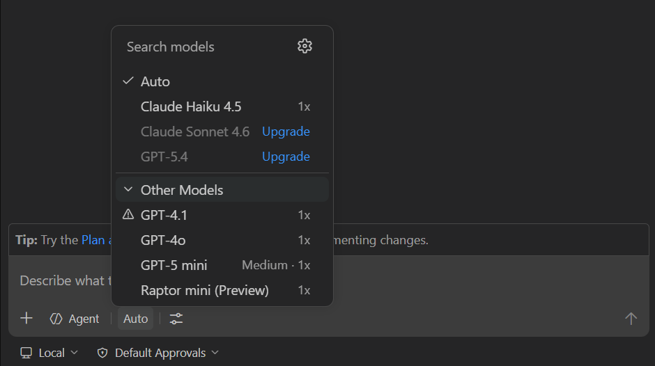
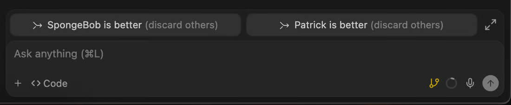

# 멀티모델 — 선택 UI, 수업 정책, 실행기, 비교 학습

상태: CODE/DOC/VENDOR 관측과 설계 제안. 2026-09-08.
분석 소스는 [기존 연구](README.md)의 main 커밋과 같다. 추가 모델 호출은 하지 않았다.
현재 운영에 어떤 provider/key가 활성화됐는지, 각 모델의 실사용 품질은 이번에 검증하지 않았다.

## 판단

멀티모델은 별도 제품 축이다. 처음 제안의 SDK·예산 항목만으로는 모델 선택 경험을 충분히
정의하지 못한다. **모델을 고르는 능력, 결과를 비교하는 능력, 강사가 그 경험을 운영하는 능력**을
함께 다룬다. [INT-AE-07](../../design/learning-agent-experience.md), AE-25~34, E7로 추적한다.

Studio는 네 공급자의 채팅 API 경로를 이미 갖고 있다. 그러나 수업별 학생 선택권,
모델별 도구 지원, 자동 라우팅, 독립 검토, 모델 변경 시 문맥 인계는 하나의 제품 계약이 아니다.
연결된 공급자 개수를 Cursor 수준의 멀티모델 Agent 경험으로 해석하면 안 된다.

## 경쟁 제품에서 실제 확인한 것

| 제품 | 공식 문서에서 확인 | Studio에 적용할 설계 | 검증 한계 |
|---|---|---|---|
| Cursor | [모델 선택](https://cursor.com/help/models-and-usage/available-models), [Router](https://cursor.com/help/models-and-usage/cursor-router)의 Auto 및 Cost/Balance/Intelligence, 팀의 허용 모델·모드 제한 | 명시적 선택과 자동 선택을 함께 제공하고 수업 허용 범위를 공통 적용 | DOC. Router 품질/절감률은 공급자 주장으로, 이번 비교의 실측값이 아님 |
| VS Code/Copilot | [입력창 모델 선택·effort·Auto·모델 관리](https://code.visualstudio.com/docs/agent-customization/language-models). Auto 응답의 실제 모델 확인, 모델 능력/문맥/비용 정보. harness별 모델 차이 | 모델 이름과 함께 이미지/도구 지원·허용 이유·실제 응답 모델 표시. effort는 지원 모델에서만 제공 | DOC/VENDOR. BYOK Agent Host는 문서상 experimental; 모든 harness에서 동일 지원이라고 말하지 않음 |
| Windsurf 계열 legacy Cascade | [Arena](https://docs.devin.ai/desktop/cascade/arena): 같은 입력을 별도 세션/worktree에서 실행해 비교하고 결과 선택. 일부 그룹은 선택 후 모델 공개 | 같은 근거로 두 결과를 검수하고 채택 이유를 남기는 비교 실습 | DOC/VENDOR. 현재 문서는 Devin Desktop. Arena는 legacy Cascade에 한정되며 기본 Devin Local agent는 미지원이라고 명시 |

Cursor의 [팀/그룹 모델 정책](https://cursor.com/docs/enterprise/model-and-integration-management)은
허용을 합집합으로 결합한다. Studio 수업 단계는 권한을 좁혀야 하므로 이 동작을 그대로
복사하지 않는다. 제안은 기관 허용·담당 수업·현재 단계·실행기 능력의 **교집합**이다.
이는 Studio의 설계 선택이며 Cursor의 보안 결함을 주장하는 것이 아니다.

출처: [VS Code 공식 모델 문서](https://code.visualstudio.com/docs/agent-customization/language-models).
모델 선택을 대화 입력 가까이에 두는 참고 자료다. 이미지의 모델 목록·배율은 공급자 이미지 내용이며
Studio의 지원 목록이나 최신 요금표가 아니다.

출처: [Arena 공식 문서](https://docs.devin.ai/desktop/cascade/arena). 독립 결과를 비교하는 참고 자료다.
git worktree는 파일 변경 분리 수단이며 OS·네트워크·자격 격리를 보장하지 않는다.

추가 DOC 캡처: [Cursor 모델](screenshots/cursor-models-docs.png),
[Cursor Router](screenshots/cursor-router-docs.png), [VS Code 모델](screenshots/vscode-models-docs.png),
[Cascade Arena](screenshots/cascade-arena-docs.png).
출처·시각·해시는 [model-capture.json](model-capture.json), 재현은 [capture-models.mjs](capture-models.mjs).
공식 문서 4장과 공식 제품 이미지 2장을 직접 브라우저로 촬영했다. 로그인한 제품에서
모델을 바꿔 실행한 증거는 아니다. 기존 설치 Cursor의 로그인 제한은 그대로다.

## Studio 코드 감사

| 영역 | 현재 구현과 근거 | 빈 부분/주의 |
|---|---|---|
| 공급자 선택 | [env.ts](../../../worker/src/env.ts)의 gemini/anthropic/openai/glm. [chat.ts](../../../worker/src/routes/chat.ts)는 profile.model.provider 우선, 없으면 배포 기본값 | 공급자 기반은 재사용. 키 존재와 실제 수업 가용성은 별도 검증 |
| 모델 별칭 | [profiles/types.ts](../../../worker/src/profiles/types.ts)의 fast/default/strong를 공급자별 ID로 해석. [translate.ts](../../../worker/src/lib/translate.ts)는 프로필 default/fallback 허용 | 자유 모델 목록·학생 선택 정책과 다름. fallback 필드가 범용 장애 라우터라는 뜻도 아님 |
| Claude SDK 경로 | [messages.ts](../../../worker/src/routes/messages.ts)는 LLM_PROVIDER와 무관하게 Anthropic 키 사용. default/fallback 외 fast 보조 호출 허용, 그 외 요청은 기본 모델로 clamp | /v1/chat 공급자 전환으로 SDK가 다른 공급자로 바뀌지 않음. 요청 모델과 실제 모델이 달라질 수 있음 |
| 모델별 요청 능력 | [model-caps.ts](../../../worker/src/lib/model-caps.ts)에 effort·thinking·sampling·contextManagement 정규화와 검증 출처 | 기존 정규화 재사용. 전체 provider/runtime/browser/OS 지원 카탈로그는 별도 확장 필요 |
| 학생 화면 | [package.json](../../../extensions/hypeproof-chat/package.json)의 hypeproofChat.model 문자열 설정을 [chatPanelProvider.ts](../../../extensions/hypeproof-chat/src/chatPanelProvider.ts)가 읽음 | 조사한 ChatPanel에 모델 picker 없음. 임의 설정 문자열은 서버 권한이 아님 |
| 역할별 모델 | [sdkCoachHelpers.ts](../../../extensions/hypeproof-chat/src/sdkCoachHelpers.ts)의 subagent 정의는 model을 생략하고 부모의 clamp된 모델 상속 | 다른 역할 이름이 다른 모델 사용을 의미하지 않음. 강사 역할별 모델 편집/교차 공급자 위임은 조사 경로에 없음 |
| 장애 대응 | [gemini.ts](../../../worker/src/lib/gemini.ts)는 일부 HTTP 오류를 재시도하고 같은 공급자의 고정 Flash 모델로 전환. chat.ts는 실제 model/fellBack 기록 | 이미 있는 복원력 코드를 재사용하되, 수업별 승인 대체 목록으로 통합 필요. 스트림 시작 후 장애의 범용 복구는 아님 |

현재 소스에서 Gemini/OpenAI의 default와 strong가 같은 ID에 매핑되고 GLM은 세 별칭 모두
같은 ID다. 따라서 “strong”을 모든 공급자의 더 높은 지능 등급으로 표시하면 사실과 다를 수 있다.
이것은 소스 핀에 대한 관측이지 해당 모델의 현재 출시 상태·성능·추천에 대한 판정이 아니다.
DEV-GUIDE의 두 공급자 설명도 전체 구현을 설명하지 못한다. E7 첫 PR에서 경로별 정합성을 정리한다.

관련 이력: [#27 공급자 추가](https://github.com/jayleekr/hypeproof-studio/issues/27),
[#307 모델 은퇴](https://github.com/jayleekr/hypeproof-studio/issues/307),
[#406 모델 매개변수 불일치](https://github.com/jayleekr/hypeproof-studio/issues/406),
[#687 effort 정규화](https://github.com/jayleekr/hypeproof-studio/issues/687),
[#690 모델 교체와 토큰 상한](https://github.com/jayleekr/hypeproof-studio/issues/690).
새 모델 추가·교체 자체가 호환성·문맥·예산 사건이라는 근거다. 개별 이슈의 제안을 채택한 것은 아니다.

## 제품 구분: 선택·자동·대체·검토

| 행동 | 의미 | 필요한 제어 |
|---|---|---|
| 모델 선택 | 학생/강사가 다음 작업의 모델을 지정 | 허용 목록·실행 가능 능력·실제 선택 확인 |
| 자동 선택 | 작업 전에 수업 정책으로 모델 결정 | 고정된 후보/정책 revision·선택 이유·예산; 초기에는 설명 가능한 규칙으로 충분 |
| 장애 대체 | 이미 선택한 모델의 오류 후 다른 모델로 전환 | 승인된 대체 목록·실패 단계·재실행 여부·비용; Auto와 다른 정책 |
| 다른 모델로 검토 | 산출물을 별도 모델에 읽혀 문제를 제시 | 동의한 맥락·읽기 범위·추가 비용·원본과 분리된 근거 |
| 병렬 비교 | 같은 과제에서 둘 이상의 독립 결과 생성 | 동일 입력 snapshot·각 세션/작업 공간·부분 실패·채택/폐기·합계 비용 |
| 역할별 배정 | 계획/제작/검토 역할별 모델을 정함 | role·model·tool grants를 각각 관리; 자동으로 협업 품질이 높아진다고 가정하지 않음 |

권고하는 첫 범위는 **고정/제한 선택 + 실제 모델 표시 + 읽기 전용 두 번째 검토**다.
두 검토자가 같은 오류에 동의할 수 있으므로 모델 다수결을 정답이나 검증 통과로 쓰지 않는다.
브라우저/테스트 증거와 학생의 채택 이유가 남아야 한다.

## 실행기와 모델을 분리하는 이유

다른 공급자의 채팅 연결이 있다고 그 모델이 SDK의 파일 편집·브라우저·승인·재개·복구를
같이 제공하지는 않는다. 새 대화 API를 붙이는 작업과 새 도구 실행기를 검증하는 작업을 나눈다.
Browser Use는 모델의 tool/vision 능력과 실행 어댑터 조합으로, Computer Use는 별도 환경으로 평가한다.

제안: 기존 proxy 어댑터로 제한된 대화/독립 검토를 먼저 제공하고 Claude SDK는 현재 검증된
실행기로 유지한다. 다른 공급자의 편집 Agent가 필요한 수업은 공통 이벤트·승인·취소·문맥 인계
계약을 만족하는 별도 실행 어댑터를 얇은 실험으로 비교한다. 범용 실행기를 미리 다시 만들지 않는다.
프로토콜이 호환된다는 이유만으로 검증하지 않은 SDK/공급자 조합을 활성화하지 않는다.

## 비교 수업과 평가

같은 초안·기준으로 두 모델에 “모바일 예약 버튼의 문제를 찾아 근거를 대라”를 요청한다.
학생은 모델 이름의 인상보다 실제 결함·누락·검증 방법을 보고 채택 이유를 적는다.
고급 수업은 모델명을 잠시 가리는 실험을 할 수 있지만 전송할 자료·공급자 범위·비용은 사전 고지한다.
원래 모델/공급자와 routing 기록은 시스템에서 보존하고 선택 후 모델명을 공개한다.

단일 모델 조건과 두 번째 검토 조건에서 심은 결함 탐지/오탐, 학생 설명, 시간, 합계 비용,
강사 개입을 비교한다. 결과 품질은 동일 rubric으로 평가하고 UI와 모델 영향은 따로 보고한다.
측정 설계는 [AE-T19~26](../../testing/learning-agent-experience.md)에 있으며 전부 NOT RUN이다.

재현: 저장소 루트에서 `node docs/research/agent-experience-2026-09-08/capture-models.mjs`.
worktree에서는 기존 캡처와 같은 HPS_CAPTURE_DEPS_ROOT를 사용할 수 있다.
첫 캡처는 Arena 이미지의 높이를 잘못 가정해 해당 이미지 선택만 실패했다.
공식 페이지에서 관측한 이미지 경로로 선택 기준을 고치고 재실행했으며 최종 6개 캡처가 완료됐다.
