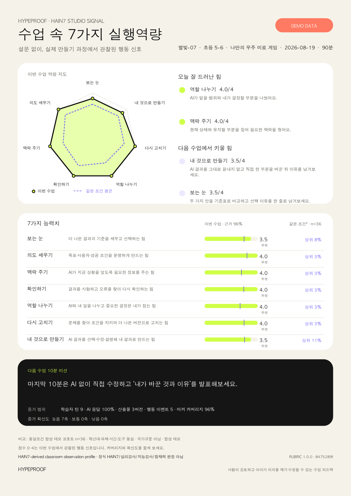

# HypeProof Agent Skills

This directory is the public source of truth for Agent Skills maintained with
HypeProof Studio. Concrete changes should arrive as reviewed pull requests so
the scoring logic, examples, and runtime copies do not drift.

## HAIN7 Report

[`hain7-report`](./hain7-report/) turns an HP Studio lesson log into an
evidence-cited, one-page classroom observation profile across seven capabilities.
It works from the learner's prompts, actions, checks, and artifact versions—no
separate survey is required.

- Open the [skill instructions](./hain7-report/SKILL.md).
- Claude Code invokes the installed skill as `/hain7-report`; Codex uses
  `$hain7-report`.
- Keep the deterministic scorer, 28-marker rubric, cohort gates, and disclaimer
  intact across runtimes.
- Use only synthetic data in public issues and pull requests. Never upload a
  child's raw session log, name, or contact information.

Installation and portability details are in
[`runtime-compatibility.md`](./hain7-report/references/runtime-compatibility.md).
For improvements, open a GitHub issue describing the observed problem and submit
a focused pull request with a synthetic regression case when possible.
